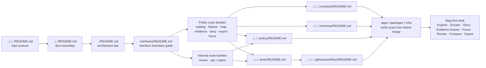

<!-- [KFM_META_BLOCK_V2]
doc_id: kfm://doc/<NEEDS_VERIFICATION__uuid>
title: interfaces
type: standard
version: v1
status: draft
owners: @bartytime4life
created: <NEEDS_VERIFICATION__YYYY-MM-DD>
updated: <NEEDS_VERIFICATION__YYYY-MM-DD>
policy_label: <NEEDS_VERIFICATION__public|restricted|...>
related: [../README.md, ../../README.md, ../../../README.md, ../../governance/README.md, ../../standards/README.md, ../../runbooks/README.md, ../../templates/README.md, ../../../contracts/README.md, ../../../schemas/README.md, ../../../policy/README.md, ../../../tests/README.md, ../../../.github/workflows/README.md]
tags: [kfm, architecture, interfaces]
notes: [Current public main shows this directory as a README-only scaffold lane; owner is inherited from /docs/ CODEOWNERS; doc_id, dates, and policy_label still need direct branch verification.]
[/KFM_META_BLOCK_V2] -->

# interfaces

Architecture-facing index for governed interface boundaries, route-family documentation, and contract pointers in Kansas Frontier Matrix.

> **Status:** experimental  
> **Doc status:** draft  
> **Owners:** `@bartytime4life` *(confirmed at the broad `/docs/` ownership level; no narrower `interfaces/` owner was separately verified)*  
>       
> **Quick jumps:** [Scope](#scope) · [Repo fit](#repo-fit) · [Accepted inputs](#accepted-inputs) · [Exclusions](#exclusions) · [Baseline and evidence basis](#baseline-and-evidence-basis) · [Current verified snapshot](#current-verified-snapshot) · [Directory tree](#directory-tree) · [Quickstart](#quickstart) · [Usage](#usage) · [Diagram](#diagram) · [Reference tables](#reference-tables) · [Task list](#task-list--definition-of-done) · [FAQ](#faq) · [Appendix](#appendix)  
> **Repo fit:** `docs/architecture/interfaces/README.md` → upstream: [`../README.md`](../README.md) · [`../../README.md`](../../README.md) · [`../../../README.md`](../../../README.md) · adjacent machine surfaces: [`../../../contracts/README.md`](../../../contracts/README.md) · [`../../../schemas/README.md`](../../../schemas/README.md) · [`../../../policy/README.md`](../../../policy/README.md) · [`../../../tests/README.md`](../../../tests/README.md) · [`../../../.github/workflows/README.md`](../../../.github/workflows/README.md)

> [!IMPORTANT]
> `docs/architecture/interfaces/` is an architecture-facing documentation lane, not the canonical home of OpenAPI, JSON Schema, policy bundles, workflow gates, or runtime code.
> On current public `main`, this directory is still README-only.
> Keep boundary law, route-family explanation, and proof burden visible here without inventing a mounted endpoint tree or silently upgrading placeholder paths into implementation reality.

## Scope

`docs/architecture/interfaces/` is the documentation lane for **how KFM surfaces and route families are supposed to meet**: public versus internal boundaries, shell-to-API mediation, evidence-resolution expectations, finite runtime outcomes, and trust obligations at the edge.

Use this directory for:

- architecture-facing notes that explain governed route families and their boundary profiles
- interface registries or matrices that point reviewers from surfaces to contracts, policy, tests, and workflow gates
- shell-to-governed-API mediation notes for surfaces such as Explore, Dossier, Story, Evidence Drawer, Focus, Review, Compare, and Export
- reviewer-friendly examples of envelopes, negative outcomes, and evidence drill-through behavior, as long as they stay clearly downstream of machine-readable truth
- diagrams that show mediation, trust boundaries, and audit/explanation joins

Do **not** treat this directory as the place where interface truth becomes executable. That work belongs in the owning machine surfaces.

[Back to top](#interfaces)

## Repo fit

| Field | Value |
| --- | --- |
| Path | `docs/architecture/interfaces/README.md` |
| Directory role | Index for architecture-facing interface law, route-family explanation, and contract/policy/test pointers |
| Primary upstream anchors | [`../README.md`](../README.md), [`../../README.md`](../../README.md), [`../../../README.md`](../../../README.md), [`../../governance/README.md`](../../governance/README.md), [`../../standards/README.md`](../../standards/README.md), [`../../runbooks/README.md`](../../runbooks/README.md), [`../../templates/README.md`](../../templates/README.md) |
| Adjacent sibling lanes | [`../decisions/README.md`](../decisions/README.md), [`../diagrams/README.md`](../diagrams/README.md) |
| Architecture-adjacent machine surfaces | [`../../../contracts/README.md`](../../../contracts/README.md), [`../../../schemas/README.md`](../../../schemas/README.md), [`../../../policy/README.md`](../../../policy/README.md), [`../../../tests/README.md`](../../../tests/README.md), [`../../../.github/workflows/README.md`](../../../.github/workflows/README.md) |
| Current public-main posture | Directory exists and currently renders as `README.md` only |
| Why this directory matters | KFM’s trust membrane is not fully reviewable unless interface boundaries stay legible without turning prose into a second truth path |

### Repo relationship map

Architecture docs sit between doctrine and execution:

- the repo root explains project identity and top-level posture
- `docs/` explains the documentation plane
- `docs/architecture/` explains system law and cross-cutting boundary logic
- `docs/architecture/interfaces/` explains **how governed surfaces are supposed to meet**
- `contracts/`, `schemas/`, `policy/`, `tests/`, and `.github/workflows/` carry machine-facing proof and control surfaces
- runtime code and deployments remain downstream implementation, not authoritative interface prose

## Accepted inputs

| Belongs here | Why it fits |
| --- | --- |
| Route-family maps for public and internal governed APIs | They help reviewers understand surface classes without pretending exact endpoints are already verified |
| Boundary notes for evidence resolution, export, Focus, review, and ops/status surfaces | These are interface-law topics before they are code topics |
| Architecture-facing registries that map a surface to its owning contract, policy, test, and workflow lanes | This directory is a pointer surface, not a duplication surface |
| Shell-mediation notes that explain how the map-first shell reaches governed APIs | KFM makes shell continuity and API mediation trust-bearing |
| Reviewer-friendly request/response or envelope examples labeled as illustrative | They improve reviewability when kept subordinate to machine-readable definitions |
| Diagrams of request flow, evidence drill-through, and negative outcomes | They clarify control points and trust obligations |

## Exclusions

| Do not put this here | Keep it instead |
| --- | --- |
| Canonical OpenAPI, JSON Schema, vocabularies, or envelope definitions | [`../../../contracts/README.md`](../../../contracts/README.md) and [`../../../schemas/README.md`](../../../schemas/README.md) |
| Policy rule bodies, reason/obligation registries, executable deny-by-default logic | [`../../../policy/README.md`](../../../policy/README.md) |
| Merge-blocking workflow logic, required checks, promotion pipelines | [`../../../.github/workflows/README.md`](../../../.github/workflows/README.md) |
| Runtime DTOs, gateway config, middleware, service adapters, shell code | Owning runtime surfaces and packages |
| Exact endpoint inventories or auth wiring that have not been branch-inspected | Keep them visibly `PROPOSED`, `UNKNOWN`, or `NEEDS VERIFICATION` until directly rechecked |
| Generated receipts, proof packs, release artifacts, or correction objects | Owning data / release / governance surfaces |

## Baseline and evidence basis

### Baseline document

- **INFERRED / collective baseline:** no substantive in-directory baseline exists yet on current public `main`; the working baseline for this README is therefore collective:
  - [`../README.md`](../README.md) supplies the immediate architecture-lane rules
  - [`../../README.md`](../../README.md) supplies the broader docs-plane posture
  - [`../../templates/TEMPLATE__KFM_UNIVERSAL_DOC.md`](../../templates/TEMPLATE__KFM_UNIVERSAL_DOC.md) supplies the standardized KFM doc scaffold
  - KFM doctrine manuals supply the route-family, governed-API, evidence-resolution, and finite-outcome obligations this directory should make reviewable

### Evidence used in this revision

| Evidence layer | What it contributed |
| --- | --- |
| Current public repo surface | Confirmed this directory exists, currently contains `README.md` only, and sits beneath a substantive `docs/architecture/README.md` |
| Adjacent repo documentation | Confirmed the neighboring documentation rhythm, quick-jump style, directory-tree pattern, and machine-surface boundaries |
| KFM doctrine corpus | Confirmed route families, trust obligations, shell mediation, EvidenceBundle resolution, and finite runtime outcomes |
| Current public `CODEOWNERS` | Confirmed broad `/docs/` ownership by `@bartytime4life` |

### Truth labels used in this document

| Label | Use it when |
| --- | --- |
| `CONFIRMED` | Directly supported by current public-repo fetches or stable KFM doctrine |
| `INFERRED` | Conservative structural completion supported by repeated project signals |
| `PROPOSED` | A recommended documentation or implementation move not yet proven as live repo reality |
| `UNKNOWN` | Not verified strongly enough to present as current fact |
| `NEEDS VERIFICATION` | A concrete check should still happen before the claim is treated as current branch truth |

## Current verified snapshot

| Signal | Status | Working interpretation |
| --- | --- | --- |
| `docs/architecture/interfaces/README.md` exists on current public `main` | `CONFIRMED` | The path is real |
| The current file body is still scaffold-grade | `CONFIRMED` | This README should fill the lane without pretending the lane was already mature |
| Parent `docs/architecture/README.md` classifies `interfaces/README.md` as a scaffold starter lane | `CONFIRMED` | The directory is reserved and named, but not yet fully authored |
| The current public subtree under `docs/architecture/interfaces/` shows `README.md` only | `CONFIRMED` | No child interface notes are currently claimed here |
| `/docs/` ownership maps to `@bartytime4life` in current `CODEOWNERS` | `CONFIRMED` | Broad ownership is known; narrower lane ownership still may need branch-local confirmation |
| Exact route names, auth middleware, gateway rules, emitted envelopes, and child interface-doc inventory | `UNKNOWN` / `NEEDS VERIFICATION` | Do not document them as live repo facts yet |

> [!NOTE]
> The parent architecture README explicitly warns against treating directly fetched scaffold files as completed architecture law. This README follows that rule: it upgrades the lane into a useful index, but it still keeps mounted implementation gaps visible.

[Back to top](#interfaces)

## Directory tree

### Directly fetched current public-main surface

```text
docs/architecture/interfaces/
└── README.md
```

### Suggested fill pattern for this lane (`PROPOSED`)

```text
docs/architecture/interfaces/
├── README.md
├── <route-family-note>.md
├── <public-vs-internal-boundary>.md
├── <evidence-resolution-note>.md
└── <runtime-envelope-guide>.md
```

### Working interpretation rule

- the tree above has **one** currently confirmed child: `README.md`
- placeholder filenames in the second tree are **doc classes**, not asserted current files
- add a child note only when a real review burden exists and the note can point downstream to contracts, policy, tests, or workflows

## Quickstart

Use a verification-first sequence before editing anything in this directory.

```bash
# 1) Confirm the live subtree first
find docs/architecture/interfaces -maxdepth 3 \( -type f -o -type d \) | sort

# 2) Read the immediate and parent architecture boundaries
sed -n '1,220p' docs/architecture/interfaces/README.md
sed -n '1,260p' docs/architecture/README.md
sed -n '1,220p' docs/README.md

# 3) Re-check the machine-facing neighbors before documenting interface behavior
sed -n '1,220p' contracts/README.md
sed -n '1,220p' schemas/README.md
sed -n '1,220p' policy/README.md
sed -n '1,220p' tests/README.md
sed -n '1,220p' .github/workflows/README.md

# 4) Look for interface-bearing terms before inventing prose
grep -R "EvidenceBundle\|RuntimeResponseEnvelope\|OpenAPI\|route famil" \
  docs contracts schemas policy tests .github/workflows 2>/dev/null | sed -n '1,160p'
```

## Usage

### Reading order for reviewers

1. Read [`../README.md`](../README.md) first for the current architecture boundary map.
2. Read this file next for the interface-lane rule set.
3. Re-check [`../../../contracts/README.md`](../../../contracts/README.md), [`../../../schemas/README.md`](../../../schemas/README.md), [`../../../policy/README.md`](../../../policy/README.md), [`../../../tests/README.md`](../../../tests/README.md), and [`../../../.github/workflows/README.md`](../../../.github/workflows/README.md) before treating any interface statement as enforceable.
4. Treat exact routes, exact payloads, and exact workflow gates as unverified until the mounted branch proves them.

### Authoring rules for this lane

1. Start at the **route-family** level unless the active branch proves a narrower claim.
2. Separate **public** from **internal** interfaces; do not collapse them into one comfortingly vague surface.
3. Keep every interface note downstream of:
   - contracts and schemas for machine shape
   - policy for deny/allow/review posture
   - tests for proof burden
   - workflows for merge-blocking or promotion enforcement
4. Name trust obligations explicitly:
   - evidence linkage
   - policy visibility
   - release scope
   - correction lineage
   - finite negative outcomes where relevant
5. Label examples as **illustrative** unless they are copied from verified machine-readable artifacts.
6. When a change affects a route family, envelope, export surface, or Focus behavior, update the related docs in the same governed change stream.

### When an interface note is governed

Treat the edit as governed when it affects any of the following:

- public versus steward-only boundary profiles
- EvidenceRef → EvidenceBundle resolution
- map/tile/portrayal delivery rules
- Focus request/response behavior
- export/report gating
- review, denial, rollback, or correction surfaces
- ops/status exposure that could leak canonical or sensitive state

[Back to top](#interfaces)

## Diagram



## Reference tables

### Route families this directory should be able to explain

| Route family | Primary objects | Boundary profile | What interface docs should keep visible | Current maturity |
| --- | --- | --- | --- | --- |
| Catalog and discovery | release metadata, dataset/distribution discovery, catalog closures, discovery lists | standards-facing; DCAT / STAC / OGC API Records / OpenAPI where relevant | identifier consistency, release scope, discovery posture, link to owning contracts | doctrine `CONFIRMED`; in-directory child docs `UNKNOWN` |
| Feature or subject read | released authoritative features, place dossiers, detail views, claims | standards-facing where fit; KFM-specific where needed | stable subject ID, support/time semantics, rights posture, release scope | doctrine `CONFIRMED`; mounted file inventory beyond this README `UNKNOWN` |
| Map / tile / portrayal | released maps, tiles, styles, legends, portrayals | public governed surface | freshness, policy posture, release linkage, correction visibility | doctrine `CONFIRMED` |
| Evidence resolution | `EvidenceRef -> EvidenceBundle` and related trust objects | KFM-specific governed API | admissible published scope, rights/sensitivity state, audit linkage | doctrine `CONFIRMED` |
| Story / dossier / compare | narrative and comparison inputs anchored in the same shell | KFM-specific governed API | spatial anchor, temporal anchor, evidence drill-through | doctrine `CONFIRMED` |
| Export and report | public-safe exports, previews, packaged report objects | governed public surface with release references | exports never outrun release state, policy posture, or correction linkage | doctrine `CONFIRMED` |
| Focus / governed assistance | bounded natural-language investigation over released scope | governed public surface with runtime envelope | visible scope, citations, policy outcome, audit linkage, finite outcomes only | doctrine `CONFIRMED`; mounted examples `UNKNOWN` |
| Review / stewardship | moderation, quarantine inspection, approval, denial, rollback, rights handling | internal governed surface only | no hidden approvals; every action emits review or decision artifacts | doctrine `CONFIRMED` |
| Ops / status | health, status, traces, audit joins | internal ops surface | never expose raw canonical data or become a second truth surface | doctrine `CONFIRMED`; exact endpoint set `UNKNOWN` |

### Minimum fields for any future child interface note

| Field | Why it belongs |
| --- | --- |
| Route family or surface family | Prevents vague “API stuff” prose |
| Boundary profile (`public`, `internal`, `steward-only`, or `NEEDS VERIFICATION`) | Keeps trust scope explicit |
| Primary objects | Ties the note to concrete contract families |
| Owning downstream surfaces | Forces links to contracts, schemas, policy, tests, and workflows |
| Negative outcomes | Makes denial / abstention / error behavior reviewable |
| Current evidence boundary | Prevents speculative prose from sounding mounted |

## Task list / definition of done

- [ ] This README keeps current public-main reality (`README.md` only) separate from any proposed future fill pattern.
- [ ] Every future child note names its route family or boundary profile.
- [ ] Every interface-facing doc points downstream to owning contracts, schemas, policy, tests, and workflows.
- [ ] Public and internal surfaces are not collapsed into one ambiguous narrative.
- [ ] Claim-bearing surfaces explicitly name evidence linkage, policy posture, release scope, and correction lineage.
- [ ] Negative outcomes remain finite and visible where a surface can answer, export, deny, or fail.
- [ ] Examples are labeled illustrative unless backed by verified machine-readable artifacts.
- [ ] Relative links resolve from `docs/architecture/interfaces/README.md`.
- [ ] The Mermaid diagram still matches the surrounding repo shape and trust boundary story.
- [ ] No section sounds like an exact endpoint inventory unless the active branch was directly re-inspected.

[Back to top](#interfaces)

## FAQ

### Is this where OpenAPI or JSON Schema should live?

No. This directory explains interface **law** and review burden. Canonical machine-readable shapes belong in [`../../../contracts/README.md`](../../../contracts/README.md) and [`../../../schemas/README.md`](../../../schemas/README.md).

### Should this README document exact routes?

Only when the active branch, machine-readable artifacts, or directly verified runtime evidence prove them. Until then, stay at the route-family or boundary-profile level.

### How is this different from `policy/`?

`policy/` owns executable deny/allow/review logic. `docs/architecture/interfaces/` should explain where that logic bites at interface boundaries and what reviewers should expect to see.

### How is this different from `tests/` or `.github/workflows/`?

`tests/` proves behavior and `.github/workflows/` can gate it. This directory should explain **what** is supposed to be proven and **why that proof matters** at the boundary.

### Does Focus belong in this lane?

Yes, but as a governed interface family, not as a free-form assistant playground. Interface docs here should keep Focus subordinate to evidence resolution, policy checks, citation visibility, and finite runtime outcomes.

### Can I add a child doc before the runtime exists?

Yes, when the boundary is architecture-significant and the note keeps its claims qualified. A good child note clarifies trust obligations early; a bad one invents implementation certainty.

## Appendix

<details>
<summary><strong>Suggested future child-doc classes for this lane (PROPOSED)</strong></summary>

| Candidate doc class | Add it when | Keep it out of trouble by |
| --- | --- | --- |
| Route-family overview | more than one contributor needs a stable explanation of a family such as export, evidence resolution, or Focus | linking to contracts/policy/tests instead of copying them |
| Public-vs-internal boundary note | a surface risks mixing public and steward-only capabilities | naming actor scope and explicit trust boundary |
| Evidence-resolution interface note | reviewers need one place to understand `EvidenceRef -> EvidenceBundle` mediation | keeping machine shape downstream of contracts |
| Runtime envelope guide | mounted examples or verified schema references exist | clearly labeling illustrative versus canonical examples |
| Shell-to-API mediation note | UI or map-shell work starts changing Explore, Dossier, Story, Review, Compare, Export, or Focus behaviors | preserving shell-owned state versus truth-bearing state |

</details>

<details>
<summary><strong>Review questions lifted from the doctrine and adapted for this directory</strong></summary>

1. What route family is being described, and which plane owns it?
2. Which contracts, policy bundles, tests, and workflow gates must exist before this surface can answer or publish?
3. What visible negative outcome appears when policy or evidence blocks completion?
4. Does the note preserve public-vs-internal separation?
5. Does the prose stay at architecture level unless machine truth was directly verified?

</details>

[Back to top](#interfaces)
