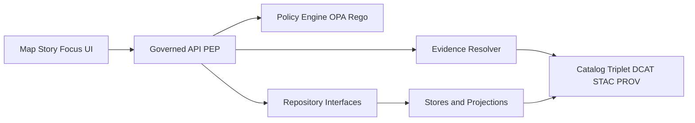

<!-- [KFM_META_BLOCK_V2]
doc_id: kfm://doc/4a5a1b72-0f91-4c0b-a0b8-1c1e9ddc6c3a
title: Interfaces
type: standard
version: v1
status: draft
owners: @kfm-architecture @kfm-platform
created: 2026-03-04
updated: 2026-03-04
policy_label: public
related: [docs/architecture/README.md, contracts/, policy/, packages/, apps/]
tags: [kfm, architecture, interfaces, contracts, governance, policy, evidence]
notes: ["Docs are a production surface. This directory defines interface contracts and the trust membrane boundaries."]
[/KFM_META_BLOCK_V2] -->

# Interfaces
Contracts and interface specifications that define how KFM components communicate **across governance boundaries** (policy, evidence, provenance), without bypassing the trust membrane.

> **Impact**
> - **Status:** draft (normative intent; implementation details may vary)
> - **Owners:** @kfm-architecture, @kfm-platform (TODO: confirm CODEOWNERS)
> - **Applies to:** UI ↔ Governed API, API ↔ Policy Engine, API ↔ Evidence Resolver, Domain ↔ Repositories, Pipelines ↔ Catalog Triplet
> - **Non-negotiable:** clients do **not** access storage/DB directly; access is policy-evaluated at the PEP (Policy Enforcement Point).

<p align="center">
  
  
  
</p>

**Quick nav**
- [Scope](#scope)
- [Where this fits](#where-this-fits)
- [Architecture invariants](#architecture-invariants)
- [Interface surfaces](#interface-surfaces)
- [Inputs](#inputs)
- [Exclusions](#exclusions)
- [Directory tree](#directory-tree)
- [Quickstart](#quickstart)
- [Trust membrane diagram](#trust-membrane-diagram)
- [Interface registry](#interface-registry)
- [How to add or change an interface](#how-to-add-or-change-an-interface)
- [Definition of done](#definition-of-done)
- [FAQ](#faq)
- [Appendix](#appendix)

---

## Scope

**CONFIRMED:** KFM’s “trust membrane” requires that **clients never access storage/DB directly** and that governed access is enforced at a **Policy Enforcement Point (PEP)**.  
**CONFIRMED:** KFM’s domain logic should not talk directly to infrastructure; it talks through **interfaces** (contracts + repository interfaces + adapters).  
**PROPOSED:** This directory is the canonical *documentation surface* for those interfaces, with stable naming, versioning, and “test-enforced” invariants.

This folder answers:

- **What is the interface?** (purpose, producer/consumer, allowed actions)
- **What is the contract?** (schema, OpenAPI/GraphQL, event schema, DTOs)
- **What are the gates?** (policy checks, schema validation, reproducibility, receipts)
- **What is the evidence boundary?** (how EvidenceRefs resolve to EvidenceBundles)
- **What is explicitly forbidden?** (bypassing policy, direct DB access, leaking sensitive coordinates)

[Back to top](#interfaces)

---

## Where this fits

**CONFIRMED (architecture intent):** KFM’s truth path and runtime surfaces flow:

Upstream → RAW → WORK/QUARANTINE → PROCESSED → CATALOG (DCAT+STAC+PROV + run receipts) → projections → Governed API (PEP) → UI (Map/Story/Focus)

This directory sits in `docs/architecture/` and provides **interface-level contracts** that link:

- runtime access (API/UI) to
- policy enforcement (OPA/Rego) and
- evidence/provenance (Evidence Resolver + Catalog Triplet).

**UNKNOWN:** The current repository may already contain additional interface docs elsewhere (e.g., `contracts/`, `apps/api/`, `packages/*`).  
**Verification steps:** see [Directory tree](#directory-tree) and [How to add or change an interface](#how-to-add-or-change-an-interface).

[Back to top](#interfaces)

---

## Architecture invariants

### Trust membrane
**CONFIRMED:** Clients do not access storage directly; all access is policy-evaluated at the PEP.  
**CONFIRMED:** Policy is **default-deny** with tests that block merges.  
**CONFIRMED:** Published surfaces only serve *promoted* dataset versions that have processed artifacts, validated catalogs, run receipts, and policy labels.

### Contract-first
**CONFIRMED (intent):** Treat OpenAPI as a **contract-first** artifact (schemas/DTOs are part of governance).  
**PROPOSED:** Every interface defined here must have:
- an authoritative contract artifact reference (OpenAPI file, JSON Schema, event schema), and
- a test gate reference (CI job, policy pack, validator).

### Evidence-first
**CONFIRMED (intent):** Citations must resolve to EvidenceBundles; citation verification is a hard gate (cite-or-abstain).  
**CONFIRMED (runtime gate):** Story/Focus publishing must require citations resolvable via `/api/v1/evidence/resolve` (or equivalent governed endpoint).

[Back to top](#interfaces)

---

## Interface surfaces

This directory is organized around interface “surfaces” (boundary types). Each surface has different failure modes and different governance requirements.

| Surface | Producer → Consumer | Contract type | Must be policy-gated | Must emit receipts |
|---|---|---:|---:|---:|
| UI API | Web UI → Governed API | OpenAPI + DTOs | ✅ | ✅ (queries, story publishes) |
| Policy | Governed API → OPA/Rego | policy input schema | ✅ (default-deny) | ✅ (decisions + obligations) |
| Evidence | API → Evidence Resolver | EvidenceRef/EvidenceBundle schema | ✅ | ✅ (resolution runs) |
| Repositories | Domain/Use cases → Storage adapters | interface definitions | ✅ (deny direct infra access) | ✅ (run receipts for writes) |
| Catalog | Pipelines → Catalog triplet | DCAT/STAC/PROV | ✅ (Promotion Contract) | ✅ (promotion receipts) |
| Telemetry | Services → Telemetry sink | event schema | ✅ (PII-free; bounded) | ✅ (operational traceability) |

**PROPOSED rule of thumb:** if it crosses a boundary where policy could apply, it belongs here (or is referenced from here).

[Back to top](#interfaces)

---

## Inputs

Acceptable inputs for `docs/architecture/interfaces/`:

- **CONFIRMED (architecture docs):**
  - Interface descriptions aligned to the trust membrane
  - Contract references: OpenAPI fragments, DTO schemas, policy input/output shape
  - Evidence Resolver contract: EvidenceRef → EvidenceBundle
  - Promotion Contract gate mapping (what interfaces must exist for promotion)

- **PROPOSED (additive, reversible):**
  - Interface inventory tables
  - Mermaid diagrams (boundary diagrams, sequence flows)
  - “How to test” snippets (explicitly labeled runnable vs pseudocode)

[Back to top](#interfaces)

---

## Exclusions

What must **not** go here:

- Implementation code (belongs in `apps/`, `packages/`, `tools/`, etc.).
- Full copies of schemas that already live in `contracts/` (link to them; do not duplicate).
- Any guidance that enables targeting of sensitive or vulnerable locations.
- Unverifiable claims about what *exists* in the repo today.

**Rule:** If you are not certain something exists, label it **UNKNOWN** and list verification steps.

[Back to top](#interfaces)

---

## Directory tree

**UNKNOWN:** Actual contents of `docs/architecture/interfaces/` in your working tree.  
**PROPOSED:** Target layout for this directory:

```text
docs/architecture/interfaces/
├── README.md                       # this file
├── ui_to_api.md                    # UI ↔ Governed API interface (OpenAPI/GraphQL pointers)
├── api_to_policy.md                # API ↔ OPA/Rego interface (input shape, obligations)
├── api_to_evidence_resolver.md     # EvidenceRef resolution contract
├── domain_repository_ports.md      # Domain ↔ repository interfaces (ports/adapters)
├── catalog_triplet_contract.md     # DCAT/STAC/PROV cross-linking and EvidenceRefs
└── telemetry_events.md             # Interface-level telemetry schema pointers
```

**Minimum verification steps (to make CONFIRMED):**
1. `ls docs/architecture/interfaces/`
2. `rg -n "evidence/resolve|EvidenceBundle|PEP|trust membrane" docs/architecture contracts policy`
3. Confirm where OpenAPI/GraphQL contracts actually live (likely `contracts/`).

[Back to top](#interfaces)

---

## Quickstart

All commands below are **PSEUDOCODE** (adjust to your repo tooling). They are included to make the intent concrete without inventing your exact scripts.

```bash
# PSEUDOCODE: validate interface-linked contracts
# 1) OpenAPI lint / schema validation
make contracts-openapi-validate

# 2) Policy tests (default-deny, fail-closed)
make policy-test

# 3) Evidence resolver contract tests (EvidenceRef -> EvidenceBundle)
make evidence-contract-test

# 4) Linkcheck docs (ensure contract references are not broken)
make docs-linkcheck
```

[Back to top](#interfaces)

---

## Trust membrane diagram



**CONFIRMED meaning:** policy enforcement and evidence resolution happen at the governed boundary, not inside the UI and not by direct access to stores.

[Back to top](#interfaces)

---

## Interface registry

**PROPOSED:** Maintain a lightweight registry so interface changes are reviewable and testable.

| Interface ID | Producer | Consumer | Contract artifact | Policy gate | Evidence required | Status |
|---|---|---|---|---|---|---|
| IF-UI-API-001 | UI | Governed API | `contracts/openapi/...` (TODO) | OPA runtime checks | query run receipt | UNKNOWN |
| IF-API-POL-001 | Governed API | OPA/Rego | `policy/rego/...` (TODO) | policy tests in CI | decision + obligations | UNKNOWN |
| IF-API-EVD-001 | Governed API | Evidence Resolver | EvidenceResolveRequest/EvidenceBundle DTOs | deny by default | resolvable EvidenceRefs | UNKNOWN |
| IF-DOM-REP-001 | Use cases | Repositories | port interfaces (language-specific) | deny direct infra calls | write receipts | UNKNOWN |
| IF-PROMO-001 | Pipelines | Catalog Triplet | DCAT/STAC/PROV profiles | Promotion Contract | cross-links resolve | UNKNOWN |

**UNKNOWN → CONFIRMED steps:**
- For each row, replace `(TODO)` with an actual path in the repo and add the CI job that enforces it.

[Back to top](#interfaces)

---

## How to add or change an interface

1. **Define the boundary**
   - **CONFIRMED:** Identify producer/consumer and the policy boundary (does it cross the PEP?).
2. **Write/Update the contract**
   - OpenAPI/GraphQL schema, JSON Schema, or documented input/output shapes.
3. **Add gates**
   - **CONFIRMED (intent):** policy tests must run in CI and block merges.
   - Schema validators must run and fail closed.
4. **Wire evidence + receipts**
   - **CONFIRMED (intent):** citations must resolve to EvidenceBundles or the system abstains.
   - Add run receipts for interface-affecting operations (queries, promotions, publishes).
5. **Update the registry**
   - Add/modify the interface row in [Interface registry](#interface-registry).
6. **Add an ADR when the change is structural**
   - **PROPOSED:** If the interface changes the trust membrane or promotion contract, record an ADR under `docs/architecture/adr/`.

[Back to top](#interfaces)

---

## Definition of done

An interface doc/change is “done” when:

- [ ] **CONFIRMED:** It does not allow bypassing the trust membrane (no direct client → storage path).
- [ ] Contract artifact exists and is referenced (OpenAPI/Schema/Event spec).
- [ ] CI gate exists and is fail-closed (schema validation, policy tests, link checks).
- [ ] Evidence semantics are explicit (EvidenceRef kinds, resolution rules).
- [ ] Receipts/telemetry expectations are defined (what is logged; what is prohibited).
- [ ] Registry entry updated with real paths + status.
- [ ] Any new vocabulary is versioned (controlled list if needed).

[Back to top](#interfaces)

---

## FAQ

**Is this directory “the source of truth” for contracts?**  
**PROPOSED:** It is the *documentation index* for contracts. The authoritative artifacts typically live in `contracts/` and `policy/`; this folder explains how they connect and what invariants they enforce.

**Can I add implementation guidance here?**  
Yes, but keep it interface-focused and non-invasive. Anything code-heavy belongs with the code.

**What if I’m unsure whether a contract exists already?**  
Label the claim **UNKNOWN** and add the smallest verification steps needed to make it **CONFIRMED**.

[Back to top](#interfaces)

---

## Appendix

<details>
<summary><strong>Interface spec template (copy/paste)</strong></summary>

Use this template for `docs/architecture/interfaces/<name>.md`.

```markdown
<!-- [KFM_META_BLOCK_V2]
doc_id: kfm://doc/<uuid>
title: <Interface name>
type: standard
version: v1
status: draft
owners: <owners>
created: 2026-03-04
updated: 2026-03-04
policy_label: public
related: [contracts/, policy/, packages/, apps/]
tags: [kfm, interface, contract]
notes: ["Contract-first. Deny-by-default."]
[/KFM_META_BLOCK_V2] -->

# <Interface name>

## Purpose
- CONFIRMED / PROPOSED / UNKNOWN: <one paragraph>

## Producer and consumer
- Producer:
- Consumer:

## Contract
- Contract artifact path:
- Versioning rules:
- Backward compatibility:

## Policy and obligations
- Decision points:
- Obligations (if any):

## Evidence semantics
- EvidenceRef kinds:
- EvidenceBundle fields:

## Telemetry and receipts
- Events emitted:
- Run receipt fields:

## Tests and gates
- CI jobs:
- Validators:
- Policy tests:

## Change log
- v1: initial
```

</details>

<details>
<summary><strong>Glossary</strong></summary>

- **PEP:** Policy Enforcement Point (governed boundary that evaluates policy before serving responses).
- **EvidenceRef:** A resolvable reference to evidence (dataset versions, catalogs, runs).
- **EvidenceBundle:** The resolved evidence payload, including policy decision and citation cards.
- **Catalog Triplet:** DCAT + STAC + PROV cross-linked metadata surface for discovery and provenance.

</details>
