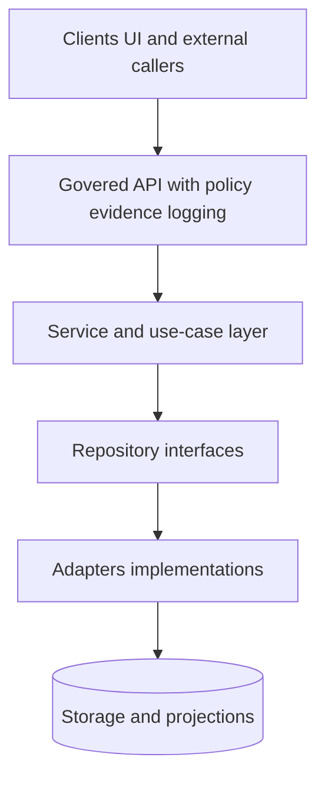

<!-- [KFM_META_BLOCK_V2]
doc_id: kfm://doc/8f4a6c2a-0f5c-4c5c-b4e1-ec9c7c585e44
title: Repository Layer Contract
type: standard
version: v1
status: draft
owners: kfm-platform,kfm-api
created: 2026-03-04
updated: 2026-03-04
policy_label: restricted
related:
  - docs/architecture/README.md
  - docs/governance/ROOT_GOVERNANCE.md
tags: [kfm, architecture, interfaces, repository-layer, contract]
notes:
  - "Normative terms use RFC 2119 style MUST/SHOULD/MAY."
  - "Requirements are labeled CONFIRMED/PROPOSED/UNKNOWN per evidence discipline."
[/KFM_META_BLOCK_V2] -->

# Repository Layer Contract
One-line purpose: Define the **repository layer boundary** so KFM core logic stays storage-agnostic and policy/provenance are enforceable.

---

## Impact
- **Status:** draft
- **Owners:** `kfm-platform`, `kfm-api` (TODO: map to GitHub teams)
- **Applies to:** Backend services, adapters, and any code that reads/writes storage on behalf of governed APIs

 <!-- TODO: replace with repo badge -->
 <!-- TODO -->
 <!-- TODO -->

**Quick nav**
- [Scope](#scope)
- [Where it fits](#where-it-fits)
- [Status legend](#status-legend)
- [Non-negotiable invariants](#non-negotiable-invariants)
- [Contract](#contract)
- [Reference shapes](#reference-shapes)
- [Enforcement](#enforcement)
- [Change discipline](#change-discipline)
- [Unknowns and verification steps](#unknowns-and-verification-steps)
- [Appendix](#appendix)

---

## Scope

### In scope
- Repository **interfaces** (ports) consumed by service/use-case code.
- Repository **implementations** (adapters) that talk to PostGIS, Neo4j, object storage, search, tiles, etc.
- Cross-cutting expectations: error taxonomy, determinism, pagination, observability, and evidence hooks.

### Out of scope
- HTTP routing, authN/authZ at the edge (belongs to governed API layer).
- UI concerns.
- Data modeling rules inside PostGIS/Neo4j (belongs to storage-specific design docs).
- ETL pipeline lane contracts (handled by pipeline/promotion contracts).

---

## Where it fits

### Conceptual placement
KFM follows a layered architecture where the **service/use-case layer** calls **interfaces/abstract repositories**, and the **integration layer** provides concrete repository classes/adapters for databases and external systems.



### Repo placement (PROPOSED)
- `docs/architecture/interfaces/REPOSITORY_LAYER_CONTRACT.md` (this file)
- Repository interfaces live near service code (example: `api/services/interfaces/...` or `core/ports/...`).
- Adapter implementations live in infra/integration modules (example: `api/adapters/...` or `api/db/...`).

> NOTE: Exact module paths are **UNKNOWN** until a repo reality check is completed (see [Unknowns and verification steps](#unknowns-and-verification-steps)).

---

## Status legend
- **[CONFIRMED]** Backed by an existing KFM blueprint/design document.
- **[PROPOSED]** Recommended contract detail that is consistent with KFM goals but not yet explicitly codified.
- **[UNKNOWN]** Not verified against repo reality or not yet decided.

---

## Non-negotiable invariants

- **[CONFIRMED] Trust membrane:** Clients never access storage/DB directly; backend logic uses repository interfaces; all access goes through governed APIs applying policy, redaction, and logging.
- **[CONFIRMED] Service/use-case storage-agnosticism:** Service/use-case logic must not depend on concrete database drivers or storage implementation details; it calls interfaces/abstract repositories.
- **[CONFIRMED] Adapters implement interfaces:** Database/API adapters implement interfaces defined/expected by the service layer and keep credentials/config separate from core logic.

---

## Contract

### 1) Boundary rules

- **[CONFIRMED]** Service/use-case code **MUST** depend on repository **interfaces**, not concrete storage clients.
- **[PROPOSED]** Repository interfaces **MUST NOT** leak storage-native concepts that couple callers to a specific backend (e.g., raw SQL strings, Cypher fragments, ORM sessions/cursors).
- **[PROPOSED]** Adapter implementations **MAY** use any storage-native constructs internally, but those constructs **MUST NOT** cross the interface boundary.

### 2) Responsibility split

| Capability | Service/use-case layer | Repository interface | Adapter implementation |
|---|---|---|---|
| Orchestrate business workflow | **MUST** | MUST NOT | MUST NOT |
| Decide what to query | **MUST** | SHOULD (via query objects) | SHOULD (translate to backend query) |
| Storage connection/session mgmt | MUST NOT | MUST NOT | **MUST** |
| Policy checks/redaction | **PROPOSED:** SHOULD be enforced at governed API boundary | MUST NOT decide policy | **PROPOSED:** MAY apply additional safety hardening (deny by default) |
| Evidence hooks for cite-or-abstain | SHOULD | **PROPOSED:** SHOULD surface EvidenceRef hooks | SHOULD |

### 3) Interface design rules

- **[PROPOSED] Minimal surface:** Repository interfaces should expose only the methods needed by current use-cases (avoid “generic CRUD for everything”).
- **[PROPOSED] Explicit query objects:** For anything beyond trivial `get(id)`, interfaces should accept structured query inputs (bbox/time/filters) rather than free-form strings.
- **[PROPOSED] Deterministic pagination:** For list/query endpoints, return stable pagination using cursor-based paging rather than offset paging.
- **[PROPOSED] Pure domain I/O:** Inputs and outputs should be domain models or DTOs owned by the service layer (not ORM entities).

### 4) Evidence and provenance expectations

- **[CONFIRMED]** KFM runtime surfaces must be able to resolve evidence bundles via governed APIs to support evidence-first UX and cite-or-abstain.
- **[PROPOSED] EvidenceRef plumbing:** Repository read methods **SHOULD** return (or be able to derive) an `EvidenceRef` per returned entity/feature, sufficient for the evidence resolver to produce an `EvidenceBundle`.
- **[PROPOSED] Result metadata:** Repository responses **SHOULD** include `dataset_version_id` (or equivalent) and any digests/locators needed for traceability.

### 5) Error model

- **[PROPOSED]** Repositories **MUST** normalize backend-specific failures into a small, typed error set so services can respond consistently.
- **[PROPOSED]** Errors **MUST** be safe to log (no secrets); include a stable error code and a human message.

Recommended error taxonomy (PROPOSED):
- `NotFound`
- `Conflict`
- `ValidationError`
- `PolicyDenied` (generally produced by governed API/policy layer; repositories shouldn’t decide policy)
- `TransientDependency` (retryable)
- `PermanentDependency` (non-retryable)
- `Timeout`

### 6) Performance and safety

- **[PROPOSED] Timeouts:** Every repository operation **MUST** have an explicit timeout.
- **[PROPOSED] Connection hygiene:** Adapters **MUST** manage sessions/pools and close resources deterministically.
- **[PROPOSED] Parameterization:** Adapters **MUST** use parameterized queries (no string concatenation for SQL/Cypher with user input).
- **[PROPOSED] Backpressure:** For bulk operations, interfaces **SHOULD** support batching/streaming patterns.

### 7) Observability

- **[PROPOSED]** Every repository call **SHOULD** emit:
  - structured logs (op name, duration, backend, success/failure, request_id/trace_id)
  - metrics (latency histogram, error counts)
  - tracing spans (one span per call)

---

## Reference shapes

> The shapes below are **PROPOSED** templates. Adapt names/types to the repo language (Python/TS/etc.).

### Request context
```python
from dataclasses import dataclass
from typing import Optional, Sequence

@dataclass(frozen=True)
class RequestContext:
    request_id: str
    trace_id: Optional[str]
    actor_principal: str
    actor_roles: Sequence[str]
    policy_decision_id: Optional[str]  # minted by governed API/policy layer
```

### Evidence reference
```python
from dataclasses import dataclass
from typing import Optional

@dataclass(frozen=True)
class EvidenceRef:
    dataset_version_id: str
    artifact_digest: Optional[str]      # sha256:...
    locator: Optional[str]             # e.g., row id, feature id, chunk id
```

### Cursor page response
```python
from dataclasses import dataclass
from typing import Generic, List, Optional, TypeVar

T = TypeVar("T")

@dataclass(frozen=True)
class Page(Generic[T]):
    items: List[T]
    next_cursor: Optional[str]
    result_digest: Optional[str]       # optional stable digest of the response set
```

### Example repository interface
```python
from typing import Protocol, Sequence

class ParcelRepository(Protocol):
    def get_by_id(self, ctx: RequestContext, parcel_id: str) -> "Parcel": ...
    def query(self, ctx: RequestContext, spec: "ParcelQuerySpec") -> Page["Parcel"]: ...
    def evidence_for(self, ctx: RequestContext, parcel_id: str) -> EvidenceRef: ...
```

---

## Enforcement

### CI/PR gates (PROPOSED)
- **Architecture boundary tests**
  - Service/use-case modules cannot import DB drivers/ORM packages.
  - Adapters can import drivers, but domain/service cannot.
- **Contract tests**
  - Each adapter implementation must pass a shared test suite for:
    - error normalization
    - pagination invariants
    - timeouts applied
- **Observability checks**
  - Verify logs include request_id and operation name.
  - Verify metrics emitted for success/failure paths.

### “Fail closed” expectations (PROPOSED)
If a repository cannot produce required evidence hooks for a governed endpoint, the endpoint **MUST**:
- return a denied/blocked response OR
- degrade to a generalized output that remains policy-safe

---

## Change discipline

- **[PROPOSED] Additive-first:** Prefer adding methods or adding optional fields to DTOs rather than breaking signatures.
- **[PROPOSED] Versioning:** If a breaking change is unavoidable, introduce `v2` interfaces side-by-side and provide a migration window.
- **[PROPOSED] Rollback path:** Any change that affects storage calls must include a rollback plan and test coverage.

---

## Unknowns and verification steps

### Unknowns
- **[UNKNOWN]** Exact module layout (where interfaces and adapters live).
- **[UNKNOWN]** Concrete evidence reference structure used in runtime entities today (if any).
- **[UNKNOWN]** Whether policy/redaction is enforced strictly at API boundary or partially inside adapters.

### Smallest verification steps to make these CONFIRMED
1. **Repo reality check:** Locate current service modules and adapter modules; record canonical paths.
2. **Dependency audit:** Confirm which DB drivers/clients are used (PostGIS, Neo4j, object store clients).
3. **Add an architecture test:** Enforce “service layer cannot import infra” rule in CI.
4. **Trace one vertical slice:** Pick one governed endpoint and follow it down to storage to confirm evidence/policy placement.

---

## Appendix

### Rationale (why this exists)
KFM’s core architecture depends on a trust membrane and a clean separation between business logic and storage, so policy and provenance can be enforced uniformly and tested as gates.

### Glossary
- **Repository interface (port):** Contract the service layer calls to fetch/persist domain objects.
- **Adapter (implementation):** Storage-specific class that implements a repository interface.
- **Governed API:** The policy boundary that applies auth, policy decisions, redaction/generalization, and logging.

---

Back to top: [Repository Layer Contract](#repository-layer-contract)
