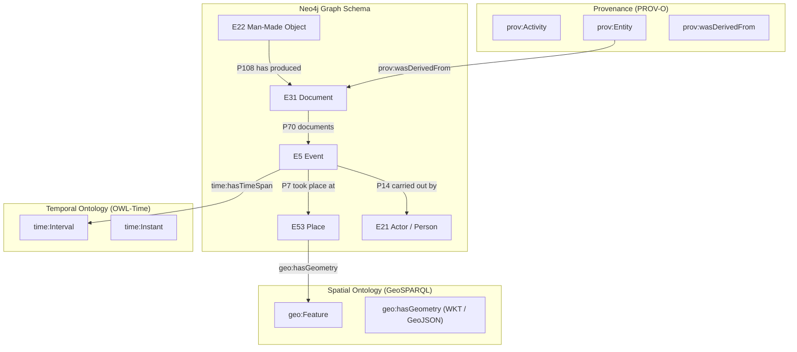
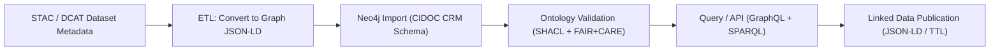

<div align="center">

# 🧠 **Kansas Frontier Matrix — Knowledge Graph Architecture (v2.1.1 · Tier-Ω+∞ Certified)**  
`docs/architecture/knowledge-graph.md`

**Mission:** Define the **semantic knowledge graph architecture** of the **Kansas Frontier Matrix (KFM)** —  
linking datasets, entities, events, places, and documents into a unified, FAIR+CARE-compliant ontology ecosystem.

[](../../docs/)
[](../../src/graph/)
[](../../docs/standards/faircare-validation.md)
[](../../LICENSE)

</div>

---

## 📚 Overview

The **KFM Knowledge Graph** is the semantic backbone of the system — enabling data integration, temporal reasoning, and  
cross-domain discovery across historical, environmental, and cultural datasets.  

It harmonizes **spatial, temporal, and cultural semantics** using a unified ontology composed of:
- **CIDOC CRM** — Cultural heritage ontology for entities, events, and documents.  
- **OWL-Time** — Temporal ontology for event intervals and instants.  
- **GeoSPARQL** — Geospatial ontology for spatial reasoning and geometry handling.  
- **PROV-O** — Provenance ontology for dataset derivations and AI pipelines.  

---

## 🧩 Graph Architecture Overview


<!-- END OF MERMAID -->

---

## 🧱 Graph Schema Definition

| Entity Type | CIDOC CRM Class | Description | Example |
|:--|:--|:--|:--|
| **Person / Actor** | `E21_Person` | Individual or group associated with an event. | “Surveyor John Wesley Powell” |
| **Place** | `E53_Place` | Geospatial location (county, watershed, or site). | “Douglas County, KS” |
| **Event** | `E5_Event` | Occurrence in space and time. | “Flood of 1951” |
| **Document** | `E31_Document` | Text or map describing an event. | “FEMA Damage Assessment Report” |
| **Dataset** | `E73_Information_Object` | Digital dataset or collection. | “NOAA Storm Events Database” |
| **Object** | `E22_Man-Made_Object` | Physical or digital artifact. | “Topographic Map (1905)” |
| **Geometry** | `geo:Feature` | Spatial geometry object (point, line, polygon). | GeoJSON geometry |
| **Time Interval** | `time:Interval` | Start and end date span. | `1951-07-01` to `1951-07-10` |

---

## 🧮 Ontology Alignment

| Ontology | Domain | Integration Role |
|:--|:--|:--|
| **CIDOC CRM** | Cultural / Historical data | Primary schema backbone |
| **OWL-Time** | Temporal reasoning | Event duration and sequencing |
| **GeoSPARQL** | Geospatial semantics | Geometry and topology linking |
| **PROV-O** | Data provenance | Derivation and workflow lineage |
| **STAC/DCAT** | Metadata exchange | Crosswalk from datasets to graph nodes |

---

## ⚙️ Graph Implementation (Neo4j)

| Aspect | Implementation | Validation |
|:--|:--|:--|
| **Database** | Neo4j 5.x (property graph model) | Schema constraints in `schema.cypher` |
| **Modeling Language** | Cypher + APOC procedures | Validated in CI via `graph-validate.yml` |
| **Ontology Import** | RDF → Property Graph ETL | `src/graph/load_ontology.py` |
| **Exports** | JSON-LD, TTL, GraphML | FAIR+CARE compliance export tests |
| **Visualization** | Neo4j Bloom + D3.js | Governance-approved schemas |

---

## 🧠 Semantic Data Flow


<!-- END OF MERMAID -->

---

## 🔍 Example Cypher Patterns

### Entity and Event Relationship
```cypher
MATCH (p:E21_Person)-[:PARTICIPATED_IN]->(e:E5_Event)
RETURN p.name, e.label, e.start_date, e.end_date
LIMIT 10;
```

### Provenance Chain
```cypher
MATCH (d:E31_Document)-[:PROV_WAS_DERIVED_FROM]->(src:E73_Information_Object)
RETURN d.title, src.title, src.source_url;
```

### Temporal Query
```cypher
MATCH (e:E5_Event)-[:HAS_TIME_SPAN]->(t:TimeInterval)
WHERE t.start >= date("1950-01-01") AND t.end <= date("1951-12-31")
RETURN e.label, t.start, t.end;
```

---

## ⚖️ FAIR + CARE Alignment

| Principle | Implementation | Artifact |
|:--|:--|:--|
| **Findable** | Indexed via Neo4j full-text and STAC IDs. | `src/graph/schema.cypher` |
| **Accessible** | JSON-LD + REST/GraphQL endpoints. | `/api/v1/graph/` |
| **Interoperable** | RDF mapping via CIDOC CRM, OWL-Time, GeoSPARQL. | `docs/architecture/ontology/` |
| **Reusable** | Versioned graph exports + checksums. | `releases/v*/manifest.zip` |
| **Collective Benefit (CARE)** | Ontology designed with cultural stewardship and transparency. | `data/stac/*properties.data_ethics` |

---

## 🧩 Governance Integration

| Workflow | Purpose | Output |
|:--|:--|:--|
| `ontology-validate.yml` | Verifies RDF → Neo4j mapping conformance. | `reports/validation/ontology_validation_report.json` |
| `faircare-validate.yml` | Assesses ethical ontology alignment. | `reports/fair/data_care_assessment.json` |
| `governance-ledger.yml` | Registers ontology version and checksum. | `data/reports/audit/data_provenance_ledger.json` |

---

## 🧾 Version History

| Version | Date | Author | Summary |
|:--|:--|:--|:--|
| **v2.1.1** | 2025-11-16 | @kfm-architecture | Added detailed ontology alignment, FAIR+CARE governance mapping, and CI workflows. |
| v2.0.0 | 2025-10-25 | @kfm-graph | Introduced Neo4j ontology schema and CIDOC CRM adoption. |
| v1.0.0 | 2025-10-04 | @kfm-architecture | Initial graph documentation and ontology integration plan. |

---

<div align="center">

**Kansas Frontier Matrix © 2025**  
*“Knowledge is Context — Provenance is Trust.”*  
📍 `docs/architecture/knowledge-graph.md` — Semantic knowledge graph architecture for the Kansas Frontier Matrix.

</div>

