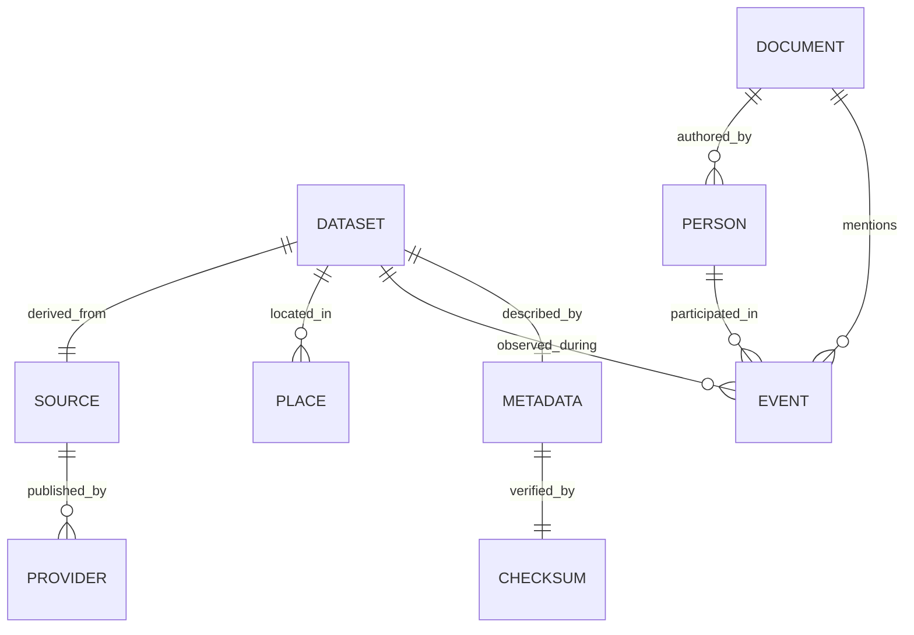

<div align="center">

# 🧠 Kansas Frontier Matrix — Knowledge Graph Architecture  
`docs/architecture/knowledge-graph.md`

**Mission:** Define the **semantic data and knowledge graph architecture** of the  
Kansas Frontier Matrix (KFM) — modeling relationships between datasets, people,  
places, events, and documents to create a time-aware, provenance-tracked, and  
interoperable knowledge system.

[](../../docs/)
[](../../LICENSE)
[](../../.github/workflows/stac-validate.yml)

</div>

---

## 📚 Overview

The **KFM Knowledge Graph** connects the project’s diverse datasets — spatial, tabular, textual,  
and historical — into a unified semantic network.  

It provides:
- 🧩 **Entity linking** across disciplines (people, places, events, data assets)  
- 🧭 **Provenance chains** between data, metadata, and documents  
- 🧠 **Semantic querying** using RDF and SPARQL  
- 🕰️ **Temporal reasoning** for time-aware event and dataset modeling  
- 🌍 **Ontology alignment** with CIDOC CRM, OWL-Time, and STAC metadata  

This architecture transforms KFM from a static dataset repository into a **semantic knowledge base** for research and discovery.

---

## 🧱 High-Level Knowledge Graph Architecture

```mermaid
graph TD
  A["📜 Documents & Texts\n(data/processed/text/)"] --> B["🧠 Knowledge Graph Core\n(Neo4j / RDF store)"]
  C["🌎 Spatial Data\n(data/processed/terrain/, hydrology/, landcover/)"] --> B
  D["📊 Tabular Data\n(data/processed/tabular/)"] --> B
  E["⚙️ Metadata & STAC\n(data/stac/, metadata/)"] --> B
  B --> F["🔍 Query Layer\n(SPARQL / GraphQL API)"]
  F --> G["🧭 Visualization\n(web/, knowledge-viewer.js)"]

  style A fill:#fffbea,stroke:#e8a500
  style C fill:#eef8ff,stroke:#0077cc
  style D fill:#ecf9f0,stroke:#33aa33
  style E fill:#f0e8ff,stroke:#8844cc
  style B fill:#fff0f5,stroke:#cc0088
  style F fill:#e8f0ff,stroke:#0066aa
  style G fill:#f7f7f7,stroke:#555
````

<!-- END OF MERMAID -->

---

## 🧩 Graph Components

| Entity Type         | Description                                                    | Examples                                                     | Source                                    |
| :------------------ | :------------------------------------------------------------- | :----------------------------------------------------------- | :---------------------------------------- |
| **Dataset**         | Represents any spatial, tabular, or textual dataset.           | `ks_1m_dem_2018_2020.tif`, `census_population_1860_2020.csv` | `data/processed/`                         |
| **Place**           | Geographic entities like towns, counties, rivers, and regions. | "Topeka", "Kansas River Basin"                               | `data/processed/hydrology/`, `landcover/` |
| **Person**          | Historical figures, scientists, and individuals in documents.  | “John C. Frémont”, “Sac & Fox Nation elders”                 | `data/processed/text/`                    |
| **Event**           | Temporal occurrences tied to data and places.                  | “1951 Flood”, “1861 Statehood”                               | `hazards/`, `text/`                       |
| **Document**        | Primary source materials or textual evidence.                  | “Treaty of 1854”, “Kansas River Oral Histories”              | `text/`                                   |
| **Metadata**        | STAC and schema records describing assets.                     | STAC JSON, schema files                                      | `data/stac/`                              |
| **Provenance Link** | Relations tracking lineage between entities.                   | `derived_from`, `cites`, `located_in`, `observed_during`     | Inferred from MCP logs                    |

---

## 🧬 Semantic Model (CIDOC CRM + STAC + OWL-Time)

KFM integrates established ontologies for maximum interoperability.

| Ontology                 | Purpose                             | Namespace Prefix |
| :----------------------- | :---------------------------------- | :--------------- |
| **CIDOC CRM (v7.1)**     | Cultural heritage & event modeling  | `crm:`           |
| **OWL-Time**             | Temporal intervals and relations    | `time:`          |
| **STAC Metadata Schema** | Geospatial asset description        | `stac:`          |
| **PROV-O (W3C)**         | Data provenance and lineage         | `prov:`          |
| **Dublin Core (DCMI)**   | Basic document and dataset metadata | `dc:`            |

### Example RDF Graph Fragment

```turtle
@prefix crm: <http://www.cidoc-crm.org/cidoc-crm/> .
@prefix stac: <https://stacspec.org/v1.0.0/schema#> .
@prefix prov: <http://www.w3.org/ns/prov#> .
@prefix time: <http://www.w3.org/2006/time#> .

<dataset:ks_1m_dem_2018_2020>
    a crm:E73_Information_Object, stac:Item ;
    dc:title "Kansas LiDAR DEM (1m, 2018–2020)" ;
    prov:wasDerivedFrom <source:usgs_3dep_dem> ;
    crm:P7_took_place_at <place:Kansas> ;
    time:hasBeginning "2018-01-01T00:00:00Z" ;
    time:hasEnd "2020-12-31T23:59:59Z" .
```

---

## 🧩 Graph Schema Overview



<!-- END OF MERMAID -->

---

## 🔍 Query Layer

KFM supports **two modes of semantic access**:

| Query Type      | Protocol                        | Description                                      | Example                                                                         |
| :-------------- | :------------------------------ | :----------------------------------------------- | :------------------------------------------------------------------------------ |
| **SPARQL 1.1**  | RDF triple queries              | Semantic querying of entities and relationships. | `SELECT ?dataset WHERE { ?dataset prov:wasDerivedFrom <source:usgs_3dep_dem> }` |
| **GraphQL API** | JSON-based queries for web apps | Simplified JSON interface for UI clients.        | `{ dataset(id: "ks_1m_dem_2018_2020") { title, source, place } }`               |

All queries are validated for **provenance consistency** and include checksum and STAC links.

---

## 🧮 Data Sources Feeding the Graph

| Source Directory           | Data Type              | Graph Node(s)                 |
| :------------------------- | :--------------------- | :---------------------------- |
| `data/sources/`            | Source manifests       | `SOURCE`, `PROVIDER`          |
| `data/raw/`                | Raw datasets           | `RAW_DATA`                    |
| `data/processed/`          | Processed outputs      | `DATASET`                     |
| `data/processed/metadata/` | STAC metadata          | `METADATA`                    |
| `data/checksums/`          | Validation hashes      | `CHECKSUM`                    |
| `data/processed/text/`     | OCR & NLP text corpora | `DOCUMENT`, `PERSON`, `EVENT` |

---

## 🧾 Graph Database & Tools

| Component             | Role                            | Implementation                     |
| :-------------------- | :------------------------------ | :--------------------------------- |
| **RDF Store**         | Primary semantic database       | Apache Jena / GraphDB / Blazegraph |
| **Neo4j Integration** | Optional graph analytics        | Via `neosemantics (n10s)` plugin   |
| **Graph Ingestion**   | Pipeline from STAC and metadata | `src/pipelines/graph_ingest.py`    |
| **Query Interface**   | SPARQL endpoint + REST proxy    | `/api/v1/graph/query`              |
| **Visualization**     | Web-based graph explorer        | `web/graph-viewer.html`            |

---

## 🧠 Use Cases

| Scenario                     | Description                                                                                     |
| :--------------------------- | :---------------------------------------------------------------------------------------------- |
| **Historical Event Linking** | Relate flood datasets (1951) to newspaper archives describing the event.                        |
| **Geospatial Provenance**    | Trace which watershed polygons were derived from a specific DEM.                                |
| **Cultural Context Mapping** | Connect treaties, reservations, and oral histories geographically.                              |
| **Data Integrity Graphs**    | Visualize checksum and STAC metadata as validation subgraphs.                                   |
| **Cross-Domain Queries**     | Combine text and geospatial records (e.g., “mentions of drought events in Kansas River Basin”). |

---

## 🧩 CI/CD & Validation

| Process                   | Purpose                                              | Tool                              |
| :------------------------ | :--------------------------------------------------- | :-------------------------------- |
| **RDF Syntax Validation** | Ensure all `.ttl` and `.rdf` files parse correctly.  | `rapper`, `rdflib`                |
| **Ontology Integrity**    | Verify CIDOC and PROV-O class inheritance.           | `owlrl` (OWL reasoner)            |
| **Checksum Sync**         | Ensure graph nodes link to validated datasets.       | `.github/workflows/checksums.yml` |
| **Graph Schema Tests**    | Validate relationships per `graph_schema.json`.      | PyTest + JSON Schema              |
| **Automated Rebuild**     | Regenerate RDF from STAC metadata during deployment. | `make graph` target               |

---

## 🧠 MCP Compliance Summary

| MCP Principle           | Implementation                                                                   |
| :---------------------- | :------------------------------------------------------------------------------- |
| **Documentation-first** | All graph nodes, classes, and relations are documented in this file.             |
| **Reproducibility**     | Graph rebuilt deterministically from STAC + metadata.                            |
| **Open Standards**      | RDF, OWL, CIDOC CRM, PROV-O, STAC 1.0.0.                                         |
| **Provenance**          | Every relationship modeled via `prov:wasDerivedFrom` and `crm:P7_took_place_at`. |
| **Auditability**        | Validation via CI/CD ensures data lineage integrity and ontology compliance.     |

---

## 📎 Related Documentation

| Path                                       | Description                                           |
| :----------------------------------------- | :---------------------------------------------------- |
| `docs/architecture/data-architecture.md`   | Describes data flow and STAC metadata relationships.  |
| `docs/architecture/api-architecture.md`    | Defines REST + SPARQL API exposure for graph queries. |
| `docs/architecture/web-ui-architecture.md` | Describes visualization layer integration.            |
| `src/pipelines/graph_ingest.py`            | Pipeline that builds and validates RDF graph nodes.   |

---

## 📅 Version History

| Version | Date       | Summary                                                                                  |
| :------ | :--------- | :--------------------------------------------------------------------------------------- |
| v1.0    | 2025-10-04 | Initial Knowledge Graph architecture documentation (RDF + CIDOC CRM + STAC integration). |

---

<div align="center">

**Kansas Frontier Matrix** — *“Connecting Data, People, Places, and Time — Provenance in Every Relationship.”*
📍 [`docs/architecture/knowledge-graph.md`](.) · Knowledge Graph design documentation for the Kansas Frontier Matrix.

</div>
