<div align="center">

# 🧠 **Kansas Frontier Matrix — Knowledge Graph Architecture (v2.0.0 · Tier-Ω+∞ Certified)**  
`docs/architecture/knowledge-graph.md`

**Mission:** Define the **semantic data and knowledge-graph architecture** for the **Kansas Frontier Matrix (KFM)** — modeling people, places, events, datasets, and documents so they are **time-aware, geospatially grounded, provenance-tracked, and interoperable** across research tools and web applications.

[](../../docs/)
[](../../.github/workflows/stac-validate.yml)
[](../../.github/workflows/sbom.yml)
[](../../.github/workflows/slsa.yml)
[](../../LICENSE)

</div>

---

```yaml
---
title: "Kansas Frontier Matrix — Knowledge Graph Architecture"
document_type: "Architecture Spec"
version: "v2.0.0"
last_updated: "2025-11-16"
owners: ["@kfm-architecture","@kfm-data","@kfm-ai","@kfm-web"]
status: "Stable"
maturity: "Production"
license: "CC-BY 4.0"
tags: ["knowledge-graph","neo4j","rdf","cidoc-crm","owl-time","geosparql","json-ld","graph-ml","provenance","stac","dcat"]
alignment:
  - MCP-DL v6.3
  - CIDOC CRM v7.x
  - OWL-Time
  - PROV-O
  - GeoSPARQL
  - STAC 1.0 / DCAT 2.0
validation:
  docs_ci_required: true
  frontmatter_required: ["title","version","last_updated","owners","license"]
  mermaid_end_marker: "<!-- END OF MERMAID -->"
observability:
  endpoint: "https://metrics.kfm.ai/graph"
  metrics: ["graph_nodes","graph_edges","schema_violations","ingest_latency_s","query_p95_ms"]
preservation_policy:
  retention: "graph dumps 1y · logs 90d"
  checksum_algorithm: "SHA-256"
---
```

---

## 📚 Overview

The **KFM Knowledge Graph (KG)** links **spatial**, **tabular**, and **textual** sources into a coherent semantic network.  
It supports **entity linking**, **provenance chains**, **temporal reasoning**, and **multi-ontology alignment** (CIDOC CRM, OWL-Time, PROV-O, GeoSPARQL) with **STAC/DCAT** metadata bridges.

---

## 🧱 High-Level Graph Architecture

```mermaid
graph TD
  A["📜 Documents & OCR\n(data/processed/text/)"] --> B["🧠 KG Core\n(Neo4j · RDF store)"]
  C["🌎 Spatial Data\n(data/processed/terrain|hydrology|landcover)"] --> B
  D["📊 Tabular Data\n(data/processed/tabular/)"] --> B
  E["🧩 STAC/DCAT Metadata\n(data/stac/)"] --> B
  B --> F["🔍 Query Layer\n(SPARQL · GraphQL · Cypher)"]
  F --> G["🧭 Applications\n(web/ · research notebooks · APIs)"]
```


<!-- END OF MERMAID -->

---

## 🧩 Canonical Node & Edge Types

| Class | CIDOC CRM | Typical Props | Example |
|:--|:--|:--|:--|
| **Dataset** | `crm:E73_Information_Object` | `id,title,license,temporal,bbox` | Kansas LiDAR DEM |
| **Document** | `crm:E31_Document` | `title,source,lang` | Treaty of 1854 |
| **Place** | `crm:E53_Place` | `label,geometry,crs` | Kansas River Basin |
| **Event** | `crm:E5_Event` | `label,period,interval` | 1951 Flood |
| **Person** | `crm:E21_Person` | `name,aliases` | “John C. Frémont” |
| **Provider/Source** | `prov:Entity` | `name,roles` | USGS 3DEP |

**Edges**: `prov:wasDerivedFrom`, `crm:P7_took_place_at`, `crm:P11_had_participant`, `crm:P67_refers_to`, `crm:P129_is_about`, `stac:hasAsset`.

---

## 🧬 Semantic Alignment & Context

| Ontology | Purpose | Prefix |
|:--|:--|:--|
| **CIDOC CRM** | Heritage/event modeling | `crm:` |
| **OWL-Time** | Intervals/instants | `time:` |
| **PROV-O** | Provenance | `prov:` |
| **GeoSPARQL** | Spatial primitives & queries | `geo:` |
| **DCAT/STAC** | Data catalog & asset metadata | `dcat:` / `stac:` |

**JSON-LD `@context`** is versioned in `docs/standards/contexts/kfm.context.jsonld`.

---

## 🧪 Example RDF (Turtle)

```turtle
@prefix crm: <http://www.cidoc-crm.org/cidoc-crm/> .
@prefix prov: <http://www.w3.org/ns/prov#> .
@prefix time: <http://www.w3.org/2006/time#> .
@prefix geo:  <http://www.opengis.net/ont/geosparql#> .

<dataset:ks_1m_dem_2018_2020>
  a crm:E73_Information_Object ;
  crm:P102_has_title "Kansas LiDAR DEM (1m, 2018–2020)" ;
  prov:wasDerivedFrom <source:usgs_3dep_dem> ;
  time:hasBeginning "2018-01-01T00:00:00Z"^^<http://www.w3.org/2001/XMLSchema#dateTime> ;
  time:hasEnd "2020-12-31T23:59:59Z"^^<http://www.w3.org/2001/XMLSchema#dateTime> ;
  geo:hasGeometry "<Polygon ...>"^^geo:wktLiteral .
```

---

## 📐 Graph Schema (ER Overview)


<!-- END OF MERMAID -->

---

## 🧭 Ingestion & Build Pipeline

| Step | Input | Output | Tooling |
|:--|:--|:--|:--|
| Extract | STAC + manifests + OCR | staged RDF/JSON-LD | `src/pipelines/graph_ingest.py`, rdflib |
| Transform | normalize terms/IDs | CIDOC/PROV/Time-aligned graph | `rdflib`, custom rules |
| Load | RDF → KG store | Neo4j (n10s) + RDF store | `n10s`, Jena/GraphDB |
| Validate | schema/shape checks | SHACL/JSON Schema reports | `pySHACL`, jsonschema |
| Publish | endpoints & dumps | SPARQL, GraphQL, dumps | API + release artifacts |

**Dumps**: `artifacts/graph/kfm_graph.ttl(.gz)` with `.sha256`.

---

## 🔎 Query Layer

- **SPARQL 1.1** for semantic queries  
- **GraphQL** for app-friendly JSON  
- **Cypher** for analytics in Neo4j

**Examples**

```sparql
SELECT ?event ?place WHERE {
  ?event a crm:E5_Event ;
         crm:P7_took_place_at ?place .
}
LIMIT 50
```

```graphql
query($id:ID!){ entity(id:$id){ id label types related{ id label relation } } }
```

---

## 🧪 Validation & CI

| Check | Purpose | Workflow |
|:--|:--|:--|
| RDF syntax | Turtle/RDF/XML parse | `graph-validate.yml` |
| SHACL shapes | Schema/constraint validation | `graph-validate.yml` |
| Lineage parity | Checksum/STAC references | `stac-validate.yml` + `checksums.yml` |
| Term alignment | Glossary/ontology cross-check | `docs-validate.yml` (glossary export) |

---

## 🧭 Provenance & Ethics

- **PROV-O** edges (`prov:wasDerivedFrom`, `prov:used`) link data to sources and processes.  
- **CARE** flags on cultural/Indigenous data propagate to graph nodes; access rules mirror STAC.  
- **Attribution** (`dc:creator`, `dcat:contactPoint`) preserved in entity dossiers.

---

## 🧠 Graph ML (Optional)

- Embed entities with node2vec/transformer embeddings for **similarity** & **link prediction**.  
- Expose **`SIMILAR_TO`** edges with cosine similarity thresholds; store vectors out-of-graph if large.

---

## 🧩 Performance & Observability

```yaml
graph_metrics:
  export_to: "https://metrics.kfm.ai/graph"
  fields: ["graph_nodes","graph_edges","schema_violations","ingest_latency_s","query_p95_ms"]
  budgets:
    query_p95_ms: 250
    schema_violations: 0
```

---

## 🔗 Cross-References

- `docs/architecture/data-architecture.md` — Data lineage feeding the KG  
- `docs/architecture/api-architecture.md` — API exposure (SPARQL/GraphQL/JSON-LD)  
- `docs/architecture/web-ui-architecture.md` — UI integration and entity viewers  
- `docs/standards/contexts/kfm.context.jsonld` — JSON-LD context version

---

## 🧾 Versioning & Lifecycle

```yaml
versioning:
  policy: "Semantic Versioning (MAJOR.MINOR.PATCH)"
  tag_pattern: "kg-arch-v*"
  dumps:
    path: "artifacts/graph/kfm_graph.ttl.gz"
    checksum: "artifacts/graph/kfm_graph.ttl.gz.sha256"
  doi_on_major: true
```

---

## 🕰 Version History

| Version | Date | Summary |
|:--|:--|:--|
| **v2.0.0** | 2025-11-16 | Tier-Ω+∞: added SHACL/SHACL CI, JSON-LD context, provenance & CARE propagation, Graph ML options, metrics budgets, RDF dumps with checksums, and API exposure details. |
| v1.0.0 | 2025-10-04 | Initial KG architecture (CIDOC/PROV/Time + STAC integration). |

---

<div align="center">

**Kansas Frontier Matrix — Knowledge Graph**  
*“Connecting People, Places, Events, and Datasets — with Time and Provenance.”*

</div>