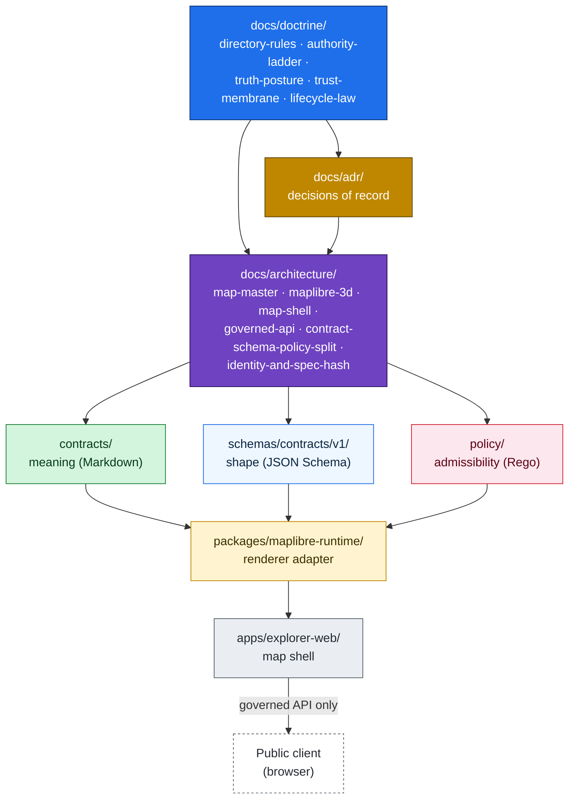
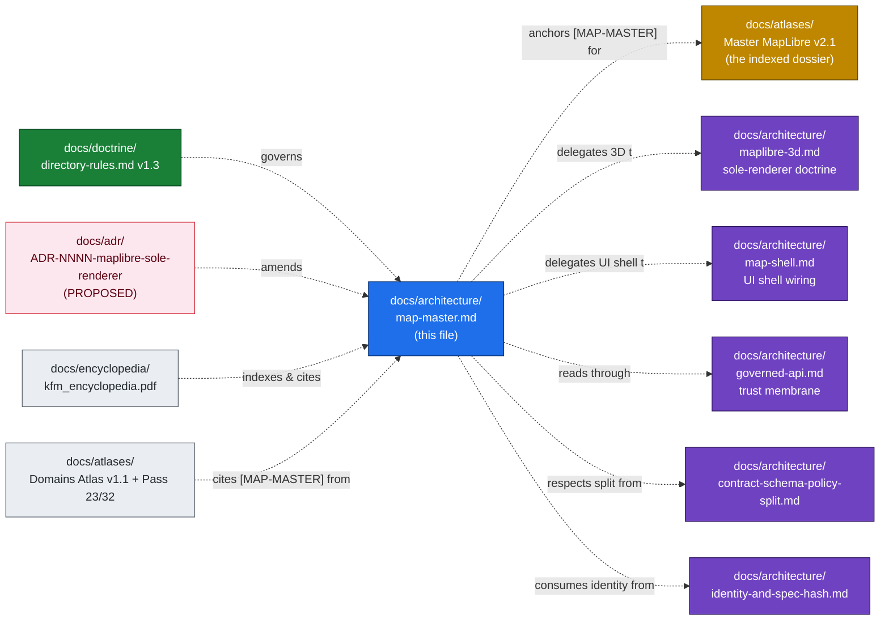

<a id="top"></a>

<!-- [KFM_META_BLOCK_V2]
doc_id: kfm://doc/architecture/map-master
title: Map-Master — KFM Renderer-Boundary Architecture Anchor
type: architecture
subtype: renderer-boundary-doctrine
version: v1 (draft)
status: draft
owners: <architecture-stewards>  # PLACEHOLDER — assign before review
created: 2026-05-25
updated: 2026-05-25
policy_label: public
related:
  - docs/doctrine/directory-rules.md                              # v1.3 — placement authority
  - docs/doctrine/authority-ladder.md
  - docs/doctrine/truth-posture.md
  - docs/doctrine/trust-membrane.md
  - docs/doctrine/lifecycle-law.md
  - docs/architecture/maplibre-3d.md                              # sole-renderer doctrine (PROPOSED ADR)
  - docs/architecture/map-shell.md                                # UI shell / Evidence Drawer / Focus Mode wiring
  - docs/architecture/governed-api.md                             # trust-membrane boundary
  - docs/architecture/contract-schema-policy-split.md             # meaning · shape · admissibility split
  - docs/architecture/identity-and-spec-hash.md                   # identity + JCS+SHA-256
  - docs/atlases/Master_MapLibre_Components-Functions-Features_v2.1.pdf   # PROPOSED placement; NEEDS VERIFICATION
  - docs/standards/PMTILES.md
  - docs/standards/OGC-API-TILES.md
  - docs/adr/ADR-NNNN-maplibre-sole-renderer.md                   # PROPOSED — number pending (OPEN-DR-10)
  - schemas/contracts/v1/maplibre/
  - schemas/contracts/v1/3d/
  - policy/maplibre/
  - packages/maplibre-runtime/
  - apps/explorer-web/
extends:
  - Master MapLibre Components-Functions-Features v2.1 (the indexed source dossier; 26 categories A–Z + AA)
authority_posture: architecture anchor — subordinate to `docs/doctrine/` and any accepted ADR; coordinates with `docs/atlases/` and the v2.1 dossier.
tags: [kfm, architecture, maplibre, map-master, renderer-boundary, trust-membrane, evidence-drawer, focus-mode]
notes:
  - "This file is the canonical resolution target for the [MAP-MASTER] citation tag used throughout the KFM corpus."
  - "No mounted repo was inspected this session. Every quoted repo path is PROPOSED unless explicitly CONFIRMED at doctrine level."
  - "MapLibre GL JS is KFM's sole browser-side renderer (directory-rules.md v1.3; docs/architecture/maplibre-3d.md). Cesium is retired."
[/KFM_META_BLOCK_V2] -->

# Map-Master — KFM Renderer-Boundary Architecture Anchor

> *MapLibre is a disciplined renderer and interaction runtime inside a governed shell. It is not truth, source authority, policy engine, citation authority, review authority, publication authority, or AI authority. **`[MAP-MASTER]`** is the citation tag the rest of the corpus uses to point at the discipline codified here.*


<!-- TODO — wire CI badge once docs-lint workflow is named -->


| Field | Value |
|---|---|
| **Status** | `draft` |
| **Owners** | `<architecture-stewards>` *(PLACEHOLDER — assign before review)* |
| **Last reviewed** | 2026-05-25 |
| **Authority class** | Architecture anchor (subordinate to `docs/doctrine/`) |
| **Citation tag served** | **`[MAP-MASTER]`** *(Pass-23/32 Atlas Appendix B: short-name `[MAP-MASTER]` → "Master MapLibre, renderer, tiles, Evidence Drawer, Focus Mode doctrine"; `CONFIRMED`)* |
| **Doctrine basis** | `directory-rules.md` v1.3 §0 / §7.2.a / §11 / §13.5 · `docs/architecture/maplibre-3d.md` (sole-renderer ADR PROPOSED) · *Master MapLibre Components-Functions-Features* v2.1 Category A "Renderer Boundary and KFM Trust Law" · Doctrine Synthesis §8 · Pass-23/32 Atlas §24.4 cross-lane edges |
| **Implementation maturity** | `UNKNOWN` — no mounted repo, runtime, CI logs, or dashboards inspected this session |

---

## Quick jump

- [1. Why map-master exists](#1-why-map-master-exists)
- [2. What MapLibre is — and what it is not](#2-what-maplibre-is--and-what-it-is-not)
- [3. Authority subordination](#3-authority-subordination)
- [4. The renderer flow](#4-the-renderer-flow)
- [5. Required objects and contracts](#5-required-objects-and-contracts)
- [6. Category map — the v2.1 dossier index](#6-category-map--the-v21-dossier-index)
- [7. The three-column discipline](#7-the-three-column-discipline)
- [8. Renderer-decision overlay](#8-renderer-decision-overlay)
- [9. Schemas, contracts, policy, packages — placement](#9-schemas-contracts-policy-packages--placement)
- [10. Negative states are first-class](#10-negative-states-are-first-class)
- [11. Anti-patterns](#11-anti-patterns)
- [12. Cross-document map](#12-cross-document-map)
- [13. Open questions](#13-open-questions)
- [14. Related docs](#14-related-docs)
- [Appendix A — Illustrative renderer-decision sequence](#appendix-a--illustrative-renderer-decision-sequence)

---

<a id="1-why-map-master-exists"></a>

## 1. Why map-master exists

The KFM corpus uses the citation tag **`[MAP-MASTER]`** in cross-domain edge tables, anti-pattern registers, surface-mapping tables, and the §24 cross-lane atlas to anchor every claim about how the map surface is allowed to behave. That tag resolves *here*.

`CONFIRMED` — Pass-23/32 Atlas Appendix B, Source-family index:

> *"`[MAP-MASTER]` — MapLibre Master — renderer, tiles, Evidence Drawer, Focus Mode doctrine."*

This file is **not** a duplicate of:

| Adjacent doc | What it owns |
|---|---|
| *Master MapLibre Components-Functions-Features* v2.1 *(the dossier)* | The exhaustive idea index across 26 categories (A–Z + AA), with thousands of `ML-*` cards. Stored under `docs/atlases/` *(`PROPOSED` placement)*. |
| `docs/architecture/maplibre-3d.md` | The sole-renderer doctrine (Cesium retirement) and the 3D feature surface — terrain, globe projection, 3D Tiles, glTF, point clouds, plugin ecosystem. |
| `docs/architecture/map-shell.md` | The UI shell — explore, time, click resolution, Evidence Drawer wiring, exports, story surfaces. |
| `docs/architecture/governed-api.md` | The trust-membrane boundary that the renderer reads through. |

This file owns the **renderer-boundary architecture anchor**: the doctrinal contract that every map-touching subsystem cites. It states what MapLibre is allowed to be, names the contracts it must consume, indexes the v2.1 dossier so corpus citations land somewhere navigable, and records the renderer-decision overlay that fixes the architecture at "MapLibre as sole browser-side renderer."

[↑ back to top](#top)

---

<a id="2-what-maplibre-is--and-what-it-is-not"></a>

## 2. What MapLibre is — and what it is not

`CONFIRMED` (Master MapLibre v2.1 Executive Determination, paraphrased):

> *MapLibre is a disciplined renderer and interaction runtime. Tiles, PMTiles, MVT, MLT, COGs, style JSON, sprites, glyphs, popups, screenshots, scenes, exports, summaries, graph projections, catalog records, and AI answers are downstream carriers, not sovereign truth.*

| MapLibre **is** | MapLibre **is not** |
|---|---|
| A 2D / 2.5D / 3D rendering substrate (`CONFIRMED`). | The canonical truth store (`CONFIRMED` — corpus invariant). |
| An interaction runtime (camera, time, click candidates) (`CONFIRMED`). | The source registry. |
| A consumer of **released** layer / style / tile artifacts (`CONFIRMED`). | The policy engine. |
| A reader of governed APIs and EvidenceBundle resolutions (`CONFIRMED`). | The citation authority. |
| A surface that emits **`RenderReceipt`** / `RepresentationReceipt` records (`CONFIRMED` doctrine; `PROPOSED` implementation). | The review authority. |
| A trust-visible negative-state display (stale, denied, generalized, etc.) (`CONFIRMED`). | The publication authority. |
| Subject to admission gates **before** terrain, globe projection, or plugin-hosted layers are added (`CONFIRMED` — `maplibre-3d.md` 3D Admission Decision). | The AI authority. |

> [!IMPORTANT]
> **The renderer cannot become the public surface and inherit no governance.** The Pass-23/32 Atlas anti-pattern register names this as a tracked anti-pattern, with `[MAP-MASTER]` as the citation authority. The DENY surface is the MapLibre shell wiring and the layer registry. `CONFIRMED` doctrine; enforcement implementation `UNKNOWN`.

[↑ back to top](#top)

---

<a id="3-authority-subordination"></a>

## 3. Authority subordination

The renderer is downstream of every governance surface. `CONFIRMED` doctrine (`directory-rules.md` v1.3 §0, §11; Doctrine Synthesis §8; v2.1 Category A).



The arrow direction is the authority direction. The map-shell never reads canonical or RAW stores; the renderer never claims truth; the AI never speaks without an `EvidenceBundle`.

[↑ back to top](#top)

---

<a id="4-the-renderer-flow"></a>

## 4. The renderer flow

`CONFIRMED` doctrine — Doctrine Synthesis §8.1, v2.1 Category O (Focus Mode and Governed AI Map Context), Pass-23/32 atlas KFM-P1-FEAT-0065 (Evidence Drawer required on layers, popovers, and AI answers).

```mermaid
flowchart LR
  REL["Released LayerManifest /<br/>StyleManifest / TileArtifactManifest /<br/>MapReleaseManifest"]:::rel
  REND["MapLibre GL JS<br/>(packages/maplibre-runtime/)"]:::rend
  CLK["User click / time selection /<br/>camera change"]:::user
  API["Governed API<br/>(apps/governed-api/)"]:::api
  RES["EvidenceRef → EvidenceBundle<br/>resolution"]:::res
  DRW["EvidenceDrawerPayload"]:::drw
  FM{"Focus Mode?"}:::decide
  FMR["FocusModeResponse:<br/>ANSWER · ABSTAIN · DENY · ERROR<br/>+ AIReceipt"]:::ai
  DONE["Display"]:::ok
  RR["RepresentationReceipt<br/>(subtype of RenderReceipt)"]:::receipt

  REL --> REND
  REND --> RR
  REND --> CLK
  CLK --> API
  API --> RES
  RES --> DRW
  DRW --> FM
  FM -- "yes" --> FMR
  FM -- "no"  --> DONE
  FMR --> RR

  classDef rel    fill:#d4f5dd,stroke:#1a7f37,color:#053a1a;
  classDef rend   fill:#fff4cf,stroke:#bf8700,color:#3b2f00;
  classDef user   fill:#eaeef2,stroke:#57606a,color:#24292f;
  classDef api    fill:#1f6feb,stroke:#0a2e6b,color:#fff;
  classDef res    fill:#6f42c1,stroke:#2b1259,color:#fff;
  classDef drw    fill:#eef6ff,stroke:#1f6feb,color:#0a2540;
  classDef decide fill:#fff,stroke:#57606a,color:#24292f,stroke-dasharray: 3 3;
  classDef ai     fill:#fde7ef,stroke:#cf222e,color:#5c0010;
  classDef ok     fill:#1a7f37,stroke:#053a1a,color:#fff;
  classDef receipt fill:#bf8700,stroke:#5c4400,color:#fff;
```



The renderer **only loads released artifacts** *(Pass-23/32 atlas ML-A-058: "MapLibre may render only after EvidenceBundle and catalog closure"; ML-A-065: "MapLibre and Cesium consume released artifacts only" — `CONFIRMED` doctrine; the latter card's Cesium reference is now `PROPOSED-SUPERSEDED` per `maplibre-3d.md`'s sole-renderer overlay)*. Click resolution goes through the governed API. Focus Mode receives released context, not raw or canonical state.

[↑ back to top](#top)

---

<a id="5-required-objects-and-contracts"></a>

## 5. Required objects and contracts

`CONFIRMED` — repeated **verbatim** across every category in the Master MapLibre v2.1 dossier, and reinforced by `maplibre-3d.md` §4 required-objects list:

| Object family | Role at the renderer boundary | Status |
|---|---|---|
| `SourceDescriptor` | Source identity, authority role, rights, cadence. | `CONFIRMED` doctrine. |
| `LayerManifest` | Layer identity, evidence, geometry, time, trust badges. | `CONFIRMED` doctrine. |
| `StyleManifest` | Style JSON, sprite/glyph hashes, meaning, accessibility. | `CONFIRMED` doctrine. |
| `TileArtifactManifest` | PMTiles / MVT / MLT / COG / GeoParquet / 3D-tile artifact identity and hashes. | `CONFIRMED` doctrine. |
| `MapReleaseManifest` | Binds released layers, styles, tile artifacts, proof pack, rollback target. | `CONFIRMED` doctrine. |
| `EvidenceBundle` | Resolved, policy-safe evidence context (content-addressed by `spec_hash`). | `CONFIRMED` doctrine. |
| `EvidenceRef` | Pointer that must resolve to an `EvidenceBundle` before public claim authority. | `CONFIRMED` doctrine. |
| `DecisionEnvelope` | Runtime / policy decision payload with finite outcome. | `CONFIRMED` doctrine. |
| `PolicyDecision` | Allow / deny / abstain / error result with reasons. | `CONFIRMED` doctrine. |
| `PromotionDecision` | Outcome of Gates A–G; spec-hash match required at promotion. | `CONFIRMED` doctrine. |
| `RunReceipt` | Pipeline / tool action pinned to inputs, outputs, policy, hashes, versions. | `CONFIRMED` doctrine. |
| `RenderReceipt` / `RepresentationReceipt` | What was actually rendered, when, with what spec_hashes and plugin versions. | `CONFIRMED` doctrine; `PROPOSED` implementation (`packages/maplibre-runtime/receipts.ts`). |
| `AIReceipt` | Provider, model, runtime, citation validation, policy decision, finite outcome. **No private chain-of-thought.** | `CONFIRMED` doctrine. |
| `ValidationReport` | Schema, geometry, catalog, citation, policy check result. | `CONFIRMED` doctrine. |
| **Rollback target** | Prior release manifest + artifact digests + cache-invalidation steps. | `CONFIRMED` doctrine. |
| **Cache invalidation record** | Tied to release/rollback transitions; required when relevant. | `CONFIRMED` doctrine. |

> [!NOTE]
> **The renderer reads identity; it never mints identity.** Every contract in this table carries a `spec_hash` (`jcs:sha256:<hex>` — see `docs/architecture/identity-and-spec-hash.md`). The renderer compares the digest it sees against the digest the manifest declares; mismatch is `DENY`. `CONFIRMED` doctrine (Pass-10 C5-04 spec-hash-match; Pass-23/32 KFM-P5-PROG-0010 replay discipline).

[↑ back to top](#top)

---

<a id="6-category-map--the-v21-dossier-index"></a>

## 6. Category map — the v2.1 dossier index

`CONFIRMED` — the *Master MapLibre Components-Functions-Features* v2.1 dossier organizes the renderer-boundary corpus into **26 categories** (A–Z + AA). Counts below are v2.1 deltas as reported in the dossier itself; full retained body lives in the dossier's Appendix A.

<details>
<summary><strong>Click to expand the category map</strong></summary>

| ID | Category | v2.1 delta | Status |
|---|---|---:|---|
| **A** | Renderer Boundary and KFM Trust Law | 10 ideas | `EXPANDED` |
| **B** | MapLibre GL JS Web Shell | 5 | `EXPANDED` |
| **C** | MapLibre Native / Mobile / Platform Parity | 2 | `EXPANDED` |
| **D** | MapLibre RS / Experimental Renderers | 0 | `RETAINED` |
| **E** | Style Specification, Sources, Layers, Expressions | 1 | `EXPANDED` |
| **F** | Sprites, Glyphs, Fonts, Design Tokens | 0 | `RETAINED` |
| **G** | GeoJSON and Runtime Data | 0 | `RETAINED` |
| **H** | Vector Tiles: MVT and MLT | 3 | `EXPANDED` |
| **I** | PMTiles, MBTiles, Static Tiles, Serverless Delivery | 20 | `EXPANDED` |
| **J** | Martin and Server-Mediated Tile Serving | 3 | `EXPANDED` |
| **K** | Raster, COG, DEM, Terrain, Hillshade | 8 | `EXPANDED` |
| **L** | WMS / WMTS / External Map Services | 1 | `EXPANDED` |
| **M** | `LayerManifest` / `StyleManifest` / `TileArtifactManifest` / `MapReleaseManifest` | 25 | `EXPANDED` |
| **N** | Evidence Drawer Payloads and Click Resolution | 7 | `EXPANDED` |
| **O** | Focus Mode and Governed AI Map Context | 5 | `EXPANDED` |
| **P** | Time-Aware Map Interaction and Timeline | 3 | `EXPANDED` |
| **Q** | Sensitive Geometry, Geoprivacy, Rights, and Policy | 5 | `EXPANDED` |
| **R** | Plugin, Wrapper, and Dependency Governance | 3 | `EXPANDED` |
| **S** | Accessibility, UX, and Trust-Visible States | 2 | `EXPANDED` |
| **T** | Performance, Caching, CDN, Range Requests, Resource Timing | 8 | `EXPANDED` |
| **U** | Testing, CI, Validation, Rollback, and Proof Objects | 18+ | `EXPANDED` |
| **V** | Exports, Screenshots, Reports, and Citation Preservation | 3 | `EXPANDED` |
| **W** | 3D / overlay interoperability *(formerly "3D / Cesium / Deck.gl / Overlay Interoperability"; the Cesium framing is now `PROPOSED-SUPERSEDED` per `docs/architecture/maplibre-3d.md`)* | 3 | `EXPANDED` |
| **X** | Anti-Patterns and Failure Modes | 5 | `EXPANDED` |
| **Y** | Implementation Backlog and PR Plan | 5 | `EXPANDED` |
| **Z** | Open Questions and Verification Backlog | 5 | `EXPANDED` |
| **AA** | Source Watchers, Material Change Gates, and Drift Summaries | 19 | `EXPANDED` |

</details>

> [!TIP]
> When the corpus cites `[MAP-MASTER] Category K` (raster/DEM/terrain), `[MAP-MASTER] Category Q` (geoprivacy), or `[MAP-MASTER] Category W` (3D overlay interop), it is pointing into the v2.1 dossier table above. This file is the navigational target; the dossier is the depth.

[↑ back to top](#top)

---

<a id="7-the-three-column-discipline"></a>

## 7. The three-column discipline

`CONFIRMED` — repeated **verbatim** under every category in the v2.1 dossier. Memorize this triple; every map-touching PR has to answer all three columns.

| Column | What the discipline says |
|---|---|
| **Public UI implication** | Show released layer state, stale / degraded / denied / unverified status, citations, policy posture, and Evidence Drawer resolution. **Never** expose raw watcher state, unreleased tile URLs, direct model output, or canonical / internal stores. |
| **Policy implication** | **Deny by default** when rights, source authority, sensitivity, signatures, proof coverage, source-role labels, or release state are missing. **Sensitive geometry must be transformed before rendering, not hidden only by style.** |
| **Validation tests** | Schema validation · no-public-RAW/WORK/QUARANTINE path · no-unreleased-tile-load · proof/signature checks · source-layer validity · Range/CORS/CDN probes · visual regression · keyboard accessibility · Focus Mode cite / abstain / deny · rollback restore · cache-invalidation record checks. |

> [!CAUTION]
> **"Hidden by style" is not redaction.** Setting a layer's opacity to zero, removing it from the legend, or applying a filter expression does **not** satisfy the policy implication. Sensitive geometry must be transformed (generalized, jittered, aggregated, or omitted) **before** the tile is built. `CONFIRMED` doctrine — repeated across v2.1 Categories Q and X, and Pass-23/32 atlas §24.9.2 anti-pattern register.

[↑ back to top](#top)

---

<a id="8-renderer-decision-overlay"></a>

## 8. Renderer-decision overlay

`CONFIRMED` doctrine — `directory-rules.md` v1.3 §0 (renderer-decision refresh) and `docs/architecture/maplibre-3d.md` Appendix B (PROPOSED ADR):

> **MapLibre GL JS is KFM's sole browser-side renderer.** All 3D capability flows through MapLibre's native surface (`raster-dem` + `setTerrain`, `hillshade`, `fill-extrusion`, globe projection + `sky`) plus its plugin ecosystem (three.js custom layer, `3d-tiles-renderer`, `maplibre-three-plugin`, `maplibre-gl-lidar`, `deck.gl` interleaved, `pmtiles`, `maplibre-cog-protocol`, `maplibre-gl-vector-text-protocol`). **Cesium is retired** from KFM's architecture.

| Element | Pre-v1.3 disposition | v1.3 disposition | Authority |
|---|---|---|---|
| Browser-side renderer | Dual: MapLibre (2D) + Cesium (3D). | **MapLibre as sole renderer.** | `directory-rules.md` v1.3 §0, §7.2.a, §13.5; `maplibre-3d.md` §0.1, Appendix B |
| `KFM-P2-FEAT-0012` "Cesium 3D Tiles…" | `UNCHANGED` / active in Pass 23 → Pass 32. | **`PROPOSED-SUPERSEDED`** by the renderer-decision ADR. Card body retained for lineage. | `maplibre-3d.md` §0.1; v2.1 Category W |
| `packages/cesium*` / `packages/cesium-runtime/` | Allowed in pre-v1.3 placement guidance. | **Retired.** Routine PR may rename `packages/maplibre/` → `packages/maplibre-runtime/`. | `directory-rules.md` v1.3 §7.2.a, §18.e OPEN-DR-11 |
| `schemas/contracts/v1/cesium*` | Allowed. | **Not admitted.** Schema homes for renderer/scene live at `schemas/contracts/v1/maplibre/` and `schemas/contracts/v1/3d/`. | `directory-rules.md` v1.3 §0, §6.4 |
| 3D object families (Scene Manifest, Terrain Model, 3D Tile Set, glTF Asset, Point Cloud, Digital Twin View, ViewState, Representation Receipt, Reality Boundary Note, 3D Admission Decision) | Active and renderer-agnostic. | **Unchanged** — all implementable on MapLibre + plugins. | `maplibre-3d.md` §4 |

> [!NOTE]
> **The renderer-decision ADR is `PROPOSED`, not filed.** Number is pending against the live ADR set (`directory-rules.md` v1.3 §18.e OPEN-DR-10). Until the ADR is filed, every supersession in this section is `PROPOSED-SUPERSEDED`, not retired. The disposition is locked at the doctrine layer; the audit trail is open.

[↑ back to top](#top)

---

<a id="9-schemas-contracts-policy-packages--placement"></a>

## 9. Schemas, contracts, policy, packages — placement

`CONFIRMED` placement authority for these segments comes from `directory-rules.md` v1.3 §6.4 / §6.5 / §11 / §0 (schema-home convention) and is itemized in `maplibre-3d.md` §6.2. Paths below are `PROPOSED` until verified in a mounted repo.

```text
schemas/contracts/v1/
  maplibre/                              # renderer/scene schemas (v1.3 family)
    scene_manifest.schema.json
    layer_manifest.schema.json
    style_manifest.schema.json
    terrain_model.schema.json
    synthetic_surface.schema.json
    view_state.schema.json
    representation_receipt.schema.json
    camera_path.schema.json
  3d/                                    # 3D-asset schemas (v1.3 family)
    3d_tile_set.schema.json
    gltf_asset.schema.json
    point_cloud.schema.json
    digital_twin_view.schema.json
    reality_boundary_note.schema.json
  policy/
    3d_admission_decision.schema.json
    plugin_admission.schema.json

contracts/
  maplibre/                              # semantic meaning (Markdown)
    scene-manifest.md
    style-manifest.md
    representation-receipt.md
    plugin-dependencies.md
  3d/
    geometry-labeling.md
    reality-boundary-notes.md

policy/
  maplibre/                              # governed-renderer admission policy
    3d-admission.rego
    plugin-admission.rego
    sky-and-light-defaults.rego
    globe-projection-admission.rego
  sensitivity/
    care-terrain-generalization.rego

packages/
  maplibre-runtime/                      # sole governed renderer adapter
    src/
      terrain.ts          hillshade.ts        sky.ts
      globe.ts            fill-extrusion.ts   camera-path.ts
      custom-layer-host.ts                    tiles3d-three.ts
      gltf-three.ts       lidar-decklike.ts   deckgl-interleaved.ts
      admission.ts        plugin-registry.ts  receipts.ts

apps/
  explorer-web/
    src/map/
      mode-2d.tsx         mode-2_5d.tsx        mode-globe.tsx
      mode-true-3d.tsx    reality-boundary-badge.tsx
      # NOTE: no renderer-switch.tsx — single renderer.

tests/
  maplibre/                              # contract + policy + integration tests
fixtures/
  maplibre/                              # valid + invalid scene/layer/view-state
```

> [!IMPORTANT]
> **`contracts/` owns meaning. `schemas/` owns shape. `policy/` owns admissibility. `packages/maplibre-runtime/` owns the adapter logic.** The renderer never owns truth. If a path in your PR appears to merge any two of these responsibilities, it is drift — pause and re-route per `directory-rules.md` v1.3 §6 and `docs/architecture/contract-schema-policy-split.md`.

[↑ back to top](#top)

---

<a id="10-negative-states-are-first-class"></a>

## 10. Negative states are first-class

`CONFIRMED` — Doctrine Synthesis §8.3. The renderer **shows** these states; it does not silently hide them.

| Negative state | Trigger | UI surface |
|---|---|---|
| `MISSING_EVIDENCE` | `EvidenceRef` does not resolve to an `EvidenceBundle`. | Drawer banner; layer badge. |
| `SOURCE_STALE` | Source ledger reports cadence exceeded; HTTP validators show no recent refresh. | Layer badge with last-fetch time. |
| `DENIED_BY_POLICY` | `PolicyDecision = deny`. | Drawer message with policy reason (sensitive reasons redacted). |
| `GENERALIZED_GEOMETRY` | `RedactionReceipt` applied; rendered geometry is coarser than source. | Drawer note + Reality Boundary Note. |
| `RESTRICTED_ACCESS` | Released only to authenticated/authorized clients. | Layer badge; non-rendering for unauthorized clients. |
| `CONFLICTED_SUPPORT` | Multiple evidence sources disagree. | Drawer banner; Focus Mode is more cautious. |
| `CITATION_FAILED` | `CitationValidationReport = fail`. | AI surface returns `ABSTAIN`; drawer flags failure. |
| `RELEASE_WITHDRAWN` | `CorrectionNotice` or `RollbackCard` invalidates a previously-public artifact. | Layer disabled; correction note shown. |
| `RUNTIME_ERROR` | Render or resolution error not classified above. | Drawer error state; not a silent fail. |

> [!TIP]
> **Negative states protect trust.** A renderer that quietly hides a stale or denied layer creates a worse failure mode than one that visibly flags it. The discipline is to surface state, not to suppress it.

[↑ back to top](#top)

---

<a id="11-anti-patterns"></a>

## 11. Anti-patterns

`CONFIRMED` — Pass-23/32 Atlas §24.9.2 (Trust-membrane anti-patterns) and v2.1 Category X. Each anti-pattern's DENY surface is named.

| # | Anti-pattern | What goes wrong | DENY surface |
|---|---|---|---|
| AP-1 | Public client reads RAW / WORK / QUARANTINE. | Trust membrane bypassed; promotion gates skipped. | Governed API; layer manifest resolver. |
| AP-2 | Map shell consumes canonical / internal store directly. | Renderer becomes the public surface with no governance. | MapLibre shell wiring; layer registry. |
| AP-3 | AI returns uncited language. | Generated text substitutes for evidence; cite-or-abstain broken. | Focus Mode; AI surface steward. |
| AP-4 | AI answers from RAW / WORK rather than `EvidenceBundle`. | AI becomes its own truth source. | Governed AI runtime; AIReceipt evaluator. |
| AP-5 | Sensitive content released without redaction. | `RedactionReceipt` missing; rights / sovereignty violation. | Release queue; sensitivity reviewer. |
| AP-6 | Aggregate cited as per-place observation. | Source-role collapse; matrix-cell semantics violated. | Validator; Focus Mode citation evaluator. |
| AP-7 | Synthetic surface presented without Reality Boundary Note. | Reconstruction read as observation. | Scene admission gate; representation receipt validator. |
| AP-8 | KFM used as alert / instruction authority. | Out-of-scope use of governed evidence as life-safety guidance. | Hazards / Air / Hydrology surfaces. |
| AP-9 | Release without `ReleaseManifest` or rollback target. | Public surface cannot be rolled back; release not auditable. | Release queue; release authority. |
| AP-10 | AI generation routed through admin shortcut. | Admin bypass becomes a normal-path public route. | Trust-membrane audit; infra. |
| AP-11 *(v1.3)* | **Reintroducing a parallel browser renderer.** Any PR that adds `packages/cesium*`, `policy/cesium*`, `schemas/contracts/v1/cesium*`, or a second-renderer adapter as a peer to `packages/maplibre-runtime/` requires a follow-on ADR superseding the renderer-decision ADR. | Sole-renderer doctrine bypassed; placement law violated. | `directory-rules.md` v1.3 §13.5; renderer-decision ADR. |
| AP-12 | "Hidden by style" treated as redaction. | Sensitive geometry shipped to client; only visual hiding applied. | Tile build pipeline; sensitivity reviewer. |
| AP-13 | Tile-level embeddings cited as truth. | Embeddings are downstream projections, not evidence. | Validator; catalog matrix. |
| AP-14 | Pre-render verification placed in the client. | Trust check moves outside the membrane. | Governed API; release validator. |

[↑ back to top](#top)

---

<a id="12-cross-document-map"></a>

## 12. Cross-document map

How `map-master.md` relates to its neighbors:



| Neighbor | Why it matters here |
|---|---|
| `docs/architecture/maplibre-3d.md` | 3D feature surface + sole-renderer doctrine. `map-master.md` defers all 3D-specific architecture to it. |
| `docs/architecture/map-shell.md` | UI shell — Evidence Drawer, Focus Mode wiring, time slider, exports. `map-master.md` defers shell-level wiring to it. |
| `docs/architecture/governed-api.md` | The trust membrane the renderer reads through. `map-master.md` enforces "renderer reads governed API, never canonical store." |
| `docs/architecture/contract-schema-policy-split.md` | Meaning · shape · admissibility. `map-master.md` enforces the split inside `maplibre/`, `3d/`, and `policy/maplibre/` segments. |
| `docs/architecture/identity-and-spec-hash.md` | Every manifest, EvidenceBundle, and RenderReceipt the renderer touches carries `spec_hash`. |
| `docs/atlases/Master_MapLibre_Components-Functions-Features_v2.1.*` | The dossier. `map-master.md` indexes it; the dossier holds the depth. |
| `docs/doctrine/directory-rules.md` v1.3 | Placement authority. Governs every path in §9. |
| `docs/adr/ADR-NNNN-maplibre-sole-renderer.md` *(PROPOSED)* | Will formalize the sole-renderer decision and assign Cesium retirement to the supersession ledger. |

[↑ back to top](#top)

---

<a id="13-open-questions"></a>

## 13. Open questions

`NEEDS VERIFICATION` / `UNKNOWN` items the corpus surfaces against `[MAP-MASTER]`:

| OQ # | Status | Question |
|---|---|---|
| OQ-MM-01 | `UNKNOWN` | What is the canonical home for the *Master MapLibre Components-Functions-Features* v2.1 dossier? **Proposed** `docs/atlases/` per ADR-S-02 lane discipline; `NEEDS VERIFICATION` against the mounted repo. |
| OQ-MM-02 | `NEEDS VERIFICATION` | Does `packages/maplibre-runtime/` exist? Has `packages/maplibre/` been renamed per `directory-rules.md` v1.3 §18.e OPEN-DR-11? |
| OQ-MM-03 | `NEEDS VERIFICATION` | Are `schemas/contracts/v1/maplibre/` and `schemas/contracts/v1/3d/` populated, or still `PROPOSED`? |
| OQ-MM-04 | `NEEDS VERIFICATION` | Is the plugin-admission Rego bundle live in CI and at runtime (policy parity per Pass-10 C5-03)? |
| OQ-MM-05 | `UNKNOWN` | What is the MapLibre GL JS pinned version? `directory-rules.md` v1.3 references MapLibre **5.0+** for native globe projection; the implementation pin is not visible this session. |
| OQ-MM-06 | `UNKNOWN` | Is `RenderReceipt` / `RepresentationReceipt` actually emitted by the runtime, or only specified? |
| OQ-MM-07 | `NEEDS VERIFICATION` | Does the sole-renderer ADR exist in `docs/adr/`? What number is reserved? *(`directory-rules.md` v1.3 §18.e OPEN-DR-10.)* |
| OQ-MM-08 | `NEEDS VERIFICATION` | Are visual regression, render-smoke, and tile-load-budget tests wired into CI per v2.1 Category U? |
| OQ-MM-09 | `UNKNOWN` | What is the policy posture for MapLibre Native and MapLibre RS? v2.1 keeps them in the backlog; mounted-repo state is unknown. |
| OQ-MM-10 | `UNKNOWN` | Has Category W's name been updated from *"3D / Cesium / Deck.gl / Overlay Interoperability"* to a Cesium-free phrasing in the canonical v2.1 dossier, or is the renderer-decision overlay applied only at the architecture layer? |

[↑ back to top](#top)

---

<a id="14-related-docs"></a>

## 14. Related docs

| Doc | Why it matters here | Status |
|---|---|---|
| `docs/doctrine/directory-rules.md` (v1.3) | Placement authority for every path in this document. | `CONFIRMED` doctrine. |
| `docs/doctrine/authority-ladder.md` | Authority ranks the renderer sits beneath. | `NEEDS VERIFICATION`. |
| `docs/doctrine/trust-membrane.md` | The boundary the renderer reads through. | `NEEDS VERIFICATION`. |
| `docs/doctrine/lifecycle-law.md` | RAW → WORK / QUARANTINE → PROCESSED → CATALOG / TRIPLET → PUBLISHED. | `CONFIRMED` doctrine; file presence `NEEDS VERIFICATION`. |
| `docs/architecture/maplibre-3d.md` | Sole-renderer doctrine + 3D feature surface. | `CONFIRMED` authored; ADR `PROPOSED`. |
| `docs/architecture/map-shell.md` | UI shell — Evidence Drawer, Focus Mode, time interaction. | `NEEDS VERIFICATION`. |
| `docs/architecture/governed-api.md` | Trust membrane that the renderer reads through. | `NEEDS VERIFICATION`. |
| `docs/architecture/contract-schema-policy-split.md` | `contracts/` meaning · `schemas/` shape · `policy/` admissibility. | `NEEDS VERIFICATION`. |
| `docs/architecture/identity-and-spec-hash.md` | Identity, `spec_hash`, replay, promotion gate. | Authored prior turn; `NEEDS VERIFICATION` in mounted repo. |
| `docs/atlases/Master_MapLibre_Components-Functions-Features_v2.1.pdf` | The indexed source dossier. | `CONFIRMED` exists in corpus; `PROPOSED` placement under `docs/atlases/`. |
| `docs/atlases/KFM_Domains_v1_1_plus_Pass23_Pass32_Consolidated_Atlas.md` | §24 cross-lane edges that cite `[MAP-MASTER]`. | `CONFIRMED` in corpus. |
| `docs/standards/PMTILES.md` | PMTiles v3 conformance profile. | Authored prior session; `NEEDS VERIFICATION`. |
| `docs/standards/OGC-API-TILES.md` | OGC API Tiles integration. | Authored prior session; `NEEDS VERIFICATION`. |
| `docs/adr/ADR-NNNN-maplibre-sole-renderer.md` | The renderer-decision ADR formalizing Cesium retirement. | `PROPOSED` — number pending OPEN-DR-10. |
| `docs/registers/DRIFT_REGISTER.md` | Records `packages/maplibre/` transitional state and renderer-decision migration. | `NEEDS VERIFICATION`. |
| `docs/registers/VERIFICATION_BACKLOG.md` | Tracks OQ-MM-01 … OQ-MM-10. | `NEEDS VERIFICATION`. |

[↑ back to top](#top)

---

<a id="appendix-a--illustrative-renderer-decision-sequence"></a>

## Appendix A — Illustrative renderer-decision sequence

> [!WARNING]
> **Illustrative only.** Shape of a `3D Admission Decision` evaluated before MapLibre adds a terrain or 3D-tiles layer. Real evaluation is governed by `policy/maplibre/3d-admission.rego` *(`PROPOSED`)*. Do not cite the sequence below as the implementation.

<details>
<summary><strong>A.1 — 3D admission decision sequence</strong></summary>

```mermaid
sequenceDiagram
    autonumber
    participant APP as apps/explorer-web<br/>(map shell)
    participant RT as packages/maplibre-runtime<br/>(admission.ts)
    participant POL as policy/maplibre/<br/>3d-admission.rego
    participant API as apps/governed-api
    participant RES as packages/evidence-resolver
    participant ML as MapLibre GL JS

    APP->>RT: requestLayer(layerManifestRef, viewState)
    RT->>API: GET /layers/{id}?include=evidence,policy,release
    API->>RES: resolve(EvidenceRef → EvidenceBundle)
    RES-->>API: EvidenceBundle (spec_hash verified)
    API-->>RT: { LayerManifest, EvidenceBundle, PolicyDecision, ReleaseManifest }
    RT->>POL: evaluate(3D_admission, inputs)
    alt PolicyDecision = allow
        POL-->>RT: ALLOW (admission decision recorded)
        RT->>ML: setTerrain / addLayer (3D-Tiles | gltf | lidar)
        ML-->>RT: render
        RT-->>APP: RepresentationReceipt (spec_hash, plugins, timing)
    else PolicyDecision = deny
        POL-->>RT: DENY (reason; sensitive reasons redacted)
        RT-->>APP: DENIED_BY_POLICY (drawer banner; no rendering)
    else PolicyDecision = abstain
        POL-->>RT: ABSTAIN (missing evidence / unresolved EvidenceRef)
        RT-->>APP: MISSING_EVIDENCE (drawer banner; no rendering)
    end
```

</details>

<details>
<summary><strong>A.2 — Required-objects checklist (renderer PR template)</strong></summary>

> **`PROPOSED`** PR-template checklist. Pin and align with the actual repo's PR template before adoption.

```text
- [ ] SourceDescriptor is registered and rights/cadence verified
- [ ] LayerManifest carries spec_hash and EvidenceRef
- [ ] StyleManifest pins sprite/glyph digests
- [ ] TileArtifactManifest digests verified (PMTiles/COG/3D-tiles)
- [ ] MapReleaseManifest binds the above with rollback target
- [ ] EvidenceBundle resolves and verifies offline (jcs:sha256 match)
- [ ] PolicyDecision recorded for every gated surface (3D admission, plugin admission)
- [ ] PromotionDecision present (Gates A–G outcomes)
- [ ] RunReceipt / RenderReceipt / RepresentationReceipt emitted
- [ ] AIReceipt present for any Focus Mode response (no private CoT)
- [ ] ValidationReport: schema · no-public-RAW · no-unreleased-tile-load · proof/signature · source-layer validity
- [ ] Visual regression + render smoke + tile-load budget passing
- [ ] Negative-state UI for: missing evidence / stale / denied / generalized / restricted / conflicted / citation-fail / withdrawn / runtime-error
- [ ] Rollback target + cache-invalidation record present
- [ ] Sensitive geometry transformed in tile build (not hidden by style)
- [ ] Cesium reintroduction check: no packages/cesium* / policy/cesium* / schemas/contracts/v1/cesium*
```

</details>

[↑ back to top](#top)

---

<!-- ---------------------------------------------------------------- -->

> **Last updated:** 2026-05-25 · **Status:** draft · **Doctrine basis:** `directory-rules.md` v1.3; `docs/architecture/maplibre-3d.md`; *Master MapLibre Components-Functions-Features* v2.1 Categories A–AA; Pass-23/32 Atlas §24.4 / §24.9.2 / Appendix B; Doctrine Synthesis §8.

[↑ Back to top](#top)
