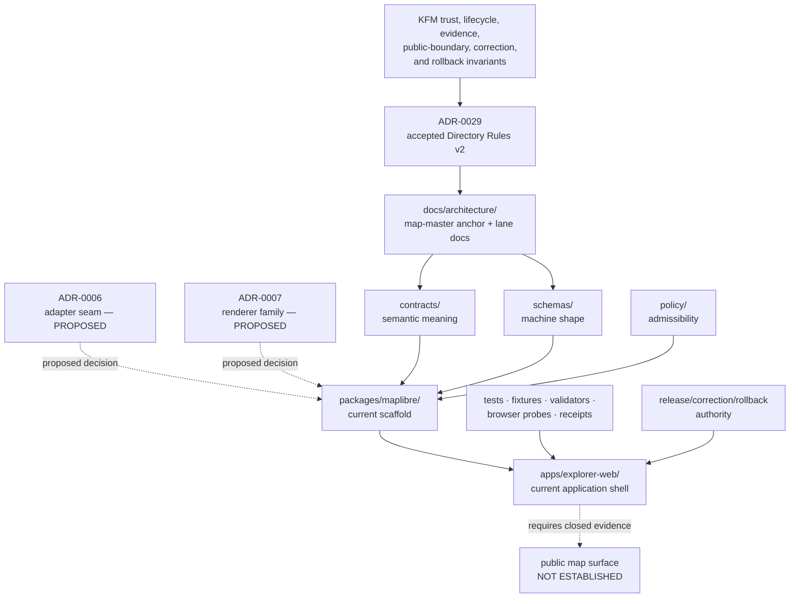
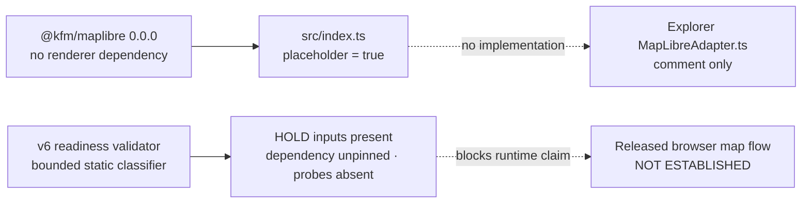
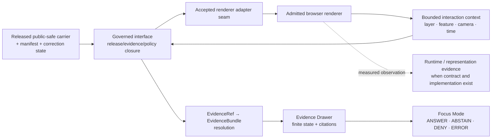
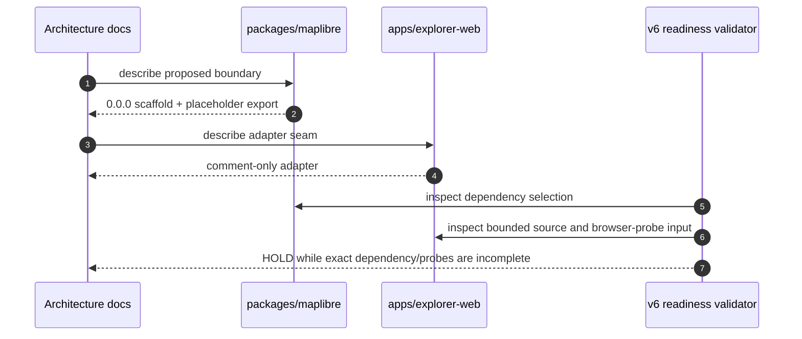
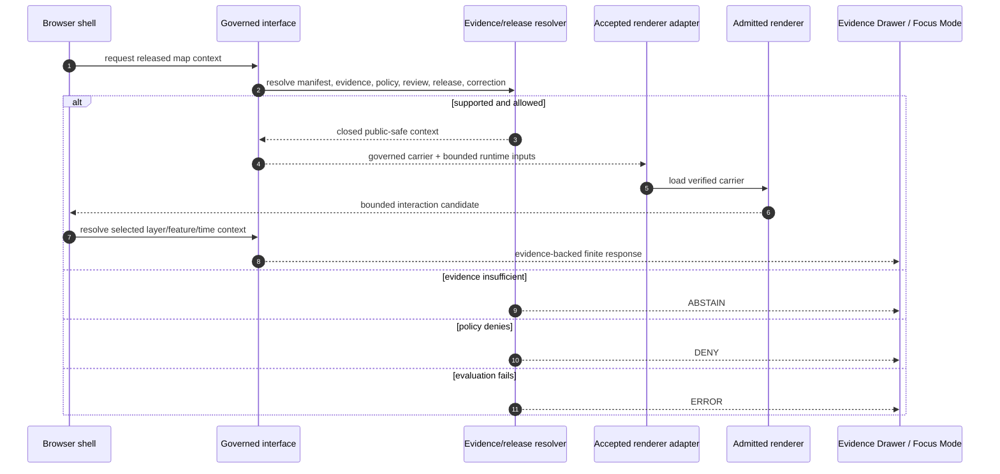

<a id="top"></a>
<a id="map-master--kfm-renderer-boundary-architecture-anchor"></a>

<!-- [KFM_META_BLOCK_V2]
doc_id: kfm://doc/architecture/map-master
title: Map-Master — KFM Map and Renderer Boundary Anchor
type: architecture
subtype: citation-anchor; map-runtime-boundary; convergence-sensitive
version: v2.0-draft
status: "draft; repository-grounded; compatibility-significant; convergence-hold; no-runtime-claim; no-release; no-publication"
owners:
  - "@bartytime4life — verified CODEOWNERS review route"
  - "NEEDS VERIFICATION — architecture, map/runtime, evidence, policy, validation, release, and documentation stewardship"
created: 2026-05-25
updated: 2026-08-19
policy_label: "public; architecture; map; renderer-boundary; evidence-aware; release-aware"
owning_root: docs/
current_path: docs/architecture/map-master.md
responsibility: >
  Preserve the repository's [MAP-MASTER] citation identity and explain the
  map/renderer trust boundary, current implementation evidence, decision state,
  map-documentation relationships, validation burden, correction obligations,
  and convergence hold without defining object meaning, machine shape, policy,
  runtime behavior, release, or publication.
truth_posture: >
  CONFIRMED current path, inbound use, accepted Directory Rules authority,
  repository-present package/application/validator surfaces, fixture-only
  LayerManifest profile, and current documentation overlap / PROPOSED
  renderer-family and adapter decisions, target governed flow, future runtime
  contracts, and convergence direction / UNKNOWN functioning browser renderer,
  released map flow, runtime evidence resolution, policy parity, receipt
  emission, deployment, public operation, and accountable specialist
  stewardship.
evidence_snapshot:
  repository: bartytime4life/Kansas-Frontier-Matrix
  base_ref: main
  base_commit: 232f7aeda87abbc46c85a8dd37b75cc9def8a2c5
  target_prior_blob: 132c9916551b226242cee8503cf80c10e92acf91
  directory_rules_blob: fd49a0b83e55cef52c1124281f093e263526898d
convergence:
  current_outcome: HOLD
  proposed_target: docs/architecture/map-master/README.md
  reason: >
    The repository convergence plan proposes migration only after complete
    no-loss comparison, [MAP-MASTER] citation review, identity and fragment
    closure, consumer repair, validation, and rollback are complete. This
    revision performs no structural migration.
related:
  - ./README.md
  - ./document-convergence-plan.md
  - ./map-master/README.md
  - ./map-master/RENDERER_BOUNDARY.md
  - ./map-master/EVIDENCE_DRAWER.md
  - ./map-master/LAYER_LIFECYCLE.md
  - ./map-master/TILE_ARTIFACTS.md
  - ./map-master/VIEWER_VERIFICATION.md
  - ./map-master/PERFORMANCE_BUDGETS.md
  - ./map-master/2D_3D_PARITY.md
  - ./maplibre.md
  - ./maplibre-master.md
  - ./map-shell.md
  - ./governed-api.md
  - ./contract-schema-policy-split.md
  - ../doctrine/directory-rules.md
  - ../adr/ADR-0029-adopt-directory-governance-standard-v2.md
  - ../adr/ADR-0006-maplibre-boundary--only-maplibreadapter-imports-maplibre.md
  - "../adr/ADR-0007 — MapLibre GL JS Is the Sole Browser-Side Renderer.md"
  - ../../contracts/data/layer_manifest.md
  - ../../schemas/contracts/v1/data/layer_manifest.schema.json
  - ../../packages/maplibre/README.md
  - ../../packages/maplibre/package.json
  - ../../packages/maplibre/src/index.ts
  - ../../apps/explorer-web/package.json
  - ../../apps/explorer-web/src/adapters/MapLibreAdapter.ts
  - ../../configs/maplibre/README.md
  - ../../tools/validators/maplibre/validate_v6_readiness.py
  - ../../tests/maplibre/test_validate_v6_readiness.py
  - ../../fixtures/maplibre/v6_readiness/cases.json
tags:
  - kfm
  - architecture
  - map-master
  - maplibre
  - renderer-boundary
  - trust-membrane
  - evidence-drawer
  - focus-mode
  - release
  - correction
  - rollback
  - convergence
notes:
  - "Same-path semantic modernization only; no document move, rename, tombstone, redirect, or deletion."
  - "The [MAP-MASTER] citation identity and every prior major-section anchor are preserved."
  - "ADR-0006 and ADR-0007 remain proposed; this document does not accept either decision."
  - "The current MapLibre package and Explorer adapter remain scaffolds; this document does not create or imply a functioning runtime."
  - "The strict LayerManifest profile remains proposed-inactive and fixture-only; this document does not activate a layer."
[/KFM_META_BLOCK_V2] -->

# Map-Master — KFM Map and Renderer Boundary Anchor

> **Purpose.** Preserve the **`[MAP-MASTER]`** citation target while explaining one durable rule: a browser renderer is downstream of evidence, policy, review, release, correction, and rollback. It may render governed carriers and return bounded interaction context; it does not create truth or publication authority.


> [!IMPORTANT]
> **This architecture page is not an implementation or decision record.** It does not accept ADR-0006 or ADR-0007, select or pin a renderer dependency, establish a working adapter, activate a source or layer, resolve evidence, evaluate policy, approve review, emit a release, deploy an application, or publish KFM material.

> [!CAUTION]
> **Do not migrate this path yet.** The repository's convergence plan proposes that this flat citation anchor eventually converge with [`map-master/README.md`](./map-master/README.md), but only after no-loss content comparison, citation-tag and fragment closure, consumer repair, validation, and rollback are complete. Those conditions are not closed in this change.

## Current checkpoint

| Field | Current bounded result |
|---|---|
| Evidence snapshot | `main@232f7aeda87abbc46c85a8dd37b75cc9def8a2c5` |
| Prior target blob | `132c9916551b226242cee8503cf80c10e92acf91` |
| Placement authority | [ADR-0029](../adr/ADR-0029-adopt-directory-governance-standard-v2.md) accepts the exact Directory Rules v2 bytes at [`docs/doctrine/directory-rules.md`](../doctrine/directory-rules.md) |
| Citation identity | **`[MAP-MASTER]` remains active and compatibility-significant** |
| Flat/folder convergence | **HOLD** — `map-master.md` and `map-master/README.md` remain separate tracked documents |
| Renderer seam decision | [ADR-0006](../adr/ADR-0006-maplibre-boundary--only-maplibreadapter-imports-maplibre.md) is `proposed` |
| Renderer-family decision | [ADR-0007](<../adr/ADR-0007 — MapLibre GL JS Is the Sole Browser-Side Renderer.md>) is `proposed` |
| Current implementation | `@kfm/maplibre` `0.0.0` scaffold, placeholder export, comment-only Explorer adapter, unpinned MapLibre dependency, and readiness `HOLD` inputs |
| Verified review route | `@bartytime4life` through `.github/CODEOWNERS`; specialist stewardship remains **NEEDS VERIFICATION** |
| Release/publication effect | None |

**Quick navigation:** [Why this anchor exists](#1-why-map-master-exists) · [Renderer boundary](#2-what-maplibre-is--and-what-it-is-not) · [Authority](#3-authority-subordination) · [Flow](#4-the-renderer-flow) · [Objects](#5-required-objects-and-contracts) · [Dossier categories](#6-category-map--the-v21-dossier-index) · [Three-column discipline](#7-the-three-column-discipline) · [Decision state](#8-renderer-decision-overlay) · [Placement](#9-schemas-contracts-policy-packages--placement) · [Negative states](#10-negative-states-are-first-class) · [Anti-patterns](#11-anti-patterns) · [Document map](#12-cross-document-map) · [Open verification](#13-open-questions) · [References](#14-related-docs) · [Illustrative sequences](#appendix-a--illustrative-renderer-decision-sequence) · [No-loss ledger](#appendix-b--no-loss-modernization-ledger)

---

<a id="1-why-map-master-exists"></a>

## 1. Why map-master exists

The KFM corpus and current repository use **`[MAP-MASTER]`** as a short citation label for map, renderer, tile, Evidence Drawer, Focus Mode, representation, and trust-boundary guidance. Repository search finds the label or this exact path in current architecture, domain, source, security, package, configuration, contract, atlas, and generated-receipt surfaces.

This file therefore has two responsibilities:

1. **Citation continuity.** Preserve the stable `kfm://doc/architecture/map-master` identity, path, legacy anchors, and high-level doctrine used by existing consumers.
2. **Bounded architecture.** Explain the map-facing trust boundary while routing implementation, object meaning, machine shape, admissibility, release, and local subsystem detail to their actual owners.

### 1.1 Current document relationship

| Surface | Current role | Current status |
|---|---|---|
| `docs/architecture/map-master.md` | Flat **`[MAP-MASTER]`** citation anchor and corpus-facing compatibility surface | **PLACE for this edit / structural convergence HOLD** |
| [`docs/architecture/map-master/README.md`](./map-master/README.md) | Repository-grounded lane entry point and direct-child map | **PLACE** |
| `docs/architecture/map-master/*.md` | Narrow map-lane guidance for renderer boundary, evidence drawer, layer lifecycle, tile artifacts, verification, performance, and parity | Tracked draft lineage; each claim requires its own evidence |
| [`docs/architecture/maplibre.md`](./maplibre.md) | Older flat MapLibre entry point | **PROPOSED convergence**; contains stale decision/path claims |
| [`docs/architecture/maplibre-master.md`](./maplibre-master.md) | Older component/register surface | **PROPOSED convergence**; preserve unique register material |
| [`docs/architecture/map-shell.md`](./map-shell.md) | Shell, interaction, Evidence Drawer, time, Focus Mode, and export architecture | **HOLD for responsibility split** in the convergence plan |

The [architecture convergence plan](./document-convergence-plan.md) assigns this flat file a provisional `MIGRATE` direction to the folder README. That is not an executed migration or a canonicality shortcut. The exact surviving identity, source/target content merge, citation-tag treatment, anchor aliases, and rollback mechanics remain review work.

### 1.2 What this page does not replace

This page does not replace:

- accepted doctrine or accepted ADRs;
- semantic contracts in `contracts/`;
- machine schemas in `schemas/`;
- policy in `policy/`;
- implementation in `packages/` or `apps/`;
- tests, fixtures, validators, workflows, browser probes, or emitted receipts;
- source, evidence, review, release, correction, or rollback records; or
- the deeper direct-child documents under `map-master/`.

[Back to top](#top)

---

<a id="2-what-maplibre-is--and-what-it-is-not"></a>

## 2. What MapLibre is — and what it is not

The durable rule is renderer-independent:

> **A renderer is an interpretive and delivery surface. It may draw released public-safe carriers, expose bounded camera/time/selection context, and display trust state. It does not become authoritative because it can render or query a feature.**

The current repository is MapLibre-oriented: it contains a private `@kfm/maplibre` package scaffold, a named Explorer adapter placeholder, MapLibre readiness validation, MapLibre-specific documentation, and a fixture-only `LayerManifest` representation constant. Those facts show a candidate architecture surface; they do **not** prove an accepted renderer decision or working runtime.

| A governed renderer **may be** | A governed renderer **must not become** |
|---|---|
| A 2D, 2.5D, globe, terrain, or admitted 3D rendering substrate after the relevant decision and runtime proof exist | The canonical truth store |
| An interaction runtime for camera, time, layer, and selection candidates | The source registry |
| A consumer of released public-safe layer, style, tile, raster, scene, and catalog carriers | The policy engine |
| A caller of governed interfaces for evidence resolution | The citation authority |
| A surface for visible stale, denied, restricted, generalized, conflicted, withdrawn, and error states | The review authority |
| A producer of bounded runtime or representation observations when a governed receipt contract exists | The publication authority |
| An input surface for evidence-bounded Focus Mode requests | The AI authority |
| A measured runtime whose exact dependency, browser support, and performance evidence are reviewable | Proof that a document, fixture, screenshot, or green workflow created a release |

### 2.1 Current repository facts

| Surface | CONFIRMED current evidence | Safe conclusion |
|---|---|---|
| [`packages/maplibre/package.json`](../../packages/maplibre/package.json) | Private package `@kfm/maplibre`, version `0.0.0`, with no declared dependency | Package scaffold only |
| [`packages/maplibre/src/index.ts`](../../packages/maplibre/src/index.ts) | Exports only `placeholder = true` | No functioning shared adapter is established |
| [`MapLibreAdapter.ts`](../../apps/explorer-web/src/adapters/MapLibreAdapter.ts) | Contains one boundary comment and no implementation | No functioning Explorer adapter is established |
| [`apps/explorer-web/package.json`](../../apps/explorer-web/package.json) | Vite, TypeScript, Vitest, and Playwright scripts exist; `maplibre-gl` is not declared | Browser toolchain exists; renderer dependency does not |
| [`validate_v6_readiness.py`](../../tools/validators/maplibre/validate_v6_readiness.py) | Deterministic bounded readiness classifier; exact version and browser probes are required | Eligibility classifier, not runtime or adoption proof |
| `configs/maplibre/v6-probe-results.json` | Absent at the evidence snapshot | Required browser probes remain unrecorded |
| [`LayerManifest` schema](../../schemas/contracts/v1/data/layer_manifest.schema.json) | Strict fixture profile uses `renderer: MAPLIBRE_GL_JS` and a closed protocol enum | Candidate-shape evidence only; no loader, policy, release, or public-use authority |

> [!IMPORTANT]
> **A candidate constant is not an accepted architecture decision.** The fixture-only schema can model a MapLibre candidate while ADR-0007 remains proposed and the runtime remains unimplemented.

[Back to top](#top)

---

<a id="3-authority-subordination"></a>

## 3. Authority subordination

The map surface sits downstream of KFM's authority-bearing roots. Accepted Directory Rules govern placement; accepted ADRs govern decisions within scope; contracts define meaning; schemas define shape; policy decides admissibility; implementation executes; tests and emitted evidence support behavior claims; release records govern public state.


```mermaid
flowchart TD
  INV["KFM trust, lifecycle, evidence,<br/>public-boundary, correction,<br/>and rollback invariants"]
  ADR29["ADR-0029<br/>accepted Directory Rules v2"]
  ADR6["ADR-0006<br/>adapter seam — PROPOSED"]
  ADR7["ADR-0007<br/>renderer family — PROPOSED"]
  ARCH["docs/architecture/<br/>map-master anchor + lane docs"]
  CTR["contracts/<br/>semantic meaning"]
  SCH["schemas/<br/>machine shape"]
  POL["policy/<br/>admissibility"]
  PKG["packages/maplibre/<br/>current scaffold"]
  APP["apps/explorer-web/<br/>current application shell"]
  PROOF["tests · fixtures · validators ·<br/>browser probes · receipts"]
  RELEASE["release/correction/rollback<br/>authority"]
  PUBLIC["public map surface<br/>NOT ESTABLISHED"]

  INV --> ADR29
  ADR29 --> ARCH
  ADR6 -. proposed decision .-> PKG
  ADR7 -. proposed decision .-> PKG
  ARCH --> CTR
  ARCH --> SCH
  CTR --> PKG
  SCH --> PKG
  POL --> PKG
  PKG --> APP
  PROOF --> APP
  RELEASE --> APP
  APP -. requires closed evidence .-> PUBLIC
```

The dashed lines are proposed or unestablished relationships. The diagram is an authority and evidence map, not a claim that the target runtime path currently operates.

### 3.1 Authority rules at this boundary

1. **Documentation explains; it does not instantiate.**
2. **A proposed ADR does not bind implementation.**
3. **A package name does not grant dependency ownership or runtime capability.**
4. **A fixture-valid manifest does not become released or public.**
5. **A renderer consumes stable identity; it does not mint evidence, policy, review, or release identity.**
6. **Client visibility never substitutes for release state.**
7. **Correction and rollback authority remain outside the renderer.**

[Back to top](#top)

---

<a id="4-the-renderer-flow"></a>

## 4. The renderer flow

### 4.1 Current bounded implementation flow

At the evidence snapshot, the repository can be described without inference:


```mermaid
flowchart LR
  PKG["@kfm/maplibre 0.0.0<br/>no renderer dependency"]
  IDX["src/index.ts<br/>placeholder = true"]
  ADP["Explorer MapLibreAdapter.ts<br/>comment only"]
  VAL["v6 readiness validator<br/>bounded static classifier"]
  HOLD["HOLD inputs present<br/>dependency unpinned · probes absent"]
  PUB["Released browser map flow<br/>NOT ESTABLISHED"]

  PKG --> IDX
  IDX -. no implementation .-> ADP
  VAL --> HOLD
  HOLD -. blocks runtime claim .-> PUB
```

This flow proves a scaffold and a fail-closed readiness posture. It does not prove a browser renderer, layer load, evidence resolution, policy evaluation, release manifest, public endpoint, Evidence Drawer, Focus Mode, correction propagation, or rollback.

### 4.2 Proposed governed flow

The target architecture remains **PROPOSED** until accepted decisions, contracts, implementation, tests, and release evidence close it:


```mermaid
flowchart LR
  REL["Released public-safe carrier<br/>+ manifest + correction state"]
  API["Governed interface<br/>release/evidence/policy closure"]
  ADP["Accepted renderer adapter seam"]
  REND["Admitted browser renderer"]
  INT["Bounded interaction context<br/>layer · feature · camera · time"]
  RES["EvidenceRef → EvidenceBundle<br/>resolution"]
  DRAWER["Evidence Drawer<br/>finite state + citations"]
  FOCUS["Focus Mode<br/>ANSWER · ABSTAIN · DENY · ERROR"]
  RECEIPT["Runtime / representation evidence<br/>when contract and implementation exist"]

  REL --> API
  API --> ADP
  ADP --> REND
  REND --> INT
  INT --> API
  API --> RES
  RES --> DRAWER
  DRAWER --> FOCUS
  REND -. measured observation .-> RECEIPT
```

Required boundaries:

- only released public-safe carriers reach the ordinary browser path;
- selection and camera state are candidates, not evidence;
- `EvidenceRef` must resolve before a consequential claim is treated as supported;
- policy, review, release, correction, and withdrawal state remain visible;
- failure returns a finite state rather than an unsafe fallback; and
- runtime observations do not create review or release authority.

[Back to top](#top)

---

<a id="5-required-objects-and-contracts"></a>

## 5. Required objects and contracts

The map boundary depends on several object families, but their current maturity differs. This table deliberately separates present repository evidence from target architecture.

| Object or surface | Boundary role | Current bounded status |
|---|---|---|
| `SourceDescriptor` | Source identity, authority role, terms, cadence, and permitted use | Required by KFM doctrine; map-runtime consumption **NOT ESTABLISHED** |
| `LayerManifest` | Candidate layer identity, representation, evidence/source refs, time, exposure, trust state, lineage, and runtime declarations | **CONFIRMED** semantic contract and dual-profile schema; strict profile is `PROPOSED_INACTIVE` and `FIXTURE_ONLY` |
| `StyleManifest` | Style identity, semantic intent, sprite/glyph/assets, accessibility, and digest binding | **NEEDS VERIFICATION** as an authoritative current map-runtime object |
| `TileArtifactManifest` | Carrier identity, format, digest, bounds, byte/range properties, and provenance | Contract/document surfaces exist; authoritative runtime binding **NEEDS VERIFICATION** |
| `MapReleaseManifest` | Release-scoped binding among map carriers, evidence, policy/review, proof, correction, and rollback | Multiple current documentation/contract lanes exist; canonical machine/runtime closure **NEEDS VERIFICATION** |
| `EvidenceRef` / `EvidenceBundle` | Pointer and resolved support for claims and drawer/focus context | Core KFM doctrine; map-runtime resolution **NOT ESTABLISHED** |
| `DecisionEnvelope` / finite outcome | Carries `ANSWER`, `ABSTAIN`, `DENY`, or `ERROR` with bounded reasons | Target boundary requirement; current map runtime **NOT ESTABLISHED** |
| `PolicyDecision` | Admissibility, obligations, denial, redaction, restriction, or hold | Distinct authority required; browser integration **NOT ESTABLISHED** |
| `ReviewRecord` | Accountable human review state | Distinct authority required; browser integration **NOT ESTABLISHED** |
| `PromotionDecision` / release decision | Governs transition into a release state | Distinct authority required; no map release proved |
| `RunReceipt` | Records a bounded execution against pinned inputs and versions | Repository object family; map-render execution binding **NEEDS VERIFICATION** |
| `RenderReceipt` / `RepresentationReceipt` | Proposed record of what was rendered and under which exact inputs | **PROPOSED**; no current emission proof |
| `AIReceipt` | Model/provider/runtime/citation/policy outcome without private chain-of-thought | Governed-AI doctrine; map Focus Mode emission **NOT ESTABLISHED** |
| `CorrectionNotice` / withdrawal / rollback reference | Makes stale or invalid public map state reversible and visible | Required by doctrine; no released map lineage proved |
| `ValidationReport` | Records schema, policy, geometry, citation, artifact, browser, and boundary findings | Validator families exist; map-wide closure **PARTIAL / NEEDS VERIFICATION** |

### 5.1 Confirmed LayerManifest boundary

The repository's current strict `LayerManifest` profile is intentionally narrow:

- status `PROPOSED_INACTIVE`;
- execution mode `FIXTURE_ONLY`;
- lifecycle state fixed to `CANDIDATE`;
- protocols limited to `PMTILES`, `XYZ`, `COG`, and `GEOJSON_FIXTURE`;
- renderer constant `MAPLIBRE_GL_JS`;
- local deterministic identity and semantic checks only;
- no reference resolution, artifact verification, policy execution, review authentication, signing, release, publication, or public-use authority.

A passing fixture therefore proves only local shape and deterministic invariants. It does not prove a layer can or may be loaded.

### 5.2 Identity discipline

The renderer boundary should consume identities produced by their owning object families. A browser implementation must not silently replace:

- source identity with a URL;
- evidence identity with feature properties;
- release identity with a visible layer;
- policy identity with a style expression;
- review identity with a UI toggle;
- correction identity with cache age; or
- runtime evidence with a screenshot.

[Back to top](#top)

---

<a id="6-category-map--the-v21-dossier-index"></a>

## 6. Category map — the v2.1 dossier index

The source dossier historically cited as *Master MapLibre Components-Functions-Features v2.1* organizes map concerns into **27 labels: A–Z plus AA**. This table preserves the citation crosswalk. It is **source-dossier lineage**, not a claim that each category has an accepted KFM contract or implementation.

<details>
<summary><strong>Expand the [MAP-MASTER] category crosswalk</strong></summary>

| ID | Category |
|---|---|
| **A** | Renderer boundary and KFM trust law |
| **B** | Browser map shell |
| **C** | Native, mobile, and platform parity |
| **D** | Experimental renderer research |
| **E** | Style specification, sources, layers, and expressions |
| **F** | Sprites, glyphs, fonts, and design tokens |
| **G** | GeoJSON and runtime data |
| **H** | Vector tiles: MVT and MLT |
| **I** | PMTiles, MBTiles, static tiles, and serverless delivery |
| **J** | Server-mediated tile serving |
| **K** | Raster, COG, DEM, terrain, and hillshade |
| **L** | WMS, WMTS, OGC API — Tiles, and external map services |
| **M** | Layer, style, tile-artifact, and map-release manifests |
| **N** | Evidence Drawer payloads and click resolution |
| **O** | Focus Mode and governed-AI map context |
| **P** | Time-aware map interaction and timeline |
| **Q** | Sensitive geometry, geoprivacy, rights, and policy |
| **R** | Plugin, wrapper, protocol, and dependency governance |
| **S** | Accessibility, UX, and trust-visible states |
| **T** | Performance, caching, CDN, range requests, and resource timing |
| **U** | Testing, CI, validation, rollback, and proof objects |
| **V** | Exports, screenshots, reports, and citation preservation |
| **W** | 3D, representation, reality-boundary, and overlay interoperability |
| **X** | Anti-patterns and failure modes |
| **Y** | Implementation backlog and dependency order |
| **Z** | Open questions and verification backlog |
| **AA** | Source watchers, material-change gates, and drift summaries |

</details>

> [!NOTE]
> Category labels are navigation aids. They do not decide renderer adoption, schema authority, source activation, policy, release, or implementation status. Where the older dossier or sibling pages assume a dual-renderer or Cesium path, that material remains **CONFLICTED lineage** until an accepted architecture decision resolves it.

[Back to top](#top)

---

<a id="7-the-three-column-discipline"></a>

## 7. The three-column discipline

Every map-touching change should answer three questions without collapsing their authorities.

| Column | Required posture |
|---|---|
| **Public UI implication** | Show released layer state, freshness, degraded/held/denied/restricted/generalized/withdrawn state, citations, release identity, and correction state. Never expose raw watcher state, unreleased artifact locators, canonical/internal stores, private denial reasons, or direct model output. |
| **Policy implication** | Fail closed when rights, source authority, sensitivity, review, signatures or integrity, evidence closure, source-role labels, or release state are missing. Sensitive geometry must be transformed before delivery, not merely hidden by a client style. |
| **Validation evidence** | Validate contracts and schemas, prohibit public RAW/WORK/QUARANTINE paths, prevent unreleased loads, verify artifact identity and source-layer compatibility, test browser/CSP/worker behavior, exercise finite Evidence Drawer/Focus outcomes, preserve accessibility, measure budgets, and prove correction/rollback/cache behavior where applicable. |

### 7.1 Why the columns stay separate

- UI presentation cannot create policy.
- Policy approval cannot prove browser behavior.
- A passing browser test cannot create a release.
- A release manifest cannot prove source rights unless the referenced decision does.
- A hidden layer cannot substitute for redaction.
- A validator receipt cannot substitute for human review.
- Documentation cannot substitute for any of the above.

[Back to top](#top)

---

<a id="8-renderer-decision-overlay"></a>

## 8. Renderer-decision overlay

The previous edition stated that MapLibre was the accepted sole browser renderer and that Cesium was retired. **Current repository evidence does not support that as an accepted decision.**

### 8.1 Current decision state

| Concern | Current state | Safe conclusion |
|---|---|---|
| Adapter/acquisition seam | ADR-0006 exists with effective status `proposed` | One-seam architecture is a reviewed proposal, not binding law |
| Renderer family | ADR-0007 exists with effective status `proposed` | MapLibre-only browser rendering is a proposal, not an accepted decision |
| Current package home | `packages/maplibre/` exists | Existing tracked home receives a same-path presumption; no sibling active home should be invented |
| Supplied-lineage package name | `packages/maplibre-runtime/` appears in older design documents but is absent at the checked tree | **Do not create it as a parallel active package** without an accepted decision and migration treatment |
| MapLibre dependency | Not declared in root, Explorer, or current package manifests inspected by the readiness path | Runtime dependency is unpinned |
| MapLibre adapter | Package export and Explorer adapter are placeholders | Functional seam is not established |
| Browser probes | Required committed probe-results file is absent | Runtime readiness remains held |
| Cesium | No accepted current decision was inspected that formally retires it; absence at a checked package path is not an exhaustive dependency inventory | Do not claim accepted retirement or reintroduce a peer renderer by implication |
| Strict `LayerManifest` renderer constant | `MAPLIBRE_GL_JS` in an inactive fixture profile | Candidate machine shape, not architecture acceptance |

### 8.2 Decision gates before an operational claim

A future acceptance packet should close at least:

1. exact renderer vocabulary and scope;
2. one physical adapter/package home;
3. one dependency owner and exact version/update policy;
4. complete acquisition inventory, including dynamic imports, workers, scripts, protocols, plugins, globals, examples, and tests;
5. plugin/custom-layer admission and removal rules;
6. structural import/acquisition enforcement;
7. representative browser probes tied to the exact dependency and head;
8. governed layer/evidence/policy/release/correction behavior;
9. rollback and compatibility treatment;
10. accountable human review and coherent ADR/index status.

Until then, the bounded outcome is **HOLD**, not implied adoption.

[Back to top](#top)

---

<a id="9-schemas-contracts-policy-packages--placement"></a>

## 9. Schemas, contracts, policy, packages — placement

Accepted Directory Rules v2 determine responsibility roots. The producer or topic does not choose the home.

| Responsibility | Owning root | Current map-boundary example |
|---|---|---|
| Cross-root human explanation | `docs/architecture/` | This page and `map-master/README.md` |
| Semantic object meaning | `contracts/` | [`contracts/data/layer_manifest.md`](../../contracts/data/layer_manifest.md) |
| Machine-checkable shape | `schemas/` | [`schemas/contracts/v1/data/layer_manifest.schema.json`](../../schemas/contracts/v1/data/layer_manifest.schema.json) |
| Admissibility and obligations | `policy/` | Map-specific current authoritative bundle **NEEDS VERIFICATION** |
| Reusable renderer implementation | `packages/` | [`packages/maplibre/`](../../packages/maplibre/README.md) — current scaffold |
| Deployable browser shell | `apps/` | [`apps/explorer-web/`](../../apps/explorer-web/package.json) |
| Deterministic validation | `tools/validators/` | [`validate_v6_readiness.py`](../../tools/validators/maplibre/validate_v6_readiness.py) |
| Positive/negative behavior proof | `tests/` and `fixtures/` | MapLibre readiness test and fixture families |
| Non-secret environment/product configuration | `configs/` | [`configs/maplibre/README.md`](../../configs/maplibre/README.md) |
| Lifecycle records and carriers | `data/<stage>/`, receipt/proof families, and release authority | No active map release flow is established by this page |

### 9.1 Current-home rule

This revision describes current paths; it creates no new path family. In particular:

- keep `packages/maplibre/` as the only current package candidate unless an accepted decision authorizes a migration;
- do not create `packages/maplibre-runtime/` as an active peer;
- do not copy semantic contracts into architecture prose;
- do not treat a schema constant as policy or an accepted ADR;
- do not place release decisions, receipts, proofs, or published carriers under `docs/`;
- do not create a second `[MAP-MASTER]` write authority during documentation convergence.

### 9.2 Proposed surfaces

A proposed contract, schema, policy bundle, adapter, receipt, or renderer feature must remain visibly **PROPOSED** until:

- the owning root and object family are verified;
- no canonical equivalent or parallel authority exists;
- field semantics and machine shape are paired correctly;
- policy and sensitivity responsibilities are explicit;
- fixtures and tests cover positive and fail-closed cases;
- consumers and migration are known; and
- correction and rollback are defined.

[Back to top](#top)

---

<a id="10-negative-states-are-first-class"></a>

## 10. Negative states are first-class

The target map experience must not convert missing, denied, stale, conflicted, or withdrawn support into a blank success state. The states below are **PROPOSED UI/runtime behavior** unless separately proved.

| Negative state | Trigger | Required bounded behavior |
|---|---|---|
| `MISSING_EVIDENCE` | An evidence reference does not resolve to admissible support | `ABSTAIN`; no authoritative claim |
| `SOURCE_STALE` | Source cadence or temporal support is exceeded | Mark stale; narrow or abstain |
| `DENIED_BY_POLICY` | Policy denies exposure | `DENY`; do not render protected content or sensitive reasons |
| `GENERALIZED_GEOMETRY` | Public-safe transform changes source precision | Show generalization/reality note and transform lineage |
| `RESTRICTED_ACCESS` | Release is limited to an authorized audience | Do not render for unauthorized clients |
| `CONFLICTED_SUPPORT` | Admissible sources disagree | Surface conflict; do not flatten into one confident value |
| `CITATION_FAILED` | Citation validation fails | `ABSTAIN`; do not emit unsupported AI or popup language |
| `RELEASE_WITHDRAWN` | Correction, withdrawal, or rollback invalidates the carrier | Disable or replace the carrier and show correction state |
| `RUNTIME_ERROR` | Resolver, adapter, renderer, policy, or delivery operation fails | `ERROR`; no unsafe fallback |
| `READINESS_HOLD` | Dependency, probe, review, or admission evidence is incomplete | Do not claim operational readiness |

### 10.1 Sensitive reasons

A public state may say that access is denied or geometry is generalized without exposing the sensitive reason, source precision, private identifier, restricted location, or operational detail that caused the decision.

[Back to top](#top)

---

<a id="11-anti-patterns"></a>

## 11. Anti-patterns

| # | Anti-pattern | Why it fails | Deny or correction surface |
|---:|---|---|---|
| AP-1 | Public client reads RAW, WORK, QUARANTINE, or an internal canonical store | Bypasses lifecycle and release authority | Governed interface and public-path tests |
| AP-2 | Renderer output or feature properties are treated as truth | Pixels and carrier fields replace evidence | Evidence resolver and drawer boundary |
| AP-3 | A proposed ADR is described as accepted | Documentation invents decision authority | ADR/index review and docs validation |
| AP-4 | Package scaffold or placeholder adapter is described as a working runtime | Repository presence is overstated | Current-state evidence table and browser proof |
| AP-5 | Fixture-valid `LayerManifest` is described as released or loadable | Shape validation becomes publication authority | Profile-status and loader/release gates |
| AP-6 | Sensitive geometry is shipped and hidden only by style | Data remains exposed to the client | Pre-delivery transform, policy, and release review |
| AP-7 | A client-only check decides trust, rights, or release | Trust enforcement moves outside the membrane | Governed API and release validation |
| AP-8 | AI or popup prose is emitted without resolved evidence and citation validation | Generated language becomes root truth | Focus Mode finite outcomes and citation gate |
| AP-9 | A new active `packages/maplibre-runtime/` is created beside `packages/maplibre/` | Parallel implementation authority | Directory Rules and migration review |
| AP-10 | Unreviewed CDN/global/dynamic acquisition bypasses the owning package and lock | Dependency identity and supply-chain evidence are lost | Acquisition inventory and CI enforcement |
| AP-11 | A second renderer is added or rejected solely through prose | Architecture choice bypasses an explicit decision packet | Scoped ADR and dependency/policy/rollback review |
| AP-12 | Release lacks correction, withdrawal, rollback, or cache treatment | Public state cannot be safely reversed | Release authority and rollback drill |
| AP-13 | Negative states are silently hidden | Users cannot distinguish no data, denial, staleness, and failure | Trust-visible UI requirements |
| AP-14 | Documentation convergence deletes the flat anchor before citation/fragment closure | Current consumers and stable identity break | Convergence plan, aliases, link checks, rollback |

[Back to top](#top)

---

<a id="12-cross-document-map"></a>

## 12. Cross-document map

| Neighbor | Responsibility at this checkpoint | Relationship to this anchor |
|---|---|---|
| [`docs/architecture/README.md`](./README.md) | Architecture-lane contract and current topology | Parent entry point |
| [`document-convergence-plan.md`](./document-convergence-plan.md) | Provisional migration ledger and validation/rollback sequence | Places flat/folder convergence on explicit review queue |
| [`map-master/README.md`](./map-master/README.md) | Repository-grounded map-lane entry point | Proposed eventual active target; not yet the sole citation authority |
| [`map-master/RENDERER_BOUNDARY.md`](./map-master/RENDERER_BOUNDARY.md) | Narrow renderer negative-authority guidance | Local detail |
| [`map-master/EVIDENCE_DRAWER.md`](./map-master/EVIDENCE_DRAWER.md) | Narrow click-to-evidence guidance | Local detail; runtime existence needs proof |
| [`map-master/LAYER_LIFECYCLE.md`](./map-master/LAYER_LIFECYCLE.md) | Layer release/correction/rollback concepts | Local detail |
| [`map-master/TILE_ARTIFACTS.md`](./map-master/TILE_ARTIFACTS.md) | Tile carrier identity and delivery concepts | Local detail |
| [`map-master/VIEWER_VERIFICATION.md`](./map-master/VIEWER_VERIFICATION.md) | Fail-closed viewer verification concepts | Local detail |
| [`map-master/PERFORMANCE_BUDGETS.md`](./map-master/PERFORMANCE_BUDGETS.md) | Candidate budgets and measurements | Targets require current run evidence |
| [`map-master/2D_3D_PARITY.md`](./map-master/2D_3D_PARITY.md) | Legacy dual-renderer parity guidance | **STALE / CONFLICTED** with proposed ADR-0007; neither view is accepted |
| [`maplibre.md`](./maplibre.md) | Older flat MapLibre entry point | Overlapping, stale decision/path claims; convergence candidate |
| [`maplibre-master.md`](./maplibre-master.md) | Older component register | Preserve unique component material during convergence |
| [`map-shell.md`](./map-shell.md) | Shell, time, drawer, Focus Mode, export, and story interaction | Shell responsibilities remain distinct from renderer adapter internals |
| [`governed-api.md`](./governed-api.md) | Trust-membrane and governed-interface explanation | Ordinary map clients must not bypass it |
| [`contract-schema-policy-split.md`](./contract-schema-policy-split.md) | Meaning, shape, admissibility, and proof responsibility split | Prevents authority collapse |
| [Directory Rules](../doctrine/directory-rules.md) | Accepted placement doctrine through ADR-0029 | Governs paths and convergence |
| [ADR-0006](../adr/ADR-0006-maplibre-boundary--only-maplibreadapter-imports-maplibre.md) | Proposed adapter/acquisition seam | Does not bind until accepted |
| [ADR-0007](<../adr/ADR-0007 — MapLibre GL JS Is the Sole Browser-Side Renderer.md>) | Proposed renderer-family decision | Does not bind until accepted |
| [`LayerManifest` contract](../../contracts/data/layer_manifest.md) | Current semantic candidate profile | Architecture consumes meaning; does not redefine it |
| [`LayerManifest` schema](../../schemas/contracts/v1/data/layer_manifest.schema.json) | Current dual-profile machine shape | Architecture does not upgrade fixture-only status |

### 12.1 Convergence boundary

This same-path update deliberately leaves:

- both document identities intact;
- every current inbound path unchanged;
- every prior explicit section anchor available;
- the folder README unchanged;
- all direct-child documents unchanged;
- ADR statuses unchanged;
- package/application/schema/contract bytes unchanged; and
- migration, tombstoning, redirecting, and deletion unexecuted.

[Back to top](#top)

---

<a id="13-open-questions"></a>

## 13. Open questions

| ID | Status | Question or required closure |
|---|---|---|
| OQ-MM-01 | `HOLD` | Which document identity survives flat/folder convergence, and how will **`[MAP-MASTER]`**, path, fragments, and external consumers be preserved? |
| OQ-MM-02 | `NEEDS VERIFICATION` | What unique material in this flat anchor, the folder README, `maplibre.md`, and `maplibre-master.md` must be retained or routed before any migration? |
| OQ-MM-03 | `PROPOSED` | Will ADR-0006 be accepted, revised, or held, and what exact physical package and acquisition boundary will it select? |
| OQ-MM-04 | `PROPOSED` | Will ADR-0007 be accepted, revised, or held, and what exact renderer/plugin/peer-renderer vocabulary will it govern? |
| OQ-MM-05 | `NEEDS VERIFICATION` | Which exact MapLibre version, distribution mode, worker/CSP strategy, support matrix, and update policy will be reviewed? |
| OQ-MM-06 | `NEEDS VERIFICATION` | What complete dependency/acquisition inventory exists across manifests, source imports, scripts, CDN references, globals, workers, plugins, examples, and generated output? |
| OQ-MM-07 | `NEEDS VERIFICATION` | When will the required browser probes be executed against the exact candidate and committed in a governed record? |
| OQ-MM-08 | `UNKNOWN` | Which component will load a released manifest, resolve EvidenceRef to EvidenceBundle, enforce policy/review/release state, and return finite map outcomes? |
| OQ-MM-09 | `UNKNOWN` | Are `RenderReceipt` or `RepresentationReceipt` authoritative object families, and does any current runtime emit them? |
| OQ-MM-10 | `CONFLICTED` | How will stale dual-renderer guidance in `2D_3D_PARITY.md` be reconciled without pre-accepting ADR-0007? |
| OQ-MM-11 | `NEEDS VERIFICATION` | Which `MapReleaseManifest`, style-manifest, and tile-artifact contract/schema lanes are authoritative, compatible, or parallel proposals? |
| OQ-MM-12 | `UNKNOWN` | What tested correction, withdrawal, rollback, and cache-invalidation path exists for a future released map carrier? |
| OQ-MM-13 | `UNKNOWN` | What Evidence Drawer and Focus Mode behavior is implemented rather than documented? |
| OQ-MM-14 | `NEEDS VERIFICATION` | Which specialist owners and independent reviewers are accountable for architecture, renderer, policy, sensitivity, evidence, security, release, and accessibility decisions? |

[Back to top](#top)

---

<a id="14-related-docs"></a>

## 14. Related docs

| Path | Current bounded status |
|---|---|
| [`docs/doctrine/directory-rules.md`](../doctrine/directory-rules.md) | Exact bytes accepted through ADR-0029; internally retains its pre-adoption label |
| [`ADR-0029`](../adr/ADR-0029-adopt-directory-governance-standard-v2.md) | `accepted`; single writable Directory Rules authority established |
| [`ADR-0006`](../adr/ADR-0006-maplibre-boundary--only-maplibreadapter-imports-maplibre.md) | `proposed`; repository-grounded decision packet |
| [`ADR-0007`](<../adr/ADR-0007 — MapLibre GL JS Is the Sole Browser-Side Renderer.md>) | `proposed`; repository-grounded decision packet |
| [`docs/architecture/map-master/README.md`](./map-master/README.md) | Repository-grounded lane entry point; structural convergence not executed |
| [`docs/architecture/maplibre.md`](./maplibre.md) | Older overlapping entry point with stale accepted-decision and proposed-path claims |
| [`docs/architecture/maplibre-master.md`](./maplibre-master.md) | Overlapping component/register surface; unique material requires review |
| [`docs/architecture/map-shell.md`](./map-shell.md) | Shell/interaction architecture; implementation maturity must be separately proved |
| [`docs/architecture/governed-api.md`](./governed-api.md) | Trust-membrane architecture; no released map route is implied here |
| [`docs/architecture/contract-schema-policy-split.md`](./contract-schema-policy-split.md) | Cross-root responsibility explanation |
| [`contracts/data/layer_manifest.md`](../../contracts/data/layer_manifest.md) | v0.3 dual-profile semantic contract; strict profile inactive and fixture-only |
| [`schemas/contracts/v1/data/layer_manifest.schema.json`](../../schemas/contracts/v1/data/layer_manifest.schema.json) | Dual-profile machine shape; no runtime/release/public authority |
| [`packages/maplibre/README.md`](../../packages/maplibre/README.md) | Current package documentation; package implementation remains scaffolded |
| [`packages/maplibre/package.json`](../../packages/maplibre/package.json) | Private `@kfm/maplibre` `0.0.0`; no MapLibre dependency |
| [`packages/maplibre/src/index.ts`](../../packages/maplibre/src/index.ts) | Placeholder export only |
| [`apps/explorer-web/src/adapters/MapLibreAdapter.ts`](../../apps/explorer-web/src/adapters/MapLibreAdapter.ts) | Comment-only adapter placeholder |
| [`validate_v6_readiness.py`](../../tools/validators/maplibre/validate_v6_readiness.py) | Bounded deterministic readiness classifier; not adoption/runtime proof |
| [`tests/maplibre/test_validate_v6_readiness.py`](../../tests/maplibre/test_validate_v6_readiness.py) | Focused classifier tests |
| [`fixtures/maplibre/v6_readiness/cases.json`](../../fixtures/maplibre/v6_readiness/cases.json) | Synthetic classifier cases |
| [`configs/maplibre/README.md`](../../configs/maplibre/README.md) | MapLibre configuration boundary documentation |

[Back to top](#top)

---

<a id="appendix-a--illustrative-renderer-decision-sequence"></a>

## Appendix A — Illustrative renderer-decision sequence

> [!WARNING]
> **Illustrative target flow only.** No exact route, payload, policy bundle, adapter API, manifest resolver, or receipt-emission behavior below is claimed as current implementation.

### A.1 Current evidence sequence


```mermaid
sequenceDiagram
    autonumber
    participant DOC as Architecture docs
    participant PKG as packages/maplibre
    participant APP as apps/explorer-web
    participant VAL as v6 readiness validator

    DOC->>PKG: describe proposed boundary
    PKG-->>DOC: 0.0.0 scaffold + placeholder export
    DOC->>APP: describe adapter seam
    APP-->>DOC: comment-only adapter
    VAL->>PKG: inspect dependency selection
    VAL->>APP: inspect bounded source and browser-probe input
    VAL-->>DOC: HOLD while exact dependency/probes are incomplete
```

### A.2 Proposed governed load sequence


```mermaid
sequenceDiagram
    autonumber
    participant APP as Browser shell
    participant API as Governed interface
    participant RES as Evidence/release resolver
    participant ADP as Accepted renderer adapter
    participant REND as Admitted renderer
    participant UI as Evidence Drawer / Focus Mode

    APP->>API: request released map context
    API->>RES: resolve manifest, evidence, policy, review, release, correction
    alt supported and allowed
        RES-->>API: closed public-safe context
        API-->>ADP: governed carrier + bounded runtime inputs
        ADP->>REND: load verified carrier
        REND-->>APP: bounded interaction candidate
        APP->>API: resolve selected layer/feature/time context
        API-->>UI: evidence-backed finite response
    else evidence insufficient
        RES-->>UI: ABSTAIN
    else policy denies
        RES-->>UI: DENY
    else evaluation fails
        RES-->>UI: ERROR
    end
```

### A.3 Map-boundary review checklist

```text
- [ ] Base commit, target blob, open overlap, and applicable instructions are pinned
- [ ] Directory Rules and accepted ADRs are separated from proposed ADRs
- [ ] [MAP-MASTER] path, document identity, fragments, and consumers remain intact
- [ ] No parallel packages/maplibre-runtime active home is introduced
- [ ] Exact renderer dependency and owning manifest are explicit and lockfile-closed
- [ ] Static, dynamic, worker, CDN/global, plugin, protocol, example, and test acquisition is inventoried
- [ ] Contracts define meaning; schemas define shape; policy decides admissibility
- [ ] Fixture-only LayerManifest validation is not represented as release or runtime proof
- [ ] Only released public-safe carriers may reach the ordinary browser path
- [ ] Sensitive geometry is transformed before delivery, not hidden only by style
- [ ] EvidenceRef resolution, citation validation, and finite outcomes are tested
- [ ] Browser/CSP/worker/style/query/terrain/performance/accessibility probes are tied to the exact head
- [ ] Correction, withdrawal, rollback, and cache behavior are defined and exercised where applicable
- [ ] Documentation, generated receipts, and registries are updated without inventing authority
```

[Back to top](#top)

---

<a id="appendix-b--no-loss-modernization-ledger"></a>

## Appendix B — No-loss modernization ledger

| Prior surface | Treatment in this revision |
|---|---|
| `kfm://doc/architecture/map-master` | Preserved |
| `docs/architecture/map-master.md` | Preserved; updated in place |
| **`[MAP-MASTER]`** citation role | Preserved and made repository-grounded |
| Prior H1 fragment | Preserved through explicit anchor `map-master--kfm-renderer-boundary-architecture-anchor` |
| Sections 1–14 and Appendix A anchors | Preserved exactly |
| Renderer-is/is-not discipline | Preserved, with current decision and implementation boundaries corrected |
| Authority and renderer-flow diagrams | Retained as corrected current/target views |
| Required object-family map | Preserved, with maturity labels and fixture-only boundary added |
| A–Z + AA category crosswalk | Preserved without stale implementation/count claims |
| Three-column discipline | Preserved |
| Negative-state and anti-pattern guidance | Preserved and expanded with current failure modes |
| “MapLibre sole renderer / Cesium retired” | Corrected to ADR-0007 `proposed`; no acceptance claimed |
| `packages/maplibre-runtime/` active-home claim | Removed; current `packages/maplibre/` scaffold is recorded and parallel-home creation is denied |
| Nonexistent `maplibre-3d.md` dependency | Removed from current related-document claims |
| “No repo inspected” posture | Replaced with commit-pinned repository evidence |
| Placeholder owner and CI badge | Replaced with verified CODEOWNERS route and bounded validation status |
| Structural migration | Not performed; convergence remains HOLD |
| Contracts, schemas, policy, code, tests, data, release, deployment, publication | Unchanged |

---

> **Last reviewed:** 2026-08-19 · **Evidence snapshot:** `main@232f7aeda87abbc46c85a8dd37b75cc9def8a2c5` · **Status:** repository-grounded draft · **Runtime:** HOLD · **Release/publication:** none

[Back to top](#top)
