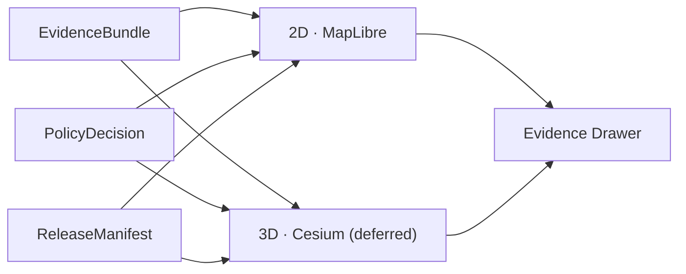

<!-- [KFM_META_BLOCK_V2]
doc_id: kfm://doc/architecture-map-master-2d-3d-parity
title: Map Master — 2D / 3D Parity
type: standard
version: v0.1
status: draft
owners: UI subsystem steward + Docs steward · NEEDS VERIFICATION
created: 2026-05-24
updated: 2026-05-24
policy_label: public
related:
  - README.md
  - ../map-shell.md
  - RENDERER_BOUNDARY.md
  - LAYER_LIFECYCLE.md
  - EVIDENCE_DRAWER.md
  - ../cross-domain/compositional-units.md
  - ../planetary-3d.md
tags: [kfm, architecture, map-master, 3d, cesium, reality-boundary, parity, doctrine]
notes:
  - PROPOSED. Expands map-shell.md §14 FAQ (3D) and §11 (parity validation).
  - Cesium / 3D consumes the same EvidenceBundle and DecisionEnvelope as 2D.
[/KFM_META_BLOCK_V2] -->

<a id="top"></a>

# Map Master — 2D / 3D Parity

> *Cesium and any future 3D renderer consume the same `EvidenceBundle` and `DecisionEnvelope` as 2D MapLibre. Reality Boundary Note discipline keeps synthetic / reconstructed / simulated content honest. 3D admission gate denies otherwise.*


-blue)


**Status:** draft · **Owners:** UI subsystem steward + Docs steward *(NEEDS VERIFICATION)* · **Last updated:** 2026-05-24

> [!IMPORTANT]
> **3D is an alternate renderer, not an alternate truth path** *(`map-shell.md` §14 FAQ, CONFIRMED)*. Cesium *(and any future 3D renderer)* MUST consume the same `EvidenceBundle` and `DecisionEnvelope` as 2D. Until evidence continuity, drawer continuity, and policy continuity are preserved, 3D stays deferred *(per `KFM_Whole_UI_Governed_AI_Expansion_Report §12`, referenced in `map-shell.md` §12)*.

> [!CAUTION]
> **Reality Boundary discipline is not optional in 3D.** Reconstructions, simulations, and synthetic terrain MUST carry a `RealityBoundaryNote` and a `RepresentationReceipt` *(`cross-domain/source-role-anti-collapse.md` §6)*. A pretty render is not a free pass to publish unsupported content.

---

## Table of contents

1. [Scope](#1-scope)
2. [Parity contract](#2-parity-contract)
3. [Overlay sync rules](#3-overlay-sync-rules)
4. [Reality Boundary Note discipline](#4-reality-boundary-note-discipline)
5. [3D admission gate](#5-3d-admission-gate)
6. [Story Node 3D handoff](#6-story-node-3d-handoff)
7. [Performance considerations](#7-performance-considerations)
8. [Anti-patterns](#8-anti-patterns)
9. [Open questions and ADR triggers](#9-open-questions-and-adr-triggers)
10. [Related docs](#10-related-docs)
11. [Appendix](#11-appendix)

---

## 1. Scope

This doc names the parity rules between 2D and 3D renderers, the overlay-sync expectations when both are active, the Reality Boundary discipline that keeps synthetic content honest, and the 3D admission gate that controls when 3D is allowed at all.

> [!TIP]
> **When this doc binds.** Considering a Cesium feature, designing a Story Node that uses 3D, releasing a new scene, evolving the 3D admission gate, or auditing how synthetic content is presented.

[↑ Back to top](#top)

---

## 2. Parity contract

> **Evidence basis:** `map-shell.md` §14 FAQ *(CONFIRMED)*; `directory-rules.md` §11 *(referenced in `map-shell.md` §14)*; `cross-domain/compositional-units.md` §5.

| Parity clause | What it requires |
|---|---|
| **P-1 — Same evidence** | A 3D scene cites the same `EvidenceBundle`s as the 2D layer it is the alternate render of. No 3D-only evidence path. |
| **P-2 — Same policy** | The same `PolicyDecision` applies; sensitivity posture is invariant across renderers. |
| **P-3 — Same release** | The 3D scene is part of a `MapReleaseManifest` *(or a parallel `SceneReleaseManifest`)* whose rollback target is reachable. |
| **P-4 — Same drawer** | A click on a 3D feature opens the same `EvidenceDrawerPayload` as the 2D click would. |
| **P-5 — Same finite outcomes** | `ANSWER` / `ABSTAIN` / `DENY` / `ERROR` apply uniformly. |
| **P-6 — Same source roles** | Source roles are preserved; 3D does not turn a modeled product into an observed scene. |
| **P-7 — Reality Boundary required for synthetic** | Synthetic / reconstructed content carries `RealityBoundaryNote` + `RepresentationReceipt`. |



[↑ Back to top](#top)

---

## 3. Overlay sync rules

When 2D and 3D are active concurrently *(e.g., a Story Node transitions from 2D map to 3D scene with a shared spatial extent)*, the following sync rules apply.

| Sync concern | Rule |
|---|---|
| **Time** | Both renderers consume the same `TimeState`; a tick in one moves the other. |
| **Camera / view** | Camera state translates between renderers via an explicit mapping; never drifts. |
| **Layer set** | The set of admitted layers is the same; what differs is the renderer, not the admission. |
| **Selection** | A selected feature in one renderer selects the same feature in the other; drawer is shared. |
| **Trust badges** | Badges are renderer-agnostic; freshness / review / release shown identically. |
| **Reality Boundary** | If any active layer is synthetic, the boundary badge is visible regardless of renderer. |

> [!IMPORTANT]
> **Sync is not optional during a handoff.** A Story Node transition that loses time, layer, or selection state during a 2D → 3D handoff is a drift event; the gate refuses the handoff *(see [§5](#5-3d-admission-gate))*.

[↑ Back to top](#top)

---

## 4. Reality Boundary Note discipline

> **Evidence basis:** `cross-domain/source-role-anti-collapse.md` §2.1 *(synthetic role; Reality Boundary Note; Representation Receipt)*; `cross-domain/compositional-units.md` §5.

| Aspect | Detail |
|---|---|
| When required | Any layer whose `source_role == synthetic` *(reconstruction, simulation, AI-generated terrain, interpolation with no first-hand observation)*. |
| What it carries | A short, reader-facing note + a `RepresentationReceipt` ref that records model / run / inputs. |
| Where it surfaces | UI badge on the layer; drawer footer when feature clicked; Story Node intro slide; export footer. |
| What it forbids | Presenting synthetic content as observed reality; using a synthetic scene to ground an evidentiary claim. |
| Receipt content | Model identity + version, generation timestamp, input refs, parameter set, signature. |

```text
Example Reality Boundary Note (PROPOSED):

  "This terrain is a synthetic reconstruction based on USGS DEM (2011)
   and inferred historical land cover (1880). It is not an observed
   record of the past landscape. See RepresentationReceipt
   kfm://receipt/repr/2024-larned-terrain-001."
```

> [!CAUTION]
> **Aggregation across renderers does not erase the boundary.** A 2D overlay of synthetic content on a 3D scene still carries the synthetic badge; the boundary is per-layer, not per-scene.

[↑ Back to top](#top)

---

## 5. 3D admission gate

> **Status:** PROPOSED. Implementation home is an open ADR *(`README.md` §8)*.

The 3D admission gate refuses to instantiate a 3D scene until specific preconditions are met. It runs at scene-load time, not at app boot.

| Precondition | Check |
|---|---|
| **G3D-1 — Released scene manifest** | `MapReleaseManifest` *(or `SceneReleaseManifest`)* lists the scene; rollback target present. |
| **G3D-2 — Evidence parity** | Every cited evidence ref resolves to the same `EvidenceBundle` the 2D parallel cites *(if a 2D parallel exists)*. |
| **G3D-3 — Policy parity** | `PolicyDecision` evaluates identically across renderers; no 3D-specific bypass. |
| **G3D-4 — Reality Boundary completeness** | Every synthetic layer carries `RealityBoundaryNote` + `RepresentationReceipt`. |
| **G3D-5 — Drawer continuity** | 3D click handler is wired to the same drawer; feature ids map. |
| **G3D-6 — Performance envelope** | Estimated decode / heap / network within `PERFORMANCE_BUDGETS.md` for the target device class. |

| Outcome on gate failure | Result |
|---|---|
| `ABSTAIN` *(G3D-1 / G3D-2 / G3D-4)* | Scene refused; fallback to 2D parallel. |
| `DENY` *(G3D-3)* | Scene refused; sensitivity posture violated. |
| `ERROR` *(G3D-5 / G3D-6)* | Scene refused; operations alerted. |

[↑ Back to top](#top)

---

## 6. Story Node 3D handoff

> **Evidence basis:** `map-shell.md` §14 FAQ; `directory-rules.md` §11.

| Handoff requirement | Detail |
|---|---|
| Story Node opt-in | A node opts into 3D explicitly; default is 2D. |
| Evidence continuity | All evidence cited in the 2D step is still cited in the 3D step. |
| Drawer continuity | The drawer remains the same instance; selection state preserved. |
| Time / layer continuity | `TimeState` and active layer set carried across. |
| Reality Boundary | Surfaced before the user enters the 3D view if synthetic content is present. |
| Rollback handling | If the scene's release is mid-rollback, the node falls back to 2D parallel and renders `ABSTAIN` for the 3D step. |

[↑ Back to top](#top)

---

## 7. Performance considerations

| Consideration | Rule |
|---|---|
| Heap on mobile | 3D scenes are not auto-loaded on devices below a profile threshold *(see `PERFORMANCE_BUDGETS.md`)*. |
| Decode time | Tiles and scene assets must meet the device class budget. |
| Network | Range-request streaming preferred; chunk verification *(BAO)* required. |
| Fallback | Falls back to 2D parallel rather than serving a degraded 3D. |

[↑ Back to top](#top)

---

## 8. Anti-patterns

| Anti-pattern | Mitigation |
|---|---|
| **3D scene with bespoke evidence path** | Parity contract P-1; 3D consumes the same bundle. |
| **3D bypass of sensitivity policy** | Parity contract P-2; same policy applies. |
| **Synthetic terrain shown without Reality Boundary Note** | Synthetic role requires the note; UI gate enforces. |
| **3D-only feature ids that don't map to the drawer** | Parity contract P-4 + G3D-5 admission check. |
| **3D auto-loaded on mobile without budget check** | G3D-6 admission check; per-device class budget. |
| **3D scene without rollback target** | G3D-1; release plane denies. |

[↑ Back to top](#top)

---

## 9. Open questions and ADR triggers

| Open item | Class | Suggested ADR title |
|---|---|---|
| 3D admission-gate home — inside `packages/maplibre/` *(unified port)* or inside `packages/cesium/`? | Architecture | "3D admission-gate home". |
| `SceneReleaseManifest` vs reusing `MapReleaseManifest` — separate or unified? | Schema | "SceneReleaseManifest vs MapReleaseManifest". |
| Should Reality Boundary become a kernel object across all domains, not just 3D? | Object family | "Reality Boundary as cross-domain kernel". |
| Story Node 3D opt-in default — opt-in vs opt-out per Focus Mode? | UX | "Story Node 3D opt-in posture". |
| Cesium boundary parity — same seven negative authorities verbatim or extended for 3D specifics? | Boundary | "Cesium boundary parity". |

[↑ Back to top](#top)

---

## 10. Related docs

| Reference | Role | Truth label |
|---|---|---|
| `README.md` *(this folder)* | Landing | CONFIRMED doctrine |
| `../map-shell.md` §14 FAQ (3D), §11 | Spine | CONFIRMED doctrine |
| `RENDERER_BOUNDARY.md` *(sibling)* | Same boundary applies to 3D | PROPOSED |
| `LAYER_LIFECYCLE.md` *(sibling)* | Same manifests apply | PROPOSED |
| `EVIDENCE_DRAWER.md` *(sibling)* | Same drawer | PROPOSED |
| `PERFORMANCE_BUDGETS.md` *(sibling)* | Per-device budgets | PROPOSED |
| `../cross-domain/compositional-units.md` §5 | Planetary / 3D / Digital Twin doctrine | CONFIRMED doctrine |
| `../cross-domain/source-role-anti-collapse.md` §2.1 | Synthetic role + Reality Boundary Note | CONFIRMED doctrine |
| `../planetary-3d.md` | Inventory placeholder | PROPOSED scaffold |
| `Kansas_Frontier_Matrix_-_Domains_v1_1___Pass_23_32_Consolidated_Atlas.md` §18 | Planetary / 3D / Digital Twin | CONFIRMED doctrine |

[↑ Back to top](#top)

---

## 11. Appendix

<details>
<summary><strong>11.1 Parity contract — at-a-glance</strong></summary>

```text
P-1  same evidence (EvidenceBundle)
P-2  same policy (PolicyDecision · sensitivity posture)
P-3  same release (ReleaseManifest · rollback target)
P-4  same drawer (EvidenceDrawerPayload)
P-5  same finite outcomes (ANSWER / ABSTAIN / DENY / ERROR)
P-6  same source roles preserved
P-7  Reality Boundary Note + RepresentationReceipt for synthetic
```

</details>

<details>
<summary><strong>11.2 3D admission gate — at-a-glance</strong></summary>

```text
G3D-1  released scene manifest with rollback
G3D-2  evidence parity with 2D parallel
G3D-3  policy parity with 2D
G3D-4  Reality Boundary completeness for synthetic layers
G3D-5  drawer continuity (feature ids map; drawer instance shared)
G3D-6  performance envelope met for target device class
```

</details>

<details>
<summary><strong>11.3 Truth-label legend</strong></summary>

- **CONFIRMED** — verified this session from attached docs.
- **PROPOSED** — design / placement / inference not yet verified in implementation.
- **INFERRED** — derivable from confirmed evidence but not directly stated.
- **NEEDS VERIFICATION** — checkable, but not yet checked strongly enough to act as fact.

</details>

---

**Related (mini)** · [`README.md`](README.md) · [`../map-shell.md`](../map-shell.md) · [`RENDERER_BOUNDARY.md`](RENDERER_BOUNDARY.md) · [`LAYER_LIFECYCLE.md`](LAYER_LIFECYCLE.md) · [`EVIDENCE_DRAWER.md`](EVIDENCE_DRAWER.md) · [`PERFORMANCE_BUDGETS.md`](PERFORMANCE_BUDGETS.md) · [`../cross-domain/compositional-units.md`](../cross-domain/compositional-units.md)

**Last updated:** 2026-05-24 · **Doc version:** v0.1 · **Doc status:** draft · **Path status:** PROPOSED *(OPEN-DR-12 MAP-MASTER)*

[↑ Back to top](#top)
