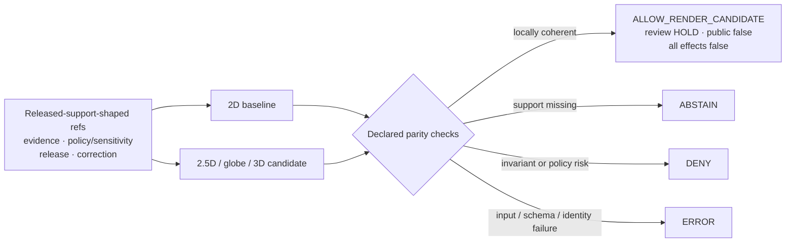

<!-- [KFM_META_BLOCK_V2]
doc_id: kfm://doc/architecture-map-master-2d-3d-parity
title: Map Master — 2D / 3D Parity
type: architecture-standard
version: v1.0
status: draft; repository-grounded; bounded-executable; renderer-hold; no-publisher
owners:
  - "@bartytime4life — verified CODEOWNERS review route"
  - "NEEDS VERIFICATION — independent map/runtime, Planetary/3D, evidence, policy, sensitivity, accessibility, security, release, and domain stewardship"
created: 2026-05-24
updated: 2026-08-19
policy_label: public; architecture; map-master; 2d-3d-parity; renderer-hold; no-release; no-publication
truth_posture: cite-or-abstain; current-state claims are pinned to repository evidence; candidate profiles, renderer decisions, runtime behavior, scene release, deployment, and public operation remain explicitly bounded
owning_root: docs/
responsibility: Explain the trust-parity boundary between KFM's calm 2D baseline and candidate 2.5D, globe, or true-3D representations; record the current fixture-first admission and representation evidence; preserve implementation, policy, review, release, and publication HOLDs.
current_path: docs/architecture/map-master/2D_3D_PARITY.md
evidence_snapshot:
  repository: bartytime4life/Kansas-Frontier-Matrix
  base_ref: main
  base_commit: 996b7e16d46a703c9436b26ef74ed0ecaf87796a
  target_prior_blob: c74f083feb456959d41e4c70e039a240bf4f6387
  directory_rules_decision: ADR-0029 accepted
  directory_rules_blob: fd49a0b83e55cef52c1124281f093e263526898d
  map_master_readme_blob: e26f81e3452b812b70ef25b4b7f791be72e88154
  planetary_3d_blob: 41e26697a05c9479fc78b43d5112279d9125a492
  renderer_adr_blob: 6bfd66b1169728d7fad08f0bb2d7e2a56e3577b2
  codeowners_blob: dd2a84aa514d8ecd9208bc347f90f9a2ed37dd61
  explorer_manifest_blob: ddd201b74a06001d84a14bf54ac62a6cc3607a29
  maplibre_manifest_blob: b0582955feeb51016327113692fa5c98ecad8816
  maplibre_entry_blob: 91664eb00583f9e3d0405eb7954fefa9a48f4ee9
  explorer_adapter_blob: 663ba0f7a05498948f67d644387c73ab19d5c16c
  three_d_contract_blob: e71692ce8897596e3477a8dafc0ef5c12fcd130a
  three_d_workflow_blob: e920df1895dbc1151798504c582a03e5b090b4ee
  reality_boundary_contract_blob: da97356b352d9f848b4bafc94817a07773c7a460
  reality_boundary_schema_blob: 08015f26d0b2fc899a68e46b746285c93fc331a2
  reality_boundary_validator_blob: 559bebf0fa95f052aef9f86c3920692b883062e4
  representation_contract_blob: 4e4a7e4d1d98c8592a76d0d3127eb90233906614
  representation_workflow_blob: 3ca169034e64e48e030e6a1d3f53c17bc9e8e811
  scene_schema_readme_blob: 3a86146bb6b8a5004b17b3aa076b4e8c040c1fb1
  published_scene_readme_blob: 09be41eb1cddff71e06fcc14bd6b1ee5edc70776
related:
  - README.md
  - ../planetary-3d.md
  - ../map-shell.md
  - ../story/README.md
  - ../ui/MAP_RUNTIME_BOUNDARY.md
  - RENDERER_BOUNDARY.md
  - LAYER_LIFECYCLE.md
  - EVIDENCE_DRAWER.md
  - PERFORMANCE_BUDGETS.md
  - ../../adr/ADR-0029-adopt-directory-governance-standard-v2.md
  - "../../adr/ADR-0007 — MapLibre GL JS Is the Sole Browser-Side Renderer.md"
  - ../../../contracts/map/three_d_admission_decision.md
  - ../../../contracts/evidence/reality_boundary_note.md
  - ../../../contracts/receipts/representation_receipt.md
  - ../../../schemas/contracts/v1/map/three_d_admission_decision.schema.json
  - ../../../schemas/contracts/v1/evidence/reality_boundary_note.schema.json
  - ../../../schemas/contracts/v1/receipts/representation_receipt.schema.json
  - ../../../schemas/contracts/v1/scene/README.md
  - ../../../fixtures/contracts/v1/map/three_d_admission_decision/cases.json
  - ../../../tools/validators/map/validate_three_d_admission_decision.py
  - ../../../tools/validators/evidence/validate_reality_boundary_note.py
  - ../../../tools/validators/validate_representation_receipt.py
  - ../../../tests/validators/map/test_validate_three_d_admission_decision.py
  - ../../../tests/validators/test_validate_representation_receipt.py
  - ../../../data/published/layers/scene/README.md
tags: [kfm, architecture, map-master, 2d, 2-5d, 3d, globe, parity, reality-boundary, representation-receipt, evidence-drawer, finite-outcomes, renderer-hold, no-publisher]
notes:
  - "v1.0 replaces the proposal-era Cesium/dual-renderer assumption with a repository-grounded, renderer-neutral trust-parity boundary."
  - "ADR-0007 proposes a sole MapLibre browser-renderer family but remains unaccepted; this document neither accepts it nor assumes a peer renderer."
  - "The inactive ThreeDAdmissionDecision profile and proposed RepresentationReceipt profile are bounded, no-network evidence only; neither authorizes renderer boot, policy, review, release, deployment, publication, or public use."
  - "The scene schema lane is README-only and the published scene lane contains only README.md plus .gitkeep at the pinned snapshot."
  - "Stable document identity, H1, top anchor, numbered H2 headings, and legacy section anchors are retained."
[/KFM_META_BLOCK_V2] -->

<a id="top"></a>

# Map Master — 2D / 3D Parity

> **Current determination.** KFM's 2D view is the calm comparison baseline. A 2.5D, globe, point-cloud, model, reconstruction, or true-3D view is a candidate downstream representation—not a second truth path. It must preserve the same evidence, drawer fields, correction references, release references, sensitivity labels, and source/reality posture before it can advance beyond a held candidate.

[](#status-and-authority)
[](#5-3d-admission-gate)
[](#status-and-authority)
[](#status-and-authority)
[](#status-and-authority)

> [!IMPORTANT]
> **Parity is trust parity, not visual sameness.** Different representations may use different geometry, camera, level of detail, projection, or interaction. They may not change what evidence supports the subject, what policy and sensitivity obligations apply, what correction or release state governs it, or what the user is told about observation versus derivation.

> [!CAUTION]
> **A green candidate result is not permission to render.** The repository-present `ThreeDAdmissionDecision` profile is deliberately `PROPOSED_INACTIVE`. Its positive result is `ALLOW_RENDER_CANDIDATE`; review remains `HOLD`, public use remains `false`, and every renderer, plugin, policy, review, release, deployment, and publication effect remains `false`.

## Status and authority

| Field | Current bounded result |
|---|---|
| **Evidence snapshot** | `main@996b7e16d46a703c9436b26ef74ed0ecaf87796a` |
| **Tracked path** | `docs/architecture/map-master/2D_3D_PARITY.md` |
| **Owning root** | `docs/` — human-readable architecture explanation |
| **Placement authority** | **CONFIRMED:** accepted [ADR-0029](../../adr/ADR-0029-adopt-directory-governance-standard-v2.md) adopts Directory Rules v2 |
| **Document authority** | Explanatory only; this file does not define semantic contracts, machine shape, policy, review, release, or runtime behavior |
| **Renderer-family decision** | **PROPOSED:** [ADR-0007](<../../adr/ADR-0007 — MapLibre GL JS Is the Sole Browser-Side Renderer.md>) remains `legacy-proposed` with effective status `proposed` |
| **Current renderer implementation** | **HOLD:** `@kfm/maplibre` is a private `0.0.0` scaffold, its export is a placeholder, the Explorer adapter is comment-only, and Explorer declares no MapLibre dependency |
| **3D admission profile** | **CONFIRMED / BOUNDED:** inactive contract, closed schema, deterministic validator, 18 exact-polarity fixture cases, focused tests, and a read-only no-network workflow |
| **Reality Boundary Note** | **PARTIAL:** proposed semantic contract, machine schema, fixtures, and validator exist; accepted authority, live resolution, UI binding, review, and release binding are not established |
| **RepresentationReceipt** | **CONFIRMED / BOUNDED:** proposed fixture-first process-memory contract, schema, fixtures, validator, tests, and no-network workflow |
| **Scene schema family** | **README-ONLY / HOLD:** no accepted scene schema file is established under `schemas/contracts/v1/scene/` |
| **Published scene lane** | **EMPTY OF RELEASED SCENES:** only `README.md` and `.gitkeep` are present at the pinned snapshot |
| **Story 3D handoff** | **HOLD:** the current app-local Story Player projection consumer is 2D-only and does not provide map playback |
| **Release, deployment, publication** | None established by this document or the bounded profiles |
| **Verified review route** | `@bartytime4life` through CODEOWNERS; independent specialist review remains **NEEDS VERIFICATION** |

The prior edition treated Cesium as an expected peer renderer, described concurrent dual-renderer synchronization as though it were an established architecture, and named scene/release/performance mechanics that current repository evidence does not accept or implement. Those statements are retained only as historical lineage through Git history; they are not current operating claims.

**Quick navigation:** [Scope](#1-scope) · [Parity contract](#2-parity-contract) · [View transitions](#3-overlay-sync-rules) · [Reality boundary](#4-reality-boundary-note-discipline) · [Admission](#5-3d-admission-gate) · [Story](#6-story-node-3d-handoff) · [Performance](#7-performance-considerations) · [Anti-patterns](#8-anti-patterns) · [Open work](#9-open-questions-and-adr-triggers) · [Related docs](#10-related-docs) · [Appendix](#11-appendix)

---

<a id="1-scope"></a>

## 1. Scope

This document explains the parity boundary between:

- the **2D baseline**, used as the calm, inspectable comparison view;
- **2.5D** representations such as terrain or fill extrusion;
- **globe** representations;
- **true-3D** representations such as 3D Tiles, glTF, or point clouds; and
- **modeled, synthetic, reconstructed, interpolated, or generalized** representations that carry an explicit reality boundary.

It records current repository evidence, distinguishes executable candidate proof from operational behavior, and names the HOLDs that must remain visible.

### 1.1 What parity means

Parity means that a candidate representation does not alter or bypass the trust state of the subject it depicts. At minimum, the 2D baseline and candidate representation must agree on:

- evidence references and evidence-resolution posture;
- Evidence Drawer fields and caveats;
- correction and supersession references;
- release references and public-use posture;
- sensitivity labels and public-safe transforms;
- source roles and representation/reality classification; and
- finite outcomes and zero-authority holds.

### 1.2 What parity does not mean

Parity does **not** mean:

- pixel-for-pixel or geometry-for-geometry visual identity;
- identical cameras, projections, detail levels, or performance;
- that every 2D layer deserves a 3D form;
- that every 3D asset has a 2D visual twin;
- that one candidate result authorizes renderer boot or public use;
- that two browser engines are accepted or concurrently active;
- that a scene, screenshot, model, point cloud, or tile becomes evidence; or
- that documentation, schema validation, a receipt, a passing test, or a pull request is a release.

> [!TIP]
> **When this document binds:** reviewing any 2.5D/globe/3D candidate, designing a future Story handoff, admitting a renderer plugin, defining scene semantics, comparing representations, or assessing whether a derived view could be mistaken for observation.

[Back to top](#top)

---

<a id="2-parity-contract"></a>

## 2. Parity contract

The current executable anchor is the proposed-inactive [`ThreeDAdmissionDecision`](../../../contracts/map/three_d_admission_decision.md) profile. It compares a declared 3D candidate with its 2D baseline and fails closed when parity or other admission invariants do not hold.

| Parity clause | Required invariant | Current evidence |
|---|---|---|
| **P-1 — Same evidence** | The candidate and 2D baseline carry the same evidence references for the compared subject. A view may not invent a 3D-only evidence path. | Exact parity is checked by the fixture-only admission profile. Live `EvidenceRef → EvidenceBundle` resolution is not performed. |
| **P-2 — Same policy and sensitivity posture** | Sensitivity labels and public-safe obligations remain equal; precise or restricted geometry must be transformed before rendering. | Declared sensitivity parity and several sensitive-geometry denials are executable. No live policy engine or steward review is invoked. |
| **P-3 — Same release and correction context** | Release references and correction references remain equal. A candidate cannot outrun a withdrawal, correction, or rollback state. | Declared parity is executable. No release registry lookup, correction propagation, or rollback execution occurs. |
| **P-4 — Same drawer fields** | The candidate exposes the same governed drawer field set and does not replace resolved support with renderer properties. | Declared drawer-field parity is executable. No browser click, drawer component, or API resolution is exercised. |
| **P-5 — Same finite and fail-closed posture** | Missing support abstains, policy/sensitivity or invariant failure denies, operational failure errors, and local candidate coherence grants no authority. | `ALLOW_RENDER_CANDIDATE`, `ABSTAIN`, `DENY`, and `ERROR` are fixture-tested. |
| **P-6 — Same source-role and reality semantics** | A representation does not turn modeled, synthetic, reconstructed, generalized, or contextual support into observation. | Representation kinds, geometry labels, source roles, and Reality Boundary Note requirements are checked locally. |
| **P-7 — Representation process remains visible** | A 3D or mediated carrier records method, input/output identity, fidelity, information loss, and reality-boundary linkage through the applicable process-memory profile. | The proposed [`RepresentationReceipt`](../../../contracts/receipts/representation_receipt.md) profile is separately executable and no-network; it is not yet integrated with the admission profile or a live scene. |


```mermaid
flowchart LR
    SUPPORT["Released-support-shaped refs<br/>evidence · policy/sensitivity<br/>release · correction"] --> BASE["2D baseline"]
    SUPPORT --> CAND["2.5D / globe / 3D candidate"]
    BASE --> PARITY{"Declared parity checks"}
    CAND --> PARITY
    PARITY -->|locally coherent| HOLD["ALLOW_RENDER_CANDIDATE<br/>review HOLD · public false<br/>all effects false"]
    PARITY -->|support missing| ABS["ABSTAIN"]
    PARITY -->|invariant or policy risk| DENY["DENY"]
    PARITY -->|input / schema / identity failure| ERR["ERROR"]
```

> [!NOTE]
> The diagram describes the bounded profile, not a running browser flow. The candidate references released-asset-shaped objects; the validator does not resolve evidence, execute policy, authenticate review, query release state, or boot a renderer.

### 2.1 Current closure boundary

Three separate surfaces currently prove three separate things:

| Surface | What it can prove | What it cannot prove |
|---|---|---|
| `ThreeDAdmissionDecision` | Declarative candidate coherence, explanatory burden, representation labeling, parity, sensitivity guards, plugin-reference completeness, deterministic identity, and zero effects | Real evidence, live policy, human review, renderer compatibility, public safety, release, or publication |
| `RealityBoundaryNote` | Machine-checkable distinction among observed, modeled, synthetic, reconstructed, interpolated, and generalized representations plus bounded reality posture | 3D admission, evidence sufficiency, policy, review, release, or publication |
| `RepresentationReceipt` | Declared input/output digests, method identity, fidelity, information loss, time, reality-boundary reference, and correction/supersession context | Source truth, evidence admissibility, policy approval, human review, promotion, release, or public-use permission |

No current repository evidence closes these three profiles into one integrated, dependency-closed runtime or release path.

[Back to top](#top)

---

<a id="3-overlay-sync-rules"></a>

## 3. Overlay sync rules

### 3.1 Current status

**NOT IMPLEMENTED.** No concurrent MapLibre/Cesium runtime, peer-renderer bridge, shared camera translator, browser handoff, or released 3D scene is established. The former dual-renderer wording is therefore stale.

“Sync” in this document now means the state that a future transition between a 2D baseline and a candidate 2.5D/globe/3D view would have to preserve. It does not imply two accepted engines.

### 3.2 Future transition invariants

| Concern | Required future behavior | Current posture |
|---|---|---|
| **Subject identity** | Preserve the same stable subject, feature, layer, and release identity across views. | **PROPOSED / HOLD** |
| **Temporal scope** | Preserve valid, observed, source, release, and correction time where material; do not silently shift the represented time. | **PROPOSED / HOLD** |
| **Admitted layer set** | Carry only layers admitted for the target view; a 3D form may narrow the set but may not add unreleased or policy-incompatible material. | **PROPOSED / HOLD** |
| **Selection and drawer context** | Preserve the selected subject and request governed resolution; renderer properties remain candidates, not claims. | **PROPOSED / HOLD** |
| **Camera and view mapping** | Translate camera/view state explicitly and record loss or non-equivalence; do not claim a perfect transform when none exists. | **PROPOSED / HOLD** |
| **Trust state** | Preserve evidence, drawer fields, release, correction, sensitivity, source role, and reality posture. | **BOUNDED declared parity exists; live transition absent** |
| **Negative state** | A mismatch or missing boundary fails closed rather than presenting a plausible scene. | **BOUNDED finite outcomes exist; UI behavior absent** |
| **Accessibility** | Provide an equivalent non-3D path and expose the same substantive support and caveats without requiring spatial depth perception. | **NEEDS VERIFICATION** |

A future transition should return:

- `ABSTAIN` or remain on the 2D baseline when required support or a reality boundary is missing;
- `DENY` when sensitivity, rights, or policy obligations are violated; and
- `ERROR` when identity, state translation, renderer, or asset verification fails.

A different visual result is not automatically drift. An undeclared change to trust, scope, or meaning is.

[Back to top](#top)

---

<a id="4-reality-boundary-note-discipline"></a>

## 4. Reality Boundary Note discipline

The repository has a proposed [`RealityBoundaryNote` contract](../../../contracts/evidence/reality_boundary_note.md), a closed [machine schema](../../../schemas/contracts/v1/evidence/reality_boundary_note.schema.json), fixtures, and a deterministic [validator](../../../tools/validators/evidence/validate_reality_boundary_note.py).

### 4.1 When it is required

A Reality Boundary Note is required when a representation is declared as:

- `MODELED`;
- `SYNTHETIC`;
- `RECONSTRUCTED`; or
- another mediated form whose presentation could reasonably be mistaken for direct observation.

The admission profile also requires a note reference for modeled, synthetic, or reconstructed candidates. The RepresentationReceipt profile requires a note reference for `THREE_D_SCENE`, `SYNTHETIC_SURFACE`, `MODELED`, or `SYNTHETIC` output.

> [!IMPORTANT]
> **Not all 3D is synthetic, and not all observation-shaped 3D is direct evidence.** A measured point cloud, photogrammetric mesh, terrain surface, extrusion, model, and reconstruction carry different source roles, transforms, limitations, and evidence burdens. The representation kind and reality posture must say which one applies.

### 4.2 Required semantics

The current proposed contract records:

- finite `representation_kind`;
- finite `reality_posture`;
- evidence references and source roles;
- transforms and limitations;
- spatial and temporal scope; and
- correction lineage.

Synthetic or reconstructed material cannot claim `DIRECT_EVIDENCE`. `ILLUSTRATIVE_ONLY` and `UNSUPPORTED` material cannot support a consequential public claim.

### 4.3 Relationship to RepresentationReceipt

| Reality Boundary Note | RepresentationReceipt |
|---|---|
| Explains what kind of representation the user is seeing and how it relates to reality. | Records how an input artifact became a downstream carrier. |
| Names source roles, transforms, limitations, scope, and correction context. | Pins input/output digests, method/spec identity, fidelity, information loss, times, and lineage. |
| Does not authorize admission or release. | Does not authorize evidence, policy, review, release, or public use. |

Both are needed where their profiles apply; neither substitutes for EvidenceBundle resolution, policy, review, or release.

### 4.4 Current HOLDs

The following are not established:

- accepted semantic authority for a complete scene profile;
- a live resolver for note or receipt references;
- UI presentation and accessibility behavior;
- reviewer identity and decision recording;
- policy evaluation;
- release-manifest binding;
- correction propagation; or
- rollback replay.

[Back to top](#top)

---

<a id="5-3d-admission-gate"></a>

## 5. 3D admission gate

The current gate-shaped evidence is the proposed-inactive [`ThreeDAdmissionDecision`](../../../contracts/map/three_d_admission_decision.md) profile, not the former prose-only `G3D-1` through `G3D-6` list.

### 5.1 Current profile

| Concern | Current evidence |
|---|---|
| **Contract status** | `PROPOSED_INACTIVE` |
| **Execution mode** | Deterministic, fixture-only, no-network |
| **Identity** | RFC 8785 JCS + SHA-256 over the candidate subject |
| **Fixture matrix** | 18 cases: 2 `ALLOW_RENDER_CANDIDATE`, 1 `ABSTAIN`, 14 `DENY`, 1 `ERROR` |
| **Review state** | Always `HOLD` |
| **Public use** | Always `false` |
| **Effects** | Renderer, plugin, policy, review, release, deployment, and publication effects remain `false` |
| **Workflow** | Read-only focused workflow; it records the no-authority boundary |

### 5.2 Checks represented by the profile

| Check family | Fail-closed expectation |
|---|---|
| **Explanatory burden** | `SPECTACLE_ONLY` does not justify 3D. A candidate must state why 2D is insufficient for the bounded use case. |
| **Representation truthfulness** | Terrain and fill extrusion are `TWO_POINT_FIVE_D`; they cannot claim `VERTICAL_EVIDENCE`. 3D Tiles, glTF, and point clouds are `TRUE_3D`; globe remains distinct. |
| **2D trust parity** | Evidence, drawer fields, correction refs, release refs, and sensitivity labels match the 2D baseline. |
| **Sensitivity and public-safe transforms** | Living-person geometry, precise rare-species geometry, under-generalized archaeology, and precise critical-infrastructure geometry fail closed. |
| **Reality boundary** | Modeled, synthetic, or reconstructed candidates require a Reality Boundary Note reference. |
| **Plugin declarations** | Plugin-hosted modes require the exact expected plugin set with exact versions, SHA-256 integrity, verified licenses, admission, attestation, and CVE-watch references; native modes declare no plugins. |
| **Deterministic identity** | Candidate identity and spec hash replay exactly. |
| **Authority holds** | Candidate coherence cannot set review, public-use, renderer, release, deployment, or publication authority. |

### 5.3 Finite outcomes

| Outcome | Bounded meaning |
|---|---|
| `ALLOW_RENDER_CANDIDATE` | The inactive synthetic candidate is locally coherent and retains every hold. |
| `ABSTAIN` | A required interpretive boundary cannot be supported, such as a missing Reality Boundary Note. |
| `DENY` | Explanatory burden, geometry truthfulness, parity, sensitivity, plugin, or authority invariants fail. |
| `ERROR` | Input, schema, hashing, identity, or fixture execution fails. |

> [!WARNING]
> `ALLOW_RENDER_CANDIDATE` is **not** `ALLOW_RENDER`, `ALLOW_PUBLIC_USE`, `APPROVED`, `RELEASED`, or `PUBLISHED`.

### 5.4 Integrated candidate HOLD

Before an integrated candidate can be considered, KFM still needs a dependency-closed, no-network slice that binds, without creating public effects:

1. one accepted or explicitly scoped scene-shaped candidate;
2. one resolvable Reality Boundary Note;
3. one RepresentationReceipt;
4. one EvidenceBundle-shaped support set;
5. one policy and review decision boundary;
6. one release/correction/rollback-shaped context;
7. one renderer-neutral UI projection; and
8. negative cases proving parity, sensitivity, reference, and authority failures remain fail closed.

That integrated slice is **not present** in current evidence.

[Back to top](#top)

---

<a id="6-story-node-3d-handoff"></a>

## 6. Story Node 3D handoff

Current Story evidence does not establish a 3D handoff. The app-local Story Player consumer accepts one already-governed `StoryManifest` projection and returns a bounded, non-authoritative, **2D-only** view model. It does not fetch, route, render node bodies, resolve evidence, execute policy, play a map, emit telemetry, release, deploy, or publish.

### 6.1 Future handoff requirements

A future Story transition into a 2.5D/globe/3D representation must:

- be explicit rather than inferred from content;
- preserve the Story subject, node identity, time context, admitted layer set, and selected subject;
- preserve every parity clause in [Section 2](#2-parity-contract);
- expose the Reality Boundary Note before a mediated scene can be mistaken for observation;
- preserve an accessible, non-3D route to the same substantive support and caveats;
- fail closed to the 2D baseline or a finite negative state;
- never treat Story order, camera motion, `canPlay`, or narrative polish as evidence or release authority; and
- preserve correction, withdrawal, and rollback state through the transition.

### 6.2 Current blockers

- no functioning renderer adapter;
- no accepted renderer-family decision;
- no accepted scene contract/schema profile;
- no live Story route or rendered map playback;
- no integrated evidence/policy/review/release resolution;
- no browser/device/accessibility proof; and
- no released scene or rollback rehearsal.

The old “shared drawer instance” and concurrent renderer-sync claims are therefore future design requirements, not implemented behavior.

[Back to top](#top)

---

<a id="7-performance-considerations"></a>

## 7. Performance considerations

Performance is an admission concern, but it cannot weaken evidence, sensitivity, release, correction, or accessibility parity.

The sibling [`PERFORMANCE_BUDGETS.md`](PERFORMANCE_BUDGETS.md) remains proposal-era guidance. Current evidence does not establish accepted numeric budgets, a device-class policy, real browser measurements, GPU/heap results, network budgets, or a 3D fallback implementation.

### 7.1 Evidence required before runtime claims

| Evidence | Required scope |
|---|---|
| **Dependency and distribution** | Accepted renderer/plugin versions, lock closure, worker/CSP strategy, asset provenance, and removal/rollback path |
| **Representative browsers** | Declared support matrix and exact-head browser runs |
| **Representative devices** | CPU, GPU, memory, network, power, and mobile constraints appropriate to the intended audience |
| **Scene measurements** | Cold start, decode, memory, frame stability, interaction latency, and cleanup |
| **Fallback behavior** | Deterministic return to the 2D baseline or a finite negative state without losing trust context |
| **Accessibility** | Keyboard, screen-reader, reduced-motion, contrast, non-3D alternative, and explanatory-equivalence review |
| **Telemetry safety** | Bounded fields with no secrets, private evidence, sensitive coordinates, or unreviewed denial details |
| **Correction and rollback** | Cache invalidation, scene withdrawal, corrected asset resolution, and rollback replay |

No particular integrity mechanism, archive format, range protocol, device bucket, or numeric threshold becomes mandatory merely because an earlier draft named it. Those choices belong to accepted contracts, artifact profiles, configuration, tests, and decisions.

### 7.2 Failure posture

- Performance failure must not look like “no data.”
- Degraded output must be labeled.
- A candidate that cannot preserve trust or accessibility while degrading remains held.
- A 3D performance success does not establish evidence, policy, review, release, or publication.

[Back to top](#top)

---

<a id="8-anti-patterns"></a>

## 8. Anti-patterns

| Anti-pattern | Why it fails | Required correction |
|---|---|---|
| **Treating Cesium or any peer renderer as currently accepted** | ADR-0007 is proposed and no peer-renderer exception is accepted. | State the decision HOLD and use renderer-neutral parity language. |
| **Treating proposed MapLibre-only wording as an accepted decision** | Repository repetition and package absence are not ADR acceptance. | Link to ADR-0007 and preserve its proposed status. |
| **Using `ALLOW_RENDER_CANDIDATE` as render permission** | The profile explicitly keeps review, public use, and all effects false. | Keep the candidate inactive until every external authority closes. |
| **Equating visual parity with trust parity** | Different views may legitimately differ visually; identical visuals can still hide evidence or policy drift. | Compare trust fields, scope, source roles, and reality posture. |
| **Presenting 2.5D as true vertical evidence** | Terrain and extrusion are not automatically true-3D measurements. | Use truthful geometry labels and bounded claims. |
| **Showing synthetic or reconstructed content without a reality boundary** | Users may mistake an interpretation for observation. | Require a resolvable Reality Boundary Note and applicable receipt. |
| **Treating a plugin URL or package name as admission** | Version, integrity, license, provenance, security, and rollback remain unverified. | Require the bounded plugin evidence and accepted dependency path. |
| **Hiding sensitive geometry by style** | The underlying bytes may still reach the client. | Transform, generalize, aggregate, omit, or deny before rendering. |
| **Treating schema validity or a receipt as release** | Shape and process memory do not provide policy, review, promotion, or publication authority. | Resolve the full trust and release chain. |
| **Treating Story `canPlay` or camera motion as 3D authority** | Narrative eligibility is not renderer, evidence, or release approval. | Keep Story 3D on HOLD until the dedicated chain is proven. |
| **Treating an empty published lane as a released scene** | The current lane contains only documentation and `.gitkeep`. | Require actual governed release objects and scene bytes. |
| **Optimizing performance by dropping caveats or negative states** | Speed cannot alter the meaning or safety posture of the claim. | Degrade visibly or abstain while preserving trust context. |

[Back to top](#top)

---

<a id="9-open-questions-and-adr-triggers"></a>

## 9. Open questions and ADR triggers

### 9.1 P0 — blocks architectural or trust acceptance

| Open item | Current status | Closure evidence |
|---|---|---|
| Renderer-family decision | ADR-0007 is proposed, not accepted. | Reviewed ADR status transition or a later accepted decision, including exception rules. |
| Renderer adapter and package authority | `packages/maplibre/` and the Explorer adapter are placeholders; no dependency is pinned. | Accepted physical home, functional KFM-owned port/adapter, exact dependency ownership, inventory, tests, and rollback. |
| Scene semantic and schema authority | Scene schema lane is README-only and overlap with map/layer/runtime/release families is unresolved. | Accepted semantic contract/profile, schema home, references, fixtures, validators, migration notes, and release boundary. |
| Evidence, policy, review, and release integration | Current validators compare declarations but do not execute these authorities. | No-network integration proof first, then accountable operational resolution. |
| Integrated candidate | Admission, reality note, receipt, scene, UI, and release-shaped context are separate. | One dependency-closed slice with exact negative cases and zero public effects. |
| Human authority and separation of duties | CODEOWNERS provides one verified route, not independent specialist approval. | Verified reviewer roles, decision records, and separation appropriate to consequence. |
| Sensitive-domain precision | Fixture guards exist, but live domain/steward policy is not established. | Domain, policy, rights, sovereignty, and release review with tested transformations. |

### 9.2 P1 — blocks credible user-facing proof

| Open item | Current status | Closure evidence |
|---|---|---|
| Browser and device behavior | No accepted renderer or probe result. | Exact-head browser/device matrix, performance, cleanup, and fallback evidence. |
| Accessibility parity | No 3D accessibility session or non-3D equivalence proof. | Keyboard, assistive-technology, reduced-motion, contrast, and alternative-view acceptance. |
| Story handoff | Story consumer is app-local and 2D-only. | Governed transport, rendered playback, parity checks, negative cases, and accessibility evidence. |
| Release, correction, and rollback | No released scene or rehearsal. | One synthetic release candidate with manifest/proof/receipt closure, correction propagation, cache invalidation, and rollback replay. |
| Plugin admission | No plugin is admitted by current repository evidence. | Exact pin, integrity, provenance, license/security review, capability test, CVE watch, and removal path. |

### 9.3 Decision triggers

An ADR or equivalent accepted decision is required before:

- accepting a browser renderer family or a peer-renderer exception;
- creating a second active renderer package or adapter authority;
- selecting a canonical scene contract/schema family;
- making a new cross-root object family authoritative;
- changing the meaning of parity or finite outcomes;
- allowing a plugin-hosted 3D mode into the runtime; or
- weakening the 2D baseline, sensitivity, reality-boundary, accessibility, correction, or rollback obligations.

[Back to top](#top)

---

<a id="10-related-docs"></a>

## 10. Related docs

| Reference | Role | Current reading posture |
|---|---|---|
| [`README.md`](README.md) | Map-master landing and current repository snapshot | **Repository-grounded; current entry point** |
| [`../planetary-3d.md`](../planetary-3d.md) | Full Planetary/3D architecture and implementation boundary | **Repository-grounded; strongest current companion** |
| [ADR-0029](../../adr/ADR-0029-adopt-directory-governance-standard-v2.md) | Directory placement authority | **Accepted** |
| [ADR-0007](<../../adr/ADR-0007 — MapLibre GL JS Is the Sole Browser-Side Renderer.md>) | Proposed browser-renderer-family decision | **Proposed; not accepted** |
| [`ThreeDAdmissionDecision`](../../../contracts/map/three_d_admission_decision.md) | Fixture-only semantic candidate | **Proposed inactive; bounded executable** |
| [`RealityBoundaryNote`](../../../contracts/evidence/reality_boundary_note.md) | Representation-to-reality semantics | **Proposed contract; partial executable support** |
| [`RepresentationReceipt`](../../../contracts/receipts/representation_receipt.md) | Carrier transformation process memory | **Proposed; bounded executable** |
| [`schemas/contracts/v1/scene/README.md`](../../../schemas/contracts/v1/scene/README.md) | Scene schema-family guardrail | **README-only / placement HOLD** |
| [`data/published/layers/scene/README.md`](../../../data/published/layers/scene/README.md) | Intended published scene-carrier lane | **README plus `.gitkeep`; no released scene found** |
| [`../story/README.md`](../story/README.md) | Current Story architecture and 2D-only projection consumer | **Repository-grounded; 3D HOLD** |
| [`PERFORMANCE_BUDGETS.md`](PERFORMANCE_BUDGETS.md) | Proposal-era budget concepts | **Retained draft; numbers and runtime behavior unverified** |
| [`RENDERER_BOUNDARY.md`](RENDERER_BOUNDARY.md) | Downstream-renderer and negative-authority doctrine | **Retained draft guidance; runtime claims require re-verification** |
| [`EVIDENCE_DRAWER.md`](EVIDENCE_DRAWER.md) | Click-to-evidence design lineage | **Retained draft guidance; live drawer parity not established** |
| [`LAYER_LIFECYCLE.md`](LAYER_LIFECYCLE.md) | Layer release/correction/rollback concepts | **Retained draft guidance** |
| [`../maplibre.md`](../maplibre.md) | Older MapLibre lane entry point | **STALE / CONFLICTED where it states Cesium retirement or sole-renderer doctrine as accepted** |
| [`../ui/MAP_RUNTIME_BOUNDARY.md`](../ui/MAP_RUNTIME_BOUNDARY.md) | Older proposed map-runtime seam | **Proposal-era; current functional adapter not established** |

Where adjacent documents conflict with this current evidence snapshot, do not silently choose the more operational-sounding wording. Use the accepted ADR state, current repository bytes, and explicit HOLDs.

[Back to top](#top)

---

<a id="11-appendix"></a>

## 11. Appendix

### 11.1 Parity contract — at a glance

```text
P-1  same evidence references
P-2  same policy / sensitivity posture
P-3  same release / correction context
P-4  same governed drawer fields
P-5  same finite, fail-closed, zero-authority posture
P-6  same source-role and reality semantics
P-7  visible representation process memory where applicable

Parity is trust parity, not visual sameness.
```

### 11.2 Current maturity ladder

| Level | Current result |
|---|---|
| Architecture explanation | **CONFIRMED present** |
| RealityBoundaryNote schema/validator | **CONFIRMED bounded; contract proposed** |
| RepresentationReceipt profile | **CONFIRMED bounded; contract proposed** |
| ThreeDAdmissionDecision profile | **CONFIRMED bounded; proposed inactive** |
| Integrated no-network candidate | **NOT ESTABLISHED** |
| Functional browser renderer/adapter | **HOLD** |
| Story 3D handoff | **HOLD** |
| Accepted scene schema and release profile | **NOT ESTABLISHED** |
| Released scene bytes | **NOT FOUND at pinned lane** |
| Deployed/public 3D behavior | **UNKNOWN / not established** |

### 11.3 Legacy `G3D-*` compatibility crosswalk

The prior edition used `G3D-1` through `G3D-6`. Those labels are retained here only to help readers follow old links or review notes; they are not current schema field names.

| Legacy label | Current profile concern |
|---|---|
| `G3D-1` | Explanatory burden and released-asset-shaped context, while release authority remains external |
| `G3D-2` | Evidence and drawer parity |
| `G3D-3` | Sensitivity/policy parity and fail-closed geometry treatment |
| `G3D-4` | Reality Boundary Note requirement and representation truthfulness |
| `G3D-5` | Correction/release parity, stable identity, and zero-effect holds |
| `G3D-6` | Plugin/dependency declarations plus future browser/device/performance evidence |

### 11.4 Focused validation surfaces

The current focused workflows use these commands:

```bash
python -m unittest \
  tests.validators.map.test_validate_three_d_admission_decision \
  --verbose

python tools/validators/map/validate_three_d_admission_decision.py \
  --fixtures

python -m unittest discover \
  --start-directory tests/validators \
  --pattern 'test_validate_representation_receipt.py' \
  --verbose

python tools/validators/validate_representation_receipt.py \
  --fixtures
```

These commands validate their bounded profiles only. This documentation-only update does not modify those paths and does not claim to have executed them locally through the GitHub connector.

### 11.5 Rollback

To reverse this documentation change, restore prior target blob:

```text
c74f083feb456959d41e4c70e039a240bf4f6387
```

Because this file has no runtime, source, policy, release, deployment, or publication effect, documentation rollback requires no data migration, source deactivation, scene withdrawal, cache invalidation, release rollback, or public notice.

### 11.6 Truth-label legend

- **CONFIRMED** — verified from pinned repository evidence in this update.
- **PROPOSED** — design or decision not accepted or implemented.
- **UNKNOWN** — evidence is insufficient to support a current claim.
- **NEEDS VERIFICATION** — a concrete check or accountable review remains.
- **HOLD** — the current boundary deliberately prevents advancement.
- **ABSTAIN / DENY / ERROR** — finite system outcomes, not rhetorical labels.

---

**Related:** [`README.md`](README.md) · [`../planetary-3d.md`](../planetary-3d.md) · [ADR-0007](<../../adr/ADR-0007 — MapLibre GL JS Is the Sole Browser-Side Renderer.md>) · [`ThreeDAdmissionDecision`](../../../contracts/map/three_d_admission_decision.md) · [`RealityBoundaryNote`](../../../contracts/evidence/reality_boundary_note.md) · [`RepresentationReceipt`](../../../contracts/receipts/representation_receipt.md)

**Last updated:** 2026-08-19 · **Document version:** v1.0 · **Status:** repository-grounded draft · **Renderer:** HOLD · **Publication effect:** none

[Back to top](#top)
