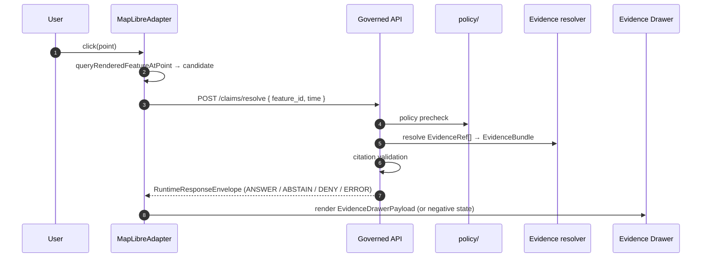

<!-- [KFM_META_BLOCK_V2]
doc_id: kfm://doc/architecture-map-master-evidence-drawer
title: Map Master — Evidence Drawer
type: standard
version: v0.1
status: draft
owners: UI subsystem steward + Docs steward · NEEDS VERIFICATION
created: 2026-05-24
updated: 2026-05-24
policy_label: public
related:
  - README.md
  - ../map-shell.md
  - RENDERER_BOUNDARY.md
  - LAYER_LIFECYCLE.md
  - ../governed-api/ENVELOPES.md
tags: [kfm, architecture, map-master, evidence-drawer, click-to-truth, doctrine]
notes:
  - PROPOSED. Expands map-shell.md §4 Core Interaction Slice and §9 Finite Outcomes.
  - The drawer is the trust object; the popup is not (TM-5).
[/KFM_META_BLOCK_V2] -->

<a id="top"></a>

# Map Master — Evidence Drawer

> *The click-to-truth flow: from a feature click to a resolved `EvidenceBundle` in the drawer. Conflict, caveat, freshness, and review-state surfaces. The drawer is the trust object; the popup is not.*


-blue)


**Status:** draft · **Owners:** UI subsystem steward + Docs steward *(NEEDS VERIFICATION)* · **Last updated:** 2026-05-24

> [!IMPORTANT]
> **The drawer is the trust object** *(`map-shell.md` TM-5, CONFIRMED)*. Popups may preview; consequential claims require an `EvidenceDrawerPayload` and `EvidenceBundle` resolution. Rendered features are **candidates**, not proof *(TM-6)*.

> [!NOTE]
> **This doc is the drawer-side contract.** The wire envelopes are in `governed-api/ENVELOPES.md` *(`RuntimeResponseEnvelope`, `DecisionEnvelope`)*; the drawer payload shape is `EvidenceDrawerPayload` from `map-shell.md` §8. This doc tells implementers how a click becomes a drawer render.

---

## Table of contents

1. [Scope](#1-scope)
2. [The click-to-truth flow](#2-the-clicktotruth-flow)
3. [`EvidenceDrawerPayload` composition](#3-evidencedrawerpayload-composition)
4. [Finite-outcome rendering in the drawer](#4-finiteoutcome-rendering-in-the-drawer)
5. [Conflict surfaces](#5-conflict-surfaces)
6. [Caveat surfaces](#6-caveat-surfaces)
7. [Freshness, review, release, and rollback surfaces](#7-freshness-review-release-and-rollback-surfaces)
8. [Popups vs drawer](#8-popups-vs-drawer)
9. [Anti-patterns](#9-anti-patterns)
10. [Open questions and ADR triggers](#10-open-questions-and-adr-triggers)
11. [Related docs](#11-related-docs)
12. [Appendix](#12-appendix)

---

## 1. Scope

This doc names the drawer's reader-facing contract: what a click triggers, what the drawer renders for each finite outcome, what conflict / caveat / freshness / review surfaces look like, and what popups are allowed to do *(very little)*.

> [!TIP]
> **When this doc binds.** Wiring a new domain into the drawer, adding a new conflict or caveat surface, evolving the drawer payload shape, or designing the popup behavior for a new layer.

[↑ Back to top](#top)

---

## 2. The click-to-truth flow

> **Evidence basis:** `map-shell.md` §4 Core Interaction Slice *(CONFIRMED)*; §6 MapRuntimePort *(PROPOSED)*; §9 Finite Outcomes *(CONFIRMED)*.



| Step | Boundary | Rule |
|---|---|---|
| 1 | User → renderer | Click is a UI event, not a claim. |
| 2 | Renderer → renderer | The hit is a **candidate** *(TM-6)*. |
| 3 | Renderer → API | Request follows the governed envelope contract. |
| 4–6 | API internal | Policy precedes resolution; resolution precedes synthesis; citation validation precedes `ANSWER` *(`governed-api.md` §6 three guarantees)*. |
| 7 | API → renderer | One of four finite outcomes. |
| 8 | Renderer → drawer | Drawer renders the outcome; no fluent fallback. |

[↑ Back to top](#top)

---

## 3. `EvidenceDrawerPayload` composition

> **Status:** PROPOSED. The payload shape rides inside `RuntimeResponseEnvelope.payload` and is a sub-class of `DomainFeatureEnvelope` *(`governed-api/ENVELOPES.md` §5)*.

| Field | Required | Meaning |
|---|---|---|
| `object_type` `"EvidenceDrawerPayload"` | yes | — |
| `feature_id` | yes | Stable id from the clicked layer. |
| `domain` | yes | KFM domain. |
| `source_role` | yes | One of seven canonical roles. |
| `sensitivity_posture` | yes | After cross-lane invariants. |
| `evidence_bundle_ref` | yes | `kfm://evidence/<id>` — fetched lazily for body. |
| `evidence_summary` | yes | Pre-resolved short summary safe for the panel header. |
| `attributes` | yes | Domain-defined fields. |
| `valid_time` / `observed_time` | conditional | If applicable. |
| `freshness` | yes | Posture + last-updated. |
| `review_state` | yes | E.g., `reviewed` · `in-review` · `pending` · `n/a`. |
| `release_ref` | yes | `kfm://release/<id>`. |
| `correction_lineage` | optional | Refs to `CorrectionNotice` / supersedes chain. |
| `rollback_card_ref` | optional | If release has a rollback card. |
| `conflicts` | optional | Array of conflict descriptors *(see [§5](#5-conflict-surfaces))*. |
| `caveats` | optional | Array of caveat descriptors *(see [§6](#6-caveat-surfaces))*. |
| `representation_receipt_ref` | conditional | If `source_role == synthetic`. |
| `reality_boundary_note` | conditional | If synthetic. |

> [!IMPORTANT]
> **Bundle body is fetched lazily.** The panel header renders from `evidence_summary` + `freshness` + `review_state` + `release_ref`; the body resolves the bundle when the user expands.

[↑ Back to top](#top)

---

## 4. Finite-outcome rendering in the drawer

> **Evidence basis:** `map-shell.md` §9 Finite Outcomes *(CONFIRMED)*.

| Outcome | Header | Body | Footer |
|---|---|---|---|
| **`ANSWER`** | Feature name + domain + source role badge | `EvidenceDrawerPayload` body + bundle expand | Freshness · review · release · rollback links |
| **`ABSTAIN`** | "No admissible evidence" + reason class | What would change *(e.g., bundle pending review)* | Link to layer manifest |
| **`DENY`** | "Restricted" + sensitivity badge | Reason class *(no leakage)*; alternative surface if any | Link to policy doc *(audience-safe)* |
| **`ERROR`** | "We hit a problem" | Error code *(`error/<class>/<detail>`)*; `correlation_id` | Retry hint if retryable |

> [!CAUTION]
> **No fifth state.** A drawer that shows "loading…" without a finite outcome after the request returns is a renderer bug, not a drawer state.

[↑ Back to top](#top)

---

## 5. Conflict surfaces

A **conflict** is two or more `EvidenceBundle` members that disagree on a consequential attribute *(date, place, identity, value)*. Conflict surfaces are first-class in the drawer.

| Conflict kind | What the drawer shows |
|---|---|
| **Temporal conflict** | Two valid-time spans claiming inconsistent state at overlapping times. |
| **Identity conflict** | Two records assigning the feature to different identities. |
| **Value conflict** | Different numeric / categorical readings beyond stated uncertainty. |
| **Source-role conflict** | An observed record paired with a regulatory record where the meanings are not interchangeable *(see `cross-domain/source-role-anti-collapse.md`)*. |

| Rule | Detail |
|---|---|
| Conflicts are not silently resolved | Drawer presents each member with its source role and freshness; reader chooses the canonical reading via guidance, not by the renderer collapsing them. |
| Conflict descriptors carry refs to each side | `EvidenceRef`s on both sides; reviewer can audit. |
| Steward-resolved conflicts | When a steward has issued a `ReviewRecord` selecting one side, drawer renders the resolution prominently and keeps the other for audit. |

[↑ Back to top](#top)

---

## 6. Caveat surfaces

A **caveat** is a non-conflict qualifier on a claim: known limitation, modeling assumption, regulatory carve-out, sensitivity carve-out, rights restriction, freshness window, or geographic-scope reminder.

| Caveat kind | When it appears |
|---|---|
| **Modeling caveat** | When `source_role == modeled`; shows model identity, run receipt, bounds. |
| **Aggregate caveat** | When `source_role == aggregate`; shows aggregation unit, per-place inference is denied. |
| **Regulatory caveat** | When `source_role == regulatory`; shows it is a designation, not an observed event. |
| **Synthetic caveat** | When `source_role == synthetic`; Reality Boundary Note + `RepresentationReceipt`. |
| **Rights caveat** | When attribution / redistribution constraints apply. |
| **Stale caveat** | When `freshness` indicates the bundle is past its freshness window. |
| **Scope caveat** | When user has zoomed to a scale where the data is not authoritative. |

> [!TIP]
> **Caveats and conflicts are different.** Caveat = "true, with this qualifier". Conflict = "two sources disagree". Drawer surfaces them in different regions.

[↑ Back to top](#top)

---

## 7. Freshness, review, release, and rollback surfaces

| Surface | Source field | Drawer visualization |
|---|---|---|
| **Freshness** | `EvidenceDrawerPayload.freshness` | Badge: fresh / stale / withdrawn + last-updated tooltip. |
| **Review** | `review_state` | Badge: reviewed / in-review / pending / n/a + link to review console *(steward-class only)*. |
| **Release** | `release_ref` | Release id badge + click → release manifest summary. |
| **Rollback** | `rollback_card_ref` | If present, shows rollback availability and the prior release id. |
| **Correction lineage** | `correction_lineage` | Chain link → prior versions + `CorrectionNotice` summary. |

[↑ Back to top](#top)

---

## 8. Popups vs drawer

> **Evidence basis:** `map-shell.md` TM-5 *(CONFIRMED)*: *"No popup as Evidence Drawer substitute. Popups may preview; consequential claims require an `EvidenceDrawerPayload` and `EvidenceBundle` resolution."*

| Allowed in popup | Not allowed in popup |
|---|---|
| Feature name | A name, date, category, or measurement presented as truth |
| Layer name | Source role badge that implies authority |
| "Click to open drawer" hint | Evidence text |
| Sensitivity hint when applicable | Citation list |
| Loading state during request | Final answer |

> [!IMPORTANT]
> **"Trivial" is not measured by UI surface.** It is measured by the source-and-evidence chain *(`map-shell.md` §14 FAQ)*. A name on a polygon may look trivial; if the user would act on it *(navigate, decide, cite)*, it is consequential and belongs in the drawer.

[↑ Back to top](#top)

---

## 9. Anti-patterns

| Anti-pattern | Mitigation |
|---|---|
| **Popup shows a feature property as the answer** | TM-5 violation; route to drawer. |
| **Drawer renders "loading…" indefinitely** | Finite outcome required after request returns; timeout → `ERROR`. |
| **Conflicts collapsed by picking one silently** | Conflict descriptors render in the drawer; resolution is explicit. |
| **Modeling caveat hidden in a tooltip** | Caveats are first-class in the body; never tooltip-only. |
| **Drawer body renders before bundle resolves** | Header from summary; body only after bundle. |
| **Drawer shows reviewer-internal review notes** | `ReviewRecord` body is steward-class; drawer shows the state, not the notes. |
| **`AIReceipt`-only content presented without the receipt** | Cite-or-abstain; `ABSTAIN` envelope is the fallback. |

[↑ Back to top](#top)

---

## 10. Open questions and ADR triggers

| Open item | Class | Suggested ADR title |
|---|---|---|
| Conflict-presentation grammar — side-by-side vs ranked list with rationale? | UX | "Conflict presentation grammar". |
| Caveat ordering — by severity, by source role, by recency? | UX | "Caveat ordering". |
| Drawer lazy-load of bundle body — always, or on user expand? | Perf | "Drawer body lazy-load". |
| Where the reviewer notes appear — drawer footer *(steward-class)* or separate panel? | UX | "Reviewer note placement". |
| Should the drawer render an `AIReceipt` summary even for `ANSWER` envelopes without AI involvement? | UX | "AIReceipt visibility default". |

[↑ Back to top](#top)

---

## 11. Related docs

| Reference | Role | Truth label |
|---|---|---|
| `README.md` *(this folder)* | Landing | CONFIRMED doctrine |
| `../map-shell.md` §4, §6, §8, §9, TM-5, TM-6 | Spine | CONFIRMED doctrine |
| `RENDERER_BOUNDARY.md` *(sibling)* | Drawer is downstream of trust | PROPOSED |
| `LAYER_LIFECYCLE.md` *(sibling)* | Manifests feed `release_ref`, `freshness`, `review_state` | PROPOSED |
| `../governed-api/ENVELOPES.md` | `RuntimeResponseEnvelope`, `DomainFeatureEnvelope` | PROPOSED |
| `../governed-api/LIFECYCLE_GATES.md` | Per-gate outcomes the drawer renders | PROPOSED |
| `../cross-domain/source-role-anti-collapse.md` | Source role guidance for badges and conflicts | CONFIRMED doctrine |
| `../cross-domain/shared-kernel.md` §4 | `EvidenceRef` / `EvidenceBundle` | CONFIRMED doctrine |

[↑ Back to top](#top)

---

## 12. Appendix

<details>
<summary><strong>12.1 Click-to-truth — at-a-glance</strong></summary>

```text
click → candidate → /claims/resolve → policy → release → evidence → citation
                              ↓
              RuntimeResponseEnvelope (ANSWER/ABSTAIN/DENY/ERROR)
                              ↓
                   Evidence Drawer (one of four states; no fifth)
```

</details>

<details>
<summary><strong>12.2 Truth-label legend</strong></summary>

- **CONFIRMED** — verified this session from attached docs.
- **PROPOSED** — design / placement / inference not yet verified in implementation.
- **INFERRED** — derivable from confirmed evidence but not directly stated.
- **NEEDS VERIFICATION** — checkable, but not yet checked strongly enough to act as fact.

</details>

---

**Related (mini)** · [`README.md`](README.md) · [`../map-shell.md`](../map-shell.md) · [`RENDERER_BOUNDARY.md`](RENDERER_BOUNDARY.md) · [`LAYER_LIFECYCLE.md`](LAYER_LIFECYCLE.md) · [`../governed-api/ENVELOPES.md`](../governed-api/ENVELOPES.md)

**Last updated:** 2026-05-24 · **Doc version:** v0.1 · **Doc status:** draft · **Path status:** PROPOSED *(OPEN-DR-12 MAP-MASTER)*

[↑ Back to top](#top)
