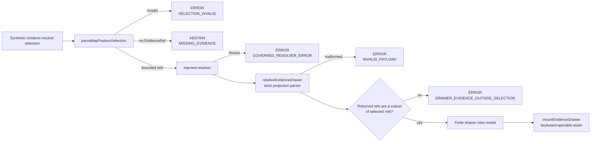
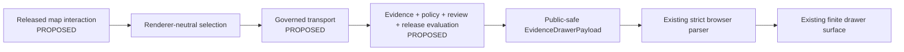

<!-- [KFM_META_BLOCK_V2]
doc_id: kfm://doc/architecture-map-master-evidence-drawer
title: Map Master — Evidence Drawer
type: architecture-reference
version: v2.0-draft
status: draft; repository-grounded; bounded-executable; renderer-neutral-selection; live-transport-hold; non-authoritative; non-publication
owners:
  - "@bartytime4life — verified CODEOWNERS review route"
  - "NEEDS VERIFICATION — independent UI, accessibility, evidence, policy, review, release, correction, rollback, map-runtime, and security stewardship"
created: 2026-05-24
updated: 2026-08-19
policy_label: public; architecture; map-master; evidence-drawer; click-to-evidence; finite-outcomes; fail-closed; no-release; no-publication
owning_root: docs/
current_path: docs/architecture/map-master/EVIDENCE_DRAWER.md
responsibility: >-
  Explain the map-selection-to-Evidence-Drawer boundary, reconcile the current
  renderer-neutral fixture bridge and bounded public-safe drawer projection with
  the former proposal-era click-to-truth flow, and keep live transport, evidence
  resolution, policy, review, release, correction, rollback, MapLibre, deployment,
  and publication claims visibly held until their owning evidence closes.
truth_posture: >-
  CONFIRMED current same-path placement, closed fixture-first UI projection,
  strict Explorer parser and finite view model, keyboard-operable drawer,
  renderer-neutral map-selection bridge, evidence-subset enforcement, synthetic
  positive and negative fixtures, deterministic validators, focused test sources,
  and read-only workflow / PROPOSED production click-to-evidence composition,
  authenticated governed transport, typed conflict and caveat grammar, and
  release-bound trust links / UNKNOWN deployed behavior, public use, production
  policy and evidence authenticity, operational correction propagation, and
  rollback execution / NEEDS VERIFICATION independent stewardship, hosted
  exact-head validation, accessibility beyond the bounded fixture, contract-home
  convergence, and first released map-to-drawer flow.
evidence_snapshot:
  repository: bartytime4life/Kansas-Frontier-Matrix
  base_ref: main
  base_commit: 0a547c12e7965565d397fcad46d94c1c7b41f0c7
  target_prior_blob: ac76d6ff7b2231182908e5f615035600b5172ea6
  directory_rules_blob: fd49a0b83e55cef52c1124281f093e263526898d
  directory_rules_decision: ADR-0029 accepted
  map_shell_blob: b0ae23f2399c019a737a27c6aaaf0d34323b1fb7
  drawer_ui_contract_blob: 412a0a86c85c98748ac08e263a94c7eaac760c04
  drawer_ui_schema_blob: 4eefa03cffd7d5b97a24df0daf250bc31f7137ca
  governed_client_blob: 21f6e4d1225ab0427ecb689d6782f4b56fc25ea2
  drawer_implementation_blob: 7746843c259594568fe75e975155a67eb8372e8f
  drawer_unit_test_blob: 24b3b4a028d31c37bd6467138ca97a54f3e21d22
  drawer_browser_test_blob: 236416b2ccb39820e426a6e774e3962480631833
  map_selection_bridge_blob: 18d61ea0ef2fbe2fc2f3cc9d42291c101003037f
  map_selection_unit_test_blob: 953bf536f1d3062c194a09855ed3dde4bc9fa311
  map_selection_browser_test_blob: 14164e00253f1db6cdaff65a4fd1fa8944f3041e
  drawer_validator_blob: 01cb750202924d0893a442a01e66b3a0d18ff6aa
  drawer_validator_test_blob: 49b51caf7ba1df0052d6088d35b2f8a653db535b
  drawer_workflow_blob: b51b20965c8b49c415c0f4138d6056b08dec134c
inspection_boundary: >-
  Current-session GitHub reads covered the complete prior target, accepted
  placement authority, current map-shell boundary, the bounded UI contract and
  closed schema, the evidence-family path conflict, Explorer parser, drawer
  implementation, renderer-neutral map-selection bridge, unit and browser test
  sources, validator, validator tests, workflow, app-local feature README, and
  adjacent Evidence Drawer architecture pages. No mounted checkout, dependency
  installation, repository-native command, live network route, authenticated
  EvidenceRef resolver, policy engine, production release registry, functioning
  MapLibre runtime, deployment, public endpoint, telemetry sink, correction
  propagation, cache invalidation, or rollback execution was exercised.
related:
  - README.md
  - ../map-shell.md
  - ../evidence-drawer.md
  - ../ui/EVIDENCE_DRAWER.md
  - RENDERER_BOUNDARY.md
  - VIEWER_VERIFICATION.md
  - LAYER_LIFECYCLE.md
  - TILE_ARTIFACTS.md
  - PERFORMANCE_BUDGETS.md
  - ../../doctrine/directory-rules.md
  - ../../adr/ADR-0029-adopt-directory-governance-standard-v2.md
  - ../../../contracts/ui/evidence_drawer_payload.md
  - ../../../contracts/evidence/evidence_drawer_payload.md
  - ../../../schemas/contracts/v1/ui/evidence_drawer_payload.schema.json
  - ../../../apps/explorer-web/src/adapters/GovernedClient.ts
  - ../../../apps/explorer-web/src/features/evidence_drawer/index.tsx
  - ../../../apps/explorer-web/src/features/map_runtime/index.tsx
  - ../../../apps/explorer-web/tests/evidence-drawer.test.ts
  - ../../../apps/explorer-web/tests/map-evidence-drawer.test.ts
  - ../../../tools/validators/ui/validate_evidence_drawer_payload.py
tags: [kfm, architecture, map-master, evidence-drawer, map-selection, EvidenceDrawerPayload, EvidenceRef, EvidenceBundle, finite-outcomes, accessibility, correction, no-leak, runtime-hold]
notes:
  - "v2.0-draft is a same-path repository-grounded modernization; placement outcome PLACE."
  - "The prior active POST /claims/resolve and MapLibre click sequence was proposal-era architecture, not current implementation evidence."
  - "Current code proves a renderer-neutral synthetic selection bridge and a bounded fixture-only drawer projection; it performs no live transport, policy execution, evidence-store access, release application, or MapLibre source creation."
  - "The current UI profile has no typed conflict array, typed caveat array, release reference, review reference, rollback-card reference, or lazy EvidenceBundle body."
  - "The document path, doc_id, H1, top anchor, and every prior numbered section fragment are retained."
  - "No contract, schema, policy, fixture, validator, test, workflow, app, package, dependency, source, registry, data, release, deployment, publication, or repository setting changes."
[/KFM_META_BLOCK_V2] -->

<a id="top"></a>
<a id="map-master--evidence-drawer"></a>

# Map Master — Evidence Drawer

> **Operating rule.** The Evidence Drawer is KFM's trust-visible inspection surface, not its trust source. A map interaction may scope a governed request; only upstream evidence, policy, review, release, correction, and rollback authorities may determine what the drawer can safely present.

[](#0-current-repository-evidence)
[](#2-the-clicktotruth-flow)
[](#3-evidencedrawerpayload-composition)
[](#2-the-clicktotruth-flow)
[](#2-the-clicktotruth-flow)
[](#13-change-correction-and-rollback)

| Field | Current bounded result |
|---|---|
| **Evidence snapshot** | `main@0a547c12e7965565d397fcad46d94c1c7b41f0c7` |
| **Document role** | Human-readable map-selection and drawer-boundary reference; not a semantic contract, machine schema, policy rule, evidence record, review record, release record, or runtime gate |
| **Placement** | **CONFIRMED / PLACE:** accepted [ADR-0029](../../adr/ADR-0029-adopt-directory-governance-standard-v2.md) adopts [Directory Rules v2](../../doctrine/directory-rules.md); this existing `docs/architecture/map-master/` path remains in the `docs/` explanation root |
| **Current selection path** | **CONFIRMED / BOUNDED:** strict renderer-neutral `MapFeatureSelection`, injected resolver, returned-evidence subset check, finite local failures, and synthetic browser controls |
| **Current drawer path** | **CONFIRMED / BOUNDED:** closed fixture-first public-safe projection, strict parser, finite view model, keyboard-operable `<aside>`, correction/negative history, and fixed no-leak negative copy |
| **Current renderer** | **HOLD:** no functioning MapLibre click path is established by the inspected implementation |
| **Current transport** | **HOLD:** the bridge accepts an injected resolver; the inspected fixture composition uses deterministic in-memory data and performs no network access |
| **Current evidence resolution** | **NOT ESTABLISHED:** the browser does not dereference `EvidenceRef`, authenticate `EvidenceBundle`, execute policy, authenticate review, or apply release state |
| **Current publication effect** | None; the bounded profile, tests, workflow, this page, and any passing check create no public claim |
| **Review route** | `@bartytime4life` through current CODEOWNERS; independent specialist review remains **NEEDS VERIFICATION** |

> [!IMPORTANT]
> **A drawer `ANSWER` is a fixture-profile result, not public truth.** The current code can validate and render a supplied projection. It cannot prove that the projection came from an authentic governed service, that its evidence is true, that policy allowed disclosure, that review occurred, or that a release is public.

> [!CAUTION]
> **The former six-party live sequence was an architectural target.** The prior page depicted `MapLibreAdapter -> POST /claims/resolve -> policy -> EvidenceBundle -> citation validation` as current flow. Repository evidence now supports a narrower renderer-neutral, no-network fixture bridge. This edition keeps the target obligations but stops presenting the route, adapter, resolver, or live service as implemented.

> [!WARNING]
> **Negative states are no-leak states.** `DENY`, `ERROR`, malformed payloads, resolver failures, and evidence-scope mismatches must not reflect sensitive values, private diagnostics, unsupported summaries, citations, or historical identifiers into the browser.

**Quick navigation:** [Current evidence](#0-current-repository-evidence) · [Scope](#1-scope) · [Click flow](#2-the-clicktotruth-flow) · [Payload](#3-evidencedrawerpayload-composition) · [Finite outcomes](#4-finiteoutcome-rendering-in-the-drawer) · [Conflicts](#5-conflict-surfaces) · [Caveats](#6-caveat-surfaces) · [Trust state](#7-freshness-review-release-and-rollback-surfaces) · [Popups](#8-popups-vs-drawer) · [Anti-patterns](#9-anti-patterns) · [Open work](#10-open-questions-and-adr-triggers) · [Related](#11-related-docs) · [Appendix](#12-appendix) · [Change and rollback](#13-change-correction-and-rollback)

---

<a id="0-current-repository-evidence"></a>

## 0. Current repository evidence

### 0.1 What changed since v0.1

The original page correctly preserved two durable doctrines:

1. rendered features are candidates rather than evidence; and
2. a popup must not substitute for the Evidence Drawer when a consequential claim is involved.

Its implementation description did not age as well. The current repository has more bounded executable evidence than the old `PROPOSED`-only posture, but substantially less than the old live-route diagram implied.

| Former statement | Current repository-grounded disposition |
|---|---|
| `MapLibreAdapter` receives the click | **PROPOSED / HOLD.** The current map bridge is renderer-neutral and the concrete adapter remains non-functional. |
| Browser posts to `/claims/resolve` | **NOT ESTABLISHED.** No functioning route or transport binding was identified for this flow. |
| Browser sequence executes policy, evidence resolution, and citation validation | **NOT ESTABLISHED.** Those are upstream obligations; current browser code does none of them. |
| `EvidenceDrawerPayload` contains domain, sensitivity, release, rollback, typed conflicts, and typed caveats | **STALE shape.** The closed current UI profile uses a smaller exact field set and optional bounded history. |
| Bundle body is fetched lazily | **PROPOSED / NOT IMPLEMENTED.** The current projection carries bounded refs and display fields; no browser bundle fetch exists. |
| Drawer path is `PROPOSED / OPEN-DR-12` | **STALE.** Accepted ADR-0029 establishes this existing `docs/architecture/map-master/` path as a valid human architecture lane. |

### 0.2 Current evidence matrix

| Surface | CONFIRMED repository evidence | Safe conclusion |
|---|---|---|
| [`contracts/ui/evidence_drawer_payload.md`](../../../contracts/ui/evidence_drawer_payload.md) | Draft v0.3 bounded UI projection semantics and explicit non-effects | Strongest current UI-facing semantic description; still `PROPOSED` and not evidence closure |
| [`schemas/contracts/v1/ui/evidence_drawer_payload.schema.json`](../../../schemas/contracts/v1/ui/evidence_drawer_payload.schema.json) | Closed Draft 2020-12 shape with four outcomes, bounded trust state, HTTPS citations, and optional history | Machine-declared fixture profile exists; upstream authenticity is not proved |
| [`contracts/evidence/evidence_drawer_payload.md`](../../../contracts/evidence/evidence_drawer_payload.md) | Adjacent evidence-family contract remains `PATH-NEEDS-REVIEW`; its paired schema is described as permissive | UI/evidence semantic-home seam remains unresolved |
| [`GovernedClient.ts`](../../../apps/explorer-web/src/adapters/GovernedClient.ts) | Strict parser for `kfm.explorer.evidence-drawer.public-safe.v1`; no transport or lifecycle-store access | Bounded app adapter fails closed over supplied objects |
| [`evidence_drawer/index.tsx`](../../../apps/explorer-web/src/features/evidence_drawer/index.tsx) | Finite view-model resolver and keyboard-operable drawer renderer | App-local projection and accessibility slice exists |
| [`map_runtime/index.tsx`](../../../apps/explorer-web/src/features/map_runtime/index.tsx) | Strict renderer-neutral selection parser, injected resolver, evidence-subset check, finite local failures, and synthetic controls | Bounded click-to-drawer laboratory exists without a renderer or live service |
| [`evidence-drawer.test.ts`](../../../apps/explorer-web/tests/evidence-drawer.test.ts) | Test source covers answer, stale abstention, superseded history, no-leak denial/error, malformed payloads, and forbidden access patterns | Intended bounded behavior is inspectable; this documentation run did not execute it |
| [`map-evidence-drawer.test.ts`](../../../apps/explorer-web/tests/map-evidence-drawer.test.ts) | Test source covers strict selection, missing evidence, denial, out-of-scope evidence, resolver failure, and renderer/network/store exclusions | Selection-to-drawer scope rules are fixture-backed |
| Browser test sources | Keyboard open/close, focus entry/return, citations, correction history, abstention, denial, scope mismatch, and resolver-error behavior are represented | Browser expectations exist; production accessibility and live integration remain open |
| [`validate_evidence_drawer_payload.py`](../../../tools/validators/ui/validate_evidence_drawer_payload.py) | No-network closed-schema and cross-field validator | Declaration consistency can be checked without resolving evidence |
| [Focused workflow](../../../.github/workflows/evidence-drawer-payload.yml) | Read-only path-scoped orchestration for schema, fixtures, tests, and receipt integrity | Workflow presence is not a required-check result, release approval, or publication proof |

### 0.3 Documentation neighborhood

Three architecture pages currently overlap:

| Page | Primary responsibility | Current disposition |
|---|---|---|
| This page | Map-master selection-to-drawer boundary | Same-path repository-grounded modernization |
| [`../evidence-drawer.md`](../evidence-drawer.md) | Cross-cutting Evidence Drawer architecture and current implementation boundary | Current repository-grounded companion |
| [`../ui/EVIDENCE_DRAWER.md`](../ui/EVIDENCE_DRAWER.md) | Earlier UI trust-panel architecture | Retained proposal-era lineage; implementation and placement claims need separate reconciliation |

This update does not silently consolidate, supersede, move, or delete either companion. It narrows this page to the map-master seam and records the overlap as an explicit follow-up decision.

[Back to top](#top)

---

<a id="1-scope"></a>

## 1. Scope

This page explains how a map-facing interaction becomes a bounded Evidence Drawer projection **in the current repository**, and what additional evidence is required before KFM may claim a live click-to-evidence product.

### 1.1 In scope

- renderer-neutral selection identity and evidence scope;
- the injected-resolver boundary and its no-network current implementation;
- exact current `EvidenceDrawerPayload` projection fields;
- finite outcomes and public-safe reason codes;
- evidence-subset enforcement between selection and drawer;
- no-leak handling for denied, errored, malformed, and mismatched inputs;
- bounded correction and negative history;
- current keyboard, focus, landmark, and live-region behavior;
- the distinction among current fixture proof, proposed production composition, and release/publication authority;
- open contract-home, route, renderer, policy, evidence, review, release, correction, rollback, accessibility, and documentation-convergence work.

### 1.2 Out of scope

This page does not:

- define or amend `EvidenceBundle`, `EvidenceRef`, `EvidenceDrawerPayload`, runtime-envelope, policy, release, correction, or rollback semantics;
- choose the canonical UI/evidence contract home;
- accept a MapLibre adapter or renderer-family decision;
- name a production claim-resolution route;
- implement transport, source access, evidence resolution, policy evaluation, citation validation, review authentication, release application, cache invalidation, telemetry, Focus Mode, export, correction submission, or rollback;
- treat fixture data, passing validation, a screenshot, a pull request, or a rendered `ANSWER` as a KFM publication;
- make a popup, feature property, layer metadata, badge, or generated explanation authoritative.

### 1.3 Directory Rules basis

Accepted [ADR-0029](../../adr/ADR-0029-adopt-directory-governance-standard-v2.md) adopts [Directory Rules v2](../../doctrine/directory-rules.md). This is a same-path update to a tracked human architecture document under `docs/architecture/map-master/`, so the placement outcome is **PLACE**.

| Responsibility | Owning surface | This page's role |
|---|---|---|
| Human map/drawer architecture | `docs/architecture/map-master/` | Explain current evidence, boundaries, and graduation gates |
| UI projection meaning | `contracts/ui/` while the seam remains open | Link and report; do not redefine |
| Machine shape | `schemas/contracts/v1/ui/` | Link and report; do not copy as authority |
| Evidence closure | evidence contracts and governed resolver | Require without fabricating |
| Policy and disclosure | `policy/` plus decision records | Describe consequences; do not decide |
| Browser implementation | `apps/explorer-web/` | Report only inspected bounded behavior |
| Renderer integration | accepted adapter decision plus owning package/app surfaces | Keep on HOLD until accepted and implemented |
| Validation | fixtures, validators, tests, workflows | Report bounded declaration and behavior proof |
| Review, release, correction, rollback | their owning contracts, records, stores, and operators | Keep state distinct and non-authoritative here |

[Back to top](#top)

---

<a id="2-the-clicktotruth-flow"></a>

## 2. The click-to-truth flow

“Click-to-truth” is retained as a memorable label, but the click never creates truth. The current code implements a **selection-to-governed-projection laboratory**.

### 2.1 Current bounded flow


```mermaid
flowchart LR
  A["Synthetic renderer-neutral selection"] --> B["parseMapFeatureSelection"]
  B -->|invalid| X["ERROR<br/>SELECTION_INVALID"]
  B -->|no EvidenceRef| N["ABSTAIN<br/>MISSING_EVIDENCE"]
  B -->|bounded refs| C["Injected resolver"]
  C -->|throws| Y["ERROR<br/>GOVERNED_RESOLVER_ERROR"]
  C --> D["resolveEvidenceDrawer<br/>strict projection parser"]
  D -->|malformed| Z["ERROR<br/>INVALID_PAYLOAD"]
  D --> E{"Returned refs are a subset<br/>of selected refs?"}
  E -->|no| Q["ERROR<br/>DRAWER_EVIDENCE_OUTSIDE_SELECTION"]
  E -->|yes| F["Finite drawer view model"]
  F --> G["mountEvidenceDrawer<br/>keyboard-operable aside"]
```

The current bridge:

1. accepts `selection_id`, `layer_id`, `feature_id`, and zero to sixteen unique safe `evidence_refs`;
2. treats all renderer-facing identifiers as request scope, never as evidence;
3. abstains locally before resolver invocation when no governed evidence ref is present;
4. calls an injected resolver but owns no transport;
5. validates the returned public-safe drawer projection;
6. rejects any evidence ref outside the clicked selection's declared scope;
7. renders only a finite drawer state; and
8. contains no MapLibre import, network fetch, lifecycle-store read, or model-runtime access in the inspected modules.

### 2.2 What `PASS` or `ANSWER` does not mean

A successful fixture path does not establish:

- that the selection came from MapLibre or a released layer;
- that its layer or feature identity is canonical;
- that the resolver called a governed API;
- that an `EvidenceRef` resolved to an authentic `EvidenceBundle`;
- that citations were checked by a trusted service;
- that policy, rights, sensitivity, or purpose allowed disclosure;
- that review authority exists;
- that a release is current or public;
- that correction and rollback references resolve; or
- that the result is deployed.

### 2.3 Production target — PROPOSED / HOLD

A future production composition may preserve the same bounded profiles while adding accountable upstream work:


```mermaid
flowchart LR
  M["Released map interaction<br/>PROPOSED"] --> S["Renderer-neutral selection"]
  S --> T["Governed transport<br/>PROPOSED"]
  T --> P["Evidence + policy + review + release evaluation<br/>PROPOSED"]
  P --> R["Public-safe EvidenceDrawerPayload"]
  R --> V["Existing strict browser parser"]
  V --> D["Existing finite drawer surface"]
```

The production target must not bypass the existing evidence-subset and no-leak rules. Route names, authentication, request envelopes, caching, timeout behavior, correction invalidation, and renderer ownership require their own contracts, decisions, code, fixtures, tests, and operational evidence.

[Back to top](#top)

---

<a id="3-evidencedrawerpayload-composition"></a>

## 3. `EvidenceDrawerPayload` composition

The current browser profile is `kfm.explorer.evidence-drawer.public-safe.v1`. Its machine shape is the closed UI schema; this page is explanatory only.

### 3.1 Required current fields

| Field | Current meaning | Boundary |
|---|---|---|
| `profile` | Exact public-safe profile identifier | Reject every other profile |
| `id` | Bounded projection identifier | Projection identity, not evidence identity |
| `outcome` | `ANSWER`, `ABSTAIN`, `DENY`, or `ERROR` | No implicit fifth completed outcome |
| `reason_code` | One of the fixed profile reason codes | Public-safe classifier, not private diagnostics |
| `title` | Governed display title | Reflected only for `ANSWER`; negative states use fixed copy |
| `summary` | Governed display summary | Reflected only for `ANSWER`; not a claim source |
| `evidence_refs` | Zero to sixteen unique bounded identifiers | Current support only when finite rules permit |
| `citations` | Zero to sixteen bounded HTTPS links | Display only when finite rules permit |
| `limitations` | Zero to sixteen bounded public-safe strings | Untyped caveats; not a policy decision |
| `trust_state` | Source role, policy, review, release, freshness, correction declarations | Visible labels, not authenticated records |

### 3.2 Optional current history

| History field | Current meaning | Non-effect |
|---|---|---|
| `negative_outcomes[]` | Held, denied, superseded, revoked, or withdrawn evidence identifiers with reason and UTC timestamp | Always `resolvable_as_current: false`; never current support |
| `corrections[]` | Acyclic prior-to-active evidence-ref edges with UTC timestamp | Not a `CorrectionNotice`, review, cache invalidation, or rollback execution |

Correction rules represented by the current validator and adapter include:

- no current/negative evidence overlap;
- no self-loop or correction cycle;
- a corrected `ANSWER` requires bound correction history;
- every correction prior must be represented as superseded history;
- only terminal correction targets may support the current answer; and
- `DENY` and `ERROR` expose no history identifiers.

### 3.3 Current trust-state vocabulary

| Axis | Current values |
|---|---|
| `source_role` | `authoritative`, `official`, `derived`, `context` |
| `policy` | `ALLOW`, `ABSTAIN`, `DENY`, `ERROR` |
| `review` | `REVIEWED`, `PENDING`, `NOT_APPLICABLE` |
| `release` | `RELEASED`, `UNRELEASED`, `WITHDRAWN` |
| `freshness` | `CURRENT`, `STALE`, `UNKNOWN` |
| `correction` | `NONE`, `CURRENT`, `CORRECTED`, `SUPERSEDED` |

These are projection declarations. The browser does not authenticate their source records.

### 3.4 Fields from v0.1 that are not in the current profile

The current closed profile has no:

- `feature_id`, `layer_id`, `domain`, or `sensitivity_posture` field;
- `evidence_bundle_ref` or lazy bundle-body field;
- `release_ref`, `review_ref`, `policy_decision_ref`, or `rollback_card_ref`;
- typed `conflicts[]` or typed `caveats[]`;
- `representation_receipt_ref`, `reality_boundary_note`, or generalized synthetic-object field family;
- arbitrary domain `attributes`; or
- browser correlation or retry metadata.

Some belong in the separate selection/request scope; others may warrant a future profile. None may be silently added in architecture prose without contract, schema, fixture, validator, parser, test, compatibility, and release-impact closure.

[Back to top](#top)

---

<a id="4-finiteoutcome-rendering-in-the-drawer"></a>

## 4. Finite-outcome rendering in the drawer

### 4.1 Profile outcomes

| Outcome | Declaration rules represented today | Browser rendering posture |
|---|---|---|
| `ANSWER` | `SUPPORTED`; nonempty evidence refs and citations; policy `ALLOW`; review `REVIEWED`; release `RELEASED`; freshness `CURRENT`; correction history internally consistent | Governed title, summary, refs, HTTPS citations, limitations, trust labels, and permitted history |
| `ABSTAIN` | Non-`SUPPORTED` reason and policy `ABSTAIN`; some reasons require matching negative history | Fixed public-safe reason copy; safe refs and bounded history may remain visible; citations are suppressed |
| `DENY` | Non-`SUPPORTED` reason and policy `DENY`; no evidence refs, citations, or history | Fixed no-leak denial copy only; no links or private reason detail |
| `ERROR` | `UPSTREAM_ERROR` and policy `ERROR`; no evidence refs, citations, or history | Fixed no-leak error copy; assertive live region; never fall back to an answer |

### 4.2 Public-safe profile reason codes

| Class | Codes |
|---|---|
| Positive | `SUPPORTED` |
| Evidence insufficiency | `MISSING_EVIDENCE`, `STALE_EVIDENCE`, `CITATION_UNRESOLVED` |
| Policy and rights | `POLICY_DENIED`, `RIGHTS_UNRESOLVED`, `SENSITIVE_DETAIL_RESTRICTED` |
| System | `UPSTREAM_ERROR` |
| Historical/non-current | `HELD_EVIDENCE`, `SUPERSEDED_EVIDENCE`, `WITHDRAWN_EVIDENCE`, `REVOKED_EVIDENCE` |

### 4.3 Browser-local and bridge-local codes

These codes are not serialized profile reason codes:

| Code | Layer | Finite result |
|---|---|---|
| `NO_GOVERNED_RESPONSE` | Drawer view resolver | Local `ABSTAIN`; no input exists |
| `INVALID_PAYLOAD` | Drawer view resolver | Local `ERROR`; malformed or contradictory projection |
| `SELECTION_INVALID` | Map-selection bridge | Local fixed `ERROR` |
| `DRAWER_EVIDENCE_OUTSIDE_SELECTION` | Map-selection bridge | Local fixed `ERROR`; returned support exceeded request scope |
| `GOVERNED_RESOLVER_ERROR` | Map-selection bridge | Local fixed `ERROR`; private exception text suppressed |

### 4.4 Accessibility behavior confirmed in the bounded renderer

The inspected drawer renderer provides:

- a button with `aria-controls` and `aria-expanded`;
- an `<aside>` with role `complementary`;
- visible and accessible outcome labels;
- `aria-live="polite"` for supported and expected negative states;
- `aria-live="assertive"` for errors;
- focus entry to the close control;
- Escape-to-close; and
- focus return to the launch control.

Focus trapping, reduced-motion behavior, high-zoom/reflow evidence, non-map alternatives, screen-reader matrix coverage, localization, and production browser support remain **NEEDS VERIFICATION**.

[Back to top](#top)

---

<a id="5-conflict-surfaces"></a>

## 5. Conflict surfaces

The prior page described typed temporal, identity, value, and source-role conflicts. That remains useful design doctrine, but the current public-safe profile has **no typed conflict field and no generic conflict reason code**.

### 5.1 Current bounded capability

Current payloads can represent:

- a finite outcome;
- untyped public-safe `limitations`;
- non-current negative evidence history; and
- correction lineage among evidence refs.

Negative history and correction history are not a substitute for a general conflict model. A correction says one evidence identity succeeded another. It does not explain two simultaneously disputed claims, rank sources, calculate uncertainty, or authenticate a steward resolution.

### 5.2 Current fail-closed posture

When upstream evidence is materially conflicted and the current profile cannot express the conflict safely:

1. upstream systems must not emit `ANSWER` merely because the browser lacks a conflict component;
2. the public outcome must remain finite and non-authoritative;
3. restricted or reviewer-internal conflict detail must not be embedded in display text; and
4. the browser must not choose a winner from feature properties, source-role labels, recency, or array order.

The exact upstream outcome and reason-code mapping for generic conflict is **NEEDS VERIFICATION**; this page does not invent one.

### 5.3 Graduation requirements for typed conflicts

A typed conflict surface requires, at minimum:

- a semantic contract and canonical home;
- closed schema fields for conflict kind, compared evidence refs, scope, uncertainty, and safe explanation;
- policy rules for public versus steward visibility;
- deterministic valid, abstained, denied, and malformed fixtures;
- validator and browser no-leak tests;
- accessibility and ordering rules;
- correction and supersession interaction;
- compatibility/versioning notes; and
- a review decision on whether conflict belongs in the existing profile or a successor.

[Back to top](#top)

---

<a id="6-caveat-surfaces"></a>

## 6. Caveat surfaces

### 6.1 Current bounded capability

The current profile carries `limitations[]`: bounded public-safe strings without a typed caveat taxonomy. For `ANSWER`, the drawer renders those strings in a labeled list. For negative outcomes, the browser uses fixed safe copy and a fixed statement that no unsupported claim is shown.

This is enough to prove a narrow limitations surface. It does not establish structured fields for:

- modeling method or model identity;
- aggregation unit and inference limits;
- regulatory designation versus observation;
- rights or attribution obligations;
- map-scale fitness;
- geographic generalization or redaction;
- synthetic representation and reality boundary;
- uncertainty distribution; or
- freshness windows beyond the trust-state label.

### 6.2 Current rule

A limitation is explanatory text downstream of an upstream decision. It must not:

- broaden the claim;
- override `ABSTAIN`, `DENY`, or `ERROR`;
- disclose restricted details;
- substitute for policy obligations;
- transform a modeled, derived, aggregate, regulatory, or context source into an observation;
- hide material uncertainty in a tooltip; or
- imply that browser text authenticates the source.

### 6.3 Typed caveat graduation

A future structured caveat family should be introduced only when multiple surfaces need deterministic meaning, ordering, filtering, accessibility, and policy behavior. Until then, keep `limitations[]` bounded, public-safe, and subordinate to the finite outcome.

[Back to top](#top)

---

<a id="7-freshness-review-release-and-rollback-surfaces"></a>

## 7. Freshness, review, release, and rollback surfaces

The current drawer displays trust **labels**, not trust-bearing records.

| Surface | Current implementation | What is not established |
|---|---|---|
| Source role | Text label from `trust_state.source_role` | SourceDescriptor resolution or authority authentication |
| Policy | Text label from `trust_state.policy` | PolicyDecision reference, bundle identity, evaluator run, or obligations |
| Review | Text label from `trust_state.review` | ReviewRecord identity, actor authority, separation of duties, or review notes |
| Release | Text label from `trust_state.release` | ReleaseManifest reference, current-release pointer, signature, or public serving |
| Freshness | Text label from `trust_state.freshness` | Source-specific freshness policy, measured timestamp, or stale-window computation |
| Correction | Text label plus optional bounded evidence-ref history | CorrectionNotice authenticity, propagation, cache invalidation, or public correction completion |
| Rollback | No field in the current profile | RollbackCard, target release, readiness, rehearsal, or execution |

### 7.1 History visibility

The bounded implementation preserves two useful distinctions:

- **current support** lives in `evidence_refs`; and
- **non-current audit history** lives in `history` with explicit non-resolution.

A superseded, withdrawn, revoked, held, or denied evidence ref must never re-enter current support merely because it is visible in the drawer.

### 7.2 Required future closure

Before the drawer can offer release, review, correction, or rollback links, KFM needs:

- canonical reference fields and profiles;
- audience-safe projection rules;
- authenticated upstream records;
- resolution and missing-record behavior;
- stale-link and supersession handling;
- policy for public versus steward visibility;
- accessibility and no-leak tests; and
- operational correction/rollback evidence tied to an immutable release.

[Back to top](#top)

---

<a id="8-popups-vs-drawer"></a>

## 8. Popups vs drawer

The durable doctrine remains:

> A popup may identify an interaction target or invite inspection. It must not present renderer properties as the authoritative answer to a consequential question.

### 8.1 Current repository state

The current map-selection laboratory uses ordinary keyboard-operable buttons. It does not implement a MapLibre popup, popup-to-drawer handoff, badge handoff, or released feature click. Therefore the table below is a **target boundary**, not a claim of current popup behavior.

| Popup or launch affordance may | It must not |
|---|---|
| identify the selected UI target | present a feature property as verified truth |
| identify the layer or surface that was clicked | imply source authority from a renderer label |
| say that governed evidence is being resolved | expose evidence, citations, review notes, or sensitive reasons before a governed response |
| offer “Open Evidence Drawer” | substitute for the drawer |
| show a finite loading/pending affordance while a request is outstanding | remain indefinitely ambiguous after completion |
| show a public-safe denial or unavailable hint | use style, opacity, hidden layers, or zoom thresholds as policy |

### 8.2 Consequence test

A field belongs behind governed evidence inspection when a user could reasonably use it to navigate, decide, cite, compare, infer risk, identify a person or place, or act. Visual smallness does not make a claim trivial.

### 8.3 Future handoff proof

A real popup-to-drawer integration should prove:

- the renderer emits only bounded selection context;
- no raw feature-property spread reaches the request or drawer;
- focus and keyboard behavior remain coherent;
- stale clicks and racing requests cannot display the wrong evidence;
- denied/error states leak no renderer or service detail;
- evidence returned remains within the selected scope; and
- correction or withdrawal invalidates stale open panels.

[Back to top](#top)

---

<a id="9-anti-patterns"></a>

## 9. Anti-patterns

| Anti-pattern | Why it fails | Current or required control |
|---|---|---|
| Feature properties rendered as the answer | Renderer context becomes truth | Selection profile carries identifiers and governed refs only |
| Architecture prose names an unimplemented `/claims/resolve` route as current | Documentation becomes false runtime evidence | Route remains PROPOSED until code, contract, tests, and runtime evidence exist |
| Browser fetches canonical or lifecycle stores | Bypasses the trust membrane | Current inspected modules contain no fetch/store path |
| Browser recomputes policy or evidence authority | Client becomes policy/evidence engine | Projection parser renders upstream declarations only |
| Drawer accepts unknown fields | Hidden or future data may leak | Closed schema and exact-key parser |
| Resolver returns broader evidence than the click scope | Selection becomes an evidence-expansion oracle | Subset check fails closed |
| `DENY` or `ERROR` reflects payload text | Sensitive or diagnostic data leaks | Fixed no-leak copy; refs, citations, history suppressed |
| Superseded evidence remains current support | Correction lineage becomes ambiguous | Current/negative overlap and correction rules fail closed |
| Typed conflict or caveat behavior is claimed from prose alone | UI capability is overclaimed | Keep structured families PROPOSED until dependency closure |
| Trust labels are treated as authenticated records | Presentation substitutes for authority | Labels remain projection declarations |
| Popup, badge, screenshot, map layer, or AI text substitutes for drawer evidence | Downstream carrier becomes proof | Governed projection required |
| Green workflow or merged docs treated as publication | Repository state becomes release authority | Release/publication remain separate governed transitions |

[Back to top](#top)

---

<a id="10-open-questions-and-adr-triggers"></a>

## 10. Open questions and ADR triggers

| Open item | Current label | Closure evidence or decision |
|---|---|---|
| UI-family versus evidence-family semantic-contract home | **NEEDS VERIFICATION / CONFLICTED** | Accountable contract/schema steward decision, migration/compatibility note, and link reconciliation |
| Production claim-resolution request and response contract | **PROPOSED** | Accepted semantic contract, schema, auth/policy posture, fixtures, tests, and route implementation |
| Live governed transport owner and failure semantics | **PROPOSED** | App/API boundary decision, timeout/cancellation/retry contract, no-leak tests, telemetry policy |
| Concrete MapLibre click integration | **HOLD** | Accepted adapter/dependency decisions, functioning implementation, browser probes, released-layer fixture |
| Upstream EvidenceRef-to-EvidenceBundle authenticity | **UNKNOWN** | Governed resolver evidence, policy/review/release coupling, negative cases, audit records |
| Generic conflict outcome and typed conflict payload | **NEEDS VERIFICATION** | Contract/schema/profile decision; public/steward visibility policy; deterministic tests |
| Typed caveat taxonomy | **PROPOSED** | Cross-surface demand, contract/schema design, ordering and accessibility rules |
| Review, release, correction, and rollback references | **PROPOSED** | Canonical ref fields, resolution semantics, audience policy, operational propagation tests |
| Focus trapping, reduced motion, non-map alternative, and production assistive-technology matrix | **NEEDS VERIFICATION** | Accessibility acceptance profile and representative browser/device evidence |
| Popup, badge, table, Story, Focus Mode, export, and correction handoffs | **NEEDS VERIFICATION** | One bounded integration slice per launch family with evidence-scope and no-leak proof |
| Relationship among this page, `../evidence-drawer.md`, and `../ui/EVIDENCE_DRAWER.md` | **NEEDS VERIFICATION** | Documentation authority/consolidation decision preserving anchors and inbound links |
| First released map-to-drawer flow | **UNKNOWN** | Governed release, public-safe carrier, live transport, authenticated evidence/policy/review, correction and rollback packet |

An ADR is warranted when a choice establishes or changes authority, canonical home, renderer/adapter ownership, public transport boundary, or compatibility contract. Local copy, layout, or fixture details do not become ADRs merely because they are discussed here.

[Back to top](#top)

---

<a id="11-related-docs"></a>

## 11. Related docs

| Reference | Role | Current truth posture |
|---|---|---|
| [`README.md`](README.md) | Map-master lane entry point | Current tracked entry point; its child summary predates this modernization |
| [`../map-shell.md`](../map-shell.md) | Current shell composition and selection boundary | Repository-grounded; synthetic map stage and live-transport HOLD |
| [`../evidence-drawer.md`](../evidence-drawer.md) | Cross-cutting drawer architecture | Repository-grounded bounded executable companion |
| [`../ui/EVIDENCE_DRAWER.md`](../ui/EVIDENCE_DRAWER.md) | UI-oriented lineage | Proposal-era implementation posture; separate reconciliation needed |
| [`RENDERER_BOUNDARY.md`](RENDERER_BOUNDARY.md) | Renderer negative authorities | Repository-grounded draft; concrete MapLibre runtime HOLD |
| [`VIEWER_VERIFICATION.md`](VIEWER_VERIFICATION.md) | Layer admission before future renderer registration | Fixture-only admission; no registry mutation or MapLibre source |
| [`LAYER_LIFECYCLE.md`](LAYER_LIFECYCLE.md) | Candidate, eligibility, release, correction, and rollback distinctions | Repository-grounded mixed-maturity draft |
| [`TILE_ARTIFACTS.md`](TILE_ARTIFACTS.md) | Carrier integrity and runtime-admission gaps | Repository-grounded mixed-maturity draft |
| [`PERFORMANCE_BUDGETS.md`](PERFORMANCE_BUDGETS.md) | Fixture-first performance evidence and production holds | Repository-grounded mixed-maturity draft |
| [`contracts/ui/evidence_drawer_payload.md`](../../../contracts/ui/evidence_drawer_payload.md) | Current bounded UI semantic profile | Draft / PROPOSED / bounded executable |
| [`schemas/contracts/v1/ui/evidence_drawer_payload.schema.json`](../../../schemas/contracts/v1/ui/evidence_drawer_payload.schema.json) | Current closed machine profile | Repository-present proposed UI projection |
| [`contracts/evidence/evidence_drawer_payload.md`](../../../contracts/evidence/evidence_drawer_payload.md) | Evidence-family sibling | `PATH-NEEDS-REVIEW`; do not treat as silently superseded |
| [`apps/explorer-web/src/features/evidence_drawer/index.tsx`](../../../apps/explorer-web/src/features/evidence_drawer/index.tsx) | Finite drawer view and keyboard rendering | Bounded app-local implementation |
| [`apps/explorer-web/src/features/map_runtime/index.tsx`](../../../apps/explorer-web/src/features/map_runtime/index.tsx) | Renderer-neutral selection bridge | Bounded fixture implementation; no live renderer or transport |

[Back to top](#top)

---

<a id="12-appendix"></a>

## 12. Appendix

<details>
<summary><strong>12.1 Current flow at a glance</strong></summary>

```text
synthetic selection
  -> strict MapFeatureSelection parse
  -> missing refs? ABSTAIN
  -> injected resolver
  -> strict EvidenceDrawerPayload parse
  -> returned refs subset of selected refs?
  -> finite drawer view model
  -> keyboard-operable aside

current non-effects:
  no MapLibre import
  no network transport
  no lifecycle-store access
  no policy execution
  no EvidenceBundle authentication
  no review or release application
  no publication
```

</details>

<details>
<summary><strong>12.2 Outcome and visibility summary</strong></summary>

| Outcome | Governed title/summary | Evidence refs | Citations | History | Browser copy |
|---|---:|---:|---:|---:|---|
| `ANSWER` | yes | required | required | correction-safe only | governed positive copy |
| `ABSTAIN` | no | conditional | no | conditional | fixed safe reason |
| `DENY` | no | no | no | no | fixed no-leak reason |
| `ERROR` | no | no | no | no | fixed no-leak error |
| malformed input | no | no | no | no | local `INVALID_PAYLOAD` error |

</details>

<details>
<summary><strong>12.3 Truth-label legend</strong></summary>

- **CONFIRMED** — verified from current repository bytes, accepted decisions, inspected tests/workflows, or generated artifacts.
- **PROPOSED** — a design, field, route, integration, decision, or future behavior not established as current.
- **UNKNOWN** — available evidence does not establish the current result.
- **NEEDS VERIFICATION** — a concrete code, test, review, policy, release, accessibility, runtime, or operational check remains.

`ANSWER`, `ABSTAIN`, `DENY`, `ERROR`, `HOLD`, `RELEASED`, and `WITHDRAWN` are finite domain or runtime states. They do not replace the four evidence labels.

</details>

[Back to top](#top)

---

<a id="13-change-correction-and-rollback"></a>

## 13. Change, correction, and rollback

### 13.1 Change triggers

Reinspect this page when any of the following changes:

- `EvidenceDrawerPayload` contract, schema, profile, reason codes, or history rules;
- Explorer parser, finite resolver, renderer, accessibility behavior, or tests;
- map-selection fields, evidence-scope rule, resolver boundary, or browser fixtures;
- a live governed transport or claim-resolution route is introduced;
- MapLibre or another renderer is admitted;
- evidence, policy, review, release, correction, or rollback references become part of the projection;
- typed conflict/caveat semantics are added;
- the UI/evidence contract-home seam is resolved;
- the three Evidence Drawer architecture pages are consolidated or superseded; or
- deployed behavior, public release, correction propagation, or rollback evidence becomes available.

### 13.2 Validation for this documentation revision

Performed during authoring:

- complete prior-target read;
- current repository and overlap inspection;
- accepted Directory Rules and CODEOWNERS review-route inspection;
- current contracts, schema, app code, fixtures/test sources, validator, workflow, and adjacent architecture reconciliation;
- metadata/YAML, Markdown structure, heading, anchor, fragment, fence, table, link-target, whitespace, sensitive-content, and artifact-hash checks;
- generated authoring-receipt shape and artifact/hash closure checks.

Not performed in this environment:

- mounted-checkout `git diff --check`;
- repository-native schema, validator, Explorer build, Vitest, or Playwright commands;
- hosted exact-head CI;
- live governed API or MapLibre browser probe;
- accessibility audit beyond inspected deterministic fixture source;
- policy, release, correction, cache-invalidation, or rollback exercise; and
- human or independent specialist review.

### 13.3 Non-effects

This page and its authoring receipt do not:

- change a contract, schema, policy, fixture, validator, test, workflow, app, package, dependency, source, registry, lifecycle record, release record, deployment, or repository setting;
- make the current synthetic map laboratory a production renderer;
- activate a network route, evidence resolver, policy engine, model runtime, source, tile service, or public endpoint;
- authenticate evidence, approve review, release a layer, correct public state, invalidate a cache, or execute rollback; or
- publish KFM data or claims.

### 13.4 Rollback

Before merge, close the draft pull request and leave the branch unmerged. After an authorized merge, revert the documentation commit and its generated authoring receipt through a reviewed pull request, restore prior target blob `ac76d6ff7b2231182908e5f615035600b5172ea6`, and rerun the same documentation and receipt checks.

Because this change modifies explanatory Markdown and authoring provenance only, rollback requires no dependency removal, database migration, registry repair, source deactivation, cache purge, release withdrawal, deployment rollback, or public correction.

---

**Related (mini):** [`README.md`](README.md) · [`../map-shell.md`](../map-shell.md) · [`../evidence-drawer.md`](../evidence-drawer.md) · [`RENDERER_BOUNDARY.md`](RENDERER_BOUNDARY.md) · [`VIEWER_VERIFICATION.md`](VIEWER_VERIFICATION.md) · [`contracts/ui/evidence_drawer_payload.md`](../../../contracts/ui/evidence_drawer_payload.md)

**Last updated:** 2026-08-19 · **Document version:** v2.0-draft · **Status:** repository-grounded draft · **Publication effect:** none

[Back to top](#top)
