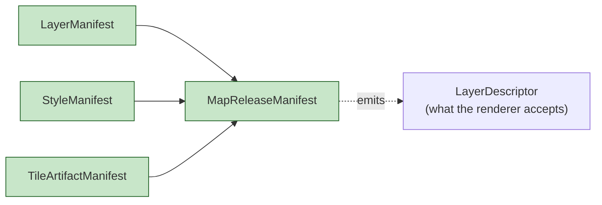
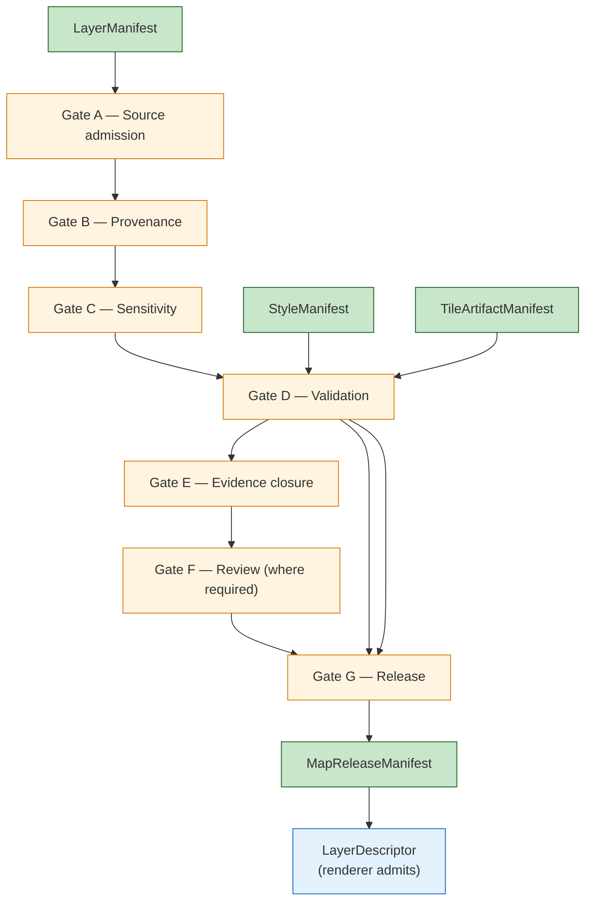

<!-- [KFM_META_BLOCK_V2]
doc_id: kfm://doc/architecture-map-master-layer-lifecycle
title: Map Master — Layer Lifecycle
type: standard
version: v0.1
status: draft
owners: UI subsystem steward + Release steward · NEEDS VERIFICATION
created: 2026-05-24
updated: 2026-05-24
policy_label: public
related:
  - README.md
  - ../map-shell.md
  - TILE_ARTIFACTS.md
  - VIEWER_VERIFICATION.md
  - ../governed-api/LIFECYCLE_GATES.md
  - ../release-discipline.md
tags: [kfm, architecture, map-master, layer, manifest, lifecycle, doctrine]
notes:
  - PROPOSED. Expands map-shell.md §7 (State Ownership) and §8 (Object Families).
  - Manifest composition is the upstream half of the renderer-as-downstream contract.
[/KFM_META_BLOCK_V2] -->

<a id="top"></a>

# Map Master — Layer Lifecycle

> *How `LayerManifest`, `StyleManifest`, `TileArtifactManifest`, and `MapReleaseManifest` compose to authorize a render. The upstream half of the renderer-as-downstream contract.*


%20·%20PROPOSED%20(composition)-blue)


**Status:** draft · **Owners:** UI subsystem steward + Release steward *(NEEDS VERIFICATION)* · **Last updated:** 2026-05-24

> [!IMPORTANT]
> **No layer reaches the renderer without all four manifests resolved** *(`map-shell.md` TM-3 + §11 "No unreleased tile load", CONFIRMED)*. `LayerManifest` describes what the layer **is**; `StyleManifest` describes how it **renders**; `TileArtifactManifest` pins the **bytes**; `MapReleaseManifest` bundles the lot under a **release identity** with a rollback target.

> [!NOTE]
> **This doc is the manifest-composition contract.** Per-field JSON Schema lives in `schemas/contracts/v1/layers/...` and `schemas/contracts/v1/release/...`; Rego lives in `policy/ui/` and `policy/release/`; tile bytes live in `data/published/tiles/`. This doc tells implementers how the manifests compose and what each one guarantees.

---

## Table of contents

1. [Scope](#1-scope)
2. [The four manifests](#2-the-four-manifests)
3. [`LayerManifest`](#3-layermanifest)
4. [`StyleManifest`](#4-stylemanifest)
5. [`TileArtifactManifest`](#5-tileartifactmanifest)
6. [`MapReleaseManifest`](#6-mapreleasemanifest)
7. [Composition through the gates](#7-composition-through-the-gates)
8. [Rollback semantics](#8-rollback-semantics)
9. [Anti-patterns](#9-anti-patterns)
10. [Open questions and ADR triggers](#10-open-questions-and-adr-triggers)
11. [Related docs](#11-related-docs)
12. [Appendix](#12-appendix)

---

## 1. Scope

This doc names the four layer-side manifests, lists their required fields *(prose-level)*, tells implementers how they compose, and maps each composition step to a promotion gate.

> [!TIP]
> **When this doc binds.** Authoring a new layer, evolving an existing one, adding a new style, replacing a tile artifact, cutting a new release, or executing a rollback.

[↑ Back to top](#top)

---

## 2. The four manifests

> **Evidence basis:** `map-shell.md` §8 Object Families *(`LayerManifest`, `StyleManifest`, `TileArtifactManifest`, `MapReleaseManifest`, PROPOSED)*; `kfm_unified_doctrine_synthesis.md` §10 *(core object families, CONFIRMED)*.

| Manifest | Role | Lifecycle owner |
|---|---|---|
| **`LayerManifest`** | What the layer **is**: identity, source role, `valid_time`, freshness, provenance, sensitivity posture, integrity refs. | Layer steward *(per domain)* |
| **`StyleManifest`** | How the layer **renders**: style JSON, sprites, glyphs, legends, sensitive-styling constraints, checksum. | UI steward / domain |
| **`TileArtifactManifest`** | The **bytes**: format, digest, signature, byte-pin, BAO root, release status. | Release plane |
| **`MapReleaseManifest`** | The **bundle**: a coherent set of layers + styles + artifacts at a release identity, with rollback target. | Release plane |



[↑ Back to top](#top)

---

## 3. `LayerManifest`

> **Status:** PROPOSED. Field-level schema lives in `schemas/contracts/v1/layers/layer_manifest.schema.json`.

| Field | Type | Required | Meaning |
|---|---|---|---|
| `object_type` | string literal `"LayerManifest"` | yes | — |
| `schema_version` | string | yes | — |
| `layer_id` | string | yes | Stable, domain-scoped id. |
| `domain` | string | yes | One of the thirteen KFM domains *(see `cross-domain/responsibility-layers.md` §11)*. |
| `source_descriptor_ref` | URI | yes | `kfm://source/<id>`. |
| `source_role` | enum | yes | One of seven canonical roles *(`cross-domain/source-role-anti-collapse.md` §2.1)*. |
| `valid_time` | object | conditional | Temporal slice if applicable. |
| `freshness` | object | yes | Posture *(fresh / stale / withdrawn)* + last-promoted timestamp. |
| `sensitivity_posture` | enum | yes | `public` · `restricted` · `sensitive` · `fail-closed`. |
| `policy_label` | string | yes | Surfaces the deployment posture; matches policy bundle key. |
| `evidence_refs` | array of URIs | yes | At least one resolvable bundle ref; closure required for `PUBLISHED`. |
| `integrity_refs` | array | yes | References into `TileArtifactManifest`. |
| `provenance_ref` | URI | yes | Build provenance receipt. |
| `release_state` | enum | yes | `RAW` · `WORK` · `QUARANTINE` · `PROCESSED` · `PUBLISHED`. |
| `succeeds` | URI | optional | Prior layer manifest id this supersedes. |

> [!IMPORTANT]
> **`source_role` is preserved through every promotion.** A modeled layer stays modeled even after publication; promotion does not upgrade role *(`cross-domain/source-role-anti-collapse.md` §5)*.

[↑ Back to top](#top)

---

## 4. `StyleManifest`

> **Status:** PROPOSED.

| Field | Type | Required | Meaning |
|---|---|---|---|
| `object_type` | string literal `"StyleManifest"` | yes | — |
| `schema_version` | string | yes | — |
| `style_id` | string | yes | Stable id. |
| `style_doc_ref` | URI | yes | The style JSON itself; content-addressed. |
| `style_doc_digest` | string `b3:<hex>` | yes | Style JSON digest. |
| `sprite_ref` / `glyph_ref` | URI | conditional | If used by the style. |
| `legend_ref` | URI | optional | Legend rendering data. |
| `sensitive_style_constraints` | object | yes | Documents which fields are **not** legitimate places for sensitivity policy *(TM-4)*; e.g., declares "no `filter` may stand in for sensitivity policy". |
| `applies_to_layer_ids` | array | yes | Which `LayerManifest.layer_id` values this style is admissible for. |

> [!CAUTION]
> **Style is not policy *(TM-4)*.** `StyleManifest` cannot mask sensitive geometry; geometry is masked / generalized / restricted **before** tile generation. Style controls appearance, not admissibility.

[↑ Back to top](#top)

---

## 5. `TileArtifactManifest`

> **Status:** PROPOSED. See [`TILE_ARTIFACTS.md`](TILE_ARTIFACTS.md) for the format-level catalog.

| Field | Type | Required | Meaning |
|---|---|---|---|
| `object_type` | string literal `"TileArtifactManifest"` | yes | — |
| `schema_version` | string | yes | — |
| `artifact_id` | string | yes | Stable id. |
| `format` | enum `pmtiles` · `mvt` · `mbtiles` · `cog` · `zarr` · `mlt` | yes | Format. |
| `bytes_ref` | URI | yes | `kfm://tile/<id>` or storage URI under `data/published/tiles/`. |
| `content_digest` | string `b3:<hex>` | yes | Whole-artifact digest. |
| `bao_root` | string `b3-bao:<hex>` | conditional | PROPOSED — chunk-verified streaming. |
| `signature_ref` | URI | yes | Detached signature ref. |
| `byte_pin` | object | conditional | Format-specific byte / range pin *(PMTiles directory offset, COG IFD offsets, Zarr chunk index)*. |
| `applies_to_layer_id` | string | yes | The `LayerManifest.layer_id` it serves. |
| `release_state` | enum | yes | Same vocabulary as `LayerManifest.release_state`. |

[↑ Back to top](#top)

---

## 6. `MapReleaseManifest`

> **Status:** PROPOSED.

| Field | Type | Required | Meaning |
|---|---|---|---|
| `object_type` | string literal `"MapReleaseManifest"` | yes | — |
| `schema_version` | string | yes | — |
| `release_id` | string | yes | Stable release identifier. |
| `released_at` | timestamp | yes | UTC. |
| `layer_manifest_refs` | array of URIs | yes | All `LayerManifest`s in the bundle. |
| `style_manifest_refs` | array of URIs | yes | All `StyleManifest`s in the bundle. |
| `tile_artifact_manifest_refs` | array of URIs | yes | All `TileArtifactManifest`s in the bundle. |
| `evidence_closure_ref` | URI | yes | Closure receipt covering every claim across the bundle. |
| `policy_bundle_hash` | string | yes | Pin to the policy bundle evaluated at release. |
| `rollback_target_ref` | URI | yes | Prior release this bundle can roll back to. |
| `signature_ref` | URI | yes | Detached signature. |
| `succeeds` | URI | optional | Prior release this supersedes. |
| `withdrawn` | boolean | yes | False at publication; true on rollback or withdrawal. |

> [!IMPORTANT]
> **`rollback_target_ref` is mandatory.** A release without a rollback target is not a public release.

[↑ Back to top](#top)

---

## 7. Composition through the gates

> **Evidence basis:** `kfm_unified_doctrine_synthesis.md` §8 *(promotion gates A–G, CONFIRMED)*; `governed-api/LIFECYCLE_GATES.md` *(API-side mapping, PROPOSED)*.



| Gate | Manifest field touched | DENY condition |
|---|---|---|
| A | `LayerManifest.source_descriptor_ref` | Source not admitted. |
| B | `LayerManifest.provenance_ref` | Provenance missing. |
| C | `LayerManifest.sensitivity_posture` + `StyleManifest.sensitive_style_constraints` | Style stands in for sensitivity *(TM-4)*. |
| D | All manifests — schema validation | Schema invalid. |
| E | `LayerManifest.evidence_refs` | Closure fails. |
| F | `LayerManifest.release_state` + steward decision | Review not cleared. |
| G | `MapReleaseManifest` + `rollback_target_ref` + signatures | Rollback target missing; signatures invalid. |

[↑ Back to top](#top)

---

## 8. Rollback semantics

> **Evidence basis:** `map-shell.md` §11 *("Rollback replay" validation requirement, CONFIRMED)*; `governed-api/LIFECYCLE_GATES.md` §6.

| Phase | Manifest state | Renderer behavior |
|---|---|---|
| Release published | `MapReleaseManifest.withdrawn = false`; `rollback_target_ref` points to prior. | Renderer admits layers normally. |
| Rollback initiated | New `MapReleaseManifest` with `withdrawn = true` for affected layers; `succeeds` points back to prior. | Viewer-verification gate refuses `addSource` for withdrawn layers; renderer displays withdrawal badge. |
| Rollback complete | Prior manifest is the current `PUBLISHED` state; withdrawal card archived. | Renderer admits prior-release layers; trust badges reflect prior release id. |

| Rule | Detail |
|---|---|
| Manifests are immutable | A correction is a new manifest with new digest. |
| `withdrawn = true` is the only way to retire a release | Edits are forbidden. |
| Style manifests follow layer-manifest withdrawal | A withdrawn layer's style is also withdrawn at the bundle level. |
| Tile bytes are not deleted on withdrawal | They remain for audit; admission is denied via manifest. |

[↑ Back to top](#top)

---

## 9. Anti-patterns

| Anti-pattern | Mitigation |
|---|---|
| **Layer published without a `MapReleaseManifest`** | Gate G denies; viewer-verification gate refuses. |
| **Style filter encodes sensitivity rule** | `StyleManifest.sensitive_style_constraints` declares the forbidden field set; reviewers flag. |
| **`LayerManifest` edited in place** | Manifests immutable; new id on revision. |
| **`MapReleaseManifest` without `rollback_target_ref`** | Schema requires; release denied. |
| **Tile artifact referenced by `TileArtifactManifest` but not by `MapReleaseManifest`** | Orphan; viewer-verification gate refuses; release plane purges. |
| **`succeeds` chain broken** | Auditors lose history; CI lints. |

[↑ Back to top](#top)

---

## 10. Open questions and ADR triggers

| Open item | Class | Suggested ADR title |
|---|---|---|
| `LayerManifest` per-domain extensions — single shape or per-domain payload extension? | Schema | "LayerManifest per-domain extension". |
| `StyleManifest` sensitive-constraint vocabulary — fixed list or registry? | Vocabulary | "Style sensitive-constraint vocabulary". |
| `MapReleaseManifest` cardinality — per-Focus-Mode vs cross-Focus-Mode bundles? | Composition | "MapReleaseManifest scoping". |
| Withdrawal vs deletion — purge after retention window, or keep forever? | Operational | "Withdrawn-manifest retention". |
| Should `rollback_target_ref` allow a chain *(rollback of rollback)* or single hop? | Semantics | "Rollback chain depth". |

[↑ Back to top](#top)

---

## 11. Related docs

| Reference | Role | Truth label |
|---|---|---|
| `README.md` *(this folder)* | Landing | CONFIRMED doctrine |
| `../map-shell.md` §7, §8, §11 | Spine | CONFIRMED doctrine |
| `TILE_ARTIFACTS.md` *(sibling)* | Format-level detail for `TileArtifactManifest` | PROPOSED |
| `VIEWER_VERIFICATION.md` *(sibling)* | The runtime gate that consumes manifests | PROPOSED |
| `../governed-api/LIFECYCLE_GATES.md` | API-side gate mapping | PROPOSED |
| `../release-discipline.md` | Release plane home | CONFIRMED scaffold |
| `../cross-domain/source-role-anti-collapse.md` | Role preservation through promotion | CONFIRMED doctrine |
| `../cross-domain/shared-kernel.md` §7 | `ReleaseManifest` kernel object | CONFIRMED doctrine |
| `kfm_unified_doctrine_synthesis.md` §8 | Promotion gates | CONFIRMED doctrine |

[↑ Back to top](#top)

---

## 12. Appendix

<details>
<summary><strong>12.1 Manifest stack — at-a-glance</strong></summary>

```text
MapReleaseManifest                 (release identity · rollback target)
├── LayerManifest[]                (what each layer is · source role · evidence)
├── StyleManifest[]                (how it renders · no policy in style)
└── TileArtifactManifest[]         (the bytes · digest · signature · BAO)
                                   │
                                   ▼
                       LayerDescriptor (what the renderer admits)
```

</details>

<details>
<summary><strong>12.2 Truth-label legend</strong></summary>

- **CONFIRMED** — verified this session from attached docs.
- **PROPOSED** — design / placement / inference not yet verified in implementation.
- **INFERRED** — derivable from confirmed evidence but not directly stated.
- **NEEDS VERIFICATION** — checkable, but not yet checked strongly enough to act as fact.

</details>

---

**Related (mini)** · [`README.md`](README.md) · [`../map-shell.md`](../map-shell.md) · [`TILE_ARTIFACTS.md`](TILE_ARTIFACTS.md) · [`VIEWER_VERIFICATION.md`](VIEWER_VERIFICATION.md) · [`../governed-api/LIFECYCLE_GATES.md`](../governed-api/LIFECYCLE_GATES.md)

**Last updated:** 2026-05-24 · **Doc version:** v0.1 · **Doc status:** draft · **Path status:** PROPOSED *(OPEN-DR-12 MAP-MASTER)*

[↑ Back to top](#top)
