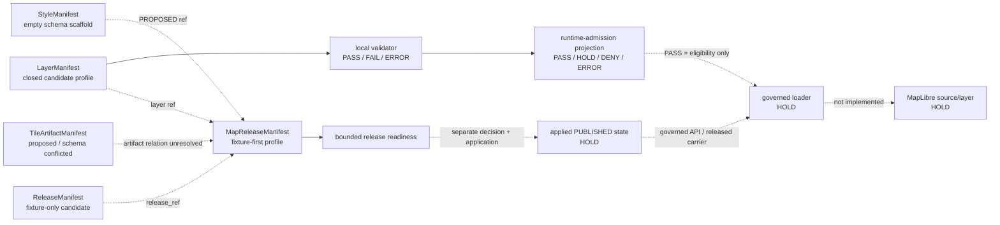

<!-- [KFM_META_BLOCK_V2]
doc_id: kfm://doc/architecture-map-master-layer-lifecycle
title: Map Master — Layer Lifecycle
type: architecture-reference
version: v1.0-draft
status: draft; repository-grounded; mixed-maturity; fixture-first; runtime-admission-hold; operational-release-hold; non-authoritative; non-publication
owners:
  - "@bartytime4life — verified CODEOWNERS review route"
  - "NEEDS VERIFICATION — independent layer, map/runtime, evidence, policy, review, release, correction, rollback, and security/signing stewardship"
created: 2026-05-24
updated: 2026-08-19
policy_label: public; architecture; map-master; layer-lifecycle; manifests; runtime-boundary; release; correction; rollback; cite-or-abstain
owning_root: docs/
responsibility: >-
  Explain the current LayerManifest, StyleManifest, TileArtifactManifest,
  MapReleaseManifest, runtime-admission, release, correction, and rollback
  boundaries without becoming semantic-contract, schema, policy, registry,
  renderer, release, or publication authority.
truth_posture: >-
  CONFIRMED existing same-path document, accepted Directory Rules v2 placement,
  fixture-only LayerManifest validation, fixture-only runtime-admission
  projection, fixture-first MapReleaseManifest closure, and explicit no-effect
  boundaries / PROPOSED StyleManifest semantics, canonical TileArtifactManifest
  shape, integrated loader, manifest composition, production release, and
  correction behavior / CONFLICTED layer contract/schema homes, tile-artifact
  schema family, A-G vocabulary, and release-state vocabulary / UNKNOWN live
  registry mutation, MapLibre source creation, authenticated policy and review,
  release persistence, public serving, cache invalidation, withdrawal, and
  rollback execution / NEEDS VERIFICATION accepted profiles, reference
  resolution, signer trust, independent stewardship, hosted exact-head checks,
  and the first governed map release.
evidence_snapshot:
  repository: bartytime4life/Kansas-Frontier-Matrix
  base_ref: main
  base_commit: 996b7e16d46a703c9436b26ef74ed0ecaf87796a
  target_prior_blob: 83deb99a2f4ed1bbbd5712381c1a19c6e0cc011e
  directory_rules_blob: fd49a0b83e55cef52c1124281f093e263526898d
  codeowners_blob: dd2a84aa514d8ecd9208bc347f90f9a2ed37dd61
  layer_manifest_contract_blob: 234dca70e768ee744f7d78109afc6e0dc745af1b
  layer_manifest_schema_blob: abca306cb271ed75127a83dd05b73830ba20773b
  layer_manifest_validator_blob: 577d31795caaf6712132e73189af18d318ac0e8a
  layer_manifest_tests_blob: 7ecd1473ab58cdfbe869f046e06fe882d40fd4f6
  runtime_admission_contract_blob: 82dc8fc1bf84eb0f8114aed7170d8686ae31ab60
  runtime_admission_implementation_blob: 895100728c9eb676b9e2aef84680073142694b27
  runtime_admission_tests_blob: d3bd228588304f31ed709b186c87be916a2a2f25
  runtime_admission_fixtures_blob: f2b743cda8b16e747b918b8ea3bda9ef9ae911fe
  map_release_contract_blob: e2a70bdd659cf432901ee9d5544b8e1418c23e60
  map_release_schema_blob: 2cf48a8a353f4eefe290cea471778638386585de
  map_release_tests_blob: 4eb880343e0befb5633f698f9e56ae8ee34c37d0
  style_manifest_schema_blob: 63d6b4fc11a16bf37c058026a7f3ee2ce56b0d11
inspection_boundary: >-
  Current GitHub repository files, branch metadata, contracts, schemas,
  validators, fixtures, tests, workflows, policy guidance, and adjacent
  architecture documents were inspected. No mounted checkout, local
  repository-native test run, live evidence resolver, accepted layer-policy
  evaluator, authenticated independent review, trusted signing service,
  production release registry, functioning MapLibre loader, public endpoint,
  cache-invalidation service, or operational rollback was exercised.
related:
  - README.md
  - RENDERER_BOUNDARY.md
  - TILE_ARTIFACTS.md
  - VIEWER_VERIFICATION.md
  - EVIDENCE_DRAWER.md
  - ../publication/release-objects.md
  - ../publication/release-state-machine.md
  - ../../adr/ADR-0018-promotion-gate-sequence.md
  - ../../adr/ADR-0029-adopt-directory-governance-standard-v2.md
  - ../../doctrine/directory-rules.md
  - ../../../contracts/data/layer_manifest.md
  - ../../../contracts/runtime/layer_manifest_admission.md
  - ../../../contracts/release/map_release_manifest.md
  - ../../../schemas/contracts/v1/data/layer_manifest.schema.json
  - ../../../schemas/contracts/v1/map/map_release_manifest.schema.json
  - ../../../apps/explorer-web/src/features/map_runtime/layer_manifest_admission.ts
notes:
  - "Same-path architecture-document reconciliation; placement outcome PLACE."
  - "Preserves the H1, top anchor, numbered sections 1–12, and legacy section anchors."
  - "Replaces the unsupported mandatory four-manifest runtime claim with a mixed-maturity object-family and transition model."
  - "Separates local candidate PASS, runtime eligibility, release readiness, decision, transition application, public serving, correction, withdrawal, and rollback."
  - "No contract, schema, policy, fixture, validator, workflow, registry, data, release, runtime, deployment, or publication state changes."
tags: [kfm, architecture, map-master, layer, manifest, lifecycle, maplibre, release, correction, rollback]
[/KFM_META_BLOCK_V2] -->

<a id="top"></a>

# Map Master — Layer Lifecycle

> **Operating rule.** A map layer is a downstream representation with a lifecycle, not an authority shortcut. Current repository evidence proves bounded candidate validation and a no-write runtime-admission projection; it does **not** prove an integrated layer loader, registry mutation, MapLibre source creation, production release, public serving, correction propagation, or rollback execution.

[](#status-and-authority)
[](#directory-rules-basis)
[](#3-layermanifest)
[](#72-runtime-admission-projection)
[](#76-operational-hold)
[](#non-effects)

> [!IMPORTANT]
> **The prior “all four manifests resolved” rule is not current implementation evidence.** `LayerManifest`, `StyleManifest`, `TileArtifactManifest`, and `MapReleaseManifest` remain useful object-family names, but their repository maturity is asymmetric. Only the LayerManifest and MapReleaseManifest families have closed fixture profiles; StyleManifest remains an empty permissive schema scaffold, and TileArtifactManifest still has unresolved canonical schema placement.

> [!CAUTION]
> **Validation, eligibility, readiness, approval, application, and publication are different axes.** A schema-valid object, validator `PASS`, runtime-admission `PASS`, `APPROVE_READY`, proposed `APPROVE`, green workflow, pull request, merge, GitHub release, visible layer, or cached tile does not establish KFM `PUBLISHED` state.

> [!WARNING]
> **This document is explanatory architecture under `docs/`; it is not a manifest-composition contract.** Semantic meaning belongs under `contracts/`, machine shape under `schemas/`, admissibility under `policy/`, behavior proof under fixtures/validators/tests, release records under `release/`, and public delivery under governed application and published-artifact surfaces.

**Navigation:** [Status](#status-and-authority) · [Scope](#1-scope) · [Families](#2-the-four-manifests) · [LayerManifest](#3-layermanifest) · [StyleManifest](#4-stylemanifest) · [TileArtifactManifest](#5-tileartifactmanifest) · [MapReleaseManifest](#6-mapreleasemanifest) · [Composition](#7-composition-through-the-gates) · [Rollback](#8-rollback-semantics) · [Anti-patterns](#9-anti-patterns) · [Open work](#10-open-questions-and-adr-triggers) · [Evidence](#11-related-docs) · [Appendix](#12-appendix)

---

<a id="status-and-authority"></a>

## Status and authority

| Question | Current bounded answer |
|---|---|
| Does this document exist at the stated path? | **CONFIRMED.** It is tracked at `docs/architecture/map-master/LAYER_LIFECYCLE.md`. |
| Is the path still merely proposed under `OPEN-DR-12`? | **No.** Accepted ADR-0029 adopts Directory Rules v2; the existing `docs/architecture/map-master/` lane is a valid human architecture surface. |
| Is this page a semantic contract, schema, policy, registry, or release record? | **No.** It explains boundaries and links to the owning surfaces. |
| Who is the verified GitHub review route? | **CONFIRMED:** `@bartytime4life` through CODEOWNERS. That route is not proof of independent stewardship, review completion, policy approval, release approval, or separation of duties. |
| Is a functioning layer loader established? | **No.** A fixture-only admission projection can return registration eligibility, but always reports `registryMutated: false` and `maplibreSourceCreated: false`. |
| Is a governed map release operating? | **UNKNOWN / HOLD.** No inspected production transition operator, live registry mutation, public carrier binding, invalidation service, or rollback execution proves it. |
| Does this documentation change any layer or release state? | **No.** It changes explanatory Markdown only. |

### Current maturity at a glance

| Surface | CONFIRMED repository evidence | Safe conclusion |
|---|---|---|
| Canonical `LayerManifest` meaning | `contracts/data/layer_manifest.md` v0.3 | Dual-profile semantic contract; strict profile is inactive and fixture-only. |
| `LayerManifest` machine shape | Closed strict branch plus permissive legacy branch in `schemas/contracts/v1/data/layer_manifest.schema.json` | Local candidate validation exists; production/released shape is not accepted. |
| `LayerManifest` behavior proof | Validator, 4 valid fixtures, 12 invalid fixtures, 13 unit-test methods, dedicated workflow | Deterministic local `PASS / FAIL / ERROR`; no reference, policy, review, artifact, signature, release, or registry authority. |
| Runtime admission projection | Contract, TypeScript evaluator, 13 fixture cases, 3 test blocks, dedicated workflow | One synthetic released projection can be `PASS`/eligible; no registry mutation or MapLibre source creation occurs. |
| `StyleManifest` | Empty permissive proposed schema with `contract_doc: null` | No canonical semantic contract, field profile, fixture matrix, validator, or runtime integration is established. |
| `TileArtifactManifest` | Proposed semantic contract; noncanonical PMTiles compatibility evidence; empty permissive map schema | Canonical schema family and cross-format profile remain unresolved. |
| `MapReleaseManifest` | Semantic contract, closed fixture schema, 7 valid and 11 invalid cases, validator/tests/workflow | Bounded synthetic map-release closure exists; no release, cache mutation, rollback execution, deployment, or publication occurs. |
| Layer policy | `policy/layers/` boundary README plus a proposed no-op Rego stub | No accepted bundle, evaluator, decision emitter, or active layer-policy gate is established. |
| Renderer/runtime | Map-master parent still records renderer readiness HOLD | No integrated released-layer-to-MapLibre flow is established. |

<a id="non-effects"></a>

### Non-effects

This page does not:

- accept or amend an ADR;
- change any contract, schema, policy, fixture, validator, test, workflow, generated receipt, registry, data record, release record, or runtime implementation;
- resolve source, evidence, policy, review, artifact, signature, correction, or rollback references;
- mutate a layer registry, create a MapLibre source, load artifact bytes, move an alias, invalidate a cache, execute a rollback, deploy, release, or publish; or
- authorize a browser, API, map, export, graph, search surface, or AI system to consume candidate or internal data.

[Back to top](#top)

---

<a id="directory-rules-basis"></a>

## Directory Rules basis

Accepted [ADR-0029](../../adr/ADR-0029-adopt-directory-governance-standard-v2.md) adopts the current [Directory Rules](../../doctrine/directory-rules.md). This is a same-path update to an existing human architecture document. It creates no new root, object family, or parallel authority. Placement outcome: **PLACE**.

| Responsibility | Owning lane | This page's relationship |
|---|---|---|
| Human architecture explanation | `docs/architecture/map-master/` | Explain current evidence, boundaries, conflicts, and holds. |
| Layer semantic meaning | `contracts/data/` currently; `contracts/layers/` remains a compatibility lane | Link to current meaning; do not settle the placement conflict by prose. |
| Runtime-admission meaning | `contracts/runtime/` | Explain the no-write projection; do not turn it into a loader. |
| Release and map-release meaning | `contracts/release/` | Explain release relationships; do not approve or persist them. |
| Machine-checkable shape | `schemas/contracts/v1/` by family | Report profile maturity; do not copy or override schema fields here. |
| Admissibility and obligations | `policy/` | Report inactive/no-op status; do not infer allow from file presence. |
| Synthetic evidence and executable checks | `fixtures/`, `tools/validators/`, `tests/`, `.github/workflows/` | Cite bounded behavior; green checks create no authority. |
| Registry and lifecycle records | `data/registry/` and governed lifecycle roots | Explain the boundary; do not mutate records. |
| Release, correction, withdrawal, rollback | `release/` and their semantic/support families | Preserve distinct records and transition effects. |
| Public delivery | governed APIs, Explorer, and released public-safe carriers | Downstream consumption only; no normal direct canonical/internal path. |

[Back to top](#top)

---

<a id="1-scope"></a>

## 1. Scope

This page answers six architecture questions:

1. What does each layer-side manifest family mean, and which repository surface owns that meaning?
2. What does the current repository actually validate for each family?
3. Which relationships are implemented, which are synthetic projections, and which remain proposed or conflicted?
4. How do local `PASS`, runtime eligibility, final readiness, decision, transition application, and public serving stay distinct?
5. How must correction, supersession, withdrawal, rollback, and cache invalidation remain visible without silent mutation?
6. What exact evidence is still required before a public renderer may consume a layer?

This page does **not** define a production layer schema, select a universal release-state enum, accept the A–G gate sequence, activate layer policy, define a registry storage engine, or prescribe a MapLibre API.

> [!TIP]
> **Use this page when** evaluating a new layer candidate, changing a layer representation, introducing a style or artifact profile, preparing a map-release candidate, designing a loader, or reviewing correction and rollback behavior. Use the linked contracts and schemas—not this page—for field-level authority.

[Back to top](#top)

---

<a id="2-the-four-manifests"></a>

## 2. The four manifests

The four names from the original page remain useful as a **conceptual composition vocabulary**. They are not currently one mandatory, uniformly implemented, runtime-enforced bundle.

| Family | Current bounded role | Current maturity | Authority limit |
|---|---|---|---|
| `LayerManifest` | Version-specific layer candidate binding identity, sources, evidence, representation, time, exposure, runtime hints, lineage, and governance non-effects. | **CONFIRMED fixture-backed strict candidate** plus permissive legacy compatibility. | Strict profile is `PROPOSED_INACTIVE / FIXTURE_ONLY / CANDIDATE`; all authority flags are false. |
| `StyleManifest` | Proposed presentation manifest for style, sprites, glyphs, legends, and layer compatibility. | **PROPOSED scaffold only.** | Current schema is empty/permissive and has no contract binding; no field-level guarantees exist. |
| `TileArtifactManifest` | Proposed artifact metadata/digest object for tile-oriented carriers. | **PROPOSED semantic contract; CONFLICTED schema family.** | Existing map schema is an empty scaffold; PMTiles compatibility evidence is opt-in and noncanonical. |
| `MapReleaseManifest` | Map-specific release envelope relating a general release to artifact descriptions, layer/style refs, catalogs, evidence, decisions, public boundary, correction, and rollback. | **CONFIRMED fixture-first closed profile.** | Profile remains `PROPOSED_INACTIVE`; validator does not apply release or public effects. |

### 2.1 Adjacent objects that must not collapse

| Object or family | Distinct responsibility |
|---|---|
| `LayerDescriptor` | Proposed renderer-facing handoff; not proved as an emitted object from the current map-release profile. |
| `ReleaseManifest` | General release binding; the current strict profile is also inactive and fixture-only. |
| `PromotionDecision` | Proposed actor decision; schema validity does not authenticate the actor or apply state. |
| `PolicyDecision` | Operation-specific admissibility and obligations; current layer-policy evaluator is not active. |
| `EvidenceBundle` | Resolved support for claims; a layer or release manifest only references it. |
| `ReviewRecord` | Review disposition and role evidence; CODEOWNERS routing is not the record. |
| `RunReceipt` / `PromotionReceipt` | Process memory and bounded readiness evidence; not release approval. |
| `CorrectionNotice` / `WithdrawalNotice` / `RollbackCard` | Post-release governance and recovery records; not booleans hidden inside one manifest. |

### 2.2 Current composition picture


```mermaid
flowchart LR
  LM["LayerManifest<br/>closed candidate profile"] --> LV["local validator<br/>PASS / FAIL / ERROR"]
  LV --> RA["runtime-admission projection<br/>PASS / HOLD / DENY / ERROR"]
  RA -. "PASS = eligibility only" .-> LOADER["governed loader<br/>HOLD"]

  SM["StyleManifest<br/>empty schema scaffold"] -. "PROPOSED ref" .-> MRM
  TAM["TileArtifactManifest<br/>proposed / schema conflicted"] -. "artifact relation unresolved" .-> MRM
  LM -. "layer ref" .-> MRM["MapReleaseManifest<br/>fixture-first profile"]
  RM["ReleaseManifest<br/>fixture-only candidate"] -. "release_ref" .-> MRM

  MRM --> READY["bounded release readiness"]
  READY -. "separate decision + application" .-> PUB["applied PUBLISHED state<br/>HOLD"]
  PUB -. "governed API / released carrier" .-> LOADER
  LOADER -. "not implemented" .-> MAP["MapLibre source/layer<br/>HOLD"]
```

Solid edges represent repository-backed local validation or projection relationships. Dotted edges are proposed, synthetic, conflicted, or operationally held.

[Back to top](#top)

---

<a id="3-layermanifest"></a>

## 3. `LayerManifest`

The current semantic authority is [`contracts/data/layer_manifest.md`](../../../contracts/data/layer_manifest.md), paired with [`schemas/contracts/v1/data/layer_manifest.schema.json`](../../../schemas/contracts/v1/data/layer_manifest.schema.json).

### 3.1 Profiles

| Profile | Selection | Shape | Current meaning |
|---|---|---|---|
| Legacy compatibility | No `object_type` | `id` required; optional `version` and `spec_hash`; additional properties allowed | Preserves prior consumers; does not prove layer completeness or safety. |
| Strict fixture profile | `object_type: LayerManifest` | Closed schema | `PROPOSED_INACTIVE`, `FIXTURE_ONLY`, lifecycle `CANDIDATE`; deterministic local candidate only. |

The strict profile does **not** define an active or published LayerManifest. Its governance object fixes all of these fields to `false`:

- `references_resolved`;
- `artifact_verified`;
- `policy_evaluated`;
- `review_authenticated`;
- `manifest_signature_verified`;
- `release_authorized`;
- `publication_authorized`; and
- `public_use_allowed`.

### 3.2 Strict-profile field families

The schema—not this page—defines the exact field set. At architecture level, the current strict profile carries:

| Family | Current content |
|---|---|
| Identity | Content-derived manifest id, `spec_hash`, stable `layer_id`, explicit layer version, title. |
| Catalog and release relations | Catalog, release-manifest, promotion-decision, and optional style-manifest refs. |
| Evidence and source support | Sorted unique SourceDescriptor, EvidenceBundle, PolicyDecision, and ReviewRecord refs. |
| Representation | MapLibre renderer constant; PMTiles, XYZ, COG, or GeoJSON-fixture protocol; artifact ref; source layer where applicable; zooms, bounds, attribution. |
| Time | Valid interval, source-update time, evaluation time. |
| Exposure | Audience, rights, sensitivity, public-field allowlist, geometry-generalization declaration, transform-receipt refs. |
| Runtime hints | Evidence Drawer and Focus Mode declarations, stale behavior, bounded performance budget. |
| Lineage | Previous manifest, correction refs, rollback ref. |
| Provenance | Run receipt and validator implementation ref. |
| Governance | Explicit false-valued non-effects. |

### 3.3 Validator boundary

The current validator checks:

- bounded UTF-8 JSON, duplicate keys, nonfinite numbers, and closed-schema conformance;
- RFC 8785 JCS plus SHA-256 identity reproduction;
- sorted, unique reference arrays and no floating `latest` locator;
- no cross-role reference collapse;
- protocol/source-layer, zoom, bounds, and temporal coherence;
- public rights, sensitivity, field allowlist, and transform-receipt requirements; and
- false governance flags.

It emits `PASS`, `FAIL`, or `ERROR`. A `PASS` establishes only local shape and deterministic invariants. It does not inspect remote bytes, resolve references, execute policy, authenticate review, verify signatures, register a layer, release, publish, or authorize public use.

### 3.4 Current fixture and workflow evidence

- Four valid fixtures: one legacy compatibility object and three strict candidates.
- Twelve invalid fixtures: two schema-invalid and ten semantic-invalid cases.
- Focused tests cover exact polarity, identity, fail-closed parsing, deterministic no-network execution, diagnostic safety, registry wiring, and aggregate-profile membership.
- The dedicated workflow records the same non-authority boundary.

[Back to top](#top)

---

<a id="4-stylemanifest"></a>

## 4. `StyleManifest`

The original page presented a required StyleManifest field table as though a semantic contract existed. Current repository evidence does not support that claim.

### 4.1 Current state

[`schemas/contracts/v1/map/style_manifest.schema.json`](../../../schemas/contracts/v1/map/style_manifest.schema.json) is:

- `PROPOSED`;
- an empty object schema;
- permissive through `additionalProperties: true`; and
- unbound to a semantic contract through `contract_doc: null`.

No canonical StyleManifest semantic contract, closed field profile, fixture matrix, validator, dedicated workflow, or runtime loader binding was verified for this update.

### 4.2 Proposed responsibility boundary

A future accepted StyleManifest could describe:

- immutable style-document identity and digest;
- sprites, glyphs, legend, source-layer, and layer-compatibility refs;
- renderer/version compatibility;
- attribution and accessibility metadata;
- scale/zoom behavior and representation caveats; and
- references to sensitivity or public-exposure decisions.

Those are **PROPOSED targets**, not current required fields.

> [!CAUTION]
> **Style is not policy and client-side filtering is not redaction.** Sensitive geometry or fields must be transformed, generalized, restricted, or withheld before delivery. A style expression, hidden layer, opacity rule, zoom threshold, or disabled popup cannot make already delivered sensitive bytes public-safe.

### 4.3 Current composition limit

The current LayerManifest strict profile permits an optional `style_manifest_ref`. The current MapReleaseManifest schema requires the `style_manifest_refs` member as part of its local shape. Neither fact creates an accepted StyleManifest profile or proves that an operational loader resolves and verifies style bytes.

[Back to top](#top)

---

<a id="5-tileartifactmanifest"></a>

## 5. `TileArtifactManifest`

The current semantic document is [`contracts/release/tile_artifact_manifest.md`](../../../contracts/release/tile_artifact_manifest.md). It describes artifact metadata and trust-spine relationships, not tile payloads.

### 5.1 Current state

| Surface | Current result |
|---|---|
| Semantic meaning | Proposed release-side contract exists. |
| Proposed release-family schema | Not verified at `schemas/contracts/v1/release/tile_artifact_manifest.schema.json`. |
| Existing map-family schema | Empty permissive proposed scaffold with `contract_doc: null`. |
| PMTiles compatibility evidence | Opt-in, noncanonical structural profile; does not settle cross-format or schema authority. |
| Artifact bytes | Not stored in the contract. |
| Release authority | None. |

The canonical schema family remains **CONFLICTED / NEEDS VERIFICATION** among map, release, and layer-oriented placement signals.

### 5.2 Proposed semantic responsibilities

The semantic contract proposes a manifest that can reference:

- artifact kind, media type, governed locator, exact digest, and byte size;
- bounds, zooms, CRS/tile-matrix, time coverage, and freshness;
- layer and release relationships;
- evidence, rights, sensitivity, policy, review, validation, and attestation refs; and
- correction, invalidation, withdrawal, supersession, and rollback lineage.

No table in this architecture page should be treated as the canonical field profile until an accepted schema, fixtures, validator, and migration decision close the family.

### 5.3 Relationship to `MapReleaseManifest`

The current MapReleaseManifest fixture schema embeds bounded artifact descriptions in `artifact_manifests[]` with identity, type, immutable ref, SHA-256 digest, media type, cache policy, and Range/CORS flags where applicable. That is current map-release fixture shape; it is **not** proof that the entries are canonical `TileArtifactManifest` instances.

A future integration must decide whether MapReleaseManifest:

1. references standalone TileArtifactManifest objects;
2. embeds a stable projection of them;
3. supports both through an explicit compatibility profile; or
4. uses another accepted release-artifact relation.

[Back to top](#top)

---

<a id="6-mapreleasemanifest"></a>

## 6. `MapReleaseManifest`

The current semantic authority is [`contracts/release/map_release_manifest.md`](../../../contracts/release/map_release_manifest.md), paired with [`schemas/contracts/v1/map/map_release_manifest.schema.json`](../../../schemas/contracts/v1/map/map_release_manifest.schema.json).

### 6.1 Current local profile

The current profile is fixture-first and `PROPOSED_INACTIVE`. It binds:

- deterministic map-release identity and a ref to the general release;
- artifact descriptions plus layer and style manifest refs;
- STAC, DCAT, and PROV catalog refs;
- evidence, policy, rights, sensitivity, review, and attestation refs;
- a public boundary that fixes RAW, WORK, QUARANTINE, canonical-store, unreleased, and direct-model exposure to `false`;
- correction, supersession, withdrawal, and cache-invalidation refs;
- rollback target, rollback card, verification state, and restoration-receipt ref; and
- explicit state reason codes and deterministic `spec_hash`.

### 6.2 Fixture-local release states

The schema's local enum is:

- `CANDIDATE`;
- `HELD`;
- `PUBLISHED`;
- `STALE`;
- `SUPERSEDED`;
- `WITHDRAWN`; and
- `ROLLED_BACK`.

These values are valid for this fixture profile. They are **not yet an accepted universal KFM release-state vocabulary**; adjacent release documents and registers still conflict.

### 6.3 Current validation evidence

The current tests cover seven valid cases:

- candidate pending review;
- held because rights are unknown;
- published generalized;
- published public;
- rolled back;
- superseded; and
- withdrawn.

They also cover eleven exact negative cases. Published fixtures require catalog, evidence, policy, rights, sensitivity, review, attestation, artifact, and rollback closure; PMTiles and COG entries require Range and CORS; generalized geometry requires a redaction receipt; public boundaries deny internal and unreleased paths.

### 6.4 Authority limit

A fixture named `published_public` proves validator polarity only. The validator does not:

- fetch or authenticate artifacts;
- resolve evidence or catalog records;
- run policy;
- authenticate reviewers;
- verify signatures;
- approve or persist release state;
- change a public alias;
- invalidate a cache;
- execute correction, withdrawal, or rollback;
- deploy; or
- publish.

The general [`ReleaseManifest`](../../../contracts/release/release_manifest.md) strict profile is likewise inactive and fixture-only. MapReleaseManifest specialization does not bypass the general release decision/application boundary.

[Back to top](#top)

---

<a id="7-composition-through-the-gates"></a>

## 7. Composition through the gates

The original page mapped one manifest field to each lifecycle-wide gate A–G. Current repository evidence does not support that one-to-one model.

### 7.1 Current bounded steps

| Step | Repository-backed result | Finite outcome | Authority created |
|---|---|---|---|
| LayerManifest local validation | Closed candidate shape and deterministic semantic checks | `PASS / FAIL / ERROR` | None |
| Runtime-admission projection | Synthetic released projection evaluated against fail-closed admission rules | `PASS / HOLD / DENY / ERROR` | None; `PASS` means eligibility only |
| MapReleaseManifest local validation | Synthetic map-release closure and lifecycle-polarity checks | `PASS / FAIL / ERROR` | None |
| Bounded final readiness | Seven named readiness checks over an assembled candidate | Per-gate `PASS / ABSTAIN / DENY / ERROR`; aggregate `APPROVE_READY / BLOCKED` | Handoff only |
| Promotion decision | Proposed actor disposition | Proposed `APPROVE / DENY / ABSTAIN` | Decision only if actor/profile are accepted and authenticated |
| Transition application | Exact before/after state mutation, receipts, aliases/carriers, and invalidation | **HOLD / UNKNOWN** | Would create persisted state if separately authorized and proven |
| Public serving | Governed API and released public-safe carrier consumed by a loader | **HOLD / UNKNOWN** | No current proof |
| Runtime answer | Evidence- and policy-bounded UI/AI result | `ANSWER / ABSTAIN / DENY / ERROR` | Interpretation only |

### 7.2 Runtime-admission projection

The current TypeScript evaluator rejects or holds:

- legacy and inactive profiles;
- candidate lifecycle state;
- stale, withdrawn, or superseded release state;
- unresolved evidence;
- policy denial;
- manifest/release identity mismatch;
- direct canonical/internal source classes; and
- authority overclaims.

A synthetic coherent input can return:

```text
outcome: PASS
code: LAYER_MANIFEST_REGISTER_ELIGIBLE
authority: NONE
registryMutated: false
maplibreSourceCreated: false
registrationEligible: true
holds:
  - RUNTIME_REGISTRATION_NOT_EXECUTED
```

The evaluator contains no transport call, MapLibre import, `addSource`, or registry mutation shortcut. It is a denial-boundary proof, not a loader.

### 7.3 Bounded A–G readiness

The current final-readiness profile names:

1. `identity_and_closure`;
2. `asset_integrity`;
3. `geometry_and_crs`;
4. `temporal_semantics`;
5. `rights_and_sensitivity`;
6. `proof_and_catalog_support`; and
7. `review_and_rollback`.

A complete pass means `APPROVE_READY`, not approval or publication. Lifecycle-wide A–G vocabulary conflicts with this profile, and [ADR-0018](../../adr/ADR-0018-promotion-gate-sequence.md) remains proposed. This page does not resolve that conflict.

### 7.4 No one-manifest/one-gate mapping

Each significant check may depend on several object families:

| Concern | Likely support set |
|---|---|
| Identity and closure | Layer, release, artifact, source, evidence, catalog, and receipt refs |
| Asset integrity | Artifact description, digest, byte verification, attestation, and release binding |
| Geometry and CRS | Layer representation, artifact metadata, public-safe transform, and validation report |
| Temporal semantics | Source, dataset/layer valid time, release time, stale state, and correction time |
| Rights and sensitivity | Source terms, policy decisions, transform receipts, review, and public boundary |
| Proof and catalog support | EvidenceBundle, ProofPack, STAC/DCAT/PROV, receipts, and cross-profile checks |
| Review and rollback | ReviewRecord, PromotionDecision, ReleaseManifest, RollbackCard, correction and invalidation refs |

No architecture prose may turn one object's presence into proof that the whole concern is closed.

### 7.5 Decision and transition application

An operational `CATALOG / TRIPLET → PUBLISHED` transition would require at least:

- accepted production contracts and schemas;
- exact subject identity and immutable artifact binding;
- resolved source and EvidenceBundle support;
- active policy evaluation with enforceable obligations;
- authenticated review and appropriate separation of duties;
- verified artifact bytes and signatures/attestations;
- an accepted PromotionDecision;
- an idempotent operator bound to exact before/after state;
- append-only decision, application, and release receipts;
- a governed registry/alias and public-carrier update;
- consumer/cache invalidation or refresh evidence;
- usable correction, withdrawal, and rollback records; and
- public API and renderer tests proving no candidate/internal leakage.

### 7.6 Operational hold

**Current result: HOLD.** No inspected implementation proves an accepted production layer profile flowing through authenticated policy/review/release application into registry mutation, MapLibre source creation, public serving, correction propagation, and rollback replay.

[Back to top](#top)

---

<a id="8-rollback-semantics"></a>

## 8. Rollback semantics

The original page modeled withdrawal through a single mutable `withdrawn` boolean and asserted fixed renderer behavior. Current object families use richer, separate state and lineage structures.

### 8.1 Distinct post-release effects

| Effect | Minimum architectural meaning | Current proof boundary |
|---|---|---|
| Correction | A reviewed successor changes a defect or reliance statement while preserving prior identity and history. | Contracts/fixtures exist in adjacent lanes; end-to-end public propagation is unproved. |
| Supersession | A newer governed release becomes current for a declared scope while the prior release remains inspectable. | MapReleaseManifest fixture state exists; operational alias/current-state change is unproved. |
| Withdrawal | Serving or reliance stops for a defined scope while reason, actor, notice, invalidation, and retention lineage remain. | Fixture state and proposed records exist; public withdrawal execution is unproved. |
| Rollback | A previously governed safe target is restored without erasing the failed/current history. | Fixture and synthetic rehearsal evidence exists elsewhere; production restoration and external invalidation are unproved. |

### 8.2 Current MapReleaseManifest structures

The current fixture profile uses:

- `correction.supersedes_refs`;
- `correction.superseded_by_ref`;
- `correction.correction_notice_refs`;
- `correction.withdrawal_notice_ref`;
- `correction.cache_invalidation_refs`;
- `rollback.rollback_target_ref`;
- `rollback.rollback_card_ref`;
- `rollback.verified`; and
- `rollback.restoration_receipt_ref`.

A published fixture requires rollback closure. That requirement proves local declared shape only; it does not prove the target exists, the card is executable, a restoration happened, or consumers were invalidated.

### 8.3 Required invariants

- Published or release-significant manifests are not silently edited in place.
- Corrections, supersessions, withdrawals, and rollbacks preserve prior identities and lineage.
- A withdrawal is not equivalent to deletion.
- A rollback is not historical regression to RAW/WORK; it creates a new governed current state referencing a prior safe target.
- Cache and consumer invalidation are explicit effects, not assumptions.
- Public surfaces must expose stale, corrected, superseded, withdrawn, or rolled-back posture appropriate to policy.
- Artifact retention or deletion must follow accepted rights, security, retention, evidence, and audit policy; this page does not impose “keep forever” or “purge automatically.”
- A style, browser toggle, or local cache clear is not withdrawal or rollback.

[Back to top](#top)

---

<a id="9-anti-patterns"></a>

## 9. Anti-patterns

| Anti-pattern | Why it fails |
|---|---|
| Treating this page as the manifest-composition contract | Docs explain; contracts, schemas, policy, and release records own authority. |
| Claiming all four manifests are operationally mandatory today | Current maturity is asymmetric and no integrated loader proves the rule. |
| Calling an id-only legacy LayerManifest complete | Legacy schema compatibility is intentionally permissive. |
| Calling a strict LayerManifest `PASS` released | The strict profile is inactive, fixture-only, and fixed to `CANDIDATE`. |
| Calling runtime-admission `PASS` a registry write | The result explicitly reports no registry mutation and no MapLibre source creation. |
| Treating a fixture with `release_state: PUBLISHED` as public state | Fixture polarity is not transition application or public serving. |
| Using StyleManifest or a style filter as sensitivity policy | Appearance cannot redact bytes already delivered to the client. |
| Presenting proposed StyleManifest fields as current guarantees | The current schema is an empty permissive scaffold with no semantic contract. |
| Presenting embedded MapReleaseManifest artifact descriptions as canonical TileArtifactManifest objects | The canonical tile-artifact schema family remains unresolved. |
| Mapping one manifest to one A–G gate | Gate vocabulary is conflicted and concerns require multiple object families. |
| Treating `APPROVE_READY` or proposed `APPROVE` as publication | Readiness, decision, and application are separate. |
| Reading RAW, WORK, QUARANTINE, canonical stores, or internal registries from a public client | Violates the trust membrane and current public-boundary rules. |
| Using a floating `latest` reference | Breaks deterministic identity, replay, correction, and rollback. |
| Collapsing source, evidence, policy, review, release, artifact, correction, and rollback refs | Removes the ability to audit which authority supported which claim. |
| Modeling withdrawal as one mutable boolean | Loses scope, reason, actor, notice, invalidation, retention, and lineage. |
| Deleting or retaining artifacts by architecture convention alone | Rights, security, retention, correction, and audit policy must decide. |
| Treating a commit, PR, merge, workflow, GitHub release, screenshot, or visible layer as KFM publication | Repository and visual events are not governed publication transitions. |

[Back to top](#top)

---

<a id="10-open-questions-and-adr-triggers"></a>

## 10. Open questions and ADR triggers

| Item | Status | Closure evidence or decision needed |
|---|---|---|
| Canonical layer contract/schema home: `data/` versus `layers/` | **CONFLICTED** | Accepted ADR or migration note covering contracts, schemas, fixtures, validators, policies, imports, links, and rollback. |
| Accepted StyleManifest semantic contract and schema | **UNKNOWN / NEEDS VERIFICATION** | Named owner, field semantics, closed schema, fixtures, validator, runtime consumer, compatibility and rollback plan. |
| Canonical TileArtifactManifest schema family | **CONFLICTED** | Decide release/map/layers placement and cross-format profile; reconcile PMTiles compatibility evidence. |
| MapReleaseManifest artifact relation | **PROPOSED** | Decide standalone refs versus embedded projection and prove deterministic cross-object identity. |
| Universal release-state vocabulary | **CONFLICTED** | Reconcile fixture enums, release-root guidance, registers, and post-release effects through accepted governance. |
| A–G vocabulary | **CONFLICTED / HOLD** | Resolve ADR-0018 and distinguish lifecycle gates from bounded final readiness. |
| Canonical active/released LayerManifest profile | **UNKNOWN** | Accepted contract/schema, migration/compatibility, fixtures, validators, policy and release bindings. |
| Projection from canonical LayerManifest into runtime admission | **NEEDS VERIFICATION** | Deterministic adapter or builder proving exact subject/hash binding without inventing authority. |
| Layer-policy bundle and evaluator | **HOLD** | Active fail-closed rules, input/output contracts, decision emission, tests, bundle digest, consumer binding, owner and review. |
| Registry ownership and mutation API | **UNKNOWN** | Accepted registry contract, idempotent writer, audit receipt, authorization, rollback and concurrency proof. |
| Governed loader and MapLibre source creation | **HOLD** | KFM-owned adapter, no-internal-path tests, artifact verification, public-boundary enforcement, browser/device proof. |
| Evidence Drawer and Focus Mode binding | **NEEDS VERIFICATION** | Released EvidenceRef→EvidenceBundle resolution, finite outcomes, no sensitive leakage, correction/release parity. |
| Signature and attestation trust | **UNKNOWN** | Accepted profile, signer/issuer trust, verifier, key/certificate custody, expiry/revocation, offline behavior. |
| Correction, withdrawal, cache invalidation, and rollback execution | **HOLD** | End-to-end rehearsal with exact before/after state, public carrier update, receipts, notices, and replay verification. |
| Steward roles and separation of duties | **NEEDS VERIFICATION** | Verified human identities, authority assignments, independent review, and repository/platform enforcement where required. |

### ADR triggers

An ADR or equivalent accepted decision is required before this page can describe as current fact any change that:

- selects a canonical contract/schema/policy/registry/release home;
- makes one manifest family mandatory for all layer operations;
- establishes an active/released LayerManifest profile;
- defines the universal release-state or A–G vocabulary;
- approves a direct public artifact or canonical-store path;
- makes a registry or loader authoritative;
- changes sensitive-geometry or field-exposure posture;
- collapses or splits release, artifact, correction, withdrawal, or rollback families; or
- changes the renderer-family decision.

[Back to top](#top)

---

<a id="11-related-docs"></a>

## 11. Related docs

### Architecture and doctrine

- [`README.md`](README.md) — repository-grounded map-master boundary and current renderer readiness HOLD.
- [`RENDERER_BOUNDARY.md`](RENDERER_BOUNDARY.md) — renderer negative authorities.
- [`TILE_ARTIFACTS.md`](TILE_ARTIFACTS.md) — artifact-format and integrity guidance; current claims still require repository evidence.
- [`VIEWER_VERIFICATION.md`](VIEWER_VERIFICATION.md) — fail-closed verification target; not proof of an active loader.
- [`EVIDENCE_DRAWER.md`](EVIDENCE_DRAWER.md) — click-to-evidence target behavior.
- [`../publication/release-objects.md`](../publication/release-objects.md) — release-governance and adjacent support families.
- [`../publication/release-state-machine.md`](../publication/release-state-machine.md) — lifecycle, readiness, decision, application, and post-release vocabulary boundaries.
- [`../../doctrine/directory-rules.md`](../../doctrine/directory-rules.md) — accepted placement authority.
- [`../../adr/ADR-0018-promotion-gate-sequence.md`](../../adr/ADR-0018-promotion-gate-sequence.md) — proposed, conflicted gate-sequence decision.
- [`../../adr/ADR-0029-adopt-directory-governance-standard-v2.md`](../../adr/ADR-0029-adopt-directory-governance-standard-v2.md) — accepted Directory Rules adoption.

### Semantic contracts and machine shapes

- [`../../../contracts/data/layer_manifest.md`](../../../contracts/data/layer_manifest.md)
- [`../../../schemas/contracts/v1/data/layer_manifest.schema.json`](../../../schemas/contracts/v1/data/layer_manifest.schema.json)
- [`../../../contracts/runtime/layer_manifest_admission.md`](../../../contracts/runtime/layer_manifest_admission.md)
- [`../../../contracts/release/layer_manifest.md`](../../../contracts/release/layer_manifest.md)
- [`../../../contracts/release/tile_artifact_manifest.md`](../../../contracts/release/tile_artifact_manifest.md)
- [`../../../contracts/release/map_release_manifest.md`](../../../contracts/release/map_release_manifest.md)
- [`../../../schemas/contracts/v1/map/style_manifest.schema.json`](../../../schemas/contracts/v1/map/style_manifest.schema.json)
- [`../../../schemas/contracts/v1/map/tile_artifact_manifest.schema.json`](../../../schemas/contracts/v1/map/tile_artifact_manifest.schema.json)
- [`../../../schemas/contracts/v1/map/map_release_manifest.schema.json`](../../../schemas/contracts/v1/map/map_release_manifest.schema.json)
- [`../../../contracts/release/release_manifest.md`](../../../contracts/release/release_manifest.md)

### Current bounded implementations

- [`../../../tools/validators/data/validate_layer_manifest.py`](../../../tools/validators/data/validate_layer_manifest.py)
- [`../../../tests/validators/test_validate_layer_manifest.py`](../../../tests/validators/test_validate_layer_manifest.py)
- [`../../../apps/explorer-web/src/features/map_runtime/layer_manifest_admission.ts`](../../../apps/explorer-web/src/features/map_runtime/layer_manifest_admission.ts)
- [`../../../apps/explorer-web/tests/layer-manifest-admission.test.ts`](../../../apps/explorer-web/tests/layer-manifest-admission.test.ts)
- [`../../../fixtures/runtime/layer_manifest_admission/cases.json`](../../../fixtures/runtime/layer_manifest_admission/cases.json)
- [`../../../tools/validators/map/validate_map_release_manifest.py`](../../../tools/validators/map/validate_map_release_manifest.py)
- [`../../../tests/map/test_map_release_manifest.py`](../../../tests/map/test_map_release_manifest.py)
- [`../../../policy/layers/README.md`](../../../policy/layers/README.md)
- [`../../../.github/workflows/layer-manifest.yml`](../../../.github/workflows/layer-manifest.yml)
- [`../../../.github/workflows/layer-manifest-admission.yml`](../../../.github/workflows/layer-manifest-admission.yml)
- [`../../../.github/workflows/map-release-manifest.yml`](../../../.github/workflows/map-release-manifest.yml)

[Back to top](#top)

---

<a id="12-appendix"></a>

## 12. Appendix

### 12.1 No-loss reconciliation ledger

| Prior statement | Current disposition |
|---|---|
| This path is `PROPOSED` under an unresolved map-master directory decision. | **SUPERSEDED.** Accepted ADR-0029 and the tracked parent README confirm the explanatory docs lane. |
| This page is the manifest-composition contract. | **REMOVED.** This is architecture explanation; contracts and schemas own meaning and shape. |
| No layer reaches the renderer without all four manifests resolved. | **NARROWED.** A four-family composition is a useful target, but current runtime enforcement and uniform family maturity are not proved. |
| LayerManifest fields live under `schemas/contracts/v1/layers/`. | **CORRECTED.** Current paired strict schema is under `schemas/contracts/v1/data/`; the data-versus-layers home remains conflicted. |
| LayerManifest directly uses lifecycle `RAW / WORK / QUARANTINE / PROCESSED / PUBLISHED`. | **CORRECTED.** Current strict profile is fixed to `CANDIDATE`; lifecycle and release-facing vocabularies remain distinct. |
| StyleManifest has a current required field set. | **REMOVED.** Current schema is an empty permissive scaffold with no semantic contract. |
| TileArtifactManifest currently guarantees BLAKE3/BAO/signature/byte-pin fields. | **REMOVED / PROPOSED.** Canonical schema family remains unresolved; current MapReleaseManifest uses a bounded SHA-256 artifact projection. |
| MapReleaseManifest uses one `withdrawn` boolean. | **CORRECTED.** Current fixture profile uses explicit release states plus structured correction, invalidation, and rollback fields. |
| One manifest field maps to each A–G gate. | **REMOVED.** Gate concerns compose across several object families; current A–G vocabularies conflict. |
| Rollback reactivates a prior manifest by implied renderer behavior. | **NARROWED.** Fixture structures exist; production application, alias/carrier restoration, invalidation, and renderer parity remain held. |
| Tile bytes are always retained after withdrawal. | **REMOVED.** Retention/deletion requires accepted rights, security, audit, and retention policy. |

### 12.2 Focused validation commands

These commands are repository-present validation entry points for the implementation surfaces discussed here. They are **not** executed by this documentation-only edit unless a hosted workflow selects them.

```bash
python -m unittest tests.validators.test_validate_layer_manifest --verbose
python tools/validators/data/validate_layer_manifest.py --fixtures
python tools/validate_all.py --validate-registry
python tools/validate_all.py --profile release-dry-run --validator layer-manifest --quiet

pnpm --filter explorer-web exec vitest run tests/layer-manifest-admission.test.ts
pnpm --filter explorer-web build

python -m unittest tests.map.test_map_release_manifest --verbose
python tools/validators/map/validate_map_release_manifest.py --fixtures
```

A passing command proves only the behavior that command actually exercises at the tested revision.

### 12.3 Documentation acceptance checks

A review of this page should confirm:

- the KFM Meta Block is closed and parseable;
- the H1, `top` anchor, numbered sections 1–12, and legacy section anchors remain;
- every repository-relative link resolves at the reviewed revision;
- no current field guarantee is inferred from an empty/permissive schema;
- fixture and test counts match current repository evidence;
- no `PASS`, eligibility, readiness, decision, or merge is called release/publication;
- operational loader, policy, release, invalidation, and rollback claims remain on explicit HOLD or UNKNOWN;
- no sensitive location, credential, private evidence, or restricted denial reason is disclosed; and
- rollback is a same-path commit revert, not a data or release operation.

### 12.4 Maintenance triggers

Update this page when any of the following changes materially:

- LayerManifest profile status, fields, identity, validator, fixture matrix, or schema home;
- StyleManifest semantic/schema adoption;
- TileArtifactManifest schema-family decision;
- MapReleaseManifest profile, release-state vocabulary, or artifact relation;
- A–G gate decision or readiness implementation;
- layer-policy bundle/evaluator activation;
- registry mutation or governed loader implementation;
- MapLibre dependency/adapter readiness;
- public API, Evidence Drawer, or Focus Mode layer integration;
- correction, withdrawal, invalidation, or rollback execution evidence; or
- independent stewardship and separation-of-duties assignments.

### 12.5 Rollback

Before merge, close the draft pull request and delete only its task branch.

After an authorized merge, revert the documentation commit or restore prior blob `83deb99a2f4ed1bbbd5712381c1a19c6e0cc011e` through a reviewed pull request. Because this change affects one explanatory Markdown file and no runtime or release state, rollback requires no source deactivation, data migration, registry repair, cache invalidation, artifact withdrawal, release rollback, deployment rollback, or public correction.

[Back to top](#top)
