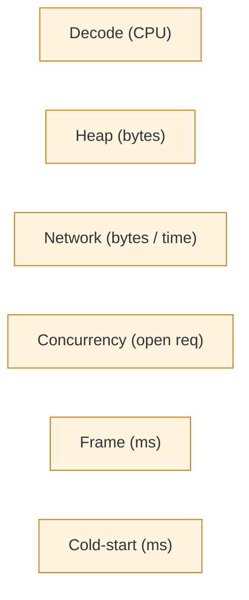

<!-- [KFM_META_BLOCK_V2]
doc_id: kfm://doc/architecture-map-master-performance-budgets
title: Map Master — Performance Budgets
type: standard
version: v0.1
status: draft
owners: UI subsystem steward + Operations steward · NEEDS VERIFICATION
created: 2026-05-24
updated: 2026-05-24
policy_label: public
related:
  - README.md
  - ../map-shell.md
  - TILE_ARTIFACTS.md
  - VIEWER_VERIFICATION.md
  - 2D_3D_PARITY.md
  - ../governed-api/DEPLOYMENT_RULES.md
tags: [kfm, architecture, map-master, performance, budgets, mobile, doctrine]
notes:
  - PROPOSED. Expands map-shell.md §11 (tile load budget) into runtime probes and decode/heap discipline.
  - Budgets are doctrine; over-budget loads abstain or degrade visibly.
[/KFM_META_BLOCK_V2] -->

<a id="top"></a>

# Map Master — Performance Budgets

> *Runtime probes, decode / heap / network budgets, and the mobile-first tile playbook. Over-budget loads abstain or degrade visibly — never silently.*


%20·%20PROPOSED%20(numbers)-blue)


**Status:** draft · **Owners:** UI subsystem steward + Operations steward *(NEEDS VERIFICATION)* · **Last updated:** 2026-05-24

> [!IMPORTANT]
> **Budgets are doctrine** *(`map-shell.md` §11 "Tile load budget", CONFIRMED)*. Tile fetches stay within budget; **over-budget loads abstain or degrade visibly**. The renderer never hides a failed load to make the screen look healthy.

> [!NOTE]
> **This doc names the rule, the probes, and the playbook.** Specific numbers below are PROPOSED defaults; the actual budget values live in `apps/explorer-web/` deployment config and are tuned per Focus Mode / target device class.

---

## Table of contents

1. [Scope](#1-scope)
2. [Budget categories](#2-budget-categories)
3. [Device class profiles](#3-device-class-profiles)
4. [Runtime probes](#4-runtime-probes)
5. [Over-budget handling](#5-overbudget-handling)
6. [Mobile-first tile playbook](#6-mobilefirst-tile-playbook)
7. [3D additional budgets](#7-3d-additional-budgets)
8. [Telemetry](#8-telemetry)
9. [Anti-patterns](#9-anti-patterns)
10. [Open questions and ADR triggers](#10-open-questions-and-adr-triggers)
11. [Related docs](#11-related-docs)
12. [Appendix](#12-appendix)

---

## 1. Scope

This doc enumerates the runtime budget categories the shell enforces, names the probes that measure them, defines what "abstain or degrade visibly" means in practice, and gives a mobile-first playbook for tile artifact selection.

> [!TIP]
> **When this doc binds.** Tuning shell performance for a Focus Mode, profiling a new tile artifact, adding a new layer, evaluating a 3D scene, or auditing whether the shell respects mobile.

[↑ Back to top](#top)

---

## 2. Budget categories

| Category | What it measures | Why it matters |
|---|---|---|
| **Decode budget** | CPU time to decode a tile *(vector parse, raster decompress)*. | Decode-bound stalls degrade interactivity. |
| **Heap budget** | Working-set bytes held by the renderer *(tile cache, geometry buffers, texture pool)*. | OOM on mobile is a hard fail. |
| **Network budget** | Bytes-on-wire per session and per layer load. | Mobile data + slow networks. |
| **Concurrency budget** | Open requests at once *(per origin, per session)*. | Connection exhaustion; head-of-line blocking. |
| **Frame budget** | Time per render frame at target FPS. | Janky pan / zoom; user perception. |
| **Cold-start budget** | Time to first interactive map. | Bounce-rate impact. |



[↑ Back to top](#top)

---

## 3. Device class profiles

> **Status:** PROPOSED. The default profile set; tuned per Focus Mode.

| Profile | Heuristic | Decode budget *(typ.)* | Heap cap *(typ.)* | Concurrency cap | 3D allowed |
|---|---|---|---|---|---|
| **MOBILE-LOW** | Low-end mobile *(<= 2 cores, <= 2 GB RAM, slow network)* | Tight | Tight | 2 | No |
| **MOBILE-MID** | Mid-range mobile | Tight | Moderate | 4 | No |
| **DESKTOP-STD** | Standard desktop | Generous | Generous | 6 | Yes *(with G3D-6 check)* |
| **DESKTOP-HI** | High-end desktop | Generous | Generous | 6 | Yes |
| **TABLET** | Tablet between mobile and desktop | Moderate | Moderate | 4 | Conditional |

> [!IMPORTANT]
> **Device class is detected, then overridable.** The shell detects a starting profile from `navigator` hints + connection class; users can manually pick a profile in settings; budgets apply uniformly thereafter.

[↑ Back to top](#top)

---

## 4. Runtime probes

> **Evidence basis:** `map-shell.md` TM-8 *(watcher-as-non-publisher — probes emit receipts and candidate decisions, never publish, CONFIRMED)*.

| Probe | What it samples | When it fires |
|---|---|---|
| **Decode probe** | Per-tile decode time; rolling average. | On every tile decode. |
| **Heap probe** | Renderer heap residency. | Sampled at frame boundaries. |
| **Network probe** | Bytes / RTT / errors per request. | On every request. |
| **Concurrency probe** | Open-request count. | On request open / close. |
| **Frame probe** | Frame time relative to target. | Per render frame *(sampled)*. |
| **Cold-start probe** | Time-to-first-interactive. | Once per session. |

| Probe rule | Detail |
|---|---|
| Probes emit telemetry, not publication | TM-8 — probes never write to `data/published/`. |
| Probes carry `audience_class`-safe attributes | No raw evidence; no PII; no restricted coords. |
| Probes feed degraded-mode decisions | When a probe signals over-budget, the shell takes a degraded path *(see §5)*. |
| Probes are sampled per audience | `public` sampled; `partner` / `steward` / `internal` full. |

[↑ Back to top](#top)

---

## 5. Over-budget handling

> **Evidence basis:** `map-shell.md` §11 *("Tile fetches stay within budgets; over-budget loads abstain or degrade visibly", CONFIRMED)*.

| Over-budget category | Default action |
|---|---|
| **Decode over-budget** | Abort decode for that tile; render a placeholder; emit `ABSTAIN` for any drawer that needed it. |
| **Heap over-budget** | Evict oldest tiles from cache; if still over, refuse new `addSource` until below threshold; render an explicit "memory-limited" badge. |
| **Network over-budget** | Throttle concurrency; longer fetch backoff; visible "network-limited" badge; never silently retry forever. |
| **Concurrency over-budget** | Queue requests; surface "queued" state to the drawer if it waits. |
| **Frame over-budget** | Reduce layer detail *(lower zoom, fewer features)*; surface "simplified" badge. |
| **Cold-start over-budget** | Defer non-critical layers; surface "loading…" with progress; never block the shell on a slow layer. |

> [!CAUTION]
> **Degrade visibly is the rule.** A blank tile that the user assumes is "no data" instead of "load failed" is a trust violation. The shell renders an explicit degraded badge.

[↑ Back to top](#top)

---

## 6. Mobile-first tile playbook

> **Evidence basis:** `TILE_ARTIFACTS.md` *(format profiles)*; `cross-domain/compositional-units.md` §3 *(Focus Mode placement)*.

| Decision | Default for mobile-first |
|---|---|
| **Format for new vector layers** | PMTiles *(single archive; range-stream; low connection count)*. |
| **Format for new raster layers** | COG with overviews tuned for target zoom. |
| **Avoid for new layers** | MBTiles *(monolithic SQLite, less range-friendly)*. |
| **Range verification** | BAO root in `TileArtifactManifest` *(`TILE_ARTIFACTS.md` §9)*. |
| **Style** | Pre-baked sprite atlas; minimal font glyph ranges; no per-feature shaders. |
| **Initial extent** | Tight default extent per Focus Mode; expand on user action. |
| **Layer set at cold-start** | Minimal; lazy-load secondary layers. |
| **Time slice** | Single-time default; multi-time on explicit selection. |
| **3D auto-instantiate** | Off on MOBILE-* profiles. |
| **Telemetry** | Sampled; redacted; opt-out respected. |

> [!TIP]
> **Mobile-first is not "mobile-only".** Desktop profiles inherit mobile-first defaults and *opt in* to richer behavior. The base shell stays lean.

[↑ Back to top](#top)

---

## 7. 3D additional budgets

> **Evidence basis:** `2D_3D_PARITY.md` §5 *(G3D-6 admission check)*.

| 3D budget | Detail |
|---|---|
| **Scene-asset budget** | Total bytes for scene assets *(terrain, textures, models)*. |
| **GPU heap budget** | Estimated GPU memory residency. |
| **Frame budget** | Tighter than 2D *(higher cost per frame)*. |
| **Decode probe (scene)** | Per-asset decode; rolling average. |
| **G3D-6 fail path** | Scene refused; fallback to 2D parallel; `ABSTAIN` envelope for the 3D step. |

[↑ Back to top](#top)

---

## 8. Telemetry

| Rule | Detail |
|---|---|
| Probe metrics shape | Structured events; allowlisted fields *(see `governed-api/DEPLOYMENT_RULES.md` §7)*. |
| Cardinality | Bounded labels *(device-class bucket, Focus Mode, layer id)*; no per-user labels on `public`. |
| Forbidden | Raw evidence, prompts, secrets, restricted coords, full URLs of upstream provider calls. |
| Sink | Telemetry endpoint *(`/api/v1/telemetry`)*; never canonical stores. |
| User control | Settings panel allows opt-out; probes still operate but emit no telemetry on opt-out. |

[↑ Back to top](#top)

---

## 9. Anti-patterns

| Anti-pattern | Mitigation |
|---|---|
| **Blank tile rendered when load fails** | Explicit degraded badge; never silent. |
| **Heap-eviction policy hides over-budget** | Visible "memory-limited" state. |
| **Concurrency dialed up to "just retry"** | Bounded queue; explicit backoff. |
| **3D auto-loaded on MOBILE-LOW** | G3D-6 admission check refuses. |
| **Custom per-layer budget that bypasses doctrine** | Budgets are doctrine; layer overrides require ADR. |
| **Telemetry attributes carry PII** | Allowlist enforced; reviewers check schema. |
| **Cold-start budget gamed by lazy-loading the critical layer** | Define "critical" per Focus Mode; lazy-load only non-critical. |

[↑ Back to top](#top)

---

## 10. Open questions and ADR triggers

| Open item | Class | Suggested ADR title |
|---|---|---|
| Default budget numbers per device class — single global default vs per-Focus-Mode tuning? | Operational | "Per-Focus-Mode budget tuning". |
| User opt-out granularity — coarse off vs per-category toggle? | UX | "Telemetry opt-out granularity". |
| Per-device-class detection — `navigator` hints + connection only, or extend with WebGL profile? | Detection | "Device class detection inputs". |
| Should budgets be encoded as a machine-checkable manifest *(e.g., `BUDGETS.yaml`)* in `apps/explorer-web/`? | Tooling | "Budget manifest format". |
| 3D budgets — separate doc, or stay folded into this one? | Layout | "3D budgets doc placement". |

[↑ Back to top](#top)

---

## 11. Related docs

| Reference | Role | Truth label |
|---|---|---|
| `README.md` *(this folder)* | Landing | CONFIRMED doctrine |
| `../map-shell.md` §11 (tile load budget), TM-8 | Spine | CONFIRMED doctrine |
| `TILE_ARTIFACTS.md` *(sibling)* | Format profile detail | PROPOSED |
| `VIEWER_VERIFICATION.md` *(sibling)* | Verification cost contributes to decode budget | PROPOSED |
| `2D_3D_PARITY.md` *(sibling)* | G3D-6 admission check | PROPOSED |
| `../governed-api/DEPLOYMENT_RULES.md` §7 | Log discipline for probe telemetry | PROPOSED |
| `../governed-api/AUDIENCE_CLASSES.md` §9 | Per-class telemetry sampling | PROPOSED |
| `apps/explorer-web/` | Deployment config home | PROPOSED |

[↑ Back to top](#top)

---

## 12. Appendix

<details>
<summary><strong>12.1 Budgets — at-a-glance</strong></summary>

```text
Decode      — per-tile CPU time; rolling
Heap        — renderer working set
Network     — bytes / RTT / errors per request
Concurrency — open-request count
Frame       — time per render frame
Cold-start  — time to first interactive

Profiles: MOBILE-LOW · MOBILE-MID · TABLET · DESKTOP-STD · DESKTOP-HI

Over-budget action: ABSTAIN or degrade visibly · never silent
```

</details>

<details>
<summary><strong>12.2 Truth-label legend</strong></summary>

- **CONFIRMED** — verified this session from attached docs.
- **PROPOSED** — design / placement / inference not yet verified in implementation.
- **INFERRED** — derivable from confirmed evidence but not directly stated.
- **NEEDS VERIFICATION** — checkable, but not yet checked strongly enough to act as fact.

</details>

---

**Related (mini)** · [`README.md`](README.md) · [`../map-shell.md`](../map-shell.md) · [`TILE_ARTIFACTS.md`](TILE_ARTIFACTS.md) · [`VIEWER_VERIFICATION.md`](VIEWER_VERIFICATION.md) · [`2D_3D_PARITY.md`](2D_3D_PARITY.md) · [`../governed-api/DEPLOYMENT_RULES.md`](../governed-api/DEPLOYMENT_RULES.md)

**Last updated:** 2026-05-24 · **Doc version:** v0.1 · **Doc status:** draft · **Path status:** PROPOSED *(OPEN-DR-12 MAP-MASTER)*

[↑ Back to top](#top)
