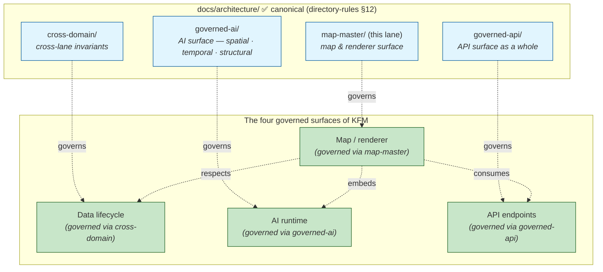

<!-- [KFM_META_BLOCK_V2]
doc_id: kfm://doc/architecture-map-master-readme
title: Map Master — Renderer Architecture
type: standard
version: v0.1
status: draft
owners: <ARCHITECTURE-DOCTRINE-OWNER> · <MAP-SURFACE-STEWARD> · NEEDS VERIFICATION
created: 2026-05-24
updated: 2026-05-24
policy_label: public
related:
  - directory-rules.md#7
  - directory-rules.md#12
  - Master_MapLibre_Components-Functions-Features_v2_1_FULL.md
  - Master_MapLibre_Components-Functions-Features_v2_1_FULL.md#10
  - Kansas_Frontier_Matrix_-_Domains_v1_1___Pass_23_32_Consolidated_Atlas.md#19
  - Kansas_Frontier_Matrix_-_Domains_v1_1___Pass_23_32_Consolidated_Atlas.md#2492
  - ai-build-operating-contract.md#22
  - kfm_unified_doctrine_synthesis.md#11
  - connected-dots-architecture-brief.md#8
  - docs/architecture/governed-api/README.md
  - docs/architecture/governed-ai/ROUTE_MAP.md
  - docs/architecture/cross-domain/README.md
tags: [kfm, architecture, map-master, maplibre, cesium, renderer, tile-artifacts, trust-membrane]
notes:
  - PROPOSED. Fourth folder pattern under docs/architecture/; same OPEN-DR-12 META family as cross-domain/, governed-ai/, governed-api/.
  - Canonical doctrinal anchor is the "Master MapLibre Components-Functions-Features" body of work (v1.4 → v2.0+ accumulating; CONFIRMED through v2.1).
  - "Renderer is downstream of trust" posture preserved verbatim from Master MapLibre executive determinations across versions.
  - No mounted repo evidence in this session; all repo-shaped claims labeled PROPOSED.
[/KFM_META_BLOCK_V2] -->

<a id="top"></a>

# Map Master — Renderer Architecture

> *Architecture lane for the KFM map and renderer surface — MapLibre as a disciplined 2D renderer, Cesium for 3D, PMTiles/MVT/COG as released artifact carriers, the Evidence Drawer as the click-to-truth resolution point. The renderer is downstream of trust; tiles, popups, screenshots, scenes, and AI answers are downstream carriers, never sovereign truth.*


-blue)


**Status:** draft · **Owners:** `<ARCHITECTURE-DOCTRINE-OWNER>` · `<MAP-SURFACE-STEWARD>` *(NEEDS VERIFICATION)* · **Last updated:** 2026-05-24

> [!IMPORTANT]
> **Core determination — verbatim from doctrine.** *"MapLibre remains a downstream renderer and interaction runtime. Tiles, PMTiles, MVT, MLT, COGs, style JSON, sprites, glyphs, popups, screenshots, Story Nodes, 3D scenes, graph projections, catalog records, and AI answers remain downstream carriers, not sovereign truth."* *(`Master_MapLibre_Components-Functions-Features_v2.1_FULL.md`, **CONFIRMED** across executive determinations from v1.4 onward.)*

> [!CAUTION]
> **Path placement diverges from Directory Rules v1.2 §12 — same OPEN-DR-12 family.** This is the **fourth** folder pattern under `docs/architecture/` *(after `cross-domain/`, `governed-ai/`, `governed-api/`)*. The systemic divergence is consolidated in **OPEN-DR-12 (PROPOSED META amendment)** — see [`docs/architecture/governed-api/README.md` §2.2](../governed-api/README.md). Resolution lands once; this folder is one more application of the same pattern.

> [!NOTE]
> **What this README is and is not.** It is the **architectural landing** for the map / renderer lane — orientation, scope, sibling map. It is **not** the canonical authority for any one map-surface concept *(that is the Master MapLibre document)*; **not** the route inventory *(that is [`ROUTE_MAP.md`](../governed-ai/ROUTE_MAP.md))*; **not** schemas, policies, or app code. It points to them and consolidates the architecture view.

---

## Table of contents

1. [Scope](#1-scope)
2. [Repo fit — OPEN-DR-12 family](#2-repo-fit--open-dr-12-family)
3. [The canonical posture — renderer is downstream of trust](#3-the-canonical-posture--renderer-is-downstream-of-trust)
4. [The seven negative authorities](#4-the-seven-negative-authorities)
5. [Relationship to other architecture lanes](#5-relationship-to-other-architecture-lanes)
6. [The click-to-truth flow](#6-the-click-to-truth-flow)
7. [Map object families](#7-map-object-families)
8. [2D default · 3D conditional · tile artifact discipline](#8-2d-default--3d-conditional--tile-artifact-discipline)
9. [Viewer-side verification fails closed · UI negative states](#9-viewer-side-verification-fails-closed--ui-negative-states)
10. [Reality Boundary Note — synthetic vs observed](#10-reality-boundary-note--synthetic-vs-observed)
11. [What lives here · What does not live here](#11-what-lives-here--what-does-not-live-here)
12. [Directory tree (PROPOSED)](#12-directory-tree-proposed)
13. [Anti-patterns](#13-anti-patterns)
14. [Open questions and ADR triggers](#14-open-questions-and-adr-triggers)
15. [Related docs](#15-related-docs)
16. [Appendix — glossary and reference](#16-appendix--glossary-and-reference)

---

## 1. Scope

This lane covers the **map and renderer surface as an architectural concern** — every aspect of how KFM presents released, governed evidence on a 2D map *(MapLibre)*, a 3D scene *(Cesium / 3D Tiles)*, or a hybrid surface. The lane covers:

- **Renderer discipline** — what MapLibre/Cesium are and are not allowed to do.
- **Tile and artifact lifecycle** — PMTiles, MVT, COG, MBTiles, Zarr; release manifests, sidecars, BAO proofs, signatures.
- **The Evidence Drawer** — the canonical click-to-truth resolution point on the map.
- **2D ↔ 3D parity** — when 3D is admissible and how it stays consistent with 2D.
- **UI negative states** — `MISSING_EVIDENCE`, `SOURCE_STALE`, `DENIED_BY_POLICY`, etc.
- **Performance budgets** — runtime probes, mobile-first tile playbook, decode/heap budgets.

> [!TIP]
> **When to read this lane.** Read it when your change touches the map shell, tile pipeline, style discipline, 2D/3D parity, viewer-side verification, or Evidence Drawer rendering. Per-route work *(governed-API contract for a tile endpoint, AI surface behavior, cross-lane invariants)* lives in the other architecture lanes.

[↑ Back to top](#top)

---

## 2. Repo fit — OPEN-DR-12 family

### 2.1 Four folder patterns under `docs/architecture/`

| # | Folder | Introduced | Status |
|---|---|---|---|
| 1 | `docs/architecture/cross-domain/` | Earlier session *(README)* | OPEN-DR-10 *(rolled into OPEN-DR-12)* |
| 2 | `docs/architecture/governed-ai/` | Earlier session *(3 siblings — BOUNDARIES, CONTINUITY_NOTES, ROUTE_MAP)* | OPEN-DR-11 *(rolled into OPEN-DR-12; 3-sibling threshold reached)* |
| 3 | `docs/architecture/governed-api/` | Earlier session *(README + 6 PROPOSED siblings)* | OPEN-DR-12 *(META amendment proposed)* |
| 4 | `docs/architecture/map-master/` *(this lane)* | This turn *(README + PROPOSED siblings)* | OPEN-DR-12 family |

Four folders, one systemic question. **OPEN-DR-12 (PROPOSED META amendment)** consolidates all four; filing per-folder OPEN-DRs is no longer productive.

### 2.2 What this README assumes

Pending OPEN-DR-12, this README **assumes the folder pattern will be accepted** *(because the systemic pattern argues for it, and this lane warrants multiple siblings — see §12)* but labels every sibling path PROPOSED so flattening remains reversible.

> [!IMPORTANT]
> **The case for the `map-master/` folder is straightforward.** The Master MapLibre document is itself a multi-hundred-page body of doctrine accumulated across versions *(v1.4 → v1.5 → v1.6 → v1.8 → v1.9 → v2.0 → v2.1+)*. The lane has a clearly enumerable set of sub-concerns *(renderer boundary, tile artifacts, layer lifecycle, Evidence Drawer, 2D/3D parity, performance budgets, viewer verification)*. This satisfies **two of three** OPEN-DR-12 criteria for folder admission. See §12.

[↑ Back to top](#top)

---

## 3. The canonical posture — renderer is downstream of trust

> **Evidence basis:** `Master_MapLibre_Components-Functions-Features_v2.1_FULL.md` *(executive determinations preserved verbatim across v1.4–v2.0+)*; `Kansas_Frontier_Matrix_-_Domains_v1_1___Pass_23_32_Consolidated_Atlas.md` §19 *(Cross-Domain Systems)*; `ai-build-operating-contract.md` §22 *(map, UI, renderer contract)*; idea card `KFM-P1-FEAT-0039` *(MapLibre as downstream renderer)*. **CONFIRMED doctrine throughout.**

The KFM map shell exists **inside** the trust membrane, never astride it.

| Direction | What flows | Authority |
|---|---|---|
| **Trust → renderer** | Released layers, tile artifacts, evidence bundles, evidence drawer payloads, Focus Mode envelopes — all **governed**, all **post-promotion**. | The governed API *(`apps/governed-api/`)* and `ReleaseManifest`. |
| **Renderer → trust** | User clicks, viewport state, time selections, feature IDs — bounded `MapContextEnvelope`. Receipts emitted by every consequential interaction. | The renderer carries no authority of its own; it carries context. |

> [!IMPORTANT]
> **The posture is unidirectional.** Public surfaces use **governed APIs, released artifacts, catalog records, tile services, `EvidenceBundle` resolution, and release manifests** *(`Master_MapLibre_Components-Functions-Features_v2.1_FULL.md` verbatim)*. The renderer does not author truth, does not register sources, does not run policy, does not validate citations, does not approve reviews, does not publish releases, does not generate AI answers.

[↑ Back to top](#top)

---

## 4. The seven negative authorities

> **Evidence basis:** `Master_MapLibre_Components-Functions-Features_v2.1_FULL.md` *(executive determinations — verbatim seven-item list preserved across every version from v1.4 onward)*; `KFM-P1-FEAT-0039`. **CONFIRMED enumeration** *(not a synthesis; the list is doctrinal verbatim)*.

The Master MapLibre document explicitly enumerates **seven authorities** the renderer is **not**. The list appears verbatim, in this order, across every executive determination:

| # | Authority the renderer is NOT | What does carry that authority | If the renderer tried to | The DENY surface |
|---|---|---|---|---|
| 1 | **Canonical truth store** | `EvidenceBundle` + `ReleaseManifest` | Read from canonical/internal stores directly to render. | `apps/governed-api/`; layer manifest resolver. |
| 2 | **Source registry** | `SourceDescriptor` registry | Treat tile metadata as source provenance. | Source admission gate. |
| 3 | **Policy engine** | OPA/Rego policy under `policy/` | Apply visibility rules client-side as a substitute for `PolicyDecision`. | Policy precheck/postcheck. |
| 4 | **Citation authority** | `CitationValidationReport` | Treat a popup or feature label as a citation. | Focus Mode citation validator. |
| 5 | **Review authority** | Steward review via `apps/review-console/` | Mark a layer as "reviewed" through a UI toggle. | Review queue surface. |
| 6 | **Publication authority** | `ReleaseManifest` + release authority | Toggle visibility = release the layer. | Release queue; release authority. |
| 7 | **AI authority** | Focus Mode runtime *(governed)* | Render generated text as authoritative answer. | Focus Mode; AI surface steward. |

> [!CAUTION]
> **The seven are not negotiable.** A change that would let the renderer assume any of these roles is a contract-level violation and ADR-class *(per `directory-rules.md` §2.4)*. The seven are also the **anti-pattern register for this lane** — see §13.

[↑ Back to top](#top)

---

## 5. Relationship to other architecture lanes



| Lane | Owns | Relationship to `map-master/` |
|---|---|---|
| `docs/architecture/cross-domain/` | Cross-lane invariants *(source role, ownership, sensitivity, EvidenceBundle support)* | The map MUST preserve all four invariants at every render. The renderer is a consumer of cross-lane discipline, not its author. |
| `docs/architecture/governed-ai/` | AI surface — boundaries, continuity, route map for AI | Focus Mode is rendered **on the map**; the map embeds the AI surface but does not own it. AI-specific concerns live in `governed-ai/`; map-specific concerns *(how Focus Mode integrates with the Evidence Drawer, tile click flow, etc.)* live here. |
| `docs/architecture/governed-api/` | API surface as a whole — membrane, envelopes, audience classes, threat model | The map shell **consumes** the governed API; never bypasses it. `apps/explorer-web/` reads via `apps/governed-api/` only *(directory-rules §7.1)*. |
| **`docs/architecture/map-master/`** *(this lane)* | The map shell, renderer discipline, tile artifacts, Evidence Drawer, 2D/3D parity, viewer-side verification. | This lane. |

> [!NOTE]
> **The four lanes together cover the four governed surfaces of KFM** — data lifecycle, AI runtime, API endpoints, map/renderer. A reviewer auditing the trust path end-to-end consults all four.

[↑ Back to top](#top)

---

## 6. The click-to-truth flow

> **Evidence basis:** `Master_MapLibre_Components-Functions-Features_v2.1_FULL.md` §10 *(Governance and Trust-Membrane Chapter)*; `ai-build-operating-contract.md` §22.1 *(click-to-truth path)*; `connected-dots-architecture-brief.md` §8.1. **CONFIRMED doctrine** *(flow preserved verbatim across carriers)*.

```mermaid
flowchart LR
  L["released layer<br/>(via Layer manifest resolver)"] --> CLK["user click<br/>or time selection"]
  CLK --> ENV["MapContextEnvelope assembled<br/>(camera · layers · features · time · evidence refs)"]
  ENV --> API["governed-api/<br/>(trust membrane)"]
  API --> EB["EvidenceBundle resolution<br/>(via Evidence resolver)"]
  EB --> DRW["EvidenceDrawerPayload<br/>(sensitivity-redacted projection)"]
  DRW --> FM{"Focus Mode<br/>requested?"}
  FM -->|no| DONE["display drawer"]
  FM -->|yes| FMR["FocusModeResponse:<br/>ANSWER · ABSTAIN · DENY · ERROR"]
  FMR --> RCPT["AIReceipt + RunReceipt"]
  RCPT -.->|"if correction needed"| ROLL["correction /<br/>rollback lineage"]
  classDef map fill:#c8e6c9,stroke:#1b5e20;
  classDef gov fill:#e1f5fe,stroke:#01579b;
  class L,CLK,ENV,DONE map;
  class API,EB,DRW,FMR,RCPT gov;
```



> [!IMPORTANT]
> **No step is skippable.** A "click → answer" interaction is **never one route call** — it composes layer resolution + envelope admission + evidence resolution + drawer projection + optional Focus Mode + receipt emission. Per `ai-build-operating-contract.md` §22.1: *"If any step relies only on rendered feature properties, popup text, or model output, the trust membrane has been bypassed."*

[↑ Back to top](#top)

---

## 7. Map object families

> **Evidence basis:** `Master_MapLibre_Components-Functions-Features_v2.1_FULL.md` §9 *(component table)*; idea cards `KFM-P1-FEAT-0040` *(layer metadata)*, `KFM-P1-FEAT-0042` *(viewer-side verification fails closed)*. **CONFIRMED doctrine for the object families; PROPOSED for schema homes pending mounted-repo verification.**

The map surface has its own object vocabulary. All schema homes below are PROPOSED — verify at next mounted-repo session.

| Object | Role | Schema home *(PROPOSED)* |
|---|---|---|
| **`SourceDescriptor`** | Defines admissible source identity and role *(used across all lanes; consumed by the map for source-of-source resolution)*. | `schemas/contracts/v1/sources/source_descriptor.schema.json` |
| **`LayerManifest`** | Binds a UI layer to governed source/evidence semantics. Carries `layer_id`, `title`, `geometry_type`, `source_id`, `source_layer`, `evidence_ref_field`, `temporal_fields`, `policy_label`, `release_state`. | `schemas/contracts/v1/map/layer_manifest.schema.json` |
| **`StyleManifest`** | Controls style identity and dependencies. Carries `style_id`, `version`, `style_json_url`, `sprites`, `glyphs`, `style_digest`, `layer_ids`, `release_id`. | `schemas/contracts/v1/map/style_manifest.schema.json` |
| **`TileArtifactManifest`** | Controls PMTiles/MVT/COG/MBTiles release artifacts. Carries `artifact_id`, `type`, `url`, `digest`, `zooms`, `bounds`, `format`, `source_layers`, `metadata`, `range_required`, `cors_required`. | `schemas/contracts/v1/map/tile_artifact_manifest.schema.json` |
| **`MapReleaseManifest`** | Defines a complete published map release. Links `LayerManifest`, `StyleManifest`, tile artifacts, `EvidenceBundle`, `PolicyDecision`, `PromotionDecision`, cache keys, rollback target. | `schemas/contracts/v1/map/map_release_manifest.schema.json` |
| **`EvidenceBundle`** | Truth-bearing evidence object that outranks generated language and rendered state. | `schemas/contracts/v1/evidence/evidence_bundle.schema.json` |
| **`EvidenceDrawerPayload`** | UI-side projection shown after click / selection. Includes feature context, source/citation display, caveats, conflicts. | `schemas/contracts/v1/ui/evidence_drawer_payload.schema.json` |
| **`MapContextEnvelope`** | Bounded map context sent to governed API / Focus Mode. | `schemas/contracts/v1/ui/map_context_envelope.schema.json` |
| **PMTiles sidecar** *(`.pmtiles.attest.json`)* | Per-artifact integrity proof — `spec_hash`, `pmtiles_filename`, `root_hash` *(BLAKE3)*, `size_bytes`, `delta`, `byte_ranges_manifest`, signature/attestation. | Co-located with the tile artifact; schema PROPOSED. |
| **`VerifyReceipt`** | Records digest, bounds, schema verification *(per SRC-058)*. | `schemas/contracts/v1/proofs/verify_receipt.schema.json` *(PROPOSED)* |
| **`RuntimeProbeResult`** | Reviewable report from runtime probes *(decode, heap, token stability)*; emitted into promotion gates; does not decide truth. | `schemas/contracts/v1/proofs/runtime_probe_result.schema.json` *(PROPOSED)* |

[↑ Back to top](#top)

---

## 8. 2D default · 3D conditional · tile artifact discipline

> **Evidence basis:** `KFM-P2-FEAT-0012` *(Cesium 3D Tiles + MapLibre overlay sync)*, `KFM-P2-FEAT-0013` *(mobile-first tile playbook)*, `KFM-P1-FEAT-0042` *(viewer-side verification fails closed)*; SRC-058 *(PMTiles BAO sidecars, runtime probes, ReleaseRuntimeGate)*; SRC-066 *(PMTiles operational governance)*. **CONFIRMED doctrine throughout.**

### 8.1 2D default; 3D conditional

| Surface | When it wins | When it fails | Trust consequence |
|---|---|---|---|
| **2D MapLibre** *(default)* | Inspection, accessibility, low-bandwidth, sensitive-context parity with Evidence Drawer. | — | Canonical inspection path. |
| **3D Cesium / 3D Tiles** *(conditional)* | Terrain context, viewshed, line-of-sight evidence, Story Node scenes. | Trust controls are weaker; scene authoring is labor-intensive; 3D admission gate may DENY. | 2D MapLibre remains canonical; 3D adds value but never substitutes for the 2D evidence path. **Switching between 2D and 3D preserves active layer set, filter set, and Focus Mode** *(per `KFM-P2-FEAT-0012`)*. |

> [!CAUTION]
> **3D admission gate is real.** Per Atlas Ch. 18 / SRC-057, 3D scenes require `Scene Manifest`, `Reality Boundary Note`, and 3D admission closure before publication. **PROPOSED implementation; CONFIRMED doctrine.**

### 8.2 Tile artifact discipline

KFM tile artifacts *(PMTiles, MVT, MLT, COG, MBTiles, Zarr)* are **derived release artifacts**, never sovereign data. Every public tile artifact carries:

1. **A signed `TileArtifactManifest`** linking to `MapReleaseManifest`.
2. **A sidecar** *(e.g., `.pmtiles.attest.json`)* with `spec_hash`, `root_hash` *(BLAKE3)*, `byte_ranges_manifest`, optional `bao_proof_ref`.
3. **A DSSE/cosign signature** transparency-logged in Rekor.
4. **A `VerifyReceipt`** recording digest, bounds, and schema verification.
5. **A rollback target** *(prior release manifest + cache invalidation record)*.

> [!IMPORTANT]
> **The publication flow is fixed** *(per SRC-058 p.49)*: *"Delta PMTiles built → BAO root → manifest → cosign signature → range verify → all gates → publish candidate → RunReceipt → released."* **No step is skippable.**

### 8.3 PMTiles publication gates *(CONFIRMED — SRC-058 pp.48–49)*

The PMTiles publication gates DENY on:

- `invalid_spec_hash`
- `unsigned_release_manifest`
- `unverified_tile_chunk`
- `public_unsigned_delta`
- `rollback_root_mismatch`
- `missing_run_receipt`

[↑ Back to top](#top)

---

## 9. Viewer-side verification fails closed · UI negative states

> **Evidence basis:** `KFM-P1-FEAT-0042` *(viewer-side verification fails closed)*; SRC-058 pp.190–214 *(MapLibre verify-before-addSource)*; `ai-build-operating-contract.md` §22.2 *(UI negative states)*. **CONFIRMED doctrine.**

### 9.1 Viewer-side fails-closed flow

```text
MapLibre app init
  → fetch sidecar
  → verify DSSE/cosign signature
  → check spec_hash / tiling_scheme / tile_format
  → sample byte ranges
  → IF all pass → addSource
  → IF any fail → DENY (post status = chunk_verification_failed; no tile exposed)
```

> [!CAUTION]
> **The renderer fails CLOSED.** Per `KFM-P1-FEAT-0042` *(PROPOSED, EXPANDED across passes)*: *"A viewer should fail closed or degrade visibly when artifact signatures, sidecars, hashes, policy state, or release manifests cannot be verified."* A renderer that silently falls back to unverified content has bypassed the trust membrane.

### 9.2 UI negative states *(CONFIRMED — AIBOC §22.2)*

The UI surfaces **nine negative states as first-class**, not as error toasts or missing content:

| State | Meaning |
|---|---|
| `MISSING_EVIDENCE` | `EvidenceRef` did not resolve. |
| `SOURCE_STALE` | `SourceDescriptor.cadence` passed without re-admission. |
| `DENIED_BY_POLICY` | `PolicyDecision = DENY`. |
| `GENERALIZED_GEOMETRY` | Sensitivity-redacted projection applied. |
| `RESTRICTED_ACCESS` | Audience class does not match required tier. |
| `CONFLICTED_SUPPORT` | Multiple `EvidenceRef`s with material disagreement. |
| `CITATION_FAILED` | `CitationValidationReport.verdict = FAIL`. |
| `RELEASE_WITHDRAWN` | `ReleaseManifest` superseded; rollback target active. |
| `RUNTIME_ERROR` | Governed API cannot evaluate. |

[↑ Back to top](#top)

---

## 10. Reality Boundary Note — synthetic vs observed

> **Evidence basis:** `Kansas_Frontier_Matrix_-_Domains_v1_1___Pass_23_32_Consolidated_Atlas.md` §24.1.1 *(source-role table — "Synthetic" row)*; §24.9.2 *(anti-pattern: "Synthetic surface presented without Reality Boundary Note → Reconstruction read as observation")*. **CONFIRMED doctrine.**

When the map presents synthetic / reconstructed / AI-generated content *(reconstructed historical scenes, AI-summary outputs, smoothed/interpolated rasters, 3D scene meshes derived from sparse evidence)*, the surface MUST carry a **`Reality Boundary Note`** plus a **`Representation Receipt`** recording the transform.

| Content class | Marker required | DENY if missing |
|---|---|---|
| Synthetic terrain surface | `Reality Boundary Note` + `Representation Receipt` | ✅ |
| Reconstructed historical scene | `Reality Boundary Note` + `Representation Receipt` | ✅ |
| AI-summary output rendered as map annotation | `Reality Boundary Note` + `AIReceipt` cross-reference | ✅ |
| Modeled raster *(suitability, smoke trajectory, etc.)* labeled and presented as observed | — *(deny entirely — source-role anti-collapse, see [`cross-domain/README.md` §6.2](../cross-domain/README.md))* | ✅ |

> [!IMPORTANT]
> **The renderer is the last line of defense.** A synthetic raster could pass through ingestion, validation, and release if the `Reality Boundary Note` is malformed but present. The renderer MUST verify the note exists *and* renders, and MUST refuse to display the surface as observed reality without it.

[↑ Back to top](#top)

---

## 11. What lives here · What does not live here

### 11.1 What lives here

| Content | Why it belongs in `docs/architecture/map-master/` |
|---|---|
| Renderer-discipline doctrine *(MapLibre and Cesium are downstream)* | This is the canonical scope of the Master MapLibre document; the lane consolidates its architectural posture. |
| Tile artifact lifecycle architecture *(PMTiles, MVT, COG, MBTiles, Zarr — release, sidecars, BAO proofs, signatures)* | Cross-format discipline applies to all tile types; per-format specifics live in the contracts/schemas, but the cross-format posture lives here. |
| Layer / Style / TileArtifact / MapRelease manifest **architectural** concerns | The schemas live under `schemas/contracts/v1/map/`; the discipline that connects them lives here. |
| Evidence Drawer architecture *(click-to-truth flow, negative-state surfacing)* | The drawer composes API outputs into a UI surface; the composition rules live here. |
| 2D ↔ 3D parity discipline | Cross-renderer concern that no single renderer owns. |
| Reality Boundary Note enforcement at the renderer | The renderer is the last gate before display; the rule belongs here as well as in cross-domain doctrine. |
| Performance budgets, runtime probes, mobile-first playbook | Cross-cutting performance discipline; per-format implementations live with each format's manifest. |
| Anti-pattern register scoped to map / renderer concerns | E.g., map shell consuming canonical store, popup-as-citation, style-only sensitivity hiding. |

### 11.2 What does NOT live here

| Excluded | Canonical home |
|---|---|
| The Master MapLibre document itself *(the cumulative doctrine)* | `Master_MapLibre_Components-Functions-Features_v2.1_FULL.md` *(at project knowledge root or `docs/lineage/`)* |
| Per-layer / per-style / per-tile schema files *(`.schema.json`)* | `schemas/contracts/v1/map/...` |
| Style JSON, sprites, glyphs | `data/published/styles/...` *(per directory-rules.md)*; or `apps/explorer-web/src/styles/` for app-local |
| Tile artifacts *(PMTiles, MVT, COG)* themselves | `data/published/tiles/<area>/...` *(per lifecycle invariant)* |
| Rego policy enforcing renderer-side gates | `policy/map/...` *(or `policy/governed_ai/`)* |
| App-level code *(`apps/explorer-web/`, MapLibre integration)* | `apps/explorer-web/src/...` |
| Per-area Focus Mode UI | `apps/explorer-web/src/focus-modes/<area>/...` *(per directory-rules §6.7)* |
| Domain-specific layer designs | `docs/domains/<domain>/` |
| AI surface boundaries / continuity / route map | `docs/architecture/governed-ai/{BOUNDARIES,CONTINUITY_NOTES,ROUTE_MAP}.md` |

> [!WARNING]
> **Do not let this lane absorb implementation.** Same rule as every other architecture lane: schemas, policies, validators, and app code live under their canonical responsibility roots, **never** inside `docs/architecture/`.

[↑ Back to top](#top)

---

## 12. Directory tree (PROPOSED)

**PROPOSED — assumes OPEN-DR-12 resolves to "permit folder pattern".** If OPEN-DR-12 is rejected, all siblings below flatten to `docs/architecture/map-master-<topic>.md` or merge into a single `docs/architecture/map-master.md`.

```text
docs/architecture/map-master/          ⚠ PROPOSED · OPEN-DR-12 family
├── README.md                          ◄── this file (landing + navigation)
├── RENDERER_BOUNDARY.md               ◄── seven negative authorities expanded; renderer-as-downstream contract (PROPOSED; expands §4)
├── TILE_ARTIFACTS.md                  ◄── PMTiles / MVT / COG / MBTiles / Zarr; sidecars; BAO; signatures; publication gates (PROPOSED; expands §8)
├── LAYER_LIFECYCLE.md                 ◄── LayerManifest · StyleManifest · TileArtifactManifest · MapReleaseManifest composition (PROPOSED; expands §7)
├── EVIDENCE_DRAWER.md                 ◄── click-to-truth flow; drawer composition; conflict/caveat surfaces (PROPOSED; expands §6, §9)
├── 2D_3D_PARITY.md                    ◄── Cesium overlay sync; Reality Boundary Note discipline; 3D admission gate (PROPOSED; expands §8.1, §10)
├── PERFORMANCE_BUDGETS.md             ◄── runtime probes; decode/heap budgets; mobile-first tile playbook (PROPOSED)
└── VIEWER_VERIFICATION.md             ◄── verify-before-addSource; fails-closed semantics; chunk verification (PROPOSED; expands §9.1)
```

> [!NOTE]
> **Seven PROPOSED siblings expand seven distinct sub-concerns.** The pattern matches `governed-ai/` *(three siblings on three axes)* and the proposed `governed-api/` siblings *(six sub-concerns)*. Each sibling owns its sub-topic; the README orients.

[↑ Back to top](#top)

---

## 13. Anti-patterns

> **Evidence basis:** `Kansas_Frontier_Matrix_-_Domains_v1_1___Pass_23_32_Consolidated_Atlas.md` §24.9.2 *(trust-membrane anti-patterns)*; `ai-build-operating-contract.md` §22.3 *(denied map behaviors)*; `Master_MapLibre_Components-Functions-Features_v2.1_FULL.md` §10 *(governance and trust-membrane chapter)*. **CONFIRMED doctrine.**

Each row maps a violation back to one of the seven negative authorities of §4.

| Anti-pattern | Negative authority violated | Counter-rule |
|---|---|---|
| **Map shell consumes canonical / internal store directly.** | #1 truth store | Public clients read via `apps/governed-api/` only; never directly from `data/raw\|work\|quarantine` or canonical stores. |
| **Tile metadata treated as source provenance** *(skipping `SourceDescriptor`)*. | #2 source registry | Source provenance lives in the source registry; the tile carries `source_id` references, not source identity. |
| **Style filter used to "hide" sensitive geometry.** | #3 policy engine | Generalization / redaction happens **before** public tile release with a `RedactionReceipt`; style-only hiding is a leak waiting to happen. |
| **Popup text treated as a citation.** | #4 citation authority | Popups are non-authoritative; the Evidence Drawer carries the `EvidenceBundle` with validated citations. |
| **UI toggle marks a layer as "reviewed".** | #5 review authority | Review state lives in `ReviewRecord`; UI displays the state but does not author it. |
| **Layer visibility toggle = layer publication.** | #6 publication authority | Publication requires `ReleaseManifest` + rollback target + promotion gate; visibility is post-publication only. |
| **Generated AI text rendered as authoritative answer.** | #7 AI authority | Focus Mode answers are bounded by envelope and citation validation; the renderer displays the envelope, not the raw model output. |
| **Public RAW tile path** *(loading unreleased tiles directly)*. | #1, #6 | Tile load only when `release_state`, policy, rights, sensitivity, evidence refs, hashes, and rollback are all valid *(Master MapLibre §10)*. |
| **Direct browser → model traffic.** | #7 | Model adapters live behind the governed membrane *(`BOUNDARIES.md` §10)*. |
| **Renderer falls back silently on signature verification failure.** | #1 | Fail closed; DENY on `chunk_verification_failed` *(`KFM-P1-FEAT-0042`)*. |
| **3D scene presented as observed reality without `Reality Boundary Note`.** | #1 | Admission gate requires `Reality Boundary Note` + `Representation Receipt` *(Atlas §24.9.2)*. |
| **Synthetic AI-summary annotation overlaid as map feature** *(no marker)*. | #7, #1 | `Reality Boundary Note` + `AIReceipt` cross-reference; visible badge. |
| **Mutating published tile artifacts in place.** | #6 | Tile artifacts are immutable by release ID; new release = new manifest + new digest. |
| **No range-verification before tile add.** | #1 | `MapLibre verify-before-addSource` is doctrinal *(SRC-058 pp.190–194, 208–211)*. |

[↑ Back to top](#top)

---

## 14. Open questions and ADR triggers

| Open item | Class | Suggested ADR title *(PROPOSED)* |
|---|---|---|
| **OPEN-DR-12** *(carried)* — META amendment to `directory-rules.md` §12 permitting folder-with-README pattern; covers `cross-domain/`, `governed-ai/`, `governed-api/`, `map-master/`. | Directory Rules §12 *(structural)* | "docs/architecture/ — folder-with-README pattern admission". |
| Which Cesium edition is sanctioned for KFM — CesiumJS open-source vs Cesium Ion? Corpus is silent. | Tool selection | "Cesium edition selection for 3D scenes". |
| Which MapLibre GL JS target version *(and plugin allowlist)* is approved? | Tool selection | "MapLibre GL JS version pinning and plugin allowlist". |
| MLT *(MapLibre Tiles)* implementation status and rollout plan. | Tool selection / format | "MLT format admission". |
| Server-side raster fallback policy *(when MapLibre vector runtime gates fail, when to fall back to Cesium-rasterized)*. | Renderer selection | "Vector vs server-rasterized fallback policy". |
| Tile-host conventions *(CDN, signed URLs, Range header requirements, CORS configuration)*. | Operations | "Tile artifact hosting conventions". |
| 3D admission gate composition — what objects compose a `Scene Manifest` and which reviewers approve. | Object family / governance | "3D Scene Manifest composition and admission". |
| `freestiler` / `tipmtiles` / `tippecanoe` tooling readiness; build pipeline placement. | Tooling | "Tile build toolchain selection". |
| Renderer-side telemetry — what is sent, with what consent, and where it lands. | Privacy / operations | "Renderer telemetry contract". |
| Style asset homes — `data/published/styles/` vs `apps/explorer-web/src/styles/`. | Schema home | "Style asset placement". |

> [!IMPORTANT]
> **OPEN-DR-12 is the unblocker** for the four architecture folders. Other map-specific OPEN questions can proceed in parallel ADR streams once the structural pattern is settled.

[↑ Back to top](#top)

---

## 15. Related docs

| Reference | Role | Truth label |
|---|---|---|
| `Master_MapLibre_Components-Functions-Features_v2.1_FULL.md` *(cumulative doctrine, v1.4 → v2.0+)* | **Canonical** map-surface doctrine; this lane consolidates its architectural posture | CONFIRMED doctrine |
| `Master_MapLibre_Components-Functions-Features_v2.1_FULL.md` §9 *(component table)* | Object families and schema homes | CONFIRMED doctrine |
| `Master_MapLibre_Components-Functions-Features_v2.1_FULL.md` §10 *(Governance and Trust-Membrane Chapter)* | Trust-membrane rules for the map surface | CONFIRMED doctrine |
| `Kansas_Frontier_Matrix_-_Domains_v1_1___Pass_23_32_Consolidated_Atlas.md` §19 *(Cross-Domain Systems — MapLibre UI + Evidence Drawer + Focus Mode)* | Renderer guardrails | CONFIRMED doctrine |
| `Kansas_Frontier_Matrix_-_Domains_v1_1___Pass_23_32_Consolidated_Atlas.md` §24.9.2 *(trust-membrane anti-patterns)* | Anti-pattern register | CONFIRMED doctrine |
| `ai-build-operating-contract.md` §22 *(map, UI, renderer contract; §22.1 click-to-truth; §22.2 negative states; §22.3 denied map behaviors)* | Builder-side rules for map / UI / renderer | CONFIRMED doctrine |
| `kfm_unified_doctrine_synthesis.md` §11 *(finite outcome envelope)* | Outcome semantics that the drawer and Focus Mode honor | CONFIRMED doctrine |
| `connected-dots-architecture-brief.md` §8 *(MapLibre, Evidence Drawer, and Focus Mode)* | Runtime flow + surface table | CONFIRMED doctrine |
| `directory-rules.md` §7.1 *(apps roles — `apps/explorer-web/` reads via `apps/governed-api/`)* | App-to-route mapping | CONFIRMED doctrine |
| `docs/architecture/governed-api/README.md` | API surface lane | PROPOSED placement; CONFIRMED doctrine |
| `docs/architecture/governed-ai/ROUTE_MAP.md` | Route inventory *(including Focus Mode runtime)* | PROPOSED placement; CONFIRMED doctrine |
| `docs/architecture/cross-domain/README.md` | Cross-lane invariants | PROPOSED placement; CONFIRMED doctrine |
| Atlas seed cards: `KFM-P1-FEAT-0038` *(Governed API as trust membrane)*, `KFM-P1-FEAT-0039` *(MapLibre as downstream renderer)*, `KFM-P1-FEAT-0040` *(layer metadata carries trust state)*, `KFM-P1-FEAT-0042` *(viewer-side verification fails closed)*, `KFM-P2-FEAT-0012` *(Cesium 3D Tiles + MapLibre sync)*, `KFM-P2-FEAT-0013` *(mobile-first tile playbook)* | Lineage for the doctrine in this README | PROPOSED *(seed cards)* |

[↑ Back to top](#top)

---

## 16. Appendix — glossary and reference

<details>
<summary><strong>16.1 Glossary of map-master vocabulary</strong></summary>

| Term | Definition *(CONFIRMED doctrine unless noted)* |
|---|---|
| **MapLibre** | Open-source 2D map renderer. In KFM: **disciplined 2D renderer and interaction runtime inside a governed shell** *(Master MapLibre, verbatim)*. Not a truth authority. |
| **Cesium / 3D Tiles** | 3D renderer for terrain and structured 3D content. In KFM: complementary surface; 2D MapLibre remains canonical. |
| **PMTiles** | Single-file tile archive format; KFM's primary released tile artifact carrier. |
| **MVT** | Mapbox Vector Tile format; embedded in PMTiles for vector layers. |
| **MLT** | MapLibre Tiles — newer tile format under evaluation *(version pinning pending; PROPOSED)*. |
| **COG** | Cloud Optimized GeoTIFF; primary raster release format. |
| **MBTiles** | SQLite-based tile format; secondary / legacy. |
| **Zarr** | Cloud-native array format; emerging in KFM for multidimensional data *(per SRC-064/SRC-066)*. |
| **Style JSON** | MapLibre style document; governed under `StyleManifest`. |
| **Evidence Drawer** | UI surface that displays `EvidenceBundle` for a feature click; canonical click-to-truth resolution. |
| **`Reality Boundary Note`** | Marker distinguishing synthetic / reconstructed / AI-generated content from observed reality. |
| **`Representation Receipt`** | Companion to `Reality Boundary Note`; records the transform that produced a synthetic surface. |
| **BAO** | Streaming hash tree algorithm used in PMTiles outboard proofs *(per SRC-058, SRC-066)*. |
| **Sidecar** | Companion file *(e.g., `.pmtiles.attest.json`)* carrying integrity proof metadata for a primary artifact. |
| **`spec_hash`** | Hash of the canonical spec string / tag fixing the format version. |
| **`root_hash`** | BLAKE3 hash of the full artifact / Bao root; integrity anchor. |
| **`byte_ranges_manifest`** | List of `z/x/y, start, end, range_hash, optional bao_proof_ref` for tile-range proofs. |
| **`RuntimeProbeResult`** | Reviewable report from runtime probes; emitted into promotion gates; does not decide truth. |
| **`VerifyReceipt`** | Records digest, bounds, and schema verification at viewer-side. |
| **Story Node** | Narrative/scene unit composed of layers + camera + time + evidence; subject to its own admission gate. |
| **3D admission gate** | Gate requiring `Scene Manifest`, `Reality Boundary Note`, and admission closure before 3D publication. |

</details>

<details>
<summary><strong>16.2 The seven negative authorities — quick reference card</strong></summary>

```text
The renderer is NOT:

  1. Canonical truth store          — EvidenceBundle is
  2. Source registry                 — SourceDescriptor registry is
  3. Policy engine                   — OPA/Rego policy is
  4. Citation authority              — CitationValidationReport is
  5. Review authority                — apps/review-console/ + ReviewRecord is
  6. Publication authority           — ReleaseManifest + release authority is
  7. AI authority                    — Focus Mode runtime (governed) is

If a renderer behavior would assume any of these roles, the change is ADR-class.
```

*(Verbatim enumeration preserved from Master MapLibre executive determinations across v1.4–v2.0+.)*

</details>

<details>
<summary><strong>16.3 PMTiles publication gates — quick reference</strong></summary>

```text
PMTiles publication DENIES on (CONFIRMED — SRC-058 pp.48–49):

  · invalid_spec_hash
  · unsigned_release_manifest
  · unverified_tile_chunk
  · public_unsigned_delta
  · rollback_root_mismatch
  · missing_run_receipt

Publication flow (verbatim — SRC-058 p.49):

  Delta PMTiles built
    → BAO root
    → manifest
    → cosign signature
    → range verify
    → all gates
    → publish candidate
    → RunReceipt
    → released

No step is skippable.
```

</details>

<details>
<summary><strong>16.4 UI negative states — quick reference</strong></summary>

```text
The UI MUST distinguish (CONFIRMED — AIBOC §22.2):

  · MISSING_EVIDENCE
  · SOURCE_STALE
  · DENIED_BY_POLICY
  · GENERALIZED_GEOMETRY
  · RESTRICTED_ACCESS
  · CONFLICTED_SUPPORT
  · CITATION_FAILED
  · RELEASE_WITHDRAWN
  · RUNTIME_ERROR

Negative states are first-class: surfaced explicitly, not as error toasts or
missing content. A RuntimeResponseEnvelope with outcome=ABSTAIN and a defined
reason code is a valid, finite, successful response.
```

</details>

<details>
<summary><strong>16.5 Truth-label legend</strong></summary>

- **CONFIRMED** — verified this session from attached docs, workspace evidence, tests, logs, or generated artifacts.
- **PROPOSED** — design, recommendation, file path, placement, or inference not yet verified in implementation.
- **INFERRED** — reasonably derivable from visible evidence but not directly stated.
- **NEEDS VERIFICATION** — checkable, but not yet checked strongly enough to act as fact.
- **UNKNOWN** — not resolvable without more evidence.
- **EXTERNAL** — sourced from authoritative external research *(not applied in this doc; no external research was triggered)*.

</details>

---

**Related (mini)** · [`Master_MapLibre_Components-Functions-Features_v2.1_FULL.md`](../../../Master_MapLibre_Components-Functions-Features_v2.1_FULL.md) · [`Kansas_Frontier_Matrix_-_Domains_v1_1___Pass_23_32_Consolidated_Atlas.md` §§19, 24.9.2](../../../Kansas_Frontier_Matrix_-_Domains_v1_1___Pass_23_32_Consolidated_Atlas.md) · [`ai-build-operating-contract.md` §22](../../../ai-build-operating-contract.md) · [`directory-rules.md` §7.1](../../../directory-rules.md) · [`docs/architecture/governed-api/README.md`](../governed-api/README.md) · [`docs/architecture/governed-ai/ROUTE_MAP.md`](../governed-ai/ROUTE_MAP.md) · [`docs/architecture/cross-domain/README.md`](../cross-domain/README.md)

**Last updated:** 2026-05-24 · **Doc version:** v0.1 · **Doc status:** draft · **Path status:** PROPOSED *(OPEN-DR-12 family)*

[↑ Back to top](#top)
