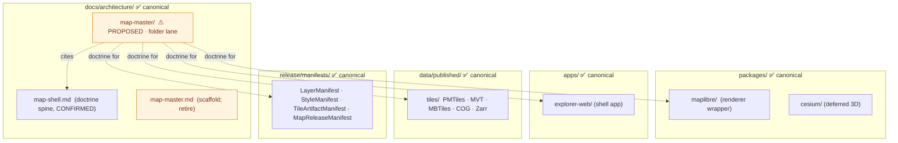
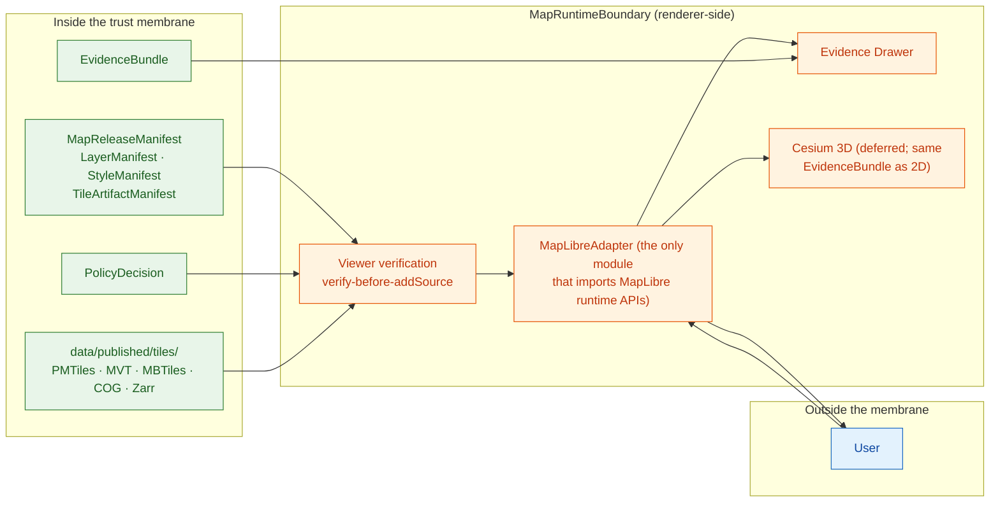

<!-- [KFM_META_BLOCK_V2]
doc_id: kfm://doc/architecture-map-master-readme
title: Map Master — Folder Landing
type: standard
version: v0.1
status: draft
owners: UI subsystem steward + Docs steward · NEEDS VERIFICATION
created: 2026-05-24
updated: 2026-05-24
policy_label: public
related:
  - ../map-shell.md
  - ../map-master.md
  - ../cross-domain/README.md
  - ../cross-domain/trust-membrane.md
  - ../governed-api/README.md
  - ../directory-rules.md#12
  - ../../doctrine/trust-membrane.md
tags: [kfm, architecture, map-master, map-shell, maplibre, doctrine]
notes:
  - PROPOSED. Folder placement is in the OPEN-DR-12 family (folder vs §12 flat-file pattern).
  - The actual doctrine spine is docs/architecture/map-shell.md; docs/architecture/map-master.md is currently a 16-line scaffold.
[/KFM_META_BLOCK_V2] -->

<a id="top"></a>

# Map Master — Folder Landing

> *Landing doc for the map-master folder. The spine is `docs/architecture/map-shell.md`; the siblings here expand specific cross-cutting concerns — renderer boundary, tile artifacts, layer lifecycle, evidence drawer, 2D/3D parity, performance budgets, and viewer verification.*


-blue)


**Status:** draft · **Owners:** UI subsystem steward + Docs steward *(NEEDS VERIFICATION)* · **Last updated:** 2026-05-24

> [!IMPORTANT]
> **The renderer is downstream of trust, never upstream of it** *(`map-shell.md` §2 Operating Law, CONFIRMED)*. MapLibre is not the canonical truth store, source registry, policy engine, citation authority, review authority, publication authority, or AI authority. The siblings here translate that operating law into specific, executable contracts.

> [!CAUTION]
> **Path placement is in the OPEN-DR-12 family.** §12 of `directory-rules.md` shows the convention as `docs/architecture/<topic>.md` *(flat files)*. The map lane introduces a `map-master/` **subfolder** alongside two flat files *(`map-master.md` scaffold, `map-shell.md` doctrine spine)*. Recorded as **OPEN-DR-12 MAP-MASTER (PROPOSED)** below.

> [!NOTE]
> **The actual doctrine spine is `map-shell.md`.** `map-master.md` is currently a 16-line scaffold *(2026-05-14)*; the substantive doctrine lives in `map-shell.md`. This folder's siblings cite `map-shell.md` sections directly *(TM-1..TM-8, §2 Operating Law, §11 Validation Requirements)*, not the scaffold.

---

## Table of contents

1. [Scope](#1-scope)
2. [Repo fit — Directory Rules basis](#2-repo-fit--directory-rules-basis)
3. [What lives here · What does not live here](#3-what-lives-here--what-does-not-live-here)
4. [Directory tree (PROPOSED)](#4-directory-tree-proposed)
5. [The map-master landscape](#5-the-mapmaster-landscape)
6. [Sibling docs at a glance](#6-sibling-docs-at-a-glance)
7. [Anti-patterns](#7-anti-patterns)
8. [Open questions and ADR triggers](#8-open-questions-and-adr-triggers)
9. [Related docs](#9-related-docs)
10. [Appendix](#10-appendix)

---

## 1. Scope

This folder gathers the cross-cutting concerns that `map-shell.md` references but does not exhaust: the negative-authority discipline at the renderer boundary, the tile-artifact catalog and integrity surface, the manifest composition that controls what may be rendered, the click-to-truth drawer flow, 2D/3D parity rules, mobile-first performance budgets, and the verify-before-`addSource` viewer-side discipline.

> [!TIP]
> **When to read this folder.** Reach for `map-shell.md` first for the doctrine spine; reach for the siblings when you are designing or reviewing a specific concern *(e.g., publishing a new tile artifact, wiring the drawer for a new domain, adding a 3D scene, profiling a tile budget)*.

[↑ Back to top](#top)

---

## 2. Repo fit — Directory Rules basis

### 2.1 Path divergence (must be resolved)

| Concern | Requested path | Canonical pattern *(`directory-rules.md` §12)* | Recommended resolution |
|---|---|---|---|
| Folder vs flat file | `docs/architecture/map-master/README.md` *(folder)* alongside `docs/architecture/map-master.md` *(scaffold)* and `docs/architecture/map-shell.md` *(spine)* | `docs/architecture/<topic>.md` *(flat file only)* | Decide via ADR whether map doctrine warrants a folder lane. Recommendation: keep the folder for siblings; absorb `map-master.md` scaffold into this README; keep `map-shell.md` as the canonical spine until/unless the folder absorbs it as well. **PROPOSED.** |
| Sub-file placement | `docs/architecture/map-master/<TOPIC>.md` | Same `<topic>.md` would live flat under the §12 pattern | If OPEN-DR-12 MAP-MASTER reverts to flat, all sub-files migrate one level up. |

> [!IMPORTANT]
> **OPEN-DR-12 MAP-MASTER (PROPOSED).** Sibling to OPEN-DR-12 META *(governed-api folder)*. Decide whether the map lane keeps three artifacts *(`map-master.md` scaffold · `map-shell.md` spine · `map-master/` folder)* or consolidates. Recommendation: retire `map-master.md` scaffold, keep `map-shell.md` as the spine, keep `map-master/` as the topical lane. Resolution lands as an ADR amendment.

### 2.2 Where this folder sits



[↑ Back to top](#top)

---

## 3. What lives here · What does not live here

### 3.1 What lives here

| Content | Why it belongs in `docs/architecture/map-master/` |
|---|---|
| Renderer-boundary doctrine *(seven negative authorities; verify-before-`addSource`)* | Belongs alongside `map-shell.md` §2 Operating Law and TM-1..TM-8 |
| Tile-artifact catalog *(PMTiles / MVT / MBTiles / COG / Zarr)* with sidecars, BAO, signatures | Cross-cutting; not a single domain's concern |
| Layer-lifecycle composition of `LayerManifest`, `StyleManifest`, `TileArtifactManifest`, `MapReleaseManifest` | Manifest stack the shell consumes |
| Evidence-drawer click-to-truth flow and drawer composition | Reader-facing trust object |
| 2D/3D parity rules and Reality Boundary discipline | Cross-renderer doctrine |
| Performance budgets and mobile-first playbook | Cross-cutting operational doctrine |
| Viewer verification *(fails-closed semantics, chunk verification)* | The runtime gate at the shell boundary |

### 3.2 What does NOT live here

| Excluded | Why | Canonical home |
|---|---|---|
| Per-domain map UI contracts *(hydrology layers, archaeology surfaces, etc.)* | Domain dossier owns them | `docs/domains/<domain>/MAP_UI_CONTRACTS.md` |
| Renderer code | Implementation home | `packages/maplibre/`, `packages/cesium/` *(deferred)* |
| Shell application code | Implementation home | `apps/explorer-web/` |
| Manifest `.schema.json` files | Schema home rule | `schemas/contracts/v1/layers/`, `schemas/contracts/v1/release/` |
| Tile bytes and sidecars | Released-data home | `data/published/tiles/`, `data/published/scenes/` |
| Rego policy for layer admission | Policy home rule | `policy/ui/`, `policy/release/` |
| Validators / chunk-verification scripts | Validator home rule | `tools/validators/tiles/`, `tools/validators/layers/` |
| Focus Mode runtime governance | Subsystem dossier | `docs/architecture/governed-ai/` |
| Story Node sequencing | Subsystem dossier | `docs/architecture/story/` |

> [!WARNING]
> **Do not let this lane absorb implementation.** Schemas, Rego, validators, tile bytes, and code stay in their canonical roots; this folder is reference-only doctrine that links to them.

[↑ Back to top](#top)

---

## 4. Directory tree (PROPOSED)

```text
docs/architecture/map-master/          ⚠ PROPOSED · OPEN-DR-12 family
├── README.md                          ◄── this file (landing + navigation)
├── RENDERER_BOUNDARY.md               ◄── seven negative authorities expanded; renderer-as-downstream contract (PROPOSED; expands §4)
├── TILE_ARTIFACTS.md                  ◄── PMTiles / MVT / COG / MBTiles / Zarr; sidecars; BAO; signatures; publication gates (PROPOSED; expands §8)
├── LAYER_LIFECYCLE.md                 ◄── LayerManifest · StyleManifest · TileArtifactManifest · MapReleaseManifest composition (PROPOSED; expands §7)
├── EVIDENCE_DRAWER.md                 ◄── click-to-truth flow; drawer composition; conflict/caveat surfaces (PROPOSED; expands §6, §9)
├── 2D_3D_PARITY.md                    ◄── Cesium overlay sync; Reality Boundary Note discipline; 3D admission gate (PROPOSED; expands §8.1, §10)
├── PERFORMANCE_BUDGETS.md             ◄── runtime probes; decode/heap budgets; mobile-first tile playbook (PROPOSED)
└── VIEWER_VERIFICATION.md             ◄── verify-before-addSource; fails-closed semantics; chunk verification (PROPOSED; expands §9.1)
```

> [!NOTE]
> Section numbers in each sibling's title bar are the user-facing requested numbering; inside each doc, citations point to the **actual** map-shell.md sections that carry the doctrine *(TM-1..TM-8, §2 Operating Law, §8 Object Families, §11 Validation Requirements, §14 FAQ)*.

[↑ Back to top](#top)

---

## 5. The map-master landscape

> **Evidence basis:** `map-shell.md` §§2–4 *(Operating Law, Trust Membrane Rules, Core Interaction Slice, CONFIRMED)*; `map-shell.md` §8 *(Object Families, PROPOSED)*; `kfm_unified_doctrine_synthesis.md` §11 *(finite outcomes)*.



| Concern | Where it lives | Sibling doc |
|---|---|---|
| What the renderer is **not** | This folder | [`RENDERER_BOUNDARY.md`](RENDERER_BOUNDARY.md) |
| The tile-artifact formats and their integrity | This folder | [`TILE_ARTIFACTS.md`](TILE_ARTIFACTS.md) |
| How manifests compose to authorize a render | This folder | [`LAYER_LIFECYCLE.md`](LAYER_LIFECYCLE.md) |
| What happens when the user clicks | This folder | [`EVIDENCE_DRAWER.md`](EVIDENCE_DRAWER.md) |
| 2D vs 3D parity and Reality Boundary | This folder | [`2D_3D_PARITY.md`](2D_3D_PARITY.md) |
| Decode/heap/network budgets at runtime | This folder | [`PERFORMANCE_BUDGETS.md`](PERFORMANCE_BUDGETS.md) |
| The viewer-side verification gate | This folder | [`VIEWER_VERIFICATION.md`](VIEWER_VERIFICATION.md) |

[↑ Back to top](#top)

---

## 6. Sibling docs at a glance

| Sibling | Purpose | Expands |
|---|---|---|
| [`RENDERER_BOUNDARY.md`](RENDERER_BOUNDARY.md) | The renderer's seven negative authorities; renderer-as-downstream contract. | `map-shell.md` §2 Operating Law; TM-1..TM-8 |
| [`TILE_ARTIFACTS.md`](TILE_ARTIFACTS.md) | PMTiles / MVT / MBTiles / COG / Zarr formats; sidecars; BAO content addressing; signatures; publication gates. | `map-shell.md` §8 Object Families |
| [`LAYER_LIFECYCLE.md`](LAYER_LIFECYCLE.md) | `LayerManifest`, `StyleManifest`, `TileArtifactManifest`, `MapReleaseManifest` composition through the gates. | `map-shell.md` §7 State Ownership, §8 |
| [`EVIDENCE_DRAWER.md`](EVIDENCE_DRAWER.md) | Click-to-truth flow; `EvidenceDrawerPayload`; conflict / caveat / freshness surfaces. | `map-shell.md` §4 Core Interaction, §9 Finite Outcomes |
| [`2D_3D_PARITY.md`](2D_3D_PARITY.md) | Cesium overlay sync; Reality Boundary Note discipline; 3D admission gate. | `map-shell.md` §14 FAQ (3D); `cross-domain/compositional-units.md` §5 |
| [`PERFORMANCE_BUDGETS.md`](PERFORMANCE_BUDGETS.md) | Runtime probes; decode / heap / network budgets; mobile-first tile playbook. | `map-shell.md` §11 (tile load budget) |
| [`VIEWER_VERIFICATION.md`](VIEWER_VERIFICATION.md) | Verify-before-`addSource`; fails-closed semantics; chunk verification. | `map-shell.md` TM-3, §11 ("No unreleased tile load") |

[↑ Back to top](#top)

---

## 7. Anti-patterns

| Anti-pattern | Why it breaks the trust path | Mitigation |
|---|---|---|
| **Per-domain copies of renderer-boundary doctrine** | Fragments the kernel; the seven negative authorities should be cited from one place. | Use this folder's docs; per-domain `MAP_UI_CONTRACTS.md` cites them. |
| **`map-master.md` scaffold growing prose that should be in `map-shell.md`** | Three artifacts for one doctrine. | Retire the scaffold per OPEN-DR-12 MAP-MASTER. |
| **`addSource` called from anywhere other than `MapLibreAdapter`** | `map-shell.md` §6 violation; renderer leaks outside the boundary. | Lint rule against importing MapLibre runtime APIs outside `packages/maplibre/`. |
| **3D scene with bespoke evidence / decision envelopes** | `map-shell.md` §14 FAQ violation; 3D becomes an alternate truth path. | Cesium consumes the same `EvidenceBundle` and `DecisionEnvelope` as 2D. |
| **Tile served without `MapReleaseManifest`** | TM-3 violation. | Viewer verification gate denies; `addSource` refused. |
| **Performance budget hidden as a "best-effort" knob** | Budget drifts silently. | Budgets are doctrine; over-budget loads abstain or degrade visibly *(`map-shell.md` §11)*. |

[↑ Back to top](#top)

---

## 8. Open questions and ADR triggers

| Open item | Class | Suggested ADR title *(PROPOSED)* |
|---|---|---|
| **OPEN-DR-12 MAP-MASTER** — Reconcile `map-master/` folder, `map-master.md` scaffold, and `map-shell.md` spine. | Directory Rules §2.4 *(structural)* | "Map architecture lane — folder vs flat-file vs hybrid". |
| Tile sidecar format stability — sidecar-per-artifact or one shared sidecar per release? | Format | "Tile sidecar shape and home". |
| BAO adoption — BLAKE3-BAO tree verification for streaming PMTiles, or per-byte-range signature? | Integrity | "Tile chunk-verification primitive". |
| 3D admission gate — gate inside `packages/maplibre/` *(unified renderer port)* or gate inside `packages/cesium/`? | Architecture | "3D admission-gate home". |
| Performance budgets — per-device class *(mobile/desktop/tablet)* or single budget? | Operational | "Per-device performance budgets". |
| Viewer verification — WASM verifier in `packages/maplibre/` or service-side proxy? | Implementation | "Viewer verification implementation surface". |

[↑ Back to top](#top)

---

## 9. Related docs

| Reference | Role | Truth label |
|---|---|---|
| `docs/architecture/map-shell.md` *(spine)* | Authoritative doctrine for the map shell | CONFIRMED doctrine |
| `docs/architecture/map-master.md` *(scaffold)* | Inventory placeholder; retire per OPEN-DR-12 MAP-MASTER | PROPOSED scaffold |
| `docs/architecture/maplibre.md` · `maplibre-master.md` *(scaffolds)* | Inventory placeholders | PROPOSED scaffold |
| `docs/architecture/planetary-3d.md` *(scaffold)* | 3D / Planetary inventory placeholder | PROPOSED scaffold |
| `docs/architecture/cross-domain/trust-membrane.md` | Cross-domain expression of the membrane | CONFIRMED doctrine |
| `docs/architecture/cross-domain/shared-kernel.md` | `EvidenceBundle`, `DecisionEnvelope`, `MapContextEnvelope` definitions | CONFIRMED doctrine |
| `docs/architecture/cross-domain/compositional-units.md` §5 | Planetary / 3D / Digital Twin doctrine | CONFIRMED doctrine |
| `docs/architecture/governed-api/README.md` | Trust membrane in executable form *(the shell speaks to this)* | CONFIRMED doctrine |
| `directory-rules.md` §12, §13.3 | Placement law; canonical map-shell homes | CONFIRMED doctrine |
| `Kansas_Frontier_Matrix_-_Domains_v1_1___Pass_23_32_Consolidated_Atlas.md` §18 | Planetary / 3D / Digital Twin | CONFIRMED doctrine |
| `kfm_unified_doctrine_synthesis.md` §11 | Finite outcome envelope | CONFIRMED doctrine |
| `apps/explorer-web/` | Shell application | PROPOSED |
| `packages/maplibre/` | Renderer wrapper | PROPOSED |
| `packages/cesium/` | 3D, deferred | PROPOSED |

[↑ Back to top](#top)

---

## 10. Appendix

<details>
<summary><strong>10.1 Glossary</strong></summary>

| Term | Definition |
|---|---|
| **Map Shell** | The persistent, map-first, time-aware client surface of KFM. Doctrine in `map-shell.md`. |
| **MapRuntimeBoundary** | The package boundary inside which MapLibre runtime APIs may be imported. |
| **MapLibreAdapter** | The only module allowed to import MapLibre runtime APIs *(`map-shell.md` §6)*. |
| **Renderer boundary** | The set of rules that keep the renderer downstream of trust. |
| **Verify-before-`addSource`** | The viewer-side gate that refuses `addSource` until manifests and policy agree. |
| **Tile artifact** | A released, content-addressed map data blob *(PMTiles, MVT, MBTiles, COG, Zarr)*. |
| **Sidecar** | Released metadata alongside a tile artifact *(signature, manifest ref, schema version)*. |
| **BAO** | BLAKE3-based tree-hash format for verified streaming; PROPOSED for tile chunk verification. |
| **Reality Boundary Note** | Marker that distinguishes synthetic / reconstructed / simulated content from observed reality. |
| **Click-to-truth** | The flow from a map click to a resolved `EvidenceBundle` in the drawer. |

</details>

<details>
<summary><strong>10.2 Truth-label legend</strong></summary>

- **CONFIRMED** — verified this session from attached docs.
- **PROPOSED** — design / placement / inference not yet verified in implementation.
- **INFERRED** — derivable from confirmed evidence but not directly stated.
- **NEEDS VERIFICATION** — checkable, but not yet checked strongly enough to act as fact.

</details>

---

**Related (mini)** · [spine `map-shell.md`](../map-shell.md) · [`RENDERER_BOUNDARY.md`](RENDERER_BOUNDARY.md) · [`TILE_ARTIFACTS.md`](TILE_ARTIFACTS.md) · [`LAYER_LIFECYCLE.md`](LAYER_LIFECYCLE.md) · [`EVIDENCE_DRAWER.md`](EVIDENCE_DRAWER.md) · [`2D_3D_PARITY.md`](2D_3D_PARITY.md) · [`PERFORMANCE_BUDGETS.md`](PERFORMANCE_BUDGETS.md) · [`VIEWER_VERIFICATION.md`](VIEWER_VERIFICATION.md)

**Last updated:** 2026-05-24 · **Doc version:** v0.1 · **Doc status:** draft · **Path status:** PROPOSED *(OPEN-DR-12 MAP-MASTER)*

[↑ Back to top](#top)
