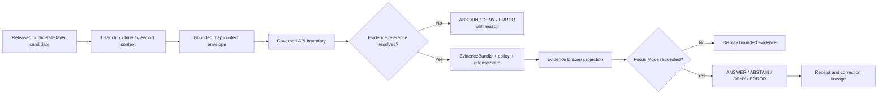

<!-- [KFM_META_BLOCK_V2]
doc_id: kfm://doc/architecture-map-master-readme
title: Map Master Architecture
type: standard
version: v1.0
status: draft
owners:
  - "@bartytime4life"
created: 2026-05-24
updated: 2026-08-14
policy_label: public
owning_root: docs/
responsibility: "Explain the repository-present map and renderer architecture boundary, direct-child documentation map, current implementation evidence, and fail-closed validation posture without deciding renderer adoption or publication."
truth_posture: "CONFIRMED current repository evidence / PROPOSED architecture and decisions not yet accepted or implemented / NEEDS VERIFICATION runtime, release, and public behavior"
related:
  - docs/architecture/README.md
  - docs/doctrine/directory-rules.md
  - docs/adr/ADR-0029-adopt-directory-governance-standard-v2.md
  - "docs/adr/ADR-0007 — MapLibre GL JS Is the Sole Browser-Side Renderer.md"
  - docs/architecture/maplibre.md
  - docs/architecture/map-shell.md
  - packages/maplibre/README.md
  - packages/maplibre/package.json
  - packages/maplibre/src/index.ts
  - apps/explorer-web/package.json
  - apps/explorer-web/src/adapters/MapLibreAdapter.ts
  - tools/validators/maplibre/validate_v6_readiness.py
  - tests/maplibre/test_validate_v6_readiness.py
  - fixtures/maplibre/v6_readiness/cases.json
tags:
  - kfm
  - architecture
  - map-master
  - maplibre
  - renderer-boundary
  - evidence-drawer
  - trust-membrane
  - readiness-hold
notes:
  - "v1.0 is a same-path, repository-grounded reconciliation against main@3974da9794fa11bd5355c49243c9193d22b9e81e."
  - "The accepted Directory Rules v2 make docs/architecture/ a canonical explanatory lane; the former OPEN-DR-12 and path-PROPOSED framing is stale."
  - "ADR-0007 remains legacy-proposed with effective decision status proposed; this README does not accept it."
  - "The current package and adapter are placeholders, the MapLibre dependency is unpinned, and browser probes are not recorded; no functioning renderer runtime, released layer flow, deployment, or publication is claimed."
  - "The seven existing sibling documents remain tracked draft lineage and are not silently promoted by this README."
[/KFM_META_BLOCK_V2] -->

<a id="top"></a>

# Map Master Architecture

> Repository-grounded entry point for KFM's map and renderer architecture lane. It preserves the governing rule that a renderer is downstream of evidence, policy, review, release, correction, and rollback while making the current implementation boundary explicit.

| Field | Current state |
|---|---|
| **Owning root** | `docs/` — canonical human-readable explanation surface |
| **Local profile** | `BOUNDARY_COMPACT` architecture-lane README |
| **Evidence snapshot** | `main@3974da9794fa11bd5355c49243c9193d22b9e81e` |
| **Directory decision** | [`ADR-0029`](../../adr/ADR-0029-adopt-directory-governance-standard-v2.md) is **accepted** |
| **Renderer-family decision** | [`ADR-0007`](<../../adr/ADR-0007 — MapLibre GL JS Is the Sole Browser-Side Renderer.md>) is **proposed**, not accepted |
| **Implementation maturity** | **Scaffold + readiness HOLD** |
| **Verified owner route** | `@bartytime4life`; independent map/runtime stewardship remains **NEEDS VERIFICATION** |
| **Release or publication effect** | None |

> [!IMPORTANT]
> **Operating law:** the renderer is downstream of trust. A rendered feature, layer, popup, screenshot, scene, camera state, performance result, or generated explanation is a carrier or interpretation—not canonical truth, source admission, policy approval, citation validation, human review, release approval, or publication.

> [!CAUTION]
> **Current implementation is not a working MapLibre runtime.** The repository contains a private `@kfm/maplibre` `0.0.0` package scaffold, a placeholder export, a comment-only Explorer adapter, and a deterministic readiness classifier. It does not currently pin `maplibre-gl`, record the required browser probes, or establish a released map flow.

**Quick navigation:** [Purpose](#1-purpose-and-authority) · [Evidence](#2-current-repository-evidence) · [Operating law](#3-renderer-boundary-and-negative-authorities) · [Boundary contract](#4-boundary-contract) · [Directory map](#5-verified-direct-child-map) · [Implementation](#6-current-implementation-surfaces) · [Click-to-truth](#7-target-click-to-truth-flow) · [Views and artifacts](#8-view-and-artifact-posture) · [Validation](#9-validation-and-finite-outcomes) · [Decision gates](#10-decision-and-implementation-gates) · [Change rules](#11-change-and-review-rules) · [Open work](#12-open-verification-register) · [Rollback](#13-rollback-and-correction) · [References](#14-related-repository-evidence) · [Change ledger](#15-no-loss-change-ledger)

---

<a id="1-scope"></a>
<a id="2-repo-fit--open-dr-12-family"></a>

## 1. Purpose and authority

`docs/architecture/map-master/` explains how KFM's map-facing concerns compose across the governed API, Explorer Web, renderer adapter seam, evidence resolution, policy, release, correction, and rollback.

This README is an **architecture boundary document**. It:

- orients readers to the tracked direct children of this directory;
- records current repository evidence separately from proposed architecture;
- preserves the renderer's negative-authority boundary;
- names the validation and acceptance evidence required before runtime claims become credible;
- routes normative questions to the correct authority.

This README does **not**:

- accept or amend an ADR;
- select or pin a MapLibre version;
- admit a plugin, protocol, endpoint, asset host, or dependency;
- define object meaning, machine schema, or policy;
- prove a functional adapter, browser render, public layer, deployed application, release, or publication;
- upgrade any sibling draft to adopted doctrine or implemented behavior.

### 1.1 Authority order for this lane

| Question | Controlling evidence |
|---|---|
| Where does this README belong? | Accepted Directory Rules v2 and the repository-present path |
| Which renderer family is selected? | The effective status of ADR-0007 or a later accepted decision |
| What exists now? | Current repository bytes, manifests, validators, fixtures, workflows, and run evidence |
| What does an object mean? | `contracts/` |
| What machine shape is valid? | `schemas/` |
| What is allowed, denied, held, restricted, or abstained? | `policy/` and the resulting decision records |
| What may public clients consume? | Governed APIs and released public-safe artifacts with evidence and release closure |
| What proves runtime behavior? | Representative browser/runtime tests and emitted records tied to a known revision |

The accepted Directory Rules make `docs/architecture/` a canonical explanatory lane. Therefore, the former claim that this existing folder was merely a **PROPOSED** path in an unresolved `OPEN-DR-12` family is stale and is removed by this revision.

[Back to top](#top)

---

## 2. Current repository evidence

The statements in this section are bounded to the pinned snapshot. They do not infer deployment, publication, or external runtime behavior.

| Surface | CONFIRMED current evidence | Safe conclusion |
|---|---|---|
| Repository base | `main@3974da9794fa11bd5355c49243c9193d22b9e81e` | Exact review base for this edition |
| Directory Rules | `docs/doctrine/directory-rules.md` is adopted through accepted ADR-0029 | `docs/architecture/` is a canonical explanatory root segment |
| This directory | Eight tracked files, including this README | The directory is current repository state, not a future tree |
| ADR-0007 | `legacy-proposed`; effective decision status `proposed` | Sole-renderer selection is not accepted |
| MapLibre package | `packages/maplibre/package.json` declares private `@kfm/maplibre` version `0.0.0` and no dependency or export surface | Package scaffold only |
| Package source | `packages/maplibre/src/index.ts` exports only `placeholder = true` | No functioning package adapter is established |
| Explorer adapter | `apps/explorer-web/src/adapters/MapLibreAdapter.ts` contains one boundary comment | No functioning adapter is established |
| Explorer toolchain | Vite, TypeScript, Vitest, and Playwright scripts are declared; `maplibre-gl` is not declared | Build/test tooling exists, renderer dependency does not |
| Readiness classifier | `tools/validators/maplibre/validate_v6_readiness.py` is executable and fixture-backed | Static readiness can be classified without installing MapLibre |
| Dependency input | Root, Explorer, and package manifests do not pin `maplibre-gl` | `MAPLIBRE_DEPENDENCY_UNPINNED` is unavoidable at this snapshot |
| Probe input | `configs/maplibre/v6-probe-results.json` is absent | All required browser probes remain `NOT_RUN`; `RUNTIME_PROBES_PENDING` is unavoidable |
| Current readiness | Classifier rules require `HOLD` while either condition above remains | Runtime readiness is not established |

### 2.1 What remains unknown

The current snapshot does not establish:

- a functional browser renderer;
- an accepted MapLibre version or upgrade policy;
- an admitted plugin or protocol set;
- a complete repository-wide renderer/acquisition inventory;
- browser behavior for WebGL2 failure, worker/CSP loading, style compatibility, GeoJSON updates, feature queries, or visual parity;
- a released layer-to-Evidence-Drawer flow;
- deployed Explorer behavior, production telemetry, public-safe tile hosting, or cache invalidation;
- a release, correction, withdrawal, rollback, or publication path for map artifacts.

A successful static check, documentation build, or performance workflow is not sufficient evidence for any of those claims.

[Back to top](#top)

---

<a id="3-the-canonical-posture--renderer-is-downstream-of-trust"></a>
<a id="4-the-seven-negative-authorities"></a>
<a id="13-anti-patterns"></a>

## 3. Renderer boundary and negative authorities

The durable architectural rule is independent of the eventual renderer-family decision:

> **A browser renderer consumes governed, released, public-safe carriers and returns bounded interaction context. It does not become an authority because it can display or query pixels and features.**

### 3.1 The seven negative authorities

| # | The renderer is not | Authority belongs to | Boundary failure |
|---:|---|---|---|
| 1 | **Canonical truth store** | Evidence and release object families | Client state or tile bytes treated as canonical truth |
| 2 | **Source registry** | Governed source admission and `SourceDescriptor` records | A URL or tile metadata silently becomes source identity |
| 3 | **Policy engine** | Policy rules and auditable decision records | Client styling substitutes for allow/deny/redaction |
| 4 | **Citation authority** | Resolved evidence and citation validation | Popup text or feature properties are treated as support |
| 5 | **Review authority** | Steward review and review records | A UI control marks material reviewed or approved |
| 6 | **Publication authority** | Release decision, manifest, proof, correction, and rollback closure | Visibility or upload is treated as publication |
| 7 | **AI authority** | Governed AI over admissible evidence with finite outcomes | Raw generated language is rendered as authoritative |

### 3.2 Trust directions

| Direction | Permitted flow | Prohibited inference |
|---|---|---|
| Trust plane → map surface | Released layer descriptors, public-safe artifacts, evidence references, release and correction state | Presence on the map proves truth or publication |
| Map surface → governed services | Feature candidates, layer identifiers, viewport, camera, time selection, and user intent | Rendered properties supply evidence or policy |
| Governed services → evidence surface | Resolved evidence, caveats, conflicts, finite outcome, correction and release state | A successful route call grants release authority |

Sensitive or restricted geometry must be transformed, generalized, aggregated, omitted, or denied **before** it reaches a public rendering artifact. Hiding a feature with a client-side style filter is not a public-safety control.

[Back to top](#top)

---

<a id="11-what-lives-here--what-does-not-live-here"></a>

## 4. Boundary contract

This section implements the accepted Directory Rules `BOUNDARY_COMPACT` README profile for the map-master lane.

### 4.1 Belongs here

- architecture explanations spanning the map shell, renderer boundary, evidence drawer, layer lifecycle, artifact delivery, parity, verification, and performance;
- current-state evidence summaries that cite repository files and keep uncertainty visible;
- cross-links to decisions, contracts, schemas, policy, fixtures, tests, workflows, release records, and runbooks;
- migration or contradiction notes needed to prevent stale architecture prose from being mistaken for current behavior.

### 4.2 Prohibited here

- renderer dependencies or executable adapter code;
- semantic contracts or copied JSON Schemas;
- policy source or allowlists;
- source registry instances, lifecycle data, receipts, proofs, release decisions, or published carriers;
- live endpoint, credential, or private-location configuration;
- claims that documentation, a green check, a screenshot, or a PR accepts an ADR or publishes KFM material.

### 4.3 Inputs and outputs

| Kind | Inputs | Outputs |
|---|---|---|
| Authority | Accepted doctrine and ADRs | Bounded explanatory architecture |
| Current state | Pinned repository bytes, tests, validators, workflows, and emitted evidence | Truth-labeled implementation snapshot |
| Design | Reviewed proposals and source lineage | Explicitly PROPOSED target flows and acceptance gates |
| Correction | Drift, supersession, runtime failures, and review findings | Updated prose, forward links, and open verification items |

### 4.4 Exposure, mutation, and retention

- **Exposure:** public documentation; it must not disclose secrets, protected locations, private evidence, or restricted denial reasons.
- **Mutation:** reviewed, versioned Markdown. Changes to decisions or enforcement belong in their owning roots and may require an ADR.
- **Retention:** preserve Git history and explicit supersession. Do not delete contradictory lineage merely to make the architecture look settled.
- **Writers:** repository contributors through normal review. A README edit cannot self-authorize a renderer, plugin, release, or public path.
- **Review trigger:** renderer-family status, package ownership, dependency pinning, adapter behavior, public exposure, sensitivity behavior, validation coverage, or release/correction behavior changes.

[Back to top](#top)

---

<a id="12-directory-tree-proposed"></a>

## 5. Verified direct-child map

The tree below is **CONFIRMED** from the pinned repository snapshot and shows direct children only, as required by Directory Rules.

```text
docs/architecture/map-master/
├── 2D_3D_PARITY.md
├── EVIDENCE_DRAWER.md
├── LAYER_LIFECYCLE.md
├── PERFORMANCE_BUDGETS.md
├── README.md
├── RENDERER_BOUNDARY.md
├── TILE_ARTIFACTS.md
└── VIEWER_VERIFICATION.md
```

| File | Local role | Current reading posture |
|---|---|---|
| [`README.md`](README.md) | Boundary entry point and current evidence snapshot | This edition |
| [`RENDERER_BOUNDARY.md`](RENDERER_BOUNDARY.md) | Seven negative authorities and downstream-renderer rule | Retained draft guidance; implementation claims require re-verification |
| [`EVIDENCE_DRAWER.md`](EVIDENCE_DRAWER.md) | Click-to-evidence and drawer behavior | Retained draft guidance; payload and runtime existence are not established here |
| [`LAYER_LIFECYCLE.md`](LAYER_LIFECYCLE.md) | Layer state, release, correction, and rollback concepts | Retained draft guidance |
| [`TILE_ARTIFACTS.md`](TILE_ARTIFACTS.md) | Tile-carrier integrity and delivery concepts | Retained draft guidance; tooling and release claims require evidence |
| [`VIEWER_VERIFICATION.md`](VIEWER_VERIFICATION.md) | Fail-closed verification before rendering | Retained draft guidance; browser enforcement is not established |
| [`PERFORMANCE_BUDGETS.md`](PERFORMANCE_BUDGETS.md) | Performance targets and probe expectations | Retained draft guidance; budgets and measurements require current run evidence |
| [`2D_3D_PARITY.md`](2D_3D_PARITY.md) | Cross-view evidence, policy, release, and reality-boundary parity | **STALE / CONFLICTED lineage:** it still assumes a Cesium/dual-renderer path while ADR-0007 now proposes a MapLibre-only family; neither position is accepted |

The sibling documents are useful lineage, but their May 2026 `PROPOSED` and document-only assumptions must not be promoted into current implementation facts. Reconcile each sibling against the current ADR, package, adapter, validator, and repository tree before material reuse.

[Back to top](#top)

---

## 6. Current implementation surfaces

### 6.1 Package boundary

The repository-present package is:

```text
packages/maplibre/
├── README.md
├── package.json
└── src/
    └── index.ts
```

Current evidence establishes a private `0.0.0` package scaffold and a placeholder export. It does not establish:

- `maplibre-gl` installation;
- a public or internal export contract;
- a functional source/layer/style adapter;
- plugin or protocol registration;
- a browser support matrix;
- package-local tests or a released software distribution.

The package name is not permission to create a parallel `packages/maplibre-runtime/` authority. That ownership question must be decided before a second active package is introduced.

### 6.2 Explorer boundary

`apps/explorer-web/` has a real TypeScript/Vite/Vitest/Playwright toolchain, but the checked adapter is comment-only and the app manifest does not declare MapLibre. Therefore:

- the canonical Explorer shell decision does not prove a map runtime;
- a file named `MapLibreAdapter.ts` does not prove an adapter;
- build scripts do not prove that a map renders;
- browser tests do not prove they exercise MapLibre unless the tested code and results show it.

### 6.3 Readiness classifier

The repository owns a bounded, no-network v6 readiness classifier. It checks:

- exact MapLibre major/version selection from declared manifests;
- ESM mode;
- the Explorer TypeScript target;
- a bounded source scan for direct imports outside the package seam;
- selected internal `map.transform` access patterns;
- six finite browser-probe results when a probe record is supplied.

It intentionally does not prove rendering equivalence, WebGL2 availability, CSP/worker behavior, query parity, visual parity, release state, or publication.

### 6.4 Current implementation summary

```text
package scaffold          CONFIRMED
placeholder export        CONFIRMED
comment-only app adapter  CONFIRMED
MapLibre dependency       UNPINNED
browser probe record      ABSENT
readiness result          HOLD
functional renderer       NOT ESTABLISHED
released map flow         NOT ESTABLISHED
deployment/publication    NOT ESTABLISHED
```

[Back to top](#top)

---

<a id="6-the-click-to-truth-flow"></a>

## 7. Target click-to-truth flow

The flow below is a **PROPOSED acceptance target**, not a claim about current runtime behavior.


```mermaid
flowchart LR
    A["Released public-safe layer candidate"] --> B["User click / time / viewport context"]
    B --> C["Bounded map context envelope"]
    C --> D["Governed API boundary"]
    D --> E{"Evidence reference resolves?"}
    E -->|No| F["ABSTAIN / DENY / ERROR<br/>with reason"]
    E -->|Yes| G["EvidenceBundle + policy + release state"]
    G --> H["Evidence Drawer projection"]
    H --> I{"Focus Mode requested?"}
    I -->|No| J["Display bounded evidence"]
    I -->|Yes| K["ANSWER / ABSTAIN / DENY / ERROR"]
    K --> L["Receipt and correction lineage"]
```

Acceptance rules:

1. Rendered feature properties identify a **candidate**, not evidence.
2. Consequential claims resolve through `EvidenceRef` to admissible `EvidenceBundle` support.
3. Policy and sensitivity checks run before the public projection is returned.
4. The drawer exposes source role, temporal and spatial scope, caveats, conflicts, release state, and correction state appropriate to the audience.
5. Focus Mode receives bounded, governed context; it does not call a model provider directly from the browser.
6. Missing evidence, policy denial, stale support, withdrawn release, or operational failure produces a visible finite outcome rather than an uncited fallback.
7. Interaction receipts are process evidence only; they are not proof that the underlying claim is true.

[Back to top](#top)

---

<a id="7-map-object-families"></a>
<a id="8-2d-default--3d-conditional--tile-artifact-discipline"></a>
<a id="10-reality-boundary-note--synthetic-vs-observed"></a>

## 8. View and artifact posture

### 8.1 View parity

KFM's durable parity requirement is about **evidence and governance**, not renderer branding:

- the same claim identity;
- the same evidence support;
- the same policy and sensitivity posture;
- the same temporal selection;
- the same release, correction, and withdrawal state;
- the same finite failure behavior.

A 3D, globe, terrain, extrusion, point-cloud, or synthetic representation cannot become a second truth path. A representation that cannot preserve the 2D evidence baseline must abstain, deny, or visibly fall back.

### 8.2 Decision status

ADR-0007 currently proposes MapLibre GL JS as the sole browser-side renderer family with governed integrations behind an adapter seam. Because that ADR is not accepted:

- this README does not state the proposal as an effective decision;
- the stale dual-renderer sibling remains lineage, not authority;
- no second renderer or replacement package should be created casually;
- any implementation should remain behind a bounded adapter until the decision and ownership gates close.

### 8.3 Synthetic and reconstructed surfaces

Modeled, interpolated, reconstructed, simulated, and generated surfaces remain derivatives. Where a representation could be mistaken for observation, the public surface needs an explicit reality-boundary explanation and a traceable representation/transform record. Exact object names and schema homes remain **NEEDS VERIFICATION** until current contracts and schemas prove them.

### 8.4 Tile and raster carriers

PMTiles, MVT, COG, MBTiles, MLT, Zarr, style JSON, sprites, glyphs, and similar assets are delivery carriers. Public use requires evidence appropriate to consequence, including identity, rights, sensitivity, provenance, integrity, release state, correction path, and rollback target.

This README does not claim that any specific sidecar, hash-tree, signing, range-proof, CDN, CORS, cache, plugin, or browser-verification design is currently implemented. Those claims require current contracts, schemas, policy, tooling, fixtures, tests, emitted artifacts, and runtime evidence.

[Back to top](#top)

---

<a id="9-viewer-side-verification-fails-closed--ui-negative-states"></a>

## 9. Validation and finite outcomes

### 9.1 Repository-owned readiness commands

```bash
python tools/validators/maplibre/validate_v6_readiness.py --fixtures
python tools/validators/maplibre/validate_v6_readiness.py --scan-root .
```

The classifier uses these process exits:

| Outcome | Exit | Meaning |
|---|---:|---|
| `READY` | `0` | Every configured static requirement and recorded browser probe passes |
| `HOLD` | `3` | Evidence or required execution is incomplete or a bounded readiness condition is unmet |
| `ERROR` | `1` | The classifier could not safely evaluate the input |

At the pinned snapshot, the exact dependency is unpinned and the browser-probe record is absent. Therefore `READY` is not a supportable claim.

### 9.2 Documentation validation

A change to this README should at minimum run the repository's changed-area documentation checks, including:

```bash
python tools/validators/docs/meta-block/check_meta_blocks.py \
  --repo-root . \
  --profile present \
  docs/architecture/map-master/README.md
```

Hosted documentation metadata, links, stale-state, graph, build, and changed-area checks remain separate evidence. A green documentation workflow proves bounded document QA only.

### 9.3 Runtime outcomes

Map-facing governed responses should remain finite:

| Outcome | Meaning |
|---|---|
| `ANSWER` | Released, admissible, citation-valid evidence supports the bounded request |
| `ABSTAIN` | Evidence is missing, stale, conflicted, unresolved, or outside supported scope |
| `DENY` | Rights, sensitivity, access, policy, or harmful precision blocks exposure |
| `ERROR` | A required resolver, policy evaluator, validator, adapter, or runtime failed safely |

Expected negative-state classes include missing evidence, stale source, policy denial, generalized geometry, restricted access, conflicted support, citation failure, withdrawn release, and runtime error. Their exact contract names and UI implementation remain **NEEDS VERIFICATION**.

[Back to top](#top)

---

## 10. Decision and implementation gates

ADR-0007 should remain proposed until equivalent evidence closes all applicable gates.

| Gate | Required evidence | Current state |
|---|---|---|
| Decision coherence | Reviewed ADR status transition and index parity | **OPEN** |
| Vocabulary | Reviewed definitions for renderer, plugin, protocol, custom integration, and peer renderer | **OPEN** |
| One adapter/package home | Decision between current `packages/maplibre/` and any proposed alternative, with migration and rollback | **OPEN** |
| Version and distribution | Exact dependency pin, lock closure, ESM/CSP/worker strategy, browser matrix, update and rollback policy | **OPEN** |
| Complete inventory | Recursive manifests, imports, dynamic acquisition, CDN scripts, globals, workers, plugins, custom layers, examples, and tests | **OPEN** |
| Functional adapter | Tested KFM-shaped API with no raw renderer leakage across the boundary | **OPEN** |
| Runtime probes | Reviewed six-probe record tied to the accepted dependency and build | **OPEN** |
| Governed flow | Released-input, evidence, negative-state, correction, withdrawal, and rollback behavior | **OPEN** |
| Documentation reconciliation | This lane, package docs, adapter ADR, tests, and backlog agree with the accepted state | **PARTIAL** |
| Human review | Required reviewers approve the decision evidence | **OPEN** |

No package scaffold, green static check, successful performance workflow, screenshot, or documentation update substitutes for these gates.

[Back to top](#top)

---

## 11. Change and review rules

### 11.1 Ordinary documentation changes

A same-path edit may clarify current evidence, repair links, update navigation, or reconcile prose with accepted doctrine. It must not:

- promote a proposed ADR;
- invent a dependency or package ownership decision;
- claim runtime behavior without representative evidence;
- copy normative contract, schema, or policy content into this lane.

### 11.2 ADR-class changes

Open or amend an ADR when work would:

- accept or replace the renderer-family decision;
- introduce a peer browser renderer or an exception to the selected family;
- create a second active renderer package or move the adapter authority;
- create or relocate a normative object family, schema authority, policy authority, or public trust boundary;
- relax evidence, sensitivity, release, correction, or rollback controls.

### 11.3 Required propagation

When renderer behavior materially changes, review at least:

- this README and the affected sibling architecture page;
- ADR-0006 and ADR-0007;
- `packages/maplibre/README.md` and package metadata;
- Explorer adapter and app documentation;
- readiness validator, fixtures, and tests;
- workflow and runbook documentation;
- contracts, schemas, policy, release, correction, and rollback references actually affected.

Documentation should describe verified behavior; it must not be used to manufacture the verification.

[Back to top](#top)

---

<a id="14-open-questions-and-adr-triggers"></a>

## 12. Open verification register

| Item | Status | Closure evidence |
|---|---|---|
| Effective renderer-family decision | **PROPOSED** | Accepted ADR and synchronized index |
| Physical adapter/package authority | **NEEDS VERIFICATION** | Reviewed ownership decision and one active home |
| Exact MapLibre dependency and update policy | **UNKNOWN** | Pinned manifest, lock, dependency review, rollback |
| Functional adapter API | **UNKNOWN** | Implementation, contract, tests, and consumer proof |
| Complete renderer/import/acquisition inventory | **NEEDS VERIFICATION** | Repository-wide validator and reviewed report |
| Browser probe results | **NOT RUN** | Committed or otherwise governed six-probe record tied to a revision |
| Plugin/protocol allowlist | **UNKNOWN** | Admission policy, version pins, licensing and supply-chain evidence |
| Released layer and Evidence Drawer flow | **UNKNOWN** | Representative integration test and emitted evidence |
| Public-safe artifact hosting and verification | **UNKNOWN** | Contracts, policy, fixture, runtime, failure, correction, and rollback proof |
| 2D/3D parity sibling | **STALE / CONFLICTED** | Reconcile dual-renderer wording after an effective decision |
| Remaining sibling metadata and repo-state claims | **NEEDS VERIFICATION** | Same-path repository-grounded modernization of each sibling |
| Independent map/runtime steward | **NEEDS VERIFICATION** | Verified owner and review route |

Until these close, the safe posture is a scaffolded architecture lane with an explicit readiness HOLD.

[Back to top](#top)

---

## 13. Rollback and correction

This revision changes documentation only.

- **Before merge:** close the draft pull request and abandon the feature branch.
- **After merge:** revert the documentation commit or apply a forward correction.
- **Prior blob:** `47edaec117f784ce146c1e3def94beabcdf965a1`.
- **Caution:** restoring the prior blob also restores stale path-proposal claims, broken ADR links, and overconfident renderer/plugin/runtime language. A transparent forward fix is preferable unless the entire v1.0 reconciliation is rejected.
- **Runtime effect:** none. No dependency, adapter, policy, schema, source, artifact, release, deployment, or publication state changes.
- **Sibling effect:** none. Existing sibling documents remain available as lineage and can be corrected independently.

[Back to top](#top)

---

<a id="5-relationship-to-other-architecture-lanes"></a>
<a id="15-related-docs"></a>

## 14. Related repository evidence

| Reference | Role | Current status |
|---|---|---|
| [`docs/doctrine/directory-rules.md`](../../doctrine/directory-rules.md) | Canonical placement and README-profile authority | Adopted through ADR-0029 |
| [`ADR-0029`](../../adr/ADR-0029-adopt-directory-governance-standard-v2.md) | Adoption record for Directory Rules v2 | **Accepted** |
| [`ADR-0007`](<../../adr/ADR-0007 — MapLibre GL JS Is the Sole Browser-Side Renderer.md>) | Renderer-family proposal and acceptance gates | **Proposed** |
| [`docs/architecture/README.md`](../README.md) | Parent explanatory architecture lane | Repository-present; contains older repo-state assumptions |
| [`docs/architecture/maplibre.md`](../maplibre.md) | MapLibre lane orientation and design lineage | Draft; current-state claims require reconciliation |
| [`docs/architecture/map-shell.md`](../map-shell.md) | Map shell and trust-visible interaction lineage | Draft architecture guidance |
| [`packages/maplibre/README.md`](../../../packages/maplibre/README.md) | Package boundary and scaffold evidence | Repository-present |
| [`packages/maplibre/package.json`](../../../packages/maplibre/package.json) | Package identity and declared dependencies | Private `0.0.0` scaffold |
| [`packages/maplibre/src/index.ts`](../../../packages/maplibre/src/index.ts) | Current package entry | Placeholder only |
| [`MapLibreAdapter.ts`](../../../apps/explorer-web/src/adapters/MapLibreAdapter.ts) | Explorer adapter seam | Comment-only placeholder |
| [`apps/explorer-web/package.json`](../../../apps/explorer-web/package.json) | Explorer scripts and declared dependencies | Toolchain present; no MapLibre dependency |
| [`validate_v6_readiness.py`](../../../tools/validators/maplibre/validate_v6_readiness.py) | Bounded static/probe readiness classifier | Executable; current inputs imply HOLD |
| [`test_validate_v6_readiness.py`](../../../tests/maplibre/test_validate_v6_readiness.py) | Classifier tests | Repository-present |
| [`cases.json`](../../../fixtures/maplibre/v6_readiness/cases.json) | Positive/negative readiness fixtures | Repository-present |
| [MapLibre performance workflow](../../../.github/workflows/maplibre-perf-governance.yml) | Static/performance governance workflow | A green run may still record explicit HOLD |

[Back to top](#top)

---

<a id="16-appendix--glossary-and-reference"></a>

## 15. No-loss change ledger

| Prior material | v1.0 disposition |
|---|---|
| Renderer downstream of trust | **Retained and promoted to the primary operating law** |
| Seven negative authorities | **Retained** |
| Click-to-truth flow | **Retained, explicitly labeled PROPOSED acceptance target** |
| Evidence Drawer, layer lifecycle, viewer verification, performance, and artifact siblings | **Retained and linked as tracked draft lineage** |
| 2D/3D evidence, policy, release, and reality-boundary parity | **Retained** |
| Reality-boundary discipline | **Retained, object names/schema homes narrowed to NEEDS VERIFICATION** |
| Fail-closed negative states and finite outcomes | **Retained with implementation status bounded** |
| Proposed directory tree | **Replaced by the verified direct-child tree** |
| `OPEN-DR-12` and path-PROPOSED framing | **Removed as stale after accepted Directory Rules v2** |
| Wrong ADR-0007 filename and implied acceptance | **Corrected to the repository-present record and proposed status** |
| Claimed functional renderer/package/plugin surface | **Corrected to scaffold + HOLD** |
| Version-sensitive plugin, 3D, signing, BAO, hosting, and format claims | **Narrowed; require current primary-source and repository admission evidence** |
| Large glossary and duplicated sibling detail | **Removed from the landing page; sibling documents remain the deeper lineage surfaces** |

### Changelog

| Version | Date | Change |
|---|---|---|
| **v1.0** | 2026-08-14 | Repository-grounded same-path rewrite against current main; accepted Directory Rules basis, verified child map, current scaffold/HOLD evidence, corrected ADR status/path, bounded target architecture, validation, rollback, and no-loss ledger |
| **v0.2** | 2026-05-24 | Single-renderer-oriented document-only revision with proposed path, plugin, and runtime assumptions |
| **v0.1** | 2026-05-24 | Initial draft |

[Back to top](#top)
