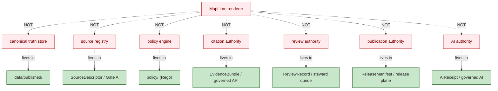

<!-- [KFM_META_BLOCK_V2]
doc_id: kfm://doc/architecture-map-master-renderer-boundary
title: Map Master — Renderer Boundary
type: standard
version: v0.1
status: draft
owners: UI subsystem steward + Security steward · NEEDS VERIFICATION
created: 2026-05-24
updated: 2026-05-24
policy_label: public
related:
  - README.md
  - ../map-shell.md
  - ../cross-domain/trust-membrane.md
  - VIEWER_VERIFICATION.md
  - LAYER_LIFECYCLE.md
  - 2D_3D_PARITY.md
tags: [kfm, architecture, map-master, renderer, boundary, doctrine]
notes:
  - PROPOSED. Expands map-shell.md §2 Operating Law (seven negative authorities) and TM-1..TM-8.
  - The renderer is downstream of trust, never upstream of it.
[/KFM_META_BLOCK_V2] -->

<a id="top"></a>

# Map Master — Renderer Boundary

> *The seven negative authorities the renderer is NOT, and the contract that keeps it downstream of trust. MapLibre delivers pixels; the governed surface delivers truth.*


-blue)


**Status:** draft · **Owners:** UI subsystem steward + Security steward *(NEEDS VERIFICATION)* · **Last updated:** 2026-05-24

> [!IMPORTANT]
> **One-sentence operating law *(`map-shell.md` §2, CONFIRMED)*:** *the renderer is downstream of trust, never upstream of it.* MapLibre is a disciplined 2D renderer; it does **not** become the canonical truth store, source registry, policy engine, citation authority, review authority, publication authority, or AI authority by virtue of being on the screen.

> [!NOTE]
> **This doc enumerates the seven things the renderer is NOT.** Each negative authority maps to specific TM-rules *(TM-1..TM-8)* in `map-shell.md` §3 and specific anti-patterns in §10. The positive contract — what the renderer **does** — is documented in the sibling docs *(`LAYER_LIFECYCLE.md`, `EVIDENCE_DRAWER.md`, `VIEWER_VERIFICATION.md`)*.

---

## Table of contents

1. [Scope](#1-scope)
2. [The seven negative authorities](#2-the-seven-negative-authorities)
3. [Authority 1 — NOT the canonical truth store](#3-authority-1--not-the-canonical-truth-store)
4. [Authority 2 — NOT the source registry](#4-authority-2--not-the-source-registry)
5. [Authority 3 — NOT the policy engine](#5-authority-3--not-the-policy-engine)
6. [Authority 4 — NOT the citation authority](#6-authority-4--not-the-citation-authority)
7. [Authority 5 — NOT the review authority](#7-authority-5--not-the-review-authority)
8. [Authority 6 — NOT the publication authority](#8-authority-6--not-the-publication-authority)
9. [Authority 7 — NOT the AI authority](#9-authority-7--not-the-ai-authority)
10. [Renderer-as-downstream contract](#10-rendereras-downstream-contract)
11. [Boundary enforcement](#11-boundary-enforcement)
12. [Anti-patterns](#12-anti-patterns)
13. [Open questions and ADR triggers](#13-open-questions-and-adr-triggers)
14. [Related docs](#14-related-docs)
15. [Appendix](#15-appendix)

---

## 1. Scope

This doc tells implementers **what the renderer is forbidden from being**, why each forbidden role matters, and which TM-rule denies it. It does not enumerate every positive responsibility *(those are in the sibling docs)*; it draws the boundary the renderer must not cross.

> [!TIP]
> **When this doc binds.** Anytime a feature request would make the renderer "smarter" *(do policy, cache canonical state, decide what's published, summarize via AI)*. The instinct is wrong; refer back to the seven negative authorities and route the work to the correct authority.

[↑ Back to top](#top)

---

## 2. The seven negative authorities

> **Evidence basis:** `map-shell.md` §2 Operating Law *(CONFIRMED)*: *"MapLibre is the disciplined 2D renderer and interaction runtime inside the governed KFM shell. It is not the canonical truth store, source registry, policy engine, citation authority, review authority, publication authority, or AI authority."*

| # | The renderer is NOT… | Which means it cannot… | Canonical authority lives in… |
|---|---|---|---|
| **1** | the **canonical truth store** | hold the authoritative copy of any record. | `data/published/` *(CONFIRMED)*; promotion through Gates A–G. |
| **2** | the **source registry** | admit, identify, or rebind a source. | `SourceDescriptor` admitted at Gate A. |
| **3** | the **policy engine** | decide allow / deny / restrict / hold / abstain. | `policy/` Rego bundle, evaluated by governed API. |
| **4** | the **citation authority** | declare what supports a claim. | `EvidenceBundle` resolved by the governed API. |
| **5** | the **review authority** | accept, reject, or supersede candidate records. | Steward review queue → `ReviewRecord`. |
| **6** | the **publication authority** | promote anything to `PUBLISHED`. | `ReleaseManifest` written by the release plane. |
| **7** | the **AI authority** | generate or attribute a synthesized answer. | Governed AI surface behind `AIReceipt`. |



[↑ Back to top](#top)

---

## 3. Authority 1 — NOT the canonical truth store

| Aspect | Detail |
|---|---|
| What it means | The renderer holds **no** authoritative copy of any record. Its in-memory state is a transient projection of released artifacts. |
| Concrete prohibition | No long-lived client cache that survives release events without invalidation. No "synced" client state treated as ground truth. |
| TM-rule | TM-1 *(no public RAW path; shell never reads canonical / internal stores directly)*. |
| Mitigation | Cache invalidation on release events *(`map-shell.md` §11 cache invalidation)*. |

[↑ Back to top](#top)

---

## 4. Authority 2 — NOT the source registry

| Aspect | Detail |
|---|---|
| What it means | The renderer does not admit sources, does not bind source ids to records, does not rewrite source roles. |
| Concrete prohibition | No client-side mapping from URL → source identity. Source ids ride on manifests and `EvidenceRef` URIs from the governed API. |
| TM-rule | TM-3 *(no unreleased tile load — `LayerManifest` and `MapReleaseManifest` carry source identity)*. |
| Mitigation | `LayerDescriptor` carries the manifest-pinned source id; the renderer accepts it but cannot mint one. |

[↑ Back to top](#top)

---

## 5. Authority 3 — NOT the policy engine

| Aspect | Detail |
|---|---|
| What it means | The renderer does not decide what is allowed, denied, restricted, held, or abstained. Those decisions are `PolicyDecision`s from the governed API. |
| Concrete prohibition | No client-side "if user is X, hide layer Y" logic that bypasses policy. No style filter standing in for sensitivity policy *(TM-4)*. |
| TM-rule | TM-4 *(no sensitive geometry hidden only by style)*; cross-references `governed-api/AUDIENCE_CLASSES.md`. |
| Mitigation | Policy evaluated server-side; renderer receives `DecisionEnvelope`; sensitive content is denied **before** tile generation, not via CSS. |

[↑ Back to top](#top)

---

## 6. Authority 4 — NOT the citation authority

| Aspect | Detail |
|---|---|
| What it means | The renderer does not declare what supports a claim. A rendered feature is a **candidate**, not proof. The `EvidenceBundle` is the citation authority. |
| Concrete prohibition | A click on a feature does NOT expose feature properties as evidence; it issues a governed claim-resolution request that returns `EvidenceDrawerPayload`. |
| TM-rule | TM-5 *(no popup as Evidence Drawer substitute)*; TM-6 *(no Focus Mode answer from rendered features alone)*. |
| Mitigation | `EVIDENCE_DRAWER.md` flow; popups preview only; drawer carries the bundle. |

[↑ Back to top](#top)

---

## 7. Authority 5 — NOT the review authority

| Aspect | Detail |
|---|---|
| What it means | The renderer does not accept, reject, or supersede candidate records. Steward review produces `ReviewRecord`; the renderer surfaces review state, not review decisions. |
| Concrete prohibition | No client-initiated "promote this to published" path; no client edit of `ReviewRecord`. |
| TM-rule | TM-8 *(watcher-as-non-publisher — renderer probes emit candidate decisions and receipts; never publish)*. |
| Mitigation | Review console is read-only *(`map-shell.md` §5 anatomy table)*; mutation goes through the governed API. |

[↑ Back to top](#top)

---

## 8. Authority 6 — NOT the publication authority

| Aspect | Detail |
|---|---|
| What it means | The renderer does not promote anything to `PUBLISHED`. Promotion is a release-plane state transition, recorded in `ReleaseManifest`. |
| Concrete prohibition | No client-side "release" button; no client writing to `data/published/`. |
| TM-rule | TM-8 + invariant 6 in `map-shell.md` §2 *(separation of release duties)*. |
| Mitigation | Release plane is internal-class *(`governed-api/AUDIENCE_CLASSES.md` §6)*; renderer reads `release_ref`, never writes it. |

[↑ Back to top](#top)

---

## 9. Authority 7 — NOT the AI authority

| Aspect | Detail |
|---|---|
| What it means | The renderer does not generate, attribute, or substitute AI content for evidence. Focus Mode goes through the governed adapter with `AIReceipt`. |
| Concrete prohibition | No browser → Ollama / OpenAI / local model / vector index / graph store. No AI text rendered as a feature property. |
| TM-rule | TM-2 *(no direct model client)*; TM-7 *(no uncited export — Story Nodes / Focus answers carry citations and `AIReceipt`)*. |
| Mitigation | CSP + network policy *(see `governed-api/DEPLOYMENT_RULES.md` §8)*; Focus Mode runs through `apps/governed-api/` adapter. |

[↑ Back to top](#top)

---

## 10. Renderer-as-downstream contract

> **Evidence basis:** `map-shell.md` §2 Operating Law *(CONFIRMED)*; §4 Core Interaction Slice *(CONFIRMED)*; §6 MapRuntimePort *(PROPOSED)*.

| Contract clause | Detail |
|---|---|
| C-1 | The renderer accepts only `LayerDescriptor` objects whose `LayerManifest` + `TileArtifactManifest` + `MapReleaseManifest` + `PolicyDecision` have already been resolved upstream. |
| C-2 | The renderer does not interpret feature properties; clicks become claim-resolution requests. |
| C-3 | The renderer renders one of four finite outcomes *(`ANSWER` / `ABSTAIN` / `DENY` / `ERROR`)*; it does not invent a fifth. |
| C-4 | The renderer's adapter *(`MapLibreAdapter`)* is the **only** module that imports MapLibre runtime APIs. |
| C-5 | The renderer treats negative states *(stale, restricted, conflict, evidence-missing)* as first-class; never as empty panels. |
| C-6 | The renderer participates in lifecycle by **reflecting** state, never by **creating** it. |
| C-7 | The renderer's telemetry is a probe, never a publisher *(TM-8)*. |

[↑ Back to top](#top)

---

## 11. Boundary enforcement

| Enforcement surface | Detail |
|---|---|
| Lint / import-graph | Only `packages/maplibre/` may import MapLibre runtime APIs *(static check)*. |
| ADR | `ADR-maplibre-adapter-boundary.md` *(PROPOSED)* is the formal ADR. |
| Code review | Reviewers compare PRs against the seven negative authorities. |
| Runtime check | `VIEWER_VERIFICATION.md` `verify-before-addSource` gate fails closed when manifests / policy are missing. |
| CSP / network | `governed-api/DEPLOYMENT_RULES.md` §8 forbids browser egress to model runtimes / vector indexes / canonical stores. |
| Tests | `map-shell.md` §11 validation requirements include "No public RAW path", "No unreleased tile load", "Sensitive-geometry deny", "Browser → model runtime" *(negative paths)*. |

[↑ Back to top](#top)

---

## 12. Anti-patterns

| Anti-pattern | Maps to negative authority # | Mitigation |
|---|---|---|
| **Client cache treated as ground truth across releases** | 1 | Release-event cache invalidation. |
| **URL-derived source identity** | 2 | Manifest-pinned source id only. |
| **Style filter standing in for sensitivity policy** | 3 | Sensitivity policy at tile generation; never CSS-only *(TM-4)*. |
| **Popup as evidence** | 4 | Drawer required for consequential claims *(TM-5)*. |
| **Client edit of `ReviewRecord`** | 5 | Read-only review console; mutation via governed API. |
| **Client "release" button** | 6 | Release plane is internal-class. |
| **Browser → model runtime** | 7 | CSP + adapter boundary *(TM-2)*. |
| **MapLibre import outside `packages/maplibre/`** | C-4 | Import-graph lint. |

[↑ Back to top](#top)

---

## 13. Open questions and ADR triggers

| Open item | Class | Suggested ADR title |
|---|---|---|
| Should `MapRuntimePort` be a hard process boundary *(e.g., worker / iframe)* or stay in-process? | Architecture | "MapRuntimePort process boundary". |
| Telemetry from the renderer — opt-in by user, allowlisted by class, or both? | Operational | "Renderer telemetry default posture". |
| Should the seven negative authorities be encoded as a machine-checkable manifest *(e.g., `RENDERER_AUTHORITIES.yaml`)* in `packages/maplibre/`? | Tooling | "Encode renderer negative authorities". |
| Cesium boundary parity — apply the same seven negative authorities verbatim, or do 3D specifics require extension? | Boundary | "Cesium boundary parity". |

[↑ Back to top](#top)

---

## 14. Related docs

| Reference | Role | Truth label |
|---|---|---|
| `README.md` *(this folder)* | Landing | CONFIRMED doctrine |
| `../map-shell.md` §2, §3, §6, §10 | Spine | CONFIRMED doctrine |
| `../cross-domain/trust-membrane.md` | Cross-domain trust posture | CONFIRMED doctrine |
| `VIEWER_VERIFICATION.md` *(sibling)* | The runtime gate that enforces the boundary | PROPOSED |
| `LAYER_LIFECYCLE.md` *(sibling)* | What manifests must be present | PROPOSED |
| `2D_3D_PARITY.md` *(sibling)* | Same boundary applies to 3D | PROPOSED |
| `../governed-api/AUDIENCE_CLASSES.md` | Internal vs public classes | PROPOSED |
| `../governed-api/DEPLOYMENT_RULES.md` §8 | Network policy enforcing the boundary | PROPOSED |
| `directory-rules.md` §13.3 | Canonical map-shell homes | CONFIRMED doctrine |
| ADR `ADR-maplibre-adapter-boundary.md` | Formal ADR for the boundary | PROPOSED |

[↑ Back to top](#top)

---

## 15. Appendix

<details>
<summary><strong>15.1 The seven negative authorities — at-a-glance card</strong></summary>

```text
The renderer is NOT:

  1 · the canonical truth store          ←  data/published/
  2 · the source registry                ←  SourceDescriptor / Gate A
  3 · the policy engine                  ←  policy/ (Rego)
  4 · the citation authority             ←  EvidenceBundle / governed API
  5 · the review authority               ←  ReviewRecord / steward queue
  6 · the publication authority          ←  ReleaseManifest / release plane
  7 · the AI authority                   ←  AIReceipt / governed AI

If a feature request would make the renderer one of these,
the answer is: route it to the correct authority.
```

</details>

<details>
<summary><strong>15.2 Truth-label legend</strong></summary>

- **CONFIRMED** — verified this session from attached docs.
- **PROPOSED** — design / placement / inference not yet verified in implementation.
- **INFERRED** — derivable from confirmed evidence but not directly stated.
- **NEEDS VERIFICATION** — checkable, but not yet checked strongly enough to act as fact.

</details>

---

**Related (mini)** · [`README.md`](README.md) · [`../map-shell.md`](../map-shell.md) · [`VIEWER_VERIFICATION.md`](VIEWER_VERIFICATION.md) · [`LAYER_LIFECYCLE.md`](LAYER_LIFECYCLE.md) · [`EVIDENCE_DRAWER.md`](EVIDENCE_DRAWER.md) · [`2D_3D_PARITY.md`](2D_3D_PARITY.md)

**Last updated:** 2026-05-24 · **Doc version:** v0.1 · **Doc status:** draft · **Path status:** PROPOSED *(OPEN-DR-12 MAP-MASTER)*

[↑ Back to top](#top)
