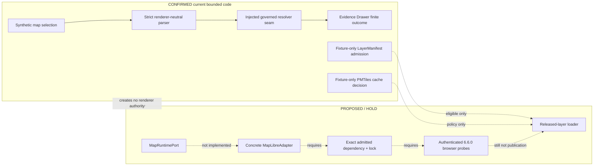
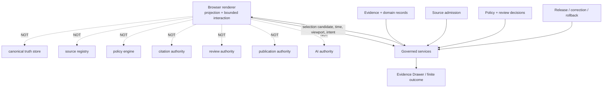

<!-- [KFM_META_BLOCK_V2]
doc_id: kfm://doc/architecture-map-master-renderer-boundary
title: Map Master — Renderer Boundary
type: architecture-reference
version: v2.4-draft
status: draft; repository-grounded; mixed-maturity; renderer-neutral-bounded-slices; production-runtime-hold; non-authoritative; non-publication
owners:
  - "@bartytime4life — current CODEOWNERS review route"
  - "NEEDS VERIFICATION — independent map-runtime, security, evidence, policy, review, release, correction, rollback, accessibility, and operations stewardship"
created: 2026-05-24
updated: 2026-08-27
policy_label: public; architecture; map-master; renderer-boundary; trust-membrane; evidence-bound; fail-closed; non-publication
owning_root: docs/
current_path: docs/architecture/map-master/RENDERER_BOUNDARY.md
responsibility: >-
  Explain the seven negative authorities at KFM's browser-renderer boundary,
  reconcile them with current repository evidence, identify the bounded
  enforcement that exists, and keep concrete renderer admission, runtime,
  release, and publication claims on HOLD until their owning decisions and
  evidence close.
truth_posture: >-
  CONFIRMED current tracked path, accepted Directory Rules placement, the
  renderer-neutral selection-to-Evidence-Drawer bridge, fixture-only
  LayerManifest admission and release-scoped PMTiles cache decisions, bounded
  acquisition inventory, exact 6.6.0 package dependency, package-owned
  MapLibreAdapter and Vite worker seam, deterministic browser fixture, retired
  legacy harness, and Explorer NullMapRuntime production HOLD / PROPOSED live
  governed transport, plugin and protocol admission, broader browser evidence,
  and production activation / UNKNOWN deployed renderer, public layer serving, production
  policy and evidence resolution, operational invalidation, and public parity /
  NEEDS VERIFICATION independent reviewers, complete acquisition enforcement,
  authenticated browser probes, release coupling, correction propagation, and
  rollback execution.
evidence_snapshot:
  repository: bartytime4life/Kansas-Frontier-Matrix
  base_ref: main
  base_commit: 1bdc5fe5819a90d20c611246cdcbf34d9c61aec7
  authoring_base_commit: 996b7e16d46a703c9436b26ef74ed0ecaf87796a
  target_prior_blob: 5bb5d7fd37ac0279e3097c5fe830a79480d73cb0
  lane_readme_blob: e26f81e3452b812b70ef25b4b7f791be72e88154
  map_shell_blob: b0ae23f2399c019a737a27c6aaaf0d34323b1fb7
  maplibre_master_blob: b53ecbf447afb0a9828b10ae0c1910d683dbff5b
  directory_rules_blob: fd49a0b83e55cef52c1124281f093e263526898d
  directory_rules_adr_blob: a4de0d7a96b78da59cfc499d1025e1508afd8dd9
  codeowners_blob: dd2a84aa514d8ecd9208bc347f90f9a2ed37dd61
  adr_0006_blob: 3b789a623a07d27eb538ffaed10b0487ffc43d95
  adr_0007_blob: 6bfd66b1169728d7fad08f0bb2d7e2a56e3577b2
  maplibre_package_manifest_blob: b0582955feeb51016327113692fa5c98ecad8816
  maplibre_package_entry_blob: 91664eb00583f9e3d0405eb7954fefa9a48f4ee9
  explorer_adapter_blob: 663ba0f7a05498948f67d644387c73ab19d5c16c
  explorer_site_readme_blob: 3f2821cf221bb3b44e8e1236fe409edb34174787
  map_selection_bridge_blob: 18d61ea0ef2fbe2fc2f3cc9d42291c101003037f
  map_selection_test_blob: 953bf536f1d3062c194a09855ed3dde4bc9fa311
  layer_admission_blob: 895100728c9eb676b9e2aef84680073142694b27
  pmtiles_cache_blob: 9e52c7c186ce72d56e2728c8c1a35737fe5f1540
  acquisition_inventory_blob: 2d5b9f0cf494ebb6f3cfc6e4f12acb497572edcf
  acquisition_workflow_blob: cb29f58a74cf298c651e724242818cddd1d120f0
  readiness_validator_blob: d9f189fd6f726ff6085371f7d69f2b035474e3fc
  legacy_adapter_test_blob: 97d44069b0a5ab4a82b1e1fc48665e905c08a287
  two_d_three_d_parity_blob: 0c56d7a27a1d26d34779b4a40f576e06d79a6c6a
  layer_lifecycle_blob: 630557b79421e70033a9a2d906c3c472be714ecb
inspection_boundary: >-
  Current-session GitHub reads covered the complete prior target, its parent
  lane README, the current map-shell and MapLibre master references, the
  repository-grounded 2D/3D parity and layer-lifecycle companions, accepted
  Directory Rules and CODEOWNERS, ADR-0006 and ADR-0007, open issues 2957 and
  2906, package and app manifests, placeholder package and adapter code, the
  renderer-neutral map-selection bridge and tests, fixture-only admission and
  cache decisions, the acquisition inventory and workflow, and the 6.6.0
  readiness validator. No mounted checkout, local repository-native test run,
  dependency installation, authenticated browser probe packet, deployed
  runtime, live source, public endpoint, release application, correction
  propagation, or production rollback was exercised.
related:
  - README.md
  - ../map-shell.md
  - ../maplibre-master.md
  - ../ui/MAP_RUNTIME_BOUNDARY.md
  - ../cross-domain/trust-membrane.md
  - VIEWER_VERIFICATION.md
  - LAYER_LIFECYCLE.md
  - EVIDENCE_DRAWER.md
  - TILE_ARTIFACTS.md
  - 2D_3D_PARITY.md
  - ../../adr/ADR-0006-maplibre-boundary--only-maplibreadapter-imports-maplibre.md
  - "../../adr/ADR-0007 — MapLibre GL JS Is the Sole Browser-Side Renderer.md"
  - ../../adr/ADR-0029-adopt-directory-governance-standard-v2.md
  - ../../doctrine/directory-rules.md
  - ../../../packages/maplibre/package.json
  - ../../../packages/maplibre/src/index.ts
  - ../../../apps/explorer-web/src/adapters/MapLibreAdapter.ts
  - ../../../apps/explorer-web/src/features/map_runtime/index.tsx
  - ../../../apps/explorer-web/src/features/map_runtime/layer_manifest_admission.ts
  - ../../../apps/explorer-web/src/features/map_runtime/pmtiles_release_cache.ts
  - ../../../apps/explorer-web/tests/map-evidence-drawer.test.ts
  - ../../../tools/validators/maplibre/assess_acquisition_inventory.py
  - ../../../tools/validators/maplibre/validate_v6_readiness.py
  - ../../../.github/workflows/maplibre-acquisition-inventory.yml
tags: [kfm, architecture, map-master, renderer, maplibre, boundary, evidence, policy, review, release, correction, rollback, runtime-hold]
notes:
  - "v2.0-draft is a same-path repository-grounded modernization; placement outcome PLACE."
  - "The seven negative authorities remain the stable architecture spine, but the authority homes and implementation claims are corrected and bounded."
  - "data/published/ is a released public-safe carrier lane, not the canonical truth store."
  - "The concrete MapLibre runtime remains unadmitted: no maplibre-gl dependency, no functional package export, no functional Explorer adapter, and no authenticated 6.6.0 probe packet are established."
  - "ADR-0006 and ADR-0007 remain proposed; this document does not accept them or turn their proposed seam into current authority."
  - "Current executable evidence is renderer-neutral or fixture-only and creates no evidence, policy, review, release, publication, cache, registry, or MapLibre-source authority."
  - "The branch was reconciled with the same-day 2D/3D parity and layer-lifecycle modernizations; no target overlap occurred, and their repository-grounded HOLD posture is reflected here."
[/KFM_META_BLOCK_V2] -->

<a id="top"></a>

# Map Master — Renderer Boundary

> **Operating rule.** A browser renderer is downstream of trust. It may display released public-safe carriers and return bounded interaction context; it does not create evidence, source authority, policy, review, release, publication, or AI authority by putting something on the screen.

[](#status-and-authority)
[](#directory-rules-basis)
[](#2-the-seven-negative-authorities)
[](#current-repository-evidence)
[](#current-repository-evidence)
[](#non-effects)

> [!IMPORTANT]
> **The boundary is independent of renderer-family selection.** Whether KFM eventually admits MapLibre GL JS alone, admits a bounded integration behind an accepted exception, or changes renderer strategy, the browser remains a projection and interaction surface—not the source of truth or permission.

> [!CAUTION]
> **Current executable evidence is meaningful but bounded.** Explorer Web has a strict renderer-neutral map-selection-to-Evidence-Drawer bridge, fixture-only release/admission decisions, and release-scoped cache decisions. None boots MapLibre, mutates a registry or cache, calls a live governed service, applies policy, or publishes a layer.

> [!WARNING]
> **ADR-0006 and ADR-0007 remain proposed.** The dependency-free `@kfm/maplibre` package, placeholder export, comment-only `MapLibreAdapter.ts`, structural acquisition inventory, and `6.6.0` readiness classifier do not accept either decision, admit a dependency, establish one binding adapter seam, or prove browser behavior.

**Quick navigation:** [Status](#status-and-authority) · [Directory Rules](#directory-rules-basis) · [Current evidence](#current-repository-evidence) · [Scope](#1-scope) · [Seven authorities](#2-the-seven-negative-authorities) · [Truth store](#3-authority-1--not-the-canonical-truth-store) · [Source registry](#4-authority-2--not-the-source-registry) · [Policy](#5-authority-3--not-the-policy-engine) · [Citation](#6-authority-4--not-the-citation-authority) · [Review](#7-authority-5--not-the-review-authority) · [Publication](#8-authority-6--not-the-publication-authority) · [AI](#9-authority-7--not-the-ai-authority) · [Contract](#10-renderer-as-downstream-contract) · [Enforcement](#11-boundary-enforcement) · [Anti-patterns](#12-anti-patterns) · [Open work](#13-open-questions-and-adr-triggers) · [Related](#14-related-docs) · [Appendix](#15-appendix)

---

<a id="status-and-authority"></a>

## Status and authority

| Field | Current bounded result |
|---|---|
| **Tracked path** | `docs/architecture/map-master/RENDERER_BOUNDARY.md` |
| **Document identity** | `kfm://doc/architecture-map-master-renderer-boundary` |
| **Owning root** | `docs/` — human-readable architecture and boundary explanation |
| **Placement** | **CONFIRMED / PLACE** under accepted ADR-0029 and Directory Rules v2 |
| **Repository evidence base** | `main@1bdc5fe5819a90d20c611246cdcbf34d9c61aec7`; authored from `996b7e16d46a703c9436b26ef74ed0ecaf87796a` and reconciled without target overlap |
| **Prior target blob** | `5bb5d7fd37ac0279e3097c5fe830a79480d73cb0` |
| **Review route** | `@bartytime4life` through current CODEOWNERS |
| **Independent specialist review** | **NEEDS VERIFICATION** |
| **ADR-0006 adapter/acquisition decision** | **PROPOSED** |
| **ADR-0007 sole/default browser-renderer decision** | **PROPOSED** |
| **Current Explorer composition** | **CONFIRMED / bounded executable** |
| **Current map interaction bridge** | **CONFIRMED / renderer-neutral / fixture-driven transport** |
| **Concrete MapLibre runtime** | **HOLD / not admitted / not implemented** |
| **Deployed public behavior** | **UNKNOWN / not established here** |
| **Release, deployment, publication effect** | None |

This file is explanatory architecture. Semantic meaning belongs to contracts; machine shape to schemas; admissibility to policy and accountable review; release decisions to `release/`; process memory to receipts; evidence and proof to their own families; public-safe carriers to `data/published/`; and executable behavior to apps, packages, validators, tests, workflows, and runtime evidence.

### Truth labels

| Label | Meaning here |
|---|---|
| **CONFIRMED** | Verified from current repository bytes, accepted decisions, tests, workflows, or generated artifacts inspected for this revision |
| **PROPOSED** | A decision, seam, dependency, behavior, field family, or future state not accepted and verified as current behavior |
| **UNKNOWN** | Available repository or operational evidence does not establish the claim |
| **NEEDS VERIFICATION** | A concrete review, run, artifact, or platform check remains before relying on the claim |

`PASS`, `HOLD`, `DENY`, `ABSTAIN`, `FAIL`, `ERROR`, `READY`, and `PUBLISHED` are bounded system or workflow states. They do not replace the four evidence labels.

[Back to top](#top)

---

<a id="directory-rules-basis"></a>

## Directory Rules basis

Accepted [ADR-0029](../../adr/ADR-0029-adopt-directory-governance-standard-v2.md) adopts [Directory Rules v2](../../doctrine/directory-rules.md). The target already exists in the architecture lane and explains a cross-root browser-renderer boundary to humans. This same-path update therefore receives **PLACE**.

It creates no new root, child lane, contract, schema, policy, source registry, receipt, proof, release record, runtime, or published carrier. The former `path-PROPOSED` / `OPEN-DR-12` footer was stale after Directory Rules adoption and is removed.

### Responsibility split

| Responsibility | Owning surface | This document may do |
|---|---|---|
| Architecture explanation | `docs/architecture/` | Explain and reconcile current evidence |
| Renderer-family or adapter decision | Accepted ADR | Record status and remaining gates; never accept implicitly |
| Reusable renderer implementation | `packages/` after a reviewed child-home decision | Link and report maturity |
| Explorer composition | `apps/explorer-web/` | Explain the browser boundary |
| Object meaning | `contracts/` | Consume accepted semantics |
| Machine shape | `schemas/` | Link validated profiles |
| Admissibility and restrictions | `policy/` plus decision records | State obligations, not decide |
| Release, correction, withdrawal, rollback | `release/` and governed operators | Explain state effects, not apply them |
| Process receipts | `data/receipts/` | Reference process memory |
| Evidence and proof | evidence/proof families | Require resolution without fabricating support |
| Released public-safe carriers | `data/published/` | Treat as downstream carriers, not canonical truth |
| Repository-wide validators | `tools/validators/` | Report bounded enforcement |
| Runtime and browser evidence | applications, packages, tests, probe records, logs | Report only what was exercised |

[Back to top](#top)

---

<a id="current-repository-evidence"></a>

## Current repository evidence

The current repository has progressed beyond proposal-only prose, but it has not admitted a concrete browser renderer.

| Surface | CONFIRMED evidence | Safe conclusion |
|---|---|---|
| Explorer composition | Merged PR #3070 installs a real map-first, trust-visible site shell | Browser composition exists; it is not a concrete map runtime |
| Map stage | Decorative Kansas SVG plus keyboard-operable synthetic selection controls | Explicitly synthetic; no basemap, tile source, camera, or MapLibre boot |
| Selection bridge | Strict selection parser, injected resolver, evidence-subset check, finite drawer outcomes | Bounded renderer-neutral click-to-evidence proof |
| Selection tests | Positive, missing-evidence, policy-denial, scope-mismatch, resolver-error, and no-leak cases | Deterministic fixture behavior; no live evidence authentication |
| Layer admission | Fixture-only `PASS / HOLD / DENY / ERROR`; always `registryMutated: false` and `maplibreSourceCreated: false` | Eligibility decision only; no source registration or rendering |
| PMTiles cache | Fixture-only release/digest/policy-scoped cache decision; always `cacheMutated: false` and `networkRequested: false` | Cache policy can be tested without cache or network effects |
| Package manifest | Private `@kfm/maplibre` version `0.0.0`, no dependency declarations | Package scaffold only |
| Package entry point | Exports `placeholder = true` | No renderer implementation |
| Explorer adapter | One boundary comment, no import/export/implementation | No concrete `MapLibreAdapter` |
| Explorer toolchain | Vite, TypeScript, Vitest, and Playwright commands; no `maplibre-gl` dependency | Real app toolchain, renderer dependency absent |
| Acquisition inventory | Bounded deterministic scan of manifests/imports/require/CDN/globals/workers/protocol registration | Structural evidence; `PASS` or `HOLD` creates no authority |
| Acquisition workflow | Read-only, no-network, pinned-action workflow; accepts structural `PASS` or `HOLD` | Orchestration only; not dependency or architecture approval |
| Readiness classifier | Exact `6.6.0` candidate, upstream tag binding, ESM/ES2022/import checks, twelve probe slots | Review-readiness classifier; not runtime proof |
| Current readiness inputs | No exact dependency and no committed authenticated probe record | `MAPLIBRE_DEPENDENCY_UNPINNED` and `RUNTIME_PROBES_PENDING`; outcome remains `HOLD` |
| Legacy adapter test | Allows MapLibre/Cesium imports anywhere under Explorer `adapters/` | Partial historical guard, not the proposed one-literal-module rule |
| Governance packet | Issues #2957 and #2906 remain open | Architecture ownership and authenticated runtime evidence remain unresolved |

### Current boundary diagram


```mermaid
flowchart LR
  subgraph Current["CONFIRMED current bounded code"]
    S["Synthetic map selection"]
    P["Strict renderer-neutral parser"]
    R["Injected governed resolver seam"]
    D["Evidence Drawer finite outcome"]
    A["Fixture-only LayerManifest admission"]
    C["Fixture-only PMTiles cache decision"]
    S --> P --> R --> D
  end

  subgraph Held["PROPOSED / HOLD"]
    MR["MapRuntimePort"]
    MLA["Concrete MapLibreAdapter"]
    DEP["Exact admitted dependency + lock"]
    BP["Authenticated 6.6.0 browser probes"]
    LOAD["Released-layer loader"]
  end

  A -. eligible only .-> LOAD
  C -. policy only .-> LOAD
  MR -. not implemented .-> MLA
  MLA -. requires .-> DEP
  DEP -. requires .-> BP
  BP -. still not publication .-> LOAD

  Current -. creates no renderer authority .-> Held
```

### Non-effects

This document and the inspected bounded slices do not:

- accept ADR-0006 or ADR-0007;
- select or install MapLibre;
- admit a plugin, protocol, worker, CDN, source, layer, style, tile archive, or terrain asset;
- authenticate evidence, policy, reviewers, release authority, or signatures;
- create a registry entry, cache entry, MapLibre source, release record, correction, rollback, deployment, or publication;
- prove deployed CSP, CORS, authentication, public hosting, telemetry, cache invalidation, or runtime parity.

[Back to top](#top)

---

<a id="1-scope"></a>

## 1. Scope

This document defines the **negative-authority boundary** for KFM browser renderers. It explains what a renderer must never become, the current repository evidence that already exercises parts of the boundary, the gaps that keep concrete MapLibre integration on hold, and the review evidence required to graduate.

**In scope:**

- the seven negative authorities;
- the trust direction between released carriers, browser interaction, governed services, and evidence surfaces;
- current renderer-neutral selection and finite-outcome behavior;
- fixture-only layer admission and cache-decision behavior;
- structural acquisition and readiness validation;
- concrete runtime, dependency, review, correction, and rollback holds;
- anti-patterns, validation, ADR triggers, and rollback of this documentation change.

**Out of scope:**

- accepting ADR-0006 or ADR-0007;
- choosing the final child package home or one literal adapter location;
- defining semantic contracts or JSON Schemas;
- activating a policy bundle or live evidence resolver;
- installing a dependency or implementing MapLibre;
- executing the twelve browser probes;
- admitting PMTiles, terrain, plugins, protocols, workers, or a second renderer;
- releasing, deploying, publishing, changing access, or changing repository settings.

> [!TIP]
> **When this boundary applies.** Use it whenever a feature proposal would make browser state authoritative, derive source identity from a URL, treat style filtering as policy, use feature properties as evidence, approve review or release in the map client, call a model directly, or claim a visible map proves publication.

[Back to top](#top)

---

<a id="2-the-seven-negative-authorities"></a>

## 2. The seven negative authorities

The stable architecture spine is:

| # | The renderer is NOT | It must not | Authority and evidence belong to |
|---:|---|---|---|
| 1 | **Canonical truth store** | Treat pixels, feature properties, client state, cache entries, tile bytes, or screenshots as authoritative records | Accepted domain/evidence contracts, resolved evidence, lineage, and release records |
| 2 | **Source registry** | Admit a source, mint source identity, change source role, or infer authority from a URL | Governed source admission, `SourceDescriptor`, source registries, rights and role review |
| 3 | **Policy engine** | Decide allow, deny, redact, generalize, hold, or abstain | Accepted policy source, evaluator profile, accountable decision records, and public-safe artifact generation |
| 4 | **Citation authority** | Treat a popup, hit-test result, feature property, or layer metadata as support for a consequential claim | Evidence resolution, `EvidenceBundle`, citation validation, and bounded response envelopes |
| 5 | **Review authority** | Approve, reject, supersede, or attest to a candidate merely through a UI action | Authenticated reviewers, role/scope assignments, review records, and separation-of-duties controls |
| 6 | **Publication authority** | Treat `addSource`, `addLayer`, visibility, upload, cache fill, workflow success, or deployment as publication | Promotion decision, release manifest, applied transition, public-safe carrier, correction, and rollback closure |
| 7 | **AI authority** | Call a model directly or render generated language as evidence or approval | Governed AI over admissible evidence, policy, finite outcomes, citations, and AI/process receipts |


```mermaid
flowchart TB
  R["Browser renderer<br/>projection + bounded interaction"]

  R -. NOT .-> T["canonical truth store"]
  R -. NOT .-> S["source registry"]
  R -. NOT .-> P["policy engine"]
  R -. NOT .-> C["citation authority"]
  R -. NOT .-> V["review authority"]
  R -. NOT .-> L["publication authority"]
  R -. NOT .-> A["AI authority"]

  E["Evidence + domain records"] --> G["Governed services"]
  SR["Source admission"] --> G
  PD["Policy + review decisions"] --> G
  REL["Release / correction / rollback"] --> G
  G --> R
  R -->|"selection candidate, time, viewport, intent"| G
  G --> ED["Evidence Drawer / finite outcome"]
```

The current renderer-neutral click bridge proves part of the lower interaction path. It does not establish the authority services, production transport, concrete renderer, or public release path shown in the diagram.

[Back to top](#top)

---

<a id="3-authority-1--not-the-canonical-truth-store"></a>

## 3. Authority 1 — NOT the canonical truth store

### Boundary

The renderer holds a transient projection of already governed inputs. Browser memory, DOM state, style state, rendered features, service-worker cache, PMTiles ranges, screenshots, and camera state are derived delivery or interaction state.

`data/published/` is the logical lane for released public-safe carriers. It is **not** the canonical truth store, and a carrier's presence there does not replace evidence, semantic records, release decisions, or correction lineage.

### Current repository evidence

| Evidence | What it proves | What it does not prove |
|---|---|---|
| Renderer-neutral selection profile | A click candidate is reduced to strict IDs and declared evidence references | Feature truth, evidence authenticity, or renderer execution |
| Evidence-subset enforcement | Returned drawer evidence cannot silently exceed the selection's declared scope | Upstream evidence is true or authorized |
| Release-scoped PMTiles cache decision | Future cache identity can bind release, artifact, and policy digests | CacheStorage behavior, network behavior, or operational invalidation |
| `cacheMutated: false`, `networkRequested: false` | Fixture evaluation is side-effect free | A production cache implementation exists |
| Map stage labeled synthetic | Current composition does not impersonate a real map | A concrete renderer is ready |

### Required posture

- Cache keys must bind stable release, artifact, and policy identity where applicable.
- Withdrawal, supersession, correction, artifact mismatch, policy mismatch, incomplete assets, and offline miss must remain finite and visible.
- A client must never use a mutable `latest` pointer, URL, local-storage value, or stale cache entry as the sole source of release truth.
- Reconciliation with a governed current-release pointer and invalidation evidence remains **PROPOSED / NEEDS VERIFICATION**.

[Back to top](#top)

---

<a id="4-authority-2--not-the-source-registry"></a>

## 4. Authority 2 — NOT the source registry

### Boundary

The renderer consumes source and artifact identities that were admitted upstream. It does not infer source authority from a host, URL, TileJSON response, source-layer name, attribution string, browser plugin, or protocol handler.

### Current repository evidence

The fixture-only LayerManifest admission decision requires a declared `source_url_class` of `GOVERNED_API` and always returns:

```text
authority: NONE
registryMutated: false
maplibreSourceCreated: false
```

A `PASS` means only that a closed synthetic projection is **registration eligible for a later governed loader**. It does not admit the underlying source, update a source registry, or call `addSource`.

The acquisition inventory scans renderer dependencies and runtime-acquisition paths. It is **not** a source registry, a package allowlist, or source admission.

### Required posture

- Source identity and role travel through accepted manifests, descriptors, or governed response fields.
- Live URLs remain transport locations, not authority.
- Protocol registration and plugin acquisition require separate dependency and source review.
- Rights, attribution, redistribution, sensitivity, geographic precision, and update cadence must be resolved before a public carrier reaches the renderer.
- Unknown source role or rights fail closed upstream; the renderer must not repair the gap locally.

[Back to top](#top)

---

<a id="5-authority-3--not-the-policy-engine"></a>

## 5. Authority 3 — NOT the policy engine

### Boundary

Client code may **render** an upstream finite policy outcome. It must not calculate public admissibility, sensitivity clearance, source terms, audience access, or redaction from local role checks, feature properties, or style expressions.

> [!WARNING]
> **Style-only hiding is not access control.** A style filter can hide a feature while the underlying geometry or attributes remain in delivered bytes. Restricted precision must be removed, generalized, aggregated, staged, or denied before public delivery.

### Current repository evidence

| Surface | Bounded behavior | Authority limit |
|---|---|---|
| LayerManifest admission fixture | Consumes declared `policy_allowed` and denies false values | Does not execute an accepted live policy evaluator |
| Evidence Drawer projection | Renders fixed finite policy outcomes and safe denial copy | Does not authenticate the decision |
| Policy-denial test | Preserves `DENY` without reflecting protected canary text | Fixture/no-leak proof only |
| Explorer source scan | Rejects direct internal-store path literals | Lexical boundary, not deployed network isolation |

### Required posture

- The public renderer receives only policy-filtered or safely transformed inputs.
- Denial explanations must not leak protected reasons, identities, coordinates, or source payloads.
- Client visibility controls remain user-experience aids after policy—not policy themselves.
- Production evaluator identity, bundle version, decision authenticity, obligations, and enforcement coupling remain **UNKNOWN / NEEDS VERIFICATION** for the concrete renderer path.

[Back to top](#top)

---

<a id="6-authority-4--not-the-citation-authority"></a>

## 6. Authority 4 — NOT the citation authority

### Boundary

A rendered feature is a **selection candidate**, not a claim and not evidence. Feature properties, popup copy, legend labels, style metadata, and hit-test results may scope a governed request; they cannot establish support.

### Current repository evidence

The implemented renderer-neutral bridge:

1. strictly parses `selection_id`, `layer_id`, `feature_id`, and unique bounded `evidence_refs`;
2. rejects unknown fields, unsafe identifiers, and duplicate evidence references;
3. returns `ABSTAIN / MISSING_EVIDENCE` without calling the injected resolver when no reference exists;
4. accepts a positive result only when returned drawer evidence stays within the selected evidence-reference set;
5. preserves a governed `DENY` without exposing protected canary text;
6. fails closed when evidence exceeds selection scope;
7. converts resolver exceptions into fixed no-leak `ERROR` copy; and
8. contains no direct fetch, renderer import, model-runtime call, or lifecycle-store literal.

This is a **bounded selection-to-projection proof**. The resolver is injected, current positive cases are fixtures, and no live `EvidenceRef → EvidenceBundle` authentication is established by the bridge.

### Required posture

```text
rendered candidate
  -> strict selection envelope
  -> governed transport
  -> evidence resolution
  -> policy/review/release checks
  -> finite Evidence Drawer projection
```

A popup may preview identifiers or invite inspection. It must not replace the Evidence Drawer or claim that rendered properties are citations.

[Back to top](#top)

---

<a id="7-authority-5--not-the-review-authority"></a>

## 7. Authority 5 — NOT the review authority

### Boundary

A browser renderer and ordinary Explorer surface do not approve evidence, policy, release, correction, or rollback. They may display authenticated review state and provide a route to a separately governed review system.

### Current repository evidence

- CODEOWNERS routes repository review to `@bartytime4life`; it explicitly does not prove review, actor authority, or separation of duties.
- The current Explorer bridge consumes projection data; it does not write `ReviewRecord`.
- Layer admission consumes `review_approved` as a declaration inside a synthetic packet while all authority and mutation fields remain false.
- ADR-0006 and ADR-0007 require human disposition and remain proposed.
- Issue #2957 keeps real renderer implementation behind explicit architecture review.

### Required posture

- Review identity, role, scope, subject, hash binding, outcome, reason codes, and time must be authenticated outside the renderer.
- A UI button, checkbox, badge, hover state, or locally persisted flag cannot approve anything.
- A renderer may show `PENDING`, `APPROVED`, `CHANGES_REQUESTED`, `REJECTED`, or another accepted finite state only as a projection of the owning review record.
- Independent map-runtime, security, policy, accessibility, and release stewardship remains **NEEDS VERIFICATION**.

[Back to top](#top)

---

<a id="8-authority-6--not-the-publication-authority"></a>

## 8. Authority 6 — NOT the publication authority

### Boundary

Loading, displaying, caching, exporting, deploying, or making a route reachable does not promote an object to `PUBLISHED`. Publication requires a separately governed release decision and applied transition, with evidence, validation, policy, review, integrity, correction, and rollback support appropriate to consequence.

### Current repository evidence

| Current surface | Finite result | Non-effect |
|---|---|---|
| LayerManifest admission | `PASS / HOLD / DENY / ERROR` | `PASS` is registration eligibility only |
| Admission result | `registryMutated: false` | No layer registry change |
| Admission result | `maplibreSourceCreated: false` | No renderer source |
| PMTiles cache decision | `PASS / HOLD / DENY / ERROR` | No cache or network mutation |
| Acquisition workflow | `PASS` or structural `HOLD` may make the job green | No dependency, renderer, release, deployment, or publication authority |
| Readiness classifier | `READY / HOLD / ERROR` | `READY` would be review eligibility only |
| Current repository scan | dependency unpinned; probes pending | Concrete runtime remains `HOLD` |

The `transition`, `release`, `correction`, `withdrawal`, `supersession`, and rollback records remain distinct from the renderer and from each other.

### Required posture

A concrete loader must not run until the accepted release profile identifies:

- the exact carrier and digest;
- the governing release state and subject binding;
- public audience and policy obligations;
- evidence and review closure;
- stale, correction, withdrawal, and supersession behavior;
- a valid rollback target;
- alias, cache, tile, search, graph, Evidence Drawer, and AI invalidation obligations where applicable.

Operational transition application and consumer invalidation remain **HOLD / NEEDS VERIFICATION**.

[Back to top](#top)

---

<a id="9-authority-7--not-the-ai-authority"></a>

## 9. Authority 7 — NOT the AI authority

### Boundary

The browser renderer does not call Ollama, OpenAI, another model provider, a vector store, or a graph/model runtime directly. Generated language must not be embedded in a feature property, popup, style, tile, or screenshot and presented as evidence.

### Current repository evidence

- The renderer-neutral bridge source has no model-runtime call.
- Its test asserts the absence of `ollama` and model-runtime markers.
- The current Explorer site declares that it does not call a model provider or local model runtime.
- Current Focus Mode and AI architecture remain separately governed concerns.
- No concrete MapLibre runtime is present to create a hidden model path.

### Required posture

```text
map selection + time + scope
  -> governed client
  -> resolved admissible evidence
  -> policy and sensitivity checks
  -> governed AI adapter when allowed
  -> ANSWER / ABSTAIN / DENY / ERROR
  -> citations, limitations, receipt, and correction state
```

The renderer may display the returned finite result. It may not change the outcome, invent citations, infer confidence from pixels, or authorize a map action with release or policy significance.

[Back to top](#top)

---

<a id="10-renderer-as-downstream-contract"></a>

## 10. Renderer-as-downstream contract

The current repository supports two different maturity levels that must remain explicit.

### 10.1 CONFIRMED bounded clauses

| Clause | Current implemented behavior | Limit |
|---|---|---|
| **C-1 — Selection is not evidence** | Strict renderer-neutral selection envelope | Synthetic/fixture-driven input |
| **C-2 — Resolve through an injected seam** | Resolver is supplied by composition, not hard-coded | No live governed transport established |
| **C-3 — Evidence cannot widen silently** | Drawer evidence must be a subset of selection refs | Ref authenticity not proved |
| **C-4 — Missing support abstains** | Empty evidence refs return `ABSTAIN` without resolver call | Local bounded outcome |
| **C-5 — Failures do not leak** | Resolver failures become fixed safe `ERROR` copy | Does not prove production logging/redaction |
| **C-6 — Admission is non-mutating** | Registry and MapLibre-source flags fixed false | Fixture-only eligibility |
| **C-7 — Cache decision is non-mutating** | Cache/network flags fixed false | No Service Worker or CacheStorage proof |
| **C-8 — Structural inventory is non-authoritative** | Acquisition scan emits explicit false authority fields | Bounded repository roots only |
| **C-9 — Runtime readiness is finite** | Exact candidate and twelve probe names produce `READY / HOLD / ERROR` | No authenticated probe record |

### 10.2 PROPOSED / HOLD clauses

| Clause | Required future behavior | Current blocker |
|---|---|---|
| **C-10 — KFM-owned port** | Consumers depend on accepted `MapRuntimePort` types | ADR-0006 not accepted; port not implemented |
| **C-11 — One concrete acquisition seam** | One reviewed adapter/package owns MapLibre and renderer-bound dependencies | Physical home and enforcement remain unresolved |
| **C-12 — Exact dependency ownership** | Exact package version and lock entry live in the accepted owning manifest | No dependency admitted |
| **C-13 — Released-layer loader** | Loader resolves release, policy, evidence, integrity, correction, and rollback state before renderer registration | No concrete loader |
| **C-14 — Authenticated browser proof** | All twelve required probes bind exact source, package, browser, fixtures, environment, results, and review | Issue #2906 remains open |
| **C-15 — Consumer correction/rollback** | Current release pointer, caches, selections, drawers, exports, and downstream projections invalidate or supersede visibly | No operational integration proof |
| **C-16 — Public runtime controls** | CSP, worker, egress, authentication, telemetry, and error posture are measured in the deployment profile | Deployment is UNKNOWN |

### 10.3 Graduation sequence

```text
accepted architecture decision
  -> one physical package / adapter home
  -> complete acquisition enforcement
  -> exact dependency + lock + supply-chain review
  -> functioning port and adapter
  -> released public-safe fixture loader
  -> authenticated browser and long-session probes
  -> correction / withdrawal / rollback rehearsal
  -> independent review
  -> separately governed release and deployment decisions
```

No step may be inferred from a later-looking file, a successful fixture, or a green workflow.

[Back to top](#top)

---

<a id="11-boundary-enforcement"></a>

## 11. Boundary enforcement

### 11.1 Current enforcement surfaces

| Surface | Scope | Finite behavior | Current limit |
|---|---|---|---|
| `assess_acquisition_inventory.py` | Bounded manifests and executable/package/test/example/runtime/public-web roots | `PASS / HOLD / FAIL / ERROR` | Allows raw acquisition only in the accepted package seam; does not admit runtime activation |
| `maplibre-acquisition-inventory.yml` | Read-only no-network orchestration | Allows structural `PASS` or `HOLD`; fails `FAIL`/`ERROR` | Path-scoped; docs target does not itself trigger it |
| `validate_v6_readiness.py` | Exact `6.6.0`, ESM/ES2022, import/internal-access checks, twelve probe slots | `READY / HOLD / ERROR` | Candidate readiness only |
| `test_explorer_web_adapter_boundary.py` | Explorer source imports and internal-store literals | Fails direct imports outside `adapters/` | Allows any adapter module and Cesium; incomplete for ADR-0006 |
| `map-evidence-drawer.test.ts` | Renderer-neutral selection and drawer bridge | Positive and fail-closed finite cases | Fixtures and injected resolver |
| LayerManifest admission evaluator | Closed synthetic packet | `PASS / HOLD / DENY / ERROR` | No registry or renderer mutation |
| PMTiles cache evaluator | Closed synthetic cache packet | `PASS / HOLD / DENY / ERROR` | No network or cache mutation |
| Code review | Human comparison against this boundary and ADRs | Review outcome | Authority and independence require verification |

### 11.2 Current acquisition findings

The bounded acquisition validator is designed to report:

- manifest dependencies;
- static and type imports;
- raw renderer re-exports;
- dynamic imports;
- CommonJS `require`, Node `createRequire` aliases, and explicit `import.meta.resolve` / `require.resolve` module resolution;
- renderer CDN URLs and browser globals;
- worker construction;
- protocol registration; and
- parallel active package homes.

Before applying those patterns, the validator masks bounded JavaScript line/block
comments and HTML comments while preserving quoted runtime strings and line positions.
This prevents retired or explanatory comment examples from becoming active acquisition
findings without treating a quoted CDN URL in executable code as inert.

It treats only `packages/maplibre/**` as the accepted raw-renderer seam. Acquisition confined to that package yields structural `HOLD` while production runtime activation remains unresolved. Acquisition elsewhere produces `ACQUISITION_OUTSIDE_CANDIDATE_SEAM` and fails closed; parallel active package homes also fail closed. Documentation links, CSS class assertions, and package-local imports whose filenames contain `maplibre` are not renderer acquisition.

The former standalone performance harness is retired and exits with a finite `WORKFLOW_HOLD` before acquiring a renderer or network endpoint. That retirement and a clean outside-seam inventory do not establish that the concrete Explorer runtime is activated, released, deployed, or published.

### 11.3 Twelve runtime probes still required

1. `webgl2_failure_handling`
2. `worker_csp_loading`
3. `style_spec_v25`
4. `geojson_set_data`
5. `query_rendered_features`
6. `visual_pixel_diff`
7. `image_source_texture_reclamation`
8. `query_rendered_features_tile_churn`
9. `pmtiles_vector_tile_loading`
10. `terrain_dem_regression`
11. `evidence_drawer_selection_stability`
12. `headless_render_parity`

Each probe must be authenticated, exact-version, fixture-bound, finite, reviewable, and reproducible enough for its stated claim. `NOT_RUN`, timeout, crash, stale result, missing artifact, version mismatch, or unauthenticated evidence keeps readiness on `HOLD`.

### 11.4 Validation for this documentation change

The minimum source-level checks are:

- parse the KFM Meta Block as YAML;
- exactly one H1;
- unique explicit anchors and resolved local fragments;
- balanced code fences and HTML details blocks;
- stable Markdown table column counts;
- repository-relative link closure against the proposed head;
- no tabs, trailing whitespace, secrets, or protected detail;
- final newline;
- exact changed-path comparison; and
- generated authoring receipt with pending human review.

Repository-native and hosted checks remain separate execution evidence.

[Back to top](#top)

---

<a id="12-anti-patterns"></a>

## 12. Anti-patterns

| Anti-pattern | Negative authority | Fail-safe response |
|---|---:|---|
| Client state, tile bytes, or cache entry treated as canonical truth | 1 | Re-resolve governed release/evidence state; hold stale or mismatched content |
| Mutable `latest` or URL used as sole release identity | 1 | Bind immutable release, artifact, and policy identity |
| URL, attribution, source-layer, or plugin metadata treated as source admission | 2 | Require admitted source identity and role upstream |
| Client role check or style filter used as policy | 3 | Deny/generalize before delivery; render the upstream decision |
| Hidden style layer described as redaction | 3 | Treat as exposure defect; remove restricted bytes |
| Popup, tooltip, legend, or feature property treated as evidence | 4 | Route selection to governed evidence resolution |
| Renderer widens returned evidence beyond clicked scope | 4 | `ERROR` and no substantive claim |
| UI badge or checkbox treated as review approval | 5 | Require authenticated review record |
| `addSource`, `addLayer`, visibility, cache fill, build, or deploy treated as publication | 6 | Require governed release transition and public carrier closure |
| Green structural `HOLD` described as operational readiness | 6 | Report the exact bounded result and preserve the HOLD |
| Browser calls model/vector/graph runtime directly | 7 | Deny egress; route through governed API/AI adapter |
| Generated language embedded in feature properties as truth | 7 | Remove or label as unadmitted interpretation; cite or abstain |
| `maplibre-gl` added before package-home, ADR, supply-chain, and probe decisions close | C-10–C-14 | Stop implementation; resolve #2957 and #2906 in order |
| Parallel `packages/maplibre*` homes | C-11 | Fail closed; adopt one migration/survivor decision |
| Documentation says the seam is accepted because a placeholder path exists | All | Correct the document; path presence is not decision authority |
| 2D and 3D views diverge in evidence, policy, time, release, or correction state | All | Hold the view; require parity and a reality-boundary note where synthetic |

[Back to top](#top)

---

<a id="13-open-questions-and-adr-triggers"></a>

## 13. Open questions and ADR triggers

### 13.1 Active governance and evidence work

| Open item | Current status | Owning decision or evidence |
|---|---|---|
| Retain `packages/maplibre/` or migrate to another child name | **HOLD** | Issue [#2957](https://github.com/bartytime4life/Kansas-Frontier-Matrix/issues/2957) and ADR-0006 review |
| Define accepted `MapRuntimePort` and one concrete adapter seam | **PROPOSED** | ADR-0006 |
| Decide sole/default browser renderer and peer-renderer exception grammar | **PROPOSED** | ADR-0007 |
| Reconcile old Explorer adapter test with one-literal-module/acquisition policy | **NEEDS VERIFICATION** | Structural enforcement slice |
| Decide exact dependency owner, version, lock, worker, CSP, and supply-chain profile | **HOLD** | Separate dependency-admission review |
| Execute all twelve exact `6.6.0` browser/long-session probes | **HOLD** | Issue [#2906](https://github.com/bartytime4life/Kansas-Frontier-Matrix/issues/2906) |
| Implement a released public-safe layer loader | **PROPOSED** | After architecture and dependency admission |
| Authenticate live evidence, policy, review, release, and correction transport | **UNKNOWN** | Governed API/runtime integration |
| Prove alias, cache, tile, drawer, search, export, AI, and graph invalidation | **NEEDS VERIFICATION** | Correction/rollback rehearsal |
| Integrate fixture-first 3D admission, reality-boundary, and representation-receipt evidence with any future renderer loader | **PROPOSED / HOLD** | After ADR, dependency, runtime, policy, review, and release closure |
| Decide whether renderer telemetry is opt-in, class-allowlisted, or both | **PROPOSED** | Privacy/operations decision |
| Decide whether `MapRuntimePort` stays in-process or gains worker/iframe isolation | **PROPOSED** | Architecture/security decision |
| Encode the seven negative authorities as machine data | **PROPOSED after ADR closure** | Do not create a new policy or contract home from this docs change |

### 13.2 ADR triggers

An accepted ADR or amendment is required before:

- accepting one physical adapter/package home as binding;
- accepting the sole/default renderer-family rule;
- creating a second peer renderer or independently evolving package home;
- changing the trust direction so the browser resolves canonical evidence or policy directly;
- allowing public clients to reach internal stores or model runtimes;
- changing the seven negative authorities;
- treating renderer telemetry as a new evidence or publication input; or
- making 3D/synthetic scenes authoritative without equivalent evidence, policy, release, correction, and reality-boundary controls.

[Back to top](#top)

---

<a id="14-related-docs"></a>

## 14. Related docs

| Reference | Current role | Reading posture |
|---|---|---|
| [`README.md`](README.md) | Map Master lane entry point and direct-child map | Repository-grounded; snapshot predates some 2026-08-19 shell work |
| [`../map-shell.md`](../map-shell.md) | Current Explorer composition and implementation boundary | Repository-grounded current companion |
| [`../maplibre-master.md`](../maplibre-master.md) | MapLibre component/function/feature and graduation register | Repository-grounded; decisions and runtime held |
| [`../ui/MAP_RUNTIME_BOUNDARY.md`](../ui/MAP_RUNTIME_BOUNDARY.md) | Detailed proposed port/adapter lineage | Proposal-era and partially stale; useful design input |
| [`VIEWER_VERIFICATION.md`](VIEWER_VERIFICATION.md) | Verification-before-render guidance | Draft; browser enforcement requires current evidence |
| [`LAYER_LIFECYCLE.md`](LAYER_LIFECYCLE.md) | Layer, manifest, runtime-admission, release, correction, and rollback boundaries | Repository-grounded; fixture-first and operational loader/release held |
| [`EVIDENCE_DRAWER.md`](EVIDENCE_DRAWER.md) | Click-to-evidence presentation boundary | Draft guidance; current Explorer has a bounded implementation slice |
| [`TILE_ARTIFACTS.md`](TILE_ARTIFACTS.md) | Tile carrier and integrity concepts | Draft guidance |
| [`2D_3D_PARITY.md`](2D_3D_PARITY.md) | Renderer-neutral trust parity across 2D, 2.5D, globe, and 3D candidates | Repository-grounded; candidate admission is fixture-first and renderer/runtime release remains held |
| [`../../adr/ADR-0006-maplibre-boundary--only-maplibreadapter-imports-maplibre.md`](../../adr/ADR-0006-maplibre-boundary--only-maplibreadapter-imports-maplibre.md) | Adapter/acquisition decision | Proposed |
| [`ADR-0007`](<../../adr/ADR-0007 — MapLibre GL JS Is the Sole Browser-Side Renderer.md>) | Renderer-family decision | Proposed |
| [`../../adr/ADR-0029-adopt-directory-governance-standard-v2.md`](../../adr/ADR-0029-adopt-directory-governance-standard-v2.md) | Placement authority | Accepted |
| [`../../../apps/explorer-web/src/features/map_runtime/index.tsx`](../../../apps/explorer-web/src/features/map_runtime/index.tsx) | Renderer-neutral selection bridge | Bounded executable |
| [`../../../apps/explorer-web/src/features/map_runtime/layer_manifest_admission.ts`](../../../apps/explorer-web/src/features/map_runtime/layer_manifest_admission.ts) | Fixture-only registration eligibility | Bounded executable / no mutation |
| [`../../../apps/explorer-web/src/features/map_runtime/pmtiles_release_cache.ts`](../../../apps/explorer-web/src/features/map_runtime/pmtiles_release_cache.ts) | Fixture-only release-scoped cache decision | Bounded executable / no mutation |
| [`../../../tools/validators/maplibre/assess_acquisition_inventory.py`](../../../tools/validators/maplibre/assess_acquisition_inventory.py) | Structural acquisition inventory | Bounded executable / non-authoritative |
| [`../../../tools/validators/maplibre/validate_v6_readiness.py`](../../../tools/validators/maplibre/validate_v6_readiness.py) | Exact `6.6.0` readiness classifier | Bounded executable / current HOLD |
| [`../../../packages/maplibre/`](../../../packages/maplibre/) | Current reusable-package candidate home | Dependency-free scaffold |
| [`../../../apps/explorer-web/src/adapters/MapLibreAdapter.ts`](../../../apps/explorer-web/src/adapters/MapLibreAdapter.ts) | Current app-side adapter placeholder | Comment-only; not implemented |

[Back to top](#top)

---

<a id="15-appendix"></a>

## 15. Appendix

### 15.1 The seven negative authorities — at a glance

```text
THE BROWSER RENDERER IS NOT:

1. canonical truth store
   -> evidence, semantic records, lineage, and governed release state remain upstream

2. source registry
   -> source admission, role, rights, and identity remain upstream

3. policy engine
   -> policy evaluation and public-safe transformation remain upstream

4. citation authority
   -> a rendered feature scopes evidence resolution; it is not evidence

5. review authority
   -> authenticated review records and accountable roles remain upstream

6. publication authority
   -> rendering, caching, deployment, and visibility are not promotion

7. AI authority
   -> model use stays behind governed evidence, policy, and finite outcomes
```

### 15.2 Current maturity card

```text
CONFIRMED:
- existing architecture path and accepted docs/ placement
- real Explorer composition with synthetic map stage
- strict renderer-neutral selection -> Evidence Drawer bridge
- fixture-only, non-mutating layer admission and PMTiles cache decisions
- bounded acquisition inventory and read-only workflow
- exact MapLibre 6.6.0 readiness classifier with twelve probe slots
- dependency-free @kfm/maplibre 0.0.0 scaffold
- comment-only MapLibreAdapter.ts

PROPOSED / HOLD:
- accepted MapRuntimePort and one concrete adapter seam
- sole/default browser-renderer decision
- exact dependency, lock, plugins, protocols, worker and CSP profile
- released-layer loader and live governed transport
- authenticated browser and long-session probe packet
- correction propagation, invalidation, rollback, deployment, public runtime

UNKNOWN:
- deployed renderer behavior and public parity
- production policy/evidence/review authentication
- live cache, CDN, tile, telemetry, and operational recovery
```

### 15.3 No-loss modernization ledger

| Prior element | Disposition |
|---|---|
| Document ID, path, H1, and top anchor | Preserved |
| Sections 1–15 and their heading identities | Preserved and expanded |
| Seven negative authorities | Preserved as the architecture spine |
| “Renderer is downstream of trust” rule | Preserved and grounded |
| `path-PROPOSED` / `OPEN-DR-12` claim | Removed as stale after accepted ADR-0029 |
| `data/published/` as canonical truth store | Corrected: released public-safe carrier lane |
| Gate-letter and authority-home certainty | Replaced with current object-family and decision boundaries |
| `MapLibreAdapter` as current enforced sole importer | Corrected to proposed ADR seam; current code and guards are incomplete |
| Browser routes, CSP, runtime, release, and cache behavior implied as current | Bounded as PROPOSED, HOLD, UNKNOWN, or fixture-only |
| Cesium peer-renderer assumption | Corrected in the repository-grounded 2D/3D companion to renderer-neutral trust parity; ADR-0007 still remains proposed |
| Truth-label legend with `INFERRED` replacing a core label | Replaced with the core four labels |
| Related links and relative paths | Corrected to repository-present targets |
| Publication or authority effect | Explicitly none |

### 15.4 Maintenance and rollback

**Review this page when** any of these change: ADR-0006/0007 status; package home; renderer dependency or lockfile; acquisition validator; concrete adapter; map-selection bridge; release/admission profile; browser probe record; plugin/protocol policy; public exposure; evidence/policy transport; correction; rollback; or deployment.

**Rollback of this documentation change:** revert the documentation commit and remove its generated authoring receipt. No dependency, lockfile, runtime, registry, cache, source, release record, deployment, or public carrier is changed by this page.

---

**Related (mini)** · [`README.md`](README.md) · [`../map-shell.md`](../map-shell.md) · [`../maplibre-master.md`](../maplibre-master.md) · [`VIEWER_VERIFICATION.md`](VIEWER_VERIFICATION.md) · [`EVIDENCE_DRAWER.md`](EVIDENCE_DRAWER.md) · [`2D_3D_PARITY.md`](2D_3D_PARITY.md)

**Last updated:** 2026-08-19 · **Doc version:** v2.0-draft · **Doc status:** repository-grounded draft · **Concrete renderer:** HOLD · **Publication effect:** none

[Back to top](#top)
