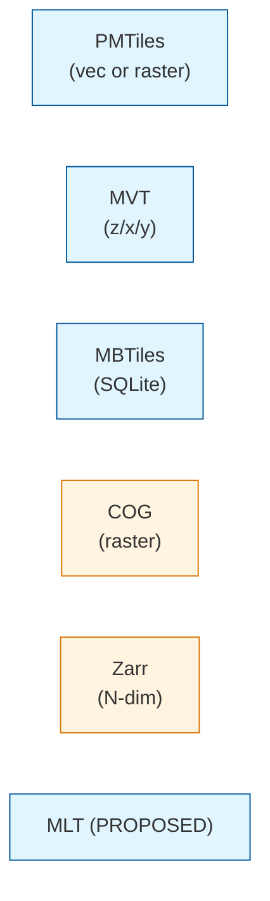

<!-- [KFM_META_BLOCK_V2]
doc_id: kfm://doc/architecture-map-master-tile-artifacts
title: Map Master — Tile Artifacts
type: standard
version: v0.1
status: draft
owners: UI subsystem steward + Release steward · NEEDS VERIFICATION
created: 2026-05-24
updated: 2026-05-24
policy_label: public
related:
  - README.md
  - ../map-shell.md
  - LAYER_LIFECYCLE.md
  - VIEWER_VERIFICATION.md
  - PERFORMANCE_BUDGETS.md
  - ../release-discipline.md
tags: [kfm, architecture, map-master, tiles, pmtiles, mvt, cog, mbtiles, zarr, integrity, doctrine]
notes:
  - PROPOSED. Expands map-shell.md §8 (Object Families at the Shell Boundary).
  - BAO (BLAKE3-BAO) is PROPOSED/INFERRED as the chunk-verification primitive; resolution is an open ADR.
[/KFM_META_BLOCK_V2] -->

<a id="top"></a>

# Map Master — Tile Artifacts

> *The released tile-artifact formats — PMTiles, MVT, MBTiles, COG, Zarr — their sidecars, content-addressed identity (BAO), signatures, and the publication gates they pass through before the renderer is allowed to load them.*


%20·%20PROPOSED%20(formats)-blue)


**Status:** draft · **Owners:** UI subsystem steward + Release steward *(NEEDS VERIFICATION)* · **Last updated:** 2026-05-24

> [!IMPORTANT]
> **A tile is a downstream carrier, not sovereign truth** *(`map-shell.md` §2 Operating Law invariant 5, CONFIRMED)*. PMTiles, MVT, MLT, COG, MBTiles, and Zarr bytes carry release manifests, digests, `EvidenceBundle`s, `PolicyDecision`s, and rollback targets. The renderer loads them only after the viewer-verification gate confirms manifest + signature + policy alignment.

> [!NOTE]
> **This doc is the format catalog and the integrity surface.** Per-format encoders / pipelines live under `tools/` and `data/processed/`; released bytes live under `data/published/tiles/`; manifests live under `release/manifests/`; this doc tells implementers what each artifact must carry and how the viewer reasons about it.

---

## Table of contents

1. [Scope](#1-scope)
2. [Format catalog](#2-format-catalog)
3. [Format — PMTiles](#3-format--pmtiles)
4. [Format — MVT](#4-format--mvt)
5. [Format — MBTiles](#5-format--mbtiles)
6. [Format — COG](#6-format--cog)
7. [Format — Zarr](#7-format--zarr)
8. [Sidecars](#8-sidecars)
9. [Content addressing — BAO](#9-content-addressing--bao)
10. [Signatures and key management](#10-signatures-and-key-management)
11. [Publication gates](#11-publication-gates)
12. [Anti-patterns](#12-anti-patterns)
13. [Open questions and ADR triggers](#13-open-questions-and-adr-triggers)
14. [Related docs](#14-related-docs)
15. [Appendix](#15-appendix)

---

## 1. Scope

This doc enumerates the released tile-artifact formats KFM supports, the sidecar metadata each carries, the content-addressing primitive that pins them, the signature posture that proves authorship, and the publication gates that admit them to `data/published/tiles/`.

> [!TIP]
> **When this doc binds.** Publishing a new tile artifact, evolving an existing format, introducing a new format, or auditing the viewer-side verification path.

[↑ Back to top](#top)

---

## 2. Format catalog

> **Evidence basis:** `map-shell.md` §2 Operating Law invariant 5 *(CONFIRMED)*; §8 Object Families *(PROPOSED — `TileArtifactManifest`)*; §11 *(digest / signature checks, "PMTiles / COG / style assets match `KFMGeoManifest` digests before any render")*.

| Format | Use | Status | Notes |
|---|---|---|---|
| **PMTiles** | Single-file tile archive *(vector or raster)*; range-request streaming. | Primary | Identity by digest of the archive; range-byte pin enables chunk verification. |
| **MVT** | Mapbox Vector Tile inside a tile pyramid *(z/x/y)*. | Allowed | Pyramid layout adds a manifest of tile-set identity; per-tile digests optional. |
| **MBTiles** | SQLite container for tiles; legacy. | Allowed | Whole-file digest; rarely the right choice for new artifacts. |
| **COG** | Cloud-Optimized GeoTIFF for raster pyramids. | Primary *(raster)* | Range-request friendly; whole-file digest + per-IFD pin recommended. |
| **Zarr** | Chunked N-dim arrays for raster stacks / cubes. | Conditional | Per-chunk digests; consolidated metadata required; emerging adoption. |
| **MLT** *(referenced in `map-shell.md` §2)* | Next-gen vector tile *(MapLibre Tile)*. | PROPOSED | Catalog as it stabilizes upstream. |



[↑ Back to top](#top)

---

## 3. Format — PMTiles

| Aspect | Detail |
|---|---|
| Use | Vector or raster, single file, range-request streaming. |
| Identity | `b3:<hex>` digest of the archive; identity also pinned in `TileArtifactManifest`. |
| Sidecar | `<artifact>.tile.json` carrying schema version, layer names, attribute schema ref, projection, zoom levels. |
| Chunk verification | BAO tree *(see [§9](#9-content-addressing--bao))* enables verified range reads; PROPOSED. |
| Mobile posture | Preferred — single archive, low connection count. |
| Renderer admission | Refused if signature missing, digest mismatched, or `MapReleaseManifest` does not list the artifact. |

[↑ Back to top](#top)

---

## 4. Format — MVT

| Aspect | Detail |
|---|---|
| Use | Vector tiles served from a tile pyramid `z/x/y`. |
| Identity | Pyramid-level digest *(manifest hash)*; per-tile digests optional but recommended for sensitive layers. |
| Sidecar | Tileset manifest with `minzoom`/`maxzoom`, projection, attribute schema ref. |
| Chunk verification | Per-tile digest table referenced by the pyramid manifest. |
| Mobile posture | Acceptable; many small requests; consider PMTiles to reduce connection count. |
| Renderer admission | Refused if the tileset manifest is unverified or `MapReleaseManifest` is missing. |

[↑ Back to top](#top)

---

## 5. Format — MBTiles

| Aspect | Detail |
|---|---|
| Use | SQLite container of tile bytes; legacy. |
| Identity | Whole-file digest. |
| Sidecar | Metadata table inside the SQLite plus an external `<artifact>.tile.json`. |
| Chunk verification | Limited — whole-file verification preferred. |
| Mobile posture | Discouraged for new artifacts *(monolithic; less range-friendly)*. |
| Renderer admission | Allowed for migration paths; same manifest + signature gates. |

[↑ Back to top](#top)

---

## 6. Format — COG

| Aspect | Detail |
|---|---|
| Use | Cloud-Optimized GeoTIFF for raster pyramids and continuous fields. |
| Identity | Whole-file `b3:<hex>` digest; per-IFD *(overview-level)* pin recommended. |
| Sidecar | `<artifact>.cog.json` with CRS, datatype, nodata, overview levels, model identity *(if applicable)*. |
| Chunk verification | Range-read verification via per-IFD digests; BAO PROPOSED. |
| Mobile posture | Friendly with proper overviews; budget against decode cost. |
| Renderer admission | Refused if `KFMGeoManifest` *(asset digest manifest)* does not match *(`map-shell.md` §11)*. |

[↑ Back to top](#top)

---

## 7. Format — Zarr

| Aspect | Detail |
|---|---|
| Use | Chunked N-dim arrays for raster stacks, hypercubes, time-varying surfaces. |
| Identity | Consolidated metadata digest + per-chunk digests. |
| Sidecar | Required: `.zmetadata` *(consolidated)* + KFM manifest pinning the consolidation hash. |
| Chunk verification | Per-chunk digests are canonical; BAO PROPOSED for streaming verification. |
| Mobile posture | Use with care; per-chunk request volume can be high. |
| Renderer admission | Conditional — requires `MapReleaseManifest` to enumerate every served chunk-set; raster pyramid adapter renders. |

[↑ Back to top](#top)

---

## 8. Sidecars

> **Evidence basis:** `map-shell.md` §8 *(Object Families — `TileArtifactManifest`, `StyleManifest`, `KFMGeoManifest`)*.

A sidecar is the **released metadata** that travels with the bytes. Sidecars are first-class artifacts; they live alongside the tile bytes under `data/published/tiles/` and are referenced from `TileArtifactManifest`.

| Sidecar | Required fields |
|---|---|
| **Per-artifact** *(`<artifact>.tile.json` / `.cog.json` / `.zarr-meta.json`)* | `format`, `schema_version`, `content_digest`, `signature_ref`, `release_ref`, `policy_label`, `valid_time` *(if temporal)*, `attribute_schema_ref` *(if vector)*. |
| **Per-tileset** | All of the above + `min_zoom`, `max_zoom`, `bounds`, `projection`, per-tile digest table *(if used)*. |
| **Per-release** | Bundle manifest grouping artifacts under a `MapReleaseManifest` — see [`LAYER_LIFECYCLE.md`](LAYER_LIFECYCLE.md). |

> [!IMPORTANT]
> **Sidecars must be present at publication.** A tile artifact whose sidecar is missing fails Gate G; the viewer-verification gate refuses to load it.

[↑ Back to top](#top)

---

## 9. Content addressing — BAO

> **Status:** PROPOSED / INFERRED. BAO *(BLAKE3 verified-streaming tree format)* is the recommended primitive for chunk-verified range reads over PMTiles, COG, and Zarr. Final adoption is an open ADR *(`README.md` §8)*.

| Aspect | Detail |
|---|---|
| What BAO provides | A tree of BLAKE3 hashes over the artifact bytes that lets a viewer verify any range read independently of the whole-file digest. |
| Why it matters | Range-request streaming *(PMTiles, COG, Zarr)* without BAO requires either trusting the server for the range or downloading the whole file to verify. BAO closes that gap. |
| Where the BAO root lives | Sidecar `<artifact>.bao` *(PROPOSED)* alongside the artifact bytes; root hash pinned in `TileArtifactManifest`. |
| Viewer integration | `VIEWER_VERIFICATION.md` — viewer fetches the BAO subtree for the requested range, verifies against the pinned root, then accepts the bytes. |
| Failure path | Chunk mismatch → `DENY` / `ABSTAIN` per `LIFECYCLE_GATES.md`; tile rendering suppressed. |

> [!CAUTION]
> **A whole-file digest is necessary but insufficient for streaming.** Without BAO *(or an equivalent)*, a malicious or corrupted range cannot be detected mid-stream.

[↑ Back to top](#top)

---

## 10. Signatures and key management

| Aspect | Detail |
|---|---|
| Signature scope | Each tile artifact and each sidecar carries a signature over `(content_digest, release_ref, policy_label)`. |
| Algorithm | Ed25519 or Sigstore-class *(PROPOSED — final choice in ADR)*. |
| Key source | KFM release signer; key rotation is automated; rotation events recorded with the manifest. |
| Verification surface | Viewer-verification gate validates signature using a pinned set of public keys distributed with the shell bootstrap. |
| Compromise posture | Signature compromise triggers rollback to prior signed artifacts; `RollbackCard` enumerates affected releases. |

> [!IMPORTANT]
> **Signature ≠ integrity ≠ admission.** A valid signature proves who signed; the digest proves byte-integrity; admission still requires `MapReleaseManifest` + `PolicyDecision`. All three must align.

[↑ Back to top](#top)

---

## 11. Publication gates

> **Evidence basis:** `kfm_unified_doctrine_synthesis.md` §8 *(promotion gates A–G, CONFIRMED)*; `governed-api/LIFECYCLE_GATES.md` *(API-side mapping)*.

| Gate | Tile-artifact admission rule |
|---|---|
| **A — Source admission** | Source feeding the tile is admitted with role and rights. |
| **B — Provenance** | Build pipeline traceable to inputs; receipt present. |
| **C — Sensitivity** | Sensitive geometry masked / generalized / restricted **before** tile generation *(TM-4)*. |
| **D — Validation** | Tile satisfies format invariants; sidecar schema valid; digest computed. |
| **E — Evidence closure** | Layer's claims resolve to `EvidenceBundle`s; closure receipt present. |
| **F — Review** | Where required *(sensitive lanes)*, steward review cleared. |
| **G — Release** | `TileArtifactManifest` written; `MapReleaseManifest` references it; rollback target pinned; signature applied. |

> [!CAUTION]
> **A tile that has not passed Gate G is not a public tile.** The viewer-verification gate refuses to `addSource` regardless of whether the bytes are technically reachable.

[↑ Back to top](#top)

---

## 12. Anti-patterns

| Anti-pattern | Mitigation |
|---|---|
| **Tile published without a sidecar** | Gate G denies; viewer refuses load. |
| **Sidecar pointing to a digest that doesn't match the bytes** | Viewer-verification gate fails; release rolled back. |
| **Range-read PMTiles / COG / Zarr without chunk verification** | Adopt BAO or equivalent; streaming-aware verifier. |
| **Whole-file MBTiles re-encoded in place** | Manifests are immutable; re-encoding is a new release. |
| **Signature compromise handled by silent re-sign** | Rotate, rollback, publish RCA; never silent. |
| **Sensitive geometry generalized in the renderer's style** | Generalize before tile generation; style filters are not geoprivacy *(TM-4)*. |

[↑ Back to top](#top)

---

## 13. Open questions and ADR triggers

| Open item | Class | Suggested ADR title |
|---|---|---|
| **BAO adoption** — BLAKE3-BAO tree as the chunk-verification primitive vs alternatives. | Integrity | "Tile chunk-verification primitive". |
| Signature algorithm — Ed25519 vs Sigstore vs both. | Crypto | "Tile signature algorithm". |
| Sidecar shape stability — single shape across formats vs per-format. | Format | "Tile sidecar shape and home". |
| MLT cataloging — adopt PROPOSED status now or wait for upstream stability? | Format | "MLT cataloging". |
| Zarr conditional admission — explicit allowlist of Zarr profiles? | Format | "Zarr admission profile". |
| Per-tile vs per-tileset signatures for MVT | Crypto | "MVT signature granularity". |

[↑ Back to top](#top)

---

## 14. Related docs

| Reference | Role | Truth label |
|---|---|---|
| `README.md` *(this folder)* | Landing | CONFIRMED doctrine |
| `../map-shell.md` §2, §8, §11 | Spine | CONFIRMED doctrine |
| `LAYER_LIFECYCLE.md` *(sibling)* | Manifests that contain tile artifacts | PROPOSED |
| `VIEWER_VERIFICATION.md` *(sibling)* | The viewer-side gate that uses sidecars + BAO | PROPOSED |
| `PERFORMANCE_BUDGETS.md` *(sibling)* | Decode / streaming budgets per format | PROPOSED |
| `../release-discipline.md` | Release plane that writes manifests | CONFIRMED scaffold |
| `../governed-api/LIFECYCLE_GATES.md` | API-side gate mapping | PROPOSED |
| `kfm_unified_doctrine_synthesis.md` §8 | Promotion gates canonical | CONFIRMED doctrine |
| `data/published/tiles/` | Released bytes home | PROPOSED |
| `release/manifests/` | Release manifest home | PROPOSED |

[↑ Back to top](#top)

---

## 15. Appendix

<details>
<summary><strong>15.1 Format quick-reference</strong></summary>

```text
PMTiles  — single file · vec/raster · range-stream · BAO-friendly
MVT      — z/x/y pyramid · vec · per-tile digests recommended
MBTiles  — SQLite container · legacy · whole-file digest
COG      — raster · range-stream · per-IFD digest · BAO-friendly
Zarr     — N-dim chunks · per-chunk digests · consolidated metadata
MLT      — next-gen vector tile · PROPOSED catalog
```

</details>

<details>
<summary><strong>15.2 Integrity stack — at-a-glance</strong></summary>

```text
content_digest        (b3:<hex>)          whole-artifact byte identity
BAO root              (b3-bao:<hex>)      per-range / per-chunk verification
signature             (ed25519/sigstore)  who signed + over what
release_ref           (manifest URI)      which release admitted it
policy_label          (string)            what posture applies
```

</details>

<details>
<summary><strong>15.3 Truth-label legend</strong></summary>

- **CONFIRMED** — verified this session from attached docs.
- **PROPOSED** — design / placement / inference not yet verified in implementation.
- **INFERRED** — derivable from confirmed evidence but not directly stated.
- **NEEDS VERIFICATION** — checkable, but not yet checked strongly enough to act as fact.

</details>

---

**Related (mini)** · [`README.md`](README.md) · [`../map-shell.md`](../map-shell.md) · [`LAYER_LIFECYCLE.md`](LAYER_LIFECYCLE.md) · [`VIEWER_VERIFICATION.md`](VIEWER_VERIFICATION.md) · [`PERFORMANCE_BUDGETS.md`](PERFORMANCE_BUDGETS.md)

**Last updated:** 2026-05-24 · **Doc version:** v0.1 · **Doc status:** draft · **Path status:** PROPOSED *(OPEN-DR-12 MAP-MASTER)*

[↑ Back to top](#top)
