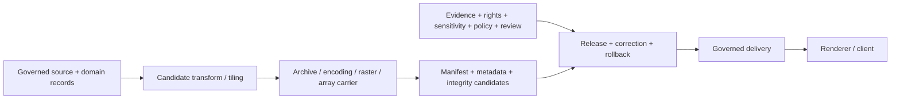
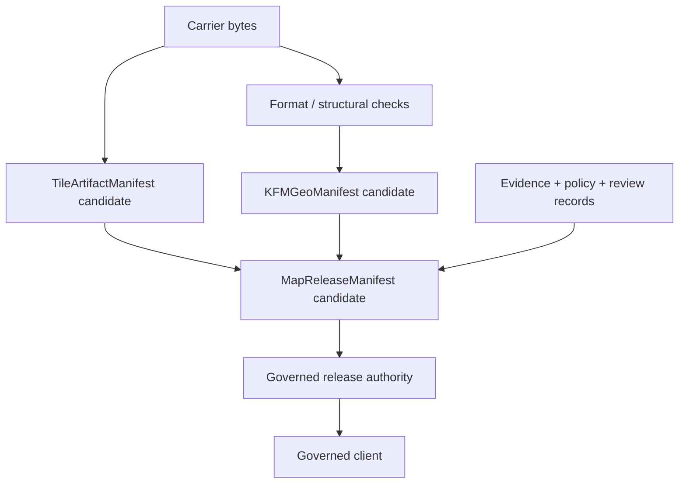

<!-- [KFM_META_BLOCK_V2]
doc_id: kfm://doc/architecture-map-master-tile-artifacts
title: Map Master — Tile Artifacts
type: architecture-reference
version: v1.0
prior_version: v0.1
status: "draft; repository-grounded; mixed-maturity; schema-family-unresolved; no-runtime-admission; no-release; no-publication"
owners:
  - "@bartytime4life — verified CODEOWNERS review route"
  - "NEEDS VERIFICATION — accountable map-artifact, standards, evidence, policy, security, release, runtime, and independent-review stewardship"
created: 2026-05-24
updated: 2026-08-19
policy_label: public
owning_root: docs/
current_path: docs/architecture/map-master/TILE_ARTIFACTS.md
responsibility: >-
  Explain the boundary among tile and raster carrier formats, metadata and
  integrity companions, governed release objects, delivery strategies, and
  renderer admission while accurately recording the repository's current
  fixture-first implementation and unresolved trust-chain holds.
truth_posture: >-
  CONFIRMED current path, accepted Directory Rules placement, repository-present
  PMTiles structural compatibility checks, inactive MVT/COG/carrier profiles,
  fixture-only Zarr metadata profile, proposed manifest contracts, MapLibre
  package scaffold, and absence of an end-to-end public tile release or runtime
  consumer; PROPOSED future format admission, cryptographic binding, hosted
  delivery, browser verification, correction, rollback, and publication;
  UNKNOWN production artifact inventory, deployed behavior, and public use.
evidence_snapshot:
  repository: bartytime4life/Kansas-Frontier-Matrix
  base_ref: main
  base_commit: 2a9a14018ab98bdf9022f7d4fbcd638ca895d0af
  target_prior_blob: e2483c7068c34bd081846a3b09fc9a38c89e4b35
  map_master_readme_blob: e26f81e3452b812b70ef25b4b7f791be72e88154
  directory_rules_blob: fd49a0b83e55cef52c1124281f093e263526898d
  adr_0029_blob: a4de0d7a96b78da59cfc499d1025e1508afd8dd9
  codeowners_blob: dd2a84aa514d8ecd9208bc347f90f9a2ed37dd61
  tile_artifact_schema_blob: ed8fb0834c06a6254d6175f9a08b8d17ccc68d71
  pmtiles_validator_blob: b0d04e37d929538294838141a4e8c1049c98647a
  pmtiles_fixture_readme_blob: a9e8d87db4688c69e88121e15542ac1f3abc7c55
  tile_policy_blob: 5ac2a37d468f99f9195667f723d99b2b7a3325f4
  carrier_readiness_contract_blob: 17055a680b83a4f83834735e88aeb0569322845b
  kfm_geo_manifest_contract_blob: c7993b8bf8fbcbf01f0947a99a14d81509e89370
  map_release_manifest_contract_blob: e2a70bdd659cf432901ee9d5544b8e1418c23e60
  tile_delivery_assessment_contract_blob: 2711141f46744c803ed9cb396134fd26eb35f842
  zarr_metadata_profile_contract_blob: 0f4d974c26dec056acbfdeee413d3f36592ab302
  published_pmtiles_readme_blob: 1b40b18badf10d57ec2cce363770784bae21649e
  open_pull_requests_touching_target_at_preflight: 0
related:
  - README.md
  - RENDERER_BOUNDARY.md
  - LAYER_LIFECYCLE.md
  - VIEWER_VERIFICATION.md
  - PERFORMANCE_BUDGETS.md
  - ../../standards/PMTILES.md
  - ../../standards/MVT.md
  - ../../standards/COG.md
  - ../../doctrine/directory-rules.md
  - ../../adr/ADR-0029-adopt-directory-governance-standard-v2.md
  - ../../adr/ADR-0023-geo-manifest-signs-every-pmtiles-cog-release.md
  - ../../../contracts/release/tile_artifact_manifest.md
  - ../../../contracts/release/geospatial_carrier_readiness.md
  - ../../../contracts/release/tile_delivery_strategy_assessment.md
  - ../../../contracts/release/map_release_manifest.md
  - ../../../contracts/evidence/kfm_geo_manifest.md
  - ../../../contracts/data/stac_zarr_asset_metadata_profile.md
  - ../../../schemas/contracts/v1/map/tile_artifact_manifest.schema.json
  - ../../../tools/validators/pmtiles/validate_attestation_bundle.py
  - ../../../fixtures/pmtiles/attestation/README.md
  - ../../../policy/rego/tiles_publish.rego
  - ../../../packages/maplibre/README.md
  - ../../../data/published/pmtiles/README.md
tags:
  - kfm
  - architecture
  - map-master
  - tile-artifacts
  - pmtiles
  - mvt
  - mbtiles
  - cog
  - zarr
  - mlt
  - integrity
  - evidence
  - release
  - renderer-boundary
notes:
  - "Same-path documentation modernization only; no move, rename, contract, schema, policy, fixture, validator, test, workflow, runtime, data, release, deployment, or publication transition."
  - "The former path-PROPOSED and OPEN-DR-12 posture is stale after accepted ADR-0029; this file remains a canonical human-readable architecture explanation, not an artifact or release authority."
  - "The former BAO/BLAKE3, universal sidecar, automated key-rotation, and viewer-side enforcement statements were proposal-era claims and are now bounded by current repository evidence."
  - "All fifteen numbered legacy sections and the stable document identity are preserved."
[/KFM_META_BLOCK_V2] -->

<a id="top"></a>

# Map Master — Tile Artifacts

> **Purpose.** Explain how KFM distinguishes artifact format, inner tile
> encoding, delivery strategy, metadata and integrity companions, release
> authority, and renderer admission—and state exactly how much of that chain is
> implemented today.


> [!IMPORTANT]
> **A tile, archive, raster, array store, sidecar, digest, signature-shaped
> record, passing fixture, or rendered layer is a downstream carrier—not
> sovereign truth.** Source authority, evidence, rights, sensitivity, policy,
> review, release, correction, withdrawal, and rollback remain separate
> responsibilities.

> [!CAUTION]
> **Current KFM implementation is bounded and uneven.** The repository has
> meaningful no-network structural and metadata profiles for parts of PMTiles,
> MVT, COG, Zarr, map-release declarations, and delivery-strategy assessment.
> It does not establish one canonical `TileArtifactManifest` machine shape, a
> trusted signer, a production artifact inventory, a functioning MapLibre tile
> consumer, deployed Range/CORS behavior, or a governed public tile release.

> [!WARNING]
> **This edition corrects proposal-era overclaims.** Current executable profiles
> use SHA-256 and explicit finite holds. BAO/BLAKE3 verified streaming,
> universal artifact sidecars, automated key rotation, browser-side
> cryptographic verification, and verify-before-`addSource` enforcement are not
> established by the inspected repository.

| Boundary | Current repository-grounded result |
|---|---|
| **Path and responsibility** | `PLACE` at this existing `docs/architecture/map-master/` path under accepted Directory Rules v2 |
| **Tile artifact semantics** | Proposed semantic contract exists under `contracts/release/` |
| **Machine shape** | Existing map-family schema is an open scaffold; canonical schema family remains unresolved |
| **PMTiles** | Split-bundle structural compatibility, partial-read fixtures, and optional declared-manifest checks; cryptographic, policy, release, and runtime holds remain |
| **MVT** | Upstream encoding guidance plus inactive metadata and PMTiles-declaration profiles; no general binary conformance or browser consumer |
| **COG** | Inactive metadata preflight plus synthetic byte-range integrity candidate; no real TIFF/COG conformance or live serving proof |
| **MBTiles** | Inactive local/offline delivery-strategy candidate only; public delivery is denied by that profile |
| **Zarr** | Fixture-only STAC asset metadata projection; no store access, byte verification, renderer, release, or publication |
| **MLT** | Referenced as an upstream encoding option; no accepted KFM profile, producer, consumer, or migration decision established |
| **Map runtime** | `@kfm/maplibre` remains a private `0.0.0` package scaffold with placeholder implementation |
| **Published data lane** | `data/published/pmtiles/` is a format-lane index; its child READMEs do not prove payloads or releases |
| **End-to-end release** | None established |

**Quick navigation:** [Scope](#1-scope) · [Format catalog](#2-format-catalog) · [PMTiles](#3-format--pmtiles) · [MVT](#4-format--mvt) · [MBTiles](#5-format--mbtiles) · [COG](#6-format--cog) · [Zarr](#7-format--zarr) · [Sidecars](#8-sidecars) · [BAO](#9-content-addressing--bao) · [Signatures](#10-signatures-and-key-management) · [Publication](#11-publication-gates) · [Anti-patterns](#12-anti-patterns) · [Open decisions](#13-open-questions-and-adr-triggers) · [References](#14-related-docs) · [Appendix](#15-appendix)

---

<a id="1-scope"></a>

## 1. Scope

This page is the **cross-root architecture explanation** for tile-oriented and
tile-adjacent delivery artifacts. It maps responsibilities and maturity; it
does not define an external format, replace a semantic contract or schema,
evaluate policy, inspect production bytes, approve release, or implement a
renderer.

### 1.1 In scope

- the difference among format, encoding, container, transport, service,
  manifest, integrity proof, release object, and renderer admission;
- the repository's current bounded PMTiles, MVT, COG, MBTiles, Zarr, and MLT
  posture;
- the relationship among `TileArtifactManifest`, `KFMGeoManifest`,
  `MapReleaseManifest`, PMTiles compatibility companions, and format-specific
  integrity candidates;
- fail-closed requirements before any public or semi-public carrier can be
  served;
- correction, withdrawal, cache invalidation, and rollback obligations;
- the implementation and governance gaps that remain explicit `HOLD`s.

### 1.2 Out of scope

- redefining PMTiles, MVT, COG, Zarr, MLT, TIFF, Protobuf, SQLite, HTTP, or
  tile-matrix standards;
- 3D Tiles, scene graphs, point clouds, or renderer-parity decisions;
- GeoParquet and GeoJSON as general analytical or interchange carriers;
- choosing a live source, tiler, CDN, object store, database, endpoint, or
  package version;
- asserting that fixture paths, empty lifecycle lanes, documentation, or green
  workflow results prove production behavior;
- writing artifact bytes, release records, signatures, receipts, proofs, or
  catalog instances into this documentation lane.

### 1.3 Authority split

| Question | Owning authority | Role of this page |
|---|---|---|
| What an external format means | Issuer specification and the relevant KFM standards page | Point to the checked baseline; do not redefine it |
| What a KFM artifact object means | `contracts/` | Explain composition and unresolved boundaries |
| What machine shape is valid | Accepted schema under `schemas/` | Disclose the current open scaffold and bounded profiles |
| What checks execute | Validator, fixture, test, workflow, and exact run evidence | Summarize only the declared checks |
| What is allowed or denied | `policy/`, rights/sensitivity review, and resulting decisions | State prerequisites; do not act as policy |
| Which bytes exist | Governed lifecycle data or artifact storage plus digest records | Never infer payloads from README lanes |
| What is released | Release, correction, withdrawal, and rollback records | Never convert accessibility or visibility into release |
| What a browser may load | Accepted runtime adapter, released refs, policy, and browser evidence | Keep runtime admission on hold without proof |

### 1.4 Directory Rules result

Accepted ADR-0029 makes `docs/architecture/` a canonical human-readable
architecture lane. The convergence plan assigns this exact file `PLACE` at the
same path and requires artifact contracts, schemas, release records, and bytes
to remain in their owning roots. This update therefore changes explanation
only; it creates no parallel artifact, schema, policy, integrity, or release
home.

[Back to top](#top)

---

<a id="2-format-catalog"></a>

## 2. Format catalog

The word **tile** is overloaded. Some rows below are archive containers, some
are inner encodings, some are raster/array carriers, and some are only
candidate future encodings. They do not share one maturity level or one
universal sidecar.

| Surface | Technical role | Current KFM evidence | Current posture |
|---|---|---|---|
| **PMTiles** | Single-file tile archive containing a pyramid of vector or raster payloads | Header/archive checks, PMIDX Merkle and digest reconciliation, shape-only PMSIG and RunReceipt companions, optional PMTiles-v3/MVT manifest declaration, partial-read fixtures | **PARTIAL / structural compatibility only** |
| **MVT** | Vector-tile payload encoding | Fixture-only layer metadata, inactive carrier-readiness declaration, and PMTiles inner-payload compatibility checks | **PROPOSED_INACTIVE / no general binary proof** |
| **MBTiles** | SQLite tile container | Inactive tile-delivery assessment permits it only for local/offline use | **PROPOSED_INACTIVE / local only** |
| **COG** | TIFF/GeoTIFF raster carrier organized for efficient range access | Inactive metadata readiness plus synthetic whole-file and explicit-range SHA-256 candidate | **PROPOSED_INACTIVE / no real TIFF proof** |
| **Zarr** | Chunked multidimensional array/store model | Closed fixture-only STAC Zarr metadata projection for shape, chunks, dimensions, dtype, codecs, and provenance declarations | **PROPOSED_INACTIVE / metadata only** |
| **MLT** | MapLibre vector-tile encoding family | Current standards prose recognizes the upstream distinction from MVT; no dedicated accepted KFM profile or consumer was established | **HOLD / NEEDS VERIFICATION** |

### 2.1 Delivery strategy is a separate decision

The inactive `TileDeliveryStrategyAssessment` keeps delivery needs from
collapsing into a generic "tile format" choice:

| Strategy | Intended declared need | Current limit |
|---|---|---|
| `PMTILES_ARCHIVE` | Immutable, public-safe, versioned archive with Range-capable hosting and no server mediation | Declaration coherence only; no host, bytes, release, or runtime is verified |
| `XYZ_SERVICE` | Mutable tile service with per-tile invalidation | Service behavior and tile bytes are not verified |
| `MARTIN_POSTGIS` | Dynamic query, access control, steward mediation, or PostGIS-backed slicing | No database, policy, credential, service, or deployment is activated |
| `MBTILES_LOCAL` | Local audience with explicit offline requirement | Public delivery is denied by the candidate profile |

### 2.2 Composition model


```mermaid
flowchart LR
  SRC["Governed source + domain records"]
  BUILD["Candidate transform / tiling"]
  CARRIER["Archive / encoding / raster / array carrier"]
  META["Manifest + metadata + integrity candidates"]
  TRUST["Evidence + rights + sensitivity + policy + review"]
  REL["Release + correction + rollback"]
  SERVE["Governed delivery"]
  VIEW["Renderer / client"]

  SRC --> BUILD --> CARRIER --> META
  TRUST --> REL
  META --> REL --> SERVE --> VIEW
```

The diagram shows a dependency order, not current implementation closure. A
carrier can pass a local structural check while every downstream trust and
release step remains held.

[Back to top](#top)

---

<a id="3-format--pmtiles"></a>

## 3. Format — PMTiles

PMTiles is the repository's most developed tile-artifact slice, but its
maturity is **structural compatibility**, not a canonical signed release or a
functioning public map path.

### 3.1 Keep five layers distinct

| Layer | Current meaning |
|---|---|
| **Archive** | PMTiles Version 3 header, directories, metadata, and tile-data layout |
| **Inner payload** | MVT, MLT, PNG, JPEG, WebP, AVIF, or another format declared by the archive |
| **Delivery** | Local file, static/object storage with HTTP Range and CORS, or a server-mediated endpoint |
| **Runtime** | Protocol registration, source construction, decode, style binding, and browser behavior |
| **Governed release** | Evidence, rights, sensitivity, policy, review, proof, release, correction, and rollback closure |

A valid archive does not establish any of the other four layers.

### 3.2 CONFIRMED current structural surface

The current PMTiles compatibility family can:

- generate a minimal synthetic PMTiles v3 archive in a temporary test
  directory;
- inspect header and metadata declarations;
- bind the archive to a PMIDX companion and recompute declared chunk/Merkle
  relationships;
- inspect PMSIG and RunReceipt **subject shape**;
- reconcile archive digest, `spec_hash`, PMIDX root, and companion declarations;
- optionally check a closed PMTiles-v3/MVT declared-manifest compatibility
  profile;
- exercise captured partial-read and synthetic mobile handoff fixtures;
- reject malformed, incomplete, orphaned, duplicate-key, non-finite, oversized,
  symlinked, or payload-embedding candidates.

### 3.3 Explicit holds

| Hold | Meaning |
|---|---|
| `CRYPTOGRAPHIC_VERIFICATION_UNWIRED` | PMSIG shape is inspected; cryptographic trust is not established |
| `POLICY_EVALUATION_NOT_RUN` | Policy source exists, but the compatibility validator does not execute release policy |
| `RANGE_METADATA_NOT_AUTHENTICATED` | Partial-read metadata and captured ranges are not authenticated as a production serving proof |
| `RELEASE_AUTHORIZATION_NOT_EVALUATED` | No release decision is made |
| `TILE_ARTIFACT_MANIFEST_SCHEMA_AUTHORITY_UNRESOLVED` | The optional manifest compatibility shape is not the canonical schema |
| `TILE_MANIFEST_DECLARED_PROVENANCE_UNATTESTED` | Declared producer/source metadata is not authenticated |
| `TILE_MANIFEST_ARTIFACT_REF_REGISTRY_UNRESOLVED` | Digest-bound refs are checked syntactically, not resolved through a registry |

A positive split-bundle result is `STRUCTURAL_PASS`. A positive partial-read
case remains `STRUCTURAL_HOLD`; neither outcome grants render, release, or
public-use authority.

### 3.4 Data-lane and runtime boundary

`data/published/pmtiles/` exists as a format-lane index with domain child
READMEs. Those directories explicitly say that README presence does not prove
PMTiles payloads, release approval, validator coverage, or hosting readiness.

The private `@kfm/maplibre` package remains a `0.0.0` scaffold with a
placeholder export and no established functional consumer. No current
repository evidence proves `pmtiles://` protocol registration, deployed Range
or CORS behavior, cache invalidation, Evidence Drawer integration, or browser
admission.

[Back to top](#top)

---

<a id="4-format--mvt"></a>

## 4. Format — MVT

MVT is an **inner vector-tile encoding**, not a container, URL template,
coordinate system, service, release manifest, or public-safety decision.

### 4.1 Current bounded profiles

| Profile | What it checks | What it does not prove |
|---|---|---|
| Strict fixture `LayerManifest` profile | Declared carrier/source-layer relationships and closed metadata | Production layer or renderer behavior |
| `GeospatialCarrierReadinessCheck` MVT lane | Declared MVT 2.x posture, extent, XYZ scheme, source-layer parity, stable IDs, allowlisted attributes, tile budget, geometry-drop and area-drift declarations, tiler hash, PMTiles/Range posture | Protobuf bytes, source resolution, evidence, policy, release, or rendering |
| PMTiles declared-manifest compatibility | PMTiles v3 + MVT header/metadata/vector-layer declaration agrees with the generated synthetic archive | Canonical MVT or `TileArtifactManifest` conformance |
| Standards page | Upstream MVT 2.1 meaning and KFM boundary | Adoption, implementation, or public release |

### 4.2 Current non-claims

The inspected repository does not establish:

- a general MVT binary parser or conformance validator;
- a production MVT producer;
- source-to-tile semantic parity over representative data;
- a functioning MapLibre vector-source consumer;
- accepted performance budgets;
- a released MVT artifact or public endpoint;
- an accepted MVT-to-MLT migration policy.

### 4.3 Graduation evidence

Before KFM can describe MVT as an active carrier profile, one bounded slice
should prove binary decoding, deterministic generation, stable IDs, geometry
and attribute parity, sensitive-field exclusion before encoding, tile-size and
performance behavior, manifest binding, evidence/policy/review closure,
release/correction/rollback, and a real consumer without bypassing the governed
boundary.

[Back to top](#top)

---

<a id="5-format--mbtiles"></a>

## 5. Format — MBTiles

MBTiles is a SQLite tile container. Current KFM evidence supports only an
**inactive local/offline strategy candidate**, not a public-delivery default.

### 5.1 Current candidate rule

The fixture-first `TileDeliveryStrategyAssessment` selects `MBTILES_LOCAL` only
when:

- the declared audience is local;
- offline operation is explicitly required;
- a tile-artifact manifest reference is present; and
- public delivery is false.

A public MBTiles declaration is a `DENY` in that profile.

### 5.2 What is not established

No current evidence in this architecture review establishes a production
MBTiles artifact, mobile application binding, synchronization protocol,
encryption model, local authorization model, update mechanism, or conversion
pipeline. Whole-file digesting, immutable versioning, and rollback remain
future requirements if an operational offline package is admitted.

### 5.3 Boundary

MBTiles may be useful as a local package. It should not be described as
"legacy but allowed" in a way that implies KFM-wide adoption. Moving from
MBTiles to PMTiles, XYZ, or a mediated service is a delivery and consumer
decision, not a file-extension substitution.

[Back to top](#top)

---

<a id="6-format--cog"></a>

## 6. Format — COG

A Cloud Optimized GeoTIFF is a raster carrier whose internal TIFF organization
supports efficient byte-range access. KFM currently has two useful but
**inactive** candidate profiles.

### 6.1 Current profiles

| Profile | CONFIRMED bounded behavior | Explicit limit |
|---|---|---|
| Geospatial carrier readiness | Checks declared media/extension, internal tiling, block layout, overview declaration, CRS, nodata, compression, Range posture, and STAC raster/projection metadata | Metadata only; does not open TIFF bytes |
| COG byte-range integrity candidate | Replays whole-file and explicit contiguous range SHA-256 values over a synthetic 65-byte payload | Payload is deliberately not a TIFF; range roles are fixture labels |

### 6.2 Missing proof

Current repository evidence does not prove:

- TIFF or BigTIFF parsing;
- OGC COG 1.0 conformance classes;
- internal offset, IFD, tile, strip, overview, mask, CRS, or nodata semantics;
- source-to-COG pixel and mask parity;
- live HTTP Range and CORS behavior;
- authenticated evidence, policy, review, or signing;
- a production COG release, correction, withdrawal, or rollback.

### 6.3 Maturity order

A sound COG graduation should proceed from real binary conformance, through
semantic raster parity and exact-byte identity, to deployed serving probes,
then evidence/policy/review/release closure. A synthetic range digest is useful
test evidence; it is not a substitute for any later layer.

[Back to top](#top)

---

<a id="7-format--zarr"></a>

## 7. Format — Zarr

Zarr is a chunked multidimensional array/store model. It is tile-adjacent when
used to support map-ready raster stacks or time-varying surfaces, but it is not
automatically a browser tile artifact.

### 7.1 Current fixture-only profile

`STACZarrAssetMetadataProfileCandidate` currently projects declared metadata
for one synthetic STAC asset:

- array shape and chunk shape;
- ordered dimension names;
- data type and memory order;
- ordered codec declarations;
- fill value and nodata semantics;
- STAC collection/item/asset identifiers and roles;
- source descriptor, evidence, method, and declaration references;
- deterministic JCS + SHA-256 identity;
- fixed non-effect flags.

The validator checks rank/chunk consistency, ordering, closed fields, and
identity. It does not access a store, resolve the STAC asset, verify bytes,
execute codecs, mutate a catalog, evaluate policy, review, promote, release, or
publish.

### 7.2 Current non-claims

No active Zarr profile, accepted store version, deployment, consolidated
metadata policy, chunk-integrity scheme, public-serving strategy, MapLibre
adapter, raster-pyramid adapter, performance budget, or correction/rollback
path is established by the inspected surfaces.

### 7.3 Admission boundary

A future Zarr carrier needs an explicit use case and profile. It must decide
whether Zarr is an internal processed store, an analytical delivery artifact,
or an input to a separately released raster/tile derivative. Those roles must
not be collapsed.

[Back to top](#top)

---

<a id="8-sidecars"></a>

## 8. Sidecars

"Sidecar" is a convenience term, not one accepted universal KFM object family.
Current repository surfaces deliberately separate structural companions,
semantic manifests, evidence manifests, release envelopes, and assessment
records.

### 8.1 Current object-family map

| Surface | Current status | Responsibility |
|---|---|---|
| **PMIDX** | Structural compatibility companion | Archive chunk/range declarations and Merkle relationships |
| **PMSIG** | Shape-only compatibility companion | Signature-shaped subject; cryptographic verification remains held |
| **PMTiles RunReceipt** | Shape-only compatibility companion | Declared build subject and `spec_hash`; builder authority is not authenticated |
| **`TileArtifactManifest`** | Proposed semantic contract; canonical schema family unresolved | Artifact ref, digest, format, coverage, trust refs, correction, and rollback context |
| **`KFMGeoManifest`** | Proposed fixture-first metadata profile | Cross-format artifact metadata, transform chain, governance refs, and optional local byte binding; fixed non-release state |
| **COG byte-range integrity manifest** | Proposed inactive fixture profile | Whole-payload and explicit-range SHA-256 replay over synthetic bytes |
| **STAC Zarr metadata profile** | Proposed inactive fixture profile | Declared STAC/Zarr shape and provenance projection |
| **`MapReleaseManifest`** | Proposed inactive fixture profile | Map-release closure declarations and correction/rollback state |
| **Tile delivery strategy assessment** | Proposed inactive fixture profile | Review candidate for archive, service, mediation, or offline delivery |

### 8.2 Composition without authority collapse


```mermaid
flowchart TB
  BYTES["Carrier bytes"]
  STRUCT["Format / structural checks"]
  TAM["TileArtifactManifest candidate"]
  GEO["KFMGeoManifest candidate"]
  TRUST["Evidence + policy + review records"]
  MAPREL["MapReleaseManifest candidate"]
  RELEASE["Governed release authority"]
  CLIENT["Governed client"]

  BYTES --> STRUCT
  BYTES --> TAM
  STRUCT --> GEO
  TAM --> MAPREL
  GEO --> MAPREL
  TRUST --> MAPREL
  MAPREL --> RELEASE --> CLIENT
```

No arrow means that the upstream object authorizes the downstream transition.
Each owning authority must validate its own input and preserve separate
records.

### 8.3 Minimum future companion properties

Any future accepted profile should:

- reference payloads rather than embed them;
- use immutable, digest-bound artifact references;
- state format/profile/version and byte size;
- preserve spatial, temporal, source-role, rights, sensitivity, and attribution
  context where applicable;
- reference evidence, policy, review, provenance, correction, and rollback
  objects rather than copying their authority;
- reject floating `latest` identity as the only release pin;
- define canonicalization, ordering, and compatibility rules;
- carry explicit finite state and reason codes;
- remain append-only or superseded rather than silently overwritten.

The exact fields and schema home remain a decision for the contract/schema
owners, not this page.

[Back to top](#top)

---

<a id="9-content-addressing--bao"></a>

## 9. Content addressing — BAO

### 9.1 Corrected current status

**BAO/BLAKE3 verified streaming is not adopted or implemented by the current
tile-artifact profiles inspected for this revision.** The prior edition's
`b3:<hex>`, `b3-bao:<hex>`, `<artifact>.bao`, and browser-verifier language was
a proposal presented too strongly.

### 9.2 CONFIRMED current identity and integrity primitives

| Surface | Current primitive | Scope |
|---|---|---|
| PMTiles split-bundle compatibility | SHA-256 archive/content digests plus PMIDX Merkle relationships | Synthetic/repository-local structural checks |
| PMTiles partial-read compatibility | Captured range and containing-leaf checks | `STRUCTURAL_HOLD`; range metadata remains unauthenticated |
| COG byte-range candidate | Whole-payload and per-range SHA-256 | Synthetic non-TIFF fixture |
| `KFMGeoManifest` | Profile-local sorted compact JSON + SHA-256; optional exact local byte length/digest | Fixture metadata and optional supplied local payload |
| Tile delivery strategy assessment | RFC 8785/JCS + SHA-256 | Deterministic review-candidate identity |
| STAC Zarr metadata profile | RFC 8785/JCS + SHA-256 | Deterministic fixture-record identity |

### 9.3 Whole-file and range integrity are different claims

A whole-file digest can authenticate complete bytes when the full artifact is
available. It does not, by itself, prove that an independently fetched range
belongs to that artifact. A range-aware design may use an authenticated index,
Merkle proof, signed metadata, a trusted service boundary, full-file
verification, or another accepted mechanism. KFM has not selected one universal
mechanism for every carrier.

### 9.4 Decision required before BAO adoption

An ADR or accepted profile should specify:

1. which artifact families require partial-read proofs;
2. the hash and tree formats, canonicalization, chunking, and root identity;
3. how full-file and range commitments compose;
4. how signature and signer authorization bind the commitments;
5. service-side versus browser-side verification ownership;
6. dependency, WASM, CSP, supply-chain, and browser support posture;
7. performance budgets and failure behavior;
8. receipts, telemetry, correction, revocation, and rollback;
9. compatibility and migration from current SHA-256/PMIDX candidates.

Until that decision and implementation evidence exist, BAO remains **PROPOSED /
HOLD**, not a publication requirement or runtime guarantee.

[Back to top](#top)

---

<a id="10-signatures-and-key-management"></a>

## 10. Signatures and key management

### 10.1 Current state

- PMSIG is inspected as a **shape-bearing companion**, not cryptographically
  verified.
- The current PMTiles workflow explicitly checks that the COSE verifier remains
  `--shape-only` and reports cryptographic verification as unwired.
- `policy/rego/tiles_publish.rego` is default-deny and declares that a release
  would require `signature_verified`, approved builder state, rollback
  presence, and resolved policy.
- The inspected PMTiles workflow does not establish evaluator-backed release
  enforcement.
- ADR-0023, which proposes signed PMTiles/COG release binding, remains
  **proposed**.
- No accepted signer registry, trust root, key-custody model, rotation,
  revocation, transparency, or offline-verification profile was established.

### 10.2 Do not collapse these properties

| Property | Question answered | Does not answer |
|---|---|---|
| Digest | Do these complete bytes match the declared value? | Who produced or approved them |
| Range/Merkle commitment | Does this range belong to the committed artifact under the declared scheme? | Whether the scheme or metadata is trusted |
| Signature verification | Did a key sign the declared subject? | Whether the signer was authorized |
| Signer authorization | Was that identity permitted for this role and time? | Whether policy/review/release passed |
| Policy decision | May this audience/use proceed under current facts? | Whether bytes are valid |
| Review record | Did accountable review occur? | Release execution |
| Release record | Was a governed state transition authorized and recorded? | Ongoing serving correctness |

### 10.3 Graduation requirements

A trusted signature path needs an accepted payload/envelope profile, pinned
algorithms and libraries, signer registry, custody and separation of duties,
rotation and revocation, verification behavior, offline/transparency posture,
audit receipts, incident handling, correction/withdrawal propagation, and
rollback rehearsal. Documentation or a shape-valid signature object cannot
supply those controls.

[Back to top](#top)

---

<a id="11-publication-gates"></a>

## 11. Publication gates

No current evidence establishes one dependency-closed tile publication flow
from source admission through a functioning public renderer. The repository has
several **candidate gates**, each with a narrower proof burden.

### 11.1 Current finite profile outcomes

| Profile | Outcomes | A positive result means |
|---|---|---|
| PMTiles split-bundle compatibility | `STRUCTURAL_PASS` / `DENY` plus explicit holds | The synthetic/repository-local structural relationships checked by the validator are coherent |
| PMTiles partial-read compatibility | `STRUCTURAL_HOLD` / denial findings | Captured range structure is coherent enough for continued review |
| Geospatial carrier readiness | `READY` / `HOLD` / `ERROR` | Declared metadata is eligible for stronger checks |
| Tile delivery strategy assessment | `PASS` / `HOLD` / `DENY` / `ERROR` | The declared strategy is locally coherent and ready for human review |
| COG byte-range integrity candidate | `PASS` / `ABSTAIN` / `DENY` / `ERROR` | Synthetic declared ranges and hashes satisfy that inactive profile |
| KFMGeoManifest validator | Pass / findings | Fixture metadata and optional supplied local bytes satisfy the profile |
| MapReleaseManifest validator | Schema/semantic result over fixture records | Release-shaped declarations are internally consistent |

None is a `PolicyDecision`, authenticated review, `PromotionDecision`,
production `ReleaseManifest`, deployment, publication, or public-use grant.

### 11.2 Functional closure required for a public carrier

Before a carrier is eligible for public or semi-public serving, evidence
appropriate to consequence should cover:

1. **Source and rights** — admitted source role, current terms, attribution,
   redistribution, export, and access posture.
2. **Sensitivity and precision** — public-safe fields and geometry transformed
   before artifact generation, with reasons and receipts.
3. **Format and semantic validity** — real bytes, declared format/profile,
   source-to-carrier parity, deterministic identity, and no silent data loss.
4. **Evidence closure** — resolvable evidence for map-visible claims and
   citation behavior.
5. **Policy and review** — evaluated policy, accountable review, conflict and
   exception handling, and separation of duties where required.
6. **Provenance and integrity** — input/output lineage, build receipts,
   exact-byte commitments, and accepted signing/attestation when required.
7. **Catalog and release** — catalog references, immutable release identity,
   correction/supersession/withdrawal state, rollback target, and cache
   invalidation.
8. **Delivery and runtime** — observed host/service behavior, authorization,
   Range/CORS/cache posture, consumer compatibility, visible negative states,
   accessibility, security, and performance.
9. **Operations** — monitoring, incident response, revocation, correction
   propagation, and rollback rehearsal.

### 11.3 Gate-vocabulary hold

The prior edition hard-coded an A–G tile gate sequence and treated Gate G as
operative. This page now records functional closure rather than pretending that
one gate-letter sequence, workflow, and object composition has been accepted
and implemented end to end. Gate naming and ordering belong to the effective
promotion decision and current release workflow.

### 11.4 Runtime effect

Technically reachable bytes are not automatically public KFM artifacts.
Likewise, successful `addSource`, decoding, screenshot generation, or map
visibility would not prove release. A future runtime gate must consume released
references and fail closed with visible `ABSTAIN`, `DENY`, or `ERROR` states;
the current MapLibre scaffold does not implement that path.

[Back to top](#top)

---

<a id="12-anti-patterns"></a>

## 12. Anti-patterns

| Anti-pattern | Why it fails | Corrective posture |
|---|---|---|
| Treating PMTiles, MVT, COG, Zarr, and MLT as one interchangeable format family | They occupy different archive, encoding, raster, array, and runtime roles | Record the exact role and accepted profile |
| Calling a valid archive or raster "released" | Format conformance is not evidence, policy, review, or release | Require independent release closure |
| Treating README-only published lanes as payload inventory | Directory documentation does not prove bytes or approval | Inspect files, manifests, digests, and release records |
| Calling PMSIG cryptographically verified | Current verifier is shape-only | Preserve the cryptographic `HOLD` |
| Calling PMIDX or synthetic range checks BAO | Current profiles do not adopt BAO/BLAKE3 | Name the actual SHA-256/Merkle candidate |
| Requiring one universal sidecar | Current object families have different responsibilities and authority | Compose explicit contracts without collapsing them |
| Letting a style hide sensitive geometry | Encoded bytes may still leak precision or attributes | Generalize, redact, aggregate, or deny before generation |
| Public MBTiles delivery by convenience | Current candidate profile permits local/offline use only | Use a reviewed delivery strategy |
| Floating `latest` as artifact identity | Breaks replay, correction, and rollback | Use immutable version/digest refs; derive aliases from release state |
| Browser verification claims without a consumer | The MapLibre package remains a scaffold | Keep runtime admission on `HOLD` |
| Accessible URL treated as publication | Reachability is not a governed state transition | Resolve release, policy, correction, and rollback records |
| Green fixture or workflow treated as authority | A test proves only its declared behavior | Report bounded proof and retained holds |
| Documentation selecting a schema home | Architecture prose is not machine-shape authority | Resolve through contract/schema governance |
| Silent re-encoding or overwrite | Erases identity and correction lineage | Emit a new candidate/release and preserve supersession |

[Back to top](#top)

---

<a id="13-open-questions-and-adr-triggers"></a>

## 13. Open questions and ADR triggers

| Open item | Current status | Required decision or proof |
|---|---|---|
| Canonical `TileArtifactManifest` schema family | **CONFLICTED / unresolved** | Select map, release, layers, or successor home with compatibility plan |
| Cross-format artifact vocabulary | **PROPOSED** | Decide which artifacts the manifest covers and which need specialized contracts |
| PMTiles companion composition | **PARTIAL** | Reconcile PMIDX, PMSIG, RunReceipt, declared manifest, KFMGeoManifest, and release refs |
| Partial-read integrity primitive | **HOLD** | Decide authenticated PMIDX, BAO, another tree proof, trusted service, or format-specific profiles |
| Signer and attestation profile | **HOLD** | Accept payload/envelope, signer registry, custody, rotation, revocation, and verifier |
| MVT binary conformance profile | **NOT ESTABLISHED** | Implement representative parser/producer/consumer and semantic parity proof |
| COG binary and semantic profile | **NOT ESTABLISHED** | Real TIFF/BigTIFF/COG validation, pixel/mask parity, and serving evidence |
| Zarr role and store profile | **PROPOSED_INACTIVE** | Decide lifecycle role, store/version/codecs, integrity, STAC binding, and delivery |
| MLT adoption and MVT migration | **NEEDS VERIFICATION** | Pin upstream capability, KFM use case, producer/consumer, compatibility, and rollback |
| MBTiles operational profile | **PROPOSED_INACTIVE** | Confirm local/offline consumer, update/security model, and no-public-delivery rule |
| Delivery assessment activation | **PROPOSED_INACTIVE** | Review strategy matrix against real consumers, hosts, mediation, and cache needs |
| Generic published tile lane | **NOT PRESENT at evidence snapshot** | Decide whether format-specific/domain lanes suffice; do not create a parallel artifact root casually |
| Viewer verification ownership | **HOLD** | Decide service-side versus package/browser checks, effects, caching, telemetry, and visible failures |
| MapLibre artifact consumer | **NOT ESTABLISHED** | Implement accepted package dependency, adapter/protocol, tests, and governed call site |
| Release gate vocabulary | **NEEDS VERIFICATION** | Reconcile accepted decisions, current workflows, receipts, and finite outcomes |
| Correction, revocation, and rollback | **NOT PROVEN end to end** | Rehearse alias/cache/client propagation with representative artifacts |
| Accountable stewardship | **NEEDS VERIFICATION** | Name map-artifact, security, policy, release, runtime, and independent reviewers |

A change that accepts one of these decisions belongs in its owning ADR,
contract, schema, policy, implementation, or release surface. Editing this page
cannot accept it.

[Back to top](#top)

---

<a id="14-related-docs"></a>

## 14. Related docs

| Reference | Role | Current reading posture |
|---|---|---|
| [`README.md`](README.md) | Map-master landing page and current runtime evidence | **Repository-grounded** |
| [`RENDERER_BOUNDARY.md`](RENDERER_BOUNDARY.md) | Renderer negative-authority lineage | Retained draft; enforcement claims require current proof |
| [`LAYER_LIFECYCLE.md`](LAYER_LIFECYCLE.md) | Manifest-composition lineage | Retained draft; current contract/schema state outranks stale field tables |
| [`VIEWER_VERIFICATION.md`](VIEWER_VERIFICATION.md) | Proposed viewer gate | No functioning browser verifier established |
| [`PERFORMANCE_BUDGETS.md`](PERFORMANCE_BUDGETS.md) | Repository-grounded fixture-first performance boundary | Production thresholds and operational telemetry remain unresolved |
| [`PMTILES.md`](../../standards/PMTILES.md) | Upstream PMTiles v3 and current KFM compatibility boundary | Repository-grounded standards guidance |
| [`MVT.md`](../../standards/MVT.md) | Upstream MVT 2.1 and current KFM readiness boundary | Repository-grounded standards guidance |
| [`COG.md`](../../standards/COG.md) | OGC COG 1.0 and current KFM profile boundary | Repository-grounded standards guidance |
| [`tile_artifact_manifest.md`](../../../contracts/release/tile_artifact_manifest.md) | Proposed artifact semantic contract | Schema family unresolved |
| [`tile_artifact_manifest.schema.json`](../../../schemas/contracts/v1/map/tile_artifact_manifest.schema.json) | Existing map-family schema | Open scaffold; not meaningful conformance proof |
| [`geospatial_carrier_readiness.md`](../../../contracts/release/geospatial_carrier_readiness.md) | Inactive metadata preflight for COG/MVT/GeoParquet | Fixture-first / no release |
| [`tile_delivery_strategy_assessment.md`](../../../contracts/release/tile_delivery_strategy_assessment.md) | Inactive PMTiles/XYZ/Martin/MBTiles strategy review candidate | Fixture-first / no deployment |
| [`kfm_geo_manifest.md`](../../../contracts/evidence/kfm_geo_manifest.md) | Cross-format fixture metadata and optional local-byte binding | Proposed / no signing or release |
| [`map_release_manifest.md`](../../../contracts/release/map_release_manifest.md) | Fixture-first map-release closure declarations | Proposed inactive |
| [`stac_zarr_asset_metadata_profile.md`](../../../contracts/data/stac_zarr_asset_metadata_profile.md) | Fixture-only Zarr metadata projection | Proposed inactive |
| [`validate_attestation_bundle.py`](../../../tools/validators/pmtiles/validate_attestation_bundle.py) | PMTiles structural compatibility validator | Explicit cryptographic/policy/release holds |
| [`fixtures/pmtiles/attestation/README.md`](../../../fixtures/pmtiles/attestation/README.md) | Synthetic PMTiles mutation descriptors | Structural proof only |
| [`tiles_publish.rego`](../../../policy/rego/tiles_publish.rego) | Default-deny PMTiles publication policy source | Evaluator-backed release enforcement not established here |
| [`packages/maplibre/README.md`](../../../packages/maplibre/README.md) | Package/adapter boundary | Private `0.0.0` scaffold |
| [`data/published/pmtiles/README.md`](../../../data/published/pmtiles/README.md) | Published PMTiles format-lane index | Child READMEs do not prove payloads or releases |
| [`ADR-0023`](../../adr/ADR-0023-geo-manifest-signs-every-pmtiles-cog-release.md) | Proposed PMTiles/COG cryptographic release rule | **Proposed**, not accepted |
| [`ADR-0029`](../../adr/ADR-0029-adopt-directory-governance-standard-v2.md) | Directory placement authority | **Accepted** |

[Back to top](#top)

---

<a id="15-appendix"></a>

## 15. Appendix

<details>
<summary><strong>15.1 Current maturity ladder</strong></summary>

| Level | Capability | Current strongest evidence |
|---:|---|---|
| 0 | Architecture and standards explanation | **CONFIRMED** |
| 1 | Closed synthetic metadata profiles | **CONFIRMED for selected PMTiles/MVT/COG/Zarr surfaces** |
| 2 | Synthetic/local exact-byte and range relationships | **PARTIAL** |
| 3 | Real format conformance over representative artifacts | **NOT ESTABLISHED across the family** |
| 4 | Source-to-carrier semantic parity | **NOT ESTABLISHED end to end** |
| 5 | Evidence, rights, sensitivity, policy, and accountable review closure | **PARTIAL declarations; no integrated authenticated proof** |
| 6 | Trusted signing and signer authorization | **HOLD** |
| 7 | Hosted delivery and functioning renderer consumer | **UNKNOWN / NOT ESTABLISHED** |
| 8 | Governed release, correction, withdrawal, cache invalidation, and rollback | **NOT PROVEN end to end** |
| 9 | Public operation and monitored use | **UNKNOWN** |

</details>

<details>
<summary><strong>15.2 Repository-native validation surfaces</strong></summary>

The following commands are documented by current contracts and workflows. They
are evidence targets for implementation changes; this documentation-only update
does not claim local execution through the GitHub connector.

```bash
KFM_NO_NETWORK=1 python -m unittest -v \
  tests.validators.test_pmtiles_attestation_bundle

KFM_NO_NETWORK=1 python \
  tools/validators/pmtiles/validate_attestation_bundle.py \
  --help

KFM_NO_NETWORK=1 python -m pytest -q \
  tests/release/test_tile_delivery_strategy_assessment.py

KFM_NO_NETWORK=1 python \
  tools/validators/release/validate_tile_delivery_strategy_assessment.py \
  --fixtures

KFM_NO_NETWORK=1 python -m unittest discover \
  --start-directory tests/validators/stac \
  --pattern 'test_stac_zarr_asset_metadata_profile.py' \
  --verbose

KFM_NO_NETWORK=1 python \
  tools/validators/stac/validate_stac_zarr_asset_metadata_profile.py \
  --fixtures
```

COG, KFMGeoManifest, MapReleaseManifest, carrier-readiness, documentation,
link, graph, topology, and aggregate checks remain additional changed-area or
hosted validation surfaces when their files are modified.

</details>

<details>
<summary><strong>15.3 v0.1 claim-correction ledger</strong></summary>

| Prior v0.1 posture | Current correction |
|---|---|
| Existing path labeled `PROPOSED` / `OPEN-DR-12` | Accepted ADR-0029 and the convergence plan support same-path `PLACE` |
| Five formats described as supported `Primary` / `Allowed` | Current evidence is mixed, fixture-first, inactive, or held; no KFM-wide support/adoption claim |
| PMTiles and COG identity fixed to `b3:<hex>` | Current executable profiles use SHA-256 |
| BAO described as the recommended range primitive | BAO remains an unresolved proposal; current PMTiles partial-read fixture explicitly does not adopt it |
| One universal artifact sidecar contract | Current repository has several distinct companion and manifest families |
| Every artifact and sidecar carries a signature | PMSIG is shape-only; no trusted signer path is established |
| Automated key rotation and pinned viewer keys | No accepted key registry, custody, rotation, revocation, or browser verifier is established |
| Viewer verifies signatures and BAO before `addSource` | `packages/maplibre/` remains a scaffold; viewer enforcement is proposed |
| `data/published/tiles/` is the released-byte home | That generic path is absent at the evidence snapshot; `data/published/pmtiles/` exists as an index lane |
| Gate G makes a tile public | No end-to-end active tile release gate was established |
| Zarr is a conditionally admitted renderer artifact | Current proof is a fixture-only STAC Zarr metadata projection |
| MBTiles is broadly allowed as legacy | Current candidate profile limits it to local/offline use and denies public delivery |
| Passing checks imply renderer admission | Current checks retain explicit non-release and no-public-use boundaries |

</details>

<details>
<summary><strong>15.4 Truth-label legend</strong></summary>

- **CONFIRMED** — verified from current repository bytes, tests, workflows, or
  named authoritative source material at the evidence snapshot.
- **PROPOSED** — a design, contract, schema profile, runtime, release rule, or
  future state not established as active behavior.
- **UNKNOWN** — evidence is insufficient for a stronger claim.
- **NEEDS VERIFICATION** — a concrete check can resolve the question.
- **PARTIAL** — bounded proof exists but does not close the full trust chain.
- **HOLD** — prerequisites, authority, evidence, or integration remain
  unresolved.
- **DENY / ABSTAIN / ERROR** — finite policy or runtime outcomes where the
  applicable profile defines them.

</details>

<details>
<summary><strong>15.5 Non-effects and rollback</strong></summary>

This revision does not:

- accept or amend an ADR;
- select a format, hash, tree, signature, signer, schema family, package,
  endpoint, delivery strategy, or public artifact lane;
- change a contract, schema, policy, fixture, validator, test, workflow,
  package, application, data record, receipt, proof, release object, or
  repository setting;
- create or move artifact bytes;
- activate a source, runtime, host, service, release, deployment, or
  publication.

Before merge, rollback is closing the draft pull request and retiring its
branch if appropriate. After an authorized merge, restore prior blob
`e2483c7068c34bd081846a3b09fc9a38c89e4b35` through normal review. No
operational rollback is required because this file is explanatory
documentation only.

</details>

---

**Related:** [`README.md`](README.md) · [`PMTILES.md`](../../standards/PMTILES.md) · [`MVT.md`](../../standards/MVT.md) · [`COG.md`](../../standards/COG.md) · [`tile_artifact_manifest.md`](../../../contracts/release/tile_artifact_manifest.md) · [`VIEWER_VERIFICATION.md`](VIEWER_VERIFICATION.md)

**Last updated:** 2026-08-19 · **Doc version:** v1.0 · **Status:** repository-grounded draft · **Release/publication effect:** none

[Back to top](#top)
