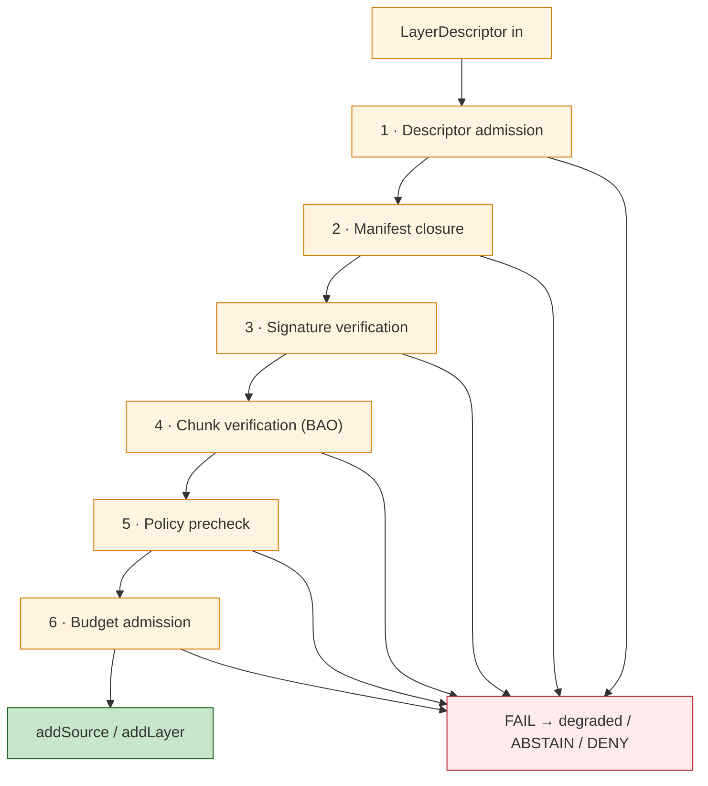

<!-- [KFM_META_BLOCK_V2]
doc_id: kfm://doc/architecture-map-master-viewer-verification
title: Map Master — Viewer Verification
type: standard
version: v0.1
status: draft
owners: UI subsystem steward + Security steward · NEEDS VERIFICATION
created: 2026-05-24
updated: 2026-05-24
policy_label: public
related:
  - README.md
  - ../map-shell.md
  - RENDERER_BOUNDARY.md
  - TILE_ARTIFACTS.md
  - LAYER_LIFECYCLE.md
  - PERFORMANCE_BUDGETS.md
tags: [kfm, architecture, map-master, verification, addSource, fails-closed, doctrine]
notes:
  - PROPOSED. Expands map-shell.md §11 ("No unreleased tile load" — verify-before-addSource) and TM-3.
  - The viewer-side gate: refuses addSource until manifests + signatures + policy + budgets align.
[/KFM_META_BLOCK_V2] -->

<a id="top"></a>

# Map Master — Viewer Verification

> *The viewer-side gate. `addSource` and `addLayer` are refused until `LayerManifest`, `TileArtifactManifest`, `MapReleaseManifest`, and `PolicyDecision` align, signatures verify, and chunk-verified ranges match. Fails closed.*


-blue)


**Status:** draft · **Owners:** UI subsystem steward + Security steward *(NEEDS VERIFICATION)* · **Last updated:** 2026-05-24

> [!IMPORTANT]
> **No `addSource` without the full stack** *(`map-shell.md` TM-3 + §11 "No unreleased tile load", CONFIRMED)*. `LayerManifest`, `TileArtifactManifest`, `MapReleaseManifest`, and `PolicyDecision` all must allow the load. The viewer-verification gate is the runtime expression of that rule and **fails closed** when any check is missing.

> [!NOTE]
> **This doc is the gate-side contract.** Upstream manifests are documented in `LAYER_LIFECYCLE.md`; format-level integrity is in `TILE_ARTIFACTS.md`; this doc tells implementers how the viewer reasons across them on a per-request basis.

---

## Table of contents

1. [Scope](#1-scope)
2. [The verification pipeline](#2-the-verification-pipeline)
3. [Step 1 — Descriptor admission](#3-step-1--descriptor-admission)
4. [Step 2 — Manifest closure](#4-step-2--manifest-closure)
5. [Step 3 — Signature verification](#5-step-3--signature-verification)
6. [Step 4 — Chunk verification (BAO)](#6-step-4--chunk-verification-bao)
7. [Step 5 — Policy precheck](#7-step-5--policy-precheck)
8. [Step 6 — Budget admission](#8-step-6--budget-admission)
9. [Fails-closed semantics](#9-failsclosed-semantics)
10. [Implementation surface](#10-implementation-surface)
11. [Anti-patterns](#11-anti-patterns)
12. [Open questions and ADR triggers](#12-open-questions-and-adr-triggers)
13. [Related docs](#13-related-docs)
14. [Appendix](#14-appendix)

---

## 1. Scope

This doc names the steps the viewer takes between receiving a `LayerDescriptor` and calling `addSource` / `addLayer`. It defines what each step checks, how a check fails, and what the renderer does on failure.

> [!TIP]
> **When this doc binds.** Wiring a new layer into the shell, evolving the manifest stack, adding a new format, profiling verification cost, or auditing the runtime gate.

[↑ Back to top](#top)

---

## 2. The verification pipeline

> **Evidence basis:** `map-shell.md` TM-3, §6 MapRuntimePort, §11 validation requirements *(CONFIRMED rule + PROPOSED interface)*.



| Step | Question | Failure outcome |
|---|---|---|
| 1 | Is the descriptor well-formed? | `ERROR` `schema/invalid-response` *(see `governed-api/ERROR_CODES.md`)* |
| 2 | Are all four manifests resolvable and consistent? | `ABSTAIN` `release/no-manifest` or `release/state-not-published` |
| 3 | Do signatures verify under pinned keys? | `DENY` `policy/integrity-failed` *(PROPOSED)* |
| 4 | Do chunk reads verify against BAO root *(when applicable)*? | `DENY` `policy/integrity-failed` |
| 5 | Does policy permit this audience × posture? | `DENY` `policy/sensitivity` or `policy/fail-closed-lane` |
| 6 | Does the load fit the current budget? | Degrade *(over-budget action; see `PERFORMANCE_BUDGETS.md` §5)*; never silent |

[↑ Back to top](#top)

---

## 3. Step 1 — Descriptor admission

| Aspect | Detail |
|---|---|
| What it checks | `LayerDescriptor` validates against schema; all required refs present *(`layer_manifest_ref`, `style_manifest_ref`, `tile_artifact_manifest_ref`, `map_release_manifest_ref`, `policy_decision_ref`)*. |
| Failure path | `ERROR` envelope; descriptor rejected; renderer logs and surfaces. |
| Receipt | Validation report. |

[↑ Back to top](#top)

---

## 4. Step 2 — Manifest closure

| Aspect | Detail |
|---|---|
| What it checks | All four manifests resolve; `MapReleaseManifest.withdrawn == false` for the layer; release state is `PUBLISHED`; rollback not in progress. |
| Failure path | `ABSTAIN` `release/no-manifest`, `release/state-not-published`, or `release/rollback-in-progress`. |
| Receipt | Release-resolution receipt. |

> [!IMPORTANT]
> **A descriptor that points to a withdrawn manifest is not just "stale"** — it is **withdrawn**. The viewer-verification gate refuses to `addSource` and surfaces the withdrawal badge.

[↑ Back to top](#top)

---

## 5. Step 3 — Signature verification

| Aspect | Detail |
|---|---|
| What it checks | `TileArtifactManifest.signature_ref` verifies over `(content_digest, release_ref, policy_label)` under a pinned KFM public key. `MapReleaseManifest.signature_ref` verifies similarly. |
| Failure path | `DENY` `policy/integrity-failed`. |
| Receipt | Signature-check receipt. |

> [!CAUTION]
> **Signature is the "who"; digest is the "what".** Both are necessary; neither is sufficient alone.

[↑ Back to top](#top)

---

## 6. Step 4 — Chunk verification (BAO)

> **Status:** PROPOSED. See [`TILE_ARTIFACTS.md`](TILE_ARTIFACTS.md) §9 for the BAO primitive.

| Aspect | Detail |
|---|---|
| What it checks | For range-stream formats *(PMTiles, COG, Zarr)*, the viewer fetches the BAO subtree for the requested byte range and verifies against the pinned BAO root. |
| Failure path | `DENY` `policy/integrity-failed` for that chunk; tile rendering suppressed. |
| Receipt | Chunk-verification report; aggregated per session. |
| Performance | Verification cost contributes to the decode budget *(`PERFORMANCE_BUDGETS.md` §2)*. |

[↑ Back to top](#top)

---

## 7. Step 5 — Policy precheck

| Aspect | Detail |
|---|---|
| What it checks | `PolicyDecision` for `(audience_class, sensitivity_posture, layer_id, time)` is `allow`. Sensitive lanes default to `DENY` *(`map-shell.md` §11.3)*. |
| Failure path | `DENY` `policy/sensitivity`, `policy/rights-unknown`, or `policy/fail-closed-lane`. |
| Receipt | `DecisionEnvelope` *(see `governed-api/ENVELOPES.md` §4)*. |
| Re-evaluation | Policy is re-evaluated on audience change *(login / logout / role change)* and on release events. |

[↑ Back to top](#top)

---

## 8. Step 6 — Budget admission

| Aspect | Detail |
|---|---|
| What it checks | Estimated decode / heap / network / concurrency / frame cost fits the current device-class profile *(`PERFORMANCE_BUDGETS.md` §3)*. |
| Failure path | Degraded mode per `PERFORMANCE_BUDGETS.md` §5; e.g., refuse new `addSource` until heap below threshold, render `memory-limited` badge. |
| Receipt | Budget probe sample. |

> [!TIP]
> **Budget admission is the only step that "degrades" rather than fails outright.** Failures in steps 1–5 are hard refusals; step 6 may degrade visibly *(but never silently)*.

[↑ Back to top](#top)

---

## 9. Fails-closed semantics

| Failure surface | Visible state |
|---|---|
| Schema invalid | Layer absent + log + `ERROR` envelope; user-visible toast or status badge. |
| Manifest missing | Layer absent + `ABSTAIN` badge; tooltip explains. |
| Signature invalid | Layer absent + `DENY` badge with integrity classifier; ops alert. |
| Chunk mismatch | Tile suppressed + visible integrity-failure tile; ops alert; layer marked partially-degraded. |
| Policy denial | Layer absent + `DENY` badge with sensitivity classifier; alternative surface link if any. |
| Budget over | Layer present-with-badge or refused-with-badge per category; never silent. |

> [!CAUTION]
> **A "blank map" is not a fail-closed state.** Fail-closed requires explicit, visible state with a reason class — never a silent empty canvas.

[↑ Back to top](#top)

---

## 10. Implementation surface

> **Evidence basis:** `map-shell.md` §6 MapRuntimePort *(PROPOSED)*, §12 Proposed Implementation Homes *(PROPOSED — `packages/maplibre/`)*.

| Implementation question | Recommendation *(PROPOSED)* |
|---|---|
| Where does the gate live? | `packages/maplibre/` — same boundary as the `MapLibreAdapter` *(only module that imports MapLibre runtime APIs)*. |
| In-process or worker? | Recommend Web Worker for cryptographic verification *(signature + BAO)*; in-process for descriptor / manifest checks. |
| WASM verifier | BLAKE3 + Ed25519 in WASM for speed; preloaded on shell bootstrap. |
| Cache | Verified-tile cache keyed by `content_digest`; invalidated on release events. |
| Telemetry | Verification probe emits per-step success / failure counters; bounded labels. |

[↑ Back to top](#top)

---

## 11. Anti-patterns

| Anti-pattern | Mitigation |
|---|---|
| **`addSource` called without invoking the gate** | Lint: only the verified-source path may call MapLibre runtime APIs. |
| **Step skipped under load** | No skip: degraded mode happens **at step 6 only**; steps 1–5 are hard. |
| **Cached verification reused across releases** | Cache keyed by `content_digest`; release events invalidate. |
| **"Soft" signature failure** *(warn-and-continue)* | Signature failures are hard `DENY`; no warn-and-continue. |
| **Chunk-verification budget exceeded → silent skip** | Skipping verification is a `DENY`, not a degrade. |
| **Policy precheck bypassed for "trusted" layers** | No "trusted" bypass; policy applies uniformly. |
| **Blank map presented as no-data** | Fail-closed requires visible state with reason class. |

[↑ Back to top](#top)

---

## 12. Open questions and ADR triggers

| Open item | Class | Suggested ADR title |
|---|---|---|
| WASM verifier in `packages/maplibre/` vs service-side proxy? | Implementation | "Viewer verification implementation surface". |
| Web Worker mandatory for cryptographic verification or only when budget permits? | Performance | "Verification process boundary". |
| Verification cache TTL and invalidation triggers — release-event-only or also time-bound? | Cache | "Verification cache invalidation". |
| Should chunk-verification failures auto-rollback the layer, or remain per-chunk degraded? | Operational | "Chunk-failure rollback policy". |
| Per-step receipt persistence — local-only or telemetry sink? | Receipts | "Verification receipt persistence". |

[↑ Back to top](#top)

---

## 13. Related docs

| Reference | Role | Truth label |
|---|---|---|
| `README.md` *(this folder)* | Landing | CONFIRMED doctrine |
| `../map-shell.md` TM-3, §6, §11, §11.3 | Spine | CONFIRMED doctrine |
| `RENDERER_BOUNDARY.md` *(sibling)* | Boundary the gate enforces | PROPOSED |
| `TILE_ARTIFACTS.md` *(sibling)* | Sidecars, signatures, BAO | PROPOSED |
| `LAYER_LIFECYCLE.md` *(sibling)* | The four manifests | PROPOSED |
| `PERFORMANCE_BUDGETS.md` *(sibling)* | Step 6 budget admission | PROPOSED |
| `../governed-api/ENVELOPES.md` | `DecisionEnvelope` returned by policy precheck | PROPOSED |
| `../governed-api/ERROR_CODES.md` | Error / abstain codes the gate emits | PROPOSED |
| `../governed-api/LIFECYCLE_GATES.md` | API-side gate mapping mirrors viewer-side | PROPOSED |
| `kfm_unified_doctrine_synthesis.md` §11 | Finite outcomes | CONFIRMED doctrine |

[↑ Back to top](#top)

---

## 14. Appendix

<details>
<summary><strong>14.1 Verification pipeline — at-a-glance</strong></summary>

```text
LayerDescriptor in
        │
        ▼
  1 · descriptor admission          (schema)        → ERROR on fail
        │
        ▼
  2 · manifest closure              (4 manifests)   → ABSTAIN on fail
        │
        ▼
  3 · signature verification        (Ed25519)       → DENY on fail
        │
        ▼
  4 · chunk verification            (BAO)           → DENY on fail
        │
        ▼
  5 · policy precheck               (PolicyDecision)→ DENY on fail
        │
        ▼
  6 · budget admission              (probes)        → degrade visibly
        │
        ▼
  addSource / addLayer (only here)
```

</details>

<details>
<summary><strong>14.2 Truth-label legend</strong></summary>

- **CONFIRMED** — verified this session from attached docs.
- **PROPOSED** — design / placement / inference not yet verified in implementation.
- **INFERRED** — derivable from confirmed evidence but not directly stated.
- **NEEDS VERIFICATION** — checkable, but not yet checked strongly enough to act as fact.

</details>

---

**Related (mini)** · [`README.md`](README.md) · [`../map-shell.md`](../map-shell.md) · [`RENDERER_BOUNDARY.md`](RENDERER_BOUNDARY.md) · [`TILE_ARTIFACTS.md`](TILE_ARTIFACTS.md) · [`LAYER_LIFECYCLE.md`](LAYER_LIFECYCLE.md) · [`PERFORMANCE_BUDGETS.md`](PERFORMANCE_BUDGETS.md) · [`../governed-api/ERROR_CODES.md`](../governed-api/ERROR_CODES.md)

**Last updated:** 2026-05-24 · **Doc version:** v0.1 · **Doc status:** draft · **Path status:** PROPOSED *(OPEN-DR-12 MAP-MASTER)*

[↑ Back to top](#top)
