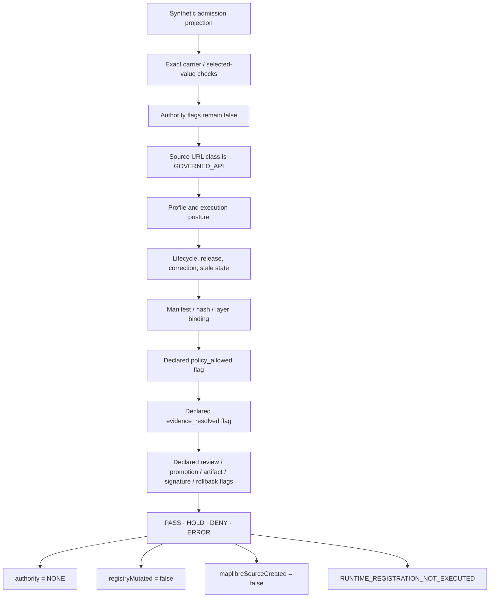

<!-- [KFM_META_BLOCK_V2]
doc_id: kfm://doc/architecture-map-master-viewer-verification
title: Map Master — Viewer Verification
type: architecture-reference
version: v2.0-draft
status: draft; repository-grounded; fixture-only-admission; renderer-hold; non-publisher
owners:
  - "@bartytime4life — verified CODEOWNERS review route"
  - "NEEDS VERIFICATION — independent UI, security, map-runtime, layer, evidence, policy, release, accessibility, and operations stewardship"
created: 2026-05-24
updated: 2026-08-19
policy_label: public; architecture; map-master; viewer-verification; fail-closed; no-release; no-publication
owning_root: docs/
responsibility: Explain the current fixture-only LayerManifest runtime-admission projection, its exact finite outcomes and non-effects, the absent viewer loader and verification surfaces, and the evidence required before any governed renderer source may be created.
truth_posture: cite-or-abstain; current-state claims are pinned to repository evidence; target runtime, policy, cryptographic, release, deployment, and public-operation claims remain visibly bounded
current_path: docs/architecture/map-master/VIEWER_VERIFICATION.md
evidence_snapshot:
  repository: bartytime4life/Kansas-Frontier-Matrix
  base_ref: main
  base_commit: eded2a83abfbb2e977b120c58cf4d0423d6aab96
  target_prior_blob: 40d4e4ab96eb784d7cf219dffaaf14ae742c9a40
  directory_rules_blob: fd49a0b83e55cef52c1124281f093e263526898d
  directory_rules_decision: ADR-0029 accepted
  layer_manifest_contract_blob: 234dca70e768ee744f7d78109afc6e0dc745af1b
  runtime_admission_contract_blob: 82dc8fc1bf84eb0f8114aed7170d8686ae31ab60
  runtime_admission_evaluator_blob: 895100728c9eb676b9e2aef84680073142694b27
  runtime_admission_fixture_blob: f2b743cda8b16e747b918b8ea3bda9ef9ae911fe
  runtime_admission_test_blob: d3bd228588304f31ed709b186c87be916a2a2f25
  runtime_admission_workflow_blob: a39da8f0c678a1fda809d6566cb96549eee73be8
  runtime_admission_receipt_blob: 457ff67b8cc45bc90d52a50a0e3dbd29048b1f3d
  governed_layers_route_blob: eaddcc9bfe066aea29178f3973275bd7e0932284
  explorer_package_blob: ddd201b74a06001d84a14bf54ac62a6cc3607a29
  explorer_maplibre_adapter_blob: 663ba0f7a05498948f67d644387c73ab19d5c16c
  maplibre_package_manifest_blob: b0582955feeb51016327113692fa5c98ecad8816
  performance_budgets_blob: c800cdd8d622ca2a4596cf80e9951f241fc70187
  renderer_boundary_blob: 628872aa58f9f86e31337924025a8590405385b5
  layer_lifecycle_blob: 630557b79421e70033a9a2d906c3c472be714ecb
  tile_artifacts_blob: f68bf295761711e1cec6046c2ea0f54564a0d4a4
related:
  - README.md
  - ../map-shell.md
  - ../ui/LAYERING.md
  - RENDERER_BOUNDARY.md
  - TILE_ARTIFACTS.md
  - LAYER_LIFECYCLE.md
  - PERFORMANCE_BUDGETS.md
  - ../../doctrine/directory-rules.md
  - ../../adr/ADR-0029-adopt-directory-governance-standard-v2.md
  - ../../../contracts/data/layer_manifest.md
  - ../../../contracts/runtime/layer_manifest_admission.md
  - ../../../apps/explorer-web/src/features/map_runtime/layer_manifest_admission.ts
  - ../../../fixtures/runtime/layer_manifest_admission/cases.json
  - ../../../apps/explorer-web/tests/layer-manifest-admission.test.ts
  - ../../../policy/layers/README.md
  - ../../../apps/governed-api/src/governed_api/routes/layers.py
tags: [kfm, architecture, map-master, verification, layer-manifest, runtime-admission, fail-closed, maplibre, evidence, policy, release, rollback]
notes:
  - "v2.0-draft replaces an asserted active verify-before-addSource pipeline with the current fixture-only, no-side-effect admission projection."
  - "The implemented evaluator returns PASS, HOLD, DENY, or ERROR over one synthetic closed projection; PASS means registration eligibility only and always retains RUNTIME_REGISTRATION_NOT_EXECUTED."
  - "No live LayerDescriptor resolver, registry mutation, MapLibre source creation, policy evaluation, signature or carrier-byte verification, BAO range verification, budget gate, released-layer loader, deployment, release, or publication is established."
  - "The document path, doc_id, H1, top anchor, and every prior numbered section fragment are retained."
[/KFM_META_BLOCK_V2] -->

<a id="top"></a>
<a id="map-master--viewer-verification"></a>

# Map Master — Viewer Verification

> **Operating rule.** A browser renderer may consume only governed responses or already released, public-safe carriers after the applicable evidence, policy, review, release, integrity, correction, and rollback state is resolved. The current repository proves a fixture-only admission classifier—not a viewer loader, `addSource` gate, or released-layer flow.


| Field | Current bounded result |
|---|---|
| **Evidence snapshot** | `main@eded2a83abfbb2e977b120c58cf4d0423d6aab96` |
| **Document role** | Human-readable architecture reference; not a contract, schema, policy rule, runtime gate, release record, or publication authority |
| **Placement authority** | **CONFIRMED:** accepted [ADR-0029](../../adr/ADR-0029-adopt-directory-governance-standard-v2.md) adopts [Directory Rules v2](../../doctrine/directory-rules.md); this existing `docs/architecture/map-master/` path has placement outcome `PLACE` |
| **Current executable proof** | **CONFIRMED / BOUNDED:** a no-network TypeScript evaluator, 13 synthetic cases, three Vitest tests, and a path-scoped read-only workflow |
| **Current positive result** | `PASS / LAYER_MANIFEST_REGISTER_ELIGIBLE` means only that the synthetic projection is eligible for a later governed registration step |
| **Mandatory non-effects** | Every result has `authority: "NONE"`, `registryMutated: false`, `maplibreSourceCreated: false`, and hold `RUNTIME_REGISTRATION_NOT_EXECUTED` |
| **Layer policy** | **INACTIVE:** the local Rego lane is a no-op proposed stub with no bound evaluator or governed consumer |
| **Governed `/layers` route** | **ABSTAIN-only:** the current route returns the shared finite abstention envelope; it does not resolve or serve layers |
| **Concrete renderer** | **HOLD:** Explorer does not declare `maplibre-gl`; `packages/maplibre/` is a private `0.0.0` scaffold; `MapLibreAdapter.ts` is comment-only |
| **Live viewer verification** | **NOT ESTABLISHED:** no real descriptor resolver, manifest resolver, signature verifier, carrier-byte verifier, BAO verifier, policy engine, budget gate, registry mutation, `addSource`, or `addLayer` path is proved |
| **Release / deployment / publication** | None established by this page or the bounded evaluator |

> [!IMPORTANT]
> **A fixture `PASS` is not approval.** It is not evidence resolution, policy permission, authenticated review, artifact or signature verification, release authorization, public-use authorization, registry mutation, MapLibre source creation, deployment, or publication.

> [!CAUTION]
> **The former six-step runtime pipeline was proposal-era architecture.** Current code checks declared fields in one synthetic projection. It does not fetch or authenticate the referenced objects those fields name. Sections 3–8 retain the prior stable fragments while separating implemented checks from the operational target.

> [!WARNING]
> **Style is not access control.** Hidden layers, filters, opacity, zoom thresholds, disabled popups, and a blank canvas do not protect sensitive geometry or fields already delivered to a browser. Redaction, generalization, aggregation, withholding, or denial must happen before public delivery.

---

## Table of contents

0. [Current repository evidence](#0-current-repository-evidence)
1. [Scope](#1-scope)
2. [The verification pipeline](#2-the-verification-pipeline)
3. [Step 1 — Descriptor admission](#3-step-1--descriptor-admission)
4. [Step 2 — Manifest closure](#4-step-2--manifest-closure)
5. [Step 3 — Signature verification](#5-step-3--signature-verification)
6. [Step 4 — Chunk verification (BAO)](#6-step-4--chunk-verification-bao)
7. [Step 5 — Policy precheck](#7-step-5--policy-precheck)
8. [Step 6 — Budget admission](#8-step-6--budget-admission)
9. [Fails-closed semantics](#9-fails-closed-semantics)
10. [Implementation surface](#10-implementation-surface)
11. [Anti-patterns](#11-anti-patterns)
12. [Open questions and ADR triggers](#12-open-questions-and-adr-triggers)
13. [Related docs](#13-related-docs)
14. [Appendix](#14-appendix)
15. [Change, correction, and rollback](#15-change-correction-and-rollback)

---

<a id="0-current-repository-evidence"></a>

## 0. Current repository evidence

### 0.1 What changed since v0.1

The prior page described a viewer-side gate as though it already sat between a `LayerDescriptor` and MapLibre's `addSource` / `addLayer` calls. The current tree establishes a narrower state:

1. [`contracts/runtime/layer_manifest_admission.md`](../../../contracts/runtime/layer_manifest_admission.md) defines a **proposed-inactive, fixture-only** eligibility projection.
2. [`layer_manifest_admission.ts`](../../../apps/explorer-web/src/features/map_runtime/layer_manifest_admission.ts) implements a pure evaluator over that synthetic projection.
3. [`cases.json`](../../../fixtures/runtime/layer_manifest_admission/cases.json) declares 13 deterministic positive and negative cases.
4. [`layer-manifest-admission.test.ts`](../../../apps/explorer-web/tests/layer-manifest-admission.test.ts) replays the cases and proves the module contains no transport, MapLibre import, `addSource`, or registry-mutation shortcut.
5. [The focused workflow](../../../.github/workflows/layer-manifest-admission.yml) builds Explorer, runs the focused test, and validates the implementation packet's generated receipt.
6. The current [`/layers` route](../../../apps/governed-api/src/governed_api/routes/layers.py) still returns an `ABSTAIN` stub.
7. The current [`MapLibreAdapter.ts`](../../../apps/explorer-web/src/adapters/MapLibreAdapter.ts) is one comment; the private [`@kfm/maplibre`](../../../packages/maplibre/package.json) package is a `0.0.0` scaffold.
8. Repository search found no functioning `addSource` call path; the focused test explicitly asserts that the evaluator source does not contain one.

The safe current conclusion is therefore **fixture-only runtime-admission classification plus explicit non-effects**. A viewer loader remains a future, dependency-closed implementation slice.

### 0.2 Evidence matrix

| Surface | CONFIRMED current evidence | Safe interpretation |
|---|---|---|
| [`LayerManifest` contract](../../../contracts/data/layer_manifest.md) | Draft dual-profile contract; strict profile is `PROPOSED_INACTIVE` / `FIXTURE_ONLY`; live registry, runtime loader, reference resolution, policy/review execution, signing, release, publication, and public-use effects are all absent | Local candidate meaning and validation only |
| Runtime-admission contract | `PASS` means eligible for a later governed loader; no registry mutation or MapLibre source | Proposed semantic boundary for the fixture |
| Evaluator | Exact-key parse plus selected deterministic checks; finite `PASS / HOLD / DENY / ERROR` result | Bounded pure classifier |
| Fixtures | One positive and 12 negative cases | Declared synthetic coverage, not production data |
| Tests | Three Vitest tests; exact outcome replay, exact no-side-effect result, and static forbidden-token checks | Bounded behavior proof |
| Workflow | Read-only, path-scoped orchestration for the implementation packet | CI orchestration; no authority or public effect |
| Existing generated receipt | Binds the five implementation artifacts; human review remains pending | Authoring provenance, not release proof |
| Layer policy | Proposed no-op Rego stub; no evaluator, bundle, reason, obligation, or consumer binding | Operational policy remains `HOLD` |
| Governed route | Shared `ABSTAIN` response | Containment, not layer delivery |
| Explorer shell | Executable synthetic map-evidence composition | No real basemap, released layer, or MapLibre boot |
| Renderer package and adapter | Private scaffold plus comment-only adapter | Renderer runtime remains `HOLD` |
| This architecture page | Existing human documentation path | May explain evidence; cannot create the missing behavior |

### 0.3 Adjacent documentation reconciliation

The same-day map-master modernization chain has now grounded several sibling pages in current repository evidence:

| Surface | Current contribution to viewer verification | Current disposition |
|---|---|---|
| [`RENDERER_BOUNDARY.md`](RENDERER_BOUNDARY.md) | Preserves the seven negative authorities, records renderer-neutral bounded slices, and keeps concrete MapLibre admission/runtime on hold | **CURRENT adjacent reconciliation**; it no longer claims this page is an active `addSource` gate |
| [`LAYER_LIFECYCLE.md`](LAYER_LIFECYCLE.md) | Separates candidate validation, runtime eligibility, release readiness, decision, transition application, public serving, correction, withdrawal, and rollback | **CURRENT adjacent reconciliation**; the object families remain mixed-maturity |
| [`TILE_ARTIFACTS.md`](TILE_ARTIFACTS.md) | Grounds bounded PMTiles/MVT/COG/Zarr and delivery-profile evidence, while explicitly holding trusted signing, BAO/BLAKE3 streaming, browser cryptographic verification, runtime admission, release, and publication | **CURRENT adjacent reconciliation** |
| [`PERFORMANCE_BUDGETS.md`](PERFORMANCE_BUDGETS.md) | Grounds separate mobile-PMTiles, rendering-resource-envelope, and public-map-service-SLO fixture families while keeping production thresholds and operational telemetry on hold | **CURRENT adjacent reconciliation**; none of those bounded profiles is integrated into this admission evaluator |
| [`README.md`](README.md) | Preserves the lane-wide renderer/runtime hold and classifies this page as draft guidance; some child summaries predate the same-day sibling modernizations | **CURRENT entry point with bounded summary lag** |
| [`ui/LAYERING.md`](../ui/LAYERING.md) | Records the exact fixture-only admission, inactive policy, abstain route, synthetic shell, and renderer hold | **CURRENT adjacent reconciliation** |

This update consumes those corrected boundaries without rewriting their owning pages or turning any bounded fixture into an operational viewer gate.

[Back to top](#top)

---

<a id="1-scope"></a>

## 1. Scope

This page explains the boundary between a governed layer candidate and a future renderer-source creation step. It has two distinct responsibilities:

1. describe the **current fixture-only admission projection** exactly; and
2. define the **evidence burden** required before KFM may claim a real viewer-verification gate.

### 1.1 In scope

- Exact current evaluator inputs, decision order, outcomes, reason codes, and non-effects.
- Current fixture and test coverage.
- Separation among declared flags, resolved references, verified bytes, authenticated actors, policy decisions, release decisions, and public use.
- Current renderer, policy, governed-route, and shell maturity.
- Fail-closed handling of candidate, stale, withdrawn, superseded, unresolved, denied, mismatched, internal-source, authority-overclaiming, and invalid inputs.
- Requirements for future signature, carrier-byte, range-proof, policy, budget, registry, renderer, correction, rollback, accessibility, and operational closure.
- Stable compatibility with the prior numbered section fragments.

### 1.2 Out of scope

This page does not:

- define or change `LayerManifest`, `LayerDescriptor`, tile-artifact, release-manifest, policy-decision, review, correction, or rollback semantics;
- select a canonical layer contract or schema lane;
- accept [ADR-0001](../../adr/ADR-0001-schema-home--schemas-contracts-v1-is-canonical.md), [ADR-0005](../../adr/ADR-0005-apps-explorer-web-is-the-canonical-map-first-shell.md), [ADR-0006](../../adr/ADR-0006-maplibre-boundary--only-maplibreadapter-imports-maplibre.md), or [ADR-0007](<../../adr/ADR-0007 — MapLibre GL JS Is the Sole Browser-Side Renderer.md>);
- activate `policy/layers/`, authenticate a reviewer, or evaluate an operative policy bundle;
- resolve references, read carrier bytes, verify a signature, validate a BAO proof, or measure a browser budget;
- create or mutate a layer registry;
- install or pin MapLibre, implement `MapLibreAdapter`, or call `addSource` / `addLayer`;
- approve, release, deploy, publish, correct, withdraw, supersede, or roll back a layer;
- treat documentation, a fixture, a green workflow, or a rendered preview as authority.

### 1.3 Authority by question

| Question | Controlling evidence |
|---|---|
| Where does this page belong? | Accepted ADR-0029, adopted Directory Rules v2, and the existing `docs/architecture/map-master/` lane |
| What does a layer object mean? | Its semantic contract under `contracts/` |
| What machine shape is valid? | The exact paired schema and registered validator profile |
| What may an operation do? | Applicable policy, authenticated caller, purpose, audience, rights, sensitivity, review, release, correction, and rollback context |
| What exists now? | Pinned repository code, fixtures, tests, workflows, records, and runtime evidence |
| Is a layer released? | A governed release decision and active release state—not a field named `release_state` supplied by an untrusted client |
| May a browser receive it? | A governed response or already released public-safe carrier with enforceable obligations |
| Does a map render prove the claim? | No; rendered properties are candidate context for governed evidence resolution |

### 1.4 Directory Rules basis

For this same-path documentation change:

| Responsibility-signature axis | Value |
|---|---|
| `artifact_kind` | Human architecture document |
| `authority_owner` | `docs/` |
| `scope_kind` | Cross-cutting map/viewer verification boundary |
| `exposure` | Public documentation |
| `mutability` | Versioned replacement |
| `retention` | Durable |
| `placement_outcome` | `PLACE` |

The page may point to contracts, schemas, policy, application code, fixtures, tests, workflows, receipts, release records, and public carriers. It does not own or duplicate them.

[Back to top](#top)

---

<a id="2-the-verification-pipeline"></a>

## 2. The verification pipeline

### 2.1 Current implemented projection

The current evaluator is a pure function over one synthetic object. It does not receive a `LayerDescriptor`, call a governed service, resolve refs, or create a renderer source.


```mermaid
flowchart TB
  IN["Synthetic admission projection"] --> PARSE["Exact carrier / selected-value checks"]
  PARSE --> AUTH["Authority flags remain false"]
  AUTH --> SOURCE["Source URL class is GOVERNED_API"]
  SOURCE --> PROFILE["Profile and execution posture"]
  PROFILE --> STATE["Lifecycle, release, correction, stale state"]
  STATE --> BIND["Manifest / hash / layer binding"]
  BIND --> POLICY["Declared policy_allowed flag"]
  POLICY --> EVIDENCE["Declared evidence_resolved flag"]
  EVIDENCE --> CLOSURE["Declared review / promotion / artifact / signature / rollback flags"]
  CLOSURE --> RESULT["PASS · HOLD · DENY · ERROR"]

  RESULT --> NONE["authority = NONE"]
  RESULT --> NOREG["registryMutated = false"]
  RESULT --> NOMAP["maplibreSourceCreated = false"]
  RESULT --> HOLD["RUNTIME_REGISTRATION_NOT_EXECUTED"]
```

The evaluator's positive path is:

```text
synthetic projection
  -> selected deterministic checks pass
  -> PASS / LAYER_MANIFEST_REGISTER_ELIGIBLE
  -> registrationEligible = true
  -> authority remains NONE
  -> registry mutation remains false
  -> MapLibre source creation remains false
  -> RUNTIME_REGISTRATION_NOT_EXECUTED remains present
```

### 2.2 Target operational flow

A credible future viewer-verification flow requires separate authoritative components. This diagram is a **PROPOSED graduation sequence**, not current runtime behavior.


```mermaid
flowchart LR
  A["Governed layer response"] --> B["Contract + schema validation"]
  B --> C["Role-specific reference resolution"]
  C --> D["Carrier-byte and signature verification"]
  D --> E["Policy evaluation + obligations"]
  E --> F["Authenticated review + release state"]
  F --> G["Correction / withdrawal / rollback check"]
  G --> H["Device and runtime budget admission"]
  H --> I["Accountable registration decision"]
  I --> J["Registry mutation"]
  J --> K["MapRuntimePort / renderer adapter"]
  K --> L["addSource / addLayer"]

  classDef hold fill:#fff4e0,stroke:#d97706;
  C:::hold
  D:::hold
  E:::hold
  F:::hold
  G:::hold
  H:::hold
  I:::hold
  J:::hold
  K:::hold
  L:::hold
```

Everything after local candidate classification remains `HOLD` until the relevant contract, implementation, tests, authority, and operational evidence exist.

### 2.3 Anti-collapse rule

The following states are not interchangeable:

| State | What it can establish | What it cannot establish |
|---|---|---|
| Field is present | Local carrier declares a value | Referenced object exists |
| Reference has correct syntax | Identifier matches a pattern | Identifier resolves to the intended object |
| Reference resolves | Object can be retrieved | Object is authentic, current, or admissible |
| Digest is declared | Claimed identity exists | Carrier bytes match the digest |
| Bytes match digest | Content integrity for those bytes | Trusted signer, rights, policy, review, or release |
| Signature verifies | A trusted key signed the defined payload | Evidence truth or public admissibility |
| Policy allows | Operation is admissible under a named policy context | Human review, release application, or publication |
| Review is authenticated | Authorized human disposition exists | Release was applied |
| Release is active | Governed release state exists | Browser obligations are satisfied |
| Registration succeeds | Runtime registry accepted a source | Rendered pixels are evidence or publication authority |

[Back to top](#top)

---

<a id="3-step-1--descriptor-admission"></a>

## 3. Step 1 — Descriptor admission

### 3.1 Current implemented check

The current implementation does **not** parse a `LayerDescriptor`. Its local `parse()` function:

- requires the synthetic root object to contain exactly the declared root keys;
- requires the fixture profile ID `kfm.layer-manifest-admission-fixture.v1`;
- requires a string `layer_id`;
- validates `manifest_id` against `layer-manifest:<24 lowercase hex>`;
- validates `manifest_spec_hash` against `sha256:<64 lowercase hex>`;
- requires exact field lists for `release_binding`, `runtime_request`, and `authority`;
- rejects extra root or nested keys through exact-key checks.

An invalid carrier returns:

```text
ERROR / LAYER_MANIFEST_ADMISSION_INPUT_INVALID
```

### 3.2 Important limitation

These checks are not the paired `LayerManifest` JSON Schema and are not a `LayerDescriptor` resolver. They do not:

- validate every field value against a closed machine vocabulary;
- retrieve a descriptor, manifest, style, artifact, policy result, review record, or release record;
- authenticate the source of the submitted object;
- establish that a reference points to the object implied by its field name;
- produce a persisted `ValidationReport`;
- emit a runtime response envelope for a public client.

A future loader must not treat passing this local parser as full descriptor admission.

### 3.3 Graduation evidence

Before this step can be called an operational descriptor gate, KFM needs:

1. one accepted semantic profile for the renderer-facing descriptor;
2. one closed paired schema with compatibility behavior;
3. deterministic valid, invalid, denied, stale, withdrawn, and malformed fixtures;
4. reference-role validation that rejects role substitution;
5. authenticated provenance for the response supplying the descriptor;
6. a stable outward finite envelope and safe reason vocabulary;
7. accessibility behavior for every negative state;
8. end-to-end tests proving the renderer cannot bypass this step.

[Back to top](#top)

---

<a id="4-step-2--manifest-closure"></a>

## 4. Step 2 — Manifest closure

### 4.1 Current implemented check

The synthetic projection includes a nested `release_binding`. The evaluator checks:

- release and lifecycle states are `PUBLISHED`;
- correction and release state are neither `WITHDRAWN` nor `SUPERSEDED`;
- trust state is not `STALE`;
- `subject_manifest_id` equals the root `manifest_id`;
- `subject_spec_hash` equals the root `manifest_spec_hash`;
- requested `layer_id` equals the root `layer_id`;
- declared booleans for evidence, review, promotion, artifact, signature, and rollback have the expected value.

Those are deterministic binding checks over supplied values. They are useful for fixture replay, but they do not resolve a four-manifest stack.

### 4.2 Current finite outcomes

| Condition | Outcome | Code |
|---|---|---|
| Legacy profile | `HOLD` | `LAYER_MANIFEST_LEGACY_PROFILE_HELD` |
| Inactive profile or non-released execution mode | `HOLD` | `LAYER_MANIFEST_INACTIVE_PROFILE_HELD` |
| Candidate or another non-published lifecycle/release state | `HOLD` | `LAYER_MANIFEST_NOT_PUBLISHED` |
| Stale trust state | `HOLD` | `LAYER_MANIFEST_STALE` |
| Withdrawn release or correction state | `DENY` | `LAYER_MANIFEST_RELEASE_WITHDRAWN` |
| Superseded release or correction state | `HOLD` | `LAYER_MANIFEST_SUPERSEDED` |
| Evidence flag false | `HOLD` | `LAYER_MANIFEST_EVIDENCE_UNRESOLVED` |
| Subject manifest, digest, or layer mismatch | `DENY` | `LAYER_MANIFEST_RELEASE_BINDING_MISMATCH` |
| Review, promotion, artifact, signature, rollback, or request flag false | `HOLD` | `LAYER_MANIFEST_NOT_PUBLISHED` |

### 4.3 What real closure would require

An operational closure resolver must prove, rather than accept as client-supplied booleans:

- the exact object family and version for every reference;
- immutable subject identity and role-specific reference binding;
- resolved EvidenceRef-to-EvidenceBundle support where a claim depends on evidence;
- authenticated policy, review, promotion, and release records;
- carrier-byte identity and integrity;
- signature or attestation trust and revocation posture;
- current correction, withdrawal, supersession, and rollback state;
- temporal validity and freshness;
- rights, sensitivity, consent, sovereignty, attribution, and audience obligations;
- absence of a conflicting active release or rollback transition.

### 4.4 Withdrawal and correction rule

Withdrawal is not merely a stale badge. A withdrawn release or correction state currently returns `DENY`. Any future loader must also:

- prevent new registration;
- invalidate eligible but not yet applied decisions;
- evict or disable affected runtime sources;
- invalidate caches and derived UI state;
- surface a public-safe correction or withdrawal state;
- preserve prior lineage without exposing restricted reasons;
- prove rollback and correction propagation across map, search, export, story, and AI consumers where applicable.

None of that propagation is implemented by the current fixture classifier.

[Back to top](#top)

---

<a id="5-step-3--signature-verification"></a>

## 5. Step 3 — Signature verification

### 5.1 Current repository state

The current evaluator checks only whether the synthetic field:

```text
release_binding.signature_verified
```

is exactly `true`. It does not verify a signature.

No current evidence inspected for this page establishes:

- a canonical signed payload;
- a trust-root or key-distribution policy;
- a signature or attestation object family bound to this loader;
- certificate, issuer, identity, expiry, or revocation checks;
- carrier-byte retrieval and digest reproduction;
- DSSE, Sigstore, SLSA, Rekor, Ed25519, or another accepted operational profile;
- offline verification behavior;
- a browser or service-side verification component;
- a persisted signature-check receipt;
- incident response for compromised or revoked signing material.

### 5.2 Safe interpretation

| Evidence | Safe conclusion |
|---|---|
| `signature_verified: true` in a fixture | The positive fixture declares the expected boolean |
| Test replays the positive fixture | The evaluator requires that boolean on the positive path |
| Existing generated receipt binds implementation files | Those authored bytes have a repository provenance record |
| None of the above | Trusted signature verification over layer carrier bytes |

### 5.3 Target acceptance criteria

Signature verification may graduate only after:

1. the signed subject and canonical serialization are contractually defined;
2. the verifier reproduces the subject bytes and digest;
3. trust roots, signer identities, key rotation, expiry, and revocation are governed;
4. failure is a hard refusal with a public-safe reason;
5. verification cannot be skipped under performance pressure;
6. fixtures cover valid, malformed, wrong-subject, wrong-key, expired, revoked, and tampered cases;
7. runtime tests prove the result gates registration;
8. correction and rollback invalidate previously cached success;
9. emitted receipts bind the verifier version, policy version, subject digest, and result;
10. independent security and release review is recorded.

[Back to top](#top)

---

<a id="6-step-4--chunk-verification-bao"></a>

## 6. Step 4 — Chunk verification (BAO)

### 6.1 Current repository state

The prior edition described browser-side BAO subtree verification for PMTiles, COG, and Zarr range reads. Current evidence does not establish that path.

The newly grounded [`TILE_ARTIFACTS.md`](TILE_ARTIFACTS.md) explicitly records BAO/BLAKE3 verified streaming, browser-side cryptographic verification, and verify-before-`addSource` enforcement as unestablished proposal-era claims. The current runtime-admission evaluator:

- does not fetch bytes;
- does not issue range requests;
- does not parse PMTiles, COG, Zarr, MVT, or another carrier;
- does not load a proof sidecar;
- does not calculate BLAKE3, BAO, SHA-256, or another carrier digest;
- does not intercept renderer requests;
- does not maintain a verified-range cache;
- does not suppress a tile after a proof mismatch;
- does not emit a chunk-verification report.

### 6.2 Boundary decision still required

A future range-verification design must decide, through accepted architecture and measured evidence:

| Question | Why it matters |
|---|---|
| Browser, service edge, or both? | Determines trust boundary, secret/key exposure, cache semantics, and failure handling |
| Which artifact families require whole-file versus range proof? | Prevents applying one integrity primitive indiscriminately |
| Which canonical digest and proof format? | Avoids incompatible hash and proof vocabularies |
| How are proof sidecars authenticated? | A valid subtree against an unauthenticated root is insufficient |
| How are range redirects, compression, CDN transforms, and caching handled? | Delivered bytes may differ from authored bytes |
| How does correction or withdrawal invalidate proof caches? | Prior verification cannot become permanent authority |
| What is the safe UI state for partial failure? | A checkerboard or blank map is not a complete trust response |
| What performance cost is acceptable? | Performance may shape implementation but cannot authorize bypass |

### 6.3 Current disposition

BAO and per-range verification remain **PROPOSED lineage / NEEDS VERIFICATION**. This page preserves the requirement for carrier integrity while removing the unsupported claim that such a verifier currently exists.

[Back to top](#top)

---

<a id="7-step-5--policy-precheck"></a>

## 7. Step 5 — Policy precheck

### 7.1 Current implemented check

The synthetic evaluator requires:

```text
release_binding.policy_allowed === true
```

and otherwise returns:

```text
DENY / LAYER_MANIFEST_POLICY_DENIED
```

This is a deterministic check over a declared boolean, not policy execution.

### 7.2 Current policy and route posture

[`policy/layers/README.md`](../../../policy/layers/README.md) records the local layer-policy lane as proposed-inactive:

- its Rego source has no operative rule body;
- it reads no candidate input;
- it emits no reason or obligation;
- it is not bound to an accepted bundle, evaluator, decision emitter, or governed consumer;
- candidate or runtime-admission `PASS` does not activate it.

The current governed [`/layers` route](../../../apps/governed-api/src/governed_api/routes/layers.py) delegates to the shared `ABSTAIN` stub. Route presence proves containment, not released-layer resolution or policy evaluation.

### 7.3 Operational policy requirements

A real policy precheck needs:

- an accepted operation vocabulary such as resolve, register, render, identify, query, inspect, export, cache, or remove;
- immutable subject and representation identity;
- authenticated caller, audience, purpose, role, and effective time;
- resolved rights, sensitivity, consent, sovereignty, source-term, review, release, correction, and rollback context;
- a versioned active policy bundle and deterministic entrypoint;
- finite allow, restrict, hold, deny, abstain, and error semantics appropriate to the governing profile;
- enforceable obligations for redaction, generalization, attribution, citation, no-cache, retention, audience, and correction;
- safe public reason mapping that does not leak protected details;
- replay identity, decision persistence, expiry, supersession, and invalidation;
- proof that a caller unable to enforce an obligation cannot proceed.

### 7.4 Policy cannot be delegated to style

The renderer may implement obligations already authorized upstream, such as visible attribution or a maximum-zoom limit. It must not invent policy or treat styling as the protection itself. Sensitive geometry and fields must be withheld or transformed before delivery.

[Back to top](#top)

---

<a id="8-step-6--budget-admission"></a>

## 8. Step 6 — Budget admission

### 8.1 Current repository state

Budget admission is not part of `evaluateLayerManifestAdmission()`. The current evaluator has no fields, probes, or outcomes for:

- device class;
- network budget;
- carrier size;
- range-request count;
- decode time;
- heap or GPU memory;
- frame timing;
- worker availability;
- concurrent source count;
- battery or reduced-data posture;
- verification cost;
- a measured degrade plan.

The newly grounded [`PERFORMANCE_BUDGETS.md`](PERFORMANCE_BUDGETS.md) records three separate bounded, fixture-first evidence families:

1. a tiny mobile PMTiles verification/decode/render proof;
2. a synthetic verified-rendering resource-envelope assessment; and
3. a synthetic public-map-service SLO/error-budget assessment.

Those profiles are useful neighboring evidence, but none is wired into this runtime-admission evaluator. They do not establish a production device classifier, accepted production thresholds, live MapLibre measurements, general operational telemetry, automatic source admission, release gating, rollback application, deployment, or publication.

### 8.2 Separation from trust admission

Performance and trust are separate axes.

| Situation | Required posture |
|---|---|
| Trust prerequisites fail | Hard refusal; performance cannot override |
| Policy obligation cannot be enforced on the client | Hard refusal |
| Carrier is trustworthy but too expensive for the device | Visible degrade, alternate representation, deferral, or refusal under an accepted budget profile |
| Verification itself exceeds budget | Do not silently skip verification; use another governed delivery path or refuse |
| Telemetry is unavailable | Do not infer health; expose bounded unknown/degraded state |
| Device class changes | Re-evaluate only the performance choice; do not mint release or policy authority |

### 8.3 Graduation evidence

An operational budget gate needs:

1. accepted metrics, units, profiles, and thresholds;
2. representative browser/device measurements tied to a revision;
3. deterministic selection of alternate released representations;
4. visible and accessible degraded states;
5. negative tests proving no trust step is bypassed;
6. bounded telemetry labels without sensitive payloads;
7. correction and cache invalidation behavior;
8. operational thresholds, alerting, and rollback for regressions;
9. documented behavior when probes are unavailable or conflict;
10. human review of usability and accessibility.

[Back to top](#top)

---

<a id="9-fails-closed-semantics"></a>

## 9. Fails-closed semantics

### 9.1 Exact current result shape

Every evaluator result has this shape:

```ts
type AdmissionResult = Readonly<{
  outcome: "PASS" | "HOLD" | "DENY" | "ERROR";
  code: AdmissionCode;
  authority: "NONE";
  registryMutated: false;
  maplibreSourceCreated: false;
  registrationEligible: boolean;
  holds: readonly ["RUNTIME_REGISTRATION_NOT_EXECUTED"];
}>;
```

The current profile is internal fixture classification. It is not the public runtime envelope and must not be silently translated into one.

### 9.2 Decision order

The evaluator applies checks in this order:

1. invalid carrier or required profile/identity shape → `ERROR`;
2. any authority flag set to a value other than `false` → `DENY`;
3. source URL class other than `GOVERNED_API` → `DENY`;
4. legacy profile → `HOLD`;
5. inactive profile or non-released execution mode → `HOLD`;
6. withdrawn release or correction state → `DENY`;
7. superseded release or correction state → `HOLD`;
8. non-published lifecycle or release state → `HOLD`;
9. stale trust state → `HOLD`;
10. manifest, digest, or layer binding mismatch → `DENY`;
11. declared policy flag not true → `DENY`;
12. declared evidence flag not true → `HOLD`;
13. review, promotion, artifact, signature, rollback, or request flag not true → `HOLD`;
14. otherwise → `PASS`.

This ordering is part of the bounded implementation. It is not an accepted global policy precedence.

### 9.3 Exact 13-case fixture matrix

| Case | Mutation | Expected outcome | Expected code |
|---|---|---|---|
| `released-eligible` | none | `PASS` | `LAYER_MANIFEST_REGISTER_ELIGIBLE` |
| `legacy-held` | legacy profile | `HOLD` | `LAYER_MANIFEST_LEGACY_PROFILE_HELD` |
| `inactive-held` | inactive profile | `HOLD` | `LAYER_MANIFEST_INACTIVE_PROFILE_HELD` |
| `candidate-held` | candidate lifecycle | `HOLD` | `LAYER_MANIFEST_NOT_PUBLISHED` |
| `stale-held` | stale trust state | `HOLD` | `LAYER_MANIFEST_STALE` |
| `withdrawn-denied` | withdrawn release | `DENY` | `LAYER_MANIFEST_RELEASE_WITHDRAWN` |
| `superseded-held` | superseded correction state | `HOLD` | `LAYER_MANIFEST_SUPERSEDED` |
| `evidence-unresolved` | evidence flag false | `HOLD` | `LAYER_MANIFEST_EVIDENCE_UNRESOLVED` |
| `policy-denied` | policy flag false | `DENY` | `LAYER_MANIFEST_POLICY_DENIED` |
| `subject-mismatch` | subject digest mismatch | `DENY` | `LAYER_MANIFEST_RELEASE_BINDING_MISMATCH` |
| `direct-internal-source` | canonical/internal source class | `DENY` | `LAYER_MANIFEST_SOURCE_CLASS_DENIED` |
| `authority-overclaim` | public-use authority flag true | `DENY` | `LAYER_MANIFEST_AUTHORITY_OVERCLAIM` |
| `invalid-shape` | extra root key | `ERROR` | `LAYER_MANIFEST_ADMISSION_INPUT_INVALID` |

### 9.4 Outcome-vocabulary seam

KFM uses different finite vocabularies for different contexts:

| Context | Current vocabulary |
|---|---|
| Layer candidate validator | `PASS / FAIL / ERROR` |
| Fixture-only runtime admission | `PASS / HOLD / DENY / ERROR` |
| Governed `/layers` route | finite `ABSTAIN` envelope |
| General public response target | commonly `ANSWER / ABSTAIN / DENY / ERROR` |
| Release readiness | separate candidate/decision vocabularies |

No current adapter is proved between the admission result and a public response. A future implementation must define an explicit, tested mapping; it must not coerce `HOLD` to `PASS`, `ANSWER`, or an empty map.

### 9.5 Visible negative states

The durable UI rule remains useful:

> A blank map is not, by itself, a fail-closed explanation.

A future viewer should distinguish, at a public-safe level:

- not requested;
- loading;
- not admitted;
- evidence unresolved;
- policy denied;
- stale;
- withdrawn;
- superseded;
- integrity failed;
- unsupported on this device;
- temporary operational error;
- no released representation.

The current fixture evaluator does not render those states. Current Explorer composition remains synthetic.

[Back to top](#top)

---

<a id="10-implementation-surface"></a>

## 10. Implementation surface

### 10.1 Current verified file map

```text
contracts/data/layer_manifest.md
  semantic LayerManifest meaning; draft dual-profile, strict fixture-only

contracts/runtime/layer_manifest_admission.md
  fixture-only admission semantics and non-effects

fixtures/runtime/layer_manifest_admission/cases.json
  13 synthetic admission cases

apps/explorer-web/src/features/map_runtime/layer_manifest_admission.ts
  pure finite evaluator; no transport or side effects

apps/explorer-web/tests/layer-manifest-admission.test.ts
  exact case replay + no-side-effect/static boundary tests

.github/workflows/layer-manifest-admission.yml
  read-only focused orchestration

data/receipts/generated/genrec-layer-manifest-admission-20260808.json
  AI-authoring provenance for the implementation packet; review pending

policy/layers/
  proposed-inactive no-op policy source

apps/governed-api/src/governed_api/routes/layers.py
  ABSTAIN-only route

apps/explorer-web/src/adapters/MapLibreAdapter.ts
  comment-only placeholder

packages/maplibre/
  private 0.0.0 scaffold
```

### 10.2 Current dependency direction

```text
synthetic fixture
  -> pure admission evaluator
  -> finite result with no authority and no side effects
```

There is no verified dependency edge from that result to a registry or renderer.

### 10.3 Target dependency direction

A future implementation should preserve this direction:

```text
governed transport or released static edge
  -> strict response / descriptor parser
  -> role-specific resolvers
  -> policy and integrity verification
  -> accountable admission decision
  -> registry port
  -> MapRuntimePort
  -> renderer adapter
```

Prohibited direction:

```text
renderer / URL / feature properties / client cache
  -X-> source identity
  -X-> evidence truth
  -X-> policy permission
  -X-> review approval
  -X-> release authority
  -X-> publication state
```

### 10.4 Missing implementation closure

| Surface | Current status | Needed before operational claim |
|---|---|---|
| Canonical renderer-facing descriptor profile | `NEEDS VERIFICATION` | Accepted contract/schema/compatibility decision |
| Governed layer resolver | Absent; route abstains | Authenticated finite response with resolved references |
| Layer policy evaluator | Inactive | Active, versioned, tested bundle and decision emitter |
| Artifact-byte verifier | Absent | Reproducible digest and carrier-profile checks |
| Signature/attestation verifier | Absent | Accepted trust, revocation, and receipt profile |
| Range/chunk verifier | Absent | Accepted proof primitive and measured implementation |
| Runtime registry port | Absent | Atomic, idempotent, correction-aware registry behavior |
| MapRuntimePort / MapLibre adapter | Placeholder | Functioning adapter behind reviewed dependency seam |
| Renderer dependency | Unpinned/absent | Accepted decision, lockfile closure, security/license review |
| Browser probes | Not established for this flow | Representative positive and negative execution evidence |
| Correction/withdrawal propagation | Absent | Source eviction, cache invalidation, and visible state |
| Budget gate | Absent | Accepted profiles, measurements, and accessible degrade behavior |
| Production observability | Unknown | Health signals, bounded logs, alerting, incident and rollback runbooks |
| Release/deployment/public operation | Unknown / not established | Separately governed transition and evidence |

### 10.5 Focused workflow boundary

The current focused workflow's path filter covers the runtime contract, evaluator, fixtures, tests, workflow, and existing implementation receipt. It does **not** include this architecture page. Therefore:

- editing this page does not independently rerun or prove the focused evaluator packet;
- hosted repository-wide documentation and aggregate checks may still run;
- any green workflow must be interpreted by its actual steps and exact head;
- no workflow result grants release or publication authority.

[Back to top](#top)

---

<a id="11-anti-patterns"></a>

## 11. Anti-patterns

| Anti-pattern | Why it fails | Required correction |
|---|---|---|
| Treat `PASS` as release or public-use approval | `PASS` retains `authority: NONE` and registration hold | Keep eligibility, decision, execution, release, and public use separate |
| Feed client-authored booleans into the evaluator and trust them | Declared fields are not authenticated support | Resolve and authenticate role-specific objects upstream |
| Call `addSource` directly after local classification | No registry or renderer gate is implemented | Add an accountable loader only after dependency closure |
| Treat `policy_allowed: true` as policy execution | Policy lane is inactive and unbound | Execute a versioned active policy and bind its decision |
| Treat `signature_verified: true` as cryptographic proof | No subject bytes, trust root, or verifier ran | Reproduce bytes and verify under accepted trust policy |
| Cite BAO because the sibling document names it | Proposal lineage is not runtime evidence | Accept and test an artifact-specific integrity profile |
| Hide sensitive content with style or opacity | Browser already received the protected content | Transform, generalize, withhold, or deny before delivery |
| Degrade by skipping verification | Performance cannot mint trust | Refuse or choose another released representation |
| Cache a successful admission forever | Release, rights, correction, or key state can change | Key cache to immutable identity and invalidate on governed events |
| Map `HOLD` to an empty layer | Silent absence hides the reason and state | Use explicit public-safe negative-state projection |
| Treat a screenshot or green browser test as evidence | Rendering proves pixels, not upstream authority | Preserve evidence and release resolution |
| Let docs or CI mutate a runtime registry | Documentation/workflow orchestration is not publisher authority | Keep mutations behind accepted runtime and release controls |
| Use direct canonical/internal source classes | Violates the governed public path | Require governed API or released public-safe carrier |
| Allow an authority-bearing field in the candidate | Candidate may not self-authorize | Current evaluator correctly returns authority-overclaim `DENY` |
| Collapse correction, withdrawal, supersession, and stale | They have different consequences | Preserve distinct finite states and propagation behavior |

[Back to top](#top)

---

<a id="12-open-questions-and-adr-triggers"></a>

## 12. Open questions and ADR triggers

### 12.1 P0 — trust and authority closure

| Item | Current status | Closure evidence |
|---|---|---|
| Canonical layer contract/schema profile and compatibility lane | `CONFLICTED / NEEDS VERIFICATION` | Accepted decision, migration/compatibility plan, closed profile |
| Renderer shell, dependency seam, and renderer-family decisions | ADR-0005/0006/0007 remain proposed | Reviewed acceptance or explicit rejection with implementation plan |
| Role-specific reference resolver | Absent | Contract, implementation, fixtures, negative tests, receipts |
| Operative layer-policy bundle and evaluator | `HOLD` | Accepted policy, active bundle, deterministic replay, safe reasons |
| Authenticated review and release authority | `HOLD` | Actor registry, role authority, separation of duties, decision records |
| Carrier-byte and signature verification | `HOLD` | Accepted profile, verifier, trust/revocation policy, negative tests |
| Sensitive transform and obligation enforcement | `HOLD` | Policy, transform receipts, public-safe fixtures, steward review |
| Correction, withdrawal, supersession, and rollback propagation | `HOLD` | End-to-end invalidation and recovery drill |
| Public response mapping | `HOLD` | Explicit mapping from internal admission to governed finite envelope |

### 12.2 P1 — dependency-closed loader slice

The smallest credible next runtime slice is not `addSource` itself. It is a no-network loader candidate that:

1. accepts one closed synthetic governed response;
2. resolves only repository fixture references;
3. executes an active fixture policy profile;
4. verifies fixture carrier bytes and one accepted signature/attestation profile;
5. produces an immutable admission decision;
6. calls an injected fake registry port;
7. proves idempotent registration and no mutation on every negative case;
8. simulates correction, withdrawal, supersession, and rollback invalidation;
9. emits a bounded receipt;
10. still uses no MapLibre dependency.

Only after that slice is reviewed should a separate adapter slice connect an accepted registry output to an actual renderer.

### 12.3 P2 — browser and operations closure

- Representative browser execution under supported device classes.
- Worker, CSP, CORS, Range, caching, CDN, and offline behavior.
- Accessibility and human review for every finite state.
- Measured performance budgets and safe alternate representations.
- Concurrency, race, replay, stale-result, and time-of-check/time-of-use tests.
- Source removal and renderer cleanup after correction or withdrawal.
- Observability with bounded labels and no sensitive reason leakage.
- Incident response for compromised signer, corrupted carrier, bad policy, or incorrect release.
- Public-parity tests across map, drawer, search, export, story, and AI surfaces.
- Production-like rollback and rollback-of-rollback rehearsal.

### 12.4 ADR triggers

A separate accepted decision is required before this work:

| Proposed change | ADR / governance trigger |
|---|---|
| Selects or migrates the canonical layer contract/schema home | Authority-owner or compatibility change |
| Accepts a renderer family or dependency acquisition seam | Architecture decision with supply-chain and rollback impact |
| Creates a new registry, proof, receipt, policy, release, or public-carrier authority home | Parallel-authority risk |
| Defines browser versus service responsibility for cryptographic/range verification | Trust-boundary change |
| Changes lifecycle, release, correction, withdrawal, or rollback semantics | Trust-significant state transition |
| Allows a direct static edge to bypass governed dynamic resolution | Public-path decision |
| Selects one global hash, signature, or attestation profile | Cross-object integrity policy |
| Changes sensitive geometry, rights, consent, sovereignty, or audience posture | Policy-significant public exposure |
| Permits a watcher, CI job, or browser to apply release or publication state | Denied without explicit authority and separation-of-duties review |

Routine same-path documentation corrections, fixture additions inside an accepted profile, and implementation under an already accepted boundary do not automatically require a new ADR.

[Back to top](#top)

---

<a id="13-related-docs"></a>

## 13. Related docs

| Reference | Current role | Truth posture for this page |
|---|---|---|
| [`README.md`](README.md) | Map-master entry point and current sibling map | **CONFIRMED current boundary** |
| [`../map-shell.md`](../map-shell.md) | Current Explorer composition, synthetic map stage, and renderer hold | **CONFIRMED bounded implementation** |
| [`../ui/LAYERING.md`](../ui/LAYERING.md) | Current layer-object and runtime-admission reconciliation | **CONFIRMED bounded architecture** |
| [`RENDERER_BOUNDARY.md`](RENDERER_BOUNDARY.md) | Repository-grounded seven-negative-authority boundary | **CONFIRMED bounded evidence / concrete renderer hold** |
| [`TILE_ARTIFACTS.md`](TILE_ARTIFACTS.md) | Repository-grounded mixed-maturity carrier and integrity boundary | **CONFIRMED bounded profiles / signing, BAO, runtime, release, and publication holds** |
| [`LAYER_LIFECYCLE.md`](LAYER_LIFECYCLE.md) | Repository-grounded mixed-maturity lifecycle separation | **CONFIRMED bounded candidate/release profiles / operational loader and release holds** |
| [`PERFORMANCE_BUDGETS.md`](PERFORMANCE_BUDGETS.md) | Repository-grounded fixture-first performance boundary | **CONFIRMED bounded evidence / production and operational holds** |
| [`LayerManifest` contract](../../../contracts/data/layer_manifest.md) | Draft semantic profile with strict fixture-only branch | **CONFIRMED repository bytes / PROPOSED profile** |
| [Runtime-admission contract](../../../contracts/runtime/layer_manifest_admission.md) | Fixture eligibility and non-effects | **CONFIRMED repository bytes / PROPOSED-INACTIVE meaning** |
| [Runtime evaluator](../../../apps/explorer-web/src/features/map_runtime/layer_manifest_admission.ts) | Pure finite classifier | **CONFIRMED bounded implementation** |
| [Fixture matrix](../../../fixtures/runtime/layer_manifest_admission/cases.json) | 13 synthetic cases | **CONFIRMED** |
| [Focused tests](../../../apps/explorer-web/tests/layer-manifest-admission.test.ts) | Outcome replay and no-side-effect checks | **CONFIRMED bounded proof** |
| [Focused workflow](../../../.github/workflows/layer-manifest-admission.yml) | Read-only orchestration | **CONFIRMED; not authority** |
| [Implementation generated receipt](../../../data/receipts/generated/genrec-layer-manifest-admission-20260808.json) | Authoring provenance | **CONFIRMED present; human review pending** |
| [Layer policy boundary](../../../policy/layers/README.md) | Proposed rule-source lane | **CONFIRMED inactive** |
| [Governed `/layers` route](../../../apps/governed-api/src/governed_api/routes/layers.py) | Shared abstention stub | **CONFIRMED negative scaffold** |
| [Explorer package](../../../apps/explorer-web/package.json) | Build/test scripts, no MapLibre dependency | **CONFIRMED** |
| [MapLibre adapter](../../../apps/explorer-web/src/adapters/MapLibreAdapter.ts) | Single boundary comment | **CONFIRMED placeholder** |
| [MapLibre package manifest](../../../packages/maplibre/package.json) | Private `0.0.0` scaffold | **CONFIRMED placeholder** |
| [ADR-0001](../../adr/ADR-0001-schema-home--schemas-contracts-v1-is-canonical.md) | Proposed schema-home decision | **PROPOSED** |
| [ADR-0005](../../adr/ADR-0005-apps-explorer-web-is-the-canonical-map-first-shell.md) | Proposed canonical Explorer shell | **PROPOSED** |
| [ADR-0006](../../adr/ADR-0006-maplibre-boundary--only-maplibreadapter-imports-maplibre.md) | Proposed renderer dependency seam | **PROPOSED** |
| [ADR-0007](<../../adr/ADR-0007 — MapLibre GL JS Is the Sole Browser-Side Renderer.md>) | Proposed renderer-family choice | **PROPOSED** |
| [ADR-0029](../../adr/ADR-0029-adopt-directory-governance-standard-v2.md) | Adopted Directory Rules v2 | **ACCEPTED / CONFIRMED placement authority** |

[Back to top](#top)

---

<a id="14-appendix"></a>

## 14. Appendix

### 14.1 Current evaluator pseudo-flow

```text
parse exact synthetic carrier
  ├─ invalid
  │    -> ERROR / LAYER_MANIFEST_ADMISSION_INPUT_INVALID
  ├─ authority overclaim
  │    -> DENY / LAYER_MANIFEST_AUTHORITY_OVERCLAIM
  ├─ source class != GOVERNED_API
  │    -> DENY / LAYER_MANIFEST_SOURCE_CLASS_DENIED
  ├─ legacy profile
  │    -> HOLD / LAYER_MANIFEST_LEGACY_PROFILE_HELD
  ├─ inactive profile or execution mode
  │    -> HOLD / LAYER_MANIFEST_INACTIVE_PROFILE_HELD
  ├─ withdrawn
  │    -> DENY / LAYER_MANIFEST_RELEASE_WITHDRAWN
  ├─ superseded
  │    -> HOLD / LAYER_MANIFEST_SUPERSEDED
  ├─ not published
  │    -> HOLD / LAYER_MANIFEST_NOT_PUBLISHED
  ├─ stale
  │    -> HOLD / LAYER_MANIFEST_STALE
  ├─ subject binding mismatch
  │    -> DENY / LAYER_MANIFEST_RELEASE_BINDING_MISMATCH
  ├─ policy flag false
  │    -> DENY / LAYER_MANIFEST_POLICY_DENIED
  ├─ evidence flag false
  │    -> HOLD / LAYER_MANIFEST_EVIDENCE_UNRESOLVED
  ├─ remaining closure flag false
  │    -> HOLD / LAYER_MANIFEST_NOT_PUBLISHED
  └─ otherwise
       -> PASS / LAYER_MANIFEST_REGISTER_ELIGIBLE

all branches:
  authority = NONE
  registryMutated = false
  maplibreSourceCreated = false
  holds = [RUNTIME_REGISTRATION_NOT_EXECUTED]
```

### 14.2 Repository-native focused commands

Run these from a current checkout with the repository's locked toolchain:

```bash
pnpm --filter explorer-web exec vitest run \
  tests/layer-manifest-admission.test.ts

pnpm --filter explorer-web build

python tools/validators/validate_generated_receipt.py \
  data/receipts/generated/genrec-layer-manifest-admission-20260808.json \
  --repo-root .
```

For this documentation page:

```bash
python tools/validators/docs/meta-block/check_meta_blocks.py \
  --repo-root . \
  --profile present \
  --format text \
  docs/architecture/map-master/VIEWER_VERIFICATION.md

python tools/validators/docs/link-check/check_links.py \
  --repo-root . \
  --format text \
  docs/architecture/map-master/VIEWER_VERIFICATION.md

python tools/validators/docs/document-graph/check_document_graph.py \
  --repo-root . \
  --entrypoint README.md \
  --entrypoint docs/README.md \
  --format text \
  README.md docs

git diff --check
```

A green result proves only the command's declared scope. The focused implementation workflow does not currently list this architecture page in its path filter.

### 14.3 Operational graduation checklist

A real viewer-verification gate is not complete until every applicable row has evidence:

- [ ] Canonical renderer-facing descriptor and manifest profiles accepted.
- [ ] Closed schemas, compatibility behavior, and role-specific ref validation.
- [ ] Governed layer resolver returns authenticated finite responses.
- [ ] Evidence, policy, review, release, correction, and rollback refs resolve.
- [ ] Carrier bytes and declared digests reproduce.
- [ ] Signature/attestation subject and trust policy verify, including revocation.
- [ ] Range/chunk integrity profile accepted and implemented where required.
- [ ] Layer policy executes through an active versioned bundle.
- [ ] All obligations are enforceable before registration.
- [ ] Admission decision is immutable, attributable, replayable, and expiring where needed.
- [ ] Registry mutation is atomic, idempotent, and correction-aware.
- [ ] Functioning `MapRuntimePort` and renderer adapter exist behind the accepted seam.
- [ ] No alternate `addSource` / `addLayer` bypass exists.
- [ ] Positive and negative browser tests run against representative carriers.
- [ ] Withdrawal, supersession, correction, and rollback remove or replace sources.
- [ ] Cache invalidation covers descriptors, policy, signatures, ranges, map state, search, export, story, and AI consumers where applicable.
- [ ] Budget profiles and safe alternate representations are measured.
- [ ] Every negative state is visible, accessible, and public-safe.
- [ ] CSP, CORS, worker, range, CDN, and offline behavior are verified.
- [ ] Observability, incident response, correction, and rollback runbooks exist.
- [ ] Accountable owner, independent reviewers, and release authority are recorded.
- [ ] Exact-head hosted validation and human review are complete.
- [ ] Release, deployment, and public operation occur through separately governed transitions.

### 14.4 Truth-label legend

- **CONFIRMED** — verified in this update from pinned repository evidence or accepted doctrine.
- **PROPOSED** — target design or decision not verified as current behavior.
- **UNKNOWN** — current evidence is insufficient.
- **NEEDS VERIFICATION** — a concrete check remains before the claim may be relied upon.
- **CONFLICTED**, **STALE**, **HOLD**, or similar qualifiers refine a claim; they do not replace the core evidence labels.

[Back to top](#top)

---

<a id="15-change-correction-and-rollback"></a>

## 15. Change, correction, and rollback

### 15.1 No-loss disposition

| Prior v0.1 material | v2.0-draft disposition |
|---|---|
| Viewer-side gate presented as current runtime | Corrected to fixture-only classifier plus operational target |
| `LayerDescriptor -> addSource` pipeline | Retained as future graduation sequence; marked unimplemented |
| Four-manifest closure claim | Reframed as proposed lineage; current evaluator checks one nested synthetic binding |
| Signature verification | Reframed as a declared fixture boolean; operational verifier remains `HOLD` |
| BAO range verification | Preserved as proposal lineage; no current implementation claim |
| Policy precheck | Reframed as a declared boolean; inactive policy and abstain route recorded |
| Budget admission | Preserved as target architecture; no current evaluator or browser gate claim |
| Visible negative-state rule | Retained as an architectural requirement; current rendering remains unimplemented |
| Web Worker / WASM / cache recommendations | Removed as unsupported placement and implementation claims; retained as decision questions where useful |
| Prior numbered H2 sections | Retained exactly for fragment compatibility |
| `doc_id`, H1, `top` anchor, and path | Retained |

### 15.2 Non-effects

This documentation update does not change:

- a contract, schema, policy rule, fixture, validator, test, workflow, route, app, package, dependency, registry, receipt profile, proof, release record, carrier, source, or lifecycle state;
- the current evaluator's fields, outcome order, codes, or non-effects;
- the inactive layer-policy lane or abstain-only route;
- the MapLibre scaffold, adapter, dependency, or browser behavior;
- any review, promotion, release, correction, withdrawal, rollback, deployment, or publication state;
- a repository setting, required check, approval rule, environment, permission, or secret.

### 15.3 Documentation correction triggers

Update this page when any of the following changes:

- evaluator profile, fields, result shape, code, or precedence;
- fixture or test matrix;
- focused workflow path filter or validation steps;
- LayerManifest contract/schema authority or compatibility;
- active policy bundle, evaluator, or decision output;
- governed `/layers` route behavior;
- renderer package, dependency, adapter, registry, or loader implementation;
- carrier-byte, signature, attestation, or range verification;
- performance budget profile or measured results;
- correction, withdrawal, supersession, or rollback behavior;
- ADR-0001, ADR-0005, ADR-0006, or ADR-0007 status;
- deployment, public operation, incident, or rollback evidence.

### 15.4 Rollback

Before merge, close the draft pull request and retire its feature branch.

After an authorized merge:

1. revert the pull-request merge or its scoped documentation commits;
2. restore prior target blob `40d4e4ab96eb784d7cf219dffaaf14ae742c9a40`;
3. remove or supersede the generated authoring receipt through the same reviewed revert path;
4. rerun the same metadata, Markdown, anchor, link, receipt, and hosted checks;
5. confirm no later documentation depends on v2-only claims or anchors.

No source, registry, renderer, cache, release, deployment, or public-state rollback is required because this change modifies documentation and authoring provenance only.

---

**Related:** [`README.md`](README.md) · [`../map-shell.md`](../map-shell.md) · [`../ui/LAYERING.md`](../ui/LAYERING.md) · [`RENDERER_BOUNDARY.md`](RENDERER_BOUNDARY.md) · [`TILE_ARTIFACTS.md`](TILE_ARTIFACTS.md) · [`LAYER_LIFECYCLE.md`](LAYER_LIFECYCLE.md) · [`PERFORMANCE_BUDGETS.md`](PERFORMANCE_BUDGETS.md)

**Last updated:** 2026-08-19 · **Doc version:** v2.0-draft · **Doc status:** draft · **Runtime posture:** fixture-only admission / renderer `HOLD`

[Back to top](#top)
