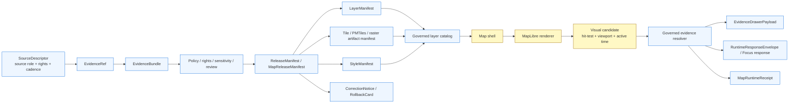

<!-- [KFM_META_BLOCK_V2]
doc_id: kfm://doc/TODO-VERIFY-UUID-map-shell
title: KFM Map Shell Architecture
type: standard
version: v1
status: draft
owners: OWNER_TBD_NEEDS_VERIFICATION
created: NEEDS_VERIFICATION
updated: 2026-05-06
policy_label: NEEDS_VERIFICATION
related: [../../README.md, ./README.md, ../adr/README.md, ../adr/ADR-0001-schema-home.md, ../adr/ADR-0003-maplibre-renderer-boundary.md, ../adr/ADR-0206-maplibre-layer-manifest.md, ../../apps/web/README.md, ../../apps/web/package.json, ../../data/registry/layers/README.md]
tags: [kfm, architecture, map-shell, maplibre, evidence-drawer, focus-mode, governed-api, layer-manifest, release, rollback, public-safe]
notes: [Revised from the existing docs/architecture/map-shell.md using current GitHub connector evidence on main plus attached KFM MapLibre and Directory Rules doctrine. Local mounted repository, branch state, runtime logs, workflow run status, deployment posture, owner routing, doc UUID, created date, and policy label remain NEEDS VERIFICATION.]
[/KFM_META_BLOCK_V2] -->

<a id="top"></a>

# KFM Map Shell Architecture

Map-first browser architecture for rendering released KFM artifacts while keeping truth, evidence, policy, review, release, correction, rollback, and AI boundaries visible.

<p align="left">
  
  
  
  
  
  
  
</p>

<p align="left">
  <a href="#status">Status</a> ·
  <a href="#evidence-boundary">Evidence boundary</a> ·
  <a href="#scope">Scope</a> ·
  <a href="#repo-fit">Repo fit</a> ·
  <a href="#operating-law">Operating law</a> ·
  <a href="#runtime-flow">Runtime flow</a> ·
  <a href="#shell-surfaces">Shell surfaces</a> ·
  <a href="#current-implementation-signals">Implementation signals</a> ·
  <a href="#contracts">Contracts</a> ·
  <a href="#validation">Validation</a> ·
  <a href="#rollback">Rollback</a> ·
  <a href="#verification-backlog">Verification backlog</a>
</p>

> [!IMPORTANT]
> **Core rule:** the map shell is a trust-visible operating field, not a truth source.  
> MapLibre may render released artifacts and identify visual candidates. KFM’s governed API, evidence resolver, policy gates, release records, correction lineage, and rollback targets decide what a user may safely read, cite, export, compare, or ask Focus Mode to synthesize.

> [!CAUTION]
> This document records architecture and review burden. It does **not** prove deployed behavior, branch protections, passing workflow runs, production headers, runtime logs, dashboard state, full release maturity, full Evidence Drawer maturity, or complete Focus Mode maturity.

---

## Status

This file is the cross-domain architecture document for the KFM browser map shell. The path is appropriate because `docs/architecture/` is the human-facing home for system design that applies across domains, while code, schemas, policies, fixtures, receipts, proofs, release records, and lifecycle data remain in their own responsibility roots.

| Area | Status | What can be said safely |
|---|---:|---|
| Target file | `CONFIRMED` | `docs/architecture/map-shell.md` exists in the GitHub repository and is the target of this revision. |
| Directory placement | `CONFIRMED doctrine / CONFIRMED path` | Directory Rules place `map-shell.md` under `docs/architecture/`, not under a domain root or app root. |
| Renderer boundary | `CONFIRMED repo doc / NEEDS VERIFICATION enforcement` | `ADR-0003-maplibre-renderer-boundary.md` records that MapLibre is downstream of trust. |
| Layer contract boundary | `CONFIRMED repo doc / PROPOSED decision` | `ADR-0206-maplibre-layer-manifest.md` records `LayerManifest.v1` as the governed layer-contract direction. |
| Web package evidence | `CONFIRMED repo file` | `apps/web/package.json` declares `maplibre-gl`, `pmtiles`, Vite, Vitest, npm scripts, and `npm@10`. |
| Ecology map slice | `CONFIRMED repo source` | An ecology-specific MapLibre slice exists and uses a manifest, Evidence Drawer, and EvidenceBundle fetcher. |
| Baseline workflow file | `CONFIRMED repo file / UNKNOWN run status` | `.github/workflows/baseline.yml` contains KFM validation steps, but successful workflow execution was not verified here. |
| Full shell maturity | `UNKNOWN` | The complete production map shell, deployed routes, runtime receipts, cache invalidation, release manifests, and dashboard behavior require further verification. |

[Back to top](#top)

---

## Evidence boundary

This revision uses two kinds of evidence:

1. **Project doctrine and directory law**: KFM requires a governed, evidence-first, map-first, time-aware shell where the interface is part of the trust model, not decorative chrome.
2. **Current repository connector evidence**: selected files on `main` were inspected through the GitHub connector. The local workspace did not expose a mounted Git checkout, so local branch state and local test output are not claimed.

### Current repository evidence snapshot

| Evidence | Status | Supports | Does not prove |
|---|---:|---|---|
| `README.md` | `CONFIRMED` | KFM identity, lifecycle law, inspectable-claim posture, public-client trust membrane. | Full implementation maturity. |
| `docs/architecture/README.md` | `CONFIRMED` | `docs/architecture/` is cross-domain system architecture, not runtime or schema authority. | Complete architecture inventory. |
| `docs/adr/ADR-0003-maplibre-renderer-boundary.md` | `CONFIRMED` | Renderer-not-truth rule. | CI/runtime enforcement. |
| `docs/adr/ADR-0206-maplibre-layer-manifest.md` | `CONFIRMED / PROPOSED` | Layer manifests as governed layer contract. | Accepted schema, validators, or release readiness. |
| `docs/adr/ADR-0001-schema-home.md` | `CONFIRMED / PROPOSED` | Proposed `schemas/contracts/v1/` machine-schema home; `contracts/` and `policy/` remain separate. | Accepted schema-home enforcement. |
| `data/registry/layers/README.md` | `CONFIRMED` | Layer registry boundary and release-aware layer-manifest posture. | Existing layer entries or validator pass. |
| `apps/web/package.json` | `CONFIRMED` | Package metadata for MapLibre, PMTiles, npm, Vite, Vitest, and app scripts. | Installed dependencies, production build, or deployment. |
| `apps/web/src/ecology/EcologyMap.tsx` | `CONFIRMED` | An ecology slice loads a layer manifest, renders MapLibre, filters feature properties, opens Evidence Drawer, and fetches EvidenceBundle. | Complete reusable map shell or cross-domain adapter. |
| `apps/web/src/ecology/EvidenceDrawer.tsx` | `CONFIRMED` | A Drawer component and payload shape exist for ecology trust display. | Universal Drawer contract or accessibility completeness. |
| `apps/web/src/ecology/layerManifest.ts` | `CONFIRMED` | Ecology layer manifest client validates object type and `public_safe`. | Final `LayerManifest.v1` schema enforcement. |
| `apps/web/src/ecology/evidenceBundle.ts` | `CONFIRMED` | Ecology EvidenceBundle client uses finite outcomes and public-only visibility logic. | Full global evidence resolver. |
| `apps/web/src/ecology/FocusPanel.tsx` | `CONFIRMED / partial` | A Focus panel exists for ecology UI demo flow. | Complete finite-envelope parity; current local response type omits `ERROR`. |
| `apps/api/ecology/focus_mode.py` | `CONFIRMED / minimal runtime` | No-network ecology Focus runtime reads released artifacts and emits finite outcomes. | Full governed AI platform or production route behavior. |
| `.github/workflows/baseline.yml` | `CONFIRMED file` | Baseline validation workflow is checked in. | Passing run status, branch protection, or production release enforcement. |

> [!NOTE]
> Repo files are stronger evidence for current implementation than prior PDF plans. Attached KFM doctrine is stronger evidence for KFM operating law than generic web-map practice. Where doctrine and current implementation maturity differ, this document preserves doctrine and labels implementation gaps.

[Back to top](#top)

---

## Scope

The map shell is the browser-facing operating field where users inspect place, time, layers, claims, evidence, policy posture, review state, release state, correction state, and bounded Focus Mode answers.

It coordinates these responsibilities:

- render released public-safe map artifacts;
- preserve stable geography, time, layer, role, audience, and release context;
- expose trust cues at the point where meaning changes;
- route feature selection through governed evidence resolution;
- open the Evidence Drawer for consequential support;
- pass bounded map context to Focus Mode through governed runtime envelopes;
- make denial, abstention, stale, restricted, generalized, superseded, withdrawn, and error states visible;
- keep exports and shared views attached to provenance, release, correction, and generalization context.

### Non-goals

The map shell is not:

- the canonical store;
- the source registry;
- the policy engine;
- the publication system;
- the release authority;
- the correction authority;
- the rollback authority;
- a direct model client;
- a raw data browser;
- a hidden steward bypass path;
- a generic map viewer with optional evidence decoration.

[Back to top](#top)

---

## Repo fit

`docs/architecture/map-shell.md` belongs under `docs/architecture/` because it explains a cross-domain system boundary: how KFM’s map-first browser shell preserves evidence, policy, release, correction, and AI boundaries.

| Relationship | Path | Status | Role |
|---|---|---:|---|
| Project landing page | [`../../README.md`](../../README.md) | `CONFIRMED` | KFM identity, lifecycle law, public-client trust membrane. |
| Architecture directory | [`./README.md`](./README.md) | `CONFIRMED` | Cross-domain architecture home. |
| Schema-home ADR | [`../adr/ADR-0001-schema-home.md`](../adr/ADR-0001-schema-home.md) | `CONFIRMED / PROPOSED` | Contract/schema/policy split and schema-home burden. |
| Renderer boundary ADR | [`../adr/ADR-0003-maplibre-renderer-boundary.md`](../adr/ADR-0003-maplibre-renderer-boundary.md) | `CONFIRMED` | Renderer-not-truth decision. |
| Layer manifest ADR | [`../adr/ADR-0206-maplibre-layer-manifest.md`](../adr/ADR-0206-maplibre-layer-manifest.md) | `CONFIRMED / PROPOSED` | Governed layer-manifest decision. |
| Layer registry | [`../../data/registry/layers/README.md`](../../data/registry/layers/README.md) | `CONFIRMED` | Release-aware layer registry boundary. |
| Web shell README | [`../../apps/web/README.md`](../../apps/web/README.md) | `CONFIRMED / draft` | Browser shell orientation. |
| Web package manifest | [`../../apps/web/package.json`](../../apps/web/package.json) | `CONFIRMED` | Package manager, scripts, MapLibre/PMTiles dependency declarations. |

### Accepted inputs

The map shell may consume these inputs only through governed, verified, released, or no-network fixture paths:

| Input | Accepted when | Must preserve |
|---|---|---|
| `LayerManifest` | Released, release-candidate, authorized steward, or fixture-backed layer contract is valid. | Release id, source refs, evidence policy, sensitivity posture, stale policy, correction state. |
| `StyleManifest` or style asset | Style is versioned and reviewed where meaning changes. | Style id, digest, symbol meaning, accessibility notes. |
| Tile, PMTiles, raster, vector, or GeoJSON artifact manifest | Artifact is public-safe, integrity-bound, and release-aware. | Digest, bounds, media type, cache policy, rollback relation. |
| `EvidenceDrawerPayload` | Returned by governed resolver or no-network fixture. | EvidenceRef/EvidenceBundle, source role, policy, review, release, correction, audit linkage. |
| `RuntimeResponseEnvelope` or Focus response | Returned by governed API or verified fixture. | `ANSWER`, `ABSTAIN`, `DENY`, or `ERROR`; citations or reason codes; audit ref. |
| Shell state | Browser-owned runtime state only. | Viewport, selected candidate, active time, layer toggles, open panels, display preferences. |

### Exclusions

| Excluded from normal map-shell paths | Why |
|---|---|
| RAW, WORK, QUARANTINE, unpublished candidates | Violates the KFM lifecycle and public-client trust membrane. |
| Canonical/internal stores | Browser code must not become privileged truth access. |
| Source credentials and secrets | Browser bundles and public repo surfaces must not contain them. |
| Direct model-runtime calls | Focus Mode must route through governed API mediation. |
| Policy-as-code as UI-only enforcement | UI may display policy outcomes; it must not be the only enforcement layer. |
| Client-side hiding as sensitivity control | Sensitive geometry must be withheld, generalized, or denied upstream before public artifacts ship. |
| Popup-only evidence | Popups may summarize affordances; the Evidence Drawer remains the trust object. |

[Back to top](#top)

---

## Operating law

The map shell exists downstream of KFM’s governed truth path:

```text
RAW -> WORK / QUARANTINE -> PROCESSED -> CATALOG / TRIPLET -> PUBLISHED
```

Public and normal UI surfaces consume governed APIs, released artifacts, catalog records, layer manifests, tile services, EvidenceBundle-backed payloads, finite runtime envelopes, and safe fixtures.

They must not directly consume:

```text
RAW
WORK
QUARANTINE
unpublished candidates
canonical/internal stores
steward-only stores
source-system side effects
secret-bearing paths
direct model runtime outputs
```

### Claim rule

A rendered feature is a visual candidate.

A consequential claim requires:

```text
Feature candidate
  -> governed resolver
  -> EvidenceRef
  -> EvidenceBundle
  -> policy / rights / sensitivity / review / release check
  -> EvidenceDrawerPayload or finite negative state
```

### Renderer rule

MapLibre is a disciplined 2D renderer and interaction runtime. It may render, hit-test, and report map context. It does not decide truth, rights, sensitivity, release, review, correction, rollback, citation validity, or AI answerability.

[Back to top](#top)

---

## Runtime flow



### Interaction sequence

1. The shell requests a governed layer list or loads a no-network fixture.
2. The shell renders only manifest-backed public-safe layers.
3. MapLibre identifies the active layer, feature candidate, camera state, viewport, and active time.
4. The shell sends candidate context to the governed resolver.
5. The resolver returns a Drawer payload, finite Focus response, or finite negative state.
6. Focus Mode may ask bounded questions only over the active evidence scope.
7. Export/share previews preserve trust cues, source support, release id, correction state, and generalization context.
8. Receipts or audit references are emitted or linked where implementation requires them.

[Back to top](#top)

---

## Shell surfaces

The shell is one coordinated operating field, not separate tools stitched together.

| Surface | Primary role | Must do | Must never do |
|---|---|---|---|
| Explore | Navigate, filter, inspect, select, compare candidate map features. | Keep place, time, layer, release, and trust cues visible. | Treat a rendered feature as an authoritative claim. |
| Timeline | Control valid time, source time, release time, stale state, and comparison anchors. | Pass active time scope into Drawer and Focus. | Collapse all temporal meaning into one timestamp. |
| Evidence Drawer | Explain support for claims, features, layers, and Focus answers. | Show evidence, source role, policy, review, release, correction, freshness, and audit context. | Act like an optional tooltip or hidden developer panel. |
| Focus Mode | Provide evidence-bounded synthesis. | Emit finite `ANSWER`, `ABSTAIN`, `DENY`, or `ERROR` outcomes. | Become a detached chatbot or direct model runtime client. |
| Dossier | Present durable object or claim context. | Resolve consequential statements to evidence and release state. | Repackage weak map metadata as authoritative narrative. |
| Compare | Inspect two or more scoped states. | Preserve separate time, support, release, and source context per side. | Flatten unlike states into a single simplified claim. |
| Review | Support role-gated steward review. | Keep review actions explicit, logged, and separate from public shell behavior. | Become a hidden truth system with weaker evidence law. |
| Export / Share | Prepare outward artifacts. | Preserve trust metadata, citations, release id, correction status, and generalization context. | Strip provenance or policy state for presentation polish. |
| Diagnostics | Inspect authorized runtime and manifest state. | Help maintainers trace failures. | Become a backdoor for public raw/canonical access. |

### Visible negative states

The shell should visibly distinguish:

- `MISSING_EVIDENCE`
- `SOURCE_STALE`
- `DENIED_BY_POLICY`
- `GENERALIZED_GEOMETRY`
- `RESTRICTED_ACCESS`
- `CONFLICTED_SUPPORT`
- `CITATION_FAILED`
- `RELEASE_WITHDRAWN`
- `RUNTIME_ERROR`

> [!NOTE]
> Empty panels are not neutral. If KFM cannot make a claim, the shell should make the reason inspectable enough for the audience and access role.

[Back to top](#top)

---

## Trust cues

Trust cues are interpretation aids. They should travel with layers, selections, claims, Drawer payloads, Focus answers, compare panes, exports, and review queues.

| Cue family | Signals | Appears in | Rule |
|---|---|---|---|
| Scope chips | Active place, time, layer, audience, role, and release context. | Top bar, Focus header, compare header, export preview, dossier header. | Users should see the answer boundary before reading a claim. |
| Freshness cues | Source recency, release age, stale state. | Layer metadata, Drawer, Focus, exports, summaries. | Freshness is part of meaning. |
| Evidence-state chips | Direct, partial, disputed, unavailable, source-dependent support. | Selection summaries, claim rows, Drawer, Focus. | Support quality stays visible at point of use. |
| Rights / sensitivity chips | Public-safe, restricted, generalized, redacted, review-required. | Anywhere visibility or precision changes by policy. | Restricted objects should surface as safe stubs where appropriate, not vanish silently. |
| Review-state chips | Draft, quarantined, reviewed, promoted, stale, superseded, withdrawn. | Dossiers, review surfaces, correction panels, exports. | Release and review state are first-class context. |
| Knowledge-character markers | Observed, documentary, derived, modeled, generalized, source-dependent. | Layers, stories, summaries, compare, Focus. | Users can distinguish what kind of statement they are reading. |
| AI participation badges | Model-assisted synthesis was used. | Focus header, AI-assisted narratives, exports. | Generated language remains visibly subordinate to evidence. |

[Back to top](#top)

---

## Time model

KFM time is not a single timestamp. The map shell should keep these axes separate where material:

| Temporal axis | Meaning | Map-shell consequence |
|---|---|---|
| `valid_time` | When a claim or feature is true in the modeled world. | Timeline filtering and story/compare context. |
| `observed_time` | When a measurement, observation, or event occurred. | Observation and monitoring layers. |
| `source_publication_time` | When the upstream source published the material. | Freshness and source-cadence cues. |
| `retrieval_time` | When KFM fetched or captured the source. | Receipts and audit context. |
| `processed_time` | When KFM normalized or transformed material. | Pipeline trace and stale-processing review. |
| `release_time` | When KFM made a governed release decision. | Published state, compare anchors, rollback scope. |
| `correction_time` | When KFM corrected, withdrew, or superseded material. | Correction markers and public trust repair. |
| `runtime_interaction_time` | When the user interacted with the shell. | Runtime receipts and diagnostics. |

[Back to top](#top)

---

## Current implementation signals

The repository now exposes a concrete ecology UI/API slice that partially exercises the map-shell doctrine. Treat it as implementation evidence for that slice, not as proof that every cross-domain map-shell obligation is complete.

| Path | CONFIRMED signal | Architecture consequence | Remaining gap |
|---|---|---|---|
| [`../../apps/web/src/ecology/EcologyMap.tsx`](../../apps/web/src/ecology/EcologyMap.tsx) | Uses `maplibre-gl`, fetches an ecology layer manifest, renders a vector layer, filters displayed feature fields by `allowed_fields`, opens Evidence Drawer, and fetches an EvidenceBundle. | Confirms a manifest-bound MapLibre + Drawer slice exists. | Cross-domain shell abstraction, production route behavior, and full release/cache behavior remain `NEEDS VERIFICATION`. |
| [`../../apps/web/src/ecology/EvidenceDrawer.tsx`](../../apps/web/src/ecology/EvidenceDrawer.tsx) | Defines and renders an ecology Drawer payload with decision, visible outcome, source roles, evidence refs, policy flags, redaction refs, freshness, and spec hash. | Confirms a trust-visible Drawer implementation exists for ecology. | Universal Drawer contract, accessibility coverage, and all-domain reuse remain `NEEDS VERIFICATION`. |
| [`../../apps/web/src/ecology/layerManifest.ts`](../../apps/web/src/ecology/layerManifest.ts) | Defines `EcologyLayerManifest`, fetches `/api/ecology/layers/{id}`, and rejects non-public-safe manifests. | Confirms layer-manifest style client enforcement in ecology. | Not the final `LayerManifest.v1` schema and not proof of registry/release closure. |
| [`../../apps/web/src/ecology/evidenceBundle.ts`](../../apps/web/src/ecology/evidenceBundle.ts) | Validates ecology EvidenceBundle shape, exposes finite outcomes, classifies HTTP failure into `DENY`, `ABSTAIN`, or `ERROR`, and blocks restricted/review-required bundles under `publicOnly`. | Confirms an evidence-bounded client state machine exists. | Global EvidenceBundle schema, citation validation, and release-wide resolver behavior remain `NEEDS VERIFICATION`. |
| [`../../apps/web/src/ecology/FocusPanel.tsx`](../../apps/web/src/ecology/FocusPanel.tsx) | Posts a demo `FocusModeRequest` and displays answer, evidence refs, decision refs, and reasons. | Confirms Focus UI work exists. | Current local response type omits `ERROR`; full finite-envelope parity should be verified. |
| [`../../apps/api/ecology/focus_mode.py`](../../apps/api/ecology/focus_mode.py) | Minimal no-network ecology Focus runtime reads released ecology artifacts only and emits `ANSWER`, `ABSTAIN`, `DENY`, or `ERROR`. | Confirms backend Focus logic exists for a bounded ecology slice. | Full governed AI runtime, provider adapters, route wiring, citations, receipts, and deployment remain `NEEDS VERIFICATION`. |
| [`../../.github/workflows/baseline.yml`](../../.github/workflows/baseline.yml) | Baseline workflow contains repository, schema, fixture, truth-label, directory-rules, internal-path, source-rights, API-contract, release-manifest, publication, and unittest checks. | Confirms validation wiring exists as a checked-in workflow file. | Workflow run success and branch protection were not verified in this session. |

> [!IMPORTANT]
> The ecology slice is valuable because it turns shell doctrine into code-shaped evidence. It should not be silently generalized into a claim that KFM’s full production map shell is complete.

[Back to top](#top)

---

## Contracts

The map shell is a consumer of trust-bearing contracts. Exact schema homes and field names must follow the accepted repository convention.

| Contract family | Role in map shell | Enforcement status |
|---|---|---:|
| `LayerManifest` | Declares what a released layer may render, cite, withhold, badge, time-scope, and resolve. | `PROPOSED / partially documented by ADR` |
| `StyleManifest` | Binds visual treatment to reviewed style assets and meaning-change controls. | `PROPOSED` |
| `TileArtifactManifest` | Identifies tile, PMTiles, raster, vector, or GeoJSON artifacts and digests. | `PROPOSED` |
| `MapReleaseManifest` | Groups layer, style, artifact, proof, release, correction, and rollback context. | `PROPOSED` |
| `EvidenceRef` | Points from map candidate or claim to evidence support. | `NEEDS VERIFICATION` |
| `EvidenceBundle` | Supplies resolved support for Drawer and Focus. | `CONFIRMED ecology client / NEEDS VERIFICATION global contract` |
| `EvidenceDrawerPayload` | Drives user-visible evidence, policy, review, release, correction, and audit state. | `CONFIRMED ecology payload / NEEDS VERIFICATION global contract` |
| `MapContextEnvelope` | Carries active place, time, layer, feature candidate, role, and release context. | `PROPOSED` |
| `RuntimeResponseEnvelope` | Carries finite Focus outcomes. | `CONFIRMED doctrine / NEEDS VERIFICATION full UI parity` |
| `MapRuntimeReceipt` | Records auditable runtime resolution events where required. | `PROPOSED` |
| `CorrectionNotice` / `RollbackCard` | Makes correction and reversal inspectable. | `NEEDS VERIFICATION` |

### Minimal layer contract shape

The shape below is illustrative, not a production schema.

```json
{
  "schema": "kfm.map.layer_manifest.v1",
  "layer_id": "hydrology.huc12.public.v1",
  "domain": "hydrology",
  "title": "Public HUC12 Hydrologic Units",
  "release_id": "maprelease_demo_huc12",
  "artifact_refs": ["tileartifact_huc12_pmtiles_v1"],
  "style_refs": ["style_kfm_public_default_v1"],
  "source_descriptor_refs": ["source_usgs_wbd_huc12_public"],
  "evidence_policy": {
    "requires_evidence_bundle": true,
    "supports_popup_claims": false,
    "drawer_payload_contract": "kfm.ui.evidence_drawer_payload.v1",
    "focus_mode_allowed": true,
    "focus_requires_citation_validation": true
  },
  "geometry_policy": {
    "sensitive_exact_geometry_allowed": false,
    "withheld_accounting_required": true
  },
  "negative_states": [
    "MISSING_EVIDENCE",
    "SOURCE_STALE",
    "DENIED_BY_POLICY",
    "GENERALIZED_GEOMETRY",
    "RELEASE_WITHDRAWN",
    "RUNTIME_ERROR"
  ]
}
```

[Back to top](#top)

---

## Validation

A credible map-shell implementation should fail closed in negative paths before it expands visual scope.

### Required gates

| Gate | Required behavior | Failure outcome |
|---|---|---|
| Manifest-gated layer loading | Shell loads public/semi-public layers only through governed manifest/catalog path. | Layer unavailable; no ad hoc style fallback. |
| No public raw path | Browser code cannot reach raw, work, quarantine, unpublished, or canonical/internal stores. | CI failure or release block. |
| No direct model client | Browser bundle cannot call local or remote model runtimes directly. | CI failure or Focus disabled. |
| Evidence closure | Clicked candidate resolves to Drawer payload or finite negative state. | `ABSTAIN`, `DENY`, or `ERROR`; no unsupported claim. |
| Popup restraint | Popups do not present consequential uncited claims. | Popup hidden or downgraded to affordance. |
| Sensitive geometry denial | Exact sensitive geometry is withheld, generalized, or denied upstream. | `DENY` public release. |
| Stale-state visibility | Stale layers and evidence show visible state. | UI test failure. |
| Correction visibility | Superseded or withdrawn releases show visible state. | Release blocked or cache invalidated. |
| Export preservation | Exports keep trust cues, citations, release id, and correction state. | Export blocked. |
| Accessibility | Trust cues are keyboard-accessible, screen-reader-labeled, and not color-only. | Hold or CI failure. |

### Repo-native commands to verify before claiming success

The package manifest declares these app-level commands. Run them in a real checkout and record actual output before making test claims.

```bash
cd apps/web

npm run check
npm run test
npm run build
npm run doctor
```

### No-network fixture checklist

- [ ] Valid public-safe hydrology `LayerManifest`.
- [ ] Valid ecology `LayerManifest` fixture aligned with the current ecology slice.
- [ ] Stale source fixture.
- [ ] Sensitive geometry denial fixture.
- [ ] Missing evidence fixture.
- [ ] Withdrawn release fixture.
- [ ] Evidence Drawer payload fixture.
- [ ] Focus outcome fixtures for `ANSWER`, `ABSTAIN`, `DENY`, and `ERROR`.
- [ ] Export preview fixture that preserves trust metadata.
- [ ] Static check fixture for forbidden raw/canonical imports.
- [ ] Static check fixture for direct model client imports.

### Static check sketch

Adapt these commands to repo-native tooling before using them in CI.

```bash
# Pseudocode / illustrative only.
# Browser code should not import or fetch internal lifecycle zones.
rg -n "data/(raw|work|quarantine)|canonical|internal_store|steward_only" apps/web packages ui web \
  && echo "Forbidden browser data path found" && exit 1

# Browser code should not contain direct model-runtime clients.
rg -n "ollama|localhost:11434|/api/generate|/api/chat|chat/completions|openai" apps/web packages ui web \
  && echo "Direct model runtime path found in browser surface" && exit 1
```

[Back to top](#top)

---

## Rollback

Map-shell rollback must restore safe public behavior without deleting trust history.

| Trigger | Required response |
|---|---|
| Browser bypasses governed API | Disable affected route/component; block public release; add no-bypass regression test. |
| Sensitive geometry appears publicly | Withdraw or generalize layer; emit correction/transform receipt; invalidate cache. |
| Focus Mode calls a model runtime directly | Disable Focus entry point; require governed API mediation. |
| Focus Mode omits a finite outcome branch | Disable affected UI path or downgrade to `ERROR` until envelope parity is proven. |
| Popup shows unsupported claim | Remove claim text; force Drawer-backed resolution. |
| Style change alters meaning without review | Revert style or hold release until `StyleManifest` / `LayerManifest` review passes. |
| Evidence Drawer cannot resolve candidate | Show `ABSTAIN` or `ERROR`; preserve map context. |
| Cache serves withdrawn release | Invalidate cache and bind shell to rollback target. |
| Export strips trust cues | Disable export path until provenance and release context are restored. |

Rollback must preserve:

- release lineage;
- correction notices;
- proof and receipt references;
- affected layer ids;
- affected artifact/style ids;
- user-visible correction status when public material was touched.

[Back to top](#top)

---

## Review checklist

<details>
<summary>Map-shell architecture review checklist</summary>

- [ ] This document remains linked to renderer-boundary and layer-manifest ADRs.
- [ ] No runtime behavior is claimed without direct repo/test/workflow/artifact evidence.
- [ ] MapLibre is downstream of trust and not a truth authority.
- [ ] Public browser paths exclude RAW, WORK, QUARANTINE, unpublished candidate, canonical/internal, and model-runtime access.
- [ ] Evidence Drawer remains the mandatory trust object for consequential claims.
- [ ] Focus Mode uses finite outcomes and governed API mediation.
- [ ] Popups remain lightweight and non-authoritative.
- [ ] Sensitive geometry cannot rely on client-side hiding.
- [ ] Time axes are not collapsed into one timestamp where material.
- [ ] Negative states remain visually explicit.
- [ ] Validation plan includes no-network fixtures and negative-path tests.
- [ ] Rollback preserves correction lineage and does not erase history.
- [ ] Owners, doc id, created date, policy label, schema homes, and CI enforcement are verified before status advances.

</details>

[Back to top](#top)

---

## Verification backlog

| Item | Status | Review target |
|---|---:|---|
| Replace `TODO-VERIFY-UUID-map-shell` with real doc id. | `NEEDS VERIFICATION` | Documentation registry or doc-id convention. |
| Confirm document owners / CODEOWNERS. | `NEEDS VERIFICATION` | UI, architecture, API, policy, release reviewers. |
| Confirm policy label. | `NEEDS VERIFICATION` | Public/restricted classification convention. |
| Confirm `created` date. | `NEEDS VERIFICATION` | Commit history or documentation register. |
| Confirm full architecture directory inventory. | `NEEDS VERIFICATION` | Complete checkout scan. |
| Confirm MapLibre adapter abstraction path. | `NEEDS VERIFICATION` | `apps/web/src/map`, ecology slice, and any shared package. |
| Confirm universal Evidence Drawer contract. | `NEEDS VERIFICATION` | UI components, contracts, fixtures, tests. |
| Confirm Focus Mode finite-envelope parity in UI. | `NEEDS VERIFICATION` | `FocusPanel`, Focus API, OpenAPI, fixtures, tests. |
| Confirm no-public-raw-path enforcement. | `NEEDS VERIFICATION` | Tests, validators, workflows, and workflow run evidence. |
| Confirm no-direct-model-client enforcement. | `NEEDS VERIFICATION` | Static checks, UI tests, workflow run evidence. |
| Confirm `LayerManifest.v1` schema home. | `NEEDS VERIFICATION` | ADR-0001-compatible schema authority. |
| Confirm release, proof, receipt, correction, and rollback object homes. | `NEEDS VERIFICATION` | `data/`, `release/`, `runtime/`, or accepted repo convention. |
| Confirm accessibility tests for trust cues. | `UNKNOWN` | App test stack and workflow run output. |
| Confirm public deployment posture. | `UNKNOWN` | Runtime, infra, headers, reverse proxy, auth, CSP/CORS. |
| Confirm CI status and branch protections. | `UNKNOWN` | GitHub Actions run history and repo settings. |
| Confirm map-shell runtime receipts and cache invalidation behavior. | `UNKNOWN` | Runtime code, release artifacts, logs, dashboards. |

[Back to top](#top)

---

## Final architecture rule

Rendering is not evidence. Hit testing is not a claim. Style is not policy. Tiles are not provenance. Popups are not the Evidence Drawer. Focus Mode is not a direct model client.

The map shell is where KFM makes governed spatial evidence usable — without letting usability outrun trust.

[Back to top](#top)
