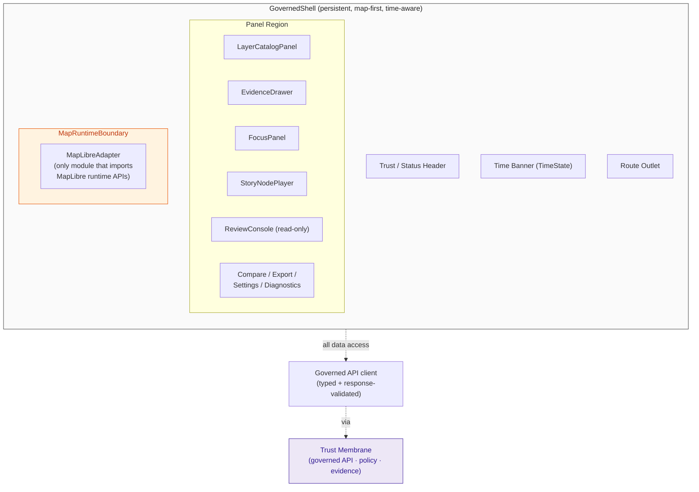

<!-- [KFM_META_BLOCK_V2]
doc_id: kfm://doc/architecture/map-shell
title: Map Shell — Architecture
type: standard
version: v1
status: draft
owners: <UI subsystem steward + Docs steward — TODO confirm from CODEOWNERS>
created: 2026-05-14
updated: 2026-05-14
policy_label: public
related: [
  docs/architecture/README.md,
  docs/architecture/ui/README.md,
  docs/architecture/ui/STATE_OWNERSHIP.md,
  docs/architecture/ui/BOUNDARIES.md,
  docs/architecture/ui/ROUTE_MAP.md,
  docs/architecture/ui/CONTINUITY_NOTES.md,
  docs/architecture/governed-ai/README.md,
  docs/architecture/story/README.md,
  docs/architecture/review/README.md,
  docs/doctrine/trust-membrane.md,
  docs/doctrine/lifecycle-law.md,
  docs/doctrine/directory-rules.md,
  docs/adr/ADR-maplibre-adapter-boundary.md
]
tags: [kfm, architecture, ui, maplibre, map-shell, governance, evidence, focus-mode]
notes: [
  "All path, route, package, and schema-file claims are PROPOSED per Directory Rules §0 — the live repo is not mounted in this session.",
  "Sibling UI-subsystem docs (STATE_OWNERSHIP, BOUNDARIES, ROUTE_MAP, CONTINUITY_NOTES) are companion docs; this file is the cross-cutting architecture topic.",
  "Operating law (renderer is downstream of trust) is CONFIRMED doctrine from UIAI-MAP and the Unified Implementation Architecture Build Manual."
]
[/KFM_META_BLOCK_V2] -->

# Map Shell — Architecture

> The disciplined 2D map runtime inside the governed Kansas Frontier Matrix (KFM) shell. **The renderer is downstream of trust, never upstream of it.**

[](#)
[](#)
[](#)
[](#)
[](#)
[](#)
[](#)

**Status:** `Draft` &nbsp;·&nbsp; **Owners:** `<UI subsystem steward + Docs steward — TODO fill from CODEOWNERS>` &nbsp;·&nbsp; **Last updated:** `2026-05-14`

---

## Quick Jump

- [1. Purpose & Scope](#1-purpose--scope)
- [2. Operating Law](#2-operating-law)
- [3. Trust Membrane Rules](#3-trust-membrane-rules)
- [4. Core Interaction Slice](#4-core-interaction-slice)
- [5. Shell Anatomy](#5-shell-anatomy)
- [6. MapRuntimePort — Adapter Interface](#6-mapruntimeport--adapter-interface)
- [7. State Ownership](#7-state-ownership)
- [8. Object Families at the Shell Boundary](#8-object-families-at-the-shell-boundary)
- [9. Finite Outcomes](#9-finite-outcomes)
- [10. Anti-Patterns](#10-anti-patterns)
- [11. Validation Requirements](#11-validation-requirements)
- [12. Proposed Implementation Homes](#12-proposed-implementation-homes)
- [13. Placement Note & Directory Rules Basis](#13-placement-note--directory-rules-basis)
- [14. FAQ](#14-faq)
- [15. Related Docs](#15-related-docs)

> [!NOTE]
> **Truth labels used below.** `CONFIRMED` — verified from attached KFM doctrine and source ledger in this session. `PROPOSED` — design or path recommendation not yet verified against a mounted repo. `NEEDS VERIFICATION` — checkable but not checked in this session. `UNKNOWN` — not resolvable from available evidence. The **operating law** in §2 and the **trust-membrane rules** in §3 are CONFIRMED doctrine. Component names, package layouts, schema file paths, and route names below are PROPOSED until a mounted repo confirms them.

---

## 1. Purpose & Scope

The **Map Shell** is the persistent, map-first, time-aware client surface of KFM. It hosts a disciplined 2D renderer (MapLibre GL JS) inside a governed shell that owns route continuity, time state, layer state, evidence state, policy state, review state, release state, and the negative states needed to display them honestly at the point of use. The shell is the **user-facing edge of the trust membrane**: every consequential surface in it must be reachable from an `EvidenceBundle`, a `PolicyDecision`, a `ReleaseManifest`, or a finite negative state.

**In scope:** the persistent shell, the MapLibre adapter boundary, the time and layer state contracts, the Evidence Drawer / Focus Mode integration points, the click-to-claim-resolution flow, layer trust-badge surfaces, and the object families that cross the shell boundary.

**Out of scope (covered elsewhere):** detailed Focus Mode runtime governance (see `docs/architecture/governed-ai/`), Story Node sequencing (see `docs/architecture/story/`), the review console's release/correction surface (see `docs/architecture/review/`), and the schema definitions themselves (proposed home: `schemas/contracts/v1/...`).

---

## 2. Operating Law

> [!IMPORTANT]
> **CONFIRMED doctrine.** MapLibre is the disciplined 2D renderer and interaction runtime inside the governed KFM shell. It is **not** the canonical truth store, source registry, policy engine, citation authority, review authority, publication authority, or AI authority. The one-sentence rule: *the renderer is downstream of trust, never upstream of it.*

The Map Shell preserves the following invariants by default:

1. **Lifecycle stays governed.** `RAW → WORK / QUARANTINE → PROCESSED → CATALOG / TRIPLET → PUBLISHED`. Promotion is a **governed state transition, not a file move**. The shell consumes only the PUBLISHED edge — never RAW, WORK, QUARANTINE, or unpublished candidate data.
2. **Public clients use governed interfaces.** Normal UI traffic enters via the governed API surface; the shell does not read canonical or internal stores directly.
3. **Cite-or-abstain truth posture.** A consequential claim shown in the shell must resolve to an `EvidenceBundle` or render a finite negative state (`ABSTAIN`, `DENY`, `ERROR`).
4. **Deterministic identity where practical.** Layer identity, tile artifact identity, style identity, and release identity are pinned by manifest and digest, not by URL alone.
5. **Renderer artifacts are downstream carriers.** Tiles (PMTiles, MVT, MLT), COGs, style JSON, screenshots, Story Nodes, 3D scenes, graph projections, catalog records, and AI answers are downstream carriers of release manifests, digests, `EvidenceBundle`s, `PolicyDecision`s, and rollback targets — **not** sovereign truth.
6. **Separation of release duties.** Where maturity justifies it, watcher / connector / pipeline / reviewer / releaser duties stay separated; the shell does not act as a publisher.

---

## 3. Trust Membrane Rules

CONFIRMED doctrine from `UIAI-MAP §§4–14`, `UIAI-WHOLE §18`, and the master MapLibre source ledger. The shell must enforce every rule below; violations are anti-patterns (§10).

| # | Rule | Reason |
|---|---|---|
| TM-1 | **No public RAW path.** Shell never fetches RAW, WORK, QUARANTINE, unpublished candidate data, or canonical/internal stores. | Public UI uses governed APIs and released artifacts only. |
| TM-2 | **No direct model client.** Browser never calls Ollama, OpenAI, a local model runtime, a vector index, a graph store, or an object store directly. | AI is interpretive and evidence-subordinate; runtime calls go through a backend adapter. |
| TM-3 | **No unreleased tile load.** `addSource` / `addLayer` is blocked unless `LayerManifest`, `TileArtifactManifest`, `MapReleaseManifest`, and `PolicyDecision` all allow it. | Layer toggle is not publication. |
| TM-4 | **No sensitive geometry hidden only by style.** Archaeology, rare-species, living-person, DNA, infrastructure, and sovereign-sensitive geometry are masked, generalized, delayed, restricted-tier, or denied **before** public tile generation. | Style filters are not geoprivacy. |
| TM-5 | **No popup as Evidence Drawer substitute.** Popups may preview; consequential claims require an `EvidenceDrawerPayload` and `EvidenceBundle` resolution. | The drawer is the trust object, not the popup. |
| TM-6 | **No Focus Mode answer from rendered features alone.** Rendered features are *candidates*; the `EvidenceBundle` carries the support. | Rendered pixels are not proof. |
| TM-7 | **No uncited export.** Screenshots, PDFs, Story Nodes, Focus answers, and badges carry citation and manifest/version references. | Provenance does not stop at the rendering boundary. |
| TM-8 | **Watcher-as-non-publisher.** Telemetry, drift watchers, and runtime probes emit receipts and candidate decisions only; they never publish into PUBLISHED layers. | Promotion is a governed transition, not an emission. |

---

## 4. Core Interaction Slice

CONFIRMED doctrine from `UIAI-MAP §§6–12`, `UIAI-WHOLE §§18–19`, and `IMPL-PIPE §19`. The shell's canonical interaction is a one-line trust chain.

```mermaid
flowchart LR
    A["Released layer<br/>(LayerManifest +<br/>TileArtifactManifest)"]:::pub
    B["User click /<br/>camera / time"]:::pub
    C["Governed API<br/>(claim resolution)"]:::tm
    D["EvidenceRef →<br/>EvidenceBundle"]:::tm
    E["Policy pre/postcheck<br/>+ citation validation"]:::tm
    F["Evidence Drawer<br/>(EvidenceDrawerPayload)"]:::out
    G["Focus Mode<br/>(RuntimeResponseEnvelope)"]:::out
    H{{"Finite outcome:<br/>ANSWER · ABSTAIN ·<br/>DENY · ERROR"}}:::final

    A --> B --> C --> D --> E --> F --> G --> H

    classDef pub fill:#e8f5e9,stroke:#2e7d32,color:#1b5e20
    classDef tm fill:#fff3e0,stroke:#e65100,color:#bf360c
    classDef out fill:#e3f2fd,stroke:#1565c0,color:#0d47a1
    classDef final fill:#ede7f6,stroke:#4527a0,color:#311b92
```



The shell never short-circuits this chain. It must be possible to walk every consequential surface backward to a `SourceDescriptor`, a `ReleaseManifest`, a `PromotionDecision`, a `RunReceipt`, and a rollback target.

[Back to top](#map-shell--architecture)

---

## 5. Shell Anatomy

PROPOSED component decomposition, consistent with `KFM_Whole_UI_Governed_AI_Expansion_Report §17.2` and `IMPL-PIPE §19`. None of the components below are claimed to exist in a mounted repo; they describe the surface the doctrine requires.



| Component | Responsibility | Depends on | Status |
|---|---|---|---|
| `GovernedShell` | Persistent map-first layout, time banner, trust/status header, route outlet, panel region, keyboard skip links. | Bootstrap envelope and shell state. | **PROPOSED** |
| `MapRuntimeBoundary` + `MapLibreAdapter` | Hides the renderer; applies validated sources/layers; synchronizes camera and time; converts clicks into claim-resolution requests. | `LayerDescriptor`, `TimeState`, governed client. | **PROPOSED** |
| `LayerCatalogPanel` | Layer toggles, legends, filters, time filters, compare/export hooks, verified-status and manifest/proof visibility. | `LayerCatalogItem`, `LayerDescriptor`. | **PROPOSED** |
| `EvidenceDrawer` | Displays `EvidenceBundle`-derived payload, source roles, freshness, review state, sensitivity, rights, valid-time, correction lineage, provenance. | `EvidenceDrawerPayload`. | **PROPOSED** |
| `FocusPanel` | Governed query surface; bounded scope; finite outcomes; cancellation/loading; citation validation display; **no** direct model calls. | `FocusRequestEnvelope`, `FocusResponseEnvelope`, `DecisionEnvelope`. | **PROPOSED** |
| `StoryNodePlayer` | 2D-first narrative steps with map/time/layer/evidence continuity; optional 3D only under an explicit gate. | `StoryManifest`, `StoryNode`. | **PROPOSED** |
| `ReviewConsole` | Read-only steward view of proof/review/correction state. No release action in the first slice. | `ReviewRecord`, `ReleaseManifest`, policy. | **PROPOSED** |
| `Compare / Export / Settings / Diagnostics` | Compare releases/time slices, governed export requests, a11y/settings, diagnostics without leakage. | Layer manifests, export policy, telemetry policy. | **PROPOSED** |

[Back to top](#map-shell--architecture)

---

## 6. MapRuntimePort — Adapter Interface

PROPOSED interface, consistent with `UIAI-WHOLE §18`. The `MapLibreAdapter` is **the only module allowed to import MapLibre runtime APIs**. Component code speaks to `MapRuntimePort` and governed client events.

```ts
// PROPOSED — illustrative pseudocode; final shape pending ADR-maplibre-adapter-boundary.
interface MapRuntimePort {
  setCamera(camera: CameraState): void;
  setTimeContext(time: TimeState): void;
  loadValidatedLayer(descriptor: LayerDescriptor): Promise<void>;
  removeLayer(layerId: LayerId): void;
  setLayerVisibility(layerId: LayerId, visible: boolean): void;
  queryRenderedFeatureAtPoint(point: ScreenPoint): RenderedFeatureCandidate | null;
  destroy(): void;
}
```

| Method | What it does | What it does **not** do |
|---|---|---|
| `setCamera` | Move camera, preserve time/layer state. | Persist user state, decide policy, write canonical state. |
| `setTimeContext` | Apply `TimeState` (viewport time, `valid_time`, `observed_time`, freshness). | Choose which snapshots are admissible — policy/release do. |
| `loadValidatedLayer` | Add a source/layer only if the `LayerDescriptor` already carries proof and release context. | Validate the manifest itself; that happens upstream. |
| `removeLayer` / `setLayerVisibility` | Toggle visibility. | Promote, demote, or publish anything. |
| `queryRenderedFeatureAtPoint` | Return a **candidate** for claim resolution. | Treat the candidate as a claim. |
| `destroy` | Tear down the renderer cleanly. | Persist canonical state. |

> [!WARNING]
> Feature clicks **do not** expose feature properties as claims. A click creates a governed claim-resolution request that returns a `DecisionEnvelope` and `EvidenceDrawerPayload` — or a finite negative state. Rendered features are candidates, never proof.

[Back to top](#map-shell--architecture)

---

## 7. State Ownership

PROPOSED ownership map. Detail lives in the sibling doc `docs/architecture/ui/STATE_OWNERSHIP.md`; this is the cross-cutting summary.

| State | Owner | Cross-route persistence | Source of truth |
|---|---|---|---|
| **Map state** (camera, basemap, projection) | `GovernedShell` / `MapRuntimePort` | Yes (URL + shell). | `MapContextEnvelope` |
| **Time state** (viewport time, valid-time, observed-time, freshness) | `GovernedShell` (time banner) | Yes. | `TimeState` (PROPOSED) |
| **Layer state** (active, visibility, order, filters) | `LayerCatalogPanel` | Yes. | `LayerManifest` + `LayerDescriptor` |
| **Drawer state** (open feature, payload, negative state) | `EvidenceDrawer` | Optional. | `EvidenceDrawerPayload` |
| **Focus state** (scope, request, response envelope) | `FocusPanel` | Per-route. | `FocusRequestEnvelope` / `FocusResponseEnvelope` |
| **Story state** (active node, sequence, gate) | `StoryNodePlayer` | Per-route. | `StoryManifest` / `StoryNode` |
| **Review state** (read-only) | `ReviewConsole` | Per-route. | `ReviewRecord` |
| **Export state** | Compare/Export panel | Per-request. | Export policy + governed export route |
| **Settings / Diagnostics** | Settings panel | Per-user. | Local-only; no PII telemetry |

> [!NOTE]
> Negative states (`evidence_missing`, `restricted`, `stale`, `conflict`, `invalid_payload`, `policy_denied`) are **first-class** in every state owner above — not afterthoughts rendered as empty panes.

---

## 8. Object Families at the Shell Boundary

PROPOSED contracts, consistent with the master MapLibre object map. Each family has a proposed schema home (`schemas/contracts/v1/<family>/...`), a semantic home (`contracts/`), and a fixture home (`tests/fixtures/<family>/`). None are claimed to exist in a mounted repo.

| Object family | Crossing direction | Purpose at the shell boundary | Status |
|---|---|---|---|
| `SourceDescriptor` | In | Source role, rights, sensitivity, cadence, citation guidance. | **PROPOSED** |
| `LayerManifest` | In | Released layer payload with `valid_time`, freshness, provenance, release state, integrity refs. | **PROPOSED** |
| `StyleManifest` | In | Style JSON, sprites, glyphs, legends, sensitive-styling constraints, checksum. | **PROPOSED** |
| `TileArtifactManifest` | In | PMTiles/MVT/MLT/COG identity with digest, signature, byte-pin, release status. | **PROPOSED** |
| `MapReleaseManifest` | In | Bundle release decision for a coherent set of tiles, styles, and layers. | **PROPOSED** |
| `LayerDescriptor` | In | MapLibre source/layer descriptor with release/proof/manifest refs and policy labels. | **PROPOSED** |
| `LayerCatalogItem` | In | List-level layer metadata and trust-badge inputs. | **PROPOSED** |
| `MapContextEnvelope` | Out | Camera, time, viewport, layer set, and (optional) feature/layer IDs for Focus Mode handoff. | **PROPOSED** |
| `DecisionEnvelope` | In/Out | Claim-resolution outcome, including negative states. | **PROPOSED** |
| `EvidenceRef` / `EvidenceBundle` | In | Resolved evidence behind a consequential claim. | **PROPOSED** |
| `EvidenceDrawerPayload` | In | Drawer-shaped projection of `EvidenceBundle` plus policy/review/release fields. | **PROPOSED** |
| `FocusRequestEnvelope` / `FocusResponseEnvelope` | In/Out | Bounded synthesis request and finite-outcome response. | **PROPOSED** |
| `CitationValidationReport` | In | Proof that every cited `EvidenceRef` resolves and is admissible. | **PROPOSED** |
| `PolicyDecision` | In | Allow / deny / restrict / abstain at the gate. | **PROPOSED** |
| `PromotionDecision` | In | Upstream promotion outcome reflected in trust badges. | **PROPOSED** |
| `RunReceipt` / `AIReceipt` | In | Process evidence behind a rendered surface. | **PROPOSED** |
| `CorrectionNotice` / `ReviewRecord` / `RollbackCard` | In | Public correction lineage and rollback-target visibility. | **PROPOSED** |
| `StoryManifest` / `StoryNode` | In | 2D-first narrative scope, transitions, evidence continuity. | **PROPOSED** |
| `KFMGeoManifest` | In | PMTiles/COG asset digest and signature for integrity badges. | **PROPOSED** |

[Back to top](#map-shell--architecture)

---

## 9. Finite Outcomes

CONFIRMED doctrine from `UIAI-GAI §§1–4`, `UIAI-OLLAMA §§1–16`, and the encyclopedia chapter on Focus Mode. **Every consequential surface in the shell renders one of four typed states** — not a fluent fallback, not a silent empty panel.

| Outcome | When it applies | Shell rendering |
|---|---|---|
| `ANSWER` | Evidence exists, policy allows, citations validate. | Drawer/Focus content with citations, freshness, review/release badges. |
| `ABSTAIN` | Evidence insufficient or unresolved (e.g., no `EvidenceBundle`). | Explicit "no admissible evidence" surface with reason and what would change. |
| `DENY` | Policy or sensitivity blocks the response (rights, CARE, locality, living-person, sensitive geometry). | Visible denial with category, redirection to safe alternatives if any. |
| `ERROR` | System failure, malformed request, or service problem. | Diagnosable error with run/correlation IDs; never silently swallowed. |

The same finite grammar is rendered for map clicks, time-slider selections, Focus Mode answers, Story Node transitions, export requests, and review interactions.

---

## 10. Anti-Patterns

> [!WARNING]
> Each row below is a documented anti-pattern from the master MapLibre source ledger and Directory Rules §13. The shell must fail these closed and the validator suite must exercise the negative path.

| Anti-pattern | What it looks like | Where it is rejected |
|---|---|---|
| **Renderer as truth** | Treating MapLibre, tiles, screenshots, popups, STAC records, graph projections, or AI answers as sovereign truth. | Operating Law (§2). |
| **Direct `addSource` on unverified PMTiles** | Hand-coded raw tile URLs in the style or source registry. | TM-3; layer load validator. |
| **Style-hidden sensitive geometry** | Using style filters to "hide" archaeology, rare species, infrastructure detail, or living-person geometry. | TM-4; sensitive-geometry deny tests. |
| **Popup as Evidence Drawer substitute** | Showing claims in a popup instead of the drawer. | TM-5. |
| **Browser → model runtime** | Direct calls from the shell to Ollama / OpenAI / a local model / a vector index. | TM-2; CSP and route allowlist. |
| **Uncited export** | Screenshots, PDFs, or Focus summaries leaving the shell without citation and release context. | TM-7; export-policy tests. |
| **Watcher publishes** | A runtime probe writing to `data/catalog/` or `data/published/`. | TM-8; per Directory Rules §13.5 watcher-as-non-publisher. |
| **Competing shell homes** | `ui/`, `web/`, `apps/explorer-web/`, and `packages/ui/` all claiming the map shell. | Directory Rules §13.3 — canonical homes are `apps/explorer-web/` + `packages/ui/` + `packages/maplibre/` (+ `packages/cesium/`). |
| **Public route reads canonical store** | The shell reaching past the governed API into `data/processed/` or canonical stores. | Directory Rules §7.1 — trust membrane. |
| **Schema-mirror divergence** | `contracts/` and `schemas/` evolving separately for the same object family. | ADR-0001; Directory Rules §13.1. |

---

## 11. Validation Requirements

PROPOSED test coverage, consistent with the master MapLibre ledger and `IMPL-PIPE §19`. The validator suite must exercise both happy and negative paths.

| Test family | What it proves |
|---|---|
| **Schema validation** | `LayerDescriptor`, `LayerManifest`, `EvidenceDrawerPayload`, `MapContextEnvelope`, `FocusRequestEnvelope` / `FocusResponseEnvelope`, `DecisionEnvelope` round-trip cleanly; invalid fixtures fail. |
| **Catalog closure** | Every loaded layer resolves to `SourceDescriptor → LayerManifest → ReleaseManifest → RollbackCard`. |
| **Digest / signature checks** | PMTiles / COG / style assets match `KFMGeoManifest` digests before any render. |
| **No public RAW path** | Network allowlist forbids RAW/WORK/QUARANTINE and canonical stores from the shell. |
| **No unreleased tile load** | `addSource` rejects layers without `MapReleaseManifest` and a passing `PolicyDecision`. |
| **Click → `EvidenceBundle`** | A click on a released feature opens the drawer with a resolved `EvidenceDrawerPayload`. |
| **Citation validation** | Focus answers fail closed when any cited `EvidenceRef` does not resolve or is inadmissible in scope. |
| **Sensitive-geometry deny** | A sensitive feature returns `DENY` with a category — not a styled-away render. |
| **Visual regression** | Trust badges, drawer states, and Story Node diffs remain stable across releases. |
| **Accessibility** | Keyboard focus order, skip links, color/contrast, and screen-reader labels for time/layer/drawer surfaces. |
| **Tile load budget** | Tile fetches stay within budgets; over-budget loads abstain or degrade visibly. |
| **Cache invalidation** | A new release purges stale tile caches and updates trust badges. |
| **Rollback replay** | A `RollbackCard` replays cleanly and the shell renders the prior release state correctly. |
| **Offline behavior** | When the governed API is unreachable the shell renders cached layers and **does not make new claims** — drawer/focus abstain. |

[Back to top](#map-shell--architecture)

---

## 12. Proposed Implementation Homes

PROPOSED placement, per Directory Rules §13.3 (canonical map-shell homes) and §15 (Required README Contract). Specific path claims are PROPOSED until verified against a mounted repo.

| Concern | Proposed home | Authority basis |
|---|---|---|
| Deployable shell application | `apps/explorer-web/` | Directory Rules §13.3 (canonical shell home). |
| Shared UI components (e.g., drawer, focus panel) | `packages/ui/` | Directory Rules §13.3. |
| MapLibre renderer wrapper and adapter | `packages/maplibre/` | Directory Rules §13.3. |
| Cesium 3D (conditional, deferred) | `packages/cesium/` | Directory Rules §13.3; deferred per `KFM_Whole_UI_Governed_AI_Expansion_Report §12`. |
| Object meaning (semantic) | `contracts/` (Markdown) | Directory Rules §4 Step 1. |
| Machine schema (shape) | `schemas/contracts/v1/<family>/...` | Directory Rules §7.4 (ADR-0001). |
| Gate logic | `policy/<subsystem>/...` | Directory Rules §4 Step 1. |
| Tests | `tests/` and `tests/fixtures/` (or root `fixtures/`) | Directory Rules §4 Step 1; clarify in per-root README. |
| Validators | `tools/validators/<topic>/` | Directory Rules §13.5 (no test-only validators). |
| Routes (governed API) | `apps/governed-api/` | Directory Rules §7.1 (trust membrane). |
| ADRs | `docs/adr/ADR-maplibre-adapter-boundary.md` and related | Directory Rules §2.4. |

> [!NOTE]
> `ui/` and `web/` at repo root, if present, are **compatibility roots** under Directory Rules §8.1 — not long-term canonical shell homes. Any drift between `ui/`, `web/`, `apps/explorer-web/`, and `packages/ui/` is a §13.3 anti-pattern and should be filed to `docs/registers/DRIFT_REGISTER.md`.

---

## 13. Placement Note & Directory Rules Basis

This document lives at `docs/architecture/map-shell.md`. Rationale (PROPOSED):

- **Cross-cutting topic.** The map shell integrates UI, MapLibre rendering, time state, layer catalog, Evidence Drawer, Focus Mode handoff, Story Node, and Review surfaces. Per Directory Rules §12, cross-domain doctrine belongs at `docs/architecture/<topic>.md` rather than being filed under a single subsystem folder.
- **Companion UI-subsystem docs.** The `KFM_Whole_UI_Governed_AI_Expansion_Report §22` proposes UI-subsystem docs at `docs/architecture/ui/README.md`, `docs/architecture/ui/STATE_OWNERSHIP.md`, `docs/architecture/ui/ROUTE_MAP.md`, `docs/architecture/ui/BOUNDARIES.md`, and `docs/architecture/ui/CONTINUITY_NOTES.md`. This document is intended to be the cross-cutting **anchor** that those subsystem files refine; it does not replace them.
- **NEEDS VERIFICATION.** If a mounted repo already contains an equivalent file at `docs/architecture/ui/MAP_SHELL.md`, treat that as canonical and convert this file into a redirect / lineage note. Open a `docs/registers/DRIFT_REGISTER.md` entry rather than letting two homes diverge.

---

## 14. FAQ

<details>
<summary><strong>Why isn't the map shell allowed to call a model runtime directly?</strong></summary>

Because AI is interpretive, not authoritative. A browser call to a model runtime bypasses policy precheck, `EvidenceRef` resolution, citation validation, policy postcheck, `AIReceipt`, and `RuntimeResponseEnvelope`. Focus Mode is an evidence-bounded adapter behind the governed API; the browser participates by submitting a `FocusRequestEnvelope` and rendering the `FocusResponseEnvelope`'s finite outcome.

</details>

<details>
<summary><strong>What if a tile loads quickly via a public CDN — why route through the governed API at all?</strong></summary>

Speed is not authority. Released artifacts must be reachable by digest, signed, and tied to a `MapReleaseManifest` with a rollback target. The governed API is the place where layer admissibility, `PolicyDecision`, freshness, and review state are joined. A public CDN delivers bytes; the governed API delivers **trust**.

</details>

<details>
<summary><strong>Can a popup short-circuit the Evidence Drawer for "trivial" facts?</strong></summary>

No. Popups are a preview convenience. The moment a surface displays a consequential claim — a name, a date, a category, a measurement — it needs an `EvidenceDrawerPayload` and an `EvidenceBundle` resolution, or a finite negative state (`ABSTAIN`, `DENY`, `ERROR`). "Trivial" is judged by the source-and-evidence chain, not by the UI surface.

</details>

<details>
<summary><strong>How does the shell handle a stale or withdrawn release?</strong></summary>

The trust badges update from the manifest. A stale layer renders with a visible stale badge; a withdrawn layer is removed or rendered with a denial state. The `CorrectionNotice` and `RollbackCard` carry the lineage so the user can see *why*. The shell never silently keeps a withdrawn surface alive because cache happens to hold the bytes.

</details>

<details>
<summary><strong>Where does 3D fit?</strong></summary>

Conditionally. Cesium / 3D, where present, **must consume the same `EvidenceBundle` and `DecisionEnvelope` as 2D** (Directory Rules §11). It is an alternate renderer, not an alternate truth path. 3D handoff occurs only when `StoryManifest` evidence continuity, drawer continuity, and policy continuity are preserved. Until then, 3D is deferred.

</details>

<details>
<summary><strong>Why "PROPOSED" so often in this document?</strong></summary>

Because the live repository is not mounted in this session. Operating law and trust-membrane rules are CONFIRMED from KFM doctrine (UIAI-MAP, UIAI-WHOLE, the Unified Implementation Architecture Build Manual, and Directory Rules). Component names, paths, schema files, and route names below the doctrine line cannot be claimed as repo state without inspection — so they are marked PROPOSED until verification.

</details>

---

## 15. Related Docs

- **Doctrine** — `docs/doctrine/directory-rules.md`, `docs/doctrine/trust-membrane.md`, `docs/doctrine/lifecycle-law.md`, `docs/doctrine/authority-ladder.md`
- **Architecture (cross-cutting)** — `docs/architecture/README.md`, `docs/architecture/contract-schema-policy-split.md`
- **UI subsystem** — `docs/architecture/ui/README.md`, `docs/architecture/ui/STATE_OWNERSHIP.md`, `docs/architecture/ui/ROUTE_MAP.md`, `docs/architecture/ui/BOUNDARIES.md`, `docs/architecture/ui/CONTINUITY_NOTES.md`, `docs/architecture/ui/LAYERING.md`
- **Governed AI** — `docs/architecture/governed-ai/README.md`, `docs/architecture/governed-ai/BOUNDARIES.md`
- **Story & Review** — `docs/architecture/story/README.md`, `docs/architecture/review/README.md`
- **Registers** — `docs/registers/DRIFT_REGISTER.md`, `docs/registers/VERIFICATION_BACKLOG.md`, `docs/registers/CANONICAL_LINEAGE_EXPLORATORY.md`
- **Runbooks** — `docs/runbooks/ui_LOCAL_DEV.md`, `docs/runbooks/ui_VALIDATION.md`, `docs/runbooks/ui_ROLLBACK.md`
- **ADRs** — `docs/adr/ADR-maplibre-adapter-boundary.md`, `docs/adr/ADR-ui-schema-home.md`, `docs/adr/ADR-focus-model-adapter-boundary.md`, `docs/adr/ADR-story-node-3d-boundary.md`
- **Object map** — `contracts/OBJECT_MAP.md`

> All links above are **PROPOSED** until verified against the mounted repo. Treat any missing target as a `docs/registers/VERIFICATION_BACKLOG.md` candidate.

---

<sub>Last reviewed: **2026-05-14** &nbsp;·&nbsp; Doc version: **v1 (draft)** &nbsp;·&nbsp; Authority of doctrine: **CONFIRMED** &nbsp;·&nbsp; Authority of specific paths: **PROPOSED** until mounted-repo evidence verifies them.</sub>

[⤴ Back to top](#map-shell--architecture)
