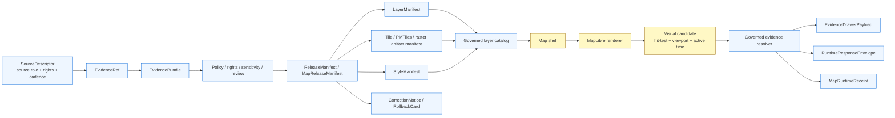

<!-- [KFM_META_BLOCK_V2]
doc_id: kfm://doc/TODO-VERIFY-UUID-map-shell
title: KFM Map Shell Architecture
type: standard
version: v1
status: draft
owners: OWNER_TBD_NEEDS_VERIFICATION
created: NEEDS_VERIFICATION
updated: 2026-05-06
policy_label: NEEDS_VERIFICATION
related: [../../README.md, ./README.md, ../adr/README.md, ../adr/ADR-0003-maplibre-renderer-boundary.md, ../adr/ADR-0206-maplibre-layer-manifest.md, ../../apps/web/README.md, ../../apps/web/package.json]
tags: [kfm, architecture, map-shell, maplibre, evidence-drawer, focus-mode, governed-api, layer-manifest]
notes: [Expands the prior docs/architecture/map-shell.md stub; owners, created date, policy label, doc UUID, runtime enforcement, and CI coverage remain NEEDS VERIFICATION.]
[/KFM_META_BLOCK_V2] -->

<a id="top"></a>

# KFM Map Shell Architecture

Map-first browser architecture for rendering released KFM artifacts while keeping truth, evidence, policy, review, release, correction, and AI boundaries visible.

<p align="left">
  
  
  
  
  
  
</p>

<p align="left">
  <a href="#status">Status</a> ·
  <a href="#scope">Scope</a> ·
  <a href="#repo-fit">Repo fit</a> ·
  <a href="#operating-law">Operating law</a> ·
  <a href="#runtime-flow">Runtime flow</a> ·
  <a href="#shell-surfaces">Shell surfaces</a> ·
  <a href="#contracts">Contracts</a> ·
  <a href="#validation">Validation</a> ·
  <a href="#rollback">Rollback</a> ·
  <a href="#verification-backlog">Verification backlog</a>
</p>

> [!IMPORTANT]
> **Core rule:** the map shell is a trust-visible operating field, not a truth source.  
> MapLibre may render released artifacts and identify visual candidates. The governed API must resolve evidence, policy, review, release, correction, and finite AI outcomes before the shell presents consequential claims.

> [!CAUTION]
> This document records architecture and review burden. It does **not** prove current runtime behavior, deployed routes, CI enforcement, release maturity, policy execution, Evidence Drawer implementation, Focus Mode implementation, or rollback execution.

---

## Status

This file replaces the prior `docs/architecture/map-shell.md` stub, which recorded the MapLibre shell as a proposed binding and the current static prototype as no-dependency.

Current repository evidence confirms a richer adjacent surface than the stub expressed:

| Evidence area | Status | What this document may safely say |
|---|---:|---|
| Target file exists | `CONFIRMED` | `docs/architecture/map-shell.md` exists and is thin enough to replace with this architecture document. |
| Architecture root exists | `CONFIRMED` | `docs/architecture/README.md` exists but is minimal. |
| Renderer boundary ADR exists | `CONFIRMED` | `ADR-0003-maplibre-renderer-boundary.md` records the renderer-not-truth rule. |
| Layer manifest ADR exists | `CONFIRMED` | `ADR-0206-maplibre-layer-manifest.md` proposes `LayerManifest.v1` as the governed layer contract. |
| Web app package evidence | `CONFIRMED` | `apps/web/package.json` declares `maplibre-gl`, `pmtiles`, Vite, Vitest, npm scripts, and npm as package manager. |
| Runtime enforcement | `UNKNOWN` | Route behavior, UI component behavior, policy enforcement, release manifests, and proof objects must be verified separately. |
| Public deployment posture | `UNKNOWN` | Firewall, reverse proxy, CSP/CORS, auth, branch protections, runtime logs, and dashboards are not proven by this file. |

[Back to top](#top)

---

## Scope

The map shell is the browser-facing operating field where users inspect place, time, layers, claims, evidence, policy posture, review state, release state, correction state, and bounded Focus Mode answers.

It coordinates these responsibilities:

- render released public-safe map artifacts;
- preserve stable geography, time, layer, role, and release context;
- expose trust cues where meaning changes;
- route feature selection through governed evidence resolution;
- open the Evidence Drawer for consequential support;
- pass bounded scope to Focus Mode through a governed runtime envelope;
- preserve denial, abstention, stale, restricted, generalized, superseded, withdrawn, and error states;
- keep exports and shared views attached to provenance, release, and correction context.

### Non-goals

The map shell is not:

- the canonical store;
- the source registry;
- the policy engine;
- the publication system;
- the release authority;
- the correction authority;
- a direct model client;
- a raw data browser;
- a hidden steward bypass path;
- a generic map viewer with optional evidence decoration.

[Back to top](#top)

---

## Repo fit

`docs/architecture/map-shell.md` belongs under `docs/architecture/` because it is human-facing architecture doctrine for a cross-domain UI trust boundary. It does not define machine schemas, policy-as-code, source data, emitted receipts, or application code.

| Relationship | Path | Status | Role |
|---|---|---:|---|
| Project landing page | [`../../README.md`](../../README.md) | `CONFIRMED file` | KFM identity, trust law, responsibility roots, and public orientation. |
| Architecture directory index | [`./README.md`](./README.md) | `CONFIRMED file / minimal` | Local architecture directory landing page. |
| ADR index | [`../adr/README.md`](../adr/README.md) | `CONFIRMED file / NEEDS VERIFICATION coverage` | ADR navigation and decision-review discipline. |
| Renderer boundary ADR | [`../adr/ADR-0003-maplibre-renderer-boundary.md`](../adr/ADR-0003-maplibre-renderer-boundary.md) | `CONFIRMED file` | MapLibre renderer boundary and no-truth-authority rule. |
| Layer manifest ADR | [`../adr/ADR-0206-maplibre-layer-manifest.md`](../adr/ADR-0206-maplibre-layer-manifest.md) | `CONFIRMED file / PROPOSED decision` | Layer-facing governed contract posture. |
| Web shell README | [`../../apps/web/README.md`](../../apps/web/README.md) | `CONFIRMED file / draft` | Browser shell orientation and runtime-boundary notes. |
| Web package manifest | [`../../apps/web/package.json`](../../apps/web/package.json) | `CONFIRMED file` | Package manager, scripts, MapLibre/PMTiles dependency declarations. |

### Accepted inputs

The map shell may consume these inputs only through governed, verified, or no-network fixture paths:

| Input | Accepted when | Must preserve |
|---|---|---|
| `LayerManifest` | Released or fixture-backed layer contract is valid. | Release id, source refs, evidence policy, sensitivity posture, stale policy, correction state. |
| `StyleManifest` / style asset | Style is versioned and reviewed where meaning changes. | Style id, digest, sprite/glyph/font posture, accessibility notes. |
| Tile, PMTiles, raster, or vector artifact manifest | Artifact is public-safe and release-bound. | Digest, bounds, format, cache policy, rollback relation. |
| `EvidenceDrawerPayload` | Returned by governed resolver or no-network fixture. | EvidenceRef/EvidenceBundle, source role, policy, review, release, correction, audit linkage. |
| `RuntimeResponseEnvelope` | Returned by governed API for Focus Mode. | `ANSWER`, `ABSTAIN`, `DENY`, or `ERROR`, citations or reason codes, audit ref. |
| Shell state | Browser-owned runtime state only. | Viewport, selected candidate, active time, layer toggles, open panels, display preferences. |

### Exclusions

| Excluded from normal map-shell paths | Why |
|---|---|
| RAW, WORK, QUARANTINE, unpublished candidates | Violates the KFM lifecycle and public-client trust membrane. |
| Canonical/internal stores | Browser code must not become privileged truth access. |
| Source credentials and secrets | Browser bundles and public repo surfaces must not contain them. |
| Direct model-runtime calls | Focus Mode must route through governed API mediation. |
| Policy-as-code as UI-only enforcement | UI may display policy outcomes; it must not be the only enforcement layer. |
| Client-side hiding as sensitivity control | Sensitive geometry must be withheld, generalized, or denied upstream before public artifacts ship. |
| Popup-only evidence | Popups may summarize affordances; the Evidence Drawer remains the trust object. |

[Back to top](#top)

---

## Operating law

The map shell exists downstream of the KFM truth path:

```text
RAW -> WORK / QUARANTINE -> PROCESSED -> CATALOG / TRIPLET -> PUBLISHED
```

Public and normal UI surfaces consume governed APIs, released artifacts, catalog records, layer manifests, tile services, EvidenceBundle-backed payloads, finite runtime envelopes, and safe fixtures.

They must not directly consume:

```text
RAW
WORK
QUARANTINE
unpublished candidates
canonical/internal stores
steward-only stores
source-system side effects
secret-bearing paths
direct model runtime outputs
```

### Claim rule

A rendered feature is a visual candidate.

A consequential claim requires:

```text
Feature candidate
  -> governed resolver
  -> EvidenceRef
  -> EvidenceBundle
  -> policy / rights / sensitivity / review / release check
  -> EvidenceDrawerPayload or finite negative state
```

### Renderer rule

MapLibre is a disciplined 2D renderer and interaction runtime. It may render, hit-test, and report map context. It does not decide truth, rights, sensitivity, release, review, correction, rollback, citation validity, or AI answerability.

[Back to top](#top)

---

## Runtime flow



### Interaction sequence

1. The shell requests a governed layer list or loads a no-network fixture.
2. The shell renders only manifest-backed public-safe layers.
3. MapLibre identifies the active layer, feature candidate, camera state, viewport, and active time.
4. The shell sends candidate context to the governed resolver.
5. The resolver returns a Drawer payload or finite negative state.
6. Focus Mode may ask bounded questions only over the active evidence scope.
7. Export/share previews preserve trust cues, source support, release id, correction state, and generalization context.
8. Receipts or audit references are emitted or linked where implementation requires them.

[Back to top](#top)

---

## Shell surfaces

The shell is one coordinated operating field, not separate tools stitched together.

| Surface | Primary role | Must do | Must never do |
|---|---|---|---|
| Explore | Navigate, filter, inspect, select, compare candidate map features. | Keep place, time, layer, release, and trust cues visible. | Treat a rendered feature as an authoritative claim. |
| Timeline | Control valid time, source time, release time, stale state, and comparison anchors. | Pass active time scope into Drawer and Focus. | Collapse all temporal meaning into one timestamp. |
| Evidence Drawer | Explain support for claims, features, layers, and Focus answers. | Show evidence, source role, policy, review, release, correction, freshness, and audit context. | Act like an optional tooltip or hidden developer panel. |
| Focus Mode | Provide evidence-bounded synthesis. | Emit finite `ANSWER`, `ABSTAIN`, `DENY`, or `ERROR` outcomes. | Become a detached chatbot or direct model runtime client. |
| Dossier | Present durable object or claim context. | Resolve consequential statements to evidence and release state. | Repackage weak map metadata as authoritative narrative. |
| Compare | Inspect two or more scoped states. | Preserve separate time, support, release, and source context per side. | Flatten unlike states into a single simplified claim. |
| Review | Support role-gated steward review. | Keep review actions explicit, logged, and separate from public shell behavior. | Become a hidden truth system with weaker evidence law. |
| Export / Share | Prepare outward artifacts. | Preserve trust metadata, citations, release id, correction status, and generalization context. | Strip provenance or policy state for presentation polish. |
| Diagnostics | Inspect authorized runtime and manifest state. | Help maintainers trace failures. | Become a backdoor for public raw/canonical access. |

### Visible negative states

The shell should visibly distinguish:

- `MISSING_EVIDENCE`
- `SOURCE_STALE`
- `DENIED_BY_POLICY`
- `GENERALIZED_GEOMETRY`
- `RESTRICTED_ACCESS`
- `CONFLICTED_SUPPORT`
- `CITATION_FAILED`
- `RELEASE_WITHDRAWN`
- `RUNTIME_ERROR`

> [!NOTE]
> Empty panels are not neutral. If KFM cannot make a claim, the shell should make the reason inspectable enough for the audience and access role.

[Back to top](#top)

---

## Trust cues

Trust cues are interpretation aids. They should travel with layers, selections, claims, Drawer payloads, Focus answers, compare panes, exports, and review queues.

| Cue family | Signals | Appears in | Rule |
|---|---|---|---|
| Scope chips | Active place, time, layer, audience, role, and release context. | Top bar, Focus header, compare header, export preview, dossier header. | Users should see the answer boundary before reading a claim. |
| Freshness cues | Source recency, release age, stale state. | Layer metadata, Drawer, Focus, exports, summaries. | Freshness is part of meaning. |
| Evidence-state chips | Direct, partial, disputed, unavailable, source-dependent support. | Selection summaries, claim rows, Drawer, Focus. | Support quality stays visible at point of use. |
| Rights / sensitivity chips | Public-safe, restricted, generalized, redacted, review-required. | Anywhere visibility or precision changes by policy. | Restricted objects should surface as safe stubs where appropriate, not vanish silently. |
| Review-state chips | Draft, quarantined, reviewed, promoted, stale, superseded, withdrawn. | Dossiers, review surfaces, correction panels, exports. | Release and review state are first-class context. |
| Knowledge-character markers | Observed, documentary, derived, modeled, generalized, source-dependent. | Layers, stories, summaries, compare, Focus. | Users can distinguish what kind of statement they are reading. |
| AI participation badges | Model-assisted synthesis was used. | Focus header, AI-assisted narratives, exports. | Generated language remains visibly subordinate to evidence. |

[Back to top](#top)

---

## Time model

KFM time is not a single timestamp. The map shell should keep these axes separate where material:

| Temporal axis | Meaning | Map-shell consequence |
|---|---|---|
| `valid_time` | When a claim or feature is true in the modeled world. | Timeline filtering and story/compare context. |
| `observed_time` | When a measurement, observation, or event occurred. | Observation and monitoring layers. |
| `source_publication_time` | When the upstream source published the material. | Freshness and source-cadence cues. |
| `retrieval_time` | When KFM fetched or captured the source. | Receipts and audit context. |
| `processed_time` | When KFM normalized or transformed material. | Pipeline trace and stale-processing review. |
| `release_time` | When KFM made a governed release decision. | Published state, compare anchors, rollback scope. |
| `correction_time` | When KFM corrected, withdrew, or superseded material. | Correction markers and public trust repair. |
| `runtime_interaction_time` | When the user interacted with the shell. | Runtime receipts and diagnostics. |

[Back to top](#top)

---

## Contracts

The map shell is a consumer of trust-bearing contracts. Exact schema homes and field names must follow the accepted repository convention.

| Contract family | Role in map shell | Enforcement status |
|---|---|---:|
| `LayerManifest` | Declares what a released layer may render, cite, withhold, badge, time-scope, and resolve. | `PROPOSED / partially documented by ADR` |
| `StyleManifest` | Binds visual treatment to reviewed style assets and meaning-change controls. | `PROPOSED` |
| `TileArtifactManifest` | Identifies tile, PMTiles, raster, or vector artifacts and digests. | `PROPOSED` |
| `MapReleaseManifest` | Groups layer, style, artifact, proof, release, correction, and rollback context. | `PROPOSED` |
| `EvidenceRef` | Points from map candidate or claim to evidence support. | `NEEDS VERIFICATION` |
| `EvidenceBundle` | Supplies resolved support for Drawer and Focus. | `NEEDS VERIFICATION` |
| `EvidenceDrawerPayload` | Drives user-visible evidence, policy, review, release, correction, and audit state. | `PROPOSED` |
| `MapContextEnvelope` | Carries active place, time, layer, feature candidate, role, and release context. | `PROPOSED` |
| `RuntimeResponseEnvelope` | Carries finite Focus outcomes. | `NEEDS VERIFICATION` |
| `MapRuntimeReceipt` | Records auditable runtime resolution events where required. | `PROPOSED` |
| `CorrectionNotice` / `RollbackCard` | Makes correction and reversal inspectable. | `NEEDS VERIFICATION` |

### Minimal layer contract shape

The shape below is illustrative, not a production schema.

```json
{
  "schema": "kfm.map.layer_manifest.v1",
  "layer_id": "hydrology.huc12.public.v1",
  "domain": "hydrology",
  "title": "Public HUC12 Hydrologic Units",
  "release_id": "maprelease_demo_huc12",
  "artifact_refs": ["tileartifact_huc12_pmtiles_v1"],
  "style_refs": ["style_kfm_public_default_v1"],
  "source_descriptor_refs": ["source_usgs_wbd_huc12_public"],
  "evidence_policy": {
    "requires_evidence_bundle": true,
    "supports_popup_claims": false,
    "drawer_payload_contract": "kfm.ui.evidence_drawer_payload.v1",
    "focus_mode_allowed": true,
    "focus_requires_citation_validation": true
  },
  "geometry_policy": {
    "sensitive_exact_geometry_allowed": false,
    "withheld_accounting_required": true
  },
  "negative_states": [
    "MISSING_EVIDENCE",
    "SOURCE_STALE",
    "DENIED_BY_POLICY",
    "GENERALIZED_GEOMETRY",
    "RELEASE_WITHDRAWN",
    "RUNTIME_ERROR"
  ]
}
```

[Back to top](#top)

---

## Implementation boundary

Repository evidence currently supports these narrow implementation claims:

| Claim | Status |
|---|---:|
| `apps/web/package.json` declares `npm@10` as package manager. | `CONFIRMED` |
| `apps/web/package.json` declares `maplibre-gl` and `pmtiles` dependencies. | `CONFIRMED` |
| `apps/web/package.json` declares `dev`, `preview`, `check`, `test`, `build`, and `doctor` scripts. | `CONFIRMED` |
| `apps/web/README.md` describes a governed web shell and no-bypass posture. | `CONFIRMED file / draft` |
| The map shell runtime is fully implemented. | `UNKNOWN` |
| Evidence Drawer exists as a working component. | `UNKNOWN` |
| Focus Mode exists as a governed API-backed working component. | `UNKNOWN` |
| CI enforces no public raw path or no direct model client. | `UNKNOWN` |
| Release manifests and rollback cards are emitted for map layers. | `UNKNOWN` |

### Repo-native commands

The package manifest declares these app-level commands. Run them only in a real checkout and record actual output before making test claims.

```bash
cd apps/web

npm run check
npm run test
npm run build
npm run doctor
```

[Back to top](#top)

---

## Validation

A credible map-shell implementation should fail closed in negative paths before it expands visual scope.

### Required gates

| Gate | Required behavior | Failure outcome |
|---|---|---|
| Manifest-gated layer loading | Shell loads public/semi-public layers only through governed manifest/catalog path. | Layer unavailable; no ad hoc style fallback. |
| No public raw path | Browser code cannot reach raw, work, quarantine, unpublished, or canonical/internal stores. | CI failure or release block. |
| No direct model client | Browser bundle cannot call local or remote model runtimes directly. | CI failure or Focus disabled. |
| Evidence closure | Clicked candidate resolves to Drawer payload or finite negative state. | `ABSTAIN`, `DENY`, or `ERROR`; no unsupported claim. |
| Popup restraint | Popups do not present consequential uncited claims. | Popup hidden or downgraded to affordance. |
| Sensitive geometry denial | Exact sensitive geometry is withheld, generalized, or denied upstream. | `DENY` public release. |
| Stale-state visibility | Stale layers and evidence show visible state. | UI test failure. |
| Correction visibility | Superseded or withdrawn releases show visible state. | Release blocked or cache invalidated. |
| Export preservation | Exports keep trust cues, citations, release id, and correction state. | Export blocked. |
| Accessibility | Trust cues are keyboard-accessible, screen-reader-labeled, and not color-only. | Hold or CI failure. |

### No-network fixture checklist

- [ ] Valid public-safe hydrology `LayerManifest`.
- [ ] Stale source fixture.
- [ ] Sensitive geometry denial fixture.
- [ ] Missing evidence fixture.
- [ ] Withdrawn release fixture.
- [ ] Evidence Drawer payload fixture.
- [ ] Focus outcome fixtures for `ANSWER`, `ABSTAIN`, `DENY`, and `ERROR`.
- [ ] Export preview fixture that preserves trust metadata.
- [ ] Static check fixture for forbidden raw/canonical imports.
- [ ] Static check fixture for direct model client imports.

### Static check sketch

Adapt these commands to repo-native tooling before using them in CI.

```bash
# Pseudocode / illustrative only.
# Browser code should not import or fetch internal lifecycle zones.
rg -n "data/(raw|work|quarantine)|canonical|internal_store|steward_only" apps/web packages ui web \
  && echo "Forbidden browser data path found" && exit 1

# Browser code should not contain direct model-runtime clients.
rg -n "ollama|localhost:11434|/api/generate|/api/chat|chat/completions|openai" apps/web packages ui web \
  && echo "Direct model runtime path found in browser surface" && exit 1
```

[Back to top](#top)

---

## Rollback

Map-shell rollback must restore safe public behavior without deleting trust history.

| Trigger | Required response |
|---|---|
| Browser bypasses governed API | Disable affected route/component; block public release; add no-bypass regression test. |
| Sensitive geometry appears publicly | Withdraw or generalize layer; emit correction/transform receipt; invalidate cache. |
| Focus Mode calls a model runtime directly | Disable Focus entry point; require governed API mediation. |
| Popup shows unsupported claim | Remove claim text; force Drawer-backed resolution. |
| Style change alters meaning without review | Revert style or hold release until StyleManifest / LayerManifest review passes. |
| Evidence Drawer cannot resolve candidate | Show `ABSTAIN` or `ERROR`; preserve map context. |
| Cache serves withdrawn release | Invalidate cache and bind shell to rollback target. |
| Export strips trust cues | Disable export path until provenance and release context are restored. |

Rollback must preserve:

- release lineage;
- correction notices;
- proof and receipt references;
- affected layer ids;
- affected artifact/style ids;
- user-visible correction status when public material was touched.

[Back to top](#top)

---

## Review checklist

<details>
<summary>Map-shell architecture review checklist</summary>

- [ ] This document remains linked to renderer-boundary and layer-manifest ADRs.
- [ ] No runtime behavior is claimed without direct repo/test/workflow/artifact evidence.
- [ ] MapLibre is downstream of trust and not a truth authority.
- [ ] Public browser paths exclude RAW, WORK, QUARANTINE, unpublished candidate, canonical/internal, and model-runtime access.
- [ ] Evidence Drawer remains the mandatory trust object for consequential claims.
- [ ] Focus Mode uses finite outcomes and governed API mediation.
- [ ] Popups remain lightweight and non-authoritative.
- [ ] Sensitive geometry cannot rely on client-side hiding.
- [ ] Time axes are not collapsed into one timestamp where material.
- [ ] Negative states remain visually explicit.
- [ ] Validation plan includes no-network fixtures and negative-path tests.
- [ ] Rollback preserves correction lineage and does not erase history.
- [ ] Owners, doc id, created date, policy label, schema homes, and CI enforcement are verified before status advances.

</details>

[Back to top](#top)

---

## Verification backlog

| Item | Status | Review target |
|---|---:|---|
| Replace `TODO-VERIFY-UUID-map-shell` with real doc id. | `NEEDS VERIFICATION` | Documentation registry or doc-id convention. |
| Confirm document owners / CODEOWNERS. | `NEEDS VERIFICATION` | UI, architecture, API, policy, release reviewers. |
| Confirm policy label. | `NEEDS VERIFICATION` | Public/restricted classification convention. |
| Confirm `created` date. | `NEEDS VERIFICATION` | Commit history or documentation register. |
| Confirm current app framework and runtime entrypoints. | `NEEDS VERIFICATION` | `apps/web` source tree. |
| Confirm MapLibre adapter implementation path. | `UNKNOWN` | `apps/web/src`, `packages/`, or repo-native UI path. |
| Confirm Evidence Drawer implementation. | `UNKNOWN` | UI components, contracts, fixtures, tests. |
| Confirm Focus Mode implementation and API mediation. | `UNKNOWN` | Governed API and web client code. |
| Confirm no-public-raw-path enforcement. | `UNKNOWN` | Tests, validators, workflows. |
| Confirm no-direct-model-client enforcement. | `UNKNOWN` | Static checks, UI tests, workflows. |
| Confirm LayerManifest schema home. | `NEEDS VERIFICATION` | ADR-0001-compatible schema authority. |
| Confirm release, proof, receipt, correction, and rollback object homes. | `NEEDS VERIFICATION` | `data/`, `release/`, `runtime/`, or accepted repo convention. |
| Confirm accessibility tests for trust cues. | `UNKNOWN` | App test stack. |
| Confirm public deployment posture. | `UNKNOWN` | Runtime, infra, headers, reverse proxy, auth, CSP/CORS. |
| Confirm CI status and branch protections. | `UNKNOWN` | GitHub Actions and repo settings. |

[Back to top](#top)

---

## Final architecture rule

Rendering is not evidence. Hit testing is not a claim. Style is not policy. Tiles are not provenance. Popups are not the Evidence Drawer. Focus Mode is not a direct model client.

The map shell is where KFM makes governed spatial evidence usable — without letting usability outrun trust.

[Back to top](#top)
