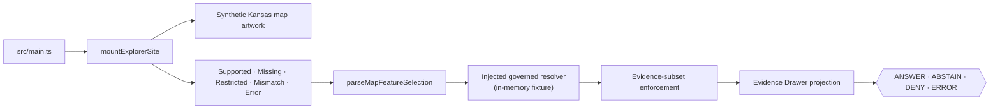
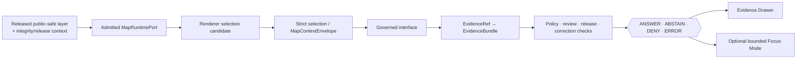
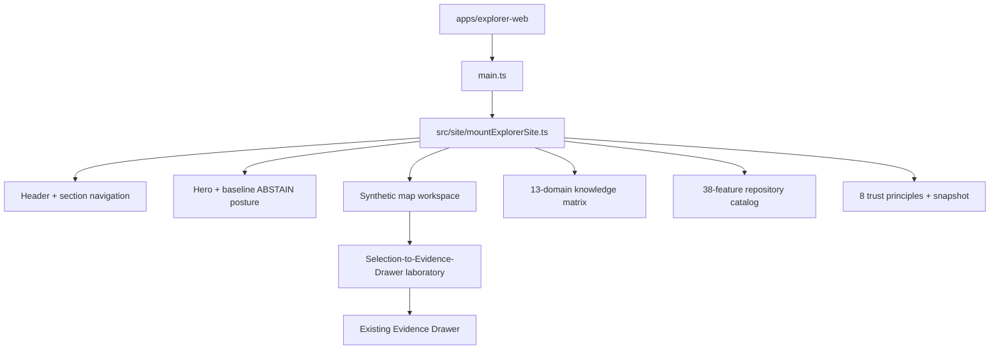

<a id="top"></a>
<a id="map-shell--architecture"></a>

<!-- [KFM_META_BLOCK_V2]
doc_id: kfm://doc/architecture/map-shell
title: Map Shell — Current Architecture and Implementation Boundary
type: architecture-reference
version: v2.0
status: draft; repository-grounded; bounded-executable; renderer-hold; non-publisher
owners:
  - "@bartytime4life — verified CODEOWNERS review route"
  - "NEEDS VERIFICATION — independent UI, accessibility, map-runtime, security, policy, evidence, and release stewardship"
created: 2026-05-14
updated: 2026-08-19
policy_label: public; architecture; ui; map-shell; trust-membrane; no-release; no-publication
owning_root: docs/
responsibility: Explain the current map-shell composition, implemented fixture-first trust slices, proposed renderer and transport seams, authority boundaries, validation posture, and graduation requirements without becoming contract, schema, policy, release, or runtime authority.
truth_posture: cite-or-abstain; current-state claims are pinned to repository evidence; proposals, decisions, deployment, and public-operation claims remain visibly bounded
current_path: docs/architecture/map-shell.md
evidence_snapshot:
  repository: bartytime4life/Kansas-Frontier-Matrix
  base_ref: main
  base_commit: 232f7aeda87abbc46c85a8dd37b75cc9def8a2c5
  target_prior_blob: 9e1fa4e8293d26c62b9a323d5302ad9a01aa1979
  explorer_composition_merge: c90c32dde6c28eaae5d2904ab16c5780b274fae4
  explorer_main_blob: 86c16e43e03601e65eb01b0b4949f7850089e877
  explorer_site_readme_blob: 3f2821cf221bb3b44e8e1236fe409edb34174787
  explorer_site_mount_blob: aa60d41dffdf14f44d1c5eb2817c379623a0c855
  explorer_site_catalog_blob: 31824767e618e43308916534a57de76b9b1c212e
  map_selection_bridge_blob: 18d61ea0ef2fbe2fc2f3cc9d42291c101003037f
  baseline_shell_blob: 64c78c78820af33fb7a622094e4c0944ad9412f8
  explorer_maplibre_adapter_blob: 663ba0f7a05498948f67d644387c73ab19d5c16c
  maplibre_package_manifest_blob: b0582955feeb51016327113692fa5c98ecad8816
  maplibre_package_entry_blob: 91664eb00583f9e3d0405eb7954fefa9a48f4ee9
  evidence_drawer_contract_blob: 412a0a86c85c98748ac08e263a94c7eaac760c04
  map_context_contract_blob: c6367306f14f9da56b3e3cbe7fad9d5545a0cdbf
related:
  - docs/architecture/README.md
  - docs/architecture/TRUST_MEMBRANE.md
  - docs/architecture/ui/BOUNDARIES.md
  - docs/architecture/ui/MAP_RUNTIME_BOUNDARY.md
  - docs/architecture/map-master/README.md
  - docs/architecture/maplibre.md
  - docs/doctrine/directory-rules.md
  - docs/adr/ADR-0005-apps-explorer-web-is-the-canonical-map-first-shell.md
  - docs/adr/ADR-0006-maplibre-boundary--only-maplibreadapter-imports-maplibre.md
  - "docs/adr/ADR-0007 — MapLibre GL JS Is the Sole Browser-Side Renderer.md"
  - docs/adr/ADR-0029-adopt-directory-governance-standard-v2.md
  - apps/explorer-web/src/main.ts
  - apps/explorer-web/src/site/README.md
  - apps/explorer-web/src/site/mountExplorerSite.ts
  - apps/explorer-web/src/site/catalog.ts
  - apps/explorer-web/src/features/map_runtime/index.tsx
  - apps/explorer-web/src/features/evidence_drawer/index.tsx
  - apps/explorer-web/src/adapters/MapLibreAdapter.ts
  - packages/maplibre/README.md
  - contracts/ui/evidence_drawer_payload.md
  - contracts/ui/map_context_envelope.md
  - apps/explorer-web/tests/explorer-site-catalog.test.ts
tags: [kfm, architecture, ui, explorer-web, map-shell, map-runtime, maplibre, evidence-drawer, finite-outcomes, trust-membrane, renderer-hold, correction, rollback]
notes:
  - "v2.0 replaces proposal-era, no-repository language with a current repository-grounded architecture and implementation boundary."
  - "Merged PR #3070 composes a repository-grounded Explorer site with a synthetic renderer-neutral map stage, 38 feature families, 13 domains, 8 trust principles, and a deterministic map-selection-to-Evidence-Drawer laboratory."
  - "The concrete MapLibre runtime remains on HOLD: Explorer declares no maplibre-gl dependency, packages/maplibre remains a private 0.0.0 scaffold, and MapLibreAdapter.ts is comment-only."
  - "ADR-0029 is accepted. ADR-0005, ADR-0006, and ADR-0007 remain proposed; this page records their boundaries without accepting them."
  - "This change updates one human-readable architecture page only. It does not alter app code, contracts, schemas, policy, dependencies, release state, deployment, or publication."
[/KFM_META_BLOCK_V2] -->

# Map Shell — Current Architecture and Implementation Boundary

> **Operating rule.** The map shell is a downstream, trust-visible browser composition. It may render finite governed outcomes and already released public-safe carriers; it does not create truth, resolve evidence authority, decide policy, approve review or release, or publish by displaying something.


| Field | Current bounded result |
|---|---|
| **Evidence snapshot** | `main@232f7aeda87abbc46c85a8dd37b75cc9def8a2c5` |
| **Document role** | Human-readable cross-cutting architecture reference at the existing path; no semantic, schema, policy, runtime, or release authority |
| **Placement authority** | **CONFIRMED:** accepted [ADR-0029](../adr/ADR-0029-adopt-directory-governance-standard-v2.md) adopts [Directory Rules v2](../doctrine/directory-rules.md) |
| **Current Explorer entrypoint** | **CONFIRMED:** [`src/main.ts`](../../apps/explorer-web/src/main.ts) mounts the repository-grounded site composition |
| **Current composed shell** | **CONFIRMED / BOUNDED:** map-first landing surface, four navigation regions, 38 repository feature families, 13 knowledge domains, 8 trust principles, and a deterministic synthetic map-evidence laboratory |
| **Current map stage** | **SYNTHETIC:** decorative Kansas SVG plus keyboard-operable fixture controls; no real basemap, tile source, released layer, camera runtime, or MapLibre boot |
| **Current selection boundary** | **CONFIRMED / BOUNDED:** strict renderer-neutral selection parsing, injected governed resolver, evidence-subset enforcement, and finite Evidence Drawer outcomes |
| **Evidence Drawer** | **CONFIRMED / BOUNDED:** closed fixture-first public-safe profile, parser/view model, keyboard rendering, correction history, and no-leak negative states |
| **Map context contract** | **PROPOSED / INACTIVE:** renderer-neutral, no-network `MapContextEnvelope` contract and fixture lane; not composed into the current site |
| **Concrete renderer** | **HOLD:** no `maplibre-gl` dependency in Explorer; `packages/maplibre/` is a private `0.0.0` scaffold; `MapLibreAdapter.ts` contains only a boundary comment |
| **Decision state** | **MIXED:** ADR-0029 accepted; shell, adapter, and sole-renderer ADRs 0005–0007 remain proposed |
| **Live governed transport** | **NOT ESTABLISHED:** current site uses deterministic in-memory fixture resolution; no claim-bearing network path is composed |
| **Deployment / public operation** | **UNKNOWN / not established:** this page does not prove hosting, authentication, CSP, operational telemetry, released data, or publication |
| **Review route** | `@bartytime4life` through CODEOWNERS; independent specialist review remains **NEEDS VERIFICATION** |

> [!IMPORTANT]
> **Repository-grounded does not mean production.** The current shell is real code and a real build surface, but its map is intentionally synthetic and its positive evidence case is fixture-only. A rendered `ANSWER` in that laboratory is not a live KFM claim.

> [!CAUTION]
> **MapLibre remains unadmitted.** The repository records a MapLibre package home, readiness candidate, proposed adapter seam, and proposed sole-renderer decision. It does not yet contain the dependency closure, functioning adapter, browser probes, released-layer flow, or reviewed decision state needed to claim a concrete map runtime.

> [!WARNING]
> **Pixels, feature properties, catalog entries, badges, and generated prose are not evidence.** A map interaction may scope a request. Only an upstream governed process may resolve evidence, policy, review, release, correction, and rollback state.

## Quick Jump

- [0. Current evidence snapshot](#0-current-evidence-snapshot)
- [1. Purpose & Scope](#1-purpose--scope)
- [2. Operating Law](#2-operating-law)
- [3. Trust Membrane Rules](#3-trust-membrane-rules)
- [4. Core Interaction Slice](#4-core-interaction-slice)
- [5. Shell Anatomy](#5-shell-anatomy)
- [6. MapRuntimePort — Adapter Interface](#6-mapruntimeport--adapter-interface)
- [7. State Ownership](#7-state-ownership)
- [8. Object Families at the Shell Boundary](#8-object-families-at-the-shell-boundary)
- [9. Finite Outcomes](#9-finite-outcomes)
- [10. Anti-Patterns](#10-anti-patterns)
- [11. Validation Requirements](#11-validation-requirements)
- [12. Implementation Homes and Current Maturity](#12-implementation-homes-and-current-maturity)
- [13. Placement Note & Directory Rules Basis](#13-placement-note--directory-rules-basis)
- [14. FAQ](#14-faq)
- [15. Related Docs](#15-related-docs)

---

## 0. Current evidence snapshot

### 0.1 What changed since the prior edition

The prior edition was written as a proposal against an unmounted repository. Current evidence now establishes a materially different—but still bounded—state:

1. Merged PR `#3070` replaced the inert default page with a repository-grounded Explorer composition.
2. [`main.ts`](../../apps/explorer-web/src/main.ts) mounts [`mountExplorerSite`](../../apps/explorer-web/src/site/mountExplorerSite.ts).
3. The composed site exposes **Map**, **Knowledge**, **Features**, and **Trust** regions.
4. [`catalog.ts`](../../apps/explorer-web/src/site/catalog.ts) inventories 38 feature families, 13 knowledge domains, and 8 trust principles with conservative maturity labels.
5. The map region is a decorative, explicitly synthetic SVG—not a renderer.
6. The selection laboratory reuses the strict [`map_runtime`](../../apps/explorer-web/src/features/map_runtime/index.tsx) bridge and the bounded Evidence Drawer.
7. The current MapLibre package and adapter remain non-functional scaffolds, and the catalog keeps renderer admission on `HOLD`.

### 0.2 Current composed surfaces

| Surface | Current implementation | Authority limit |
|---|---|---|
| Site header and navigation | Brand, section navigation, shell and renderer status chips | Navigation is not route authority or release state |
| Hero / posture | Map-first value statement plus `ABSTAIN / NO_GOVERNED_RESPONSE` baseline posture | Describes current composed trust posture; no dynamic response |
| Map workspace | Synthetic Kansas illustration, visible renderer HOLD, repository issue link | No coordinates, source data, tiles, MapLibre runtime, or public layer |
| Map-evidence laboratory | Supported, missing, restricted, mismatched, and resolver-error cases | Deterministic fixtures only |
| Knowledge matrix | Thirteen domain summaries and public-safety guardrails | Domain navigation, not live domain data |
| Feature catalog | Search/filter over 38 repository feature families and maturity labels | Descriptive repository snapshot; not runtime availability |
| Trust architecture | Eight KFM trust principles and exact-revision repository link | Human-readable orientation, not policy execution |
| Evidence Drawer | Finite projection with citations, limitations, trust labels, and correction history | Projection only; no live evidence authentication |
| Footer disclaimer | Explicitly not for emergency, legal-title, regulatory, or life-safety decisions | Safety language, not operational certification |

### 0.3 Current implementation contradictions and drift

Current executable bytes outrank older documentation when describing what the entrypoint does. Several adjacent pages still describe the pre-`#3070` entrypoint as a fixed no-input shell. That wording is now stale for **composition**, although the `ABSTAIN` baseline remains embedded as the shell posture.

| Adjacent surface | Current conflict | Disposition in this page |
|---|---|---|
| [`apps/explorer-web/README.md`](../../apps/explorer-web/README.md) | Says the default entrypoint is still the earlier minimal fail-closed composition | Treat as **STALE current-state prose**; retain its trust-boundary guidance |
| [`ui/BOUNDARIES.md`](./ui/BOUNDARIES.md) | Evidence snapshot predates the new site composition | Treat as a strong boundary reference with **NEEDS VERIFICATION** current-state rows |
| [`ui/MAP_RUNTIME_BOUNDARY.md`](./ui/MAP_RUNTIME_BOUNDARY.md) | Proposal-era routes, owners, paths, and “canonical” language predate current repository reconciliation | Treat as design lineage; ADR-0006 and current code remain controlling evidence for decision and implementation state |
| [`map-master/README.md`](./map-master/README.md) and [`maplibre.md`](./maplibre.md) | Separate current lane navigation from proposal-era renderer and package claims | Use the folder README as the Map Master landing page; evaluate MapLibre implementation claims against current repository evidence |
| Site catalog snapshot | Intentionally pins an earlier repository commit and a `6.4.0` readiness candidate | Descriptive snapshot only; not upstream currentness or dependency admission |

This one-file update does not silently rewrite those siblings. Their reconciliation is follow-up documentation work with its own review and rollback boundary.

[Back to top](#top)

---

## 1. Purpose & Scope

The **Map Shell** is KFM's browser-side composition boundary for map-first exploration, trust-visible state, evidence inspection, and bounded user workflows. It is where released public-safe carriers and governed finite outcomes become usable—not where their authority is created.

### 1.1 In scope

- The current `apps/explorer-web/` composition and its bounded maturity.
- The synthetic map stage and renderer-neutral selection-to-drawer bridge.
- The separation among browser composition, map runtime, governed transport, evidence, policy, review, release, and publication.
- The proposed `MapRuntimePort` / `MapLibreAdapter` seam and its current HOLD state.
- Current shell state, feature catalog, domain navigation, Evidence Drawer, finite outcomes, correction visibility, and accessibility posture.
- Graduation evidence required before a real renderer, released layer, live transport, Focus Mode, export, or public operation can be claimed.
- Current documentation drift that materially affects interpretation of the shell.

### 1.2 Out of scope

This page does not:

- accept ADR-0005, ADR-0006, ADR-0007, or any other proposed decision;
- install or pin MapLibre, create a functional adapter, or admit a plugin/protocol;
- define semantic object meaning or machine shape;
- activate the Governed API, an EvidenceBundle resolver, policy evaluator, model runtime, source, tile service, CDN, or object store;
- create a route tree, authentication, authorization, CSP, CORS, telemetry, or deployment;
- approve review, promotion, release, correction, rollback, or publication;
- turn synthetic `ANSWER` fixtures into current Kansas claims;
- move, rename, consolidate, or retire neighboring map/UI documentation.

### 1.3 Authority by question

| Question | Controlling evidence |
|---|---|
| Where does this page belong? | Accepted ADR-0029, adopted Directory Rules v2, and the existing `docs/architecture/` lane |
| What does the current shell do? | Pinned Explorer code, tests, manifests, workflows, and merged implementation artifacts |
| What does a payload mean? | Its semantic contract, paired schema, policy, and accepted decision records |
| May a field or geometry be shown? | Evidence, rights, sensitivity, purpose, audience, policy, review, release, correction, and rollback state |
| Is the renderer admitted? | Accepted dependency/adapter decision, owning package manifest, lockfile closure, structural enforcement, browser probes, and consumer evidence |
| Is the shell deployed or public? | Deployment configuration, authentication/authorization, network policy, runtime logs, release records, and public-operation evidence |
| Is a claim published? | Governed release state—not a document, fixture, test, build, commit, merge, or rendered page |

[Back to top](#top)

---

## 2. Operating Law

> [!IMPORTANT]
> **Renderer downstream of trust.** A browser renderer may draw admitted released carriers and emit interaction candidates. It is not the canonical truth store, source registry, policy engine, evidence resolver, citation authority, review authority, release authority, publication authority, or AI authority.

The shell preserves these invariants:

1. **Lifecycle separation.** `RAW → WORK / QUARANTINE → PROCESSED → CATALOG / TRIPLET → PUBLISHED`. The browser does not make or skip a lifecycle transition.
2. **Governed public boundary.** Dynamic claim-bearing responses come through an admitted governed interface. Static delivery may serve only already released public-safe immutable artifacts with integrity and release context.
3. **Cite-or-abstain.** Consequential claims carry admissible evidence/citation support or render a bounded negative outcome.
4. **Candidate-not-claim interaction.** Camera, time, route, click, pixel, feature, style, and local state scope a request; they do not establish truth.
5. **Upstream sensitivity control.** Protected geometry is denied, generalized, delayed, aggregated, or suppressed before public bytes reach the browser. Style-only hiding is not access control.
6. **Finite outcomes.** Claim-bearing UI resolves to `ANSWER`, `ABSTAIN`, `DENY`, or `ERROR`; no fluent fallback upgrades uncertainty.
7. **Correction visibility.** Active release, freshness, supersession, withdrawal, correction, and rollback posture remain visible where material.
8. **Renderer neutrality before admission.** Current shell logic remains renderer-neutral until a reviewed adapter and dependency boundary closes.
9. **Watchers are non-publishers.** Diagnostics, telemetry, drift detection, map interaction, search, and AI may propose work; none can publish.
10. **Accessibility is part of trust.** State must be understandable through text, keyboard, focus, and non-map alternatives—not color or pixels alone.

### 2.1 Current versus target posture

```text
CURRENT BOUNDED COMPOSITION
repository-grounded site
  -> synthetic map illustration
  -> strict app-local selection profile
  -> injected in-memory resolver
  -> closed EvidenceDrawerPayload projection
  -> ANSWER / ABSTAIN / DENY / ERROR

TARGET GOVERNED MAP SHELL
released public-safe carrier + release/integrity context
  -> admitted MapRuntimePort / MapLibreAdapter
  -> renderer-neutral selection or MapContextEnvelope
  -> governed interface
  -> EvidenceRef resolution + policy + review + release checks
  -> finite response + EvidenceDrawerPayload / Focus projection
  -> correction-aware accessible UI
```

The current slice proves useful pieces of the target. It does not prove the target end to end.

[Back to top](#top)

---

## 3. Trust Membrane Rules

The architecture requirement and current proof must remain separate.

| ID | Architecture requirement | Current repository proof | Remaining gap |
|---|---|---|---|
| **TM-1** | Browser never reads RAW, WORK, QUARANTINE, PROCESSED/canonical, proof, graph, vector, model, or private stores as truth | Current site is in-memory and no-network; bounded source guards reject selected internal-store literals | Deployed network isolation, indirect dependency inventory, credentials, CDN/object-store policy |
| **TM-2** | Browser never calls a model provider/runtime directly | Current composition imports no model client and performs no model call | Live Focus transport, provider adapter, citation/policy closure, AIReceipt, production egress controls |
| **TM-3** | No layer loads without released public-safe identity, integrity, policy, and rollback context | No concrete layer or tile load exists | Accepted manifest binding, adapter logic, package dependency, browser probes, released fixture |
| **TM-4** | Sensitive geometry is transformed before delivery, never merely hidden by style | Synthetic restricted case returns `DENY`; sensitive domain catalog text preserves default-deny wording | Actual source/layer policy, transform receipts, public-safe tiles, leakage tests |
| **TM-5** | Map interaction opens governed evidence context; popup/feature properties are not claims | `MapFeatureSelection` is strict; the bridge uses an injected resolver and opens the Evidence Drawer | Real renderer selection mapping and authenticated governed transport |
| **TM-6** | Resolved evidence must remain within the selection's governed scope | Current bridge rejects returned drawer evidence outside the clicked selection's evidence set | Authoritative server-side selection/evidence binding |
| **TM-7** | Exports preserve citations, rights, release identity, correction state, and safe transforms | Export is cataloged/documented only; no export execution is composed | Export contract, policy, renderer capture, artifact receipt, browser tests |
| **TM-8** | Watchers, diagnostics, and telemetry cannot publish | Current browser composition performs no repository or lifecycle mutation | Operational telemetry policy, deployed sinks, release separation proof |
| **TM-9** | Withdrawal/correction/rollback state propagates to visible surfaces | Evidence Drawer fixtures show bounded correction and superseded history | Authenticated correction registry, release binding, cache invalidation, rollback replay |
| **TM-10** | Trust remains accessible without relying on map or color | Site uses semantic landmarks, skip link, buttons, visible status text, and keyboard-operable fixture controls | Full production accessibility audit, non-map data alternative, real map keyboard behavior |

> [!WARNING]
> **A source-level no-leak check is not deployed security proof.** It is a regression guard. Production trust requires network, authentication, authorization, CSP, dependency, runtime, and operations evidence tied to a released configuration.

[Back to top](#top)

---

## 4. Core Interaction Slice

### 4.1 Current executable slice


```mermaid
flowchart LR
  MAIN["src/main.ts"] --> SITE["mountExplorerSite"]
  SITE --> ART["Synthetic Kansas map artwork"]
  SITE --> CASES["Supported · Missing · Restricted · Mismatch · Error"]
  CASES --> PARSE["parseMapFeatureSelection"]
  PARSE --> RESOLVE["Injected governed resolver<br/>(in-memory fixture)"]
  RESOLVE --> SUBSET["Evidence-subset enforcement"]
  SUBSET --> DRAWER["Evidence Drawer projection"]
  DRAWER --> OUTCOME{{"ANSWER · ABSTAIN · DENY · ERROR"}}
```

Current guarantees:

- the selection shape is closed and bounded;
- identifiers and evidence references are validated;
- an empty evidence set abstains;
- resolver failure errors safely;
- returned evidence outside the selected scope errors safely;
- the Evidence Drawer suppresses unsafe negative-state content;
- buttons, live status, drawer focus, and teardown are deterministic;
- no network, source, policy engine, evidence store, renderer, model, release, or publication mutation occurs.

Current non-guarantees:

- no map click is observed;
- no layer manifest is authenticated;
- no EvidenceRef is authoritatively resolved;
- no policy engine runs;
- no release state is proven;
- no network boundary is exercised;
- no current Kansas observation is displayed.

### 4.2 Target interaction slice


```mermaid
flowchart LR
  REL["Released public-safe layer<br/>+ integrity/release context"] --> PORT["Admitted MapRuntimePort"]
  PORT --> CLICK["Renderer selection candidate"]
  CLICK --> CTX["Strict selection / MapContextEnvelope"]
  CTX --> API["Governed interface"]
  API --> EVD["EvidenceRef → EvidenceBundle"]
  EVD --> GATES["Policy · review · release · correction checks"]
  GATES --> FINITE{{"ANSWER · ABSTAIN · DENY · ERROR"}}
  FINITE --> DRAWER["Evidence Drawer"]
  FINITE --> FOCUS["Optional bounded Focus Mode"]
```

The target must not be implemented by wiring the renderer directly to current synthetic projection objects. The renderer supplies candidate scope; the governed boundary remains responsible for authoritative resolution.

### 4.3 Graduation rule

A real map interaction may replace the synthetic controls only after a dependency-closed slice proves:

1. one physical renderer package home;
2. one accepted KFM-owned adapter/port seam;
3. approved exact dependency and lockfile ownership;
4. complete acquisition/import enforcement for the admitted scope;
5. one synthetic released public-safe layer descriptor and artifact fixture;
6. renderer boot without public network or canonical-store access in tests;
7. selection translation into the current strict renderer-neutral request shape;
8. finite supported and negative cases;
9. evidence/policy/release/correction references remain visible;
10. browser, accessibility, performance, teardown, and rollback evidence.

[Back to top](#top)

---

## 5. Shell Anatomy

### 5.1 Current composed anatomy


```mermaid
flowchart TB
  APP["apps/explorer-web"] --> ENTRY["main.ts"]
  ENTRY --> SITE["src/site/mountExplorerSite.ts"]
  SITE --> HEADER["Header + section navigation"]
  SITE --> HERO["Hero + baseline ABSTAIN posture"]
  SITE --> MAP["Synthetic map workspace"]
  MAP --> LAB["Selection-to-Evidence-Drawer laboratory"]
  SITE --> KNOW["13-domain knowledge matrix"]
  SITE --> CATALOG["38-feature repository catalog"]
  SITE --> TRUST["8 trust principles + snapshot"]
  LAB --> DRAWER["Existing Evidence Drawer"]
```

| Current component | Responsibility | Current status |
|---|---|---|
| `mountExplorerSite` | DOM composition, event listeners, deterministic teardown | **CONFIRMED executable** |
| Site catalog | Repository-pinned feature/domain/principle inventory and filtering | **CONFIRMED executable / snapshot-bound** |
| Baseline shell resolver | No-input `ABSTAIN`; supplied-input `ERROR` | **CONFIRMED executable** |
| Synthetic map artwork | Clearly labeled decorative map-stage orientation | **CONFIRMED executable / no factual map data** |
| Map evidence fixture | Deterministic candidate-selection and finite drawer outcomes | **CONFIRMED executable / fixture-only** |
| Evidence Drawer | Strict public-safe projection and keyboard rendering | **CONFIRMED bounded slice** |
| Knowledge matrix | Domain summaries and safeguards | **CONFIRMED descriptive** |
| Feature catalog | Maturity-labeled navigation across current Explorer feature families | **CONFIRMED descriptive** |

### 5.2 Desired but not currently composed as live capability

| Surface | Current safe status |
|---|---|
| Real MapLibre canvas / map lifecycle | **HOLD** |
| Released layer catalog and layer toggles | **DOCUMENTED / not composed as live layer runtime** |
| URL route tree and cross-route map continuity | **NOT ESTABLISHED** |
| Material time state applied to live layers | **FIXTURE-FIRST / not live** |
| Governed API transport | **NOT ESTABLISHED in the site composition** |
| Live EvidenceBundle resolution | **NOT ESTABLISHED** |
| Focus Mode transport/model/citation path | **FIXTURE-FIRST / not live** |
| Story-to-map continuity | **FIXTURE-FIRST / not live** |
| Compare / governed export | **DOCUMENTED / not live** |
| Review mutation | **OUT OF SCOPE; read-only projection only** |
| Deployment, auth, CSP, observability | **UNKNOWN** |

### 5.3 Composition law

A feature folder, catalog row, fixture, test, or documentation page does not make a feature part of the live shell. Current composition is proved by the `main.ts → mountExplorerSite` import and call graph. Future current-state claims must follow the same evidence rule.

[Back to top](#top)

---

## 6. MapRuntimePort — Adapter Interface

The section anchor is retained for compatibility. The implementation state has changed from “all proposed” to a mixed boundary.

### 6.1 Current executable anti-corruption seam

The current app-local [`MapFeatureSelection`](../../apps/explorer-web/src/features/map_runtime/index.tsx) profile is the only verified executable map-boundary object in the composed site.

```ts
type MapFeatureSelection = Readonly<{
  profile: "kfm.explorer.map-feature-selection.v1";
  selectionId: string;
  layerId: string;
  featureId: string;
  evidenceRefs: readonly string[];
}>;
```

It intentionally contains no geometry, renderer handle, style, paint/layout state, source-layer object, raw feature properties, credentials, endpoint, or model context.

### 6.2 Proposed renderer seam

[ADR-0006](../adr/ADR-0006-maplibre-boundary--only-maplibreadapter-imports-maplibre.md) proposes one `MapRuntimePort` and one concrete `MapLibreAdapter` acquisition/import seam. It remains proposed.

```ts
// PROPOSED design sketch — not an accepted or implemented public API.
interface MapRuntimePort {
  setCamera(camera: CameraState): void;
  setTimeContext(time: TimeState): void;
  loadValidatedLayer(descriptor: LayerDescriptor): Promise<void>;
  removeLayer(layerId: LayerId): void;
  setLayerVisibility(layerId: LayerId, visible: boolean): void;
  queryRenderedFeatureAtPoint(point: ScreenPoint): RenderedFeatureCandidate | null;
  destroy(): void;
}
```

### 6.3 Current physical evidence

| Surface | Current result |
|---|---|
| [`packages/maplibre/package.json`](../../packages/maplibre/package.json) | Private `@kfm/maplibre`, version `0.0.0`, no scripts, exports, engines, or dependencies |
| [`packages/maplibre/src/index.ts`](../../packages/maplibre/src/index.ts) | One placeholder export |
| [`apps/explorer-web/src/adapters/MapLibreAdapter.ts`](../../apps/explorer-web/src/adapters/MapLibreAdapter.ts) | One boundary comment; no import, export, type, or implementation |
| Explorer package manifest | Real build/test scripts, but no `maplibre-gl` dependency |
| Renderer ADRs | ADR-0006 and ADR-0007 remain proposed |
| Current catalog | MapLibre readiness candidate `6.4.0`, dependency not admitted, runtime not implemented, state `HOLD` |

### 6.4 Port rules

An eventual port/adapter must:

- accept KFM-owned renderer-neutral inputs;
- expose candidate interactions rather than claims;
- keep evidence, policy, review, release, correction, and rollback upstream;
- own renderer lifecycle and teardown;
- make loading, stale, denied, and error states explicit;
- deny arbitrary URLs and undeclared plugins/protocols;
- keep sensitive transforms upstream;
- expose no raw renderer handle to ordinary feature code;
- remain removable through a tested package/application rollback.

It must not:

- resolve EvidenceBundles;
- fetch canonical or lifecycle stores;
- call model runtimes;
- approve layer admission;
- infer trust from successful rendering;
- publish or mutate release state;
- turn a feature-property object into drawer content.

[Back to top](#top)

---

## 7. State Ownership

### 7.1 Current composed state

| State | Current owner | Persistence | Current authority |
|---|---|---|---|
| Site lifecycle | `mountExplorerSite` controller | Mount lifetime | DOM composition and teardown only |
| Baseline trust posture | `resolveBaselineShell` | Constant | App-local `ABSTAIN` / `ERROR` status |
| Feature/domain catalog | Frozen constants in `catalog.ts` | Bundle lifetime | Descriptive repository snapshot |
| Feature filters | Site composition controls | Current page only | Local presentation |
| Selected domain | Site composition | Current page only | Navigation choice |
| Synthetic map case | Map fixture controller | Current page only | Fixture selection, not evidence |
| Drawer view state | Evidence Drawer controller/view model | Current page only | Validated public-safe projection |
| Correction history | Drawer payload projection | Payload lifetime | Displayed declaration, not authenticated correction authority |
| Renderer/camera/layers | None | None | Not implemented |
| Material time context | None in map runtime | None | Not implemented |
| Route continuity | Anchor navigation only | URL fragment | Not an application route contract |
| Focus/story/export/review | Not part of current live composition | — | Cataloged or fixture-first only |

### 7.2 Proposed future ownership

| State | Proposed owner | Required authority |
|---|---|---|
| Map camera/projection | `MapRuntimePort` behind shell state | Accepted adapter and renderer decision |
| Time context | Shell time owner | Accepted temporal contract and released layer support |
| Layer visibility/order/filters | Layer catalog state | Released layer descriptors and policy-safe filter contract |
| Claim selection | Renderer-neutral selection / `MapContextEnvelope` | Governed request contract |
| Evidence Drawer | Drawer view state | Governed finite response and public-safe projection |
| Focus request/response | Focus feature state | Governed AI/runtime contract, policy, citations, receipts |
| Story state | Story Player | Released public-safe StoryManifest projection |
| Compare/export | Dedicated feature state | Export contract, rights/policy, release identity, receipt |
| Review | Read-only projection in Explorer | Separate review authority and app for mutation |
| Diagnostics/telemetry | Minimized local/operational state | Accepted telemetry contract and policy |

> [!NOTE]
> **State ownership does not transfer authority.** A component may own presentation state while the underlying evidence, policy, release, or correction record remains upstream.

[Back to top](#top)

---

## 8. Object Families at the Shell Boundary

| Object / profile | Repository state | Shell role | Authority limit |
|---|---|---|---|
| `BaselineShellState` | **CONFIRMED app-local executable** | Fixed no-input `ABSTAIN` and input-rejection `ERROR` posture | Not a cross-root runtime contract |
| `MapFeatureSelection` | **CONFIRMED app-local executable** | Strict candidate scope for the synthetic click bridge | Selection is not evidence |
| `EvidenceDrawerPayload` | **CONFIRMED closed fixture-first schema and browser consumer; semantic profile PROPOSED** | Public-safe finite drawer projection | Does not create/authenticate evidence, policy, review, or release |
| `MapContextEnvelope` | **PROPOSED / inactive / fixture-first** | Renderer-neutral context projection for future governed requests | Not composed; no authority |
| `MapRuntimePort` | **PROPOSED design / no functioning implementation established** | KFM-owned renderer abstraction | ADR-0006 not accepted |
| `MapLibreAdapter` | **COMMENT-ONLY placeholder** | Intended concrete renderer seam | No runtime behavior |
| `LayerManifest` / `TileArtifactManifest` / release context | **Repository families exist in broader KFM surfaces; current shell binding not established** | Future admitted layer identity and integrity | Presence elsewhere is not live shell admission |
| `EvidenceRef` / `EvidenceBundle` | **Core evidence families; current site uses synthetic refs/projections** | Upstream support for consequential claims | Browser never resolves authority from IDs alone |
| `PolicyDecision` / review / release / correction / rollback | **Separate authority families; current site projects labels only** | Trust-visible context | Browser labels do not execute or prove decisions |
| Focus response / `AIReceipt` | **Fixture-first or documented elsewhere; not composed live here** | Future bounded synthesis | No browser model authority |
| Story / export objects | **Fixture-first or documented elsewhere; not composed live here** | Future playback/export | No authoring or publication authority |

### 8.1 Evidence closure rule

A current `EvidenceDrawerPayload` can be schema-valid and still lack authoritative evidence closure. Production composition must bind the payload to current upstream records without exposing protected details or internal-store paths.

### 8.2 Contract drift rule

Architecture prose must not invent a second machine shape. Changes to the current app-local selection profile, Evidence Drawer profile, or MapContextEnvelope require corresponding semantic/schema/fixture/validator/test review in their owning roots.

[Back to top](#top)

---

## 9. Finite Outcomes

The current composed laboratory exercises all four outcomes while keeping their authority bounded.

| Outcome | Current path | Meaning in the laboratory | Production requirement |
|---|---|---|---|
| `ANSWER` | Supported synthetic streamflow case | A fixture projection is internally supported by its declared synthetic citation/evidence reference | Authoritative EvidenceBundle resolution, policy allow, review, release, citation validity, current correction state |
| `ABSTAIN` | Missing evidence / baseline posture | No admissible evidence or governed response is available | Stable reason code and no unsupported claim |
| `DENY` | Restricted synthetic feature | Policy-shaped fixture suppresses protected detail and carries no citations/evidence/history | Authenticated policy decision and safe public copy |
| `ERROR` | Invalid selection, evidence mismatch, resolver error, malformed drawer input | The operation failed safely and exposes no claim | Correlation/receipt support and safe diagnostic policy |

### 9.1 Outcome laws

- A fixture `ANSWER` is not a production `ANSWER`.
- `ABSTAIN` is successful fail-closed behavior, not an empty-state bug.
- `DENY` must not leak the protected reason or reconstructable detail.
- `ERROR` never falls back to cached or generated claim text.
- Every visual state has an equivalent textual status.
- Current and superseded evidence remain separate.
- A renderer success cannot upgrade an outcome.
- A catalog maturity label cannot upgrade an outcome.

[Back to top](#top)

---

## 10. Anti-Patterns

| Anti-pattern | Current control | Residual risk / required closure |
|---|---|---|
| **Renderer as truth** | Synthetic artwork and bridge text explicitly state map properties are not evidence | Real renderer must preserve the same law |
| **Repository catalog as runtime authority** | Snapshot and non-effects are visible | Catalog freshness and generated-mirror discipline need ongoing validation |
| **Direct model client** | No composed provider/model calls | Future Focus implementation requires network and import enforcement |
| **Direct internal-store path** | Current site is no-network; bounded source test exists | Deployed network and dependency closure remain unproven |
| **Unreleased `addSource`** | No renderer or source load exists | Manifest/policy/release gating not implemented |
| **Style-only sensitive hiding** | No live sensitive geometry; restricted fixture denies | Upstream transform and byte-leak tests required |
| **Popup as Evidence Drawer substitute** | No popup; synthetic interactions open the drawer | Real map adapter must not forward raw properties |
| **Feature-property claim** | Strict selection carries IDs and evidence refs only | Real event translation must strip renderer payloads |
| **Evidence scope laundering** | Drawer evidence must be a subset of selection evidence refs | Server must establish the original governed scope |
| **Fixture-to-production overclaim** | Site labels synthetic scope and renderer HOLD | Reviews and docs must preserve maturity distinction |
| **Competing renderer/package homes** | Current package path is visible; ADRs record the open decision | Accepted physical home and repository-wide acquisition enforcement needed |
| **Stale architecture presented as current** | This page records known adjacent-doc conflicts | Separate modernization campaign still required |
| **Watcher/diagnostic publishes** | Browser has no write/publish path | Operational controls remain separate |
| **Silent withdrawal/cache drift** | Drawer fixture shows correction history | Live release, correction, cache invalidation, rollback not established |
| **Accessibility as visual polish** | Skip link, semantic sections, buttons, live status, focus behavior exist | Real map and production accessibility evidence remain open |

[Back to top](#top)

---

## 11. Validation Requirements

### 11.1 Current executable proof

The current repository contains focused proof for the bounded pieces described here:

| Proof surface | What it establishes | What it does not establish |
|---|---|---|
| Explorer build | TypeScript and Vite composition are buildable under the locked workspace | Deployment, runtime source access, or publication |
| Explorer unit tests | Catalog invariants and many fixture-first UI feature behaviors | Live routes or authoritative data |
| Explorer browser tests | Selected accessibility and browser projection behavior | Production browser/device matrix or live map |
| Site catalog test | Unique feature/domain IDs, 13 domains, renderer HOLD, sensitive-domain wording, filters | Complete repository truth or current upstream versions |
| Map runtime tests | Strict selection parsing, finite failures, evidence-subset enforcement, deterministic fixture behavior | Real renderer event translation or network transport |
| Evidence Drawer validator/tests | Closed shape, finite-state consistency, no-leak copy, bounded correction history | Evidence/policy/release authenticity |
| Adapter-boundary policy test | Bounded source/import and path-literal regression guard | Complete acquisition inventory or deployed network isolation |
| UI workflow | Locked install/build/unit/browser orchestration | Release or public operation |

Relevant commands:

```bash
pnpm --filter explorer-web build
pnpm --filter explorer-web test:unit
pnpm --filter explorer-web test:browser

python tools/validators/ui/validate_evidence_drawer_payload.py --fixtures
python -m unittest -q tests.validators.test_validate_evidence_drawer_payload
python -m pytest tests/policy/test_explorer_web_adapter_boundary.py -q
```

The exact command availability and aggregate behavior should be verified at the review head; this documentation change does not claim to have executed application tests locally.

### 11.2 Documentation validation for this page

A review of this page must verify:

- one closed `KFM_META_BLOCK_V2`;
- existing path and `doc_id` preserved;
- explicit compatibility anchors `top` and `map-shell--architecture`;
- numbered headings 1–15 retained;
- relative links resolve at the review head;
- no placeholder owner, CI, license, route, or package-path claim is promoted;
- current repository state is separated from proposed target architecture;
- ADR-0005/0006/0007 remain proposed;
- MapLibre remains `HOLD`;
- synthetic examples remain labeled synthetic;
- no release, deployment, or publication effect is claimed;
- rollback target identifies the prior blob.

### 11.3 Graduation backlog

#### P0 — decision and authority closure

1. Reconcile ADR-0005, ADR-0006, and ADR-0007 with current physical homes and implementation evidence.
2. Decide the one package/adapter home without creating a parallel runtime package.
3. Define accepted renderer/plugin/protocol vocabulary and structural acquisition enforcement.
4. Reconcile stale map/UI architecture pages before accepting a renderer decision.

#### P1 — first real map slice

1. Add one dependency-closed, synthetic, no-network renderer fixture through the accepted package seam.
2. Bind one released public-safe layer descriptor/artifact fixture with finite failures.
3. Translate one renderer selection into the current strict selection or admitted MapContextEnvelope.
4. Prove Evidence Drawer, correction, accessibility, teardown, and rollback behavior.
5. Preserve the current `HOLD` until all admission evidence closes.

#### P2 — operational maturity

1. Add authenticated governed transport, CSP/CORS, endpoint allowlist, and network isolation.
2. Prove deployment, browser/device support, performance budgets, telemetry minimization, and incident response.
3. Bind live release/correction/withdrawal/cache invalidation and rollback.
4. Add public non-map alternatives and production accessibility review.
5. Prove no sensitive or internal data can be reconstructed from delivered artifacts.

[Back to top](#top)

---

## 12. Implementation Homes and Current Maturity

| Responsibility | Current home | Current maturity | Boundary |
|---|---|---|---|
| Deployable browser composition | [`apps/explorer-web/`](../../apps/explorer-web/) | **CONFIRMED bounded executable** | App composition; not truth or release authority |
| Current site composition | [`apps/explorer-web/src/site/`](../../apps/explorer-web/src/site/) | **CONFIRMED executable** | Repository-grounded site and synthetic map laboratory |
| App-local map selection bridge | [`apps/explorer-web/src/features/map_runtime/`](../../apps/explorer-web/src/features/map_runtime/) | **CONFIRMED fixture-first executable** | Renderer-neutral candidate-to-drawer boundary |
| App-local Evidence Drawer | [`apps/explorer-web/src/features/evidence_drawer/`](../../apps/explorer-web/src/features/evidence_drawer/) | **CONFIRMED bounded executable** | Projection/rendering only |
| App-local renderer adapter placeholder | [`apps/explorer-web/src/adapters/MapLibreAdapter.ts`](../../apps/explorer-web/src/adapters/MapLibreAdapter.ts) | **COMMENT-ONLY / HOLD** | No functioning adapter |
| Reusable renderer package candidate | [`packages/maplibre/`](../../packages/maplibre/) | **Private `0.0.0` scaffold / HOLD** | Proposed implementation/distribution seam |
| UI payload semantics | [`contracts/ui/`](../../contracts/ui/) | **Mixed:** bounded proposed profiles and adjacent unresolved authority | Meaning, not runtime |
| UI machine shapes | [`schemas/contracts/v1/ui/`](../../schemas/contracts/v1/ui/) | **Mixed:** closed fixture profiles and other maturity states | Shape, not policy |
| Reusable synthetic examples | [`fixtures/ui/`](../../fixtures/ui/) | **CONFIRMED fixture lanes** | Synthetic only |
| UI validators | [`tools/validators/ui/`](../../tools/validators/ui/) | **CONFIRMED bounded validators** | Declared conformance, not public truth |
| App tests | [`apps/explorer-web/tests/`](../../apps/explorer-web/tests/) | **CONFIRMED executable tests** | App-local proof |
| Cross-root tests | [`tests/`](../../tests/) | **CONFIRMED mixed test roots** | Boundary/validator proof |
| Dynamic governed interface | [`apps/governed-api/`](../../apps/governed-api/) | **Repository-present; live shell transport not composed** | Trust-bearing dynamic responses |
| Policy | [`policy/`](../../policy/) | **Separate authority root; shell policy binding not established** | Admissibility |
| Release/correction/rollback | [`release/`](../../release/) and owning data families | **Separate authority; live shell binding not established** | State transitions and lineage |

### 12.1 Directory Rules basis

The current paths follow responsibility:

- `docs/architecture/` explains the cross-cutting map-shell architecture to humans.
- `apps/explorer-web/` owns deployable composition.
- `packages/maplibre/` is the current reusable renderer-package candidate.
- `contracts/` owns semantic meaning.
- `schemas/` owns machine shape.
- `policy/` owns admissibility.
- `fixtures/`, `tests/`, and `tools/validators/` own synthetic examples and executable proof.
- `release/` and the appropriate data families own release, correction, rollback, receipts, proofs, and published artifacts.

This page does not select an unaccepted child path, create a new root, or turn a compatibility/documentation path into implementation authority.

[Back to top](#top)

---

## 13. Placement Note & Directory Rules Basis

This file remains at `docs/architecture/map-shell.md`.

### 13.1 Responsibility signature

| Axis | Result |
|---|---|
| `artifact_kind` | Human architecture reference |
| `authority_owner` | `docs/` explanatory architecture |
| `scope_kind` | Cross-cutting browser shell, map-runtime, evidence-drawer, and governed-boundary composition |
| `exposure` | Public repository documentation; no restricted payloads or operational secrets |
| `mutability` | Versioned same-path replacement |
| `retention` | Durable architecture history |
| `placement_outcome` | `PLACE` — existing tracked path under accepted Directory Rules |
| `authority_not_held` | Semantic contract, schema, policy, dependency admission, runtime, review, release, deployment, publication |

### 13.2 Why this is a one-file update

The requested target is an existing cross-cutting architecture page. Its current defect is primarily truth drift: it presents all implementation as unmounted/proposed despite current executable composition, and it contains stale placeholder paths and decision claims. Updating this page in place is the smallest useful reversible correction.

Adjacent docs also need reconciliation, but combining them here would create a broad architecture campaign with different identities, anchors, evidence snapshots, and rollback targets. This change records those conflicts instead of hiding them.

### 13.3 Non-effects

This page does not:

- accept or reject an ADR;
- change the package or adapter home;
- add, remove, or pin a dependency;
- alter the Explorer site;
- define or amend a contract, schema, policy rule, fixture, validator, test, or workflow;
- activate a source, route, resolver, renderer, plugin, model, or network path;
- mutate lifecycle, review, release, correction, or rollback state;
- release, deploy, publish, or change repository settings.

### 13.4 Rollback

Restore prior target blob:

```text
9e1fa4e8293d26c62b9a323d5302ad9a01aa1979
```

Rollback changes documentation only. No data migration, source deactivation, cache invalidation, deployment rollback, correction notice, or public withdrawal is required.

[Back to top](#top)

---

## 14. FAQ

<details>
<summary><strong>Is the current Explorer site a real map application?</strong></summary>

It is a real executable browser composition, but its map stage is synthetic. The Kansas artwork is decorative, and the interaction controls are deterministic fixture buttons. No MapLibre dependency, basemap, tile source, released layer, camera runtime, or public data flow is composed.

</details>

<details>
<summary><strong>Why keep the baseline ABSTAIN state after composing a richer site?</strong></summary>

The baseline remains an honest shell-level posture: no governed dynamic response is available. The site can orient users and exercise bounded fixtures without pretending it has a live claim-bearing backend.

</details>

<details>
<summary><strong>Does the synthetic ANSWER prove EvidenceBundle resolution?</strong></summary>

No. It proves that the closed public-safe projection and browser rendering behave as declared for a synthetic fixture. It does not authenticate the evidence reference, execute policy, prove review, or establish release/publication state.

</details>

<details>
<summary><strong>Can a real MapLibre click forward feature properties directly to the drawer?</strong></summary>

No. A real adapter must translate the event into a strict renderer-neutral candidate request. Raw feature properties, styles, renderer objects, and hidden fields are not drawer claims. The governed boundary returns the finite projection.

</details>

<details>
<summary><strong>Why not add MapLibre in this documentation PR?</strong></summary>

Dependency admission is a separate implementation and architecture decision. It requires a resolved physical home, exact version ownership, lock closure, import/acquisition enforcement, adapter API, browser probes, fixtures, tests, supply-chain review, rollback, and human decision state. Documentation cannot substitute for those gates.

</details>

<details>
<summary><strong>What is the current 3D or peer-renderer posture?</strong></summary>

[ADR-0007](<../adr/ADR-0007 — MapLibre GL JS Is the Sole Browser-Side Renderer.md>) proposes MapLibre as the sole browser renderer and requires a separate exception ADR for a peer renderer. It remains proposed. No functioning MapLibre runtime or peer-renderer package is established by the inspected current surfaces. Older pages that state “Cesium retired” as settled doctrine overclaim the current decision state.

</details>

<details>
<summary><strong>May a CDN serve released map bytes directly?</strong></summary>

A governed static edge may serve already released public-safe immutable artifacts with integrity, release, correction, and rollback context. It must not become a parallel API, source registry, policy engine, or publication authority. Claim-bearing dynamic resolution still requires the governed boundary.

</details>

<details>
<summary><strong>Why do nearby documents describe an older entrypoint?</strong></summary>

Merged PR `#3070` changed executable composition after several architecture and app READMEs were last reconciled. Current code is stronger evidence for current behavior; older guidance still matters for doctrine and boundaries. Those documents need separate same-path updates rather than silent reinterpretation here.

</details>

<details>
<summary><strong>Can the feature catalog be treated as an implementation registry?</strong></summary>

No. It is a descriptive, repository-pinned presentation catalog with conservative maturity labels. It helps users navigate current feature families, but it is not a source registry, contract registry, policy decision, runtime health record, or release manifest.

</details>

[Back to top](#top)

---

## 15. Related Docs

### Accepted placement authority

- [Directory Rules v2](../doctrine/directory-rules.md)
- [ADR-0029 — Adopt Directory Governance Standard v2](../adr/ADR-0029-adopt-directory-governance-standard-v2.md)

### Proposed shell and renderer decisions

- [ADR-0005 — `apps/explorer-web` is the canonical map-first shell](../adr/ADR-0005-apps-explorer-web-is-the-canonical-map-first-shell.md)
- [ADR-0006 — only `MapLibreAdapter` imports MapLibre](../adr/ADR-0006-maplibre-boundary--only-maplibreadapter-imports-maplibre.md)
- [ADR-0007 — MapLibre GL JS is the sole browser-side renderer](<../adr/ADR-0007 — MapLibre GL JS Is the Sole Browser-Side Renderer.md>)

### Current application and bounded implementation

- [Explorer Web](../../apps/explorer-web/README.md) — boundary guidance; current-entrypoint prose predates merged site composition
- [Explorer site composition](../../apps/explorer-web/src/site/README.md)
- [Current entrypoint](../../apps/explorer-web/src/main.ts)
- [Site catalog](../../apps/explorer-web/src/site/catalog.ts)
- [Map selection bridge](../../apps/explorer-web/src/features/map_runtime/index.tsx)
- [Evidence Drawer implementation](../../apps/explorer-web/src/features/evidence_drawer/index.tsx)
- [MapLibre package boundary](../../packages/maplibre/README.md)

### Contracts and architecture companions

- [UI EvidenceDrawerPayload contract](../../contracts/ui/evidence_drawer_payload.md)
- [MapContextEnvelope contract](../../contracts/ui/map_context_envelope.md)
- [UI boundaries](./ui/BOUNDARIES.md) — strong boundary reference; current-state snapshot predates site composition
- [Map runtime boundary](./ui/MAP_RUNTIME_BOUNDARY.md) — proposal-era design companion; current implementation/decision state must be rechecked
- [Trust membrane](./TRUST_MEMBRANE.md)
- [Map Master landing page](./map-master/README.md) and [MapLibre lane entry](./maplibre.md) — current navigation with renderer-admission and implementation maturity still evaluated separately

### Validation and tests

- [Explorer site catalog test](../../apps/explorer-web/tests/explorer-site-catalog.test.ts)
- [Explorer adapter-boundary test](../../tests/policy/test_explorer_web_adapter_boundary.py)
- [Evidence Drawer validator](../../tools/validators/ui/validate_evidence_drawer_payload.py)

---

## Change history

| Version | Date | Change |
|---|---|---|
| `v1` | 2026-05-14 | Proposal-era architecture written without mounted repository evidence |
| `v2.0` | 2026-08-19 | Repository-grounded reconciliation after the composed Explorer site landed; preserves trust doctrine, records current bounded slices, keeps MapLibre on HOLD, and exposes adjacent-document drift |

<sub>Last evidence review: **2026-08-19** · Base: `main@232f7aeda87abbc46c85a8dd37b75cc9def8a2c5` · Prior blob: `9e1fa4e8293d26c62b9a323d5302ad9a01aa1979` · Release/publication effect: **none**.</sub>

[Back to top](#top)
