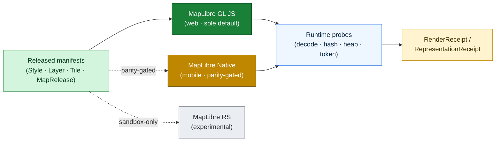
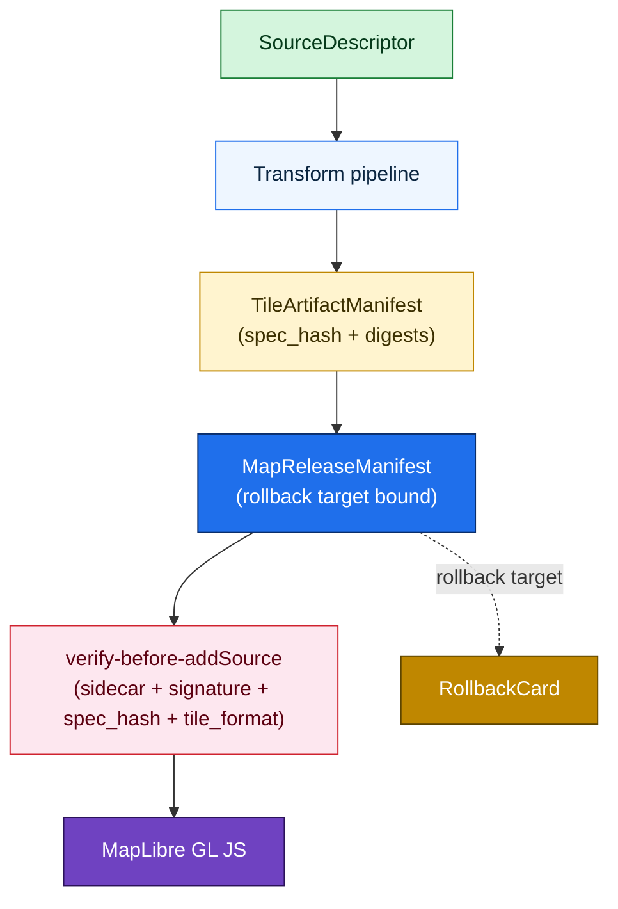
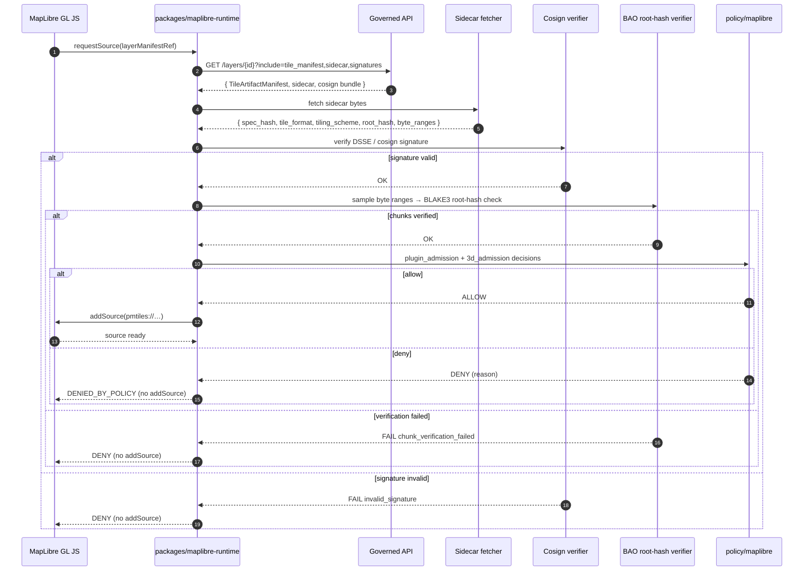

<a id="top"></a>

<!-- [KFM_META_BLOCK_V2]
doc_id: kfm://doc/architecture/maplibre-master
title: MapLibre Master — Components, Functions, Features Architecture Register
type: architecture
subtype: components-functions-features-register
version: v1 (draft)
status: draft
owners: <maplibre-runtime-stewards>  # PLACEHOLDER — assign before review
created: 2026-05-25
updated: 2026-05-25
policy_label: public
related:
  - docs/doctrine/directory-rules.md                                # v1.3 — placement authority
  - docs/architecture/map-master.md                                 # [MAP-MASTER] doctrinal anchor (abstract)
  - docs/architecture/maplibre-3d.md                                # sole-renderer ADR + 3D feature surface
  - docs/architecture/map-shell.md                                  # UI shell wiring (Evidence Drawer, Focus Mode)
  - docs/architecture/governed-api.md                               # trust-membrane boundary
  - docs/architecture/contract-schema-policy-split.md
  - docs/architecture/identity-and-spec-hash.md
  - docs/standards/PMTILES.md
  - docs/standards/OGC-API-TILES.md
  - docs/atlases/Master_MapLibre_Components-Functions-Features_v2.1.pdf   # PROPOSED placement; NEEDS VERIFICATION
  - schemas/contracts/v1/maplibre/
  - schemas/contracts/v1/3d/
  - policy/maplibre/
  - packages/maplibre-runtime/
  - apps/explorer-web/
extends:
  - Master MapLibre Components-Functions-Features v2.1 — §8 Components-Functions-Features Matrix; §11 Implementation-Ready Object Map; Categories A–AA
authority_posture: architecture register — subordinate to docs/doctrine/ and the renderer-decision ADR; coordinates with map-master.md (abstract) and maplibre-3d.md (3D-specific).
tags: [kfm, architecture, maplibre, components, functions, features, register, renderer, runtime]
notes:
  - "Per-component governance register. For abstract renderer-boundary doctrine see map-master.md; for 3D and the sole-renderer ADR see maplibre-3d.md; for UI shell see map-shell.md."
  - "No mounted repo inspected. Every path PROPOSED unless explicitly CONFIRMED at doctrine level."
  - "Cesium is retired (directory-rules.md v1.3 §0 / §13.5)."
[/KFM_META_BLOCK_V2] -->

# MapLibre Master — Components, Functions, Features Architecture Register

> *MapLibre's component surface — renderers, style language, sources, layers, expressions, filters, sprites, glyphs, tile formats, plugins, dependencies — codified as a per-component governance register. **Every component carries the same closed loop:** released inputs → bounded runtime behavior → emitted `RenderReceipt`. This file is the architecture-layer index for that register.*


<!-- TODO — wire CI badge once docs-lint workflow is named -->


| Field | Value |
|---|---|
| **Status** | `draft` |
| **Owners** | `<maplibre-runtime-stewards>` *(PLACEHOLDER — assign before review)* |
| **Last reviewed** | 2026-05-25 |
| **Authority class** | Architecture register (subordinate to `docs/doctrine/` and the renderer-decision ADR) |
| **Sibling architecture docs** | `map-master.md` *(abstract doctrine anchor)* · `maplibre-3d.md` *(sole-renderer ADR + 3D surface)* · `map-shell.md` *(UI shell wiring)* · `governed-api.md` *(trust membrane)* |
| **Indexed source dossier** | *Master MapLibre Components-Functions-Features* v2.1 — §8 CFF Matrix + §11 Implementation-Ready Object Map + Categories A–AA |
| **Renderer disposition** | **MapLibre GL JS as sole browser-side renderer** *(`directory-rules.md` v1.3 §0)*. Cesium retired. |
| **Implementation maturity** | `UNKNOWN` — no mounted repo, runtime, CI logs, or dashboards inspected this session |

---

## Quick jump

- [1. Purpose — and what this doc is **not**](#1-purpose--and-what-this-doc-is-not)
- [2. The Component / Function / Feature method](#2-the-component--function--feature-method)
- [3. Renderers](#3-renderers)
- [4. The style language](#4-the-style-language)
- [5. Assets — sprites and glyphs](#5-assets--sprites-and-glyphs)
- [6. Tile and data formats](#6-tile-and-data-formats)
- [7. 3D capability surface — pointer](#7-3d-capability-surface--pointer)
- [8. Plugin and dependency governance](#8-plugin-and-dependency-governance)
- [9. RenderReceipt and runtime probes](#9-renderreceipt-and-runtime-probes)
- [10. Required objects — the uniform list](#10-required-objects--the-uniform-list)
- [11. The verify-before-addSource discipline](#11-the-verify-before-addsource-discipline)
- [12. Schemas, contracts, policy, packages — placement](#12-schemas-contracts-policy-packages--placement)
- [13. Tests, CI, validation, rollback](#13-tests-ci-validation-rollback)
- [14. Anti-patterns](#14-anti-patterns)
- [15. Open questions](#15-open-questions)
- [16. Related docs](#16-related-docs)
- [Appendix A — Component register (full CFF table)](#appendix-a--component-register-full-cff-table)
- [Appendix B — Implementation-Ready Object Map](#appendix-b--implementation-ready-object-map)

---

<a id="1-purpose--and-what-this-doc-is-not"></a>

## 1. Purpose — and what this doc is **not**

The KFM corpus contains a dense per-component governance register inside the *Master MapLibre Components-Functions-Features* v2.1 dossier. That dossier asks one question over and over, per component:

> *What are the inputs, outputs, governed-API dependencies, evidence dependencies, policy dependencies, runtime/UI behavior, and required tests for this MapLibre component?*

This file is the **architecture-layer answer** to that question, indexed at a coarser grain than the dossier but at a finer grain than `map-master.md`'s abstract anchor.

| `docs/architecture/...` neighbor | What it owns | What it does **not** own |
|---|---|---|
| **`map-master.md`** | Abstract `[MAP-MASTER]` citation anchor; renderer-boundary doctrine; v2.1 category map; three-column discipline. | Per-component CFF rows. |
| **`maplibre-master.md`** *(this file)* | Per-component Component / Function / Feature register; renderers, style language, formats, plugins. | Abstract renderer-boundary doctrine *(see `map-master.md`)*; 3D feature surface *(see `maplibre-3d.md`)*; UI shell wiring *(see `map-shell.md`)*. |
| **`maplibre-3d.md`** | Sole-renderer ADR (PROPOSED); 3D feature surface — terrain, globe projection, 3D Tiles, glTF, point clouds; plugin pin list for 3D. | The 2D component surface; sprite/glyph hosting; tile-format admission outside 3D. |
| **`map-shell.md`** | UI shell — Evidence Drawer, Focus Mode wiring, time slider, exports, story surfaces. | Renderer adapter internals; tile format admission. |
| **`governed-api.md`** | The trust membrane the renderer reads through. | Renderer state. |

> [!IMPORTANT]
> **If this doc appears to contradict `map-master.md` or `maplibre-3d.md`, the doctrine docs win.** This file is a register; `map-master.md` is the anchor; `maplibre-3d.md` carries the renderer-decision ADR; `directory-rules.md` v1.3 is placement authority above all of them.

[↑ back to top](#top)

---

<a id="2-the-component--function--feature-method"></a>

## 2. The Component / Function / Feature method

`CONFIRMED` — Master MapLibre v2.1 §8 Components-Functions-Features Matrix uses a uniform per-component card with these columns:

| Column | What it answers |
|---|---|
| **Component** | The MapLibre piece (renderer, style block, source, layer type, asset class, tile format, plugin). |
| **Function** | What it does at runtime. |
| **Feature** | The specific KFM-governed capability it provides. |
| **Input artifacts** | The released contracts it consumes (e.g., `StyleManifest`, `LayerManifest`, `TileArtifactManifest`). |
| **Output artifacts** | The runtime state it emits (e.g., rendered viewport, click candidate, `MapContextEnvelope`). |
| **Governed-API dependency** | Where it reads through the trust membrane. |
| **Evidence dependency** | Which `EvidenceBundle` / `EvidenceRef` resolutions it needs. |
| **Policy dependency** | Which `PolicyDecision` gates it. |
| **Tile / style dependency** | Which artifacts and protocols it consumes. |
| **Runtime / UI behavior** | What the user sees, including trust-visible negative states. |
| **Tests required** | The validation discipline — schema, no-public-RAW, no-unreleased-tile-load, visual regression, etc. |
| **Status** | `CONFIRMED` / `EXPANDED` / `RETAINED` / `PROPOSED` / `NEEDS VERIFICATION` / `UNKNOWN`. |

Every section below applies this template. The full register is in **[Appendix A](#appendix-a--component-register-full-cff-table)**.

[↑ back to top](#top)

---

<a id="3-renderers"></a>

## 3. Renderers

`CONFIRMED` from the v2.1 dossier — three renderer entries are tracked. Only one is admitted as the public default.



| Renderer | Function | Disposition | Status |
|---|---|---|---|
| **MapLibre GL JS** | 2D / 2.5D / 3D web renderer and interaction runtime. Click candidates, camera, time context. Verify-before-`addSource` for PMTiles. | **Sole browser-side renderer** *(`directory-rules.md` v1.3; `maplibre-3d.md` Appendix B PROPOSED ADR)*. | `CONFIRMED` doctrine / `PROPOSED` implementation. |
| **MapLibre Native** | Mobile / native rendering. | **Parity-gated.** Public only after Evidence Drawer, Focus Mode, denial, abstain, offline-cache parity with web is demonstrated by runtime probes. | `NEEDS VERIFICATION`. |
| **MapLibre RS** | Experimental Rust / WebGPU renderer. | **Sandbox only.** Not a public default. Plugin admission, security review, and runtime parity all open. | `UNKNOWN` / `RETAINED`. |

> [!WARNING]
> **MapLibre Native and MapLibre RS are not public default surfaces.** Any work that promotes them past test fixtures requires runtime probes (decode latency, hash throughput, heap stability, token SLA) and a documented allowlist in `policy/maplibre/`. `CONFIRMED` doctrine; `PROPOSED` enforcement.

[↑ back to top](#top)

---

<a id="4-the-style-language"></a>

## 4. The style language

`CONFIRMED` (v2.1 §8) — five components carry the MapLibre style spec discipline:

| Component | Function | Required input | Governance hook |
|---|---|---|---|
| **Style JSON** | Cartographic contract — sources, layers, expressions, layout/paint, glyph/sprite refs. | `StyleManifest`, sprites, glyphs, design tokens. | Loads only released sources; visual regression; style-hash check. |
| **Source definition** | Binds the style to PMTiles / MVT / GeoJSON / `raster-dem` / WMS / COG via governed URLs. | `LayerManifest`, `TileArtifactManifest`, `SourceDescriptor`. | **Blocked if unreleased or stale**; no canonical or RAW URL admitted. |
| **Layer definition** | Visual layer binding — fill / line / symbol / heatmap / hillshade / raster / `fill-extrusion`. | `StyleManifest` + `LayerManifest`. | Trust badges and stale state surfaced; sensitivity policy applied. |
| **Expressions** | Data-driven styling — classification, labeling, conditional rendering. | `StyleManifest`. | **Public-safe styling only**; cannot hide source role in color alone. |
| **Filters** | Layer filtering at render time. | `StyleManifest` + `LayerManifest`. | **Cannot be the only protection for sensitive geometry** — see [§14 AP-MM-1](#14-anti-patterns). |

> [!CAUTION]
> **Style-filter geoprivacy is an anti-pattern.** v2.1 Category X explicitly names *"Exact sensitive geometry exists in public tile but is hidden by style/filter"* as a tracked anti-pattern. The fix lives in the tile build pipeline (generalization, jitter, aggregation, omission), not the renderer. `CONFIRMED` doctrine.

[↑ back to top](#top)

---

<a id="5-assets--sprites-and-glyphs"></a>

## 5. Assets — sprites and glyphs

`CONFIRMED` (v2.1 §8) — assets are governed by **digest** and **rights**, not by visual review alone.

| Component | Function | Inputs | Governance hook |
|---|---|---|---|
| **Sprites** | Icon atlas (PNG + JSON index). | Sprite manifest declared in `StyleManifest`. | Static released-asset endpoint; asset-hash test; design-token review; accessible labels required. |
| **Glyphs / fonts** | Text rendering — pre-rasterized PBF glyph ranges. | Glyph manifest declared in `StyleManifest`. | Attribution / licensing; glyph URL and rights tests; readable accessible labels. |

> [!NOTE]
> **Sprite or glyph changes mean a StyleManifest version bump.** A sprite swap that changes the icon for a trust badge is a meaning change, not a cosmetic one. The dossier classifies *"Uncontrolled style drift"* as an anti-pattern (Category X): style JSON changes without `StyleManifest` / version / visual regression. `CONFIRMED` doctrine.

[↑ back to top](#top)

---

<a id="6-tile-and-data-formats"></a>

## 6. Tile and data formats

`CONFIRMED` (v2.1 §8; Pass-32 KFM-P1-IDEA-0040) — tiles, PMTiles, COGs, GeoParquet, MVT, and MLT are **rebuildable downstream carriers**, not root truth. Each must link to source descriptors, transforms, build receipt, release manifest, and rollback target.



| Format | Role | KFM disposition | Status |
|---|---|---|---|
| **PMTiles** | Single-file tile archive; static / serverless / offline delivery. | **First-class.** Sidecar + BAO + cosign signature + `spec_hash` + tile_format checks required **before** `addSource`. v2.1 Category I has the most v2.1 deltas (20 ideas) of any category. | `EXPANDED`. See `docs/standards/PMTILES.md`. |
| **MVT** | Mapbox Vector Tile — vector-tile payload. | First-class. Interactive features routed through governed click API; MVT schema and tile-budget tests required. | `RETAINED` / `EXPANDED`. |
| **MLT** | Emerging next-gen vector-tile format. | **Pilot only.** Not a production default until KFM toolchain and browser/runtime support are proven. Toolchain validation gate. | `NEEDS VERIFICATION`. |
| **MBTiles** | Intermediate / legacy archive (tippecanoe output, pre-PMTiles conversion). | **Build-time only.** Not a public delivery format. | `RETAINED`. |
| **COG** | Cloud-Optimized GeoTIFF — raster delivery. | First-class. Range / CORS probes; server-side raster fallback when vector gates fail. | `EXPANDED`. |
| **GeoJSON** *(runtime data)* | Lightweight runtime overlay. | **Bounded.** Dense / recurring datasets must use governed tile artifacts, not browser GeoJSON (v2.1 Category X anti-pattern: *"Dense GeoJSON production default"*). | `RETAINED`. |
| **GeoParquet** | Tabular geospatial; downstream build product. | First-class as a build product; not directly rendered. | `RETAINED`. |
| **WMS / WMTS** | External map services. | **Contextual only.** Source-URI / attribution / temporal / rights validation required before rendering; never standalone evidence. | `RETAINED` / `EXPANDED`. |
| **raster-dem** | MapLibre's DEM source type. | First-class. Powers `setTerrain` and hillshade. **DEM is evidence; Synthetic Surfaces require Reality Boundary Note.** *(See `maplibre-3d.md` §4.)* | `CONFIRMED native`. |

[↑ back to top](#top)

---

<a id="7-3d-capability-surface--pointer"></a>

## 7. 3D capability surface — pointer

`CONFIRMED` placement — 3D capability is owned by **`docs/architecture/maplibre-3d.md`**. The MapLibre native + plugin surface for 3D is:

| Capability | MapLibre realization | Status |
|---|---|---|
| 3D terrain mesh | `raster-dem` + `setTerrain({source, exaggeration})` | **CONFIRMED native.** |
| Hillshade / shaded relief | `hillshade` layer (separate `raster-dem`) | CONFIRMED native. |
| Globe projection + sky / atmosphere | `Map.setProjection({type:'globe'})` + `sky` block + `GlobeControl` (MapLibre 5.0+) | CONFIRMED native. |
| 2.5D extruded buildings | `fill-extrusion` with evidence-bearing `height_m` / `base_m` | CONFIRMED native — **2.5D label; cannot be cited as true-3D evidence.** |
| Camera control | `setPitch`, `setBearing`, `setVerticalFieldOfView` *(max pitch ≈ 85°)* | CONFIRMED native. |
| Custom WebGL layers (globe-aware) | `type: 'custom'` with `projectTile` shader contract | CONFIRMED native. |
| OGC 3D Tiles | `3d-tiles-renderer` + three.js custom layer | CONFIRMED plugin. |
| glTF assets | `maplibre-three-plugin` or three.js custom layer | CONFIRMED plugin. |
| LAS / LAZ / COPC point clouds | `maplibre-gl-lidar` (deck.gl-based) | CONFIRMED plugin. |
| EPT (Entwine) streaming | `maplibre-gl-lidar` | CONFIRMED plugin. |

> [!NOTE]
> **For 3D specifics, including the renderer-decision ADR, plugin pin list, 3D Admission Decision policy, Reality Boundary Note discipline, and CARE-terrain generalization, see `docs/architecture/maplibre-3d.md`.** This file does not duplicate that content.

[↑ back to top](#top)

---

<a id="8-plugin-and-dependency-governance"></a>

## 8. Plugin and dependency governance

`CONFIRMED` (v2.1 Category R; ML-R-013 / ML-R-016 / ML-R-029 / ML-R-030 / ML-R-040) — every plugin, wrapper, protocol handler, and adapter must pass license, security, maturity, and policy review **before** admission.

### 8.1 The pinned plugin set (PROPOSED)

`PROPOSED` from `docs/architecture/maplibre-3d.md` §6.2 plugin pin list and `directory-rules.md` v1.3 §6.5 `policy/maplibre/plugin-admission.rego` segment:

| Plugin | Role | Admission gate | Status |
|---|---|---|---|
| `pmtiles` (protocol handler) | Mounts PMTiles archives. | `policy/maplibre/plugin-admission.rego`; security + license + version + fail-closed tests. | `PROPOSED` pin. |
| `maplibre-cog-protocol` | COG protocol handler. | Same gate as PMTiles. | `PROPOSED` pin. |
| `3d-tiles-renderer` | OGC 3D Tiles via three.js custom layer. | 3D Admission Decision + plugin pin. | `PROPOSED` pin. |
| `maplibre-three-plugin` | glTF assets via three.js. | 3D Admission Decision + plugin pin. | `PROPOSED` pin. |
| `maplibre-gl-lidar` | LAS / LAZ / COPC / EPT (deck.gl-based). | 3D Admission Decision + sensitivity policy. | `PROPOSED` pin. |
| `deck.gl` (interleaved) | Interleaved overlay via `MapboxOverlay`. | Plugin pin + visual-regression tests. | `PROPOSED` pin. |
| `maplibre-gl-vector-text-protocol` | Vector text protocol handler. | Plugin pin. | `PROPOSED` pin. |
| Tippecanoe | PMTiles / MBTiles build tool (CI). | Tool pin; not a runtime plugin. | `CONFIRMED` doctrine for CI; `PROPOSED` pin. |
| `go-pmtiles` | PMTiles CLI (CI). | Tool pin. | `PROPOSED` pin. |
| Cosign | Signing dependency. | CI pin. | `CONFIRMED` doctrine. |
| BAO / BLAKE3 | Outboard proofs for PMTiles streaming verification. | CI pin. | `PROPOSED` pin. |

### 8.2 Admission constraints

`CONFIRMED` (ML-066-024 attestation utility constraints): attestation and plugin utilities **must not** —

- Hold secrets.
- Make policy decisions on their own.
- Publish directly.
- Mutate canonical truth.
- Pass through missing hashes or proofs *(must fail closed)*.

> [!WARNING]
> **Unreviewed plugin / wrapper adoption is a Category X anti-pattern.** Any MapLibre plugin or wrapper that adds network or runtime behavior without an entry in `policy/maplibre/plugin-admission.rego` is drift. `CONFIRMED` doctrine.

[↑ back to top](#top)

---

<a id="9-renderreceipt-and-runtime-probes"></a>

## 9. `RenderReceipt` and runtime probes

`CONFIRMED` doctrine — every consequential render emits a receipt. The receipt is content-addressed via `spec_hash` *(see `docs/architecture/identity-and-spec-hash.md`)*.

### 9.1 `RenderReceipt` / `RepresentationReceipt`

`CONFIRMED` doctrine; `PROPOSED` implementation home `packages/maplibre-runtime/receipts.ts`. The receipt records:

- The `spec_hash` of every consumed `LayerManifest`, `StyleManifest`, `TileArtifactManifest`, `MapReleaseManifest`.
- The plugin versions used (from `policy/maplibre/plugin-admission.rego` pin list).
- The ViewState (camera, projection, time slice).
- Decode latency, hash throughput, heap growth, token latency snapshots.
- The device profile *(when issued from MapLibre Native)*.
- The `digest_verified`, `bounds_verified`, `schema_verified` flags.
- Plus the standard receipt envelope: `dataset_id`, `dataset_version`, `fetch_time`, `run_id`, `orchestrator`, `transform_git_sha`, `artifacts[]`, `rights_spdx`, `attestations[]`.

### 9.2 Runtime probes

`CONFIRMED` (v2.1 Category A ML-058-011, Category T):

| Probe | What it measures | When it gates |
|---|---|---|
| **Decode latency** | Time from byte arrival to first paint of a tile. | Before public / mobile vector path promotion. |
| **Hash throughput** | BAO / BLAKE3 / SHA-256 verification rate over PMTiles chunks. | Before mobile streaming activation. |
| **Heap stability** | Growth and GC behavior over a session. | Visual regression + long-running test. |
| **Token latency** | AI token SLA when Focus Mode is active. | Focus Mode publication gate. |
| **Range / CORS / CDN** | PMTiles range request behavior. | Before public delivery. |

> [!IMPORTANT]
> **Probes measure runtime behavior; they do not decide truth.** *(v2.1 ML-058-011, `CONFIRMED`.)* Probe results feed promotion-gate evidence but never substitute for `EvidenceBundle`, `PolicyDecision`, or `PromotionDecision`.

[↑ back to top](#top)

---

<a id="10-required-objects--the-uniform-list"></a>

## 10. Required objects — the uniform list

`CONFIRMED` — repeated verbatim under every v2.1 category. Every map-touching PR has to thread these objects through the renderer:

| Object | Carries `spec_hash`? | Role at the component boundary |
|---|---|---|
| `SourceDescriptor` | Yes | Identity, role, rights, sensitivity, cadence. |
| `LayerManifest` | Yes | Layer identity, evidence, geometry, time, trust badges. |
| `StyleManifest` | Yes | Style JSON, sprites, glyphs, expressions, design tokens. |
| `TileArtifactManifest` | Yes | PMTiles / MVT / MLT / COG / 3D-tile artifact identity, media type, min/max zoom, tile_format, tiling_scheme, root_hash, byte ranges, attestation refs. |
| `MapReleaseManifest` | Yes | Binds released layer / style / tile artifacts + evidence_refs + rights + sensitivity + release_state + `PolicyDecision` + attestations + correction_lineage + rollback target. |
| `EvidenceBundle` | Yes | Resolved, policy-safe evidence (content-addressed). |
| `EvidenceRef` | Yes (target) | Pointer that must resolve to an `EvidenceBundle` before public claim authority. |
| `DecisionEnvelope` | Yes | Runtime / policy decision payload with finite outcome. |
| `PolicyDecision` | Yes | Allow / deny / abstain / error result with reasons. |
| `PromotionDecision` / `PromotionReceipt` | Yes | Outcome of Gates A–G. |
| `RunReceipt` | Yes | Pipeline / tool action pinned to inputs, outputs, policy, hashes, versions. |
| `RenderReceipt` / `RepresentationReceipt` | Yes | What was rendered, when, with which spec_hashes and plugin versions. |
| `AIReceipt` | Yes | Provider, model, runtime, citation validation, policy decision, finite outcome. **No private chain-of-thought.** |
| `ValidationReport` | Yes | Schema, geometry, catalog, citation, policy check result. |
| **Rollback target** | Yes (refs) | Prior `MapReleaseManifest` + artifact digests + cache-invalidation steps. |
| **Cache invalidation record** | — | Tied to release / rollback transitions. |

[↑ back to top](#top)

---

<a id="11-the-verify-before-addsource-discipline"></a>

## 11. The verify-before-`addSource` discipline

`CONFIRMED` (v2.1 ML-058-020): MapLibre initialization fetches the sidecar, verifies DSSE / cosign signature, checks `spec_hash` / `tiling_scheme` / `tile_format`, samples ranges, **then** calls `addSource`.



**Publication gates** *(`CONFIRMED` — v2.1 ML-058-018)* fail closed on any of:

- `invalid_spec_hash`
- `unsigned_release_manifest`
- `unverified_tile_chunk`
- `public_unsigned_delta`
- `rollback_root_mismatch`
- `missing_run_receipt`

[↑ back to top](#top)

---

<a id="12-schemas-contracts-policy-packages--placement"></a>

## 12. Schemas, contracts, policy, packages — placement

`CONFIRMED` placement authority — `directory-rules.md` v1.3 §6.4 (schema-home segments `maplibre/` and `3d/`), §6.5 (`policy/maplibre/`), §7.2.a (`packages/maplibre-runtime/`), §11 (UI and Map Roots). Paths below are `PROPOSED` until verified in a mounted repo.

```text
schemas/contracts/v1/
  maplibre/                                # renderer/scene schemas
    scene_manifest.schema.json
    layer_manifest.schema.json
    style_manifest.schema.json
    terrain_model.schema.json
    synthetic_surface.schema.json
    view_state.schema.json
    representation_receipt.schema.json
    camera_path.schema.json
    tile_artifact_manifest.schema.json
    map_release_manifest.schema.json
  3d/                                      # 3D-asset schemas (delegated to maplibre-3d.md)
    3d_tile_set.schema.json
    gltf_asset.schema.json
    point_cloud.schema.json
    digital_twin_view.schema.json
    reality_boundary_note.schema.json
  policy/
    3d_admission_decision.schema.json
    plugin_admission.schema.json

contracts/
  maplibre/                                # semantic meaning (Markdown)
    scene-manifest.md
    style-manifest.md
    representation-receipt.md
    plugin-dependencies.md
  3d/
    geometry-labeling.md
    reality-boundary-notes.md

policy/
  maplibre/
    3d-admission.rego
    plugin-admission.rego
    sky-and-light-defaults.rego
    globe-projection-admission.rego
    style-rights.rego
    tile-artifact-admission.rego
  sensitivity/
    care-terrain-generalization.rego

packages/
  maplibre-runtime/                        # sole governed renderer adapter
    src/
      terrain.ts            hillshade.ts          sky.ts
      globe.ts              fill-extrusion.ts     camera-path.ts
      custom-layer-host.ts                        tiles3d-three.ts
      gltf-three.ts         lidar-decklike.ts     deckgl-interleaved.ts
      style-loader.ts       source-loader.ts      sidecar-verifier.ts
      admission.ts          plugin-registry.ts    receipts.ts
      probes/
        decode.ts           hash.ts               heap.ts             token.ts

apps/
  explorer-web/
    src/map/
      mode-2d.tsx           mode-2_5d.tsx          mode-globe.tsx
      mode-true-3d.tsx      reality-boundary-badge.tsx
      # no renderer-switch.tsx — single renderer

tests/
  maplibre/
    contract/               policy/                integration/
fixtures/
  maplibre/
    valid/                  invalid/               golden/
```

[↑ back to top](#top)

---

<a id="13-tests-ci-validation-rollback"></a>

## 13. Tests, CI, validation, rollback

`CONFIRMED` (v2.1 Category U — 177 cumulative + delta ideas; largest category by ID count) — the validation discipline repeated across every component:

| Test class | What it verifies |
|---|---|
| Schema validation | Every emitted manifest passes its `schemas/contracts/v1/maplibre/*.schema.json`. |
| No-public-RAW path | Public clients cannot resolve RAW / WORK / QUARANTINE / candidate URLs. |
| No-unreleased-tile-load | Tile sources do not exist in a style until `MapReleaseManifest` exists. |
| Proof / signature checks | Cosign + DSSE + BAO verification per `TileArtifactManifest`. |
| Source-layer validity | Source-layer names in the style match the tile's metadata. |
| Range / CORS / CDN probes | PMTiles delivery is correct across S3, CloudFront, R2, static nginx, GitHub Pages, local filesystem, PWA. |
| Visual regression | Style + sprite + glyph changes are caught. |
| Keyboard accessibility | All controls reachable; aria-labels present. |
| Focus Mode cite / abstain / deny | AI surface returns one of `ANSWER` / `ABSTAIN` / `DENY` / `ERROR` only. |
| Rollback restore | Prior `MapReleaseManifest` can be restored and rendered. |
| Cache-invalidation record check | Every release / rollback transition emits an invalidation record. |
| Runtime probes | Decode / hash / heap / token budgets pass per device profile. |
| Plugin admission tests | Every plugin in `policy/maplibre/plugin-admission.rego` has a positive and negative test. |
| Negative fixtures | Each fail-closed condition has at least one fixture in `fixtures/maplibre/invalid/`. |

> [!TIP]
> **The validation list is verbatim corpus language.** When a reviewer writes "no-public-RAW path test required," they are citing v2.1 Category U / Category A. Keep the wording.

[↑ back to top](#top)

---

<a id="14-anti-patterns"></a>

## 14. Anti-patterns

`CONFIRMED` (v2.1 Category X) — register of MapLibre-specific anti-patterns. Each has a fix path.

| # | Anti-pattern | What goes wrong | Fix |
|---|---|---|---|
| AP-MM-1 | **Style-filter geoprivacy.** Sensitive geometry exists in the public tile but is hidden by style or filter. | Client side-channel; bypass via DevTools. | Transform geometry **in the tile build** (generalize, jitter, aggregate, omit). Record in `RedactionReceipt`. |
| AP-MM-2 | **Dense GeoJSON production default.** Large / recurring datasets shipped as browser GeoJSON instead of governed tile artifacts. | No `TileArtifactManifest`; no caching; no rollback. | Route through tile pipeline → PMTiles / MVT / COG with `TileArtifactManifest`. |
| AP-MM-3 | **Uncontrolled style drift.** Style JSON changes without `StyleManifest`, version bump, or visual regression. | Meaning drift; sprite swap goes unnoticed. | Every style edit emits a new `StyleManifest` version + visual-regression run. |
| AP-MM-4 | **Unreviewed plugin / wrapper adoption.** A MapLibre plugin adds network / runtime behavior without allowlist or security review. | Supply-chain exposure; CORS / Range surprises. | Add to `policy/maplibre/plugin-admission.rego`; pin version; admission tests. |
| AP-MM-5 | **Direct browser model access.** Client sends map features directly to a local / cloud model runtime. | Trust membrane bypassed; AI becomes a side-channel. | Route through `apps/governed-api/` and Focus Mode with `AIReceipt`. |
| AP-MM-6 | **AI based only on rendered features.** Focus Mode answers from visible map state without `EvidenceBundle` or citations. | Cite-or-abstain broken. | `MapContextEnvelope` must reference released artifacts; AI consumes `EvidenceBundle`. |
| AP-MM-7 | **Uncited popups or exports.** Popup / screenshot / report contains a consequential claim without citations. | Claim travels unanchored. | Consequential claims resolve through `EvidenceDrawerPayload` → `EvidenceBundle`; exports carry citation context. |
| AP-MM-8 | **MLT default before validation.** Emerging tile format adopted as production default without toolchain proof. | Toolchain rot; browser support gaps. | Pilot only; admission tests; explicit ADR. |
| AP-MM-9 | **3D / globe as default.** 3D used when 2D communicates more clearly or trust controls are weaker. | Trust dilution. | Default to 2D; 3D Admission Decision per scene (see `maplibre-3d.md`). |
| AP-MM-10 | **`addSource` before verification.** MapLibre registers PMTiles before sidecar / signature / spec_hash / tile_format checks. | Public load of unverified bytes. | Enforce verify-before-`addSource` flow (see [§11](#11-the-verify-before-addsource-discipline)). |
| AP-MM-11 | **Runtime probes skipped.** Public / mobile vector path promoted without decode / hash / heap / token budgets. | Performance failures shipped to production. | Probes are publication prerequisites for relevant clients. |
| AP-MM-12 | **Unsigned PMTiles delta.** Delta PMTiles published without signed manifest, BAO / root hash, `RunReceipt`, or rollback root. | No tamper detection; no rollback. | Delta flow: build → BAO root → manifest → cosign → range verify → gates → publish candidate → `RunReceipt` → released. |
| AP-MM-13 | **Untrusted browser attestation fetch.** Browser pulls remote attestations from arbitrary origins instead of a verified proxy. | Attestation theatre. | Route through governed API; pin trust roots. |
| AP-MM-14 | **Consent-hidden PII.** Consent-bound data or identifiers embedded in tiles instead of pointer-only sidecar metadata. | PII exfiltration via tile bytes. | Tiles carry pointers; PII resolves through governed API after consent check. |
| AP-MM-15 | **Diagnostic badges as proof.** On-map pipeline badges replace the Evidence Drawer or release manifest. | Badge becomes authority. | Badges summarize; Drawer + `MapReleaseManifest` carry authority. |
| AP-MM-16 | **Reintroducing a parallel browser renderer.** `packages/cesium*`, `policy/cesium*`, `schemas/contracts/v1/cesium*`, or a second-renderer adapter added as a peer to `packages/maplibre-runtime/`. | Sole-renderer doctrine bypassed. | Requires a follow-on ADR superseding the renderer-decision ADR. *(See `directory-rules.md` v1.3 §13.5.)* |

[↑ back to top](#top)

---

<a id="15-open-questions"></a>

## 15. Open questions

`NEEDS VERIFICATION` / `UNKNOWN` items that this doc cannot resolve without mounted-repo evidence:

| OQ # | Status | Question |
|---|---|---|
| OQ-MLM-01 | `UNKNOWN` | MapLibre GL JS target version pin? *(`directory-rules.md` v1.3 references MapLibre 5.0+ for native globe projection; runtime pin not visible.)* |
| OQ-MLM-02 | `NEEDS VERIFICATION` | Does `packages/maplibre-runtime/` exist? Or is `packages/maplibre/` still the home pending OPEN-DR-11 rename? |
| OQ-MLM-03 | `NEEDS VERIFICATION` | Are the schema homes `schemas/contracts/v1/maplibre/` and `schemas/contracts/v1/3d/` populated? |
| OQ-MLM-04 | `UNKNOWN` | Is the `RenderReceipt` / `RepresentationReceipt` emission actually wired in `packages/maplibre-runtime/receipts.ts`? |
| OQ-MLM-05 | `NEEDS VERIFICATION` | Is `policy/maplibre/plugin-admission.rego` live in CI **and** at runtime (policy parity per Pass-10 C5-03)? |
| OQ-MLM-06 | `UNKNOWN` | MLT status: pilot-fixture-only, behind a feature flag, or admitted? |
| OQ-MLM-07 | `NEEDS VERIFICATION` | Mobile / native parity matrix: which Evidence Drawer / Focus Mode / denial / abstain / offline-cache behaviors are demonstrated on Native? |
| OQ-MLM-08 | `NEEDS VERIFICATION` | PMTiles hosting profile (S3 / CloudFront / R2 / static nginx / GitHub Pages / local filesystem / PWA): which hosts have validated Range + CORS behavior? |
| OQ-MLM-09 | `UNKNOWN` | Plugin pin versions for `pmtiles`, `3d-tiles-renderer`, `maplibre-three-plugin`, `maplibre-gl-lidar`, `deck.gl`, `maplibre-cog-protocol`, `maplibre-gl-vector-text-protocol`? |
| OQ-MLM-10 | `NEEDS VERIFICATION` | Style / sprite / glyph hosting and cache-invalidation strategy across releases and offline service workers? |
| OQ-MLM-11 | `NEEDS VERIFICATION` | Attribution / rights fields for external WMS / WMTS / context layers and source-specific caveats? |
| OQ-MLM-12 | `NEEDS VERIFICATION` | Sensitive-geometry transform rules by domain, zoom level, precision, aggregation, embargo, and steward review? |
| OQ-MLM-13 | `UNKNOWN` | Release-manifest location, cache-invalidation record home, and rollback-target object naming — pending ADR + Directory Rules verification. |
| OQ-MLM-14 | `NEEDS VERIFICATION` | Visual-regression, render-smoke, tile-load-budget tests wired into CI per v2.1 Category U? |
| OQ-MLM-15 | `NEEDS VERIFICATION` | Has the v2.1 dossier's Category W (3D / overlay interoperability) been renamed to drop the Cesium framing? |

[↑ back to top](#top)

---

<a id="16-related-docs"></a>

## 16. Related docs

| Doc | Why it matters here | Status |
|---|---|---|
| `docs/architecture/map-master.md` | Abstract renderer-boundary doctrine + `[MAP-MASTER]` citation anchor. | `CONFIRMED` authored. |
| `docs/architecture/maplibre-3d.md` | Sole-renderer ADR + 3D capability surface. | `CONFIRMED` authored; ADR `PROPOSED`. |
| `docs/architecture/map-shell.md` | UI shell — Evidence Drawer, Focus Mode, time interaction. | `NEEDS VERIFICATION`. |
| `docs/architecture/governed-api.md` | The trust membrane the renderer reads through. | `NEEDS VERIFICATION`. |
| `docs/architecture/identity-and-spec-hash.md` | Identity + JCS+SHA-256 + replay; every receipt this file mentions carries `spec_hash`. | Authored prior turn; `NEEDS VERIFICATION` in repo. |
| `docs/architecture/contract-schema-policy-split.md` | Meaning / shape / admissibility split — the §12 placement table honors it. | `NEEDS VERIFICATION`. |
| `docs/doctrine/directory-rules.md` (v1.3) | Placement authority for every path in §12. | `CONFIRMED` doctrine. |
| `docs/standards/PMTILES.md` | PMTiles v3 governance profile. | Authored prior session. |
| `docs/standards/OGC-API-TILES.md` | OGC API Tiles integration. | Authored prior session. |
| `docs/atlases/Master_MapLibre_Components-Functions-Features_v2.1.pdf` | The source dossier this file indexes. | `CONFIRMED` exists in corpus; `PROPOSED` placement. |
| `docs/adr/ADR-NNNN-maplibre-sole-renderer.md` | Renderer-decision ADR — number pending OPEN-DR-10. | `PROPOSED`. |
| `docs/registers/DRIFT_REGISTER.md` | `packages/maplibre/` transitional state; OPEN-DR-11. | `NEEDS VERIFICATION`. |
| `docs/registers/VERIFICATION_BACKLOG.md` | OQ-MLM-01 … OQ-MLM-15. | `NEEDS VERIFICATION`. |

[↑ back to top](#top)

---

<a id="appendix-a--component-register-full-cff-table"></a>

## Appendix A — Component register (full CFF table)

> **Source:** *Master MapLibre Components-Functions-Features* v2.1 §8 cards, normalized into one table. Each row is a `CONFIRMED` v2.1 entry unless explicitly marked otherwise. Status applies to the **doctrine**; implementation maturity is `UNKNOWN`.

<details>
<summary><strong>A.1 — Renderers</strong></summary>

| Component | Function | Feature | Inputs | Outputs | Status |
|---|---|---|---|---|---|
| MapLibre GL JS | 2D/2.5D/3D web renderer + interaction runtime | Public-safe layer rendering, click candidates, camera/time context, verify-before-`addSource` | `StyleManifest`, `LayerManifest`, `MapReleaseManifest`, `TileArtifactManifest` | Rendered viewport, click candidates, `MapContextEnvelope` | `CONFIRMED` doctrine / `PROPOSED` implementation |
| MapLibre Native | Mobile / native renderer | Parity-gated mobile shell + offline PMTiles packs | Same as GL JS + device profile | Native viewport + telemetry | `NEEDS VERIFICATION` |
| MapLibre RS | Experimental Rust / WebGPU renderer | Sandbox only; not public default | Test fixtures only | Prototype outputs | `UNKNOWN` / `RETAINED` |

</details>

<details>
<summary><strong>A.2 — Style language</strong></summary>

| Component | Function | Feature | Inputs | Outputs | Status |
|---|---|---|---|---|---|
| Style JSON | Cartographic contract | Sources / layers / expressions / layout / paint / glyph & sprite refs | `StyleManifest`, sprites, glyphs, design tokens | Renderable style bundle | `EXPANDED` |
| Source definition | Bind style to data | `pmtiles` / xyz / `wms` / `wmts` / `geojson` / `raster-dem` source refs | `LayerManifest`, `TileArtifactManifest`, `SourceDescriptor` | Runtime source object | `EXPANDED` |
| Layer definition | Visual layer binding | `line` / `fill` / `symbol` / `heatmap` / `hillshade` / `raster` / `fill-extrusion` | `StyleManifest` + `LayerManifest` | Rendered layer state | `EXPANDED` |
| Expressions | Data-driven styling | Public-safe styling only | `StyleManifest` | Render semantics | `EXPANDED` |
| Filters | Layer filtering | Public-safe filters — never sensitivity protection | `StyleManifest` + `LayerManifest` | Filtered layer output | `EXPANDED` |

</details>

<details>
<summary><strong>A.3 — Assets</strong></summary>

| Component | Function | Feature | Inputs | Outputs | Status |
|---|---|---|---|---|---|
| Sprites | Icon atlas | Themed trust / status icons; design-token review | Sprite manifest (style-declared) | Rendered icons | `RETAINED` |
| Glyphs / fonts | Text rendering | Label glyph delivery (PBF ranges) | Glyph manifest (style-declared) | Rendered labels | `RETAINED` |

</details>

<details>
<summary><strong>A.4 — Tile and data formats</strong></summary>

| Component | Function | Feature | Inputs | Outputs | Status |
|---|---|---|---|---|---|
| PMTiles | Single-file tile archive | Static / serverless / offline delivery; verify-before-`addSource` | `TileArtifactManifest`, sidecar, BAO, `MapReleaseManifest` | Released PMTiles URL | `EXPANDED` |
| MVT | Vector-tile payload | Interactive features via governed click API | `TileArtifactManifest` | MVT tiles | `RETAINED` / `EXPANDED` |
| MLT | Emerging vector-tile format | Pilot only post-validation | Experimental manifest | MLT tiles | `NEEDS VERIFICATION` |
| MBTiles | Legacy / intermediate archive | Tippecanoe build output | MBTiles file | Build artifact (not public) | `RETAINED` |
| COG | Cloud-Optimized GeoTIFF | Range-served raster; server-side fallback | `TileArtifactManifest` + `LayerManifest` | Released COG URL | `EXPANDED` |
| GeoJSON (runtime) | Runtime overlay | Bounded use; dense data must use tiles | Source descriptor | Map source state | `RETAINED` |
| GeoParquet | Tabular geospatial | Downstream build product | Build receipt | GeoParquet file | `RETAINED` |
| WMS / WMTS | External map services | Context only; validation before render | `SourceDescriptor` + attribution / temporal / rights | Rendered context layer | `RETAINED` / `EXPANDED` |
| `raster-dem` | DEM source type | Powers `setTerrain` + `hillshade` | `Terrain Model` schema | Terrain mesh | `CONFIRMED native` |

</details>

<details>
<summary><strong>A.5 — 3D capability (deferred to maplibre-3d.md)</strong></summary>

See `docs/architecture/maplibre-3d.md` §0.4 capability table for the full register (terrain mesh, hillshade, globe projection + sky, `fill-extrusion` 2.5D, custom WebGL layers, 3D Tiles, glTF, point clouds, EPT). Each is `CONFIRMED` either native or plugin-hosted.

</details>

<details>
<summary><strong>A.6 — Plugin and dependency governance</strong></summary>

| Component | Function | Admission gate | Status |
|---|---|---|---|
| `pmtiles` protocol | Mount PMTiles archives | Security + license + version + fail-closed tests | `PROPOSED` pin |
| `maplibre-cog-protocol` | COG protocol handler | Same as PMTiles | `PROPOSED` pin |
| `3d-tiles-renderer` | OGC 3D Tiles via three.js | 3D Admission Decision + plugin pin | `PROPOSED` pin |
| `maplibre-three-plugin` | glTF assets via three.js | 3D Admission Decision + plugin pin | `PROPOSED` pin |
| `maplibre-gl-lidar` | LAS / LAZ / COPC / EPT (deck.gl) | 3D Admission + sensitivity policy | `PROPOSED` pin |
| `deck.gl` (interleaved) | `MapboxOverlay` interleaved overlays | Plugin pin + visual regression | `PROPOSED` pin |
| `maplibre-gl-vector-text-protocol` | Vector text protocol | Plugin pin | `PROPOSED` pin |
| Tippecanoe | PMTiles / MBTiles build (CI) | Tool pin | `CONFIRMED` for CI use |
| `go-pmtiles` | PMTiles CLI (CI) | Tool pin | `PROPOSED` pin |
| Cosign | Signing dependency | CI pin | `CONFIRMED` |
| BAO / BLAKE3 | Outboard proofs for streaming verification | CI pin | `PROPOSED` pin |

</details>

[↑ back to top](#top)

---

<a id="appendix-b--implementation-ready-object-map"></a>

## Appendix B — Implementation-Ready Object Map

> **Source:** *Master MapLibre Components-Functions-Features* v2.1 §11 Implementation-Ready Object Map. `CONFIRMED` at corpus level; all schema homes `PROPOSED` until verified.

<details>
<summary><strong>Click to expand the object-map register</strong></summary>

| Object family | Field intent / v2.1 role |
|---|---|
| `SourceDescriptor` | Source identity, role, rights, sensitivity, cadence, `source_head`, expected shape. |
| `LayerManifest` | Layer ID, source refs, style refs, evidence refs, policy labels, temporal scope, review state, release state. |
| `StyleManifest` | Versioned style JSON, sprites, glyphs, expressions, design tokens, visual-regression metadata. |
| `TileArtifactManifest` | Artifact (PMTiles / MVT / COG / MBTiles), media type, min/max zoom, `tile_format`, `tiling_scheme`, SHA-256 / BLAKE3 / root hash, byte ranges, Range / CORS requirements, source refs, attestation refs. |
| `MapReleaseManifest` | Canonical publication envelope binding artifacts, evidence_refs, rights, sensitivity, release_state, policy result, attestations, correction_lineage, rollback. |
| `EvidenceBundle` | Admissible evidence object resolved from `EvidenceRef`; outranks maps, tiles, generated text. |
| `EvidenceRef` | Pointer that must resolve to `EvidenceBundle` before public claim authority. |
| `MapContextEnvelope` | Bounded map state for Focus Mode (camera, layers, clicked feature, time). |
| `EvidenceDrawerPayload` | Shape consumed by the Drawer; never raw / canonical. |
| `PolicyDecision` | Allow / deny / abstain / error with reasons. |
| `PromotionDecision` / `PromotionReceipt` | Outcome of Gates A–G. |
| `CitationValidationReport` | Claim ↔ citation pass / fail with missing / stale evidence enumeration. |
| `RunReceipt` | Pipeline / tool action pinned to inputs, outputs, policy, hashes, versions. |
| `RenderReceipt` / `RepresentationReceipt` | What was rendered, when, with which `spec_hash` values and plugin versions. |
| `AIReceipt` | Provider, model, runtime, citation validation, policy decision, finite outcome. **No private chain-of-thought.** |
| `VerifyReceipt` | `digest_verified`, `bounds_verified`, `schema_verified`, root hash, tileset, capability issued. |
| `RuntimeProbeResult` | Decode latency, hash throughput, heap growth, token latency, device profile. |
| `ValidationReport` | Schema, geometry, catalog, citation, policy check result. |
| `RollbackCard` | Prior `MapReleaseManifest` + artifact digests + cache-invalidation steps + replay plan. |
| `CorrectionNotice` | Public correction or supersession notice. |
| **Rollback target** | References from `MapReleaseManifest` to the prior release manifest. |
| **Cache-invalidation record** | Tied to release / rollback transitions; required when relevant. |

</details>

[↑ back to top](#top)

---

<!-- ---------------------------------------------------------------- -->

> **Last updated:** 2026-05-25 · **Status:** draft · **Doctrine basis:** `directory-rules.md` v1.3; `docs/architecture/map-master.md`; `docs/architecture/maplibre-3d.md`; *Master MapLibre Components-Functions-Features* v2.1 §8 + §11 + Categories A–AA; Pass-23/32 Atlas §24 + Appendix B.

[↑ Back to top](#top)
