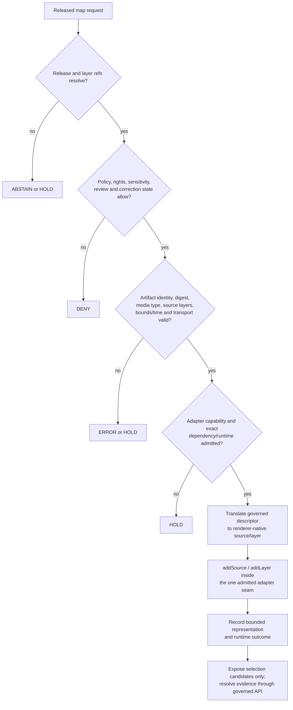

<!-- [KFM_META_BLOCK_V2]
doc_id: kfm://doc/architecture/maplibre-master
title: MapLibre Master — Components, Functions, Features Architecture Register
type: architecture
subtype: component-capability-register
version: v2.3-draft
status: "draft; repository-grounded; architecture-accepted; production-runtime-hold; no-release; no-publication"
owners:
  - "@bartytime4life — verified default repository review route"
  - "NEEDS VERIFICATION — architecture, map-runtime, Explorer, security, accessibility, release, and independent-review stewardship"
created: 2026-05-25
updated: 2026-08-27
policy_label: "repository-facing; architecture; maplibre; renderer-boundary; public"
owning_root: docs/
current_path: docs/architecture/maplibre-master.md
responsibility: >
  Maintain the human-readable MapLibre component, function, feature, and
  graduation register; distinguish upstream capability from KFM architecture
  direction and current implementation evidence; and route decision,
  contract, schema, policy, validation, runtime, and release authority to the
  responsibility roots that own them.
truth_posture: >
  CONFIRMED same-path architecture placement, accepted Directory Rules v2,
  accepted ADR-0006/0007 status, current package/app/validator surfaces, exact
  MapLibre 6.6.0 package identity, package-owned adapter and Vite worker seam,
  deterministic browser fixture, retired legacy harness, and Explorer
  NullMapRuntime production HOLD / PROPOSED plugin, protocol, broader runtime
  verification, receipt, release, correction, and rollback closure / UNKNOWN deployed browser
  behavior, public MapLibre runtime, production tile loading, plugin use,
  renderer parity, operational performance, and public release.
evidence_snapshot:
  repository: bartytime4life/Kansas-Frontier-Matrix
  base_ref: main
  base_commit: 232f7aeda87abbc46c85a8dd37b75cc9def8a2c5
  target_prior_blob: 6d7ff09d8d43b3175e9ff4ffb37816feadb5c5b6
  directory_rules_blob: fd49a0b83e55cef52c1124281f093e263526898d
  directory_rules_adr_blob: a4de0d7a96b78da59cfc499d1025e1508afd8dd9
  adr_index_blob: 419ebd60db28404edb0d363125c85f6f15deaec0
  adr_0006_blob: 3b789a623a07d27eb538ffaed10b0487ffc43d95
  adr_0007_blob: 6bfd66b1169728d7fad08f0bb2d7e2a56e3577b2
  maplibre_package_manifest_blob: b0582955feeb51016327113692fa5c98ecad8816
  maplibre_package_entry_blob: 91664eb00583f9e3d0405eb7954fefa9a48f4ee9
  explorer_adapter_blob: 663ba0f7a05498948f67d644387c73ab19d5c16c
  acquisition_inventory_blob: 2d5b9f0cf494ebb6f3cfc6e4f12acb497572edcf
  readiness_validator_blob: d9f189fd6f726ff6085371f7d69f2b035474e3fc
  renderer_capability_contract_blob: 5b172bd279ed2f18c5d6339b6c635512a6c3ff25
  performance_harness_blob: 699dd4cf42d355dd2ed7620852b7fd1f3000bbe2
  upstream_candidate:
    version: 6.6.0
    tag_commit: 407a8ce9e379c16066b13c3a6729e404b69743c6
    checked: 2026-08-27
related:
  - ./maplibre.md
  - ./map-master/README.md
  - ./map-shell.md
  - docs/architecture/ui/MAP_RUNTIME_BOUNDARY.md
  - ../adr/INDEX.md
  - ../adr/ADR-0006-maplibre-boundary--only-maplibreadapter-imports-maplibre.md
  - "../adr/ADR-0007 — MapLibre GL JS Is the Sole Browser-Side Renderer.md"
  - ../adr/ADR-0029-adopt-directory-governance-standard-v2.md
  - ../doctrine/directory-rules.md
  - ../standards/MVT.md
  - ../standards/PMTILES.md
  - ../../packages/maplibre/README.md
  - ../../packages/maplibre/package.json
  - ../../packages/maplibre/src/index.ts
  - ../../apps/explorer-web/README.md
  - ../../apps/explorer-web/src/adapters/MapLibreAdapter.ts
  - ../../contracts/ui/renderer_capability_profile.md
  - ../../contracts/data/layer_manifest.md
  - ../../contracts/release/geospatial_carrier_readiness.md
  - ../../contracts/release/tile_artifact_manifest.md
  - ../../tools/validators/maplibre/assess_acquisition_inventory.py
  - ../../tools/validators/maplibre/validate_v6_readiness.py
  - ../../tests/maplibre/test_assess_acquisition_inventory.py
  - ../../tests/maplibre/test_validate_v6_readiness.py
  - ../../scripts/maplibre-smoke-perf.mjs
  - ../../configs/maplibre/README.md
tags: [kfm, architecture, maplibre, renderer, map-runtime, components, functions, features, evidence, policy, release, rollback]
notes:
  - "Same-path documentation modernization only. No ADR, contract, schema, policy, dependency, lockfile, source, validator, runtime, release, deployment, or publication state changes."
  - "The prior edition repeatedly promoted planning lineage and absent paths into present-tense architecture facts. This revision separates upstream capability, maintainer direction, proposed ADR state, repository implementation, validation evidence, and release/publication state."
  - "Issue #2957 records maintainer direction for seven of eight MapLibre architecture choices; acquisition enforcement remains HOLD and ADR-0006/0007 remain effectively proposed."
  - "MapLibre GL JS 6.6.0 is an exact readiness candidate, not an admitted KFM dependency."
  - "Legacy section headings and anchors are retained for inbound-link compatibility."
[/KFM_META_BLOCK_V2] -->

<a id="top"></a>
<a id="maplibre-master--components-functions-features-architecture-register"></a>

# MapLibre Master — Components, Functions, Features Architecture Register

> **Operating boundary.** MapLibre may become KFM's browser map renderer and interaction runtime only behind governed, reviewable interfaces. It is never the evidence source, canonical store, policy engine, citation authority, review authority, release authority, publisher, or AI authority.


> [!IMPORTANT]
> **This register is not a renderer decision or conformance certificate.** It describes upstream MapLibre capabilities, KFM architecture intent, and the exact bounded implementation evidence present at the pinned revision. ADR-0006 and ADR-0007 remain effectively `proposed`; a component row marked `SUPPORTED UPSTREAM` or `DIRECTION RECORDED` does not admit a package, plugin, protocol, source, layer, artifact, release, or public route.

> [!CAUTION]
> **Current runtime posture is `HOLD`.** `packages/maplibre/` is a private dependency-free `0.0.0` scaffold, its entry point exports only a placeholder, and the Explorer `MapLibreAdapter.ts` is comment-only. The current readiness classifier targets exact MapLibre GL JS `6.6.0`, but the dependency is unpinned and the twelve browser/runtime probes are not established by this document.

> [!WARNING]
> **Rendering success is not truth.** A map, hit-test result, popup, screenshot, performance sample, visual-diff image, tile, style, or feature property is a downstream representation. Consequential claims still require governed evidence resolution, policy and sensitivity checks, review and release state, correction lineage, and an appropriate rollback path.

## Current-state summary

| Axis | Current bounded result |
|---|---|
| **Evidence snapshot** | `main@232f7aeda87abbc46c85a8dd37b75cc9def8a2c5` |
| **Placement** | `PLACE` at the existing `docs/architecture/maplibre-master.md`; accepted ADR-0029 assigns human architecture guidance to `docs/` |
| **Decision authority** | ADR-0029 is accepted; ADR-0006 and ADR-0007 are proposed |
| **Maintainer direction** | Issue #2957 records the intended physical home, port/adapter seam, dependency owner, renderer-family direction, consumer migration, admission split, and rollback; acquisition enforcement remains `HOLD` |
| **Reusable package** | `packages/maplibre/` exists as private `@kfm/maplibre` `0.0.0`; no renderer dependency, scripts, exports, engines, or implementation API are established |
| **Explorer application** | A real Vite/TypeScript, map-first, trust-visible shell exists; its map selection and Evidence Drawer laboratory remain renderer-neutral |
| **Concrete adapter** | Not implemented; `apps/explorer-web/src/adapters/MapLibreAdapter.ts` is one boundary comment |
| **Acquisition evidence** | Deterministic no-network inventory exists; its `HOLD` is structural evidence, not renderer admission or enforcement closure |
| **Readiness evidence** | Exact `6.6.0` classifier and fixtures exist; a `READY` result would be review eligibility only, not admission or release |
| **Renderer capability profile** | Fixture-only, inactive, review-pending candidate with no runtime or public effect |
| **Map data carrier checks** | Inactive metadata and compatibility checks exist for selected declarations; production byte conformance and release are not established |
| **Deployed/public MapLibre runtime** | `UNKNOWN` / not established by inspected repository evidence |

**Quick navigation:** [Purpose](#1-purpose--scope) · [Method](#2-the-cff-method) · [Renderers](#3-renderers) · [Styles](#4-style-language--expressions) · [Assets](#5-assets--sprites-glyphs-images) · [Formats](#6-tile--data-formats) · [3D](#7-maplibre-3d--pointer-and-summary) · [Dependencies](#8-plugins-dependency-governance) · [Runtime evidence](#9-renderreceipt--runtime-probes) · [Objects](#10-required-object-families) · [Admission](#11-verify-before-addsource-sequence) · [Placement](#12-repository-placement) · [Validation](#13-tests-ci-gates--rollback) · [Anti-patterns](#14-anti-patterns) · [Open work](#15-open-questions--needs-verification) · [Related](#16-related-docs) · [State matrix](#appendix-a--component-state-matrix) · [No-loss ledger](#appendix-b--no-loss-modernization-ledger)

---

## 1. Purpose & scope

This document is the architecture-lane **component, function, feature, and graduation register** for browser map rendering in KFM. It answers five questions without collapsing their authorities:

1. What does upstream MapLibre GL JS and the MapLibre Style Specification support?
2. Which capabilities does KFM intend to expose through a governed renderer boundary?
3. Which repository surfaces currently exist and what do they actually prove?
4. Which decisions, contracts, schemas, policies, tests, probes, and reviews remain before runtime admission?
5. What correction and rollback evidence is required before a capability can participate in a released public surface?

It is intentionally **not**:

- an accepted ADR;
- a package manifest or dependency admission record;
- a substitute for semantic contracts, JSON Schemas, or policy;
- a plugin or protocol allowlist;
- a source, layer, style, tile, evidence, release, or public registry;
- a runtime test report, benchmark result, proof pack, or release manifest;
- a claim that an absent companion path exists; or
- authority to activate, release, deploy, serve, or publish anything.

### 1.1 Authority by question

| Question | Owning authority | Role of this register |
|---|---|---|
| Where this architecture page belongs | Accepted ADR-0029 and [`directory-rules.md`](../doctrine/directory-rules.md) | Explain the same-path architecture placement |
| Whether the adapter seam is binding | [`ADR-0006`](../adr/ADR-0006-maplibre-boundary--only-maplibreadapter-imports-maplibre.md) after reviewed acceptance | Track current proposal and evidence; never accept it implicitly |
| Whether MapLibre is the sole browser renderer family | [`ADR-0007`](<../adr/ADR-0007 — MapLibre GL JS Is the Sole Browser-Side Renderer.md>) after reviewed acceptance | Record current maintainer direction and remaining HOLD |
| Which version/dependency may be acquired | Separate dependency-admission review, owning package manifest, lockfile, supply-chain evidence | Record candidate identity only |
| What a KFM object means | `contracts/` | Link semantic authority; do not redefine it |
| What machine shape is valid | `schemas/` | Link machine authority; do not infer conformance from prose |
| What is allowed, denied, held, generalized, or restricted | `policy/` and authorized review | State obligations; do not make policy decisions |
| Whether runtime behavior works | Current code/config plus representative tests, authenticated probes, and emitted artifacts | Report only the bounded evidence actually inspected |
| Whether a public release may serve a renderer artifact | `release/`, evidence/proof families, policy, review, correction, rollback | State graduation requirements; do not authorize release |

### 1.2 KFM trust invariants at the renderer boundary

- Public clients consume governed APIs and released public-safe artifacts, not RAW, WORK, QUARANTINE, canonical, source, graph, vector-index, or model stores.
- A rendered feature is a **selection candidate**, not an authoritative claim.
- `EvidenceRef` must resolve to admissible `EvidenceBundle` support before a consequential claim is presented as authoritative.
- Client-side visibility or style filtering is not redaction, geoprivacy, rights enforcement, or release approval.
- Source, layer, style, tile, plugin, protocol, and renderer identities remain explicit and versioned.
- Promotion is a governed state transition, not `addSource`, `addLayer`, a successful build, a pull request, or a visible map.
- Negative states—`ABSTAIN`, `DENY`, `ERROR`, `HOLD`, stale, generalized, withdrawn, superseded—remain visible and finite.
- Renderer correction and rollback must not rewrite canonical evidence or conceal prior public state.

[Back to top](#top)

---

## 2. The CFF method

Each register row separates **capability**, **KFM intent**, **repository evidence**, and **graduation evidence**. This prevents an upstream feature, design document, fixture, or green test from being misread as an active KFM capability.

### 2.1 State vocabulary

| State | Meaning |
|---|---|
| `SUPPORTED_UPSTREAM` | Official upstream documentation or source establishes the capability. No KFM adoption is implied. |
| `DIRECTION_RECORDED` | Maintainer or architecture lineage identifies the intended KFM disposition. The owning ADR may still be proposed. |
| `PRESENT_SCAFFOLD` | A path or placeholder exists, but no functioning capability is established. |
| `PRESENT_INACTIVE` | Contract/schema/fixture/validator behavior exists but is explicitly non-authoritative or fixture-only. |
| `STRUCTURAL_HOLD` | Deterministic inspection completed but unresolved architecture, acquisition, or policy prevents admission. |
| `RUNTIME_HOLD` | Browser/device/runtime evidence is missing, failed, unauthenticated, or not accepted. |
| `REVIEW_REQUIRED` | Evidence exists but an authorized review or decision remains. |
| `ADMITTED` | A specific dependency/capability is accepted for a named scope; this document does not currently establish this state for MapLibre. |
| `RELEASED` | A governed release references verified public-safe artifacts with correction and rollback. Not established here. |
| `UNKNOWN` | Current evidence does not support a stronger statement. |

### 2.2 Independent maturity axes

Do not compress these axes into one badge:

| Axis | Example question |
|---|---|
| Upstream capability | Can MapLibre GL JS render a custom style layer? |
| Architecture disposition | Does KFM intend to allow custom layers behind the adapter? |
| Decision state | Has an ADR accepted the renderer-family and seam rule? |
| Dependency admission | Is an exact package/version/integrity closure approved? |
| Implementation | Does the package expose a functioning KFM-owned port and adapter? |
| Structural enforcement | Can repository-controlled acquisition bypasses be detected and rejected? |
| Runtime verification | Did authenticated browser probes pass for the exact head and dependency closure? |
| Governed integration | Are released descriptors, evidence, policy, negative states, and corrections handled? |
| Release | Is the capability in a reviewed release with rollback? |
| Publication | Is a public-safe surface actually exposed? |

A component may be `SUPPORTED_UPSTREAM` and `PRESENT_INACTIVE` while still being `RUNTIME_HOLD` and not `ADMITTED`.

### 2.3 Evaluation record

Each capability row SHOULD identify:

- upstream identity and currentness date;
- KFM-owned abstraction or descriptor boundary;
- dependency and acquisition owner;
- allowed input object families;
- forbidden inputs and effects;
- positive and negative fixtures;
- browser/device/accessibility/security/performance probes;
- evidence, policy, release, correction, and rollback relationships; and
- finite failure outcomes and reason codes.

[Back to top](#top)

---

## 3. Renderers

### 3.1 Current browser-renderer decision state

| Concern | Current state | Evidence-backed conclusion |
|---|---|---|
| Physical reusable home | `DIRECTION_RECORDED` | Issue #2957 accepts `packages/maplibre/` as the intended sole reusable home; ADR text has not yet made that decision accepted |
| KFM-owned port | `DIRECTION_RECORDED` / not implemented | Maintainer direction calls for one renderer-neutral `MapRuntimePort`; no concrete TypeScript port was verified |
| Concrete adapter | `PRESENT_SCAFFOLD` | Explorer `MapLibreAdapter.ts` is comment-only; package entry point is a placeholder |
| Dependency owner | `DIRECTION_RECORDED` | Intended owner is `packages/maplibre/package.json`; it currently declares no dependencies |
| Renderer family | `DIRECTION_RECORDED` / ADR proposed | Maintainer direction chooses MapLibre GL JS as the sole normal production browser renderer family; ADR-0007 remains proposed |
| Peer-renderer exception | `DIRECTION_RECORDED` | A separately accepted scoped exception or successor ADR is intended for any independent engine owning map/scene lifecycle |
| Exact version | `READINESS_CANDIDATE` | Current classifier targets `6.6.0` at upstream tag commit `407a8ce…`; no version is admitted |
| Browser/runtime proof | `RUNTIME_HOLD` | Twelve named probes are required by the current classifier; this page does not establish accepted results |
| Release/publication | none | No renderer release or public MapLibre runtime is established by this register |

> [!NOTE]
> `ACCEPT` in issue #2957 records maintainer direction for decision-packet choices; it is not an ADR status transition. The canonical ADR index still records ADR-0006 and ADR-0007 as proposed.

### 3.2 Renderer, plugin, protocol, custom layer, and peer renderer

These definitions are **PROPOSED architecture vocabulary** pending the owning ADR packet:

| Term | Proposed KFM meaning |
|---|---|
| **Renderer** | Browser engine that owns primary map/scene rendering, camera, hit testing, and map interaction lifecycle. |
| **Adapter** | KFM-owned implementation translating governed descriptors and KFM events into renderer operations without leaking renderer-native types. |
| **Plugin** | Renderer-bound extension operating inside the accepted renderer lifecycle. |
| **Protocol** | Resource-loading hook registered through the accepted adapter and constrained by source, network, policy, and release rules. |
| **Custom-layer integration** | Renderer extension using the accepted renderer's documented extension API while remaining subordinate to the adapter and release boundary. |
| **Peer renderer** | Independent browser engine capable of owning map/scene, camera, event, or feature-selection lifecycle; requires a separately accepted exception or successor ADR. |

### 3.3 Port boundary target

The intended `MapRuntimePort` exposes KFM-owned concepts only. Its final API remains an ADR/contract/implementation question, but it should cover no more than needed to:

- initialize and dispose a map runtime;
- apply admitted styles, sources, and layers through governed descriptors;
- set and observe camera, projection, time, and bounded interaction state;
- translate renderer events into KFM-owned event/selection shapes;
- expose finite initialization, load, selection, and teardown outcomes; and
- remain replaceable by a deterministic fake/null implementation when the renderer dependency is absent.

It must not expose raw MapLibre `Map`, style, source, layer, worker, protocol, internal transform, or event objects to Explorer feature modules.

### 3.4 Current Explorer relationship

The merged Explorer site provides a real map-first, trust-visible shell and renderer-neutral selection → governed resolution → Evidence Drawer laboratory. That is useful downstream evidence, but it does not create a working MapLibre runtime. A later adapter must feed the existing governed selection contract rather than widening it with arbitrary feature properties.

[Back to top](#top)

---

## 4. Style language & expressions

MapLibre's official style specification provides source, layer, layout, paint, filter, expression, projection, terrain, light, sky, sprite, and glyph concepts. Upstream support does not make a style KFM-admissible.

### 4.1 Capability register

| Capability | Upstream surface | KFM architecture obligation | Current KFM state |
|---|---|---|---|
| Style document | Style Specification | Bind immutable identity, source/layer references, attribution, review/release state, and rollback | Active canonical style profile not established here |
| Sources | GeoJSON, vector, raster, raster DEM, image, video, canvas and supported extensions | Resolve only governed/released descriptors; prohibit arbitrary internal/latest URLs | Runtime loading not established |
| Layers | Background, fill, line, symbol, circle, heatmap, hillshade, raster, fill extrusion, custom and version-supported types | Keep semantic layer identity separate from renderer-native layer objects | Descriptor-level work exists in mixed maturity |
| Expressions | Data-driven and global-state style evaluation | Treat visual encoding as representation; do not let expressions invent policy or truth | Upstream capability only unless a profile says otherwise |
| Filters and visibility | Client rendering controls | Never use as geoprivacy, rights enforcement, release gating, or evidence filtering | Hard prohibition at architecture level |
| Feature state / promoted IDs | Interaction and dynamic styling | Require stable KFM identity mapping and replay tests before consequential use | Not proven in a working adapter |
| Projection / terrain / light / sky | Renderer scene controls | Record representation context and preserve evidence/time parity | No admitted KFM runtime |

### 4.2 Style admission requirements

Before a style can participate in a governed release, evidence appropriate to the surface should establish:

- a pinned style identity and deterministic digest profile;
- source and `source-layer` agreement with released layer/tile manifests;
- declared public property allowlists;
- no direct RAW/WORK/QUARANTINE/canonical/source API locators;
- attribution and rights obligations;
- sensitivity/generalization transforms performed upstream;
- bounded expression complexity and renderer compatibility;
- accessibility and contrast review appropriate to the representation;
- visual-diff and negative-state checks where material;
- correction/supersession linkage; and
- a rollback target to the prior accepted style/release.

A syntactically valid style can still be denied by source, evidence, policy, rights, sensitivity, release, security, or performance gates.

### 4.3 `source-layer` is contract-bearing

For vector tiles, the style's `source-layer`, the layer contract/manifest, and observed tile metadata must agree. A rename is a compatibility change affecting producers, styles, tests, caches, and consumers. It is not a renderer-only refactor.

[Back to top](#top)

---

## 5. Assets — sprites, glyphs, images

Sprites, glyphs, icons, patterns, images, marker assets, and model textures are executable/rendered supply-chain inputs. They need identity and rights treatment even though they are not evidence objects.

| Asset family | Required posture | Current state |
|---|---|---|
| Sprite JSON/image pair | Digest-bound pair, stable symbol IDs, rights/attribution, CORS/CSP, missing-image behavior, rollback | No active KFM sprite release established |
| Glyph ranges | Font/license review, deterministic URL or artifact identity, coverage, fallback, CSP/CORS, accessibility | Current performance harness uses an external demo glyph URL; not production authority |
| Runtime images | Declared source and lifecycle, size/format limits, memory reclamation probe, no sensitive payload | Runtime behavior not established |
| Icons/patterns | Public-safe semantics, accessible non-color cues where consequential, versioned IDs | Mixed docs/UI state; no MapLibre admission inferred |
| 3D textures/models | Rights, provenance, reality-boundary labeling, plugin/custom-layer admission, resource budgets | Not admitted |

### 5.1 Failure posture

Missing, invalid, unlicensed, stale, or policy-denied assets must not silently degrade a consequential claim into a misleading substitute. The consumer should surface a finite renderer state and preserve enough identity to review or correct the failure.

### 5.2 External demo assets

Official examples and the repository's performance harness may use external demo assets for development. Such use does not establish a production source, license review, public route, network policy, availability SLO, or offline behavior. Production admission requires an explicit inventory and owning decision.

[Back to top](#top)

---

## 6. Tile & data formats

MVT, MLT, PMTiles, raster tiles, COG, GeoJSON, and other geospatial carriers answer different questions. Encoding compatibility does not establish source authority, evidence closure, public safety, or release.

### 6.1 Format and transport separation

| Concern | Example | Authority boundary |
|---|---|---|
| Payload encoding | MVT or MLT vector payload | Upstream format + KFM profile/validator |
| Addressing | XYZ or TMS | Source/style/tile-matrix declaration |
| Container/archive | PMTiles or MBTiles | Artifact contract and byte verification |
| Direct tile transport | URL template, TileJSON, OGC API - Tiles | Governed delivery/network policy |
| Canonical processed data | GeoParquet or another accepted canonical form | Domain/data contracts and lifecycle |
| Raster delivery | COG or raster tile pyramid | Artifact, range-read, CRS, nodata, rights, release |
| Browser rendering | MapLibre source/layer configuration | Adapter and style boundary |

### 6.2 Current bounded KFM evidence

- [`MVT.md`](../standards/MVT.md) is an encoding and readiness boundary; it does not establish KFM-wide production adoption or binary conformance.
- `GeospatialCarrierReadinessCheck` contains an inactive, metadata-only MVT lane with finite outcomes. It does not parse arbitrary MVT bytes or authorize release.
- PMTiles attestation fixtures provide bounded, synthetic structural compatibility evidence. They do not select a canonical `TileArtifactManifest` schema or authenticate production range reads.
- The semantic `TileArtifactManifest` contract reports unresolved schema-family ownership; the inspected map-family schema remains permissive.
- The current renderer is not admitted, so format capability does not imply browser consumption.

### 6.3 MVT and MLT

Official MapLibre style-source documentation distinguishes vector-source `encoding` (`mvt` or `mlt`) from tile `scheme` (`xyz` or `tms`). KFM has not established an active production MLT profile, producer, compatibility packet, public artifact, or rollback policy in the inspected evidence. Treat MLT as an upstream-capable candidate requiring its own producer, byte, style, browser, parity, rights, release, and rollback evidence—not as an automatic successor migration.

### 6.4 Public carrier obligations

A public map carrier should resolve to:

- immutable artifact identity and byte digest;
- format, media type, bounds, zoom/time coverage, CRS/tile matrix context;
- layer/source-layer and property schema declarations;
- source, evidence, rights, sensitivity, policy, review, and release references;
- build/transform receipts and validation evidence;
- public-safe generalization/redaction receipts where applicable;
- cache/version strategy, correction/supersession/withdrawal behavior; and
- rollback target.

[Back to top](#top)

---

## 7. MapLibre 3D — pointer and summary

The prior register delegated 3D to `docs/architecture/maplibre-3d.md`; that path is **absent at the pinned revision**. Do not treat references to that absent companion as current architecture authority.

### 7.1 Upstream capability versus KFM admission

Official MapLibre documentation demonstrates terrain, hillshade, globe projection, fill extrusion, and custom style layers; official examples also demonstrate integrating external 3D libraries through custom layers. These facts establish upstream capability only.

| Surface | Upstream status | KFM current state | Graduation evidence |
|---|---|---|---|
| Terrain / raster DEM | Supported upstream | Not admitted | Exact dependency, DEM profile, CRS/encoding, browser/GPU, memory, visual and policy tests |
| Hillshade / color relief | Supported upstream | Not admitted as MapLibre runtime | Style/data identity, legend/units, accessibility, visual validation |
| Globe projection | Supported upstream | Not admitted | Camera/time parity, projection disclosure, custom-layer compatibility, device tests |
| Fill extrusion | Supported upstream | Not admitted | Explicit `2.5D` labeling, height/base provenance, clipping and visual tests |
| Custom 2D/3D layers | Supported upstream extension interface | Acquisition enforcement `HOLD`; no plugin admitted | Exact library/license/integrity, extension API, CSP/worker, lifecycle, security, performance, teardown, rollback |
| 3D Tiles / glTF / point clouds | Possible through external integrations | No KFM package/plugin/runtime admission established | Format profile, source rights, reality-boundary note, sensitivity, browser budgets, parity, correction, rollback |

### 7.2 Representation law

- 2D, 2.5D, terrain, globe, modeled, reconstructed, interpolated, and true-3D representations must be labeled accurately.
- A visually plausible scene cannot substitute for observed geometry or evidence.
- Sensitive geometry must be transformed before it reaches a public renderer.
- 3D admission is policy- and release-significant where it changes visibility, precision, inference, or interaction risk.
- A 3D view must preserve the same evidence, time, policy, correction, and release context as its 2D counterpart or fail closed.

### 7.3 Companion-document disposition

A future 3D architecture document may be useful, but creating it is a separate same-lane documentation task requiring overlap review, current upstream verification, and reconciliation with ADR-0006/0007. This update does not create that path or import its proposal-era claims into current authority.

[Back to top](#top)

---

## 8. Plugins dependency governance

> [!IMPORTANT]
> **No MapLibre dependency, plugin, protocol, worker, or custom-layer library is admitted by this register.** Package presence, an upstream example, an inactive capability declaration, or a structural inventory is not supply-chain approval.

### 8.1 Current acquisition state

The repository contains a deterministic no-network acquisition inventory that scans package manifests and bounded code roots for static/dynamic imports, re-exports, `require`, Node `createRequire` aliases, explicit `import.meta.resolve` / `require.resolve` module resolution, CDN/global use, protocol registration, workers, and renderer-family packages. Its current semantics are intentionally non-authoritative:

- `PASS`: scan completed and found no renderer acquisition;
- `HOLD`: raw renderer acquisition is confined to `packages/maplibre/` while production runtime activation remains unresolved;
- `FAIL`: raw renderer acquisition escaped the accepted package seam or parallel active MapLibre package homes surfaced;
- `ERROR`: the scan could not complete safely.

The validator treats only `packages/maplibre/` as the accepted raw-renderer seam. Explorer and other consumers may use the KFM-owned facade but fail the inventory if they directly acquire a renderer. The classifier excludes documentation links, renderer-created CSS class assertions, and package-local imports whose filenames merely contain `maplibre`; its negative fixtures retain direct imports, executable CDN assets, browser globals, and parallel package homes as fail-closed cases.

### 8.2 Current acquisition HOLD

`scripts/maplibre-smoke-perf.mjs` is retired and exits with a finite `WORKFLOW_HOLD` before renderer or network acquisition. The remaining structural `HOLD` is the exact package-owned MapLibre dependency and imports under `packages/maplibre/`; it does not authorize Explorer production activation, live sources, performance execution, release, deployment, or publication. Any future CDN/global or direct consumer acquisition outside that package fails the inventory.

### 8.3 Admission record

A renderer-bound dependency admission should identify at least:

- package name, exact version, integrity/digest, upstream tag/commit, license and notices;
- owning manifest and lockfile closure;
- purpose and required capability;
- acquisition mode, worker model, module format, browser support, CSP/CORS/network effects;
- transitive/supply-chain/security review;
- allowed source and endpoint classes;
- positive, negative, failure, teardown, accessibility, performance, and offline tests;
- policy and sensitivity implications;
- removal trigger, fallback behavior, correction implications, and rollback procedure; and
- independent review state.

### 8.4 Structural enforcement target

After explicit ADR acceptance, repository-controlled acquisition outside the exact package-owned adapter module should fail closed. Coverage needs to include:

- manifest ownership and duplicate declarations;
- static and type imports;
- re-exports;
- dynamic imports and `require`;
- workers and worker URLs;
- CDN/script/global acquisition;
- plugin/custom-layer/overlay libraries;
- protocol registration;
- examples, tests, dev harnesses, and repository-controlled generated/runtime code; and
- lockfile ownership and exact closure.

Structural enforcement must remain separate from version admission and browser readiness.

[Back to top](#top)

---

## 9. RenderReceipt — runtime probes

The prior edition treated a `RenderReceipt` as an established emitted object. Current evidence supports a narrower claim: KFM has a semantic `RepresentationReceipt` family and synthetic receipt fixtures, while production renderer receipt emission and release binding remain **not established**.

### 9.1 Evidence classes

| Evidence | What it can prove | What it cannot prove |
|---|---|---|
| Unit/fixture test | Deterministic local behavior against synthetic inputs | Browser/GPU/network behavior or public release |
| Acquisition inventory | Where repository-controlled renderer acquisition appears in scanned surfaces | Supply-chain approval, complete bundler output, runtime safety, or policy |
| Readiness classifier | Exact version declaration, module/target posture, bounded import/internal-API scan, declared probe status | Authenticity of probes, rendering correctness, release, publication |
| Browser probe record | Observed behavior for exact code/dependency/browser/device/config when authenticated and reproducible | Source/evidence truth, policy/review/release approval |
| Performance result | Measured workload/device/browser behavior under declared conditions | Universal SLO, accessibility, public safety, evidence closure |
| Representation receipt | A governed record of one representation event when schema, identity, authority, and binding are valid | Canonical truth or release by itself |
| Release/proof packet | Reviewed artifact and decision closure for a named release | Correctness outside its declared scope |

### 9.2 Current exact readiness candidate

`tools/validators/maplibre/validate_v6_readiness.py` currently targets:

- MapLibre GL JS `6.6.0`;
- upstream tag commit `407a8ce9e379c16066b13c3a6729e404b69743c6`;
- ESM module mode;
- TypeScript target `ES2022`;
- no known internal `map.transform` access;
- no direct `maplibre-gl` import outside the bounded package source; and
- twelve declared browser/runtime probes.

A `READY` result is only eligibility evidence for human review of that exact candidate. It does not admit a dependency or authorize upgrade, release, deployment, publication, or public use.

### 9.3 Required probe families

The current classifier names these probes:

1. WebGL2 failure handling;
2. worker/CSP loading;
3. Style Spec v25 behavior;
4. GeoJSON `setData` behavior;
5. `queryRenderedFeatures` behavior;
6. visual pixel difference;
7. image-source texture reclamation;
8. query behavior under tile churn;
9. PMTiles vector-tile loading;
10. terrain/DEM regression;
11. Evidence Drawer selection stability; and
12. headless render parity.

The final admission packet should bind each probe to exact repository head, dependency/lock digest, browser/OS/device/GPU or headless environment, test inputs, expected outcome, observed result, artifacts, and reviewer identity. A screenshot or green workflow alone is insufficient.

### 9.4 Minimum runtime outcome envelope

A future renderer adapter should emit or expose stable finite outcomes without leaking sensitive internals:

| Outcome | Meaning |
|---|---|
| `READY` / `ANSWER` | The bounded renderer operation completed under admitted inputs and policy. |
| `ABSTAIN` | Required artifact, evidence, compatibility, or context is absent/unsupported. |
| `DENY` | Policy, release, rights, sensitivity, acquisition, or integrity prevents the operation. |
| `HOLD` | Review, dependency admission, probe, or correction evidence remains incomplete. |
| `ERROR` | Bounded operational failure; no unsafe fallback or partial authority is inferred. |

[Back to top](#top)

---

## 10. Required object families

This register routes to existing object families; it does not create a new MapLibre-specific trust spine.

| Object/surface | Current repository evidence | Renderer relationship | Remaining boundary |
|---|---|---|---|
| `SourceDescriptor` | Existing family elsewhere in repository | Establishes source identity, role, rights, cadence, scope | Must resolve for released inputs; renderer never activates a source |
| `EvidenceRef` / `EvidenceBundle` | Existing evidence families and resolver work | Supports consequential claims selected from the map | Rendered feature properties are not a substitute |
| `LayerManifest` | `contracts/data/layer_manifest.md` plus dual-profile schema/validator; strict profile is inactive/fixture-only | Declares candidate representation and governed references | Reference resolution, policy, review, artifact bytes, release and runtime loader remain open |
| `TileArtifactManifest` | Semantic release contract is proposed; schema-family ownership unresolved; permissive map scaffold exists | Describes tile artifact identity/coverage/digest by reference | Canonical schema, byte validation, policy/release integration remain open |
| `GeospatialCarrierReadinessCheck` | Inactive metadata-only schema/validator/fixtures | Declares bounded MVT/COG/GeoParquet readiness metadata | No binary parse, source resolution, policy, release, or publication |
| `RendererCapabilityProfile` | Inactive fixture-only contract/schema/validator | Compares synthetic capability declarations behind a KFM abstraction | No package selection, execution, parity, admission, or public effect |
| `StyleManifest` | Mixed proposal/scaffold surfaces | Would bind style identity and compatibility | Canonical semantic/schema/validator/release authority needs verification |
| `PolicyDecision` / review record | Existing governance families in mixed maturity | Must gate public source/layer/selection behavior | Renderer cannot evaluate or authenticate them by itself |
| `RepresentationReceipt` | Semantic contract and synthetic fixtures exist | May record exact representation context and artifact/evidence binding | Production emitter, authority, release binding, retention and correction remain open |
| `ReleaseManifest` / `PromotionDecision` / rollback | Existing release families in mixed maturity | Selects exact public-safe artifacts and rollback context | Renderer cannot infer approval from reachability or manifest shape |
| Evidence Drawer selection/payload | Renderer-neutral Explorer integration exists | Receives governed selection resolution | Real adapter translation must preserve evidence subset and finite outcomes |

### 10.1 Object-family anti-collapse

- `LayerManifest` does not replace `TileArtifactManifest`.
- `TileArtifactManifest` does not store tile bytes or approve release.
- `RendererCapabilityProfile` does not admit a renderer.
- `RepresentationReceipt` does not prove source truth or policy approval.
- `ReleaseManifest` does not replace evidence or policy.
- A map click, popup, story node, screenshot, or AI answer is not an `EvidenceBundle`.
- A passing validator is bounded test evidence, not review or publication authority.

### 10.2 Identity and reference rules

Where practical, renderer-facing objects should use deterministic, versioned identities; immutable artifact digests; non-floating references; explicit schema/profile versions; sorted unique reference arrays; and correction/supersession lineage. Identity profiles must be owned by the corresponding contract/schema family rather than invented inside the browser adapter.

[Back to top](#top)

---

## 11. Verify-before-`addSource` sequence

The sequence below is a **PROPOSED target admission flow**, not current runtime behavior. No production implementation was verified.


```mermaid
flowchart TD
    A["Released map request"] --> B{"Release and layer refs resolve?"}
    B -- no --> H1["ABSTAIN or HOLD"]
    B -- yes --> C{"Policy, rights, sensitivity,<br/>review and correction state allow?"}
    C -- no --> H2["DENY"]
    C -- yes --> D{"Artifact identity, digest,<br/>media type, source layers,<br/>bounds/time and transport valid?"}
    D -- no --> H3["ERROR or HOLD"]
    D -- yes --> E{"Adapter capability and exact<br/>dependency/runtime admitted?"}
    E -- no --> H4["HOLD"]
    E -- yes --> F["Translate governed descriptor<br/>to renderer-native source/layer"]
    F --> G["addSource / addLayer inside<br/>the one admitted adapter seam"]
    G --> I["Record bounded representation<br/>and runtime outcome"]
    I --> J["Expose selection candidates only;<br/>resolve evidence through governed API"]
```

### 11.1 Required preconditions

Before renderer-native source/layer creation:

- requested release identity is explicit and not a floating internal alias;
- layer/style/tile/artifact relationships resolve under the accepted profiles;
- artifact bytes or authenticated delivery metadata match their declared identity at the required assurance level;
- rights, attribution, sensitivity, generalization, review, release, correction, and withdrawal state permit the audience;
- source-layer names and public field allowlists agree;
- endpoint/protocol/worker/network acquisition is admitted;
- adapter capability and exact dependency/browser support are accepted for the requested feature;
- time, projection, bounds, zoom, and representation context are explicit; and
- a finite failure path exists without loading a weaker or unreviewed substitute.

### 11.2 Post-load behavior

- renderer events are translated into KFM-owned types;
- feature selection carries only the governed subset needed for evidence resolution;
- Evidence Drawer and Focus Mode call governed services, not renderer/source/model stores;
- stale, generalized, denied, withdrawn, unsupported, and error states remain visible;
- runtime diagnostics avoid secrets, protected locations, full sensitive reasons, and raw response leakage;
- correction/withdrawal invalidates affected caches and visible state; and
- rollback returns to the prior admitted adapter/dependency/release state deterministically.

### 11.3 Reachability is not admission

An artifact being fetchable, a style being valid, or `addSource` succeeding does not prove that KFM may show it. The trust decision precedes renderer acquisition and remains reviewable after rendering.

[Back to top](#top)

---

## 12. Repository placement

### 12.1 Directory Rules basis

Accepted ADR-0029 adopts Directory Rules v2. This same-path update is a `PLACE` result because it changes only human-readable architecture guidance under `docs/architecture/`. It creates no new root, package, contract, schema, policy, validator, fixture, artifact, release, or public surface.

### 12.2 Confirmed and proposed homes

| Responsibility | Current home | State |
|---|---|---|
| Architecture register | `docs/architecture/maplibre-master.md` | `CONFIRMED` same path |
| Renderer decisions | `docs/adr/ADR-0006…`, `ADR-0007…`, canonical `docs/adr/INDEX.md` | `CONFIRMED` paths; decisions proposed |
| Reusable package scaffold | `packages/maplibre/` | `CONFIRMED` path/scaffold; intended home direction recorded |
| Package source entry | `packages/maplibre/src/index.ts` | `CONFIRMED` placeholder |
| Explorer app | `apps/explorer-web/` | `CONFIRMED` deployable/application responsibility; actual deployment not established |
| Explorer placeholder adapter | `apps/explorer-web/src/adapters/MapLibreAdapter.ts` | `CONFIRMED` comment-only; intended future role is renderer-neutral bootstrap/composition |
| Acquisition inventory | `tools/validators/maplibre/assess_acquisition_inventory.py` | `CONFIRMED` non-authoritative structural assessment |
| Readiness classifier | `tools/validators/maplibre/validate_v6_readiness.py` | `CONFIRMED` exact-candidate classifier |
| MapLibre fixtures/tests | `fixtures/maplibre/`, `tests/maplibre/` | `CONFIRMED` bounded validation lanes |
| Renderer capability candidate | `contracts/ui/`, `schemas/contracts/v1/ui/`, related fixtures/validator/tests | `CONFIRMED` inactive fixture-only packet |
| Runtime configuration guidance | `configs/maplibre/README.md` and selected config files | `CONFIRMED` docs/config lane; production config not inferred |
| Performance harness | `scripts/maplibre-smoke-perf.mjs`, `artifacts/perf/` outputs | `CONFIRMED` harness path; current CDN/global acquisition is architecture HOLD |
| Semantic map/release objects | Existing `contracts/` families | Mixed maturity; use owning family rather than a new MapLibre contract root |
| Machine shapes | Existing `schemas/` responsibility root | Mixed maturity; no new `schemas/contracts/v1/maplibre/` authority is created here |
| Admissibility | Existing `policy/` responsibility root | No active MapLibre policy bundle is asserted here |
| Released decisions/artifacts | `release/` and accepted lifecycle/artifact stores | No MapLibre release established |

### 12.3 Paths that must not be promoted by repetition

- `packages/maplibre-runtime/` is proposal lineage and absent at the pinned revision; do not create it as a writable peer.
- `docs/architecture/maplibre-3d.md` is absent; references do not make it present.
- `schemas/contracts/v1/maplibre/`, `schemas/contracts/v1/3d/`, and `policy/maplibre/` are not asserted as accepted canonical families by this page.
- `artifacts/perf/` is a generated/performance surface, not release, proof, receipt, or canonical-data authority.
- the Explorer adapter path must not become a second renderer importer if the package-owned seam is accepted.

### 12.4 Dependency direction target

```text
contracts / schemas / policy / released manifests
                    |
                    v
          KFM-owned MapRuntimePort
                    |
                    v
 packages/maplibre/ concrete adapter + admitted dependencies
                    |
                    v
 apps/explorer-web renderer-neutral composition and UI
                    |
                    v
 governed selection -> governed API -> EvidenceBundle / finite outcome
```

The renderer package may read governed descriptors and emit bounded runtime events/receipts. It must not write canonical evidence, policy, review, release, registry, source, or published truth.

[Back to top](#top)

---

## 13. Tests CI gates & rollback

### 13.1 Current focused commands

These commands describe current repository validation surfaces; expected `HOLD` exit codes from inventory/readiness scans are meaningful states, not automatic documentation defects.

```bash
python -m unittest tests.maplibre.test_assess_acquisition_inventory -v
python tools/validators/maplibre/assess_acquisition_inventory.py --repo-root . --summary

python -m unittest tests.maplibre.test_validate_v6_readiness -v
python tools/validators/maplibre/validate_v6_readiness.py --fixtures
python tools/validators/maplibre/validate_v6_readiness.py --scan-root .

python -m unittest tests.validators.ui.test_renderer_capability_profile -v
python tools/validators/ui/validate_renderer_capability_profile.py --fixtures
```

Repository aggregate, documentation, link, metadata, graph, security, workflow-security, and release-dry-run checks remain applicable according to the changed area and current workflow configuration.

### 13.2 Validation layers

| Layer | Minimum evidence before advancement |
|---|---|
| Documentation | Metadata, links, anchors, diagrams, terminology, no unsupported path/current-state claims |
| Decision | ADR source/index coherence, explicit reviewer disposition, non-effects, correction/rollback |
| Structural acquisition | Exact importer/manifest ownership, all acquisition classes, negative fixtures, fail-closed CI after acceptance |
| Port/adapter | Type-level isolation, fake/null implementation, lifecycle/teardown, event translation, no renderer-type leakage |
| Dependency admission | Exact version/integrity/license/provenance, lock closure, CSP/worker/browser matrix, supply-chain/security review |
| Runtime | Authenticated twelve-probe packet for exact head/dependency/environment, accepted residual risk |
| Governed integration | Released descriptors only, no internal-store paths, evidence-subset selection, finite negative states, correction behavior |
| Artifact/release | Byte identity, source-layer/property closure, policy/review, proof/receipt/release/correction/rollback consistency |
| Publication | Explicit authorized transition, public-safe endpoint/cache behavior, monitoring and withdrawal path |

### 13.3 Negative cases

At minimum, later implementation should prove failure or hold for:

- direct app/root/second-package `maplibre-gl` declaration;
- static/type/re-export/dynamic/`require` acquisition outside the exact seam;
- CDN/global renderer acquisition without an accepted bounded exception;
- unadmitted plugin/custom layer/worker/protocol;
- raw/canonical/source/model endpoint in a public descriptor;
- unsigned, digest-mismatched, withdrawn, stale, or unreleased artifact;
- style/source-layer/property mismatch;
- sensitive geometry or field exposure;
- raw renderer event/property leakage into Evidence Drawer;
- unsupported browser/WebGL2/CSP/worker behavior;
- failed teardown or resource reclamation;
- stale/correction/rollback mismatch; and
- a declaration or receipt claiming evidence, policy, release, deployment, or publication authority it does not own.

### 13.4 Rollback layers

| Transition | Rollback target |
|---|---|
| This documentation update | Restore prior blob `6d7ff09d8d43b3175e9ff4ffb37816feadb5c5b6` through reviewed history |
| Architecture decision | Revert reviewed ADR/index transition; preserve decision history rather than silently editing it |
| Port/consumer migration | Fake/null port plus renderer-neutral consumer types |
| Dependency admission | Remove package dependency and deterministic lockfile closure; restore dependency-free package scaffold |
| Adapter implementation | Restore prior package implementation while preserving consumer port API where compatible |
| Runtime candidate | Mark candidate held/denied; do not silently select another version or peer renderer |
| Released renderer artifacts | Restore prior release/style/layer/tile manifest set and invalidate affected caches |
| Public correction/withdrawal | Preserve public correction lineage, reason, effective time, superseding release, and audit trail |

No data/source release needs semantic rollback merely because a browser renderer dependency is removed; renderer-specific state must remain downstream and rebuildable.

[Back to top](#top)

---

## 14. Anti-patterns

| Anti-pattern | Why it fails | Required correction |
|---|---|---|
| Treating upstream support as KFM implementation | Confuses product capability with admitted repository behavior | Separate upstream, direction, decision, implementation, runtime, release, publication axes |
| Treating issue `ACCEPT` as ADR acceptance | Bypasses source/index status and required review | Update ADR source and canonical index together only through explicit reviewed transition |
| Two writable adapter/package homes | Creates parallel dependency and runtime authority | Retain one physical home or execute a governed migration |
| App-owned direct renderer import | Leaks renderer types and defeats reusable seam/rollback | Depend on KFM-owned port/package types only |
| Permanent CDN/global renderer harness | Bypasses package ownership, lockfile, CSP/network and supply-chain controls | Retire/migrate or grant one named time-bounded non-production exception |
| Plugin list presented as allowlist | Converts examples/planning into supply-chain approval | Require per-dependency admission and negative enforcement |
| `addSource` as publication | Technical reachability is not evidence/policy/release authority | Resolve governed release and artifact identity before renderer load |
| Style-filter geoprivacy | Hidden client features remain obtainable and unreviewed | Transform/generalize/omit upstream with receipt and policy |
| Popup/feature property as Evidence Drawer | Renderer data is a candidate, not an evidence bundle | Resolve selection through governed API and evidence resolver |
| Screenshot or visual diff as proof of truth | Pixels establish only bounded representation behavior | Bind to source/evidence/policy/release separately |
| Fixture-only profile called production conformance | Inflates inactive deterministic tests into runtime authority | Preserve non-effects and run real authenticated probes |
| Performance number without environment/workload identity | Cannot be reproduced or generalized safely | Bind exact head, dependency, browser, hardware, data, style, method and artifacts |
| Render receipt as release decision | Receipt records an event; it does not approve publication | Keep receipt, proof, policy, review, release and rollback separate |
| 2.5D presented as observed 3D | Misrepresents geometry and evidence | Label representation class and carry reality-boundary metadata |
| Map runtime reading canonical/internal stores | Bypasses the trust membrane | Use governed APIs and released artifacts only |
| Renderer failure falling back to unreviewed data/version | Creates invisible policy and supply-chain bypass | Return finite `HOLD`/`ABSTAIN`/`DENY`/`ERROR` and preserve rollback |
| Architecture doc claiming absent paths exist | Repetition creates false authority and broken navigation | Mark absence; create only through a separate placement-verified task |

[Back to top](#top)

---

## 15. Open questions & NEEDS VERIFICATION

### 15.1 Governance and architecture

- **HOLD — acquisition enforcement:** choose migration/retirement or a named, time-bounded exception for the current CDN/global performance harness; then revise the structural validator to enforce one exact package-owned importer.
- **NEEDS VERIFICATION — ADR packet:** record the seven decided directions and final acquisition disposition in ADR-0006, ADR-0007, and the canonical index through an architecture-only reviewed change.
- **NEEDS VERIFICATION — port contract:** exact KFM-owned `MapRuntimePort` types, finite outcomes, effect boundary, lifecycle, and compatibility/versioning.
- **NEEDS VERIFICATION — Explorer bootstrap:** disposition of the current comment-only adapter path after the package-owned implementation is authorized.
- **NEEDS VERIFICATION — peer-renderer exception:** exact criteria, evidence, and rollback for any future exception.

### 15.2 Dependency and runtime

- **NEEDS VERIFICATION — exact dependency admission:** integrity, license, notices, supply-chain, lockfile, browser support, CSP/worker/network, security, and removal review for the exact version selected after architecture closure.
- **NEEDS VERIFICATION — candidate currentness:** `6.6.0` is the repository's current exact readiness candidate; later upstream releases must not silently retarget admission.
- **NEEDS VERIFICATION — twelve probes:** exact runner identity, authenticated artifacts, browser/OS/device/GPU coverage, headless parity, and accepted thresholds.
- **UNKNOWN — public/deployed runtime:** no current public MapLibre deployment or operational trace is established here.
- **NEEDS VERIFICATION — performance harness:** source fixtures, external glyph dependency, network policy, result authority, artifact retention, and retirement plan.

### 15.3 Objects, artifacts, and release

- **NEEDS VERIFICATION — canonical StyleManifest and TileArtifactManifest schema families.**
- **NEEDS VERIFICATION — production byte validators** for selected vector/raster/archive carriers and authenticated range delivery.
- **NEEDS VERIFICATION — RepresentationReceipt profile:** producer, consumer, authority, identity binding, retention, correction, and release linkage.
- **CONFLICTED — renderer capability profile wording:** the inactive contract says the sole-browser rule is already accepted, while the canonical ADR index records ADR-0007 as proposed. The ADR index controls decision status; reconcile the contract wording in a separate bounded change.
- **NEEDS VERIFICATION — source-layer/property allowlists** across layer, style, tile metadata, and public API payloads.
- **NEEDS VERIFICATION — sensitive geometry transforms** and domain-specific review thresholds before map delivery.
- **NEEDS VERIFICATION — correction propagation** through release manifests, endpoints, caches, search, Evidence Drawer, Focus Mode, screenshots, exports, and stories.

### 15.4 Capability-specific work

- **NEEDS VERIFICATION — MVT/MLT posture:** producer maturity, byte parity, style compatibility, browser/runtime behavior, performance, tooling, migration and rollback.
- **NEEDS VERIFICATION — PMTiles:** canonical artifact profile, cryptographic/range verification, hosting headers, cache behavior, offline strategy, and release integration.
- **NEEDS VERIFICATION — terrain/globe/custom layers/3D:** dependency admission, evidence parity, representation labels, sensitivity, performance, accessibility, teardown and rollback.
- **NEEDS VERIFICATION — MapLibre Native and other non-browser surfaces:** separate architecture and parity review; ADR-0007 does not decide them.
- **UNKNOWN — MapLibre RS role:** no KFM admission or runtime evidence established.

### 15.5 Documentation drift

Adjacent May-era MapLibre architecture and atlas pages still contain proposal-era paths, obsolete Directory Rules labels, absent 3D companion references, and stronger renderer-decision claims than the current ADR index supports. They remain visible drift and should be reconciled in separate, reviewable same-path changes rather than silently broadened into this one-file update.

[Back to top](#top)

---

## 16. Related docs

### 16.1 Governing and decision surfaces

- [`docs/doctrine/directory-rules.md`](../doctrine/directory-rules.md) — accepted placement bytes through ADR-0029.
- [`ADR-0029`](../adr/ADR-0029-adopt-directory-governance-standard-v2.md) — accepted directory-governance decision.
- [`docs/adr/INDEX.md`](../adr/INDEX.md) — canonical human ADR inventory and effective-status crosswalk.
- [`ADR-0006`](../adr/ADR-0006-maplibre-boundary--only-maplibreadapter-imports-maplibre.md) — proposed adapter/acquisition boundary.
- [`ADR-0007`](<../adr/ADR-0007 — MapLibre GL JS Is the Sole Browser-Side Renderer.md>) — proposed renderer-family decision.
- [Issue #2957](https://github.com/bartytime4life/Kansas-Frontier-Matrix/issues/2957) — maintainer direction and remaining acquisition HOLD.
- [Issue #2906](https://github.com/bartytime4life/Kansas-Frontier-Matrix/issues/2906) — separate exact browser/runtime readiness evidence lane.

### 16.2 Architecture and runtime surfaces

- [`maplibre.md`](./maplibre.md) — lane entry point; contains known proposal-era drift.
- [`map-master/README.md`](./map-master/README.md) — active Map Master renderer-boundary landing page.
- [`map-shell.md`](./map-shell.md) — shell and trust-membrane lineage; reconcile current implementation claims separately.
- [`ui/MAP_RUNTIME_BOUNDARY.md`](./ui/MAP_RUNTIME_BOUNDARY.md) — UI runtime boundary.
- [`packages/maplibre/README.md`](../../packages/maplibre/README.md) — package boundary and current scaffold evidence.
- [`apps/explorer-web/README.md`](../../apps/explorer-web/README.md) — current Explorer application boundary.
- [`configs/maplibre/README.md`](../../configs/maplibre/README.md) — MapLibre configuration/readiness lane.

### 16.3 Contracts, standards, and validation

- [`Renderer Capability Profile`](../../contracts/ui/renderer_capability_profile.md) — inactive fixture-only capability candidate.
- [`LayerManifest`](../../contracts/data/layer_manifest.md) — dual-profile semantic contract; strict profile inactive.
- [`Geospatial Carrier Readiness`](../../contracts/release/geospatial_carrier_readiness.md) — inactive metadata-only carrier preflight.
- [`TileArtifactManifest`](../../contracts/release/tile_artifact_manifest.md) — proposed semantic contract with unresolved schema family.
- [`MVT.md`](../standards/MVT.md) — encoding and readiness boundary.
- [`PMTILES.md`](../standards/PMTILES.md) — PMTiles profile guidance; verify file-specific maturity.
- [`assess_acquisition_inventory.py`](../../tools/validators/maplibre/assess_acquisition_inventory.py) — non-authoritative acquisition inventory.
- [`validate_v6_readiness.py`](../../tools/validators/maplibre/validate_v6_readiness.py) — exact `6.6.0` readiness classifier.

### 16.4 Upstream primary references

- [MapLibre GL JS documentation](https://maplibre.org/maplibre-gl-js/docs/) — renderer API and examples.
- [MapLibre Style Specification](https://maplibre.org/maplibre-style-spec/) — styles, sources, layers, expressions, projections, and encodings.
- [MapLibre GL JS source repository](https://github.com/maplibre/maplibre-gl-js) — upstream source, tags, releases, license, and change history.

[Back to top](#top)

---

## Appendix A — component state matrix

| Component / capability | Upstream | Direction / decision | Repository implementation | Validation | Runtime | Release / publication |
|---|---|---|---|---|---|---|
| MapLibre GL JS browser renderer | `SUPPORTED_UPSTREAM` | Sole-family direction recorded; ADR proposed | Dependency-free scaffold only | Exact `6.6.0` classifier | `HOLD` | none |
| `MapRuntimePort` | KFM abstraction | Direction recorded | Not verified as concrete TS port | No complete port contract test | not run | none |
| Package-owned `MapLibreAdapter` | KFM target | Revised direction recorded | Not implemented | Acquisition inventory incomplete for exact seam | not run | none |
| Explorer bootstrap | KFM target | Renderer-neutral role intended | Comment-only adapter path; real renderer-neutral site/selection lab exists | Site and selection tests exist | no real renderer | none |
| Style language | Supported upstream | Governed descriptor/release use intended | No admitted renderer consumer | Mixed schema/contract evidence | not run | none |
| MVT | Supported upstream | KFM active profile not established | Inactive metadata/compatibility slices | Bounded deterministic checks | no admitted browser consumer | none |
| MLT | Supported upstream | KFM posture open | No producer/profile/admission established | none accepted | none | none |
| PMTiles | Supported ecosystem/carrier | Stable static delivery lineage | Synthetic compatibility and other partial slices | Bounded; cryptographic/public range closure held | no admitted browser consumer | none |
| Terrain / globe | Supported upstream | Conditional governed use lineage | No admitted dependency/runtime | Readiness probe names exist | not run | none |
| Custom layers/plugins | Supported extension surface | Behind seam only; per-dependency admission required | No plugin admitted | Acquisition gate `HOLD` | none | none |
| Renderer capability profile | N/A KFM contract | Inactive comparison candidate | Implemented fixture-only packet | Deterministic `PASS/ABSTAIN/DENY/ERROR` | none | none |
| Representation receipt | KFM semantic family | Production binding open | Contract/fixtures present | Synthetic checks | no proven emitter | no release effect |
| Evidence Drawer selection | KFM UI/governed API surface | Renderer-neutral contract retained | Explorer laboratory exists | Focused tests reported in merged site PR | fake/renderer-neutral only | no publication effect |
| Performance harness | Development harness | Exception/retirement decision `HOLD` | Networked CDN/global `5.5.0` harness exists | Performance tooling exists | environment-specific | not release authority |

[Back to top](#top)

---

## Appendix B — no-loss modernization ledger

| Prior material | Disposition in v2.0 |
|---|---|
| Renderer is downstream of trust | Retained and strengthened with current implementation boundaries |
| Components/functions/features method | Retained; split into independent maturity axes and finite states |
| Browser/Native/RS table | Replaced by browser decision-state table; non-browser surfaces remain separate open work |
| Style language and expressions | Retained; corrected from broad capability claims to upstream/KFM/admission separation |
| Sprites, glyphs and images | Retained with identity, rights, CSP/network, fallback and rollback obligations |
| MVT/MLT/PMTiles/COG format catalog | Retained; encoding/container/transport/canonical/release concerns separated |
| 3D companion pointer | Retained as legacy anchor; absent companion disclosed and 3D claims narrowed |
| Plugin pin list | Replaced by per-dependency admission contract; no unreviewed allowlist retained |
| `RenderReceipt` as established output | Corrected to current `RepresentationReceipt` semantic/fixture evidence and open production emitter |
| Required object families | Retained; each routed to actual current family and maturity boundary |
| Verify-before-`addSource` diagram | Retained as explicitly PROPOSED target flow, not present behavior |
| Proposed repository tree | Replaced with confirmed/current/proposed placement table under accepted Directory Rules v2 |
| Tests and CI | Retained and grounded in current validators/tests; expected HOLD states explained |
| Rollback | Expanded across documentation, ADR, port, dependency, adapter, runtime, release and correction transitions |
| Anti-patterns | Expanded with current acquisition, authority, fixture, absent-path and evidence-collapse risks |
| Open questions | Replaced with current issue/ADR/acquisition/readiness/object/release backlog |
| Upstream version claims | Refreshed to exact repository candidate `6.6.0` at tag commit `407a8ce…`; admission remains separate |
| Legacy heading/anchor compatibility | Preserved for sections 1–16 and appendices |

### Evidence limits

This modernization inspected repository bytes and selected GitHub issue/PR state at the pinned revision, plus official upstream MapLibre sources. It did not execute a mounted checkout, install dependencies, run browser probes, inspect a deployment, authenticate a public endpoint, or approve any ADR/dependency/release. Hosted pull-request checks are the next executable validation layer.

### Correction and rollback

Before merge, close the draft pull request and delete its branch if the change is rejected. After an authorized merge, revert the documentation commit or restore prior blob `6d7ff09d8d43b3175e9ff4ffb37816feadb5c5b6`. Because this change modifies one architecture document only, rollback requires no package, dependency, lockfile, contract, schema, policy, fixture, validator, source, data, release, deployment, cache, or public correction operation.

[Back to top](#top)
