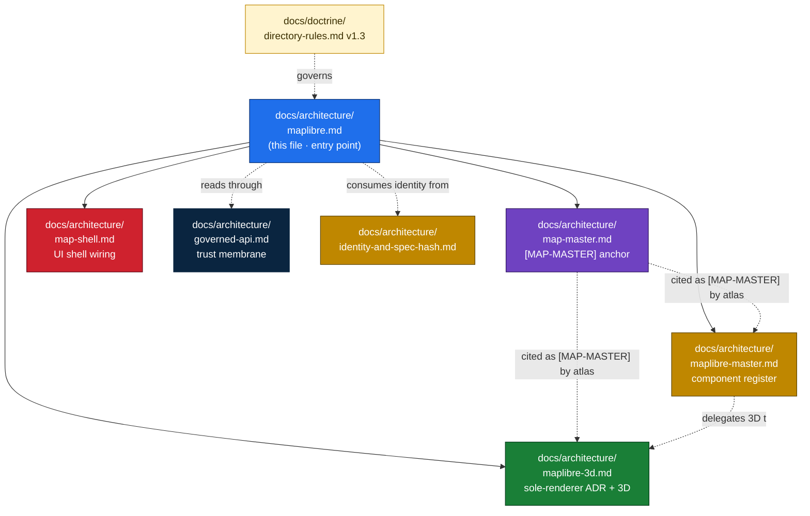

<a id="top"></a>

<!-- [KFM_META_BLOCK_V2]
doc_id: kfm://doc/architecture/maplibre
title: MapLibre in KFM — Architecture Lane Entry Point
type: architecture
subtype: lane-entry-point
version: v1 (draft)
status: draft
owners: <architecture-stewards>  # PLACEHOLDER — assign before review
created: 2026-05-25
updated: 2026-05-25
policy_label: public
related:
  - docs/architecture/map-master.md                                 # [MAP-MASTER] citation anchor (abstract)
  - docs/architecture/maplibre-master.md                            # per-component CFF register
  - docs/architecture/maplibre-3d.md                                # sole-renderer ADR + 3D feature surface
  - docs/architecture/map-shell.md                                  # UI shell wiring (Evidence Drawer, Focus Mode)
  - docs/architecture/governed-api.md                               # trust-membrane boundary
  - docs/architecture/contract-schema-policy-split.md
  - docs/architecture/identity-and-spec-hash.md
  - docs/doctrine/directory-rules.md                                # v1.3 — placement authority
  - docs/standards/PMTILES.md
  - docs/standards/OGC-API-TILES.md
  - docs/atlases/Master_MapLibre_Components-Functions-Features_v2.1.pdf  # PROPOSED; NEEDS VERIFICATION
  - schemas/contracts/v1/maplibre/
  - schemas/contracts/v1/3d/
  - policy/maplibre/
  - packages/maplibre-runtime/
  - apps/explorer-web/
authority_posture: lane entry point — subordinate to docs/doctrine/, the renderer-decision ADR, and the deeper docs in this same lane.
tags: [kfm, architecture, maplibre, landing, orientation, navigation]
notes:
  - "This file is the entry point for the MapLibre architecture lane. It routes readers to deeper docs and does not duplicate them."
  - "MapLibre GL JS is KFM's sole browser-side renderer (directory-rules.md v1.3; docs/architecture/maplibre-3d.md). Cesium is retired."
  - "No mounted repo was inspected. Every path PROPOSED unless explicitly CONFIRMED at doctrine level."
[/KFM_META_BLOCK_V2] -->

# MapLibre in KFM — Architecture Lane Entry Point

> *Front door for the MapLibre architecture cluster in `docs/architecture/`. Defines what MapLibre is in KFM, names the five non-negotiables that span the lane, and routes contributors to the right deeper doc for their task.*


<!-- TODO — wire CI badge once docs-lint workflow is named -->


| Field | Value |
|---|---|
| **Status** | `draft` |
| **Owners** | `<architecture-stewards>` *(PLACEHOLDER — assign before review)* |
| **Last reviewed** | 2026-05-25 |
| **Role** | Architecture-lane entry point. Read me first; then go deeper into one of four sibling docs. |
| **Doctrine basis** | `directory-rules.md` v1.3 §0 / §11 / §13.5 · `docs/architecture/maplibre-3d.md` (PROPOSED renderer-decision ADR) · *Master MapLibre Components-Functions-Features* v2.1 |
| **Implementation maturity** | `UNKNOWN` — no mounted repo, runtime, CI logs, or dashboards inspected this session |

---

## Quick jump

- [1. What MapLibre is in KFM](#1-what-maplibre-is-in-kfm)
- [2. The architecture lane — where to look for what](#2-the-architecture-lane--where-to-look-for-what)
- [3. The five non-negotiables](#3-the-five-non-negotiables)
- [4. Capability surface, in one screen](#4-capability-surface-in-one-screen)
- [5. Renderer disposition](#5-renderer-disposition)
- [6. Repo placement at a glance](#6-repo-placement-at-a-glance)
- [7. Quick start by task](#7-quick-start-by-task)
- [8. Required objects — short reminder](#8-required-objects--short-reminder)
- [9. Open questions](#9-open-questions)
- [10. Related docs](#10-related-docs)

---

<a id="1-what-maplibre-is-in-kfm"></a>

## 1. What MapLibre is in KFM

`CONFIRMED` doctrine — *Master MapLibre Components-Functions-Features* v2.1 Executive Determination (paraphrased):

> *MapLibre is a disciplined renderer and interaction runtime. Tiles, PMTiles, MVT, MLT, COGs, style JSON, sprites, glyphs, popups, screenshots, scenes, exports, summaries, graph projections, catalog records, and AI answers are downstream carriers — not sovereign truth.*

In one line: **MapLibre draws released artifacts; it does not decide what is true.**

| MapLibre **is** | MapLibre **is not** |
|---|---|
| A 2D / 2.5D / 3D rendering substrate | The canonical truth store |
| An interaction runtime (camera · time · click candidates) | The source registry |
| A consumer of **released** layer / style / tile artifacts | The policy engine |
| A reader of governed APIs and `EvidenceBundle` resolutions | The citation authority |
| A surface that emits `RenderReceipt` / `RepresentationReceipt` records | The review authority |
| A trust-visible negative-state display | The publication authority |
| Subject to admission gates before terrain / globe / plugin-hosted layers | The AI authority |

[↑ back to top](#top)

---

<a id="2-the-architecture-lane--where-to-look-for-what"></a>

## 2. The architecture lane — where to look for what



The five MapLibre-touching architecture docs in clean separation:

| Doc | What it owns | What it does **not** own |
|---|---|---|
| **`maplibre.md`** *(this file)* | Lane orientation; routing; the five non-negotiables; quick start. | Per-component governance; 3D specifics; UI shell wiring; ADR text. |
| **`map-master.md`** | Abstract `[MAP-MASTER]` citation anchor; renderer-boundary doctrine; v2.1 category map; three-column discipline. | Per-component rows; 3D feature surface; UI shell wiring. |
| **`maplibre-master.md`** | Per-component CFF register — renderers, style language, sources/layers/expressions, sprites/glyphs, tile formats, plugins, dependencies. | Abstract doctrine; 3D feature surface; UI shell; ADR text. |
| **`maplibre-3d.md`** | Sole-renderer ADR (PROPOSED); 3D capability surface — terrain, globe, 3D Tiles, glTF, point clouds, plugin pin list. | 2D component register; UI shell wiring. |
| **`map-shell.md`** | UI shell — Evidence Drawer, Focus Mode wiring, time interaction, exports, story surfaces. | Renderer adapter internals; tile format admission. |

[↑ back to top](#top)

---

<a id="3-the-five-non-negotiables"></a>

## 3. The five non-negotiables

`CONFIRMED` doctrine — every MapLibre-touching change has to clear all five.

| # | Rule | Where it's enforced | Source |
|---|---|---|---|
| **N-1** | **The renderer is downstream.** MapLibre is never truth, source, policy, citation, review, publication, or AI authority. | `policy/maplibre/*.rego`; layer manifest resolver; `apps/governed-api/` boundary. | `map-master.md` §2; v2.1 Category A. |
| **N-2** | **Released artifacts only.** Public clients cannot resolve RAW / WORK / QUARANTINE / candidate URLs. Promotion is a governed state transition, not a file move. | `MapReleaseManifest` + promotion-gate (Pass-10 C5-04 spec-hash match); no-public-RAW path test. | `directory-rules.md` v1.3; `identity-and-spec-hash.md` §7. |
| **N-3** | **Verify before `addSource`.** MapLibre fetches sidecar, verifies DSSE / cosign signature, checks `spec_hash` / `tiling_scheme` / `tile_format`, samples ranges, *then* calls `addSource`. | `packages/maplibre-runtime/sidecar-verifier.ts` *(`PROPOSED`)*; CI gates for `invalid_spec_hash`, `unsigned_release_manifest`, `unverified_tile_chunk`, `public_unsigned_delta`, `rollback_root_mismatch`, `missing_run_receipt`. | `maplibre-master.md` §11; v2.1 ML-058-018 / ML-058-020. |
| **N-4** | **Sensitive geometry is transformed before rendering — never hidden by style.** Generalization, jitter, aggregation, omission, or denial happen in the tile build; record in `RedactionReceipt`. | `policy/sensitivity/care-terrain-generalization.rego` and similar; tile build pipeline. | `map-master.md` §7; v2.1 Category X anti-pattern *"Style-filter geoprivacy"*. |
| **N-5** | **MapLibre GL JS is the sole browser-side renderer.** No `packages/cesium*`, `policy/cesium*`, `schemas/contracts/v1/cesium*`, or second-renderer adapter as a peer to `packages/maplibre-runtime/`. | `directory-rules.md` v1.3 §13.5 anti-pattern; renderer-decision ADR. | `maplibre-3d.md` §0.1 + Appendix B (PROPOSED ADR). |

> [!IMPORTANT]
> **N-1 through N-5 are doctrinal floors, not optional polish.** Any PR that violates one needs an ADR that explicitly supersedes the relevant doctrine — not a workaround.

[↑ back to top](#top)

---

<a id="4-capability-surface-in-one-screen"></a>

## 4. Capability surface, in one screen

| Capability | MapLibre realization | Status |
|---|---|---|
| 2D vector / raster rendering | Style JSON + sources + layers | `CONFIRMED native` |
| Interaction (click · camera · time) | `MapContextEnvelope` from runtime | `CONFIRMED` doctrine |
| 3D terrain mesh | `raster-dem` + `setTerrain` | `CONFIRMED native` |
| Hillshade / shaded relief | `hillshade` layer | `CONFIRMED native` |
| Globe projection + sky / atmosphere | `setProjection({type:'globe'})` + `sky` + `GlobeControl` *(MapLibre 5.0+, Jan 2025)* | `CONFIRMED native` |
| 2.5D extruded buildings | `fill-extrusion` with evidence-bearing `height_m` / `base_m` | `CONFIRMED native` — **2.5D label only; not true-3D evidence** |
| Custom WebGL layers (globe-aware) | `type: 'custom'` with `projectTile` shader contract | `CONFIRMED native` |
| OGC 3D Tiles | `3d-tiles-renderer` + three.js custom layer | `CONFIRMED plugin` |
| glTF assets | `maplibre-three-plugin` or three.js | `CONFIRMED plugin` |
| LAS / LAZ / COPC / EPT point clouds | `maplibre-gl-lidar` (deck.gl-based) | `CONFIRMED plugin` |
| PMTiles delivery | `pmtiles` protocol handler + verify-before-`addSource` | `CONFIRMED plugin` |
| COG raster delivery | `maplibre-cog-protocol` | `CONFIRMED plugin` |
| Mobile / native | MapLibre Native | **Parity-gated**; `NEEDS VERIFICATION` |
| Experimental | MapLibre RS | Sandbox only; `UNKNOWN` |

> [!NOTE]
> **For the deep table** (per-capability inputs, outputs, governance hooks, plugin pins, status), see `docs/architecture/maplibre-3d.md` §0.4 *(3D)* and `docs/architecture/maplibre-master.md` Appendix A *(2D + tile formats)*.

[↑ back to top](#top)

---

<a id="5-renderer-disposition"></a>

## 5. Renderer disposition

`CONFIRMED` at doctrine level (`directory-rules.md` v1.3 §0, §7.2.a, §13.5); ADR `PROPOSED` in `maplibre-3d.md` Appendix B.

> [!IMPORTANT]
> **Cesium is retired from KFM's architecture.** All browser-side rendering flows through MapLibre GL JS plus its plugin ecosystem. The renderer-decision ADR is `PROPOSED`, not filed — number pending against the live ADR set (OPEN-DR-10). Until filed, every "supersedes Cesium" claim downstream is `PROPOSED-SUPERSEDED`.

| Element | Pre-v1.3 | v1.3 + onward |
|---|---|---|
| Browser-side renderer | Dual: MapLibre (2D) + Cesium (3D) | **MapLibre as sole renderer** |
| Cesium edition question (CesiumJS open-source vs Cesium Ion) | Open `NEEDS VERIFICATION` | **Moot** — Cesium itself is not adopted |
| `packages/cesium*` | Allowed | **Retired** |
| `schemas/contracts/v1/cesium*` | Allowed | **Not admitted** |
| `policy/cesium*` | Allowed | **Not admitted** |
| 3D object families *(Scene Manifest, Terrain Model, 3D Tile Set, glTF Asset, Point Cloud, Digital Twin View, ViewState, Representation Receipt, Reality Boundary Note, 3D Admission Decision)* | Renderer-agnostic | **Unchanged** — all implementable on MapLibre + plugins |

[↑ back to top](#top)

---

<a id="6-repo-placement-at-a-glance"></a>

## 6. Repo placement at a glance

`CONFIRMED` placement authority — `directory-rules.md` v1.3 §0 / §6.4 / §6.5 / §7.2.a / §11. Paths below are `PROPOSED` until verified in a mounted repo.

```text
docs/architecture/
  maplibre.md                                 # this file (lane entry)
  map-master.md                               # [MAP-MASTER] anchor
  maplibre-master.md                          # component register
  maplibre-3d.md                              # sole-renderer ADR + 3D surface
  map-shell.md                                # UI shell wiring

docs/atlases/
  Master_MapLibre_Components-Functions-Features_v2.1.*   # the indexed source dossier

schemas/contracts/v1/
  maplibre/                                   # renderer/scene schemas
  3d/                                         # 3D-asset schemas (plugins)
  policy/
    3d_admission_decision.schema.json
    plugin_admission.schema.json

contracts/
  maplibre/                                   # semantic meaning (Markdown)
  3d/

policy/
  maplibre/                                   # 3d_admission · plugin_admission · sky-and-light-defaults · globe-projection-admission
  sensitivity/                                # care-terrain-generalization · others

packages/
  maplibre-runtime/                           # sole governed renderer adapter

apps/
  explorer-web/                               # the map-first shell
```

> [!CAUTION]
> **`packages/maplibre/`** — if present from pre-v1.3 lineage, it is a transitional name for `packages/maplibre-runtime/` and must be reconciled via routine PR alongside the renderer-decision ADR. *(`directory-rules.md` v1.3 §18.e OPEN-DR-11.)*

[↑ back to top](#top)

---

<a id="7-quick-start-by-task"></a>

## 7. Quick start by task

The most useful section of this file for new contributors. Find your task, read the right doc(s) first.

| If you're doing… | Read first | Then read |
|---|---|---|
| **Citing `[MAP-MASTER]` from a domain doc or atlas** | `map-master.md` | — |
| **Adding a new MapLibre component** (renderer / format / plugin) | `maplibre-master.md` Appendix A | `maplibre.md` §3 (the five non-negotiables) |
| **Building a new 2D layer or style** | `maplibre-master.md` §4 + §6 | `maplibre.md` §3 |
| **Building a 3D scene** (terrain · globe · 3D Tiles · glTF · point cloud) | `maplibre-3d.md` | `maplibre-master.md` §7 |
| **Building or modifying the Evidence Drawer / Focus Mode wiring** | `map-shell.md` | `governed-api.md` |
| **Publishing a PMTiles archive** | `docs/standards/PMTILES.md` | `maplibre-master.md` §6 + §11 (verify-before-`addSource`) |
| **Admitting a new plugin** | `maplibre-master.md` §8 | `policy/maplibre/plugin-admission.rego` *(`PROPOSED`)* |
| **Wiring a `RenderReceipt`** | `maplibre-master.md` §9 | `identity-and-spec-hash.md` |
| **Defining a sensitivity transform** | `map-master.md` §7 (three-column discipline) | the relevant domain doc under `docs/domains/<domain>/` |
| **Filing the renderer-decision ADR** | `maplibre-3d.md` Appendix B | `directory-rules.md` v1.3 §18.e OPEN-DR-10 |
| **Renaming `packages/maplibre/` → `packages/maplibre-runtime/`** | `directory-rules.md` v1.3 §7.2.a, §18.e OPEN-DR-11 | `docs/registers/DRIFT_REGISTER.md` |
| **Removing a Cesium reference** | `maplibre-3d.md` §0.1 + `directory-rules.md` v1.3 §13.5 anti-pattern | This file §5 |
| **Writing a test for a no-public-RAW path** | `maplibre-master.md` §13 | `map-master.md` §7 |
| **Investigating a rendering bug** | `maplibre-master.md` §9 (runtime probes) | `map-shell.md` |

[↑ back to top](#top)

---

<a id="8-required-objects--short-reminder"></a>

## 8. Required objects — short reminder

`CONFIRMED` — every MapLibre-touching PR must thread these. Full table with `spec_hash` carriage in **`maplibre-master.md` §10**.

```text
SourceDescriptor · LayerManifest · StyleManifest · TileArtifactManifest ·
MapReleaseManifest · EvidenceBundle · EvidenceRef · DecisionEnvelope ·
PolicyDecision · PromotionDecision · RunReceipt · RenderReceipt ·
AIReceipt · ValidationReport · rollback target · cache-invalidation record
```

> [!TIP]
> **The renderer reads identity; it never mints identity.** Every object above carries `spec_hash` (`jcs:sha256:<hex>`). Compare-don't-trust — the renderer recomputes the digest from canonical bytes and compares it to the declared value; mismatch is `DENY`. See `docs/architecture/identity-and-spec-hash.md`.

[↑ back to top](#top)

---

<a id="9-open-questions"></a>

## 9. Open questions

Lane-level open questions live in the deeper docs. The headline items:

| OQ | Status | Where it's tracked |
|---|---|---|
| Renderer-decision ADR number pending | `NEEDS VERIFICATION` | `directory-rules.md` v1.3 §18.e OPEN-DR-10; `maplibre-3d.md` Appendix B |
| `packages/maplibre/` → `packages/maplibre-runtime/` rename status | `NEEDS VERIFICATION` | `directory-rules.md` v1.3 §18.e OPEN-DR-11; `DRIFT_REGISTER.md` |
| Schema-home segment naming (`maplibre/` vs `3d/` boundary) | `NEEDS VERIFICATION` | `directory-rules.md` v1.3 §18.e OPEN-DR-13 |
| MapLibre GL JS pinned version | `UNKNOWN` | `maplibre-master.md` §15 OQ-MLM-01 |
| `RenderReceipt` runtime emission wired? | `UNKNOWN` | `maplibre-master.md` §15 OQ-MLM-04 |
| Plugin-admission Rego live in CI + runtime parity? | `NEEDS VERIFICATION` | `maplibre-master.md` §15 OQ-MLM-05 |
| MLT pilot status | `UNKNOWN` | `maplibre-master.md` §15 OQ-MLM-06 |
| MapLibre Native parity matrix | `NEEDS VERIFICATION` | `maplibre-master.md` §15 OQ-MLM-07 |
| PMTiles hosting Range / CORS profile | `NEEDS VERIFICATION` | `maplibre-master.md` §15 OQ-MLM-08 |
| Plugin pin versions | `UNKNOWN` | `maplibre-master.md` §15 OQ-MLM-09 |
| Canonical home of the v2.1 dossier | `NEEDS VERIFICATION` | `map-master.md` §13 OQ-MM-01 |
| Category W renaming (drop "Cesium") in canonical dossier | `NEEDS VERIFICATION` | `map-master.md` §13 OQ-MM-10 |

[↑ back to top](#top)

---

<a id="10-related-docs"></a>

## 10. Related docs

| Doc | Role | Status |
|---|---|---|
| `docs/architecture/map-master.md` | Abstract `[MAP-MASTER]` doctrine anchor. | `CONFIRMED` authored. |
| `docs/architecture/maplibre-master.md` | Per-component CFF register. | `CONFIRMED` authored. |
| `docs/architecture/maplibre-3d.md` | Sole-renderer ADR + 3D feature surface. | `CONFIRMED` authored; ADR `PROPOSED`. |
| `docs/architecture/map-shell.md` | UI shell wiring (Evidence Drawer, Focus Mode, time, exports). | `NEEDS VERIFICATION`. |
| `docs/architecture/governed-api.md` | Trust membrane the renderer reads through. | `NEEDS VERIFICATION`. |
| `docs/architecture/identity-and-spec-hash.md` | Identity, `spec_hash`, JCS+SHA-256, replay, promotion gate. | Authored prior turn; `NEEDS VERIFICATION` in repo. |
| `docs/architecture/contract-schema-policy-split.md` | Meaning · shape · admissibility split. | `NEEDS VERIFICATION`. |
| `docs/doctrine/directory-rules.md` (v1.3) | Placement authority. | `CONFIRMED` doctrine. |
| `docs/standards/PMTILES.md` | PMTiles v3 governance profile. | Authored prior session. |
| `docs/standards/OGC-API-TILES.md` | OGC API Tiles integration. | Authored prior session. |
| `docs/atlases/Master_MapLibre_Components-Functions-Features_v2.1.*` | The indexed dossier this lane orbits. | `CONFIRMED` exists in corpus; `PROPOSED` placement under `docs/atlases/`. |
| `docs/adr/ADR-NNNN-maplibre-sole-renderer.md` | Renderer-decision ADR — number pending OPEN-DR-10. | `PROPOSED`. |
| `docs/registers/DRIFT_REGISTER.md` | `packages/maplibre/` transitional state; renderer-decision migration. | `NEEDS VERIFICATION`. |
| `docs/registers/VERIFICATION_BACKLOG.md` | All OQ-* items across this lane. | `NEEDS VERIFICATION`. |

[↑ back to top](#top)

---

<!-- ---------------------------------------------------------------- -->

> **Last updated:** 2026-05-25 · **Status:** draft · **Doctrine basis:** `directory-rules.md` v1.3; `docs/architecture/maplibre-3d.md`; *Master MapLibre Components-Functions-Features* v2.1.

[↑ Back to top](#top)
