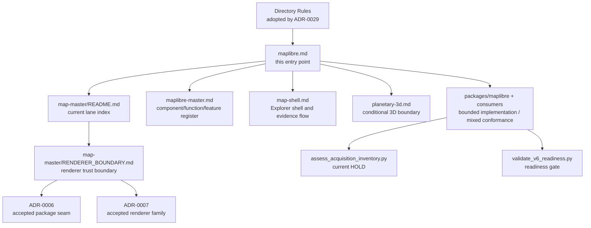

<a id="top"></a>

<!-- [KFM_META_BLOCK_V2]
doc_id: kfm://doc/architecture/maplibre
title: MapLibre in KFM — Architecture Lane Entry Point
type: architecture
subtype: lane-entry-point
version: v2.2-draft
status: draft; repository-grounded; architecture-accepted; acquisition-HOLD; runtime-HOLD; non-release; non-publication
owners:
  - "@bartytime4life — current CODEOWNERS route for docs/architecture/**"
  - "NEEDS VERIFICATION — independent architecture, map-runtime, release, and policy stewards"
created: 2026-05-25
updated: 2026-08-29
policy_label: public; architecture; maplibre; renderer-downstream; cite-or-abstain; no-release-authority
current_path: docs/architecture/maplibre.md
owning_root: docs/
responsibility: "Provide the repository-grounded entry point for accepted MapLibre architecture, current implementation evidence, unresolved consumer conformance and runtime-readiness work, validation gates, and direct task navigation without creating runtime, contract, schema, policy, release, or publication authority."
authority_posture: "Explanatory architecture entry point subordinate to accepted ADRs, adopted Directory Rules, semantic contracts, machine schemas, policy, current code/configuration, tests/workflows, receipts/proofs/manifests, release records, and runtime evidence."
truth_posture: "CONFIRMED accepted ADR-0006 and ADR-0007 architecture, exact package-owned maplibre-gl 6.6.0 dependency, package-owned lifecycle/camera adapter, Vite worker seam, bounded browser fixture, Sites-derived NullMapRuntime fallback, acquisition profile v14 structural HOLD with no acquisition outside the seam, and retired legacy harness / PROPOSED future full Sites capability migration, governed runtime activation, sources, layers, protocols, performance execution, release, deployment, and publication / UNKNOWN production behavior, public reliance, and independent stewardship / NEEDS VERIFICATION hosted exact-head checks and broader browser evidence"
evidence_snapshot:
  repository: bartytime4life/Kansas-Frontier-Matrix
  base_ref: main
  base_commit: 3009a477071271c9a1d2ac0a1fcac98d26e40976
  target_prior_blob: 74f5b4175682b72dfbc27b022eccd1c8dbdd22e2
  directory_rules_blob: fd49a0b83e55cef52c1124281f093e263526898d
  directory_rules_decision: ADR-0029 accepted
related:
  - ../doctrine/directory-rules.md
  - ../adr/ADR-0029-adopt-directory-governance-standard-v2.md
  - ./map-master/README.md
  - ./maplibre-master.md
  - ./map-shell.md
  - ./planetary-3d.md
  - docs/architecture/ui/MAP_RUNTIME_BOUNDARY.md
  - ./contract-schema-policy-split.md
  - ./identity-and-spec-hash.md
  - ../adr/ADR-0006-maplibre-boundary--only-maplibreadapter-imports-maplibre.md
  - "../adr/ADR-0007 — MapLibre GL JS Is the Sole Browser-Side Renderer.md"
  - ../../packages/maplibre/package.json
  - ../../packages/maplibre/src/index.ts
  - ../../packages/maplibre/src/maplibre-adapter.ts
  - ../../packages/maplibre/src/maplibre-vite-adapter.ts
  - ../../apps/explorer-web/package.json
  - ../../apps/explorer-web/src/adapters/MapLibreAdapter.ts
  - ../../apps/explorer-web/src/features/map_runtime/index.tsx
  - ../../apps/explorer-web/src/features/map_runtime/layer_manifest_admission.ts
  - ../../apps/explorer-web/src/features/map_runtime/pmtiles_release_cache.ts
  - ../../configs/maplibre/README.md
  - ../../tools/validators/maplibre/assess_acquisition_inventory.py
  - ../../tools/validators/maplibre/validate_v6_readiness.py
  - ../../tests/maplibre/test_validate_v6_readiness.py
  - ../../scripts/maplibre-smoke-perf.mjs
tags: [kfm, architecture, maplibre, map-master, explorer-web, renderer-boundary, evidence-drawer, pmtiles, validation]
notes:
  - "This revision preserves the document identity and stable legacy anchors while replacing proposal-era repository assumptions with current pinned evidence."
  - "The accepted Directory Rules bytes are the v2.0.0-draft.1 text adopted by ADR-0029; the word draft in that source version does not make the accepted decision provisional."
  - "ADR-0006 and ADR-0007 are accepted architecture decisions. Exact maplibre-gl 6.6.0 and an initial package-owned adapter are implemented, but acceptance and implementation do not establish consumer conformance, runtime readiness, release, deployment, or publication."
  - "The bounded acquisition inventory returns structural HOLD because raw MapLibre acquisition is confined to packages/maplibre; the Sites-derived Explorer runs NullMapRuntime and the readiness validator separately returns HOLD because all twelve browser probes remain NOT_RUN."
  - "The former CDN/global performance harness is retired and exits with finite WORKFLOW_HOLD before renderer or network acquisition."
  - "The verified current package is packages/maplibre/. The proposal-era paths docs/architecture/maplibre-3d.md and packages/maplibre-runtime/ were not present at the evidence snapshot and are not cited as current authorities."
[/KFM_META_BLOCK_V2] -->

# MapLibre in KFM — Architecture Lane Entry Point

> **Purpose.** Start here for KFM's MapLibre architecture lane: what architecture is accepted, what is implemented, how the Sites consumer now fails closed, which trust boundaries apply, and what evidence is required before a browser renderer can graduate from `HOLD`.

| Field | Current status |
|---|---|
| **Document state** | `draft · repository-grounded · explanatory` |
| **Placement** | `CONFIRMED PLACE` — same-path architecture documentation under the adopted `docs/` responsibility root |
| **Current package state** | `CONFIRMED bounded implementation` — `@kfm/maplibre` pins exact `maplibre-gl@6.6.0` and owns the renderer-neutral port, null runtime, lifecycle/camera adapter, and Vite worker seam |
| **Concrete browser runtime** | `HOLD` — both Explorer compositions use `NullMapRuntime`; the Sites-derived shell retains catalog/evidence and serializable camera state while renderer capabilities remain unimplemented |
| **Renderer decision** | `ACCEPTED architecture` — ADR-0006 owns the package seam and ADR-0007 selects the normal browser-renderer family; neither grants runtime, release, deployment, or publication authority |
| **Publication state** | `NONE` — this document, branch, commit, or pull request is not a release or publication event |
| **Review route** | `CONFIRMED` CODEOWNERS route to `@bartytime4life`; independent steward roles remain `NEEDS VERIFICATION` |
| **Evidence read** | Repository `main` at `3009a477071271c9a1d2ac0a1fcac98d26e40976` |

> [!IMPORTANT]
> **The renderer is downstream of trust.** MapLibre may render and interact with public-safe released artifacts, but it cannot become the source registry, canonical evidence store, policy engine, citation authority, review authority, promotion authority, release authority, or AI authority.

> [!CAUTION]
> The repository contains real Explorer shells, an exact v6.6 package dependency, a package-owned renderer-neutral port and initial MapLibre adapter, Vite worker configuration, fixture-driven admission and cache planning, a bounded browser fixture, validators, and focused tests. The Sites-derived shell now conforms structurally by using the package-owned `NullMapRuntime`; it does **not** prove a full renderer consumer, completed v6 probe record, release-backed map sources, production operation, deployment, or public reliance.

## Quick jump

- [1. What MapLibre is in KFM](#1-what-maplibre-is-in-kfm)
- [2. The architecture lane — where to look for what](#2-the-architecture-lane--where-to-look-for-what)
- [3. The five non-negotiables](#3-the-five-non-negotiables)
- [4. Capability surface, in one screen](#4-capability-surface-in-one-screen)
- [5. Renderer disposition](#5-renderer-disposition)
- [6. Repo placement at a glance](#6-repo-placement-at-a-glance)
- [7. Quick start by task](#7-quick-start-by-task)
- [8. Required objects — short reminder](#8-required-objects--short-reminder)
- [9. Open questions](#9-open-questions)
- [10. Related docs](#10-related-docs)
- [11. Validation and graduation gate](#11-validation-and-graduation-gate)
- [12. Change boundary and rollback](#12-change-boundary-and-rollback)
- [13. Modernization ledger](#13-modernization-ledger)

---

<a id="1-what-maplibre-is-in-kfm"></a>

## 1. What MapLibre is in KFM

KFM's accepted architecture treats MapLibre as a **browser-side rendering and interaction runtime inside a governed shell**. The current repository implements a bounded package-owned slice while leaving consumer conformance and broader runtime readiness unresolved.

| Architectural responsibility | Current evidence | Status |
|---|---|---|
| Render released vector, raster, terrain, or other public-safe artifacts | The package-owned adapter can construct an empty-style runtime; no governed source/layer activation or released artifact binding is present | `IMPLEMENTED BOUNDED · ACTIVATION HOLD` |
| Maintain camera, viewport, layer interaction, and clicked-feature candidate state | Explorer Web contains a renderer-neutral map stage and fixture-driven selection flow | `CONFIRMED bounded implementation` |
| Route a selected candidate toward governed evidence resolution | The map-runtime flow accepts an injected resolver and preserves finite negative outcomes | `CONFIRMED bounded implementation` |
| Import and own MapLibre GL JS through one adapter seam | ADR-0006 accepts the package-owned seam; `packages/maplibre/` pins v6.6.0 and implements the initial adapter, while both Explorers consume its renderer-neutral facade | `ACCEPTED · STRUCTURAL HOLD` |
| Decide whether a claim, source, layer, or geometry may be exposed | No renderer surface is authorized to make that decision | `DENY` |
| Promote, release, publish, or correct canonical truth | No renderer surface is authorized to perform those transitions | `DENY` |

### MapLibre may carry evidence; it does not create authority

| MapLibre may do | MapLibre must not do |
|---|---|
| Render an already governed and public-safe representation | Read RAW, WORK, QUARANTINE, or canonical internal stores as the normal public path |
| Emit camera, time, selection, and representation context | Treat a click, pixel, popup, screenshot, tile, or style as proof |
| Surface `ANSWER`, `ABSTAIN`, `DENY`, and `ERROR` states supplied through governed interfaces | Convert missing evidence, policy failure, or runtime error into a permissive fallback |
| Display evidence, freshness, review, release, correction, and rollback cues | Hide sensitivity through style-only filtering or client-only opacity changes |
| Support deterministic, testable package-owned adapter behavior | Infer runtime readiness, release, deployment, or publication from architecture acceptance, a package, green badge, or prose claim |

### Current repository boundary

`CONFIRMED` from the pinned repository snapshot:

- [`packages/maplibre/package.json`](../../packages/maplibre/package.json) defines the private `@kfm/maplibre` package at version `0.0.0` and pins exact `maplibre-gl@6.6.0`.
- [`packages/maplibre/src/index.ts`](../../packages/maplibre/src/index.ts) re-exports the renderer-neutral `map-runtime-port` and `null-map-runtime` surfaces; [`packages/maplibre/package.json`](../../packages/maplibre/package.json) exposes the effectful adapters separately as `@kfm/maplibre/adapter` and `@kfm/maplibre/vite-adapter`.
- [`maplibre-adapter.ts`](../../packages/maplibre/src/maplibre-adapter.ts) implements the initial lifecycle/camera slice with an inline empty style, finite errors, and teardown.
- [`maplibre-vite-adapter.ts`](../../packages/maplibre/src/maplibre-vite-adapter.ts) owns the Vite worker URL setup required by the detected bundler.
- [`apps/explorer-web/package.json`](../../apps/explorer-web/package.json) does not declare `maplibre-gl`, and the normal site composition still constructs `NullMapRuntime`.
- [`apps/explorer-web/src/adapters/MapLibreAdapter.ts`](../../apps/explorer-web/src/adapters/MapLibreAdapter.ts) remains an app-local compatibility marker, not the reusable implementation owner.
- The separately tracked [`apps/kansas-frontier-matrix-explorer/`](../../apps/kansas-frontier-matrix-explorer/) imports `@kfm/maplibre` and boots `NullMapRuntime`; direct dependency, CSS, worker, dynamic/global, and construction acquisition were removed, so profile v14 returns structural `HOLD` with raw acquisition confined to the accepted seam.
- [`map_runtime/index.tsx`](../../apps/explorer-web/src/features/map_runtime/index.tsx) provides a renderer-neutral, fixture-driven selection profile with an injected resolver.
- [`layer_manifest_admission.ts`](../../apps/explorer-web/src/features/map_runtime/layer_manifest_admission.ts) evaluates bounded admission inputs but does not mutate a registry or call `addSource`.
- [`pmtiles_release_cache.ts`](../../apps/explorer-web/src/features/map_runtime/pmtiles_release_cache.ts) plans release-scoped cache behavior but performs no fetch or cache operation.

That is a concrete bounded package runtime, but it is not a conforming production activation and it is not publication evidence.

[Back to top](#top)

---

<a id="2-the-architecture-lane--where-to-look-for-what"></a>

## 2. The architecture lane — where to look for what


```mermaid
flowchart TD
    Entry["maplibre.md\nthis entry point"]
    Rules["Directory Rules\nadopted by ADR-0029"]
    Master["map-master/README.md\ncurrent lane index"]
    Register["maplibre-master.md\ncomponent/function/feature register"]
    Shell["map-shell.md\nExplorer shell and evidence flow"]
    Planetary["planetary-3d.md\nconditional 3D boundary"]
    Boundary["map-master/RENDERER_BOUNDARY.md\nrenderer trust boundary"]
    ADR6["ADR-0006\naccepted package seam"]
    ADR7["ADR-0007\naccepted renderer family"]
    Code["packages/maplibre + consumers\nbounded implementation / mixed conformance"]
    Acquire["assess_acquisition_inventory.py\ncurrent HOLD"]
    Ready["validate_v6_readiness.py\nreadiness gate"]

    Rules --> Entry
    Entry --> Master
    Entry --> Register
    Entry --> Shell
    Entry --> Planetary
    Master --> Boundary
    Boundary --> ADR6
    Boundary --> ADR7
    Entry --> Code
    Code --> Acquire
    Code --> Ready
```

| Surface | Current role | Authority or maturity |
|---|---|---|
| [`docs/doctrine/directory-rules.md`](../doctrine/directory-rules.md) | Writable human placement authority | `CONFIRMED adopted` through [ADR-0029](../adr/ADR-0029-adopt-directory-governance-standard-v2.md) |
| [`map-master/README.md`](./map-master/README.md) | Current Map Master lane index and direct-child navigation | `CONFIRMED repository-grounded draft` |
| [`maplibre-master.md`](./maplibre-master.md) | Repository-grounded MapLibre component/function/feature register | `CONFIRMED file · draft authority` |
| [`map-shell.md`](./map-shell.md) | Current Explorer shell, map-selection, Evidence Drawer, and finite-state boundary | `CONFIRMED bounded implementation evidence` |
| [`planetary-3d.md`](./planetary-3d.md) | Conditional 3D, terrain, globe, scene, and reality-boundary guidance | `CONFIRMED current doc · mixed maturity` |
| [`map-master/RENDERER_BOUNDARY.md`](./map-master/RENDERER_BOUNDARY.md) | Renderer trust membrane and implementation boundary | `CONFIRMED current doc` |
| [ADR-0006](../adr/ADR-0006-maplibre-boundary--only-maplibreadapter-imports-maplibre.md) | Package-owned single-import seam | `ACCEPTED architecture` |
| [ADR-0007](../adr/ADR-0007%20%E2%80%94%20MapLibre%20GL%20JS%20Is%20the%20Sole%20Browser-Side%20Renderer.md) | Normal browser-renderer family | `ACCEPTED architecture` |
| [`assess_acquisition_inventory.py`](../../tools/validators/maplibre/assess_acquisition_inventory.py) | Bounded renderer acquisition inventory | `IMPLEMENTED · current structural HOLD` |
| Former flat `map-master.md` | Proposal-era lineage and abstract architecture material preserved in Git history and receipts | `RETIRED` by [PR #3151](https://github.com/bartytime4life/Kansas-Frontier-Matrix/pull/3151); use [`map-master/README.md`](./map-master/README.md) for the current lane index |

> [!NOTE]
> The proposal-era paths `docs/architecture/maplibre-3d.md` and `packages/maplibre-runtime/` were not present at the evidence snapshot. Do not use them as current implementation or navigation authorities. Current 3D guidance is in [`planetary-3d.md`](./planetary-3d.md), and the verified package seam is [`packages/maplibre/`](../../packages/maplibre/).

### Map Master direct-child navigation

The current lane index routes detailed responsibilities to:

- [2D / 3D parity](./map-master/2D_3D_PARITY.md)
- [Evidence Drawer](./map-master/EVIDENCE_DRAWER.md)
- [Layer lifecycle](./map-master/LAYER_LIFECYCLE.md)
- [Performance budgets](./map-master/PERFORMANCE_BUDGETS.md)
- [Renderer boundary](./map-master/RENDERER_BOUNDARY.md)
- [Tile artifacts](./map-master/TILE_ARTIFACTS.md)
- [Viewer verification](./map-master/VIEWER_VERIFICATION.md)

[Back to top](#top)

---

<a id="3-the-five-non-negotiables"></a>

## 3. The five non-negotiables

These rules apply to the current bounded MapLibre implementation and to every later activation or capability change.

| # | Rule | Required consequence |
|---|---|---|
| **N-1** | **The renderer is downstream of trust.** | Renderer code may consume governed decisions and released artifacts; it cannot become truth, policy, evidence, review, release, or AI authority. |
| **N-2** | **Public rendering requires governed inputs.** | A layer, style, tile archive, terrain source, scene, or plugin reference needs the appropriate identity, provenance, policy, review, release, correction, and rollback support before public exposure. Fixture eligibility is not release. |
| **N-3** | **Selection narrows scope; it does not prove a claim.** | A click or spatial query produces a candidate context. Consequential answers require `EvidenceRef` resolution to an admissible `EvidenceBundle`, or a finite `ABSTAIN`, `DENY`, or `ERROR` outcome. |
| **N-4** | **Styling is not policy.** | Sensitive geometry must be omitted, generalized, aggregated, delayed, or denied upstream with an auditable transform. Client styling cannot be the only protection. |
| **N-5** | **Decision and runtime state must stay visible.** | Accepted ADRs remain bounded to their stated architecture scope; structural acquisition `HOLD` and readiness `HOLD` have distinct reasons; a later readiness `READY` result means only eligibility for governed activation work; a branch, PR, test, package, absent competitor, or documentation statement does not release, deploy, publish, or expand the accepted scope. |

> [!IMPORTANT]
> A concrete MapLibre integration that cannot preserve all five rules must remain `HOLD` or be narrowed. The correct response to unresolved evidence, rights, sensitivity, review, release, or runtime state is never a persuasive renderer fallback.

[Back to top](#top)

---

<a id="4-capability-surface-in-one-screen"></a>

## 4. Capability surface, in one screen

This table reports **current repository maturity**, not the broader capabilities of the upstream MapLibre ecosystem.

| Capability or surface | Verified current evidence | Current posture |
|---|---|---|
| MapLibre package seam | Exact `maplibre-gl@6.6.0`, renderer-neutral port, null runtime, adapter, exports, tests, and lock closure | `IMPLEMENTED BOUNDED` |
| Explorer Web application | Normal composition uses `NullMapRuntime`; no direct renderer dependency | `IMPLEMENTED SHELL · ACTIVATION HOLD` |
| Sites-derived Explorer | Package-root dependency and `NullMapRuntime`; renderer styles, sources, layers, interactions, workers, and measurement remain held | `STRUCTURAL CONFORMANCE · CAPABILITY HOLD` |
| MapLibre adapter | Package-owned lifecycle/camera implementation plus Vite worker setup; sources, layers, protocols, and plugins remain absent | `IMPLEMENTED INITIAL SLICE` |
| Map selection and evidence-resolution bridge | Fixture-driven profile with injected resolver and finite outcomes | `IMPLEMENTED BOUNDED SLICE` |
| Layer-manifest admission evaluation | Deterministic fixture-only evaluator; no registry mutation or source creation | `IMPLEMENTED BOUNDED SLICE` |
| PMTiles release-cache planning | Deterministic fixture-only planner; no fetch or cache side effects | `IMPLEMENTED BOUNDED SLICE` |
| Readiness validator | Exact candidate `6.6.0`, import-boundary checks, TypeScript/module checks, and twelve named runtime probes | `IMPLEMENTED VALIDATOR` |
| Readiness tests | Synthetic positive and exact-negative unit coverage | `IMPLEMENTED TESTS` |
| Acquisition inventory | Profile v14 finds raw acquisition only in the accepted package seam | `HOLD · RENDERER_ACQUISITION_PRESENT` |
| Committed v6 probe result | `configs/maplibre/v6-probe-results.json` is absent; all twelve probes report `NOT_RUN` | `HOLD · RUNTIME_PROBES_PENDING` |
| MapLibre GL JS dependency | Exact `6.6.0` is pinned only in the accepted package; the Sites-derived app consumes the renderer-neutral facade | `IMPLEMENTED · PACKAGE-OWNED` |
| Standalone performance harness | `scripts/maplibre-smoke-perf.mjs` exits finite `WORKFLOW_HOLD` before renderer or network acquisition | `RETIRED · REPLACEMENT HOLD` |
| MapLibre configuration lane | README plus a performance-envelope payload; not a live viewer config or source registry | `BOUNDED CONFIG SUPPORT` |
| Production 2D / terrain / globe / 3D runtime | No current code, runtime trace, release manifest, deployment record, or hosted result inspected proves it | `UNKNOWN / NOT PROVEN` |

### Why the readiness posture is `HOLD`

Static repository evidence is enough to show that the validators exist, exact `6.6.0` is selected, the Sites consumer does not bypass the seam, and the required v6 probe result is absent. Both validators return `HOLD` for different reasons: structural acquisition remains present inside the accepted package, while readiness probes remain pending. Neither result may be reported as renderer activation.

A later `READY` result would still mean only that the pinned candidate satisfies the repository-owned readiness profile. ADR-0006 and ADR-0007 are already accepted within their architecture scopes; `READY` would not repair consumer conformance, change public behavior, approve a release, deploy, or publish a viewer.

[Back to top](#top)

---

<a id="5-renderer-disposition"></a>

## 5. Renderer disposition

The repository contains **accepted MapLibre architecture** and a **bounded package implementation**, not a conforming production runtime or release admission.

| Question | Current answer | Evidence needed to change it |
|---|---|---|
| Is MapLibre the intended browser-renderer direction? | `CONFIRMED architecture direction` | Existing architecture lane and package naming |
| Is the one-import adapter boundary accepted? | `YES · ADR-0006` | Consumer migration and acquisition enforcement remain separate conformance work |
| Is MapLibre GL JS the accepted normal browser-renderer family? | `YES · ADR-0007` | Capabilities, runtime readiness, release, deployment, and publication remain separately governed |
| Is Cesium formally retired? | `NO broader claim inferred` | ADR-0007 governs its stated normal browser-renderer scope; any broader renderer or 3D disposition requires current accepted authority |
| Is `maplibre-gl` pinned in the accepted package? | `YES · exact 6.6.0` | Broader supply-chain review, runtime probes, and consumer conformance remain open |
| Is there a concrete production renderer? | `NOT PROVEN` | Current code, tests, hosted checks, release state, deployment evidence, and runtime traces |
| Are 3D plugins admitted? | `NO GENERAL ADMISSION` | Per-plugin rights, security, performance, compatibility, evidence-parity, and rollback review |

### Bounded decision posture

Within the accepted ADR scopes:

1. treat `packages/maplibre/` as the reusable dependency and adapter authority, not as production-readiness proof;
2. keep consumers behind its renderer-neutral public seam; complete the Sites capability migration only through a separately reviewed dependency-closed slice;
3. do not add a peer renderer or declare one retired by documentation alone;
4. keep the retired standalone benchmark inert until a governed fixture, threshold, and artifact authority are defined;
5. treat each terrain, globe, 3D, point-cloud, custom-layer, or protocol integration as a separately governed capability rather than automatic inheritance from the renderer choice.

[Back to top](#top)

---

<a id="6-repo-placement-at-a-glance"></a>

## 6. Repo placement at a glance

### Directory Rules basis

This update stays at `docs/architecture/maplibre.md`. Under the accepted Directory Rules, `docs/` owns human-readable architecture explanation, while executable code, machine schemas, policy, tests, configuration, data, and release records remain in their own responsibility roots. No new path, root, authority surface, or migration is created by this document.

| Verified current path | Owning responsibility | What its presence proves | What it does not prove |
|---|---|---|---|
| [`docs/architecture/maplibre.md`](./maplibre.md) | Human-readable lane entry point | Accepted architecture and current evidence are documented | Runtime readiness, release, deployment, or publication |
| [`docs/architecture/map-master/`](./map-master/README.md) | Map Master architecture sublane | Current navigation and bounded doctrine exist | Production viewer or release |
| [`packages/maplibre/`](../../packages/maplibre/) | Reusable dependency and adapter seam | Exact dependency, port, null runtime, initial adapter, Vite worker seam, tests, and fixture exist | Production activation or public release |
| [`apps/explorer-web/`](../../apps/explorer-web/) | Explorer Web application | Normal browser application and bounded `NullMapRuntime` composition exist | MapLibre production activation or published site |
| [`apps/kansas-frontier-matrix-explorer/`](../../apps/kansas-frontier-matrix-explorer/) | Sites-derived application | A renderer-neutral NullMapRuntime shell and catalog/evidence surfaces exist | Full renderer capability migration, activation, or authority to create a peer seam |
| [`configs/maplibre/`](../../configs/maplibre/) | Commit-safe configuration support | README and bounded performance input exist | Live style/layer/source registry |
| [`tools/validators/maplibre/`](../../tools/validators/maplibre/) | Repository validation tooling | Acquisition and readiness logic exist | `READY`; current exact-head results are structural acquisition `HOLD` and readiness `HOLD` |
| [`tests/maplibre/`](../../tests/maplibre/) | Focused test ownership | Synthetic validator tests exist | Browser/runtime parity or hosted success |
| [`scripts/maplibre-smoke-perf.mjs`](../../scripts/maplibre-smoke-perf.mjs) | Retired standalone script | A finite `WORKFLOW_HOLD` prevents renderer/network acquisition | Replacement performance authority or release eligibility |

### Placement rules for future work

Any later concrete integration must:

- keep semantic meaning, machine shape, admissibility, reusable fixtures, executable tests, and runtime implementation in their respective responsibility roots;
- use the verified current package and application roots unless an accepted ADR and migration say otherwise;
- update direct documentation, tests, configuration, lockfiles, and generated outputs required by the actual change;
- avoid recreating absent proposal-era paths as parallel authorities;
- preserve correction, rollback, and compatibility boundaries for any public or persisted behavior.

The exact future file set is `NEEDS VERIFICATION` until a scoped implementation task inspects current main, accepted ADRs, consumers, and repository-owned validation.

[Back to top](#top)

---

<a id="7-quick-start-by-task"></a>

## 7. Quick start by task

| Task | Start here | Then inspect |
|---|---|---|
| Understand the whole Map Master lane | [Map Master README](./map-master/README.md) | [MapLibre register](./maplibre-master.md) |
| Change or review the renderer trust boundary | [Renderer Boundary](./map-master/RENDERER_BOUNDARY.md) | [UI Map Runtime Boundary](./ui/MAP_RUNTIME_BOUNDARY.md) and [ADR-0006](../adr/ADR-0006-maplibre-boundary--only-maplibreadapter-imports-maplibre.md) |
| Review the accepted sole-renderer scope | [ADR-0007](../adr/ADR-0007%20%E2%80%94%20MapLibre%20GL%20JS%20Is%20the%20Sole%20Browser-Side%20Renderer.md) | [Renderer disposition](#5-renderer-disposition) |
| Work on Explorer shell behavior | [Map Shell](./map-shell.md) | [`map_runtime/index.tsx`](../../apps/explorer-web/src/features/map_runtime/index.tsx) |
| Work on selection and Evidence Drawer behavior | [Evidence Drawer](./map-master/EVIDENCE_DRAWER.md) | [`map_runtime/index.tsx`](../../apps/explorer-web/src/features/map_runtime/index.tsx) |
| Work on layer admission or lifecycle | [Layer Lifecycle](./map-master/LAYER_LIFECYCLE.md) | [`layer_manifest_admission.ts`](../../apps/explorer-web/src/features/map_runtime/layer_manifest_admission.ts) |
| Work on PMTiles or tile release behavior | [Tile Artifacts](./map-master/TILE_ARTIFACTS.md) | [`pmtiles_release_cache.ts`](../../apps/explorer-web/src/features/map_runtime/pmtiles_release_cache.ts) |
| Work on performance | [Performance Budgets](./map-master/PERFORMANCE_BUDGETS.md) | [MapLibre config boundary](../../configs/maplibre/README.md) and the [performance harness](../../scripts/maplibre-smoke-perf.mjs) |
| Work on 2D / 3D evidence parity | [2D / 3D Parity](./map-master/2D_3D_PARITY.md) | [Planetary / 3D](./planetary-3d.md) |
| Verify viewer behavior and negative states | [Viewer Verification](./map-master/VIEWER_VERIFICATION.md) | Current Explorer tests and exact-head hosted checks |
| Evaluate the v6 candidate | [Readiness validator](../../tools/validators/maplibre/validate_v6_readiness.py) | [Focused tests](../../tests/maplibre/test_validate_v6_readiness.py) |
| Audit renderer acquisition and import ownership | [Acquisition inventory](../../tools/validators/maplibre/assess_acquisition_inventory.py) | [Focused tests](../../tests/maplibre/test_assess_acquisition_inventory.py) |
| Change object meaning, shape, or admissibility | [Contract / Schema / Policy / Test Split](./contract-schema-policy-split.md) | Current contracts, schemas, policy, fixtures, validators, and tests for the exact object family |
| Change identity or digest handling | [Identity and `spec_hash`](./identity-and-spec-hash.md) | Current object-family contracts, schemas, validators, and migration evidence |

[Back to top](#top)

---

<a id="8-required-objects--short-reminder"></a>

## 8. Required objects — short reminder

This entry point does not establish canonical object names or machine shapes. It records the minimum **responsibilities** that a concrete renderer flow must be able to carry or resolve.

| Responsibility | Minimum information needed before consequential public use | Failure posture |
|---|---|---|
| Layer or representation identity | Stable identity, version, spatial/temporal scope, source role, and content digest where applicable | `ABSTAIN` or `ERROR` when identity cannot be resolved |
| Evidence support | Resolvable `EvidenceRef` to an admissible `EvidenceBundle` for claims that depend on evidence | `ABSTAIN` when support is absent, stale, conflicted, or out of scope |
| Policy and sensitivity | Applicable access, rights, sensitivity, precision, and transform decision | `DENY` when exposure is unsafe or unresolved |
| Review and release | Review state, release identity, release decision, and public-safe artifact binding | `DENY` or `HOLD` when not released for the requested surface |
| Selection context | Geometry or candidate identity, camera/viewport, time state, layer identity, and requested operation | Narrow the request; never infer proof from a click |
| Representation metadata | Style/layer/source version, renderer capability, degradation state, and any transformation or reality-boundary note | Make uncertainty and synthetic/derived status visible |
| Correction and rollback | Supersession/correction lineage, rollback target, and cache or client invalidation instructions where public reliance exists | `ERROR` rather than silently serving stale or withdrawn state |
| Finite runtime outcome | `ANSWER`, `ABSTAIN`, `DENY`, or `ERROR` plus stable reason information suitable for the caller | Never convert a negative state into implicit allow |

Before creating or changing a concrete object family, verify its semantic contract, canonical schema, policy, fixture, validator, tests, identity grammar, consumers, and release/correction obligations. The architecture docs do not substitute for those authorities.

[Back to top](#top)

---

<a id="9-open-questions"></a>

## 9. Open questions

| ID | Question | Current status | Evidence or decision needed |
|---|---|---|---|
| `ML-OPEN-01` | How and when will the Sites-derived Explorer gain full renderer capability through the accepted package seam? | `HOLD` | Known consumer owner, dependency-closed port expansion, focused build/browser evidence, and retained structural acquisition `HOLD` |
| `ML-OPEN-02` | What closes normal Explorer activation and the twelve runtime probes? | `HOLD` | Accepted activation slice, deterministic fixtures, browser matrix, CSP/worker/WebGL2 evidence, and exact probe result |
| `ML-OPEN-03` | Is `6.6.0` still the current 6.x target when later runtime work begins? | `CONFIRMED at this snapshot · REVERIFY LATER` | Current authoritative upstream review plus exact repository compatibility evidence |
| `ML-OPEN-04` | Who owns the package seam, Explorer adapter, performance profile, and release decision independently? | `UNKNOWN` | Accepted stewardship and review routing beyond the current CODEOWNERS fallback |
| `ML-OPEN-05` | What governed fixture, threshold, and artifact authority will replace the retired performance harness? | `HOLD` | Small dependency-closed design decision, hermetic fixture strategy, accountable thresholds, and focused validation |
| `ML-OPEN-06` | Which current contracts and schemas canonically carry layer, tile, selection, representation, and release metadata? | `NEEDS VERIFICATION` | Current object-family inventory and accepted contract/schema authority |
| `ML-OPEN-07` | What exact probe artifact and browser matrix are required for candidate readiness? | `PARTIALLY CONFIRMED` | Twelve-probe profile exists; concrete execution environment and committed result remain absent |
| `ML-OPEN-08` | Which terrain, globe, custom-layer, point-cloud, or 3D plugins are admissible? | `UNKNOWN` | Per-capability security, rights, compatibility, performance, accessibility, evidence-parity, and rollback review |
| `ML-OPEN-09` | Which hosted workflows are required for a concrete runtime PR? | `NEEDS VERIFICATION` | Current workflow inventory and exact-head repository policy at implementation time |
| `ML-OPEN-10` | What proves public-safe operation after conforming runtime activation? | `UNKNOWN` | Released fixtures/artifacts, policy outcomes, browser tests, accessibility/performance evidence, correction/rollback rehearsal, and runtime traces |

These questions do not block this documentation correction. The acquisition finding blocks a consumer-conformance claim, and the readiness result blocks a runtime-ready claim. Both also block any claim that the renderer is released, deployed, or published.

[Back to top](#top)

---

<a id="10-related-docs"></a>

## 10. Related docs

### Governing placement and responsibility boundaries

- [Directory Rules](../doctrine/directory-rules.md)
- [ADR-0029 — adopt Directory Governance Standard v2](../adr/ADR-0029-adopt-directory-governance-standard-v2.md)
- [Contract / Schema / Policy / Test Split](./contract-schema-policy-split.md)
- [Identity and `spec_hash`](./identity-and-spec-hash.md)

### Map and UI architecture

- [Map Master lane index](./map-master/README.md)
- [MapLibre component/function/feature register](./maplibre-master.md)
- [Map Shell](./map-shell.md)
- [Planetary / 3D](./planetary-3d.md)
- [UI Map Runtime Boundary](./ui/MAP_RUNTIME_BOUNDARY.md)
- [Renderer Boundary](./map-master/RENDERER_BOUNDARY.md)
- [Layer Lifecycle](./map-master/LAYER_LIFECYCLE.md)
- [Tile Artifacts](./map-master/TILE_ARTIFACTS.md)
- [Evidence Drawer](./map-master/EVIDENCE_DRAWER.md)
- [2D / 3D Parity](./map-master/2D_3D_PARITY.md)
- [Performance Budgets](./map-master/PERFORMANCE_BUDGETS.md)
- [Viewer Verification](./map-master/VIEWER_VERIFICATION.md)

### Decisions and current implementation evidence

- [ADR-0006 — accepted MapLibre import boundary](../adr/ADR-0006-maplibre-boundary--only-maplibreadapter-imports-maplibre.md)
- [ADR-0007 — accepted normal browser-renderer family](../adr/ADR-0007%20%E2%80%94%20MapLibre%20GL%20JS%20Is%20the%20Sole%20Browser-Side%20Renderer.md)
- [`@kfm/maplibre` package manifest](../../packages/maplibre/package.json)
- [Package-owned MapLibre adapter](../../packages/maplibre/src/maplibre-adapter.ts)
- [Vite worker adapter](../../packages/maplibre/src/maplibre-vite-adapter.ts)
- [Explorer Web manifest](../../apps/explorer-web/package.json)
- [Explorer app-local compatibility marker](../../apps/explorer-web/src/adapters/MapLibreAdapter.ts)
- [Renderer-neutral map runtime](../../apps/explorer-web/src/features/map_runtime/index.tsx)
- [Layer-manifest admission evaluator](../../apps/explorer-web/src/features/map_runtime/layer_manifest_admission.ts)
- [PMTiles release-cache planner](../../apps/explorer-web/src/features/map_runtime/pmtiles_release_cache.ts)
- [MapLibre configuration boundary](../../configs/maplibre/README.md)
- [Acquisition inventory](../../tools/validators/maplibre/assess_acquisition_inventory.py)
- [v6 readiness validator](../../tools/validators/maplibre/validate_v6_readiness.py)
- [v6 readiness tests](../../tests/maplibre/test_validate_v6_readiness.py)
- [Standalone performance harness](../../scripts/maplibre-smoke-perf.mjs)

[Back to top](#top)

---

<a id="11-validation-and-graduation-gate"></a>

## 11. Validation and graduation gate

### Documentation changes to this file

A same-path documentation update should prove at least:

1. GFM source is structurally valid enough for repository rendering;
2. explicit legacy anchors remain unique;
3. local Markdown links resolve to current repository paths;
4. no absent proposal-era path is presented as current;
5. current behavior claims are pinned to repository evidence;
6. accepted decisions and current conformance/readiness states are accurately distinguished;
7. no runtime, dependency, schema, contract, policy, release, deployment, or publication state changes are implied.

### Concrete runtime changes

The focused repository-owned validator supports three explicit modes:

```bash
python tools/validators/maplibre/validate_v6_readiness.py --scan-root .
python tools/validators/maplibre/validate_v6_readiness.py --manifest configs/maplibre/v6-probe-results.json
python tools/validators/maplibre/validate_v6_readiness.py --fixtures
python tools/validators/maplibre/assess_acquisition_inventory.py --repo-root . --summary
```

Focused unit coverage lives at:

```bash
python -m unittest tests.maplibre.test_validate_v6_readiness
```

The readiness validator returns:

- exit `0` for `READY`;
- exit `3` for `HOLD`;
- exit `1` for `ERROR`.

> [!IMPORTANT]
> `READY` is an **eligibility result**, not consumer conformance, release, deployment, or publication. ADR-0006 and ADR-0007 are already accepted within their architecture scopes. A concrete runtime PR must also close the adapter, application, lockfile, browser-probe, negative-state, accessibility, performance, evidence, policy, release, correction, and rollback dependencies introduced by that change.

### Minimum graduation sequence

```text
accepted architecture
  -> exact dependency and package-owned adapter
  -> conforming consumers and acquisition PASS
  -> deterministic fixtures and negative cases
  -> complete browser probes
  -> governed layer/evidence/release binding
  -> accessibility and performance evidence
  -> accountable runtime review
  -> release-eligible artifact set
  -> separate governed release/deployment/publication transitions
```

The first two steps are present in bounded form; current work is held at consumer conformance and runtime probes. Skipping a later step requires an explicit accepted decision and a documented tradeoff; documentation alone cannot waive the gate.

[Back to top](#top)

---

<a id="12-change-boundary-and-rollback"></a>

## 12. Change boundary and rollback

This document revision:

- updates one existing Markdown file at the same path;
- changes no application or package code;
- adds or updates no dependency or lockfile;
- changes no contract, schema, policy, fixture, validator, test, workflow, configuration, generated output, receipt, proof, manifest, source registry, release record, or runtime state;
- activates no source, network integration, renderer, plugin, release, deployment, promotion, or publication;
- creates no new authority surface.

**Before merge**, rollback is to close or abandon the draft pull request and leave `main` unchanged. **After merge**, rollback is a normal Git revert of the documentation commit. Because this change creates no public runtime behavior or published artifact, no data correction, cache invalidation, or public withdrawal workflow is required for the documentation rollback itself.

The exact pre-change blob is `74f5b4175682b72dfbc27b022eccd1c8dbdd22e2`.

A later concrete runtime change needs its own compatibility, correction, rollback, and public-reliance analysis.

[Back to top](#top)

---

<a id="13-modernization-ledger"></a>

## 13. Modernization ledger

The prior edition contained useful architecture intent but became stale after architecture acceptance, dependency admission, adapter implementation, consumer drift, and harness retirement. This revision preserves the useful intent while making current evidence and uncertainty inspectable.

| Prior material | Disposition in this edition |
|---|---|
| Renderer-downstream principle | `RETAINED` and strengthened as N-1 |
| Released/public-safe input rule | `RETAINED` and bounded to current implementation evidence |
| Evidence Drawer and Focus Mode routing | `RETAINED` through current Map Master and Map Shell links |
| Sensitive geometry must be transformed upstream | `RETAINED` as N-4 without inventing current policy paths |
| Capability overview | `REPLACED` with a repository-maturity table; upstream ecosystem details remain in deeper docs and require current verification |
| Repository placement table | `CORRECTED` to verified current paths and accepted Directory Rules |
| Quick-start task routing | `EXPANDED` to current Map Master child documents and implementation files |
| Required object reminder | `RETAINED` as responsibility requirements without claiming unverified canonical names or schema homes |
| Open-question register | `EXPANDED` around current decisions, package admission, probes, ownership, and public-safety proof |
| Directory Rules v1.3 claim | `CORRECTED` to the exact Directory Rules bytes accepted through ADR-0029 |
| `docs/architecture/maplibre-3d.md` navigation | `REMOVED AS CURRENT PATH`; current 3D guidance is `planetary-3d.md` |
| `packages/maplibre-runtime/` placement | `REMOVED AS CURRENT PATH`; verified package seam is `packages/maplibre/` |
| “Cesium retired” badge and settled-disposition language | `BOUNDED` to ADR-0007's accepted normal browser-renderer scope; no broader retirement is inferred |
| “No mounted repo inspected” limitation | `SUPERSEDED` by current commit-pinned repository evidence |
| Proposal-era ADR, package, dependency, and performance-harness claims | `CORRECTED` to accepted ADRs, exact v6.6 package ownership, the initial adapter, current structural acquisition `HOLD`, readiness `HOLD`, and retired harness |
| “Implementation UNKNOWN” as a blanket claim | `NARROWED` into confirmed bounded implementation, a conforming NullMapRuntime Sites shell, runtime `HOLD` gates, and remaining unknowns |
| CI TODO badge | `REMOVED`; hosted status belongs to actual PR/workflow evidence, not a decorative placeholder |

No accepted decision is expanded beyond its stated scope, and no bounded implementation is represented as production-ready, released, deployed, or published.

[Back to top](#top)
