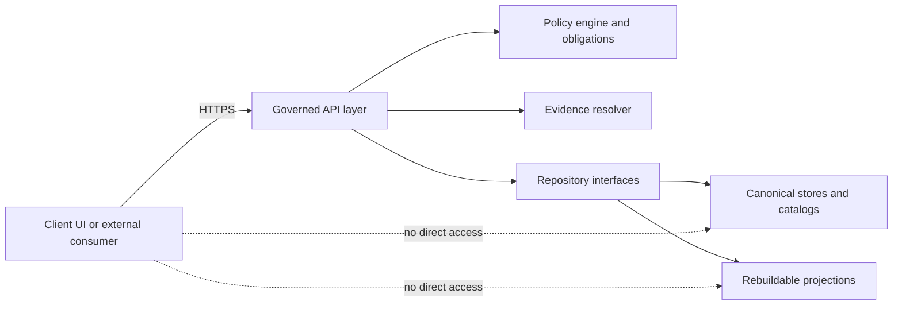
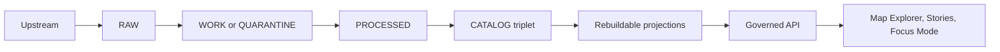
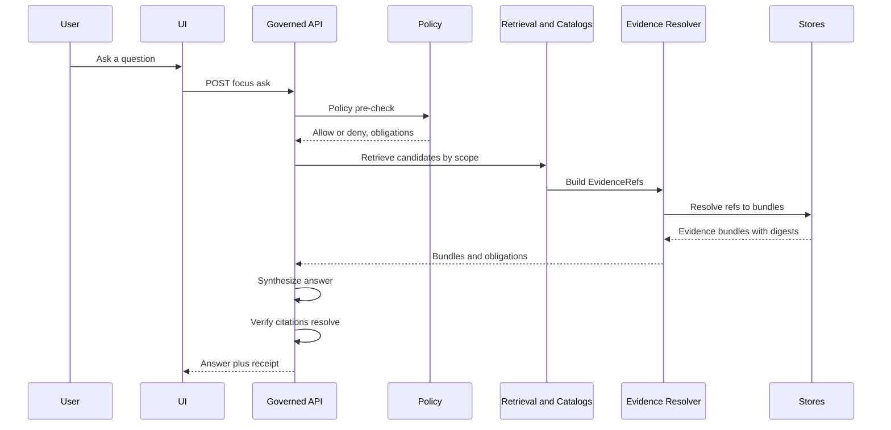

<!-- [KFM_META_BLOCK_V2]
doc_id: kfm://doc/9f55bb43-1cbb-4e1c-a3b8-7d9fa2dd77a2
title: KFM Architecture Overview
type: standard
version: v1
status: draft
owners: KFM Architecture WG
created: 2026-03-01
updated: 2026-03-01
policy_label: restricted
related:
  - TODO: link to the canonical “Definitive Design & Governance Guide (vNext)”
  - TODO: link to the canonical “Tooling the KFM pipeline”
tags: [kfm, architecture, overview]
notes:
  - This overview is evidence-aligned to the KFM vNext sources dated 2026-02-20.
  - IMPORTANT: Verify against repo HEAD before treating any “target module” as implemented.
[/KFM_META_BLOCK_V2] -->


# KFM Architecture Overview

**Purpose:** A map-first, time-aware, evidence-first reference for how Kansas Frontier Matrix (KFM) is *supposed* to work end-to-end: **data → pipelines → catalogs/provenance → governed APIs → Map/Story UI → Focus Mode**.

> [!WARNING]
> This README is an **architecture overview** aligned to vNext design sources. It is *not* a guarantee of what exists in the current repo until verified against the current commit.

---

## Quick navigation

- [What this directory is for](#what-this-directory-is-for)
- [Conventions and claim labels](#conventions-and-claim-labels)
- [At a glance](#at-a-glance)
- [Non-negotiable invariants](#non-negotiable-invariants)
- [Architecture reference model](#architecture-reference-model)
- [Truth path and promotion contract](#truth-path-and-promotion-contract)
- [Runtime surfaces](#runtime-surfaces)
- [Contracts and evidence](#contracts-and-evidence)
- [Anti-patterns](#anti-patterns)
- [Verification checklist](#verification-checklist)
- [References](#references)

---

## What this directory is for

**Where it fits:** `docs/architecture/overview/` is the **entry point** to KFM architecture documentation. It explains *the boundaries*, *the invariants*, and *the end-to-end flow*.

**Acceptable inputs**
- High-level diagrams (truth path, trust membrane, runtime request loops)
- “This is how it works” narrative that maps to contracts/gates
- Pointers to canonical contracts/specs (OpenAPI, schema, policy pack) once verified
- “Unknowns + minimum verification steps” lists (fail closed)

**Exclusions**
- Dataset-specific specs (those belong in dataset registry/spec folders)
- Deep implementation detail, module-by-module walkthroughs (belong in package READMEs / ADRs)
- “Trust me” claims without pointers to evidence, gates, or tests

**Directory tree**
```text
docs/architecture/overview/
  README.md  # you are here
```

[↑ Back to top](#kfm-architecture-overview)

---

## Conventions and claim labels

KFM docs use **truth discipline**:

- **CONFIRMED** — supported by the governing sources and/or repo-verified artifacts
- **PROPOSED** — a build plan or recommended default (needs acceptance + implementation)
- **UNKNOWN** — not verified yet; includes the minimum checks needed to confirm

> [!TIP]
> Prefer “small, reversible increments.” If you can’t prove a claim from artifacts, mark it **UNKNOWN** and add the smallest verification step to turn it into **CONFIRMED**.

[↑ Back to top](#kfm-architecture-overview)

---

## At a glance

KFM is explicitly **not just a map** and **not just a catalog**. It is a governed system where:
- public layers, narrative claims, and AI-assisted answers are **traceable to versioned sources**
- policy is enforced **in CI and at runtime**
- access is mediated by a **trust membrane** (clients don’t touch storage directly)

KFM’s “truth path” is a *real pipeline* (zones + gates), not a metaphor:
- **Upstream → RAW → WORK/QUARANTINE → PROCESSED → CATALOG (DCAT + STAC + PROV + run receipts) → projections → governed API → UI**

[↑ Back to top](#kfm-architecture-overview)

---

## Non-negotiable invariants

These invariants are architectural “must not break” rules. If you violate them, KFM loses its trust guarantees.

| Invariant | What it means in practice | Why it matters | Primary enforcement |
|---|---|---|---|
| **Truth path lifecycle** | Data must move through zoned storage with auditable artifacts and gates | Reproducibility + auditability | CI gates + promotion workflow |
| **Trust membrane** | Clients never access storage/DB directly; all access goes through governed APIs; backend logic uses repository interfaces | Policy + provenance remain enforceable | Network policy + code review + tests |
| **Evidence-first UX** | Every layer/claim opens to evidence (version, license, policy, provenance, checksums) | Trust is visible, not buried | UI acceptance criteria + e2e tests |
| **Cite-or-abstain Focus Mode** | Answers must cite resolvable evidence bundles, or abstain; every query emits a run receipt | Mitigates hallucinations + leakage | Hard citation verification + eval harness |
| **Canonical vs rebuildable stores** | Object store + catalogs/provenance are canonical; indexes/tiles/search DB are rebuildable projections | Operational safety + reindex ability | Rebuild tooling + infra discipline |
| **Deterministic identity/hashing** | Stable dataset/version IDs (e.g., canonical JSON hashing) | Version clarity + stable caching/signing | Golden tests + validators |

> [!IMPORTANT]
> If you are proposing a change that makes *any* of these weaker, treat it as a **breaking architecture change** and require an ADR + explicit sign-off.

[↑ Back to top](#kfm-architecture-overview)

---

## Architecture reference model

### Responsibility layers (posture)

This is a *responsibility* model (not a folder layout). It’s used to keep governance enforceable:

1. **Domain**  
   Stable concepts: `Dataset`, `DatasetVersion`, `EvidenceRef`, `EvidenceBundle`, `StoryNode`, `PolicyLabel`, `RunReceipt`.

2. **Use cases**  
   Workflows: ingest dataset, validate, promote, rebuild projections, serve governed query, publish story, answer focus query.

3. **Interfaces and contracts**  
   Repositories + adapters: catalog readers, evidence resolver, policy engine, storage gateway, search/tiles projection interfaces.

4. **Infrastructure**  
   Storage zones, compute runners, index/tiles rebuild jobs, runtime services, CI gates, observability.

> [!NOTE]
> “Component decomposition” and “deployment topology” may be **PROPOSED** in vNext sources. Treat them as *plans* until confirmed in repo + infra manifests.

### Trust membrane diagram



**Rule:** clients never access storage/DB directly. All policy, redaction, and auditing happens at the governed boundary.

[↑ Back to top](#kfm-architecture-overview)

---

## Truth path and promotion contract

### Zones

KFM zones are storage + validation boundaries:

- **RAW (immutable acquisition):** append-only snapshot of upstream payloads + checksums + license/terms snapshot  
- **WORK / QUARANTINE:** intermediate transforms + QA + candidate redactions; failures are isolated; quarantine blocks promotion  
- **PROCESSED (publishable artifacts):** standardized formats with checksums + derived runtime metadata  
- **CATALOG / Triplet:** cross-linked **DCAT + STAC + PROV** describing metadata, assets, and lineage  
- **PUBLISHED:** governed runtime surfaces (API + UI) serving only promoted versions



### Promotion Contract v1 (minimum gates)

A dataset version **MUST NOT** be promoted unless required artifacts exist and validate.

Checklist summary (names are stable; implementation may vary):

- **Gate A — Identity & versioning:** stable dataset ID + immutable dataset version ID derived from `spec_hash`  
- **Gate B — Licensing & rights:** explicit license and captured attribution/terms snapshot; unclear license fails closed into quarantine  
- **Gate C — Sensitivity & redaction plan:** policy label assigned; obligations recorded; sensitive-location rules enforced  
- **Gate D — Catalog triplet validation:** DCAT/STAC/PROV validate and cross-link; IDs resolvable  
- **Gate E — Run receipts & checksums:** receipts enumerate inputs/outputs and environment; checksums exist  
- **Gate F — Policy + contract tests:** OPA/policy tests pass; API/schema validation passes; evidence resolution works in CI  
- **Gate G — Optional production posture:** SBOM, performance smokes, accessibility smokes, etc.

> [!WARNING]
> “Promotion” is a governed act. If you cannot produce receipts + catalog triplet + rights + policy label, you do **not** have a publishable dataset, regardless of how “useful” it looks.

[↑ Back to top](#kfm-architecture-overview)

---

## Runtime surfaces

KFM exposes governed runtime surfaces designed to make trust visible:

### Map Explorer
- Browse layers and time windows
- Inspect features
- Open the **Evidence Drawer** from anywhere (layer, feature, story citation)

### Story Nodes
- Narrative markdown + sidecar map state (reproducible views)
- Publishing is governed: review state captured + citations must resolve

### Focus Mode
- Governed Q&A treated as a “run”
- Retrieval + evidence bundling + synthesis + **hard citation verification**
- Emits a **run receipt**; abstains or narrows scope if evidence can’t support the answer

#### Focus Mode request loop (conceptual)



[↑ Back to top](#kfm-architecture-overview)

---

## Contracts and evidence

### Evidence is a first-class contract

In KFM, a “citation” is not “a URL pasted into text.”

A citation is an **EvidenceRef** that resolves (via the evidence resolver) into an **EvidenceBundle** containing:
- stable IDs + digests
- dataset version identity
- license/rights and attribution text
- provenance/run receipt references
- artifacts (only if policy allows)
- policy decision + applied obligations

#### EvidenceBundle sketch (illustrative)

```json
{
  "bundle_id": "sha256:...",
  "dataset_version_id": "YYYY-MM.abcd1234",
  "title": "Human-friendly evidence title",
  "policy": {
    "decision": "allow",
    "policy_label": "public",
    "obligations_applied": []
  },
  "license": { "spdx": "CC-BY-4.0", "attribution": "Source org" },
  "provenance": { "run_id": "kfm://run/..." },
  "artifacts": [
    { "href": "processed/example.parquet", "digest": "sha256:...", "media_type": "application/x-parquet" }
  ],
  "audit_ref": "kfm://audit/..."
}
```

> [!IMPORTANT]
> Publishing must be blocked if any citation fails to resolve, or if policy denies access.

### Catalog “triplet”
- **DCAT:** dataset-level metadata (license, publisher, distribution, themes)
- **STAC:** asset-level metadata for spatiotemporal artifacts (collections, items, assets)
- **PROV:** lineage (activities, agents, entities) for how artifacts were created

KFM requires cross-links between these surfaces so EvidenceRefs can be resolved deterministically.

[↑ Back to top](#kfm-architecture-overview)

---

## Anti-patterns

These break the trust membrane or the truth path:

- **Direct client access to storage/DB** (even “read-only”)  
- **Serving unpromoted artifacts** from runtime endpoints  
- **Publishing stories with non-resolvable citations**  
- **Copy-pasting URLs as “citations”** without evidence resolution  
- **Skipping licensing and rights metadata** because “it’s probably fine”  
- **Leaking sensitive locations** (precise archaeology/species sites) when policy requires generalization  
- **Allowing hash drift** (unstable IDs across OS/tool versions)

> [!WARNING]
> If you find any of these, treat it like a production incident: fix, add a regression test, and document the decision.

[↑ Back to top](#kfm-architecture-overview)

---

## Verification checklist

Use this to convert **UNKNOWN → CONFIRMED** with minimal effort.

### Repo verification (minimum steps)
- [ ] Capture repo commit hash and root tree (`git rev-parse HEAD` and `tree -L 3`)
- [ ] Confirm which “target modules” exist (search for spec hashing, policy pack, validators, evidence resolver, dataset registry schema)
- [ ] Extract CI gate list from `.github/workflows` and document what blocks merges
- [ ] Choose **one MVP dataset** and verify full promotion through all gates with receipts + catalogs
- [ ] Verify UI cannot bypass the PEP (static analysis + network policy + runtime config)
- [ ] Run Focus Mode evaluation harness (golden queries) and store diffs as artifacts

### Documentation hygiene
- [ ] Link this overview to the canonical policy + contracts docs once paths are known
- [ ] Ensure diagrams match current implementation (or label them PROPOSED)
- [ ] Add/Update ADRs for any breaking architecture changes

[↑ Back to top](#kfm-architecture-overview)

---

## References

**Primary (normative)**
- TODO: Link the “Definitive Design & Governance Guide (vNext)” (generated 2026-02-20)
- TODO: Link “Tooling the KFM pipeline” (architecture, governance, delivery plan)

**Secondary (implementation-specific, once verified)**
- TODO: OpenAPI contract location
- TODO: Schema registry location
- TODO: Policy pack + tests location
- TODO: Evidence resolver service location

---# Overview

Placeholder for architecture documentation.
