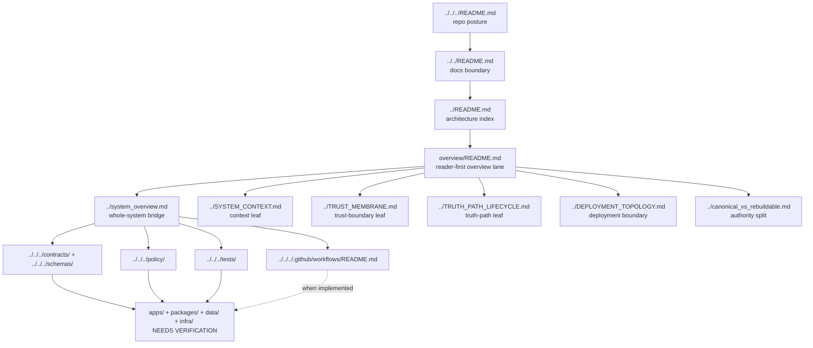

<!-- [KFM_META_BLOCK_V2]
doc_id: kfm://doc/NEEDS_VERIFICATION_UUID
title: Architecture Overview
type: standard
version: v1
status: draft
owners: NEEDS_VERIFICATION
created: YYYY-MM-DD
updated: YYYY-MM-DD
policy_label: public
related: [../README.md, ../system_overview.md, ../SYSTEM_CONTEXT.md, ../TRUST_MEMBRANE.md, ../TRUTH_PATH_LIFECYCLE.md, ../DEPLOYMENT_TOPOLOGY.md, ../canonical_vs_rebuildable.md, ../../../contracts/README.md, ../../../policy/README.md, ../../../tests/README.md]
tags: [kfm, architecture, overview, docs]
notes: [owner/date/doc_id require direct branch verification before merge; active-branch architecture subtree was not directly mounted in this authoring session; current-state claims are intentionally conservative]
[/KFM_META_BLOCK_V2] -->

# Architecture Overview

Reader-first entry point to Kansas Frontier Matrix (KFM): what the system is, how trust moves, and which deeper architecture surfaces to open next.

> **Status:** experimental  
> **Owners:** `NEEDS VERIFICATION` — confirm against [`../../../.github/CODEOWNERS`](../../../.github/CODEOWNERS) before merge  
> **Repo fit:** `docs/architecture/overview/README.md` → upstream [`../README.md`](../README.md), [`../../README.md`](../../README.md), [`../../../README.md`](../../../README.md) · adjacent [`../system_overview.md`](../system_overview.md), [`../SYSTEM_CONTEXT.md`](../SYSTEM_CONTEXT.md), [`../TRUST_MEMBRANE.md`](../TRUST_MEMBRANE.md), [`../TRUTH_PATH_LIFECYCLE.md`](../TRUTH_PATH_LIFECYCLE.md), [`../DEPLOYMENT_TOPOLOGY.md`](../DEPLOYMENT_TOPOLOGY.md), [`../canonical_vs_rebuildable.md`](../canonical_vs_rebuildable.md)  
> 
> 
> 
> 
> 
>   
> **Quick jumps:** [Scope](#scope) · [Repo fit](#repo-fit) · [Accepted inputs](#accepted-inputs) · [Exclusions](#exclusions) · [Authoring-time snapshot](#authoring-time-snapshot) · [Directory tree](#directory-tree) · [Quickstart](#quickstart) · [Usage](#usage) · [Diagram](#diagram) · [Reference tables](#reference-tables) · [Task list / definition of done](#task-list--definition-of-done) · [FAQ](#faq) · [Appendix](#appendix)

> [!IMPORTANT]
> `docs/architecture/overview/` is a summary lane, not a second source of truth. It should reduce entry friction while leaving architecture law in [`../README.md`](../README.md), deeper whole-system detail in [`../system_overview.md`](../system_overview.md), and machine-facing enforcement in [`../../../contracts/`](../../../contracts/), [`../../../schemas/`](../../../schemas/), [`../../../policy/`](../../../policy/), [`../../../tests/`](../../../tests/), and [`../../../.github/workflows/README.md`](../../../.github/workflows/README.md).

## Scope

`docs/architecture/overview/` is the shortest architecture entry lane inside the KFM docs tree.

Its job is to answer three questions quickly:

1. What is KFM, in one stable mental model?
2. Which architecture laws are load-bearing enough that no contributor should bypass them?
3. Which file should a reader open next before changing something consequential?

This README should stay lighter than the deeper architecture leaves it points to. It is a routing surface for whole-system understanding, not the place where every contract, workflow, or runtime detail is restated.

### Truth posture used here

| Marker | Meaning in this README |
|---|---|
| `CONFIRMED` | Directly supported by the attached KFM doctrine corpus or by repo-grounded attached evidence used in this session |
| `INFERRED` | Strongly implied by repeated KFM doctrine and architecture logic, but not directly verified as mounted implementation reality here |
| `PROPOSED` | Recommended wording, structure, path, or next-step guidance consistent with KFM doctrine |
| `UNKNOWN` | Not established strongly enough in this session to present as current fact |
| `NEEDS VERIFICATION` | Exact owner, date, UUID, active-branch file content, or implementation detail should be checked before merge |

### One stable mental model

KFM is best read as a governed spatial evidence system whose value unit is the **inspectable claim**.

| Topic | Working rule |
|---|---|
| System identity | Governed, Kansas-first, map-first, time-aware, evidence-bearing publication system |
| Value unit | Inspectable claim rather than fluent answer, pretty map, or derived layer |
| Canonical lifecycle | `Source edge -> RAW -> WORK / QUARANTINE -> PROCESSED -> CATALOG -> PUBLISHED` |
| Trust boundary | Public and steward surfaces cross governed APIs; they do not directly touch canonical stores or model runtimes |
| Runtime answer posture | Cite or abstain; fail closed; keep negative outcomes visible |
| Shell posture | One time-aware geographic shell with map, timeline, dossier, story, Evidence Drawer, Focus, review, compare, and export as coordinated surfaces |
| 3D posture | 2D default; 3D only when it carries real interpretive burden and inherits the same evidence/policy/correction model |
| Documentation posture | Docs should clarify architecture without outrunning contracts, policy, proof objects, or branch reality |

[Back to top](#architecture-overview)

## Repo fit

| Field | Value |
|---|---|
| Path | `docs/architecture/overview/README.md` |
| Role | Reader-first overview lane for whole-system architecture reading and navigation |
| Primary upstream anchors | [`../README.md`](../README.md), [`../../README.md`](../../README.md), [`../../../README.md`](../../../README.md) |
| Primary companion leaves | [`../system_overview.md`](../system_overview.md), [`../SYSTEM_CONTEXT.md`](../SYSTEM_CONTEXT.md), [`../TRUST_MEMBRANE.md`](../TRUST_MEMBRANE.md), [`../TRUTH_PATH_LIFECYCLE.md`](../TRUTH_PATH_LIFECYCLE.md), [`../DEPLOYMENT_TOPOLOGY.md`](../DEPLOYMENT_TOPOLOGY.md), [`../canonical_vs_rebuildable.md`](../canonical_vs_rebuildable.md) |
| Machine-facing neighbors to re-check before claiming enforcement | [`../../../contracts/README.md`](../../../contracts/README.md), [`../../../schemas/README.md`](../../../schemas/README.md), [`../../../policy/README.md`](../../../policy/README.md), [`../../../tests/README.md`](../../../tests/README.md), [`../../../.github/workflows/README.md`](../../../.github/workflows/README.md) |
| Intended audience | Maintainers, reviewers, contributors, architects, stewards, and technically literate readers entering KFM architecture for the first time |
| Why this file matters | It keeps KFM legible without forcing readers to start from the deepest doctrinal manuals or to mistake placeholder docs for completed implementation |

### Relationship map

This lane sits between **directory navigation** and **deep architecture law**:

- the repo root explains overall project posture
- `docs/README.md` explains the documentation boundary
- `docs/architecture/README.md` should act as the subtree index and maturity guide
- `docs/architecture/overview/README.md` gives the short whole-system reading path
- deeper architecture leaves should own narrowed topics
- machine-facing proof still lives outside this lane in contracts, schemas, policy, tests, and workflows

[Back to top](#architecture-overview)

## Accepted inputs

Content that belongs here includes:

- concise whole-system summaries
- architecture reading guides
- overview diagrams that connect truth path, trust membrane, shell surfaces, and proof surfaces
- conservative maturity notes when documentation and implementation depth differ
- crosswalks to deeper architecture leaves
- short reference tables that help readers choose the next file to open
- authoring-time caveats that prevent overview prose from becoming trust theater

## Exclusions

The following do **not** belong here as their authoritative home:

| Do not put this here | Keep it instead |
|---|---|
| Policy rule bodies, deny-by-default logic, reason/obligation definitions, decision tests | [`../../../policy/`](../../../policy/) |
| Canonical OpenAPI, JSON Schema, standards profiles, contract examples, fixture inventories | [`../../../contracts/`](../../../contracts/) and [`../../../schemas/`](../../../schemas/) |
| Runtime code, adapters, service behavior, UI component internals | owning code lanes under the repo root |
| Workflow YAML, deployment manifests, systemd/Kubernetes overlays presented as already mounted fact | runtime / infra surfaces plus direct branch verification |
| Live proof objects, release packs, receipts, audit payloads, correction traces | governed release, runtime, and evidence lanes |
| Detailed topic law that already belongs in a narrower architecture leaf | the relevant leaf under `docs/architecture/` |
| Confident prose that upgrades a likely path or future artifact into current implementation reality | keep it `INFERRED`, `PROPOSED`, `UNKNOWN`, or `NEEDS VERIFICATION` |

> [!NOTE]
> This overview may explain KFM architecture. It must not silently replace the contract, policy, test, or release artifact that actually governs behavior.

## Authoring-time snapshot

This section is intentionally conservative. It captures what the attached doctrine and repo-grounded evidence support in this session, plus the explicit target-path context of this task.

| Surface | Status | What can be said safely | Working use |
|---|---|---|---|
| `docs/architecture/overview/README.md` | `NEEDS VERIFICATION` | The task context exposes this lane as an overview README that needs substantive reader-first content | treat this revision as the intended overview lane, then recheck active-branch content before merge |
| [`../../../contracts/README.md`](../../../contracts/README.md) + [`../../../schemas/README.md`](../../../schemas/README.md) | `CONFIRMED` | Contracts and schemas exist as documented repo surfaces | point readers here for machine-facing authority; do not imply a verified live schema inventory |
| [`../../../policy/README.md`](../../../policy/README.md) + [`../../../tests/README.md`](../../../tests/README.md) | `CONFIRMED` | Policy and tests exist as README-first governance surfaces | point here for policy/test intent; do not imply mounted Rego bundles or runnable suites |
| [`../../../.github/CODEOWNERS`](../../../.github/CODEOWNERS), [`../../../.github/PULL_REQUEST_TEMPLATE.md`](../../../.github/PULL_REQUEST_TEMPLATE.md), [`../../../.github/workflows/README.md`](../../../.github/workflows/README.md) | `CONFIRMED` | Governance scaffolding and a workflows README exist | use them as review and CI pointers; do not imply active merge-blocking YAML gates without branch recheck |
| Companion architecture leaves listed in this file | `NEEDS VERIFICATION` | The target brief names them as adjacent architecture surfaces | resolve and inspect each leaf before describing its depth or maturity |
| Real `.json` schemas, `.rego` bundles, runnable fixtures, release proof packs, runtime envelope examples, workflow YAML merge gates | `UNKNOWN` | This session did not directly verify them as mounted implementation artifacts | overview prose should not describe them as already real |

> [!CAUTION]
> The easiest way to damage this file is to let it sound more implemented than the evidence allows. The overview should clarify KFM, not improvise missing repo reality.

[Back to top](#architecture-overview)

## Directory tree

> [!WARNING]
> The trees below reflect the target path, the user-supplied related links, and repo-grounded README surfaces. Recheck the active branch before treating them as a verified live tree.

### Target lane

```text
docs/architecture/overview/
└── README.md
```

### Expected adjacent architecture surfaces

```text
docs/architecture/
├── README.md
├── system_overview.md
├── SYSTEM_CONTEXT.md
├── TRUST_MEMBRANE.md
├── TRUTH_PATH_LIFECYCLE.md
├── DEPLOYMENT_TOPOLOGY.md
├── canonical_vs_rebuildable.md
├── decisions/
│   └── README.md
├── diagrams/
│   └── README.md
└── interfaces/
    └── README.md
```

### Machine-facing neighbors that should anchor stronger claims

```text
.
├── contracts/
│   └── README.md
├── schemas/
│   └── README.md
├── policy/
│   └── README.md
├── tests/
│   └── README.md
└── .github/
    ├── CODEOWNERS
    ├── PULL_REQUEST_TEMPLATE.md
    └── workflows/
        └── README.md
```

### Interpretation rule

- a path reservation is not the same as a mature architecture leaf
- a README surface is not the same as an executable inventory
- this lane should route readers to the right authority, not flatten all authorities into one page
- when a deeper leaf becomes substantive, this overview should point to it and stop duplicating its job

## Quickstart

Use a verification-first loop before editing this lane again.

```bash
# 1) Recheck architecture and neighboring governance surfaces
git ls-files \
  'docs/architecture/**' \
  'contracts/**' \
  'schemas/**' \
  'policy/**' \
  'tests/**' \
  '.github/**' | sort

# 2) Re-open the short architecture entry surfaces first
sed -n '1,240p' docs/architecture/overview/README.md
sed -n '1,260p' docs/architecture/README.md
sed -n '1,260p' docs/architecture/system_overview.md

# 3) Re-open machine-facing neighbors before upgrading confidence
for f in \
  contracts/README.md \
  schemas/README.md \
  policy/README.md \
  tests/README.md \
  .github/workflows/README.md
do
  printf '\n=== %s ===\n' "$f"
  sed -n '1,220p' "$f"
done

# 4) Pressure-test doctrinal vocabulary and trust terms
grep -RIn \
  "trust membrane\|EvidenceBundle\|RuntimeResponseEnvelope\|cite-or-abstain\|fail-closed\|Evidence Drawer" \
  docs contracts schemas policy tests apps packages 2>/dev/null || true
```

> [!WARNING]
> These commands are the right next checks in a mounted checkout. They are not evidence that every path above was directly inspected in this authoring session.

## Usage

### Reading order for reviewers

1. Read this file for the shortest stable picture.
2. Read [`../README.md`](../README.md) for architecture subtree boundary and maturity rules.
3. Read [`../system_overview.md`](../system_overview.md) for the deeper whole-system bridge.
4. Open narrower leaves only when the question has narrowed enough to justify them.
5. When a claim sounds enforceable, re-check [`../../../contracts/`](../../../contracts/), [`../../../schemas/`](../../../schemas/), [`../../../policy/`](../../../policy/), [`../../../tests/`](../../../tests/), and [`../../../.github/workflows/README.md`](../../../.github/workflows/README.md).

### Reading order for authors

1. Verify the live subtree you are about to change.
2. Decide whether the change belongs in this overview lane, a deeper architecture leaf, or a machine-facing surface outside `docs/`.
3. Keep repo-shape and maturity claims conservative unless the active branch proves them.
4. Update links, tables, and diagrams when path shape or terminology changes.
5. If the change affects behavior, trust state, or release posture, move docs, contracts, policy, tests, and runbooks together.

### When to use this file versus other leaves

| If your question is… | Open first | Why |
|---|---|---|
| “What is KFM in one page?” | this file | shortest stable summary |
| “What are the architecture rules?” | [`../README.md`](../README.md) | subtree law and navigation |
| “How does the whole system hang together?” | [`../system_overview.md`](../system_overview.md) | deeper bridge across lifecycle, routes, and shell |
| “What is actually enforceable?” | contracts / schemas / policy / tests / workflows | overview prose is not enforcement |
| “Where do Focus, Evidence Drawer, and trust-visible shell behavior live?” | this file, then UI/architecture leaves | overview first, then narrowed shell doctrine |
| “Can I claim this path is implemented today?” | machine-facing neighbors plus active-branch inspection | branch reality outranks plausible prose |

[Back to top](#architecture-overview)

## Diagram


```mermaid
flowchart TB
  Root["../../../README.md<br/>repo posture"] --> Docs["../../README.md<br/>docs boundary"]
  Docs --> Arch["../README.md<br/>architecture index"]
  Arch --> Overview["overview/README.md<br/>reader-first overview lane"]

  Overview --> Sys["../system_overview.md<br/>whole-system bridge"]
  Overview --> Context["../SYSTEM_CONTEXT.md<br/>context leaf"]
  Overview --> Membrane["../TRUST_MEMBRANE.md<br/>trust-boundary leaf"]
  Overview --> Path["../TRUTH_PATH_LIFECYCLE.md<br/>truth-path leaf"]
  Overview --> Topology["../DEPLOYMENT_TOPOLOGY.md<br/>deployment boundary"]
  Overview --> Canon["../canonical_vs_rebuildable.md<br/>authority split"]

  Sys --> Contracts["../../../contracts/ + ../../../schemas/"]
  Sys --> Policy["../../../policy/"]
  Sys --> Tests["../../../tests/"]
  Sys --> Workflows["../../../.github/workflows/README.md"]

  Contracts --> Runtime["apps/ + packages/ + data/ + infra/ <br/>NEEDS VERIFICATION"]
  Policy --> Runtime
  Tests --> Runtime
  Workflows -. when implemented .-> Runtime
```

This lane is intentionally a **bridge**. It should lower entry friction without collapsing the distinction between overview prose, deeper architecture law, and machine-facing proof.

## Reference tables

### Architecture laws this overview keeps visible

| Law | Minimum implication for this lane |
|---|---|
| Truth path | Preserve `Source edge -> RAW -> WORK / QUARANTINE -> PROCESSED -> CATALOG -> PUBLISHED` in every whole-system summary |
| Trust membrane | Never imply direct client access to canonical stores or model runtimes |
| Authoritative vs derived | Graph/search/vector/tile/scene/cache/summary layers stay subordinate unless explicitly promoted |
| Cite-or-abstain posture | Runtime claims remain evidence-bounded rather than fluency-bounded |
| Fail-closed posture | Missing evidence, rights uncertainty, or policy mismatch should narrow trust state rather than be hidden |
| Map-first, time-aware shell | Geography and chronology stay first-class across UI and documentation |
| 2D default / 3D burden | 3D must justify its burden and inherit the same trust model |
| Docs as production surface | Behavior-significant changes should move with related docs, contracts, policy, tests, and runbooks |

### Overview lane map

| Surface | Role | Status signal to use here | Use when |
|---|---|---|---|
| this file | shortest architecture entry surface | substantive by design, conservative by evidence | you need the system in one pass |
| [`../README.md`](../README.md) | architecture subtree law and navigation | recheck on active branch | you need boundary rules and doc placement logic |
| [`../system_overview.md`](../system_overview.md) | deeper whole-system bridge | recheck on active branch | you need broader architecture explanation |
| companion leaves | narrowed topic ownership | varies; recheck before describing | the question is specific enough to justify a leaf |
| machine-facing lanes | proof, contracts, policy, tests, workflows | strongest for executable claims | the question is “what is actually mounted or enforceable?” |

### Change-impact matrix

| Change type | Examples | Coordinated updates |
|---|---|---|
| overview wording change | renamed lane, revised mental model, changed reading path | this file, [`../README.md`](../README.md), possibly [`../../README.md`](../../README.md) |
| doctrinal architecture change | trust membrane, lifecycle, authority split, shell law | deeper architecture docs plus contracts, policy, tests, and runbooks |
| maturity-state change | scaffold promoted, stale link removed, new leaf added | snapshot table, trees, quickstart, FAQ |
| enforcement-sensitive claim | runtime outcome, route family, merge gate, proof pack | machine-facing surfaces must be re-opened before upgrading confidence |
| metadata change | owners, dates, UUID, policy label | KFM meta block plus any matching doc registry or template surface |

[Back to top](#architecture-overview)

## Task list / definition of done

### Highest-value next tasks

- keep this overview aligned with the governing architecture index and whole-system bridge
- replace or reconcile scaffold-thin companion leaves once their live branch content is verified
- confirm owner metadata, `doc_id`, and dates against actual repo records before merge
- keep overview claims synchronized with contracts, policy, tests, and workflow reality
- make trust-visible shell concepts easier to cross-link without duplicating the UI doctrine
- keep architecture tree blocks conservative unless the active branch proves more

### Definition of done for this file

This file is in good standing when:

- all path and maturity claims are either directly rechecked or explicitly labeled
- overview prose does not outrun contracts, policy, tests, or workflow evidence
- the diagram and tables still match the active branch closely enough to be useful
- companion links resolve, or unresolved links are caught before merge
- owners, dates, and `doc_id` are synchronized with real repo records
- the overview remains shorter and more legible than the deeper leaves it points to
- no section quietly upgrades a target-state idea into present implementation fact

## FAQ

### Why does this lane exist if a deeper system overview also exists?

Because the architecture subtree benefits from two different entry depths:

- this file is the shortest stable overview
- the deeper whole-system bridge should carry more detail

They should complement each other, not compete.

### Is this file architecture law?

Not by itself.

It is a routing surface. Use it to enter the architecture safely, then step into the narrower leaf or machine-facing surface that actually owns the question.

### Can this file claim route inventories, merge gates, or runtime behavior as already implemented?

Only when the active branch was rechecked directly. Overview prose must stay conservative when proof remains README-first, PDF-only, or otherwise unverified.

### What is the smallest stable mental model for KFM?

Use these together:

1. the truth path
2. the trust membrane
3. the authoritative-versus-derived split
4. the map-first, time-aware shell
5. evidence-bounded runtime outcomes

If a proposal breaks one of those, it is probably bending KFM in the wrong direction.

### Why keep saying “NEEDS VERIFICATION”?

Because overview docs are part of the trust surface. In KFM, honest incompleteness is preferable to polished overclaiming.

[Back to top](#architecture-overview)

## Appendix

<details>
<summary>Source basis, maintenance rule, and editing stance</summary>

### Source basis used for this overview lane

This README is intentionally grounded in two evidence classes:

1. **attached KFM doctrinal architecture corpus**
   - central replacement-grade KFM manuals
   - geospatial architecture and UI/shell doctrine
   - domain/source atlas and verification overlays

2. **attached repo-grounded current-state evidence**
   - repo-grounded deep research sprint material describing what was and was not confirmed in the public repo at authoring time

### Maintenance rule

Revise this file whenever any of the following changes:

- architecture subtree shape
- KFM’s central mental model
- shell surface naming or trust-visible behavior
- contract-family framing that changes what “overview” must point toward
- companion-leaf maturity
- branch evidence that upgrades a current `UNKNOWN` or `NEEDS VERIFICATION`

### Editing stance

When in doubt:

- keep the overview shorter
- keep the truth posture narrower
- link outward instead of pretending to own everything
- verify the branch before upgrading confidence
- treat repo reality as stronger than elegant prose

</details>