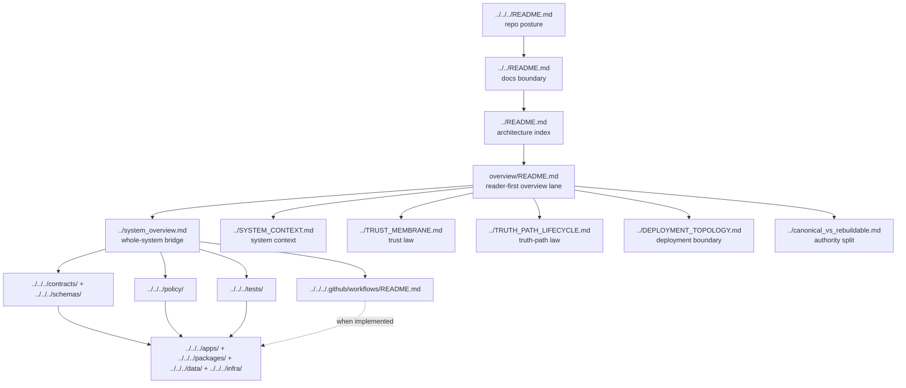

<!-- [KFM_META_BLOCK_V2]
doc_id: kfm://doc/NEEDS_VERIFICATION_UUID
title: Architecture Overview
type: standard
version: v1
status: draft
owners: NEEDS_VERIFICATION
created: YYYY-MM-DD
updated: YYYY-MM-DD
policy_label: public
related: [../README.md, ../system_overview.md, ../SYSTEM_CONTEXT.md, ../TRUST_MEMBRANE.md, ../TRUTH_PATH_LIFECYCLE.md, ../DEPLOYMENT_TOPOLOGY.md, ../canonical_vs_rebuildable.md, ../../../contracts/README.md, ../../../policy/README.md, ../../../tests/README.md]
tags: [kfm, architecture, overview, docs]
notes: [current public main exposed this lane as scaffold-only at authoring time; owner/date/doc_id require direct branch verification before merge]
[/KFM_META_BLOCK_V2] -->

# Architecture Overview

Reader-first summary lane for Kansas Frontier Matrix (KFM): what the system is, how trust state moves, and which deeper architecture surfaces to open next.

> Status: experimental
>  
> Owners: `NEEDS VERIFICATION` — sibling architecture docs on current public `main` use `@bartytime4life`; confirm against [`../../../.github/CODEOWNERS`](../../../.github/CODEOWNERS) before merge
>  
> Repo fit: `docs/architecture/overview/README.md` → upstream [`../README.md`](../README.md), [`../../README.md`](../../README.md), [`../../../README.md`](../../../README.md) · adjacent [`../system_overview.md`](../system_overview.md), [`../SYSTEM_CONTEXT.md`](../SYSTEM_CONTEXT.md), [`../TRUST_MEMBRANE.md`](../TRUST_MEMBRANE.md), [`../TRUTH_PATH_LIFECYCLE.md`](../TRUTH_PATH_LIFECYCLE.md), [`../DEPLOYMENT_TOPOLOGY.md`](../DEPLOYMENT_TOPOLOGY.md), [`../canonical_vs_rebuildable.md`](../canonical_vs_rebuildable.md)
>  
> 
> 
> 
> 
> 
> 
>  
> Quick jumps: [Scope](#scope) · [Repo fit](#repo-fit) · [Accepted inputs](#accepted-inputs) · [Exclusions](#exclusions) · [Current public-main snapshot](#current-public-main-snapshot) · [Directory tree](#directory-tree) · [Quickstart](#quickstart) · [Usage](#usage) · [Diagram](#diagram) · [Reference tables](#reference-tables) · [Task list / definition of done](#task-list--definition-of-done) · [FAQ](#faq) · [Appendix](#appendix)

> [!IMPORTANT]
> `docs/architecture/overview/` is a summary lane, not a second source of truth. It should make KFM easier to enter while keeping architecture law in [`../README.md`](../README.md), whole-system detail in [`../system_overview.md`](../system_overview.md), and machine-enforced behavior in [`../../../contracts/`](../../../contracts/), [`../../../schemas/`](../../../schemas/), [`../../../policy/`](../../../policy/), [`../../../tests/`](../../../tests/), and [`../../../.github/workflows/README.md`](../../../.github/workflows/README.md).

## Scope

`docs/architecture/overview/` is the reader-first entry point inside the architecture subtree.

Its job is to answer three questions quickly:

1. What is KFM, in one stable mental model?
2. Which architecture files are already useful today, and which are still scaffold-level?
3. Where should a contributor go next before changing something consequential?

This README should stay shorter and more legible than the deeper architecture leaves. It is a routing surface for whole-system understanding, not the place where every law is restated in full.

### Truth posture used here

| Marker | Meaning in this README |
|---|---|
| `CONFIRMED` | Directly supported by current public-repo inspection or repeated March 2026 KFM doctrine |
| `INFERRED` | Strongly suggested by adjacent repo docs or repeated doctrine, but not re-opened deeply enough here to claim full implementation maturity |
| `PROPOSED` | Repo-ready wording, organization, or next-step guidance that fits doctrine but is not proven as mounted implementation reality |
| `UNKNOWN` | Not established strongly enough to present as current fact |
| `NEEDS VERIFICATION` | Exact owner, date, label, workflow, or mounted-runtime detail should be checked before merge |

### One stable mental model

KFM is best read as a governed spatial evidence system whose primary value unit is the **inspectable claim**.

| Topic | Working rule |
|---|---|
| System identity | Governed, map-first, time-aware spatial evidence system |
| Value unit | The inspectable claim, not merely a layer, dashboard, export, or fluent answer |
| Canonical lifecycle | `Source edge -> RAW -> WORK / QUARANTINE -> PROCESSED -> CATALOG -> PUBLISHED` |
| Trust boundary | Public and steward surfaces cross governed APIs; they do not directly touch canonical stores or model runtimes |
| Runtime answer posture | Cite or abstain; fail closed; keep negative outcomes visible |
| Shell posture | One map-first, time-aware operating shell with evidence drill-through and correction-visible state |
| 3D posture | 2D default; 3D is conditional and burden-bearing |
| Documentation posture | Docs move with behavior-significant changes; prose must not outrun enforcement |

[Back to top](#architecture-overview)

## Repo fit

| Field | Value |
|---|---|
| Path | `docs/architecture/overview/README.md` |
| Role | Reader-first overview lane for whole-system architecture reading and navigation |
| Primary upstream anchors | [`../README.md`](../README.md), [`../../README.md`](../../README.md), [`../../../README.md`](../../../README.md) |
| Primary companion leaves | [`../system_overview.md`](../system_overview.md), [`../SYSTEM_CONTEXT.md`](../SYSTEM_CONTEXT.md), [`../TRUST_MEMBRANE.md`](../TRUST_MEMBRANE.md), [`../TRUTH_PATH_LIFECYCLE.md`](../TRUTH_PATH_LIFECYCLE.md), [`../DEPLOYMENT_TOPOLOGY.md`](../DEPLOYMENT_TOPOLOGY.md), [`../canonical_vs_rebuildable.md`](../canonical_vs_rebuildable.md) |
| Machine-facing neighbors to re-check before claiming enforcement | [`../../../contracts/README.md`](../../../contracts/README.md), [`../../../schemas/README.md`](../../../schemas/README.md), [`../../../policy/README.md`](../../../policy/README.md), [`../../../tests/README.md`](../../../tests/README.md), [`../../../.github/workflows/README.md`](../../../.github/workflows/README.md) |
| Current public-main posture | This lane existed, but the directly fetched file was scaffold-only; this revision turns it into a substantive overview surface |
| Why this file matters | It keeps the architecture legible without forcing reviewers to start at the deepest law files or quietly treating placeholders as completed architecture |

### Relationship map

This lane sits between **directory-level navigation** and **deeper architecture law**:

- the repo root explains project identity and whole-repo posture
- `docs/README.md` explains the documentation boundary
- `docs/architecture/README.md` explains architecture subtree law and maturity
- `docs/architecture/overview/README.md` gives the short whole-system reading path
- `docs/architecture/system_overview.md` carries the deeper high-level bridge
- machine-facing proof still lives outside this lane in contracts, schemas, policy, tests, and workflows

[Back to top](#architecture-overview)

## Accepted inputs

Content that belongs in this lane includes:

- high-level architecture summaries and entry-point reading guides
- concise whole-system maps that connect truth path, trust membrane, repo lanes, and public surfaces
- reader-first crosswalks to deeper architecture files
- architecture overview diagrams that clarify sequence, responsibility, and boundaries
- current public-main maturity notes when they materially affect safe documentation
- short tables that help reviewers decide which file to open next
- conservative status notes for scaffold-first versus substantive leaves
- explanation of how architecture docs relate to machine-facing governance surfaces

## Exclusions

The following do **not** belong here as their authoritative home:

| Do not put this here | Keep it instead |
|---|---|
| Policy rule bodies, deny-by-default logic, obligation fixtures, runtime decision code | [`../../../policy/`](../../../policy/) |
| Canonical OpenAPI, JSON Schemas, shared vocabularies, runtime envelope definitions | [`../../../contracts/`](../../../contracts/) and [`../../../schemas/`](../../../schemas/) |
| Runtime code, worker logic, UI components, adapters, service-local behavior | owning code lanes under the repo root |
| Deployment manifests, ingress overlays, secrets posture presented as verified fact | runtime / infra surfaces plus direct mounted evidence |
| Proof objects, manifests, receipts, release artifacts as live operational outputs | governed data / release / evidence surfaces |
| Service-local tutorials or route-by-route implementation notes | service-local docs or runbooks |
| Prose that upgrades a plausible folder name into “already implemented” reality | keep it explicitly `INFERRED`, `PROPOSED`, `UNKNOWN`, or `NEEDS VERIFICATION` |

> [!NOTE]
> This lane may explain architecture. It must not silently replace the contract, policy, or test artifact that actually governs behavior.

## Current public-main snapshot

This section is here for one reason: to prevent overview prose from outrunning the branch.

| Surface | Status | Current reading | Working use today |
|---|---|---|---|
| `docs/architecture/overview/README.md` | `CONFIRMED` | directly fetched as scaffold-only before this revision | this revision promotes the lane into a substantive overview surface |
| [`../README.md`](../README.md) | `CONFIRMED` | substantive architecture index and maturity guide | start here for subtree law and boundary reading |
| [`../system_overview.md`](../system_overview.md) | `CONFIRMED` | substantive high-level bridge | use when you need truth path, five-plane view, and repo-lane mapping |
| [`../SYSTEM_CONTEXT.md`](../SYSTEM_CONTEXT.md), [`../TRUST_MEMBRANE.md`](../TRUST_MEMBRANE.md), [`../TRUTH_PATH_LIFECYCLE.md`](../TRUTH_PATH_LIFECYCLE.md), [`../DEPLOYMENT_TOPOLOGY.md`](../DEPLOYMENT_TOPOLOGY.md), [`../canonical_vs_rebuildable.md`](../canonical_vs_rebuildable.md) | `CONFIRMED` | present but scaffold-first | keep deeper claims bounded until those leaves are filled |
| [`../../../.github/workflows/README.md`](../../../.github/workflows/README.md) | `CONFIRMED` | README-only at last public-main check | do not describe merge-blocking YAML as already present without recheck |
| [`../../../contracts/README.md`](../../../contracts/README.md) + [`../../../schemas/README.md`](../../../schemas/README.md) | `CONFIRMED` | documented machine-facing lanes; authority split still matters | point to them without pretending the lattice is already fully executable |
| [`../../../policy/README.md`](../../../policy/README.md) + [`../../../tests/README.md`](../../../tests/README.md) | `CONFIRMED` | documented governance and proof surfaces | behavior-significant overview changes should still name policy and proof burden |

> [!CAUTION]
> The highest-risk failure for this file is **trust theater**: a confident summary that sounds more complete than the checked branch actually is.

[Back to top](#architecture-overview)

## Directory tree

### Current directly fetched lane

```text
docs/architecture/overview/
└── README.md
```

### Closest overview neighbors

```text
docs/architecture/
├── README.md
├── system_overview.md
├── SYSTEM_CONTEXT.md
├── TRUST_MEMBRANE.md
├── TRUTH_PATH_LIFECYCLE.md
├── DEPLOYMENT_TOPOLOGY.md
├── canonical_vs_rebuildable.md
├── decisions/
│   └── README.md
├── diagrams/
│   └── README.md
└── interfaces/
    └── README.md
```

### Working interpretation rule

- a directly fetched scaffold file is a **real path reservation**, not a completed architecture document
- a deeper companion file may exist and still remain **non-authoritative in content depth**
- this overview lane should **route** readers toward the right file, not flatten all files into one
- if a sibling leaf becomes substantive, this README should point to it and stop duplicating its job

## Quickstart

Use a verification-first loop before editing this lane again.

```bash
# 1) Re-check the overview lane and nearby architecture subtree
find docs/architecture/overview docs/architecture -maxdepth 3 \( -type f -o -type d \) | sort

# 2) Re-open the summary surfaces first
sed -n '1,220p' docs/architecture/overview/README.md
sed -n '1,260p' docs/architecture/README.md
sed -n '1,260p' docs/architecture/system_overview.md

# 3) Inspect companion leaves for scaffold-vs-substantive status
for f in \
  docs/architecture/SYSTEM_CONTEXT.md \
  docs/architecture/TRUST_MEMBRANE.md \
  docs/architecture/TRUTH_PATH_LIFECYCLE.md \
  docs/architecture/DEPLOYMENT_TOPOLOGY.md \
  docs/architecture/canonical_vs_rebuildable.md
do
  printf '\n=== %s ===\n' "$f"
  sed -n '1,120p' "$f"
done

# 4) Re-check machine-facing neighbors before claiming enforcement
sed -n '1,220p' contracts/README.md
sed -n '1,220p' schemas/README.md
sed -n '1,220p' policy/README.md
sed -n '1,220p' tests/README.md
sed -n '1,220p' .github/workflows/README.md

# 5) Pressure-test vocabulary drift
grep -RIn "trust membrane\|EvidenceBundle\|RuntimeResponseEnvelope\|cite-or-abstain\|fail-closed" \
  docs contracts schemas policy tests apps packages 2>/dev/null || true
```

> [!WARNING]
> These commands are the right **next verification steps** in a mounted checkout. They are not proof that every path or implementation detail was directly inspected in the workspace used to draft this README.

## Usage

### Reading order for reviewers

1. Read this file for the short whole-system picture.
2. Read [`../README.md`](../README.md) for subtree boundary law and maturity rules.
3. Read [`../system_overview.md`](../system_overview.md) for the deeper architecture bridge.
4. Open companion leaves only when the question has narrowed:
   - context → [`../SYSTEM_CONTEXT.md`](../SYSTEM_CONTEXT.md)
   - trust boundary → [`../TRUST_MEMBRANE.md`](../TRUST_MEMBRANE.md)
   - lifecycle law → [`../TRUTH_PATH_LIFECYCLE.md`](../TRUTH_PATH_LIFECYCLE.md)
   - deployment boundary → [`../DEPLOYMENT_TOPOLOGY.md`](../DEPLOYMENT_TOPOLOGY.md)
   - authority split → [`../canonical_vs_rebuildable.md`](../canonical_vs_rebuildable.md)
5. When a claim sounds enforceable, re-check [`../../../contracts/`](../../../contracts/), [`../../../policy/`](../../../policy/), [`../../../tests/`](../../../tests/), and [`../../../.github/workflows/README.md`](../../../.github/workflows/README.md).

### Reading order for authors

1. Verify the live subtree you are about to change.
2. Decide whether the change belongs in:
   - this reader-first overview lane
   - the architecture directory index
   - a deeper architecture leaf
   - a machine-facing surface outside `docs/`
3. Keep tree and maturity claims conservative unless the active branch proves them.
4. Update links, tables, and diagrams when path shape changes.
5. If the change affects behavior, trust state, or release posture, move docs, contracts, policy, tests, and workflow notes together.

### When to use this file versus other leaves

| If your question is… | Open first | Why |
|---|---|---|
| “What is KFM in one page?” | this file | shortest stable summary |
| “How does the architecture subtree work?” | [`../README.md`](../README.md) | directory law, maturity, and path rules |
| “What is the whole-system architecture?” | [`../system_overview.md`](../system_overview.md) | truth path, five-plane view, repo lanes |
| “What is the runtime/public request path?” | [`../system_overview.md`](../system_overview.md) then machine-facing neighbors | bridge first, proof second |
| “What is actually enforced today?” | contracts / schemas / policy / tests / workflows | overview prose is not enforcement |
| “Can I promote a scaffold path into authority?” | this file and [`../README.md`](../README.md) | both lanes must stay explicit about maturity |

[Back to top](#architecture-overview)

## Diagram


```mermaid
flowchart TB
  Root["../../../README.md<br/>repo posture"] --> Docs["../../README.md<br/>docs boundary"]
  Docs --> Arch["../README.md<br/>architecture index"]
  Arch --> Overview["overview/README.md<br/>reader-first overview lane"]

  Overview --> Sys["../system_overview.md<br/>whole-system bridge"]
  Overview --> Ctx["../SYSTEM_CONTEXT.md<br/>system context"]
  Overview --> Mem["../TRUST_MEMBRANE.md<br/>trust law"]
  Overview --> Path["../TRUTH_PATH_LIFECYCLE.md<br/>truth-path law"]
  Overview --> Topo["../DEPLOYMENT_TOPOLOGY.md<br/>deployment boundary"]
  Overview --> Canon["../canonical_vs_rebuildable.md<br/>authority split"]

  Sys --> Contracts["../../../contracts/ + ../../../schemas/"]
  Sys --> Policy["../../../policy/"]
  Sys --> Tests["../../../tests/"]
  Sys --> Workflows["../../../.github/workflows/README.md"]

  Contracts --> Runtime["../../../apps/ + ../../../packages/ + ../../../data/ + ../../../infra/"]
  Policy --> Runtime
  Tests --> Runtime
  Workflows -. when implemented .-> Runtime
```

This lane is intentionally positioned as a **reading bridge**. It should reduce entry friction without collapsing the distinction between overview prose, deeper architecture law, and machine-facing enforcement.

## Reference tables

### KFM architecture laws this overview keeps visible

| Law | Minimum implication for this lane |
|---|---|
| Trust membrane | overview prose should never imply direct client access to stores or model runtimes |
| Truth path | every system summary should preserve the lifecycle order `Source edge -> RAW -> WORK / QUARANTINE -> PROCESSED -> CATALOG -> PUBLISHED` |
| Authoritative vs derived | tiles, graphs, scenes, summaries, and indexes stay subordinate to stronger release-linked authority |
| Cite-or-abstain | claim-bearing runtime behavior is evidence-bounded, not fluency-bounded |
| Fail-closed posture | broken evidence, rights ambiguity, or missing policy should narrow trust state, not be smoothed over |
| Map-first, time-aware shell | place and chronology remain first-class, not side panels added after the fact |
| Placeholder honesty | scaffold files stay visibly scaffold-level until replaced with substantive content |
| Docs as production surface | behavior-significant changes move with related docs, contracts, policy, tests, and runbooks |

### Overview leaf map

| Surface | Role | Current signal | Use when |
|---|---|---|---|
| this file | shortest architecture entry surface | substantive after this revision | you need the system in one pass |
| [`../README.md`](../README.md) | architecture subtree law and navigation | substantive | you need boundary rules and maturity handling |
| [`../system_overview.md`](../system_overview.md) | deeper whole-system bridge | substantive | you need five-plane view, repo surface map, request path |
| companion leaf docs | narrowed architecture topics | scaffold-first unless later filled | your question is specific enough to justify a deeper file |
| machine-facing lanes | enforcement and proof | outside this lane | the question is “what is actually executable?” |

### Change-impact matrix

| Change type | Examples | Coordinated updates |
|---|---|---|
| overview wording change | new top-level mental model, renamed lane, changed reading path | this file, [`../README.md`](../README.md), possibly [`../../README.md`](../../README.md) |
| architecture law change | trust membrane, lifecycle rule, authoritative-vs-derived rule | deeper architecture leaves, contracts, policy, tests, runbooks |
| maturity-state change | scaffold promoted to substantive, new lane added, stale link removed | tree blocks, snapshot table, quickstart, task list |
| enforcement-sensitive claim | runtime outcomes, route families, merge gates | machine-facing surfaces must be re-opened before the claim is upgraded |
| ownership/metadata change | owners, dates, doc UUID, policy label | KFM meta block plus sibling architecture metadata where relevant |

[Back to top](#architecture-overview)

## Task list / definition of done

### Highest-value next tasks

- keep this overview lane aligned with [`../README.md`](../README.md) and [`../system_overview.md`](../system_overview.md)
- replace or reconcile the remaining scaffold-first companion leaves under `docs/architecture/`
- resolve any duplicate trust-membrane leaf naming into one clearly canonical path
- re-check [`../../../.github/workflows/README.md`](../../../.github/workflows/README.md) once real workflow YAML appears
- keep overview language synchronized with whichever lane becomes the authoritative schema home
- add or update overview-friendly diagrams whenever repo lane names or trust boundaries change

### Definition of done for this file

This file is in good standing when:

- all path claims are either directly re-checked or explicitly labeled
- overview prose does not outrun contracts, policy, tests, or workflow evidence
- the diagram and tables still match the active branch
- companion leaf links resolve
- owners, dates, and `doc_id` are synchronized with real repo records
- scaffold promotion is explicit when a placeholder becomes substantive
- the overview remains shorter and more readable than the deeper architecture leaves it points to

## FAQ

### Why does this lane exist if `../system_overview.md` already exists?

Because the architecture subtree benefits from two different entry depths:

- this file is the shortest stable overview
- [`../system_overview.md`](../system_overview.md) is the deeper architecture bridge

They should complement each other, not compete.

### Is this file authoritative architecture law?

No. It is an overview surface.

Use it to enter the architecture safely, then step into the deeper leaf or machine-facing lane that actually owns the question.

### Can this file claim merge gates, route inventories, or runtime behavior as already implemented?

Not unless the active branch was re-checked directly. Overview prose must stay conservative when machine-facing proof is still README-first or otherwise unverified.

### What is the smallest stable mental model for KFM?

Use these four together:

1. the truth path
2. the trust membrane
3. the authoritative-versus-derived split
4. the map-first, time-aware shell

If a proposal breaks one of those, it is probably breaking KFM.

### Which trust-membrane file should I trust if both names exist?

Treat canonical naming as `NEEDS VERIFICATION` until the lane is reconciled. Use the architecture index and current tree inspection before normalizing cross-links.

[Back to top](#architecture-overview)

## Appendix

<details>
<summary>Source basis, drafting rule, and maintenance note</summary>

### Source basis used for this overview lane

This README is intentionally grounded in two evidence classes:

1. **current public-repo inspection**
   - repo root README
   - `docs/README.md`
   - `docs/architecture/README.md`
   - `docs/architecture/overview/README.md`
   - `docs/architecture/system_overview.md`

2. **March 2026 KFM doctrinal anchors**
   - replacement-grade master design / master reference materials
   - unified geospatial architecture material
   - MapLibre UI architecture guidance
   - repo-grounded deep-research and documentation inventory materials where they sharpen repo-shape reading

### Maintenance rule

Revise this file whenever any of the following changes:

- architecture subtree shape
- whole-system mental model
- companion-leaf maturity
- schema-home authority decision
- workflow evidence posture
- trust-boundary wording that affects public or steward expectations

### Editing stance

When in doubt:

- keep the overview shorter
- keep the truth posture narrower
- link outward instead of pretending to own everything
- verify the branch before upgrading confidence
- update neighboring docs in the same governed stream when behavior changes

</details>
