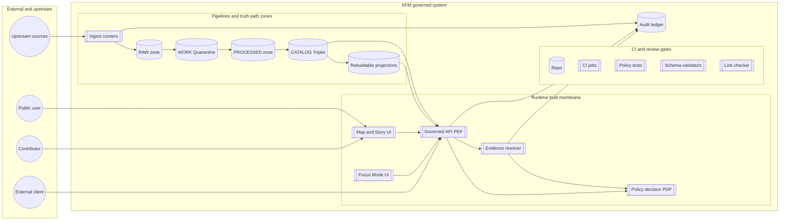

<!-- [KFM_META_BLOCK_V2]
doc_id: kfm://doc/6b3fca18-b186-43f6-a708-315f0d6fd509
title: Actors and Trust Surfaces
type: standard
version: v1
status: draft
owners: kfm-platform; kfm-governance
created: 2026-03-01
updated: 2026-03-01
policy_label: public
related:
  - docs/architecture/overview/README.md
  - docs/governance/policy-as-code.md
  - docs/architecture/overview/truth-path.md
tags: [kfm, architecture, governance, security, trust-membrane]
notes:
  - Actor model + trust surfaces for threat modeling, ADRs, and test planning.
  - “Cite-or-abstain” and “trust membrane” requirements are treated as hard invariants.
[/KFM_META_BLOCK_V2] -->

# Actors and Trust Surfaces
**Purpose:** Define *who/what* interacts with KFM and *where trust can be lost* so we can design policy, tests, and operations that fail closed.

---

## Quick navigation
- [Where this doc fits](#where-this-doc-fits)
- [Scope](#scope)
- [Non-negotiable invariants](#non-negotiable-invariants)
- [System context diagram](#system-context-diagram)
- [Actor register](#actor-register)
- [Trust surfaces](#trust-surfaces)
- [Control hooks and testable rules](#control-hooks-and-testable-rules)
- [Open decisions and unknowns](#open-decisions-and-unknowns)
- [Minimum verification steps](#minimum-verification-steps)

---

## Where this doc fits
This file lives at: `docs/architecture/overview/actors-and-trust-surfaces.md`.

It is the *shared vocabulary* for:
- Architecture discussions (system boundaries, threat model reviews)
- Governance and policy work (roles, obligations, “default deny” posture)
- CI rules and promotion gates (what MUST be enforced automatically)
- UI/UX trust features (evidence drawer, policy badges, abstention UX)

---

## Scope
### In scope
- Actors (human + system) and their responsibilities
- Trust membrane boundaries (policy enforcement points and “no direct access” rule)
- Trust surfaces (entry points, data exposure risks, and required controls)
- Testable invariants (what to encode in CI and runtime)

### Out of scope
- Full threat model (STRIDE/PASTA) per component (tracked separately)
- Vendor selection and IaC details (K8s, identity provider, secrets manager)
- Detailed API contracts (belongs in `contracts/` and API docs)
- Incident response playbooks (belongs in runbooks)

> [!NOTE]
> This is an **overview** doc. Component-specific security requirements should be captured as ADRs and test plans linked back to the trust surfaces defined here.

---

## Non-negotiable invariants
The following invariants are treated as **MUST** rules (encoded as tests and gates, not “best-effort documentation”):

1. **Truth path lifecycle**
   - Upstream → RAW → WORK/Quarantine → PROCESSED → CATALOG (DCAT + STAC + PROV + receipts) → PUBLISHED surfaces.
2. **Trust membrane**
   - Clients never access storage/DB directly.
   - All client access flows through governed APIs that apply policy, redaction obligations, and logging.
3. **Policy-as-code with shared semantics**
   - CI and runtime must agree on policy outcomes (same fixtures/outcomes).
4. **Evidence-first UX**
   - UI surfaces make version, license/rights, policy label, and provenance visible (not hidden).
5. **Cite-or-abstain Focus Mode**
   - Answers must cite resolvable EvidenceBundles (or abstain); citation verification is a hard gate.

---

## System context diagram

**Trust membrane boundary:** everything on the client side (UI/external clients) must go through **PEP + policy + evidence** before accessing published surfaces.

---

## Actor register
This table defines *who exists*, *what they do*, and *what must constrain them*.

> [!IMPORTANT]
> Roles are designed to be **minimal first** and evolve over time. Do not overcomplicate RBAC/ABAC until required.

| Actor | Type | Typical actions | Primary interfaces | Trust posture | Guardrails (must exist) |
|---|---|---|---|---|---|
| Public user | Human | Browse public layers/stories; Focus Mode queries limited to public evidence | UI, governed API | Untrusted | Policy deny-by-default for restricted; UI cannot bypass PEP |
| Contributor | Human | Draft stories; propose datasets/specs; open PRs | Git/PR workflow; UI authoring tools | Semi-trusted | CI gates for schema/policy/links; cannot publish without review |
| Reviewer / Steward | Human | Approves promotions and story publishing; owns policy labels and redaction rules | Governance UI; PR review | Trusted (bounded) | Cannot override invariants without explicit rationale + audit |
| Operator | Human | Runs pipelines; manages deployments; handles incidents | CI/CD; pipeline ops | Trusted (bounded) | Cannot override policy gates; production changes auditable |
| Governance council / community stewards | Human | Controls culturally sensitive materials; sets restrictions and public representations | Governance process | High trust | Documented decisions; policy changes via PR; audit trail |
| CI system | System | Runs validation, policy tests, link checks; blocks merges | `.github/workflows/*` | Trusted | Must fail closed; required checks for main |
| Ingest runners | System | Fetch upstream sources; snapshot to RAW; emit receipts | Pipelines | Trusted (bounded) | Scoped credentials; raw immutability; audit receipts |
| Catalog builders | System | Emit DCAT/STAC/PROV triplet; ensure cross-links and IDs | Pipelines | Trusted (bounded) | Strict validation; link integrity; EvidenceRefs must resolve |
| Policy Decision Point (PDP) | System | Evaluate allow/deny + obligations | OPA/Rego (or equivalent) | Trusted | Versioned policy bundle; fixtures/tests; default deny for sensitive |
| Governed API (PEP) | System | Enforce policy before serving; attach audit refs; serve datasets/tiles/catalog slices | API runtime | Trusted | Mandatory policy check; no direct storage exposure; structured errors |
| Evidence resolver | System | Resolve EvidenceRefs to EvidenceBundles; apply redaction obligations | API runtime | Trusted | Fail closed if unresolvable/unauthorized; bundles immutable by digest |
| Focus Mode orchestrator | System | Retrieve admissible evidence; verify citations; abstain when unsupported; produce receipts | Focus API + evidence resolver | High risk surface | Hard citation verification gate; prompt injection defenses; audit receipts |
| Adversary | Human/System | Probe endpoints; attempt exfiltration or policy bypass | Any public surface | Untrusted | Rate limiting, WAF, default deny, least privilege, audit |

---

## Trust surfaces
A “trust surface” is any boundary where:
- untrusted input arrives,
- policy could be bypassed,
- sensitive data could leak,
- provenance/audit could be broken,
- or users could be misled (claims without inspectable evidence).

### Trust surface register
| ID | Trust surface | Entry points | Primary risks | Required controls (MUST) | Status |
|---|---|---|---|---|---|
| TS-01 | Upstream acquisition boundary | HTTP fetch, bulk download, scraping, partner drop | Supply-chain poisoning; drift; license mismatch | Snapshot terms; store immutable RAW; receipts + checksums; quarantine on failure | CONFIRMED concept |
| TS-02 | Repo contribution boundary | PRs, dependency updates, config changes | Backdoor; policy weakening; silent semantics drift | CODEOWNERS; CI policy tests; schema validation; “policy semantics must match CI and runtime” | CONFIRMED concept |
| TS-03 | Secrets boundary | CI secrets, pipeline credentials, API keys | Credential leak; overbroad access | Secrets manager (not repo); scoped creds per source; rotation with audit | CONFIRMED concept |
| TS-04 | Promotion boundary | Zone transitions (RAW→WORK→PROCESSED→CATALOG→PUBLISHED) | Unlicensed publication; sensitive leakage; unverifiable lineage | Promotion gates: identity, rights, sensitivity, catalog triplet validation, QA thresholds, receipts, release manifest | CONFIRMED concept |
| TS-05 | Catalog contract surface | DCAT/STAC/PROV artifacts | Broken cross-links; unresolvable citations | Strict profiles; linkcheck; EvidenceRefs resolvable without guessing | CONFIRMED concept |
| TS-06 | Runtime trust membrane | Governed API endpoints | Direct storage bypass; inconsistent enforcement | PEP must call PDP; block direct DB/storage access; deny-by-default; audit_ref in errors | CONFIRMED concept |
| TS-07 | Evidence resolution surface | `/evidence/resolve` (concept) | Rights/sensitivity bypass; bundle includes restricted artifacts | Policy checks + obligations before bundling; bundles immutable; fail closed on unauthorized | CONFIRMED concept |
| TS-08 | Story publishing surface | Story create/publish | Narrative with uncited claims; rights misuse | Citation linting; resolver check; rights check for media; publish gate blocks | CONFIRMED concept |
| TS-09 | Focus Mode surface | Focus query endpoint + retrieval indexes | Prompt injection; hallucination; restricted exfiltration | Tool allowlist; policy pre-check; evidence-only retrieval; hard citation verification; abstain when unsupported | CONFIRMED concept |
| TS-10 | Tile/index projection surface | Tiles endpoints; search index APIs | Bypass via cached/static tiles; metadata leakage in errors | Serve only policy-safe tiles; cache varies by auth; deny-by-default on restricted | CONFIRMED concept |
| TS-11 | Audit ledger surface | Logs, run receipts, audit records | PII in logs; sensitive URLs; tampering | Retention + access policy; redact; append-only; classify receipts; policy gate for audit payload | PROPOSED details |
| TS-12 | UI trust surfaces | Evidence drawer, policy badges, “what changed” diff | Users misinterpret trust; hidden constraints | Evidence-first UI; visible version/license/policy; abstention UX; no UI policy decisions | CONFIRMED concept |

---

## Control hooks and testable rules
This section is the “engineering contract”: **if a trust surface exists, we encode it in CI/runtime checks.**

### CI gates (fail closed)
- **Schema validation** for registries/specs/contracts
- **Policy tests** (allow/deny + obligations fixtures)
- **Catalog validators + link check** (DCAT/STAC/PROV cross-links)
- **Citation linting** for Story Nodes (EvidenceRefs syntax + resolvability + policy + rights)

### Runtime gates (fail closed)
- **PEP enforced policy checks** before serving any dataset/tiles/story/focus output
- **Evidence resolver contract**:
  - EvidenceRef must resolve to EvidenceBundle
  - Bundle includes license/rights + digests + provenance references
  - Unauthorized or unresolvable must return deny (no partial leaks)
- **Focus Mode control loop hard gate**:
  - If citations cannot be verified as resolvable + allowed, **abstain** or reduce scope

### Concrete test ideas (add to `tests/` and CI)
- **No direct storage**: static analysis or integration test proving UI cannot hit object store / DB routes directly.
- **Default deny**: policy fixtures proving restricted datasets are denied for public role.
- **Obligations applied**: fixtures proving `public_generalized` outputs always attach a “generalized geometry” notice obligation.
- **Evidence resolvability**: build a “known-good” fixture dataset where every EvidenceRef resolves end-to-end.
- **Focus eval harness**: golden queries; block merge on regressions in citation coverage/resolvability.

> [!WARNING]
> Any new endpoint that can return data to a client is a new trust surface. It MUST be wired through policy checks and must emit audit references.

---

## Open decisions and unknowns
These items are intentionally marked **Unknown** until verified in-repo or decided via ADR.

### Authentication and authorization
- **Unknown (decision needed):** identity provider choice (OIDC), role list, ABAC requirements.
- **Proposed default:** OIDC + RBAC with policy labels; add ABAC only when required.

### Repo implementation state
- **Unknown:** exact module locations, endpoint implementations, and CI workflow names.
- This doc assumes the *documented target architecture* and must be reconciled against the actual repository tree/commit.

---

## Minimum verification steps
Use this checklist to convert Unknown → Confirmed:

- [ ] Capture repo commit hash and root directory tree (attach to next architecture update).
- [ ] Confirm presence of policy tests, schema validators, evidence resolver route, and dataset registry schema.
- [ ] Extract CI gate list and document which checks are merge-blocking.
- [ ] Choose one MVP dataset and prove it can be promoted through all truth path zones with receipts and catalogs.
- [ ] Verify UI cannot bypass the PEP and EvidenceRefs resolve end-to-end in Map Explorer and Story publishing.
- [ ] For Focus Mode: run evaluation harness and store golden query outputs and diffs as artifacts.

---

## Appendix: Definitions
- **PEP (Policy Enforcement Point):** component that *must* enforce policy before serving data (CI and runtime both qualify).
- **PDP (Policy Decision Point):** component that evaluates allow/deny decisions and obligations (e.g., OPA/Rego).
- **EvidenceRef:** structured reference that must resolve via evidence resolver.
- **EvidenceBundle:** immutable-by-digest bundle containing metadata, artifacts, license/rights, and provenance links sufficient to inspect a claim.
- **Trust membrane:** the boundary that prevents policy bypass by ensuring clients do not access storage directly.

<a href="#actors-and-trust-surfaces">Back to top</a>
