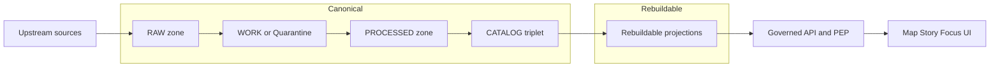

<!-- [KFM_META_BLOCK_V2]
doc_id: kfm://doc/1c64c1bb-1aa2-4b70-bc88-2d1e21d8fe0d
title: Canonical vs Rebuildable Stores
type: standard
version: v1
status: draft
owners: KFM Architecture (TODO: set CODEOWNERS team)
created: 2026-03-01
updated: 2026-03-01
policy_label: public
related:
  - docs/architecture/overview/truth-path.md (TODO: verify path)
  - docs/architecture/overview/trust-membrane.md (TODO: verify path)
  - docs/governance/promotion-contract.md (TODO: verify path)
tags: [kfm, architecture, governance, storage, provenance]
notes:
  - Defines the canonical vs rebuildable boundary so that re-indexing/migrations never destroy source-of-truth.
  - Treat all rebuildable projections as disposable and regenerable from promoted artifacts + catalogs + receipts.
[/KFM_META_BLOCK_V2] -->

# Canonical vs Rebuildable Stores
Separate **source-of-truth** artifacts from **derived projections** so KFM remains reproducible, governed, and safe to re-index.

---

## Quick navigation
- [Why this distinction exists](#why-this-distinction-exists)
- [Definitions](#definitions)
- [Decision rule](#decision-rule)
- [Reference flow](#reference-flow)
- [What is canonical in KFM](#what-is-canonical-in-kfm)
- [What is rebuildable in KFM](#what-is-rebuildable-in-kfm)
- [Operational rules](#operational-rules)
- [Testing and verification](#testing-and-verification)
- [Common failure modes](#common-failure-modes)
- [Appendix: classification worksheet](#appendix-classification-worksheet)

---

## Why this distinction exists

KFM’s architecture is built around two non-negotiables:

1. **Truth path lifecycle**: data must flow through zones and catalog/lineage outputs before it becomes visible in governed runtime surfaces.
2. **Trust membrane**: clients never access storage/DB directly; all access routes through the governed API + policy + evidence boundary.

The “canonical vs rebuildable” split is how we keep those invariants operationally cheap:
- You can **wipe and rebuild** projections (indexes/tiles/search/graphs) without losing truth.
- You can **migrate storage engines** without rewriting history.
- You can **prove and reproduce** what users saw, because canonical artifacts + catalogs + receipts remain stable.

> [!NOTE]
> This document defines *classification and rules*, not vendor choices. Object store / DB / search engines are implementation details as long as the canonical vs rebuildable contract holds.

[Back to top](#top)

---

## Definitions

### Canonical store
A storage surface is **canonical** if it is part of the system’s **source-of-truth** and required for:
- auditability (what was ingested, under what terms, with what checksums),
- reproducibility (rebuild derived outputs deterministically),
- governance enforcement (policy labels, obligations, lineage),
- evidence resolution (turning citations into inspectable bundles).

Canonical data is **append-only by version**: changes are represented as new versions/releases, not in-place edits.

### Rebuildable store
A storage surface is **rebuildable** if it is a **projection** that can be regenerated from canonical inputs:
- promoted artifacts,
- catalogs (DCAT/STAC/PROV),
- run receipts / promotion manifests,
- deterministic transforms.

Rebuildable stores are **disposable**: if deleted, the system can restore them from canonical truth.

[Back to top](#top)

---

## Decision rule

Use this litmus test:

> **If losing this store would prevent us from reproducing, auditing, or re-deriving what the user saw, it MUST be canonical.**  
> Otherwise, it SHOULD be rebuildable.

### Practical checks
A store is **canonical** if any of the following are true:
- It contains original or promoted artifacts that cannot be regenerated elsewhere.
- It encodes governance decisions (rights/policy/sensitivity) needed to safely serve data.
- It is required to resolve EvidenceRefs into EvidenceBundles.
- It is required to compute dataset identity/version deterministically.

A store is **rebuildable** if all of the following are true:
- It is *fully derived* from canonical inputs.
- It can be deterministically regenerated with recorded tooling/config versions.
- It does not hold “source truth” that is not present in canonical stores.

> [!WARNING]
> If you’re not sure whether something is canonical, default-deny and classify it as canonical **until** rebuildability is proven by a repeatable rebuild procedure and tests.

[Back to top](#top)

---

## Reference flow

Key idea:
- **Canonical** is everything needed to (a) prove provenance, (b) enforce policy, and (c) rebuild projections.
- **Rebuildable** is everything we generate to serve fast queries, tiles, and discovery.

[Back to top](#top)

---

## What is canonical in KFM

**Baseline recommendation (canonical):**
- Object storage for RAW/WORK/PROCESSED artifacts
- Catalogs: DCAT + STAC + PROV
- Append-only audit ledger (and/or release/promotion manifests)

### Canonical “must-have” properties
| Property | Requirement |
|---|---|
| Immutability | Canonical artifacts MUST be immutable by digest (no in-place mutation). |
| Versioning | Dataset versions/releases MUST be explicit and addressable. |
| Integrity | Checksums/digests MUST be stored and verified during promotion and retrieval. |
| Provenance | Catalog triplet MUST cross-link identifiers so lineage and citations resolve. |
| Governance | Rights + sensitivity + policy label + obligations MUST be recorded alongside artifacts. |

### Canonical examples (typical)
- RAW acquisition manifests and snapshots
- WORK QA reports and redaction candidates
- PROCESSED publishable artifacts (e.g., GeoParquet)
- DCAT/STAC/PROV outputs
- Run receipts / promotion manifests
- Audit ledger entries (append-only)

> [!TIP]
> If the system can’t rebuild a thing from canonical + receipts, that thing is canonical by definition.

[Back to top](#top)

---

## What is rebuildable in KFM

**Baseline recommendation (rebuildable projections):**
- PostGIS tables derived from processed GeoParquet
- Search index derived from processed texts + metadata
- Graph edges derived from catalogs + entity resolution
- Tile bundles (e.g., PMTiles) derived from processed features

### Rebuildable “must-have” properties
| Property | Requirement |
|---|---|
| Deterministic build | Same canonical inputs + same code/config versions ⇒ same projection (within defined tolerances). |
| Disposable | You MUST be able to delete and rebuild without losing truth. |
| No source truth | Rebuildable stores MUST NOT become the only place where truth exists. |
| Stamped builds | Each rebuild SHOULD emit a receipt linking inputs (digests) + tool versions + outputs. |
| Policy-safe serving | Projections MUST still be served through the trust membrane (no direct client access). |

### Rebuildable examples (typical)
- Spatial DB materializations / indexes
- Search + vector indexes
- Tile caches/bundles
- Derived aggregates and denormalized views
- Precomputed graph projections for traversal
- Performance caches

> [!WARNING]
> A tile bundle built from restricted geometry is NOT “safe” just because it’s a file. Rebuildable outputs must still respect policy at serving time; do not bypass the trust membrane via static hosting.

[Back to top](#top)

---

## Operational rules

### 1) Never let clients touch stores directly
All client-visible access MUST go through governed APIs so policy + evidence + logging are enforced uniformly.

### 2) Promotion defines canonical stability
A dataset version becomes eligible for runtime surfaces only after promotion gates produce:
- promoted artifacts,
- catalog triplet,
- receipts/manifests,
- policy decisions and obligations.

### 3) Rebuild procedures are part of the contract
Every rebuildable store MUST have:
- a documented rebuild entrypoint (CLI/job),
- a clear list of canonical inputs,
- output receipts/manifests,
- at least one CI test proving it can rebuild from scratch.

### 4) Rebuildable stores may be optimized, but not trusted
You MAY optimize rebuildable stores aggressively (caching, tiling, denormalization).
You MUST NOT treat rebuildable stores as the source-of-truth for governance, lineage, or evidence.

[Back to top](#top)

---

## Testing and verification

Minimum tests to prove the classification boundary holds:

### Canonical invariants (tests MUST exist)
- **Immutability test**: promoted artifacts are digest-addressed and cannot be overwritten.
- **Catalog linkage test**: DCAT/STAC/PROV cross-links resolve and remain stable across rebuilds.
- **Receipt presence test**: promotion outputs include required receipts/manifests.

### Rebuildable invariants (tests MUST exist)
- **Rebuild-from-zero test**: drop projection store(s) and regenerate from canonical; ensure API still serves expected results.
- **No-source-truth test**: confirm all projection records can be traced back to canonical digests.
- **Policy-safe behavior test**: public requests cannot infer restricted data via error shape, timing, or index leakage.

> [!TIP]
> Treat “drop and rebuild projections” as a routine disaster-recovery drill, not a one-time migration.

[Back to top](#top)

---

## Common failure modes

### Failure mode: “DB as truth”
**Symptom:** PostGIS becomes the only place where a dataset version “exists.”  
**Why it’s bad:** you can’t rebuild or audit without fragile state.  
**Fix:** promote canonical artifacts + catalogs + receipts; rebuild DB from those.

### Failure mode: “Static hosting bypass”
**Symptom:** tiles or exports are placed behind a CDN without policy checks.  
**Why it’s bad:** trust membrane is bypassed and sensitive content can leak.  
**Fix:** serve through governed API, enforce policy/obligations at request time.

### Failure mode: “Index drift”
**Symptom:** search index and tiles no longer match promoted artifact digests.  
**Why it’s bad:** users can’t reproduce what they saw; evidence breaks.  
**Fix:** stamp rebuild receipts and add CI drift checks.

[Back to top](#top)

---

## Appendix: classification worksheet

Use this worksheet when proposing a new store or cache:

### A) Inputs
- [ ] Which canonical artifacts (digests) are inputs?
- [ ] Which catalog nodes (DCAT/STAC/PROV) are inputs?
- [ ] Which policy decisions/obligations affect the projection?

### B) Rebuild proof
- [ ] Is there a single rebuild entrypoint (CLI/job)?
- [ ] Does it emit a receipt linking inputs → outputs?
- [ ] Is there a “drop-and-rebuild” CI test?

### C) Serving safety
- [ ] Can the UI or external clients access the store directly? (Expected: NO)
- [ ] Do we enforce policy at serving time?
- [ ] Can a public user infer restricted data existence via errors? (Expected: NO)

If any answer is unknown, treat as **canonical** until proven rebuildable.

[Back to top](#top)
