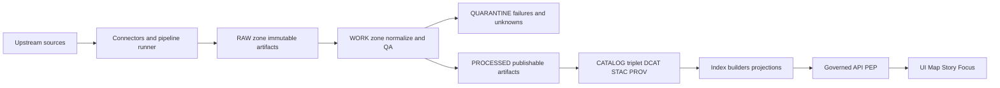
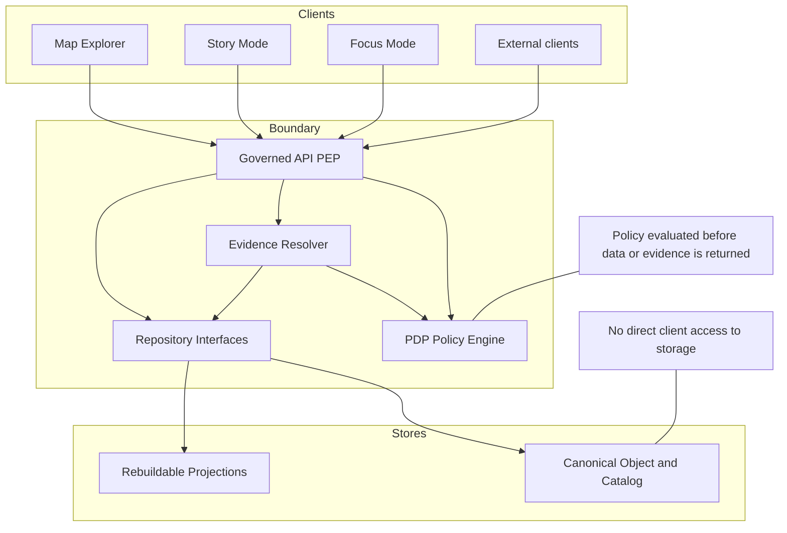

<!-- [KFM_META_BLOCK_V2]
doc_id: kfm://doc/f14eb662-4acb-499b-9049-2978aa75007f
title: Component decomposition
type: standard
version: v1
status: draft
owners: KFM Architecture (TODO)
created: 2026-03-01
updated: 2026-03-01
policy_label: restricted
related:
  - kfm://doc/kfm-gdg-vnext@2026-02-20
  - kfm://doc/kfm-pipeline-tooling@2026-02-20
tags: [kfm, architecture, overview, component-decomposition]
notes:
  - This file is a governed architecture overview. Every component boundary is designed to preserve the KFM truth path and trust membrane.
  - Confirmed vs Proposed markers reflect the referenced KFM vNext docs, not a live repo inspection.
[/KFM_META_BLOCK_V2] -->

# KFM Component Decomposition

> **Purpose:** Provide a buildable component map for Kansas Frontier Matrix (KFM), with clear responsibilities, contracts, and enforcement points for governance (policy, provenance, and promotion gates).

---

## Quick navigation

- [Architecture north stars](#architecture-north-stars)
- [Reference diagrams](#reference-diagrams)
- [Layering model](#layering-model)
- [Component registry](#component-registry)
- [Interfaces and contract surfaces](#interfaces-and-contract-surfaces)
- [Promotion Contract gates](#promotion-contract-gates)
- [Security and trust membrane](#security-and-trust-membrane)
- [Extension points](#extension-points)
- [Known unknowns and minimum verification](#known-unknowns-and-minimum-verification)
- [Sources](#sources)

---

## Architecture north stars

These are the invariants that every component boundary must preserve.

| Invariant | Meaning in practice | How it is enforced |
|---|---|---|
| **Truth path lifecycle** *(CONFIRMED)* | Upstream → RAW → WORK/QUARANTINE → PROCESSED → CATALOG/TRIPLET (DCAT+STAC+PROV + run receipts) → projections → governed API → UI surfaces. | Promotion Contract gates; catalog + link validation; append-only receipts and audit. |
| **Trust membrane** *(CONFIRMED)* | Clients never access storage/DB directly; backend logic uses repository interfaces; all access goes through governed APIs applying policy, redaction, and logging. | PEP in API + policy engine + evidence resolver; CI tests; runtime network controls. |
| **Evidence-first UX** *(CONFIRMED concept; implementation details PROPOSED)* | Every claim/layer/feature can open to the underlying dataset version, license/rights, policy label, provenance chain, checksums, and artifact links (when allowed). | Evidence drawer + evidence resolver contract; story publish gate; UI accessibility requirements. |
| **Cite-or-abstain Focus Mode** *(CONFIRMED)* | Focus answers must cite resolvable EvidenceBundles or abstain / narrow scope; every query emits a receipt. | Hard citation verification gate; evaluation harness; policy pre-checks. |
| **Canonical vs rebuildable stores** *(CONFIRMED concept)* | Object store + catalogs + provenance are canonical; PostGIS/search/graph/tiles are rebuildable projections. | Rebuild workflows; projection jobs are repeatable from canonical artifacts. |
| **Deterministic identity and hashing** *(CONFIRMED)* | Stable dataset + dataset-version identities derived from deterministic JSON hashing (e.g., canonical JSON). | Spec hashing library + golden tests + CI drift checks. |

---

## Reference diagrams

### Truth path dataflow (conceptual)

### Trust membrane boundary (conceptual)

### Deployment posture (recommended early default)

> **PROPOSED:** Start as a **modular monolith backend** with clearly separated modules (api, policy, evidence, catalog, ingest, indexers), then split into services only when scale requires it.

---

## Layering model

KFM follows a clean layering posture:

| Layer | What belongs here | What must NOT belong here |
|---|---|---|
| **Domain** *(CONFIRMED posture)* | Pure domain models (Dataset, DatasetVersion, EvidenceRef, EvidenceBundle, StoryNode) and domain rules. | Network calls, database drivers, OPA calls, HTTP handlers. |
| **Use cases** *(CONFIRMED posture)* | Workflows: ingest dataset, promote dataset version, publish story node, answer Focus query. | Direct DB access; knowledge of concrete storage engines. |
| **Interfaces** *(CONFIRMED posture)* | Contracts and ports: OpenAPI DTOs, schema registries, policy adapters, repository interfaces. | Business rules; infrastructure configuration. |
| **Infrastructure** *(CONFIRMED posture)* | PostGIS, graph DB, search index, object storage, CI, deployment (K8s/Helm/Terraform), observability systems. | Domain rules; policy semantics that should be shared across CI/runtime. |

**Key rule:** domain logic never talks directly to infrastructure; it talks through interfaces.

---

## Component registry

This registry is the **component-level decomposition** used for planning, ownership, and test boundaries.

### Core runtime & pipeline components

| ID | Component | Status | Primary responsibility | Inputs | Outputs | Hard gates / tests |
|---|---|---:|---|---|---|---|
| C1 | **Pipeline runner + connectors** | PROPOSED build plan | Watchers/fetchers/normalizers/validators/artifact writers. Produces immutable RAW + derived WORK/PROCESSED artifacts. | Upstream endpoints, files, APIs, scrapes. | RAW artifacts + checksums; WORK artifacts + QA; PROCESSED artifacts + checksums. | Schema validation; QA thresholds; quarantine routing; run receipt emission. |
| C2 | **Catalog generator** | PROPOSED build plan | Produces **DCAT/STAC/PROV + run receipts**; cross-links identifiers so EvidenceRefs resolve deterministically. | PROCESSED artifacts + spec metadata + receipts. | Catalog triplet (DCAT/STAC/PROV) + link graph + receipt artifacts. | Validators + link checker; promotion gate D. |
| C3 | **Policy engine (OPA/Rego or equivalent)** | PROPOSED build plan | Shared semantics in **CI + runtime** (fixtures-driven). Produces allow/deny + obligations + reason codes. | Request context; dataset policy labels; fixture corpus. | Policy decision object + obligations. | Default-deny policy tests; fixture regression tests; contract tests. |
| C4 | **Evidence resolver** | PROPOSED build plan | Resolves EvidenceRefs → EvidenceBundles; applies policy and redaction obligations before returning any evidence. | EvidenceRef; catalogs; receipts; policy engine. | EvidenceBundle (metadata + provenance + allowed artifacts) + decision context. | Evidence resolution integration tests; story publish gate; Focus citation verifier. |
| C5 | **Governed API gateway (PEP)** | PROPOSED build plan | Enforcement boundary: dataset discovery, STAC browse/query, tiles/features, stories, Focus. Always policy-checked and versioned. | Client requests; repositories; policy engine; evidence resolver. | API responses containing dataset_version_id + (when applicable) digests + audit_ref. | OpenAPI contract tests; policy tests; error-model tests (no existence leaks). |
| C6 | **UI surfaces (Map + Story + Focus)** | PROPOSED build plan | Evidence-first UX: layers/stories/answers always show evidence drawer; abstention is understandable and safe. | Governed API responses; evidence bundles. | Interactive map/story/focus outputs; exports with citations. | E2E tests for evidence drawer; accessibility tests; publish gates. |
| C7 | **Index builders (rebuildable projections)** | PROPOSED build plan | Build projections for performance: PostGIS indices, search, graph, vector tiles/PMTiles caches. | Canonical PROCESSED artifacts + catalogs. | Rebuildable indices and caches. | Rebuild reproducibility checks; performance benchmarks; cache invalidation tests. |

### Canonical vs rebuildable stores

| Store type | Examples | Rule |
|---|---|---|
| **Canonical** | Object storage for artifacts; DCAT/STAC/PROV catalogs; run receipts; audit ledger. | Treated as the source of truth; versioned and immutable (append-only or superseded via new version). |
| **Rebuildable projections** | PostGIS tables; search indexes; graph DB; tile caches. | Must be regenerable from canonical artifacts + catalogs; never the only place provenance lives. |

---

## Interfaces and contract surfaces

### Catalog triplet as a contract boundary

KFM treats catalogs as the **canonical interface** between pipeline outputs and runtime.

**Triplet responsibilities:**

- **DCAT:** dataset-level metadata (license, publisher, distributions, themes).
- **STAC:** asset-level spatiotemporal metadata (collections, items, assets).
- **PROV:** lineage (activities, agents, entities) linking outputs to inputs and tools.

> **PROPOSED:** Define KFM profiles (strict minimum fields) for each catalog type so validators are deterministic and CI-enforceable.

### Governed API: minimum endpoint set

> **PROPOSED buildable v1 surface:** (names shown as contract targets; verify live routes in repo)

- `GET /api/v1/datasets` — dataset + version discovery (DCAT-backed; server-side policy filter)
- `GET /api/v1/stac/collections` and `GET /api/v1/stac/items` — STAC query by bbox/time/collection (policy filter before returning assets)
- `POST /api/v1/evidence/resolve` — EvidenceRef → EvidenceBundle (returns bundle digest + policy decision results)
- `GET/POST /api/v1/story` (+ `GET/PUT /api/v1/story/{id}`) — story nodes with versioning; publishing requires citations + review state
- `POST /api/v1/focus/ask` — governed Focus Mode Q&A; returns citations or abstain + `audit_ref`
- `GET /api/v1/lineage/status` and `GET /api/v1/lineage/stream` — pipeline health/freshness feeds for UI status badges
- Optional tiles:
  - `GET /api/v1/tiles/{layer}/{z}/{x}/{y}.pbf` (dynamic)
  - OR `GET /assets/pmtiles/{dataset_version_id}/{layer}.pmtiles` (static; public-only or policy-gated)

### API contract requirements

**Every response** SHOULD include (when applicable):

- `dataset_version_id`
- artifact digests/checksums
- policy label (public-safe)
- `audit_ref` for governed operations (Focus, story publish)

**Errors** MUST follow a stable model:

- `error_code`
- `message` (policy-safe)
- `audit_ref`
- optional remediation hints

> **Rule:** avoid leaking sensitive existence through error differences; align 403/404 behavior with policy.

---

## Promotion Contract gates

Promotion is the act of moving a **dataset version** from Raw/Work to Processed + Catalog/Lineage, and therefore into runtime surfaces.

### Minimum gates (v1)

| Gate | What must be present | Where to enforce (minimum) |
|---|---|---|
| **A — Identity and versioning** | `dataset_id`, `dataset_version_id`, deterministic `spec_hash`, artifact digests. | CI + pipeline; block merge/promotion on drift. |
| **B — Licensing and rights metadata** | License/rights fields + snapshot of upstream terms. | CI + steward review; block promotion if missing/unknown. |
| **C — Sensitivity classification and redaction plan** | `policy_label` + obligations (generalize geometry, remove fields, etc.) as needed. | Policy tests + pipeline transforms; default deny when unclear. |
| **D — Catalog triplet validation** | DCAT/STAC/PROV validate and cross-link; EvidenceRefs resolve without guessing. | Validators + linkcheck in CI; block promotion on broken links. |
| **E — QA and thresholds** | Dataset-specific QA checks + thresholds recorded. | Pipeline + CI; quarantine if thresholds fail. |
| **F — Run receipt and audit record** | Run receipt capturing inputs, tool versions, hashes, policy decisions; append-only audit record. | Pipeline + runtime; schema validation of receipts. |
| **G — Release manifest** *(recommended)* | Promotion recorded as a release manifest referencing artifact digests. | Release tooling; used for rollback + diffing. |

---

## Security and trust membrane

### Policy-as-code: shared semantics across CI and runtime

> **Requirement:** the same policy semantics (or at minimum the same fixtures and outcomes) must hold in CI and runtime; otherwise CI guarantees are meaningless.

**Recommended pattern:**

- **Policy Decision Point (PDP):** OPA in-process or sidecar.
- **Policy Enforcement Points (PEP):**
  - **CI:** schema validation + policy tests block merges.
  - **Runtime API:** policy checks before serving data.
  - **Evidence resolver:** policy checks before resolving evidence and rendering bundles.
  - **UI:** displays policy badges/notices, but **never** decides policy.

### Sensitivity defaults (PROPOSED)

- Default deny for sensitive-location and restricted datasets.
- If any public representation is allowed, create a **separate** `public_generalized` dataset version.
- Never leak restricted metadata via error responses.
- Never embed precise coordinates in Story Nodes or Focus outputs unless policy explicitly allows.
- Treat redaction/generalization as a **first-class transform** recorded in PROV.

---

## Extension points

### Adding a new dataset

1. Add a dataset spec (fields include identity, license, sensitivity/policy label, QA thresholds).
2. Implement or configure a connector (C1).
3. Ensure the pipeline emits:
   - RAW acquisition manifest + terms snapshot,
   - WORK QA report,
   - PROCESSED artifacts + checksums,
   - run receipt.
4. Generate catalogs (C2) and validate cross-links.
5. Rebuild projections (C7).
6. Expose via governed API (C5) and confirm evidence drawer in UI (C6).

### Adding a new UI surface

- The UI surface must be able to:
  - open an evidence drawer for every layer/claim/answer,
  - represent policy restrictions without leaking,
  - show `dataset_version_id` and license/rights at the point of interaction.

---

## Known unknowns and minimum verification

> **Important:** Some documents caution that we must not claim specific subpackages exist until verified in the live repo. This file treats some module names as **targets** and lists the minimum checks needed.

### Minimum verification steps (do these before marking anything “CONFIRMED in repo”)

- [ ] Capture repo commit hash and root directory tree (`git rev-parse HEAD` and `tree -L 3`).
- [ ] Confirm which work packages already exist (search for `spec_hash`, OPA policy bundle/tests, validators, evidence resolver route, dataset registry schema).
- [ ] Extract CI gate list from `.github/workflows` and document which checks block merges.
- [ ] Choose one MVP dataset and prove it promotes through all gates with receipts + catalogs.
- [ ] Validate UI cannot bypass the PEP (static analysis + network policies) and that EvidenceRefs resolve end-to-end.
- [ ] For Focus Mode, run the evaluation harness and store golden query outputs + diffs as build artifacts.

---

## Sources

- **Kansas Frontier Matrix (KFM) — Definitive Design & Governance Guide (vNext)** (dated 2026-02-20)
- **Tooling the KFM pipeline / Architecture, Governance, and Delivery Plan** (vNext-era planning brief)
