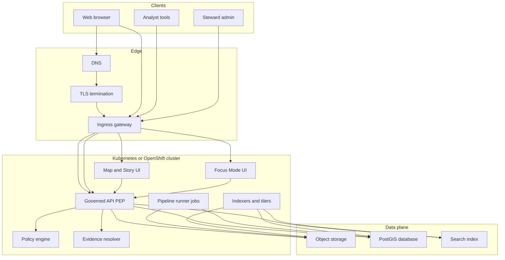
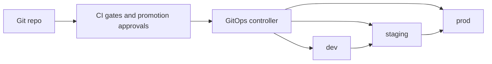

<!-- [KFM_META_BLOCK_V2]
doc_id: kfm://doc/7b1c4d4a-9a84-4c7c-9f4a-4c5a8f1c7df9
title: Deployment Topology
type: standard
version: v1
status: draft
owners: TBD
created: 2026-03-01
updated: 2026-03-01
policy_label: public
related:
  - docs/architecture/overview/deployment-topology.md
  - infra/
  - policy/
  - contracts/
tags: [kfm, architecture, overview, deployment, topology, trust-membrane]
notes:
  - Defaults to the vNext PROPOSED ops model; fill TBDs via ADRs + infra manifests.
[/KFM_META_BLOCK_V2] -->

# Deployment Topology

**Purpose:** Describe how KFM’s runtime services, policy boundary (“trust membrane”), and core data stores are deployed across **dev / staging / prod**, including exposure rules, operational requirements, and what is canonical vs rebuildable.

---

## Quick navigation

- [Scope and non-goals](#scope-and-non-goals)
- [Non-negotiable invariants](#non-negotiable-invariants)
- [Reference topology](#reference-topology)
- [Component placement](#component-placement)
- [Environment model and promotion](#environment-model-and-promotion)
- [Network exposure rules](#network-exposure-rules)
- [Data plane and zones](#data-plane-and-zones)
- [Ops baseline](#ops-baseline)
- [Backup and restore](#backup-and-restore)
- [Incident response](#incident-response)
- [Security baseline](#security-baseline)
- [Verification checklist](#verification-checklist)
- [Appendix](#appendix)

---

## Scope and non-goals

### In-scope
- **Runtime topology** for the Map/Story UI + Focus Mode UI, governed API (PEP), policy engine, evidence resolver, and pipeline runner jobs.
- **Environment separation** (dev/staging/prod) and controlled promotion between environments.
- **Exposure boundaries** (what can be public, what must be private).
- **Operational minimums**: observability, backup/restore, incident types.

### Out of scope
- Exact cloud provider, exact instance sizing, exact ingress controller choice.
- Exact secrets product (Vault vs cloud secret manager vs ExternalSecrets, etc.).
- Exact database/search vendor (managed vs self-hosted).

> **NOTE:** Where implementation choices are unknown, this doc states **TBD** and provides the smallest verification steps to resolve them.

---

## Non-negotiable invariants

### CONFIRMED: Trust membrane (policy boundary)
- **Clients and the UI never talk to object storage or databases directly.**
- All runtime data access is mediated by the **Governed API (PEP)** which evaluates policy (directly or via a policy engine) before reading/writing data.
- Policy bypass is treated as an architecture failure and must be prevented by **both code structure and network controls**.

> **WARNING:** Any “temporary” direct access (e.g., browser reads from object storage) breaks the trust membrane and should be blocked at review + CI + network policy levels.

### CONFIRMED: Published surfaces are governed
“Published” means **served through the governed runtime surfaces** (API + UI) with policy enforced and receipts/citations resolvable.

---

## Reference topology

### Single-environment reference (repeat per env)

### Environment model (PROPOSED default: GitOps)

---

## Component placement

| Component | Primary role | Runs in cluster | Exposed externally | Notes |
|---|---:|:---:|:---:|---|
| Map and Story UI | Public map/story experience | Yes | Yes | Must use governed API only |
| Focus Mode UI | Evidence-led Q&A surface | Yes | Yes | Must cite-or-abstain; governed API only |
| Governed API (PEP) | Policy-gated data access | Yes | Yes | Only runtime gateway to stores |
| Policy engine | Evaluate allow/deny + obligations | Yes | No | May be sidecar/embedded; can be OPA/Rego |
| Evidence resolver | Resolve EvidenceRef → EvidenceBundle | Yes | Via API | May be part of API service |
| Pipeline runner | Batch jobs for ingest/QA/promotion | Yes | No | Runs in-cluster; service account scoped |
| Indexers/tilers | Build tiles + search projections | Yes | No | Produces rebuildable projections |
| Object storage | Raw/work/processed/catalog storage | No (managed) or Yes | No | Canonical store; private network |
| PostGIS DB | Query + spatial ops + some projections | No (managed) or Yes | No | Treat as private; API-only |
| Search index | Discovery + fast lookup | No (managed) or Yes | No | API-only; consider rebuildable |

> **Design intent:** When possible, keep databases/search/object storage **managed** and keep **Kubernetes/OpenShift** focused on the API, policy/evidence services, and batch runners.

---

## Environment model and promotion

### PROPOSED: GitOps with explicit envs
- Environments: **dev**, **staging**, **prod**
- Promotion between environments is **controlled and audited**
- Secrets are managed **outside Git**, but referenced declaratively (e.g., secret name/ID, not secret value)

### Recommended separation
- **Namespace per environment** (or separate clusters if required by governance or risk profile)
- Separate **object storage prefixes/buckets** per environment
- Separate **DB instances/schemas** per environment (at least staging vs prod)
- Separate **search indices** per environment

> **NOTE:** “Promotion” in GitOps terms refers to **manifests/config promotion**. KFM data promotion (Raw→Work→Processed→Catalog→Published) is a **separate** governed lifecycle that must emit receipts and pass gates.

---

## Network exposure rules

### External exposure
Only these should be internet-facing:
- UI (Map/Story, Focus Mode)
- Governed API (PEP)

Everything else is private:
- DB
- object storage
- search index
- batch runners
- policy engine internal ports
- evidence resolver internal ports (if separate)

### Default-deny posture
- Default-deny network policies for namespaces
- Egress restrictions for pipeline service accounts (source-scoped credentials)
- Policy-safe errors (public users should not infer restricted dataset existence via error behavior)

---

## Data plane and zones

### Zones and where they live
KFM’s lifecycle zones are implemented as storage partitions in object storage (and/or DB schemas where appropriate):

| Zone | Storage | Mutability | Typical contents |
|---|---|---:|---|
| RAW | Object storage | Immutable / append-only | Upstream payloads + checksums + fetch logs |
| WORK / Quarantine | Object storage | Rewrite allowed | Intermediate transforms, QA reports, redaction/generalization transforms |
| PROCESSED | Object storage | Immutable by digest | Standardized publishable artifacts (e.g., GeoParquet/COG/PMTiles) |
| CATALOG / Triplet | Object storage (and/or repo) | Immutable per version | Cross-linked DCAT + STAC + PROV bundles describing assets + lineage |
| PUBLISHED | API + UI surfaces | Governed | API responses, tiles endpoints, story pages, Focus answers (each with receipts) |

### Projections vs canonical stores
- **Canonical (must back up):** object storage zones, audit ledger, policy repo state, story nodes/docs state.
- **Rebuildable (usually):** projections such as tile caches and derived indices, although backing them up can speed recovery.

---

## Ops baseline

### Observability (minimum)
- Structured logs with:
  - correlation IDs
  - audit_ref
- Metrics:
  - request latency (P95) per endpoint
  - evidence resolver latency
  - tile response latency
  - pipeline run durations and failures
- Traces optional early

### Dashboards (minimum)
- Steward view: policy denials, rights issues, quarantines
- Operator view: pipeline health, storage usage, deployment status
- Product view: UI performance and accessibility regression indicators

---

## Backup and restore

### Canonical stores to back up
- Object storage (raw/work/processed/catalog)
- Audit ledger
- Policy repository state (git)
- Story nodes and docs (git)

### Restore plan (minimum)
1. Restore canonical stores
2. Run rebuild pipelines to reconstruct projections
3. Validate counts and extents against catalogs
4. Run smoke tests (API and UI)

> **TIP:** Run restore drills regularly and record results as governed run receipts.

---

## Incident response

### Governance incident types (minimum)
- Restricted data leakage
- Licensing violation risk (unlicensed media published)
- Corrupted catalogs or broken citations
- Pipeline producing non-deterministic outputs

For each incident type, define:
- detection signals and thresholds
- containment steps (default-deny, revoke credentials, block publish)
- evidence collection (logs + receipts + policy decisions)
- rollback steps (GitOps rollback + data rollback where possible)
- postmortem template + steward sign-off

---

## Security baseline

### Decisions required (TBD → ADR)
- AuthN: OIDC provider (TBD), session strategy (TBD)
- AuthZ: roles + policy labels + obligations model (TBD)
- Secrets: secrets manager (TBD) and rotation policy (TBD)

### Recommended baseline patterns
- OIDC for identity
- RBAC for coarse access + ABAC/policy-label enforcement in policy engine
- Secrets managed outside Git, referenced declaratively
- Sensitive-location protection:
  - store precise geometry in restricted datasets
  - publish generalized derivatives for public surfaces
  - enforce at tile serving and API query outputs
  - add tests so this cannot regress silently

---

## Verification checklist

Smallest checks to turn “TBD” into “CONFIRMED”:

- [ ] Capture repo commit hash and root tree (`git rev-parse HEAD`, `tree -L 3`)
- [ ] Confirm where GitOps manifests live (`infra/` expected)
- [ ] Confirm environments (dev/staging/prod) exist as overlays/namespaces
- [ ] Confirm PEP/API is the *only* runtime path to DB/object/search (static analysis + network policy)
- [ ] Confirm policy engine integration mode (sidecar vs embedded) and policy test harness exists
- [ ] Confirm evidence resolver route exists and is used by UI in <=2 calls
- [ ] Confirm backup plan for canonical stores and run a restore drill
- [ ] Confirm observability basics: correlation id + audit_ref in logs; key latency metrics exported
- [ ] Confirm incident runbooks exist for the minimum incident types

---

## Appendix

<strong>PROPOSED namespace layout</strong>

- `kfm-dev`
- `kfm-staging`
- `kfm-prod`

Within each:
- `ui`
- `api`
- `jobs`
- `internal` (policy/evidence internal services)

**Default deny** at namespace boundary; explicit allow rules for:
- UI → API
- API → policy/evidence
- API → data plane
- Jobs/indexers → data plane

<strong>Threat-model checks to keep “trust membrane” real</strong>

Examples of checks you should be able to answer “NO” to:
- Does any frontend code fetch directly from object storage or databases?
- Can an unauthorized user infer restricted dataset existence from errors or timing?

Examples of checks you should be able to answer “YES” to:
- Are processed artifacts immutable by digest?
- Are policy rules tested in CI with fixtures?

