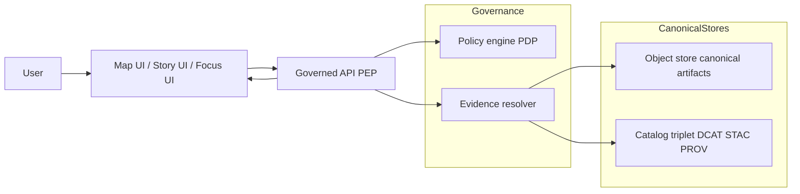

<!-- [KFM_META_BLOCK_V2]
doc_id: kfm://doc/7dcd6f8b-0b2d-4f5d-9d7d-86e2a3aa3c1e
title: Evidence and Claims
type: standard
version: v1
status: draft
owners: TBD
created: 2026-03-01
updated: 2026-03-01
policy_label: public
related:
  - kfm://doc/00000000-0000-0000-0000-000000000000  # TODO: link the “Architecture Overview” index doc
tags: [kfm, architecture, governance, evidence, claims]
notes:
  - Defines how KFM represents claims and binds them to inspectable evidence.
  - Documented posture: evidence-first UX + cite-or-abstain Focus Mode + trust membrane + truth path.
[/KFM_META_BLOCK_V2] -->

# Evidence and Claims
**Purpose:** Define the *system contract* that every user-facing claim (map feature, Story Node sentence, Focus Mode answer) is traceable to **resolvable evidence bundles** and is policy-checked end-to-end.


**Quick nav:**  
- [Scope](#scope)  
- [Status legend](#status-legend)  
- [Non-negotiable invariants](#non-negotiable-invariants)  
- [Definitions](#definitions)  
- [End-to-end flow](#end-to-end-flow)  
- [Gates](#gates-and-enforcement)  
- [Policy and redaction](#policy-and-redaction)  
- [UX requirements](#ux-requirements)  
- [Unknowns + verification steps](#unknowns--minimum-verification-steps)  
- [Appendix: proposed claim record](#appendix-a-proposed-claim-record)  

---

## Scope

### In scope
- What counts as a **claim** in KFM.
- What counts as **evidence** in KFM.
- How **EvidenceRefs** resolve to **EvidenceBundles** (and why this replaces “LLM citations”).
- The **gates** that make “cite-or-abstain” enforceable (CI + runtime).
- UX requirements to keep trust **visible**.

### Out of scope
- Full JSON Schemas for every artifact (only minimal shapes + required fields here).
- Exact repo paths / package names (implementation varies by repo state; treat as *to verify*).

---

## Status legend

KFM docs use *truth discipline*:

| Tag | Meaning | How to treat it |
|---|---|---|
| **CONFIRMED** | Backed by the vNext architecture/governance sources | Required invariant / contract |
| **PROPOSED** | A build plan or default that should be implemented | A recommendation with tradeoffs |
| **UNKNOWN** | Needs repo/governance verification | Fail closed; add verification steps |

---

## Non-negotiable invariants

> These are architectural invariants. If we violate them, KFM stops being governable.

1) **Truth path lifecycle (CONFIRMED)**  
Upstream → RAW → WORK/QUARANTINE → PROCESSED → CATALOG (DCAT + STAC + PROV + run receipts) → **PUBLISHED** governed surfaces. Promotion is blocked unless gates pass.  

2) **Trust membrane (CONFIRMED)**  
Clients never access storage/DB directly; access is enforced at the governed API (PEP), applying policy, redaction, and logging.  

3) **Evidence-first UX (CONFIRMED)**  
Evidence is a first-class UI surface (evidence drawer / provenance drawer) reachable from every map feature and story claim.  

4) **Cite-or-abstain Focus Mode (CONFIRMED)**  
Focus Mode must cite *resolvable* evidence bundles or abstain. Citation verification is a hard gate; each query emits a run/audit receipt.  

5) **Catalog triplet as a contract surface (CONFIRMED concept; PROFILES PROPOSED)**  
DCAT answers “what is this dataset + rights.” STAC answers “what assets exist + extents.” PROV answers “how produced.” All cross-linked so EvidenceRefs resolve without guessing.

---

## Definitions

### Claim
A **claim** is any user-facing assertion that could be interpreted as factual, including:
- A Story Node sentence like “Tornado events increased in 2019.”
- A map tooltip field like “Owner: …” or “Discharge: …”
- A Focus Mode statement like “The flood extent on 2020‑06‑10 was …”

**Rule:** A claim is **publishable** only if it is linked to one or more **EvidenceRefs** that can be resolved into policy-allowed **EvidenceBundles**.

### Evidence
**Evidence** is any inspectable artifact (and its provenance) that supports a claim, such as:
- A dataset version record (DCAT)
- A specific spatial asset or record (STAC item/asset + digests)
- A run receipt / provenance bundle (PROV + run receipt)
- A scanned document page + OCR span (doc citations)
- A governed graph edge / entity relation (optional)

### EvidenceRef
An **EvidenceRef** is a stable, parseable reference that can be resolved without “URL guessing.”
Recommended schemes include:
- `dcat://…` (dataset/distribution metadata)
- `stac://…` (collection/item/asset metadata)
- `prov://…` (run lineage, activity/entity/agent)
- `doc://…#page=…&span=…:…` (page + text span)
- `graph://…` (entity relations, if enabled)

**Rule:** EvidenceRefs must be parseable without network calls; the resolver returns policy-safe errors.

### EvidenceBundle
An **EvidenceBundle** is what the user (and reviewer) can inspect. It is immutable by digest and contains:
- `bundle_id` + digest
- policy decision + obligations (what was redacted/generalized)
- human-renderable “evidence cards”
- machine metadata: dataset_version_id, artifact digests, provenance links, rights metadata

### “Citation” (KFM meaning)
A KFM “citation” is **not** a pasted URL.  
A citation is an **EvidenceRef** that resolves — via the evidence resolver — into an EvidenceBundle with enough metadata + provenance to inspect and reproduce the claim.

---

## End-to-end flow

### Conceptual architecture path



**Key idea:** UI never “just shows data.” It shows **claims** backed by **resolvable evidence bundles**.

### Focus Mode control loop (governed)
Focus Mode runs as a governed operation:
1. Policy pre-check  
2. Retrieval plan  
3. Retrieve admissible evidence (catalog/index/db)  
4. Build EvidenceBundles (resolver; apply redaction obligations)  
5. Synthesize answer referencing bundle IDs  
6. **Citation verification hard gate** (if citations can’t be verified → abstain or reduce scope)  
7. Emit audit receipt (query + bundle digests + policy decisions + model version + output hash)

**Rule:** retrieval results must always map back to EvidenceRefs that resolve to bundles — no “raw index text” without evidence linking.

---

## Gates and enforcement

### Gate 1 — Promotion Contract (data → publishable surfaces)
Promotion to PUBLISHED must be blocked unless:
- Deterministic IDs + digests exist
- DCAT/STAC/PROV validate under profiles
- Links resolve; EvidenceRefs resolve
- Policy label assigned; obligations applied
- QA reports exist; failures quarantine
- Run receipt + audit record emitted

### Gate 2 — Story Node publishing / merge gate
CI must validate citations before a Story Node can be merged:
- EvidenceRef syntax check
- Resolver can resolve refs in test environment
- Policy check (citations allowed for intended policy label)
- Rights check (media has rights metadata)

**Rule:** A Story Node cannot be merged if citations fail.

### Gate 3 — Runtime evidence resolution
At runtime:
- Governed API applies policy (PEP)
- Evidence resolver applies policy before returning bundles
- UI displays policy badges/notices but never decides policy

### Gate 4 — Focus Mode citation verification
Focus Mode must verify every citation resolves and is policy-allowed for the user. If not, it must abstain or narrow scope. This is the primary anti-hallucination gate.

---

## Policy and redaction

### Policy label is the primary classification input
Policy evaluation returns:
- allow/deny decision
- obligations (redact/generalize/remove fields)
- reason codes for auditing/UX

### Defaults (recommended posture)
- **Default deny** for restricted/sensitive-location datasets.
- If a public representation is allowed, produce a separate **public_generalized** dataset version.
- Never leak restricted metadata in 403/404 behavior.
- Treat redaction/generalization as a first-class transform recorded in provenance.

---

## UX requirements

### Required trust surfaces (not optional polish)
- Evidence drawer reachable from every layer/feature/story claim.
- DatasetVersion label per layer with link to catalogs.
- Explicit policy notices (“geometry generalized due to policy”).
- “What changed?” panel comparing DatasetVersion diffs (counts/checksums/QA).

### Evidence drawer minimum fields
- Evidence bundle ID + digest
- DatasetVersion ID + dataset name
- License + rights holder (with attribution text)
- Freshness (last run timestamp) + validation status
- Provenance chain (run receipt link)
- Artifact links (policy-allowed only)
- Redactions applied (obligations) + user-facing explanation

### Abstention UX
Abstention is a feature. UX must:
- explain “why” in policy-safe terms
- suggest safe alternatives (public datasets, broader time window, etc.)
- include `audit_ref` for steward review
- never reveal restricted existence unless policy allows

---

## Unknowns + minimum verification steps

### UNKNOWN (must verify in repo)
- Exact endpoint naming and routing (paths shown here are “documented targets”).
- Actual package/module layout for evidence resolver, policy engine integration, receipt store.
- Existing schemas and fixtures for EvidenceBundle, EvidenceRef, and run receipts.

### Minimum verification steps (smallest work to convert UNKNOWN → CONFIRMED)
1. Confirm a single end-to-end vertical slice exists (or is buildable): ingest → catalogs → governed API → UI evidence drawer → story citation gate → Focus Mode cite-or-abstain.  
2. Confirm evidence resolver behavior:  
   - accepts EvidenceRef  
   - returns EvidenceBundle with digest  
   - fails closed on unresolvable/unauthorized refs  
3. Confirm CI gates:  
   - EvidenceRef parse lint  
   - resolver test resolves sample refs  
   - policy fixture tests are enforced  
4. Confirm “policy-safe errors”: a public user cannot infer restricted dataset existence via error messaging.

---

## Appendix A: Proposed claim record

> **PROPOSED**: a minimal claim record shape for Story Nodes and Focus Mode outputs.

```json
{
  "claim_id": "kfm://claim/sha256:...",
  "claim_text": "Storm events increased in 2019 compared to 2018.",
  "claim_type": "comparative_statistic",
  "scope": {
    "bbox": [-102.05, 36.99, -94.60, 40.00],
    "time_window": ["2018-01-01", "2019-12-31"]
  },
  "citations": [
    "dcat://noaa_ncei_storm_events@2026-02.abcd1234",
    "prov://kfm://run/2026-02-20T12:34Z.noaa.abcd1234"
  ],
  "evidence_bundles": [
    { "bundle_id": "sha256:bundle...", "digest": "sha256:..." }
  ],
  "computed": {
    "method": "count_by_year",
    "output_digest": "sha256:..."
  },
  "policy": {
    "policy_label": "public",
    "obligations_applied": []
  },
  "audit_ref": "kfm://audit/entry/..."
}
```

---

## Appendix B: Checklists

### Claim author checklist
- [ ] Claim is scoped (bbox/time/dataset versions)  
- [ ] Every factual statement has at least one EvidenceRef  
- [ ] EvidenceRefs resolve locally (parseable)  
- [ ] Rights/attribution are present for any media  
- [ ] If evidence is missing: mark **uncited** and do not publish  

### Reviewer checklist (Story Node / Focus Mode)
- [ ] Citations resolve to bundles and are policy-allowed  
- [ ] Bundles include dataset version, rights, digests, provenance links  
- [ ] No restricted coordinates/fields appear in public outputs  
- [ ] QA/validation status is visible (or claim is framed with uncertainty)  

---

<a id="back-to-top"></a>
**Back to top:** [Evidence and Claims](#evidence-and-claims)
