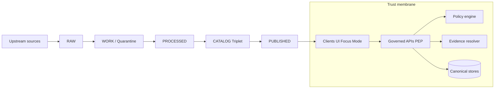

<!-- [KFM_META_BLOCK_V2]
doc_id: kfm://doc/7f0c3b14-4d6a-4c20-b2d7-9b2d94e5a8f1
title: Architecture Glossary
type: standard
version: v1
status: draft
owners: [TBD]
created: 2026-03-01
updated: 2026-03-01
policy_label: public
related:
  - docs/architecture/overview/README.md # TODO verify path
  - docs/glossary.md # TODO verify path
tags: [kfm, glossary, architecture, governance]
notes:
  - This glossary is architecture-scoped; prefer adding domain terms to the general glossary (if present).
  - Each term includes a status tag: CONFIRMED, PROPOSED, or UNKNOWN.
[/KFM_META_BLOCK_V2] -->

<a id="top"></a>

# Architecture Glossary
Shared vocabulary for Kansas Frontier Matrix (KFM) architecture & governance docs.


> **Why this exists:** KFM is designed as a governed, end-to-end system. If teams use different words for the same thing (or the same word for different things), we silently break gates, policies, and the trust membrane.

## Quick navigation
- [Where this fits](#where-this-fits)
- [Legend](#legend)
- [System picture](#system-picture)
- [Data lifecycle & promotion](#data-lifecycle--promotion)
- [Catalog, evidence, and provenance](#catalog-evidence-and-provenance)
- [Governance, policy, and safety](#governance-policy-and-safety)
- [Runtime surfaces & UX](#runtime-surfaces--ux)
- [Storage, indexes, and projections](#storage-indexes-and-projections)
- [Identity, hashing, and versioning](#identity-hashing-and-versioning)
- [Time semantics](#time-semantics)
- [How to add a term](#how-to-add-a-term)

---

## Where this fits

**Location:** `docs/architecture/overview/glossary.md` (this file)

**Relationship to other docs**
- This file is **architecture-scoped**: it defines cross-cutting system terms (data lifecycle, catalogs, policy, evidence, APIs, UI trust patterns).
- If your repo also has a general glossary (often `docs/glossary.md`), place domain-specific vocabulary there and link back here for governance/architecture concepts.

**Acceptable updates**
- Adding new architecture/governance terms that appear in multiple documents.
- Tightening a definition to reduce ambiguity (without changing meaning).
- Changing a term’s status tag (e.g., PROPOSED → CONFIRMED) *only* when the corresponding gates/tests/policies are implemented.

**Exclusions**
- Pure domain vocabulary (agronomy, hydrology, archaeology, etc.) unless it changes policy, catalog structure, or invariants.
- Internal code names, class names, or ad-hoc abbreviations unless they are stable contracts.

---

## Legend

**Status tags**
- **CONFIRMED** — Defined in current KFM governance/architecture references.
- **PROPOSED** — Documented as a recommended pattern or design default, but not yet enforced everywhere.
- **UNKNOWN** — Not yet defined or agreed; requires a governance decision before we treat it as normative.

**Normative language**
- **MUST / MUST NOT** — invariant to be enforced by tests/gates.
- **SHOULD** — default expectation; may be overridden with an explicit rationale + audit note.
- **MAY** — optional.

---

## System picture



---

## Data lifecycle & promotion

### Truth path
**Status:** CONFIRMED  
The canonical promotion sequence for data and derived artifacts:

**Upstream → RAW → WORK/Quarantine → PROCESSED → CATALOG (Triplet) → PUBLISHED**

This is the backbone for reproducibility and safe publication. Each hop adds required metadata, validation, and governance artifacts.

### Upstream
**Status:** CONFIRMED  
Any external data provider, sensor network, file drop, API, or partner feed that KFM ingests from.

### Acquisition manifest
**Status:** CONFIRMED  
The minimum “receipt” of acquisition: where data came from, when it was pulled, what identifiers/versions were observed upstream, plus initial digests/checksums.

### RAW zone
**Status:** CONFIRMED  
Immutable acquisition zone. Typically includes:
- acquisition manifest(s),
- raw source artifacts,
- checksums/digests,
- minimal identity + provenance metadata.

Edits are not performed “in place”; changes are introduced by new acquisitions.

### WORK zone
**Status:** CONFIRMED  
The transformation + validation zone. This is where joins, normalization, reprojection, cleaning, and redaction candidates happen.

### Quarantine
**Status:** CONFIRMED  
A WORK outcome for “not safe to promote yet” material (failed validation, unclear licensing, sensitivity concerns, unstable upstream). Quarantined outputs MUST NOT be promoted.

### PROCESSED zone
**Status:** CONFIRMED  
Publish-ready artifacts produced from WORK with stable IDs and content digests, in “KFM-approved” formats (example: GeoParquet, PMTiles, Cloud-Optimized GeoTIFF).

### CATALOG (Triplet) zone
**Status:** CONFIRMED  
Where dataset metadata, asset metadata, and provenance are cross-linked (see **Catalog Triplet**). The catalog is also the primary evidence surface for UI and Focus Mode.

### PUBLISHED zone
**Status:** CONFIRMED  
Governed runtime surfaces that serve only promoted dataset versions with validated catalogs, run receipts, and policy labels. Consumers MUST NOT reach storage directly; access is mediated by the trust membrane.

### Promotion
**Status:** CONFIRMED  
The act of moving a dataset version (and its catalogs + run receipts) from internal zones into **PUBLISHED**, subject to the **Promotion Contract**.

### Promotion Contract
**Status:** CONFIRMED  
The gate checklist that must pass before promotion to **PUBLISHED**. The “contract” is enforced by CI checks + steward review, and typically includes:
- stable identity + version identity,
- license/rights metadata,
- sensitivity + policy labeling + redaction obligations,
- validation/QA results,
- complete catalogs (Triplet) and resolvable citations,
- run receipt + audit record.

### Gate A / Gate B / Gate C
**Status:** CONFIRMED  
Shorthand names for grouped promotion checks.
- **Gate A — Identity & Versioning:** deterministic IDs, spec hash, content digests.
- **Gate B — Licensing & Rights:** explicit license, rights, and attribution.
- **Gate C — Policy & Sensitivity:** policy label, obligations, redaction/generalization steps, and default-deny tests.

---

## Catalog, evidence, and provenance

### Catalog Triplet
**Status:** CONFIRMED  
The minimum cross-linked catalog set used by KFM:
- **DCAT** — dataset-level discovery metadata,
- **STAC** — asset/collection metadata for geospatial artifacts,
- **PROV** — lineage: what inputs, transforms, and tool versions produced the outputs.

### DCAT
**Status:** CONFIRMED  
A dataset discovery metadata model used for search, governance, and “what is this dataset?” questions.

### STAC
**Status:** CONFIRMED  
A geospatial asset/collection metadata model for “what artifacts exist and where/how do I fetch them?” questions.

### PROV
**Status:** CONFIRMED  
A provenance model capturing lineage: inputs, activities/transforms, agents, tool versions, and outputs.

### Artifact
**Status:** CONFIRMED  
A concrete file/object produced by a run (examples: GeoParquet, PMTiles, COG, JSONL, PDF) and referenced by STAC/DCAT/PROV.

### Digest-addressed artifact
**Status:** PROPOSED  
A convention where artifacts are addressed by content digest (e.g., sha256), and catalog records point to those digest-addressed artifacts. This improves caching, immutability, and reproducibility.

### EvidenceRef
**Status:** CONFIRMED  
A stable reference to evidence using explicit schemes (examples: `dcat://`, `stac://`, `prov://`, `doc://`, `graph://`). EvidenceRefs MUST be resolvable in bounded calls by the evidence resolver.

### EvidenceBundle
**Status:** CONFIRMED  
The resolved evidence view returned by the evidence resolver. It includes:
- human-readable fields,
- machine-readable fields,
- policy decision results (allow/deny, obligations, reason codes),
and is immutable by digest for caching and reproducibility.

### Evidence resolver
**Status:** CONFIRMED  
A governed service responsible for resolving EvidenceRefs into EvidenceBundles under policy constraints.

### Citation
**Status:** CONFIRMED  
In KFM, a “citation” is not just a URL. It is an **EvidenceRef** that can be resolved into an **EvidenceBundle**. If it cannot be resolved, it is not acceptable evidence for publication.

---

## Governance, policy, and safety

### Trust membrane
**Status:** CONFIRMED  
The architecture boundary that ensures:
- clients do not access storage directly,
- all access is policy-evaluated and logged at a Policy Enforcement Point (PEP),
- redaction/generalization obligations are applied consistently,
- evidence resolution is governed.

### Policy Enforcement Point (PEP)
**Status:** CONFIRMED  
The component boundary where policy decisions are enforced for all reads/writes to governed resources. In KFM, governed APIs act as the PEP.

### Policy engine
**Status:** CONFIRMED  
The component that evaluates a request against policy + metadata to produce:
- allow/deny,
- obligations,
- reason codes.

### Policy label
**Status:** CONFIRMED  
Primary input to access control and sensitivity classification. Policy evaluation returns:
- allow/deny decision,
- obligations (redaction/generalization steps required),
- reason codes (for auditing and UX).

### Obligations
**Status:** CONFIRMED  
Policy-required transformations applied to outputs (and sometimes metadata), such as geometry generalization, field suppression, or aggregation. Obligations enable “publish-safe generalized outputs” rather than a hard deny.

### Reason codes
**Status:** CONFIRMED  
Machine- and human-readable explanations attached to policy decisions, intended for audits and user-facing explanations.

### Default-deny
**Status:** CONFIRMED  
If sensitivity, licensing, or evidence resolution is ambiguous, the system defaults to deny or quarantine until the issue is resolved and documented.

### Audit ledger
**Status:** CONFIRMED  
An append-only governed log of promotions, run receipts, and policy decisions. The audit ledger itself is treated as a governed dataset (including redactions if needed).

---

## Runtime surfaces & UX

### Governed API
**Status:** CONFIRMED  
An API that is inside the trust membrane (behind the PEP). It enforces policy, returns only promoted outputs (or appropriately redacted views), and emits audit records where required.

### Evidence-first UX
**Status:** CONFIRMED  
A UX stance where every user-facing claim is traceable to evidence, and the UI makes lineage, versioning, and policy context visible.

### Evidence drawer
**Status:** CONFIRMED  
A UI pattern: from a map feature, the user can open a panel that shows the dataset version, license/rights, and evidence bundle(s) supporting what they’re seeing.

### Story Node
**Status:** CONFIRMED  
A versioned narrative bound to map state. A Story Node version includes:
- narrative markdown,
- citations (EvidenceRefs),
- saved map state (camera, layers, time window, filters),
- policy label and review state.

### Focus Mode
**Status:** CONFIRMED  
A governed Q&A workflow that:
1) retrieves only from governed sources,
2) resolves citations into EvidenceBundles,
3) synthesizes an answer with cite-or-abstain behavior,
4) emits a run receipt for auditability.

### Cite-or-abstain
**Status:** CONFIRMED  
A requirement for Story Nodes and Focus Mode: if the system cannot produce resolvable evidence, it MUST abstain rather than fabricate.

---

## Storage, indexes, and projections

### Canonical store
**Status:** CONFIRMED  
A source-of-truth store that is required to rebuild everything else. Typical canonical stores include:
- object storage for RAW/WORK/PROCESSED artifacts,
- the catalogs (Triplet),
- the audit ledger.

### Rebuildable projection
**Status:** CONFIRMED  
A derived store that can be recreated from canonical artifacts + catalogs, such as:
- PostGIS/relational query tables,
- search indexes,
- graph projections,
- tile caches/bundles.

Rebuildable projections may be dropped and rehydrated to recover from corruption or schema evolution.

---

## Identity, hashing, and versioning

### Dataset
**Status:** CONFIRMED  
A logical dataset identity (example: “USGS NWIS (Kansas)”).

### DatasetVersion
**Status:** CONFIRMED  
An immutable version of a dataset corresponding to a specific promoted output set. A dataset can have many versions over time.

### Deterministic hashing / spec_hash
**Status:** PROPOSED  
A recommended pattern for stable dataset identity and stable version identity: compute a deterministic hash (spec_hash) using canonical JSON (e.g., RFC 8785 JSON Canonicalization Scheme) to prevent “hash drift” and support signature verification + caching.

### Run receipt
**Status:** CONFIRMED  
A record emitted by every pipeline run (and every Focus Mode query) containing:
- inputs (by digest and/or upstream version),
- outputs (artifact digests),
- environment (container image digest, parameters),
- validation results,
- policy decisions.

---

## Time semantics

### Event time
**Status:** PROPOSED  
When something happened in the world (example: flood peak time).

### Valid time
**Status:** PROPOSED  
The time a statement is considered true (example: a county boundary existed from X to Y).

### Transaction time
**Status:** PROPOSED  
When KFM recorded or published the data.

> KFM may need bitemporal or tritemporal modeling in some domains. Default start: event time + transaction time; introduce valid time where administrative history or boundary changes require it.

---

## How to add a term

Add terms here when they affect architecture, governance, or system invariants. Prefer domain vocabulary elsewhere.

**Minimum definition checklist**
- Term name (and aliases)
- Definition (1–3 sentences)
- Status tag (CONFIRMED / PROPOSED / UNKNOWN)
- “See also” links (at least 1)

**Template**

```markdown
### <Term>
**Status:** CONFIRMED | PROPOSED | UNKNOWN  
**Also:** <aliases>  
**Definition:** <short definition>  
**Why it matters:** <1 sentence>  
**See also:** <related terms / docs>
```

---

<sub><a href="#top">Back to top</a></sub>
