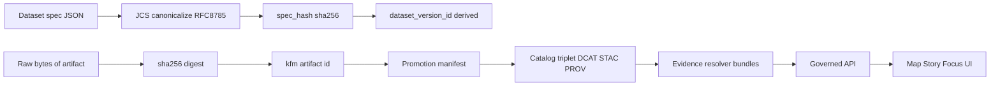

<!-- [KFM_META_BLOCK_V2]
doc_id: kfm://doc/9f6f7f33-5d33-4b66-8cf7-0e2d3a2f0a31
title: Identity and Hashing
type: standard
version: v1
status: draft
owners: TODO(kfm-owner)
created: 2026-03-01
updated: 2026-03-01
policy_label: public
related:
  - TODO(docs/architecture/overview/truth-path.md)
  - TODO(docs/architecture/overview/promotion-contract.md)
  - TODO(docs/architecture/overview/evidence-and-provenance.md)
tags: [kfm, architecture, identity, hashing, digests, provenance]
notes:
  - Deterministic IDs are required to make caching, citations, and reproducibility work.
  - This doc defines the minimum identity + hashing contract and how to test it (fail closed).
[/KFM_META_BLOCK_V2] -->

# Identity and Hashing
**Purpose:** Define how KFM assigns **stable identifiers** and computes **hashes/digests** so every artifact, catalog entry, and UI claim is reproducible, cacheable, and auditable.  
**Status:** draft • **Owners:** TODO • **Policy label:** public


---

## Navigation
- [Why this exists](#why-this-exists)
- [ID families and naming rules](#id-families-and-naming-rules)
- [Spec hashing](#spec-hashing)
- [Artifact digests](#artifact-digests)
- [Geometry hashing](#geometry-hashing)
- [Where hashes appear](#where-hashes-appear)
- [Hash drift prevention](#hash-drift-prevention)
- [CI gates](#ci-gates)
- [Examples](#examples)

---

## Why this exists

KFM must make identity **predictable**. If identity is unstable, we cannot:
- cache or invalidate correctly,
- sign/attest reliably,
- cite a specific dataset version,
- reproduce outputs and defend claims.

In KFM’s promotion model, **Identity & versioning** is a minimum gate: a dataset must have deterministic IDs, a stable `spec_hash`, and content digests before it can be promoted.  

> **Invariant:** stable dataset and version IDs based on canonical JSON hashing (RFC 8785 / JCS).

---

## ID families and naming rules

### Identifier families (canonical forms)

KFM uses explicit URI-like identifiers with stable prefixes (examples):

| Family | Example shape | Meaning |
|---|---|---|
| Dataset | `kfm://dataset/<dataset_slug>` | Logical dataset identity (no dates embedded). |
| Dataset version | `kfm://dataset/@<dataset_version_id>` | A specific version of a dataset. |
| Artifact | `kfm://artifact/sha256:<digest>` | Content-addressed artifact identity. |
| Run | `kfm://run/<run_id>` | A pipeline run / transformation activity. |
| Evidence | `kfm://evidence/<bundle_or_ref>` | Evidence bundles for cite-or-abstain UX. |
| Story | `kfm://story/@<story_id>` | Publishable Story Node identity. |

**Rule:** Avoid embedding environment-specific hostnames in canonical IDs. Hostnames belong in *distribution URLs*, not in canonical identifiers.

### Dataset slug conventions

**Dataset slug** is the stable, human-oriented part of dataset identity.

**Recommended rules:**
- lowercase
- words separated by underscore
- include upstream authority when helpful
- **do not include date in dataset slug** (date belongs to version)

Examples:
- `usgs_nwis_kansas`
- `noaa_ncei_storm_events`
- `fema_disaster_declarations`

> ⚠️ NOTE: Slugs are *names*, not versions. Don’t overload them.

---

## Spec hashing

### What is `spec_hash`?

`spec_hash` is the **deterministic hash** of the dataset’s **canonical specification**.
It is the anchor for “what we intended to build” and is used to derive or validate `dataset_version_id`.

A DatasetVersion should be derived from a canonical spec document that includes, at minimum:
- upstream source configuration (endpoints, query parameters)
- normalization rules
- validation rules
- output artifact plan
- policy label intent (proposed label)
- expected cadence

### Canonicalization requirement (JCS)

**Requirement:** `spec_hash` MUST be stable across platforms and programming languages.  
To achieve that, compute the hash from **canonical JSON** (RFC 8785 / JSON Canonicalization Scheme).

**Normative definition (minimum):**
- `spec_hash = sha256( JCS(spec_json) )`
- Represent it as: `sha256:<lowercase_hex>`

### Recommended `dataset_version_id` derivation

KFM requires that a dataset version be derived from the spec in a deterministic way.

**PROPOSED (buildable default):**
- `dataset_version_id = <yyyy-mm>.<spec_hash_prefix8>`
  - `yyyy-mm` is the *effective* version month (or a release window)
  - `spec_hash_prefix8` = first 8 hex chars of the sha256 digest

This keeps version IDs short but collision-resistant enough for practical use.

> ✅ CONFIRMED: `spec_hash` uses sha256 over canonical JSON (RFC 8785 / JCS).  
> ⚠️ PROPOSED: exact string format of `dataset_version_id` beyond being derived from `spec_hash`.

---

## Artifact digests

### What is an artifact digest?

An artifact digest is the **content hash** of a concrete file/blob (raw download, processed parquet, COG, PMTiles, JSON catalogs, etc.).

**Normative definition (minimum):**
- `digest = sha256(<raw bytes>)`
- Represent it as: `sha256:<lowercase_hex>`

### Content-addressed storage

KFM prefers **by-digest** storage to prevent accidental mutation and enable verification.

**Recommended staging layout (example):**
- `data/_staging/by-digest/sha256/<first2>/<full_digest>`

**Rules:**
- Inputs are immutable; transforms must not mutate inputs.
- Promotion manifests and receipts must reference artifacts by digest.
- If a blob changes, it is a *new artifact*, not a rewrite.

---

## Geometry hashing

Geometry is a common source of “hash drift” (coordinate precision, dimension changes, topology repairs, etc.).

### Two levels of geometry hashing (recommended)

1) **Byte-level geometry digest (strong):**  
Hash the canonical bytes of a geometry representation **after a deterministic normalization pipeline**.

2) **Semantic geometry fingerprint (weak but useful):**  
Hash a simplified or snapped geometry to reduce noise and detect meaningful changes.

### Normalization pipeline (PROPOSED)

When hashing geometry, apply the same steps everywhere (and test it):
- Force 2D (drop Z/M) if the dataset treats Z as non-semantic
- Snap to grid with a defined epsilon
- Serialize to a canonical binary form (e.g., WKB)
- Hash bytes

> ⚠️ NOTE: Some existing SQL recipes use `md5(...)` for convenience in *fingerprints*. That is acceptable for non-security “diff keys,” but **NOT** acceptable where cryptographic integrity or attestation depends on the digest. Prefer sha256 for integrity.

---

## Where hashes appear

KFM’s identity and hashing show up in the governance surfaces:

### Promotion Contract Gate A (Identity & versioning)

Promotion to PUBLISHED is blocked unless:
- `dataset_id` + `dataset_version_id` exist
- deterministic `spec_hash` exists
- content digests exist for promoted artifacts

### Receipts, PROV, and catalogs

The catalog/provenance “triplet” and receipts must cross-link and carry the hashes needed to verify:
- which run produced which artifact
- which inputs were used
- which digests correspond to the referenced content

**Minimal provenance keys used in KFM patterns:**
- `prov:wasGeneratedBy`
- `prov:used`
- `kfm:run_id`
- `kfm:artifact_digest`
- `kfm:attestation_uri`
- `kfm:source_license`
- `kfm:data_sensitivity`

---

## Hash drift prevention

Hash drift means: “same intent, different hash.” Drift breaks reproducibility and makes caches/signatures meaningless.

### Hash drift checklist (minimum)

- **Canonicalize specs** with RFC 8785 JCS (do not rely on pretty-printed JSON).
- **Pin tooling versions** used in canonicalization, hashing, and validation.
- Add a **spec_hash stability test** that runs in CI (golden vector).
- Ensure transforms are **pure**: inputs immutable, outputs written new by digest.
- Keep “diff hashes” (like md5 fingerprints) separate from “integrity digests” (sha256).
- Avoid embedding environment-specific URLs/paths into canonical IDs; store those as distribution metadata instead.

---

## CI gates

### Required CI checks (minimum, fail closed)

- **Schema validation** for dataset specs/receipts/manifests.
- **Policy tests** (deny by default).
- **spec_hash stability test**:
  - compute spec_hash in CI
  - compare to stored “golden” expected hash for the spec file(s)
- **Artifact digest verification** for outputs referenced by manifests/catalogs.
- **Catalog cross-link check** (DCAT/STAC/PROV referential integrity).

---

## Examples

### Example: Compute `spec_hash` in Node.js (TypeScript)

```ts
import { createHash } from "crypto";
// TODO: use an RFC8785 JCS library to canonicalize JSON deterministically.
import { canonicalize } from "json-canonicalize"; // example name; verify in repo

export function specHash(spec: unknown): string {
  const canonical = canonicalize(spec); // RFC8785 JCS string
  const hex = createHash("sha256").update(canonical, "utf8").digest("hex");
  return `sha256:${hex}`;
}
```

### Example: Compute an artifact digest (sha256) in Python

```py
import hashlib
from pathlib import Path

def sha256_file(path: str) -> str:
    h = hashlib.sha256()
    with open(path, "rb") as f:
        for chunk in iter(lambda: f.read(1024 * 1024), b""):
            h.update(chunk)
    return "sha256:" + h.hexdigest()

print(sha256_file("processed/events.parquet"))
```

### Example: Promotion manifest fields (illustrative)

```json
{
  "kfm_promotion_manifest_version": "v1",
  "dataset_slug": "example_dataset",
  "dataset_version_id": "2026-02.abcd1234",
  "spec_hash": "sha256:abcd1234...",
  "released_at": "2026-02-20T13:00:00Z",
  "artifacts": [
    { "path": "events.parquet", "digest": "sha256:2222...", "media_type": "application/x-parquet" }
  ]
}
```

---

## Architecture diagram



---

## Non-goals

- This doc does not define cryptographic signing/attestation formats (Cosign/SLSA).  
- This doc does not define every catalog field; it defines the **identity and hashing minimum** that other contracts must carry.

---

## Open questions (track as ADRs)

- Exact `dataset_version_id` format (beyond “derived from spec_hash”) if different domains need alternate schemes.
- Canonical geometry hashing standard for each geometry type (points vs polygons vs rasters).
- Whether to support alternate digests (e.g., blake3) as *secondary* digests while keeping sha256 as canonical.
