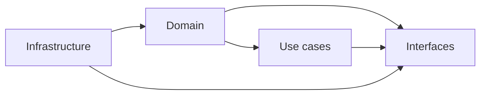
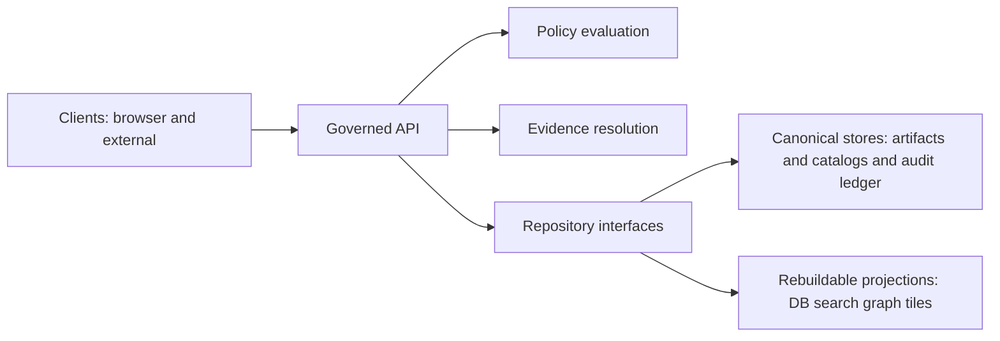
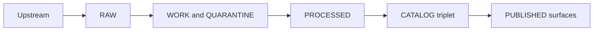

<!-- [KFM_META_BLOCK_V2]
doc_id: kfm://doc/5d2f21bf-8b90-4eaa-9c2a-0f3c89b8d0a4
title: Layering
type: standard
version: v1
status: draft
owners: TBD
created: 2026-03-01
updated: 2026-03-01
policy_label: public
related:
  - docs/architecture/overview/README.md
  - docs/architecture/overview/trust-membrane.md
  - docs/architecture/overview/truth-path.md
tags: [kfm, architecture, layering, trust-membrane, domain-driven]
notes:
  - Codifies the KFM layering posture: Domain → Use Cases → Interfaces → Infrastructure.
  - Defines dependency rules and CI enforcement expectations.
[/KFM_META_BLOCK_V2] -->

# Layering

**Purpose:** Define the KFM layering posture (**Domain → Use cases → Interfaces → Infrastructure**) and the dependency rules that preserve the **trust membrane** and **promotion contract** posture.

**Status:** draft • **Policy:** public • **Owners:** TBD

 <!-- TODO: replace with repo badge -->
 <!-- TODO: wire to docs status -->
 <!-- TODO: wire to policy docs -->

---

## Navigation

- [Why layering](#why-layering)
- [Layer responsibilities](#layer-responsibilities)
- [Dependency rules](#dependency-rules)
- [Trust membrane mapping](#trust-membrane-mapping)
- [Truth path as a cross-cutting lifecycle](#truth-path-as-a-cross-cutting-lifecycle)
- [Enforcement](#enforcement)
- [Common pitfalls](#common-pitfalls)
- [Appendix: Proposed folder mapping](#appendix-proposed-folder-mapping)

---

## Why layering

Layering is not “style.” In KFM it is a **governance control**:

- It prevents domain logic from bypassing policy/provenance by “reaching into” infrastructure.
- It keeps the **trust membrane** enforceable: clients never touch storage directly; runtime access is mediated by a governed API + policy evaluation + evidence resolution.
- It keeps the system rebuildable: canonical stores remain canonical, and projections can be regenerated without losing source truth.

> **Invariant:** domain logic never talks directly to infrastructure. It talks through interfaces.

---

## Layer responsibilities

This section is normative. Implementations may vary, but responsibilities and dependency direction are stable.

### Domain

**What lives here**
- Pure domain models and rules (examples: `Dataset`, `DatasetVersion`, `Artifact`, `EvidenceRef`, `EvidenceBundle`, `PolicyDecision`, `RunReceipt`, `StoryNodeVersion`, etc.).

**What must NOT live here**
- Database clients, HTTP clients, filesystem access, cloud SDKs, OPA HTTP calls, UI state, or framework glue.

**Outputs**
- Deterministic domain decisions, validated domain objects, error types suitable for mapping to policy-safe API responses.

---

### Use cases

**What lives here**
- Application workflows that orchestrate domain rules, *through interfaces*.
- Examples of use cases: ingest dataset, promote dataset version, publish story node, answer a focus query.

**What must NOT live here**
- SQL strings, HTTP route handlers, React components, Kubernetes manifests.

**Outputs**
- Use-case results (success/failure) plus structured audit context suitable for receipts/logging.

---

### Interfaces

**What lives here**
- Contracts and boundaries:
  - DTOs / schema registries / OpenAPI shapes (contract-first)
  - Policy adapter interfaces
  - Repository interfaces
  - Evidence resolution interfaces

**What must NOT live here**
- Concrete PostGIS queries, S3/GCS code, OPA client code (those are infrastructure implementations).

**Outputs**
- Stable interfaces and contract tests that infrastructure must satisfy.

---

### Infrastructure

**What lives here**
- Concrete implementations and operational wiring:
  - PostGIS, object storage, graph/search, tiles, CI runners, deployment artifacts
  - Policy engine integration (OPA/Rego adapter)
  - Catalog parsing/validation tooling
  - HTTP server wiring and routing

**What must NOT live here**
- Business rules that “decide outcomes” without going through domain/use case logic.

**Outputs**
- Working systems that satisfy interfaces + provide observability + emit receipts.

---

## Dependency rules

### The only allowed dependency directions

**Interpretation**
- `Domain` depends on nothing.
- `Use cases` can depend on `Domain` and `Interfaces`.
- `Interfaces` can depend on `Domain` (types).
- `Infrastructure` implements `Interfaces` and may depend on `Domain` types, but must not contain domain decision logic.

### “No bypass” rule

- **UI** must not access storage directly.
- **API handlers** must not implement domain rules in controllers/routes.
- **Infrastructure** must not call into storage in ways not represented as interface methods.

> If you can’t express it as an interface method, it probably doesn’t belong in a governed system.

---

## Trust membrane mapping

Layering supports the runtime **trust membrane** boundary:

**Key intent**
- The governed API (PEP) is where **policy decisions** and **evidence resolution** are enforced, so clients never need privileged access.

---

## Truth path as a cross-cutting lifecycle

Layering is code structure; the truth path is **data lifecycle**. They connect at “promotion” and “publishing.”

**Notes**
- **RAW is append-only**: do not edit raw; supersede with a new acquisition.
- **QUARANTINE blocks promotion** when validation/licensing/sensitivity are unclear.
- **PUBLISHED** surfaces may only serve promoted dataset versions with processed artifacts, validated catalogs, run receipts, and policy label assignment.

---

## Enforcement

Layering must be enforced by tests and review gates (not by “remembering”).

### Required checks (minimum)

- **Architecture boundary tests:** fail builds when forbidden dependencies appear (domain importing DB client, UI importing secrets, etc.).
- **Contract tests:** interfaces must be satisfied; OpenAPI/schema must validate.
- **Policy tests:** default-deny posture for protected resources; fixture-driven expectations.
- **Evidence resolution smoke:** at least one EvidenceRef must resolve in CI for promoted dataset versions.

### PR review checklist (copy/paste)

- [ ] No new direct client-to-storage paths were introduced.
- [ ] Domain code did not import infrastructure/framework packages.
- [ ] Use case code calls storage only via repository interfaces.
- [ ] New endpoints map to use cases; they do not encode business logic in handlers.
- [ ] Any new promotion/publish behavior is covered by receipt/audit assertions.

---

## Common pitfalls

- **“Convenient” DB calls from controllers:** breaks policy + provenance.
- **Domain types leaking UI concerns:** e.g., React state or view formatting in core models.
- **Silent fallback behavior:** when evidence/policy is unclear, the system must fail closed (block promotion / abstain).
- **Treating projections as canonical:** PostGIS/search/graph/tiles must remain rebuildable; canonical truth is artifacts + catalogs + audit ledger.

---

## Appendix: Proposed folder mapping

This mapping is a recommendation pattern, not a claim about current repo state.

| Layer | Typical home | Notes |
|---|---|---|
| Domain | `packages/domain/` | Pure types + rules. |
| Use cases | `packages/usecases/` | Or `packages/app/` depending on conventions. |
| Interfaces | `contracts/`, `packages/interfaces/` | OpenAPI, schemas, repository/policy/evidence interfaces. |
| Infrastructure | `apps/*`, `infra/`, `packages/*-infra/` | PostGIS, HTTP server, policy adapters, CI/deploy. |

> If the repo layout differs, keep the dependency rules and responsibilities; adapt folder names to match conventions.

---

Back to top: [Navigation](#navigation)
