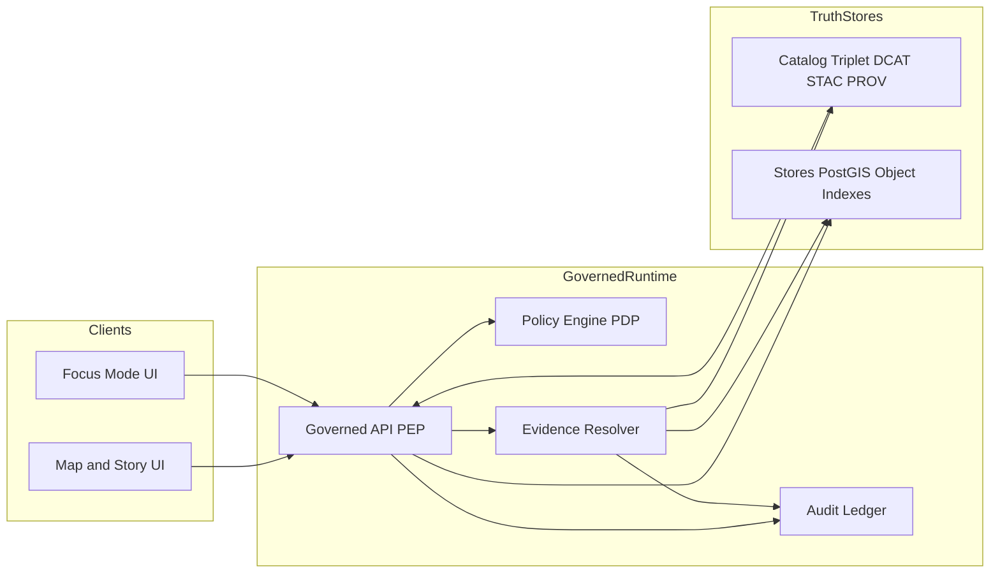

<!-- [KFM_META_BLOCK_V2]
doc_id: kfm://doc/b9fa5f63-2b77-4db5-8b1a-3dd4fb0a6e18
title: Policy Boundary and Trust Membrane
type: standard
version: v1
status: draft
owners: KFM Core
created: 2026-03-01
updated: 2026-03-01
policy_label: public
related:
  - docs/architecture/overview/README.md
  - docs/architecture/overview/truth-path.md
  - docs/governance/policy-as-code.md
  - docs/governance/promotion-contract.md
tags: [kfm, architecture, governance, policy, trust-membrane]
notes:
  - Defines the KFM policy boundary as an enforceable architecture seam (runtime + CI).
  - Normative language: MUST/SHOULD/MAY.
[/KFM_META_BLOCK_V2] -->

# Policy Boundary and Trust Membrane
**Purpose:** Define the **enforceable policy boundary** that prevents policy bypass and ensures every user-visible claim remains **evidence-backed**, **rights-aware**, and **sensitivity-safe**.


---

## Quick navigation
- [Scope](#scope)
- [Core definitions](#core-definitions)
- [Non-negotiable invariants](#non-negotiable-invariants)
- [Where the policy boundary lives](#where-the-policy-boundary-lives)
- [Reference architecture](#reference-architecture)
- [Runtime request lifecycle](#runtime-request-lifecycle)
- [CI and Promotion Contract alignment](#ci-and-promotion-contract-alignment)
- [Obligations and redaction](#obligations-and-redaction)
- [Failure modes](#failure-modes)
- [Tests and gates](#tests-and-gates)
- [Minimum verification steps](#minimum-verification-steps)
- [Appendix](#appendix)

---

## Scope
This document covers:

**In scope**
- The **trust membrane**: “clients never access storage directly; all access is policy-evaluated.”
- The **policy boundary** across:
  - runtime APIs (PEP),
  - evidence resolution (EvidenceRef → EvidenceBundle),
  - publishing workflows (Story Nodes, Focus Mode),
  - and CI (policy-as-code, fixtures, contract tests).
- Required **failure-closed** behaviors (deny-by-default, policy-safe errors, abstention when unsupported).

**Out of scope**
- Kubernetes/terraform manifests, cluster RBAC specifics, and deployment topology details (belong in `docs/infra/`).
- Dataset-specific rules (belong in dataset specs / policy pack fixtures).
- UI component implementation details beyond the “UI never decides policy” rule.

---

## Core definitions

### Policy boundary
The **policy boundary** is the enforceable seam that separates:
- **unguarded data/stores** (object store, PostGIS, indexes) and
- **governed runtime surfaces** (API responses, tiles, exports, Story Nodes, Focus Mode answers).

The boundary is enforced by:
1) a **Policy Decision Point (PDP)**, and  
2) one or more **Policy Enforcement Points (PEPs)** (runtime + CI), and  
3) an **evidence resolver** that applies policy and obligations before anything becomes “citable.”

### Trust membrane
The **trust membrane** is the architecture invariant that:
- forbids any direct client → DB/object-store access, and
- requires all client-visible access to traverse policy evaluation at the PEP.

### PDP / PEP
- **PDP (Policy Decision Point):** evaluates requests and returns allow/deny + obligations.
- **PEP (Policy Enforcement Point):** blocks/permits access and applies obligations.

> **Rule:** UI may *display* policy outcomes (badges/notices), but **UI MUST NOT make policy decisions**.

### EvidenceRef / EvidenceBundle
- **EvidenceRef:** structured reference to a dataset version + resolvable artifact(s) and/or lineage records.
- **EvidenceBundle:** inspectable payload produced by the evidence resolver containing the evidence,
  required metadata (license/rights), provenance hooks, and **applied redactions/obligations**.

> **Rule:** A “citation” in KFM is not a pasted URL; it is a **resolvable reference**.

### Obligations
**Obligations** are mandatory transformations or constraints returned with an allow decision, e.g.:
- geometry generalization,
- field-level redaction,
- license attribution injection,
- export restriction,
- cache-variation constraints.

---

## Non-negotiable invariants

### INV-001 — No bypass
Clients **MUST NOT** access DB/object stores/indexes directly. Only governed APIs (and their controlled backends) may read stores.

### INV-002 — Default deny
If policy, rights, or citation resolvability is unclear, the system **MUST** deny the request, block promotion, or abstain.

### INV-003 — Evidence-first, resolvable citations
Every user-facing claim in Story/Focus surfaces **MUST** be backed by resolvable evidence bundles tied to specific dataset versions.

### INV-004 — Shared semantics in CI and runtime
CI policy tests and runtime policy checks **MUST** share the same semantics (or at minimum the same fixtures + outcomes), or CI is meaningless.

### INV-005 — Policy-safe errors
Errors **MUST NOT** leak restricted dataset existence, sensitive metadata, or precise coordinates via:
- response bodies,
- status-code differences,
- or “helpful” error messages.

---

## Where the policy boundary lives

### Boundary surface map
| Surface | Role | Enforces | Notes |
|---|---|---|---|
| **Governed API (PEP)** | primary runtime policy boundary | authZ + obligations + policy-safe errors | all reads/exports/tiles go through here |
| **Evidence Resolver** | citation boundary | EvidenceRef → EvidenceBundle + redaction | the only “truth source” for citations |
| **Story publishing pipeline** | publication boundary | citation resolvability + rights + review state | fail closed if unclear |
| **Focus Mode** | governed Q&A boundary | pre-check + admissible retrieval + hard citation verification | abstains if unsupported |
| **CI gates** | enforcement boundary before merge/publish | policy pack tests + schema validation + link checks | blocks regressions |

---

## Reference architecture



**Interpretation**
- The **PEP** is the single choke point for client access.
- The **PDP** issues decisions + obligations.
- The **Evidence Resolver** is the single choke point for citations and inspection.

---

## Runtime request lifecycle

### 1) Build policy context
At minimum, construct:
- caller identity + roles,
- request intent (read/query/export/tile),
- dataset + dataset_version targets,
- view_state context (bbox/time window) when present.

### 2) PDP decision
Call the PDP to obtain:
- allow/deny
- obligations (redactions, generalization, export constraints, cache variation requirements)

### 3) Enforce at PEP
If denied:
- return a policy-safe error (do not reveal whether a restricted thing exists).

If allowed:
- apply obligations and continue.

### 4) Evidence handshake (for any citable output)
If the response includes citations (Story/Focus), the system MUST:
- convert citations to EvidenceRefs,
- resolve each EvidenceRef via the evidence resolver,
- drop any citation that cannot be resolved or is policy-denied,
- and if remaining evidence can’t support the response → **abstain or narrow scope**.

### 5) Produce audit record
Log enough to reproduce and review:
- request summary,
- dataset versions + digests referenced,
- policy decisions + obligations applied,
- output hash and timestamps.

---

## CI and Promotion Contract alignment

KFM enforces policy at two levels:

### CI as PEP
CI blocks changes that would let policy drift or bypass slip in:
- schema validation
- policy fixture tests
- catalog linkchecks
- contract tests on governed API routes

### Promotion to governed runtime
Promotion is the transition to runtime surfaces.
Policy is enforced by requiring:
- **policy labels**
- **obligations/redaction plan**
- catalogs + provenance links that make EvidenceRefs resolvable
- receipts/audit records

> **Key principle:** “Promotion” is how governance intent becomes enforceable behavior.

---

## Obligations and redaction

### Default sensitivity rules (baseline posture)
- deny-by-default for sensitive-location and restricted datasets
- if a public representation is allowed, publish a separate **public generalized** dataset version
- never embed precise coordinates in Story or Focus outputs unless policy explicitly allows
- treat redaction/generalization as a first-class transform recorded in provenance

### Common obligation patterns
| Obligation | Applies to | Example outcome |
|---|---|---|
| geometry generalization | queries, tiles, exports, story/focus | point → 1 km grid cell; bbox coarsening |
| field redaction | attributes, evidence bundles | remove owner_name, exact_site_id, etc. |
| rights enforcement | downloads, exports, UI embeds | deny export; force attribution; metadata-only reference |
| cache variation | tiles, API caching | cache key includes policy context / auth tier |
| evidence narrowing | focus/story | drop unresolvable citations and regenerate |

---

## Failure modes

### Fail-closed rules
The system MUST fail closed when:
- policy denies,
- rights are unknown,
- citations can’t resolve,
- obligations can’t be applied safely,
- catalog/provenance links are broken.

### Policy-safe errors (do not leak)
Avoid revealing:
- whether a restricted dataset exists,
- whether a coordinate matches a sensitive feature,
- restricted metadata (even counts can leak).

---

## Tests and gates

### Required gates (high level)
- **Policy pack + fixture tests:** default-deny behaviors and obligations correctness.
- **Evidence resolution tests:** EvidenceRef → EvidenceBundle must enforce policy and never leak restricted content.
- **End-to-end UI bypass tests:** frontend cannot fetch directly from stores; only the PEP is reachable.
- **Focus Mode hard gate:** every citation resolves and is allowed; otherwise abstain/narrow.

### Threat model checklist (starter)
- Frontend fetches directly from storage/DB? **NO**
- Backend bypasses repository interfaces? **NO**
- Restricted dataset inference via errors/timing? **Mitigated**
- Exports include license + attribution automatically? **YES**
- Story publishing blocks if rights/citations unclear? **YES**
- Focus Mode prompt-injection defenses present? **YES**
- Audit logs access-controlled and redacted? **YES**
- Deterministic hashing recomputable in CI? **YES**

---

## Minimum verification steps

If repo reality differs from this architecture description, do not guess—verify and record outputs.

Minimum checks (attach to the next PR as artifacts):
- capture repo commit hash + root directory tree
- enumerate CI gates from workflows and identify which are merge-blocking
- confirm policy pack existence and fixture coverage (allow/deny + obligations)
- validate UI cannot bypass PEP (static analysis + network policies)
- run one dataset end-to-end through promotion gates and confirm:
  - catalogs cross-link,
  - EvidenceRefs resolve,
  - policy filtering works,
  - and receipts are written.

---

## Appendix

### Directory placement (documentation contract)
This file belongs in:

```text
docs/
  architecture/
    overview/
      policy-boundary.md   <-- this doc
```

**Acceptable additions here**
- diagrams, invariants, checklists
- PEP/PDP/EvidenceResolver conceptual contracts
- failure-closed rules and tests

**Exclusions**
- raw policy rules (put under `policy/`)
- infra manifests (put under `infra/`)
- dataset-specific redaction logic (put in dataset specs + policy fixtures)

---

### Back to top
[↑ Back to top](#policy-boundary-and-trust-membrane)
