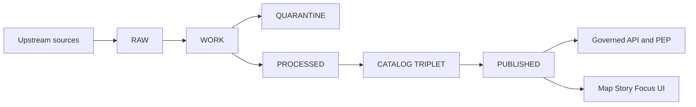

<!-- [KFM_META_BLOCK_V2]
doc_id: kfm://doc/e6258f2d-9bfa-4251-82d6-ae05cee96427
title: Promotion Contract
type: standard
version: v1
status: draft
owners: Data Platform, Governance
created: 2026-03-01
updated: 2026-03-01
policy_label: public
related:
  - docs/architecture/overview/README.md  # TODO: verify path exists
  - docs/governance/ROOT_GOVERNANCE.md   # TODO: verify path exists
  - docs/standards/KFM_DCAT_PROFILE.md   # TODO: verify path exists
  - docs/standards/KFM_STAC_PROFILE.md   # TODO: verify path exists
  - docs/standards/KFM_PROV_PROFILE.md   # TODO: verify path exists
tags: [kfm, architecture, governance, promotion, provenance, policy]
notes:
  - Derived from KFM vNext governance snapshots (2026-02-20) + delivery plan (2026-02-27).
  - Repo paths are placeholders until verified against the current branch.
[/KFM_META_BLOCK_V2] -->

# Promotion Contract

> The **Promotion Contract** is the enforceable gate that turns governance intent into system behavior:  
> **Raw/Work** artifacts become **Processed + Catalog/Lineage**, and only then may appear in **governed runtime surfaces**.

**Owners:** Data Platform + Governance  
**Last updated:** 2026-03-01  
**Applies to:** Every *DatasetVersion* served by the API/UI (Map, Story, Focus).

**Jump to:** [Why this exists](#why-this-exists) · [Truth path](#truth-path) · [Zones](#zones) · [Gates](#promotion-contract-v1-minimum-gates) · [PR workflow](#pr-based-promotion-workflow) · [DoD](#definition-of-done-dataset-integration-ticket) · [Verification](#minimum-verification-steps) · [Glossary](#glossary)

---

## Why this exists

The Promotion Contract is **not optional ceremony**. It is the mechanism that makes KFM:

- **Auditable** (every output has lineage + receipts)
- **Citeable** (stable IDs + resolvable EvidenceRefs)
- **Safe** (policy labels + obligations enforced; default-deny when unclear)
- **Reproducible** (deterministic specs, digests, and run receipts)

### Non-goals

This doc **does not** define dataset-specific QA thresholds, schemas, or ingestion logic. Those belong in each dataset’s onboarding spec / registry entry (location in repo is **TBD**).

---

## Where this fits in the repo

- This file lives in `docs/architecture/overview/` and defines the **architecture-level contract** for promotion.
- Dataset teams should link to this doc from:
  - their dataset onboarding spec
  - their pipeline runbook
  - their release/promotion PR template

> **NOTE**
> Paths referenced in this document are **placeholders** until verified against the current repo tree.

---

## Truth path

KFM has a storage-and-validation “truth path.” Promotion gates apply at each transition, and the catalog “triplet” must cross-link identifiers so that **EvidenceRefs resolve**.

### Trust membrane constraint

Promotion only matters if runtime access is governed:

- clients must not access storage/DB directly
- all access must pass through policy enforcement + evidence resolution
- logs/receipts must be generated consistently

---

## Zones

The zones below are **storage + governance semantics** (not just folder names).

| Zone | Mutability | Typical contents | Allowed exits |
|---|---|---|---|
| **RAW** | Immutable, append-only | Acquisition manifest, raw artifacts, checksums, minimal metadata (including license/terms snapshot) | RAW ➜ WORK (normalization) |
| **WORK** | Mutable | Intermediate transforms, QA reports, candidate redactions/generalizations, provisional entity resolution outputs | WORK ➜ PROCESSED (if gates met) / WORK ➜ QUARANTINE |
| **QUARANTINE** | Mutable but **blocked** | Failed validation, unclear licensing, sensitivity concerns, upstream instability (non-reproducible acquisition) | QUARANTINE ➜ WORK (after remediation) |
| **PROCESSED** | Immutable (for promoted versions) | Publishable artifacts (GeoParquet, PMTiles, COG, etc.), checksums for each artifact, derived runtime metadata | PROCESSED ➜ CATALOG/TRIPLET |
| **CATALOG/TRIPLET** | Immutable per version | Cross-linked **DCAT + STAC + PROV** records + run receipts | CATALOG/TRIPLET ➜ PUBLISHED |
| **PUBLISHED** | Governed | Runtime surfaces (API responses, tiles, story pages, Focus answers) served only for promoted versions | Served through PEP/API only |

> **Fail-closed rule:** QUARANTINE items are not promoted. If licensing or sensitivity is unclear, the item must remain quarantined until governance review resolves it.

---

## Promotion Contract v1: minimum gates

A DatasetVersion promotion **MUST be blocked** unless all required artifacts exist and validate.

### Gate table

| Gate | Required evidence | Fail-closed behavior | Typical automation hooks |
|---|---|---|---|
| **A — Identity & versioning** | Stable `dataset_id`; immutable `dataset_version_id` derived from a stable `spec_hash` (deterministic) | Any missing/unstable identity blocks promotion | Schema validation + “spec_hash stability” test |
| **B — Licensing & rights metadata** | Explicit license; rights holder; attribution requirements; snapshot of upstream terms | Unknown/unclear license ⇒ **QUARANTINE** | “license guard” CI check; block merges when missing |
| **C — Sensitivity & redaction plan** | `policy_label` assigned; obligations recorded; if sensitive-location/restricted data: redaction/generalization plan captured in lineage | Unknown sensitivity ⇒ **QUARANTINE**; policy tests must default-deny | OPA/Rego tests; redaction obligation checks |
| **D — Catalog triplet validation** | DCAT record + STAC collections/items (if applicable) + PROV bundle exist, validate, and **cross-link** | Broken links or invalid catalogs block promotion | Catalog validators + link checker; “EvidenceRef resolve” smoke test |
| **E — Run receipt & checksums** | `run_receipt` exists for each producing run; inputs + outputs enumerated with checksums; environment recorded (container digest, parameters) | Missing/invalid receipts block promotion | Receipt schema validation; digest verification |
| **F — Policy tests & contract tests** | Policy fixtures pass for this DatasetVersion; Evidence resolver resolves representative EvidenceRefs in CI; API contracts/schemas validate | Any failing contract/policy test blocks promotion | OPA tests; resolver integration test; contract tests |
| **G — Optional but recommended** | Supply-chain provenance (SBOM/attestations), perf smoke checks (tiles/resolve latency), accessibility smoke checks | If enabled, failures block promotion | Cosign/SLSA verify; perf/a11y CI smokes |

### Implementation note: QA thresholds and release manifests

Some implementation plans treat **QA thresholds** and a **release manifest** as explicit gates in CI (e.g., “promotion recorded as a release manifest referencing artifacts and digests”). If your repo adopts that pattern:

- add a dedicated “QA thresholds” step that fails closed when thresholds are unmet
- always produce a release manifest for rollback and provenance

Treat this as **policy-configurable**: once enabled, it must be CI-enforced.

---

## PR-based promotion workflow

The following workflow is a **PROPOSED** default for making promotion both social (review) and technical (CI):

1. **Contributor opens PR** adding:
   - source registry entry
   - pipeline spec
   - fixture data (small sample) + expected outputs
2. **CI runs gates**:
   - schema validation
   - policy tests
   - spec_hash stability test
   - catalog link checks
3. **Steward review**:
   - licensing and sensitivity assessment
   - approve policy label assignment
4. **Operator merges** and triggers pipeline run in a controlled environment.
5. **Outputs are written** to PROCESSED + CATALOG/TRIPLET.
6. **Release manifest** is created and tagged.

> This workflow ensures promotion is never ad hoc: it is documented, reviewed, and reproducible.

---

## Evidence-first UX requirement

Published layers and story claims must be openable into an evidence view that, at minimum, can show:

- Evidence bundle ID + digest
- DatasetVersion ID + dataset name
- License and rights holder (with attribution text)
- Freshness (last run timestamp) and validation status
- Provenance chain (run receipt link)
- Redactions applied (obligations), with user-facing explanation

Promotion is what makes these fields consistently available.

---

## Definition of Done: dataset integration ticket

A dataset integration is **DONE** only when:

- Registry entry updated (owner, license, `policy_label`, cadence, contact).
- RAW acquisition artifacts immutable with manifest + checksums.
- Processed artifacts present with digests and predictable paths.
- DCAT + STAC + PROV schema-valid and cross-linked; link checks succeed.
- Policy decisions recorded; default-deny tests pass; generalized derivatives created if needed.
- Evidence resolver resolves representative EvidenceRefs into EvidenceBundles.
- UI smoke tests: evidence drawer resolves selections; restricted layers denied/generalized.
- Audit: run receipt emitted; audit ledger append; access controls verified.

---

## Minimum verification steps

Before treating this contract as enforced in *this* repo, verify the following (smallest checks that convert “unknown” into “confirmed”):

- [ ] Capture current commit hash + root directory tree (`git rev-parse HEAD`, `tree -L 3`).
- [ ] Confirm which pipeline and policy modules exist (look for: `spec_hash`, OPA policies, validators, evidence resolver route, dataset registry schema).
- [ ] Extract CI gate list from `.github/workflows` and document which checks are merge-blocking.
- [ ] Pick one MVP dataset and prove it promotes through all gates with receipts + catalogs.
- [ ] Verify UI cannot bypass policy enforcement and that EvidenceRefs resolve end-to-end in Map Explorer and Story publishing.

---

## Glossary

- **Dataset**: logical dataset identity (e.g., “NOAA Storm Events”).  
- **DatasetVersion**: immutable promoted version of a dataset (a dataset has many versions over time).  
- **Artifact**: concrete file/object (GeoParquet, PMTiles, COG, JSON, PDF) produced by a run and referenced by catalogs.  
- **EvidenceRef**: stable reference scheme (e.g., `dcat://`, `stac://`, `prov://`, `doc://`, `graph://`) that the resolver can resolve without guessing.  
- **EvidenceBundle**: the resolved evidence payload returned to humans and machines; should be immutable by digest.  
- **Run receipt**: record emitted per run with inputs, outputs, environment, validation results, and policy decisions.  
- **Audit ledger**: append-only log of run receipts and relevant decisions (itself governed/redacted as needed).  
- **Policy label**: primary access-control + sensitivity classification input; evaluation returns allow/deny plus obligations.

---

## References (human)

- *Kansas Frontier Matrix (KFM) — Definitive Design & Governance Guide (vNext)*, snapshot date 2026-02-20.
- *Kansas Frontier Matrix (KFM) — Architecture, Governance, and Delivery Plan*, 2026-02-27.

---

[Back to top](#promotion-contract)
