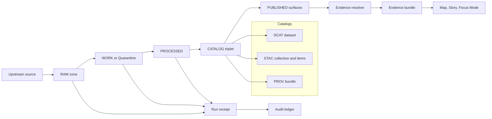

<!-- [KFM_META_BLOCK_V2]
doc_id: kfm://doc/8e1c50b3-7c9a-4c2e-b2d1-7d3f3f9c9c6c
title: Provenance and Audit
type: standard
version: v1
status: draft
owners: kfm-architecture
created: 2026-03-01
updated: 2026-03-01
policy_label: public
related:
  - kfm://concept/truth-path
  - kfm://concept/trust-membrane
  - kfm://concept/promotion-contract
  - kfm://concept/evidence-bundle
tags: [kfm, architecture, provenance, audit]
notes:
  - This document defines the provenance + audit contract surfaces (DCAT/STAC/PROV + run receipts) that make KFM evidence-first and reproducible.
  - Validate field names and storage paths against the live repo schemas before treating as implementation truth.
[/KFM_META_BLOCK_V2] -->

<a id="top"></a>

# Provenance and Audit
Evidence-first lineage and append-only audit for the KFM truth path.


> **Contract summary (normative):**
> KFM MUST be able to answer, for any user-visible claim or artifact: **what it is, where it came from, how it was produced, under what policy decision it is shown, and how to reproduce it**.

---

## Quick navigation
- [Scope and non-goals](#scope-and-non-goals)
- [Architecture invariants](#architecture-invariants)
- [Provenance model](#provenance-model)
- [Run receipts](#run-receipts)
- [Audit ledger](#audit-ledger)
- [Evidence resolver integration](#evidence-resolver-integration)
- [Promotion contract hooks](#promotion-contract-hooks)
- [Security, privacy, and redaction](#security-privacy-and-redaction)
- [Implementation guidance](#implementation-guidance)
- [Verification checklist](#verification-checklist)

---

## Scope and non-goals

### Scope
This document specifies the **minimum provenance and audit surfaces** required for KFM to remain:
- **Governed** (policy is always applied at the boundary),
- **Evidence-first** (every map layer + story claim can be opened into evidence),
- **Reproducible** (runs can be re-executed with the same inputs + tooling to produce the same digests),
- **Auditable** (every run and Focus Mode answer emits an append-only receipt).

### Non-goals
- Selecting a specific provenance storage engine (file-based, database, ledger service).
- Defining a full enterprise compliance program (SOC2, HIPAA, etc.).
- Defining every domain ontology term; this doc covers *provenance + audit* only.

---

## Architecture invariants

These invariants are treated as **hard rules**. If any are broken, provenance cannot be trusted.

### Trust membrane (CONFIRMED)
- Frontend and external clients **never** access databases or object storage directly.
- All access to datasets, evidence, and receipts flows through **governed APIs** which apply:
  - authorization,
  - redaction / generalization obligations,
  - and consistent logging.

> **Why:** if clients can bypass the governed API, then audit records become incomplete and policy can be evaded.

### Canonical vs rebuildable stores (CONFIRMED)
- **Canonical**: object storage + catalogs + provenance are the source of truth.
- **Rebuildable**: search indexes and databases are projections that MUST be rebuildable from promoted artifacts.

### Deterministic identity and hashing (CONFIRMED)
- Dataset identity and version identity MUST be stable.
- `spec_hash` SHOULD be computed from **canonical JSON** (RFC 8785 JCS recommended) to prevent *hash drift*.

---

## Provenance model

KFM provenance is designed as **contract surfaces**, not an afterthought. The minimum model is:

- **DCAT**: dataset-level catalog (who/what/rights/how to access).
- **STAC**: asset-level spatiotemporal catalog (where/when/geometry/assets/checksums).
- **PROV**: lineage graph (inputs → activities → outputs, plus agents and policy decisions).

### Conceptual flow


### Minimum PROV profile (minimum required fields)
**KFM PROV MUST include:**
- `prov:Activity` per pipeline run (and per Focus Mode query run).
- `prov:Entity` per artifact (raw, work, processed, catalog).
- `prov:Agent` entries for:
  - pipeline software identity (service principal + version),
  - and steward approval events (human principal) when applicable.
- Edges:
  - `prov:used` (activity used entity),
  - `prov:wasGeneratedBy` (entity generated by activity).
- Policy linkage:
  - reference to a **policy decision** (decision id + obligations) that governed the run output.
- Environment capture:
  - container image digest,
  - git commit,
  - parameters digest (or canonicalized params).

> NOTE: The goal is not “maximum metadata.” The goal is **minimum reproducibility and trust**.

### Cross-linking rules (MUST be testable)
Catalog objects MUST cross-link deterministically:
- DCAT dataset → distributions → artifact digests.
- DCAT dataset → link to the PROV bundle (lineage).
- STAC collection → link `rel="describedby"` → DCAT dataset.
- STAC item → link to PROV activity and/or run receipt.
- EvidenceRef schemes MUST resolve into these objects **without guessing**.

---

## Run receipts

Run receipts are the **universal audit unit** in KFM: every pipeline run and every Focus Mode query MUST emit one.

### What a run receipt is
A run receipt is a machine-readable record of:
- **who** executed something (actor),
- **what** operation ran,
- **what inputs** were used,
- **what outputs** were produced,
- **what environment** executed it,
- **what validation** happened,
- and **what policy decision** applied.

### Run receipt template (KFM v1)
This is a suggested JSON structure. Field names SHOULD remain stable once adopted because receipts are part of the public trust surface.

```json
{
  "run_id": "kfm://run/2026-03-01T18:30:00Z.9f2c",
  "actor": {
    "principal": "svc:pipeline",
    "role": "pipeline"
  },
  "operation": "ingest+promote",
  "subject": {
    "dataset_id": "kfm://dataset/example",
    "dataset_version_id": "kfm://dataset_version/2026-03.9f2c",
    "zone_target": "PROCESSED"
  },
  "inputs": [
    {
      "uri": "raw/upstream/source.csv",
      "digest": "sha256:1111...",
      "observed_at": "2026-03-01T18:00:00Z"
    }
  ],
  "outputs": [
    {
      "uri": "processed/example.parquet",
      "digest": "sha256:2222...",
      "media_type": "application/parquet"
    }
  ],
  "environment": {
    "container_digest": "sha256:img...",
    "git_commit": "deadbeef...",
    "params_digest": "sha256:3333..."
  },
  "validation": {
    "status": "pass",
    "report_digest": "sha256:7777..."
  },
  "policy": {
    "decision_id": "kfm://policy_decision/xyz",
    "policy_label": "public",
    "obligation_digests": ["sha256:aaaa..."]
  },
  "created_at": "2026-03-01T18:35:00Z"
}
```

### Receipt invariants
- Receipts MUST be **append-only** (no in-place edits).
- Receipts MUST be **addressable**:
  - by `run_id`,
  - and (ideally) by a content digest for integrity and caching.
- Receipts MUST NOT require privileged access to interpret:
  - a user can see “what happened” without needing admin access,
  - while restricted fields (e.g., sensitive URIs) are redacted by policy.

---

## Audit ledger

### What the audit ledger is
The audit ledger is an append-only dataset of run receipts (and optional derived indexes) used to support:
- provenance navigation,
- operational debugging,
- governance review,
- and reproducibility proofs.

KFM treats the audit ledger as a **governed dataset** with its own policy label(s).

### Ledger query needs (minimum)
The governed API SHOULD support queries by:
- `run_id`
- `dataset_version_id`
- `dataset_id`
- actor principal / role
- time window (created_at)
- operation type (ingest, transform, promote, focus_query, index_rebuild)

### Integrity & attestation (PROPOSED)
To harden the ledger:
- Receipts MAY be signed (Sigstore/cosign or equivalent).
- Promotions MAY require a steward attestation referencing:
  - the receipt digest,
  - and the promotion manifest digest.

---

## Evidence resolver integration

### EvidenceRef schemes (minimum set)
EvidenceRef is a stable pointer that can appear in:
- map feature properties,
- story claim citations,
- and Focus Mode answers.

Minimum schemes (examples):
- `dcat://…` (dataset/distribution-level evidence)
- `stac://…` (asset-level evidence)
- `prov://…` (lineage evidence)
- `doc://…` (document evidence)
- `graph://…` (knowledge-graph evidence)

### EvidenceBundle requirements
The evidence resolver MUST:
1. Accept an EvidenceRef (scheme URI) or structured ref (dataset_version + record id + span).
2. Apply policy and return `allow/deny` plus obligations.
3. Return an EvidenceBundle containing:
   - human view (renderable evidence card),
   - machine metadata (JSON),
   - dataset_version ids + digests,
   - artifact links (only if allowed),
   - audit references (run receipt ids/digests).

**UX constraint:** evidence resolution SHOULD be achievable in **≤ 2 calls** from the UI:
- click feature → resolve evidence → view bundle
- click citation → resolve evidence → view the same bundle

> WARNING: If evidence takes more than a couple steps, users stop trusting it (and stop using it).

---

## Promotion contract hooks

Promotion is the boundary where KFM moves from “work in progress” to “governed runtime.” Provenance + audit are mandatory gates.

### Gates that provenance/audit must satisfy
**Promotion MUST be blocked unless:**
- Identity and versioning exist (dataset_id + dataset_version_id + deterministic `spec_hash` + digests).
- Catalog triplet validates and cross-links (DCAT/STAC/PROV).
- EvidenceRef resolution succeeds without guessing.
- A run receipt exists capturing inputs, tooling, hashes, validation, and policy decision.
- An audit record is appended (ledger is updated).

### CI checks (minimum)
CI SHOULD fail closed on:
- JSON schema validation for DCAT/STAC/PROV profiles.
- Link checking of cross-links.
- Evidence resolver contract tests:
  - public evidence resolves to bundle with allowed artifacts,
  - restricted evidence returns 403 and does not leak sensitive metadata.
- `spec_hash` stability tests (golden tests; canonicalization invariants).

---

## Security, privacy, and redaction

### Policy decisions are part of provenance
A policy decision is not just “access control.” It is part of the provenance chain and MUST be referenced by:
- PROV bundles (as a linked decision),
- run receipts (decision id + obligations),
- evidence bundles (policy label and redactions/generalizations applied).

### Default-deny posture
If sensitivity or rights are unclear, the system MUST:
- deny by default,
- record the reason codes,
- and surface “needs governance review” in evidence UI.

### Redaction and generalization
Typical obligations include:
- generalize geometry (cell-size or bounding box),
- remove sensitive fields,
- omit asset hrefs,
- or require aggregation thresholds.

Audit and provenance MUST record that a transformation happened **without** re-exposing restricted raw detail.

---

## Implementation guidance

This section is **PROPOSED** until validated against live repo paths + schemas.

### Proposed storage layout
- `data/audit/ledger/`  
  Append-only receipts (JSONL or Parquet), plus optional query indexes.
- `data/catalog/`  
  Triplet outputs: DCAT, STAC, PROV (versioned by dataset_version_id).
- `data/promotion_manifests/`  
  Promotion manifests referencing digests (for reproducible rebuilds).

### Proposed API surfaces (illustrative)
- `GET /api/v1/audit/runs?dataset_version_id=...`
- `GET /api/v1/audit/runs/{run_id}`
- `POST /api/v1/evidence/resolve` (EvidenceRef → EvidenceBundle)
- `GET /api/v1/catalog/dcat/{dataset_id}`
- `GET /api/v1/catalog/stac/collections/{collection_id}`
- `GET /api/v1/catalog/prov/{dataset_version_id}`

> NOTE: These are examples. The contract requirement is the **behavior**, not the exact route names.

### Spec hash computation (illustrative)
Guideline:
- Canonicalize the dataset spec (RFC 8785 JSON canonicalization recommended).
- Hash the canonical bytes (`sha256`).
- Treat the resulting digest as immutable input to dataset_version identity.

---

## Verification checklist

Use this section as a minimal “done means done” list for provenance/audit work.

### For any dataset_version promoted to PUBLISHED
- [ ] Dataset version has stable IDs (`dataset_id`, `dataset_version_id`).
- [ ] All artifacts are digest-addressed and checksums validate.
- [ ] DCAT validates and links to distributions + digests.
- [ ] STAC validates (collection + items) and links to DCAT + PROV.
- [ ] PROV bundle validates and includes activity/entity/agent + environment capture.
- [ ] EvidenceRefs resolve to EvidenceBundles in bounded calls.
- [ ] Run receipt exists and is appended to the audit ledger.
- [ ] Policy decision id is linked from receipt + evidence + PROV.
- [ ] CI includes link-check + schema validation + contract tests.

### For any user-facing claim (Story Node or Focus Mode answer)
- [ ] Claim is backed by one or more EvidenceRefs.
- [ ] Evidence bundles are resolvable and policy-consistent.
- [ ] Answer cites the evidence bundle(s) or abstains.
- [ ] Focus Mode query emits a run receipt with references to evidence bundle digests.

---

<a href="#top">Back to top</a>
