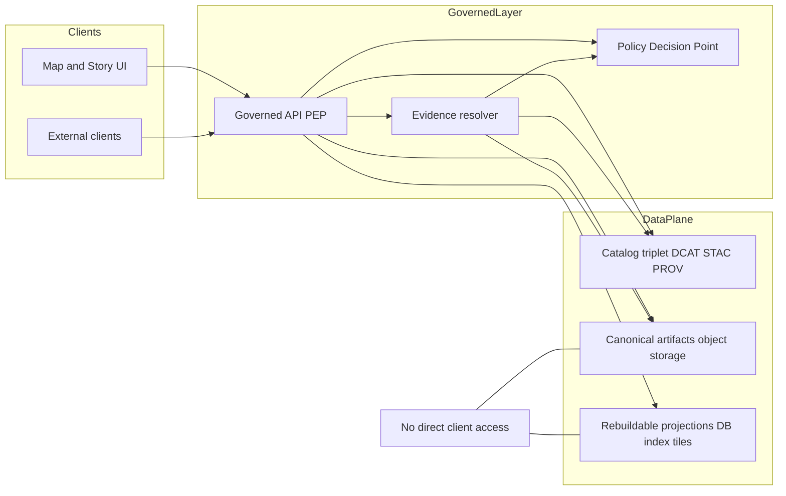
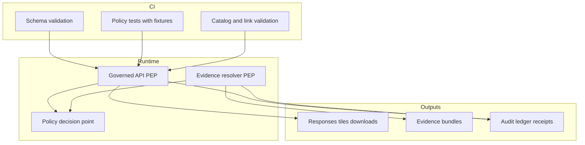

<!-- [KFM_META_BLOCK_V2]
doc_id: kfm://doc/0f35d7c2-5b3a-4e4f-8a1b-7e3e3b4b92db
title: Security and Privacy Architecture Overview
type: standard
version: v1
status: draft
owners: TBD (security + governance)
created: 2026-03-01
updated: 2026-03-01
policy_label: internal
related:
  - Kansas Frontier Matrix (KFM) - Ultimate Blueprint (Draft) Generated 2026-02-20
  - Kansas Frontier Matrix (KFM) — Definitive Design & Governance Guide (vNext)
  - Kansas Frontier Matrix (KFM) — Architecture, Governance, and Delivery Plan
tags: [kfm, architecture, security, privacy, governance, policy-as-code]
notes:
  - This doc is an overview of the KFM security/privacy model (trust membrane + policy labels + evidence resolution).
  - It intentionally omits secrets, infrastructure credentials, and operational runbooks.
[/KFM_META_BLOCK_V2] -->

# Security and Privacy

**Purpose:** Describe the *security and privacy architecture* that makes KFM “governed and evidence-first” in practice: policy labels + redaction obligations enforced end-to-end via a **trust membrane**, **policy-as-code**, and an **evidence resolver**.

---

## Navigation

- [Purpose and scope](#purpose-and-scope)
- [Non-negotiable invariants](#non-negotiable-invariants)
- [Threat model and privacy model](#threat-model-and-privacy-model)
- [Policy model](#policy-model)
- [Controls by layer](#controls-by-layer)
- [Controls by surface](#controls-by-surface)
- [Error handling](#error-handling)
- [CI gates](#ci-gates)
- [Verification checklist](#verification-checklist)
- [Appendix](#appendix)

---

## Purpose and scope

This document focuses on **architecture-level controls**—the “shape” of the system that prevents entire classes of mistakes:

- policy bypass (direct DB/object-store access),
- sensitive location leakage,
- rights/licensing violations,
- non-resolvable / unauditable citations,
- Focus Mode restricted leakage / hallucination.

### Non-goals

- This is **not** a complete security runbook (key rotation, WAF setup, vulnerability management, etc.).
- This doc does **not** define the final authentication mechanism (OIDC/OAuth, SSO, etc.). See “Unknowns to verify”.

> **WARNING**
> If you do not know a dataset’s sensitivity, rights, or privacy posture, **default-deny** and route it through governance review before promotion.

---

## Non-negotiable invariants

KFM’s security and privacy posture is built from a few hard invariants. If any are violated, governance cannot be enforced.

### Invariant 1: Trust membrane

**Rule:** Clients never access storage/DB directly. All access flows through a **governed API policy enforcement point (PEP)** and **evidence resolver**.

**Why it matters:** If a client can query storage directly, policy labels, redactions, and logging are trivially bypassed.

### Invariant 2: Policy-as-code with shared CI/runtime semantics

**Rule:** The same policy decisions (allow/deny + obligations) must be enforceable in CI *and* runtime. If CI doesn’t match runtime semantics, CI guarantees are meaningless.

### Invariant 3: Cite-or-abstain evidence resolution

**Rule:** A “citation” is not a pasted URL. It is an **EvidenceRef** that must resolve (via the evidence resolver) into an **EvidenceBundle** that is:

- policy-allowed,
- inspectable,
- provenance-linked,
- and includes digests/checksums when applicable.

If citations cannot resolve or are not allowed, the system must **abstain or narrow scope**.

---

## Threat model and privacy model

This section is a review checklist for new features and new data products.

### Primary threat classes

| Threat class | What can go wrong | Primary mitigations (architectural) |
|---|---|---|
| Policy bypass | UI or external client pulls data from DB/object store directly | Trust membrane + network policy + code review + tests |
| Restricted inference | Public user can infer existence of restricted datasets via errors/timing | Policy-safe error model; avoid differentiating 403 vs 404 based on existence |
| Sensitive location leakage | Exact coordinates exposed (archaeology, endangered species, etc.) | `restricted_sensitive_location` + generalized public derivatives + redaction tests |
| Rights/licensing violation | Media copied/exported without permission | Promotion gates require rights; metadata-only reference mode; enforced attribution |
| Focus Mode prompt injection | Retrieved docs cause Focus Mode to reveal restricted info | Tool allowlist + policy pre-checks + citation verifier + evaluation harness |
| Receipt/log leakage | Audit receipts/logs contain PII or sensitive locations | Receipt classification + redaction + access control + “structural logs only” |

### Threat model checklist (minimum)

Use this checklist when reviewing new endpoints, new UI features, or new export paths:

- [ ] **Frontend** never fetches from object storage/DB directly (trust membrane).
- [ ] Public users cannot infer restricted dataset existence via error behavior.
- [ ] Downloads/exports are checked against **policy labels** *and* **rights**.
- [ ] Focus Mode cannot be prompt-injected to bypass policy/citation gates.
- [ ] Audit logs are redacted and access-controlled.
- [ ] Pipeline credentials are scoped per source and rotated.
- [ ] Processed artifacts are immutable by digest (or equivalent).
- [ ] Policy rules are tested in CI with fixtures (deny-by-default baseline).

---

## Policy model

### Policy label vocabulary

KFM uses a controlled `policy_label` vocabulary. Minimum starter list:

- `public`
- `public_generalized`
- `restricted`
- `restricted_sensitive_location`
- `internal`
- `embargoed`
- `quarantine`

> **NOTE**
> The exact semantics of each label is governance-owned. This doc documents the *minimum expected behavior* for preventing leaks.

### Roles and responsibilities

KFM’s baseline governance posture distinguishes:

- **Public user:** can only read public artifacts/stories; Focus Mode limited to public evidence.
- **Contributor:** drafts datasets/stories; cannot publish.
- **Reviewer/Steward:** approves promotions and publishing; owns policy labels and redaction rules.
- **Operator:** runs pipelines and manages deployments; cannot override policy gates.
- **Governance council / community stewards:** authority for culturally sensitive materials; sets rules for restricted collections and public representations.

> **TIP**
> Treat policy labels and redaction/generalization rules as *governed artifacts*: code reviewed, tested, and versioned.

### Policy-as-code architecture (PDP + PEPs)

Recommended pattern:

- **Policy Decision Point (PDP):** OPA in-process or sidecar (or equivalent decision engine).
- **Policy Enforcement Points (PEPs):**
  - **CI:** schema validation + policy tests block merges.
  - **Runtime API:** policy checks before serving data.
  - **Evidence resolver:** policy checks before resolving evidence and rendering bundles.
  - **UI:** shows policy badges/notices; UI never decides.

### Default-deny + public-generalized derivatives

Baseline posture:

- Default deny for restricted and sensitive-location datasets.
- If any public representation is allowed, publish a separate `public_generalized` dataset version.
- Never leak restricted metadata in 403/404.
- Do not embed precise coordinates in Story Nodes or Focus Mode outputs unless policy explicitly allows.
- Treat redaction/generalization as a first-class transform recorded in provenance (PROV).

### Obligations (policy-driven UI and export behavior)

Policy decisions can return **obligations** (e.g., “show a notice that geometry was generalized”). Obligations are enforced at PEPs and surfaced in UI (badges, banners) and exports (attribution text, disclaimers).

---

## Controls by layer

KFM’s “truth path” lifecycle zones are security boundaries as much as data-engineering boundaries.

### Truth path security boundaries

| Zone | Security intent | Key controls (minimum) |
|---|---|---|
| Upstream | Treat upstream as untrusted input | Source allowlist; license/terms snapshot; scoped creds |
| RAW | Preserve immutable acquisition | Immutable artifacts + digests; access controlled; no public distribution |
| WORK / QUARANTINE | Transform + QA + candidate redactions | Quarantine blocks promotion; QA reports; redaction candidates |
| PROCESSED | Publishable formats | Digests for each artifact; no mutation in-place; policy label assigned |
| CATALOG | Contract surfaces (DCAT/STAC/PROV) | Include `policy_label`; validate schemas; validate cross-links |
| PUBLISHED | Governed runtime surfaces | PEP enforcement; evidence resolution; policy-safe caches; audit |

> **WARNING**
> Treat receipts, catalogs, and provenance bundles as *potentially sensitive*. They can contain URLs, row pointers, or other fields that must be redacted for public views.

---

## Controls by surface

### Governed API PEP

Minimum endpoint surface (illustrative):

- `GET /api/v1/datasets` (policy-filtered discovery; includes dataset_version_id + digests)
- `GET /api/v1/stac/collections|items` (STAC browse/query; cross-linked to DCAT/PROV)
- `POST /api/v1/evidence/resolve` (EvidenceRef -> EvidenceBundle; policy enforced)
- `GET/POST /api/v1/story` (publishing requires resolvable citations + review state)
- `POST /api/v1/focus/ask` (governed Q&A; receipt; citation verification; abstain)

**Security constraints:**

- Deny-by-default.
- Hide restricted datasets by default; filter by role.
- Caches vary by policy/auth context.
- Log only what you need to audit; redact what you don’t.

### Evidence resolver

Evidence resolution is central. The evidence resolver accepts an EvidenceRef, applies policy, and returns an EvidenceBundle:

- policy decision + label + obligations,
- license/rights metadata,
- provenance pointer(s),
- artifact digests,
- an `audit_ref` for traceability.

### UI surfaces

UI responsibilities (security relevant):

- Show policy badges/notices (but **never decide**).
- Provide one-click evidence and provenance access (evidence drawer).
- Use governed APIs only (trust membrane).

### Focus Mode (governed AI)

Treat each Focus Mode request as a governed run:

1. policy pre-check,
2. retrieval (already policy-filtered),
3. evidence bundling,
4. synthesis,
5. hard citation verification gate,
6. audit receipt.

If citations can’t be verified, the system must abstain or reduce scope.

---

## Error handling

### Policy-safe errors

Errors must not leak restricted dataset existence or sensitive metadata. In particular:

- avoid “helpful” error messages that reveal dataset slugs/IDs that the requester isn’t allowed to know,
- avoid differing 403 vs 404 semantics that let public users infer existence.

### Auditable error responses

Where feasible, errors should include an `audit_ref` (or equivalent) so stewards can trace what happened without leaking restricted details to the caller.

---

## CI gates

Security and privacy are enforced through **promotion gates** and **merge-blocking CI checks**.

### Minimum CI gates

- Schema validation for catalogs, registry entries, receipts, and stories.
- Policy tests with fixtures (deny-by-default).
- Evidence resolution tests (resolve + enforce policy; fail closed on unauthorized).
- Link validation across DCAT/STAC/PROV (broken links block merge).
- Focus Mode evaluation harness (“golden queries”) to detect regressions.

> **TIP**
> CI gates should fail closed. If the policy pack is missing, CI should deny merges rather than “skip”.

---

## Unknowns to verify in repo

This is an intentionally short list of “don’t guess” items. Convert Unknown -> Confirmed by linking to code, configs, or ADRs.

- [ ] Authentication mechanism (OIDC/OAuth2, API keys, mTLS, etc.)
- [ ] Secret management approach (Kubernetes secrets, Vault, cloud KMS, etc.)
- [ ] Encryption posture (at rest and in transit) for object storage + databases
- [ ] Rate limiting and abuse controls for Focus Mode and data exports
- [ ] Logging + retention specifics (what fields are redacted, retention periods, who can access)

---

## Verification checklist

Minimum verification steps before claiming “implemented” (or publishing externally):

- [ ] Capture repo commit hash and root directory tree.
- [ ] Confirm which trust foundation work packages exist (policy pack, validators, evidence resolver, dataset registry schema).
- [ ] Extract CI gate list from `.github/workflows` and identify merge-blocking checks.
- [ ] Pick one pilot dataset and verify end-to-end promotion through all gates with receipts and catalogs.
- [ ] Verify UI cannot bypass the PEP (static analysis + network policies) and EvidenceRefs resolve end-to-end.
- [ ] Run Focus Mode evaluation harness and store golden query outputs/diffs as artifacts.

---

## Appendix

<strong>A. Implementation reminders for security reviews</strong>

- Treat the **evidence resolver** and **policy layer** as production-critical components.
- Avoid exposing raw object-store URIs to public clients unless explicitly policy-allowed.
- Prefer “public_generalized” derivatives over conditional redaction in the same dataset version.
- Make obligations visible in UI and exports (e.g., “geometry generalized” notice).
- Redact or avoid storing PII in receipts/logs. If unavoidable, classify receipts and restrict access.

<strong>B. Reference docs (internal)</strong>

- Kansas Frontier Matrix (KFM) - Ultimate Blueprint (Draft) Generated 2026-02-20
- Kansas Frontier Matrix (KFM) — Definitive Design & Governance Guide (vNext)
- Kansas Frontier Matrix (KFM) — Architecture, Governance, and Delivery Plan

---

*Back to top:* [Security and Privacy](#security-and-privacy)
