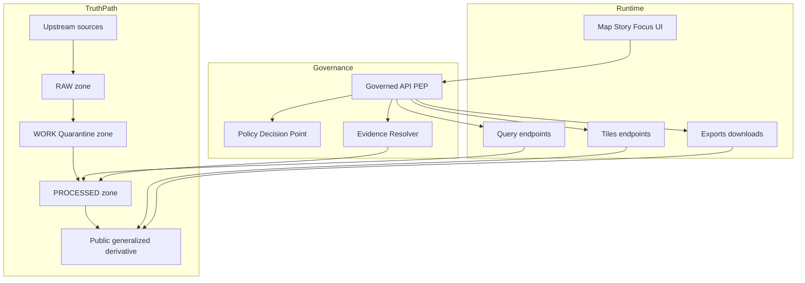

<!-- [KFM_META_BLOCK_V2]
doc_id: kfm://doc/6c5b2ed4-8e16-4f09-93a5-0fa1d4b4c8fa
title: Sensitive Locations
type: standard
version: v1
status: draft
owners: TBD
created: 2026-03-01
updated: 2026-03-01
policy_label: public
related:
  - TODO(kfm): link to trust membrane overview (policy boundary)
  - TODO(kfm): link to policy labels + obligations registry
  - TODO(kfm): link to Story Node publish gate doc
tags: [kfm, architecture, governance, sensitivity, security]
notes:
  - This document must not contain any actual sensitive coordinates, site lists, or lookup instructions.
[/KFM_META_BLOCK_V2] -->

# Sensitive Locations

**One-line purpose:** Prevent disclosure of vulnerable, private, or culturally restricted geospatial data across **pipelines → catalogs/provenance → governed APIs → Map/Story UI → Focus Mode**.


> [!WARNING]
> **Do not include precise coordinates, site identifiers, or “how to find” instructions** for sensitive locations in docs, issues, Story Nodes, Focus Mode prompts/outputs, screenshots, or test fixtures unless policy explicitly allows it.

## Quick navigation

- [Why this exists](#why-this-exists)
- [Definitions](#definitions)
- [Architecture overview](#architecture-overview)
- [Threat model](#threat-model)
- [Policy model](#policy-model)
- [Data handling patterns](#data-handling-patterns)
- [Promotion gates and tests](#promotion-gates-and-tests)
- [UI and UX requirements](#ui-and-ux-requirements)
- [Incident response and rollback](#incident-response-and-rollback)
- [Open questions](#open-questions)
- [Appendix: example artifacts](#appendix-example-artifacts)

---

## Why this exists

KFM integrates many data types that can **harm communities, ecosystems, or individuals** if locations are exposed. “Sensitive location” protection is therefore **not a UI feature**—it is a **system invariant** enforced at:

- ingestion + promotion gates (what becomes publishable),
- runtime (what can be served, tiled, exported, or cited),
- evidence resolution (what a citation can reveal),
- narrative publishing (Story Nodes),
- Focus Mode (cite-or-abstain + policy pre-checks).

### Scope

This doc defines:

- how sensitive locations are handled in the **truth path** (RAW → WORK/Quarantine → PROCESSED → CATALOG → PUBLISHED),
- where policy enforcement must occur (PEP/PDP + evidence resolver),
- how to generate **policy-safe derivatives** (e.g., `public_generalized`),
- minimum tests/gates that must fail-closed.

### Non-goals

This doc does **not** include:

- any real sensitive sites, coordinates, IDs, or partner-restricted material,
- an exhaustive legal policy,
- a substitute for steward review.

[Back to top](#sensitive-locations)

---

## Definitions

| Term | Meaning in KFM | Notes |
|---|---|---|
| **Sensitive location** | A location whose disclosure increases risk (cultural harm, looting, targeting, harassment, ecological damage, re-identification). | Examples (non-exhaustive): archaeology, endangered species, sacred/culturally restricted sites, some health/crime/ownership records. |
| **Precise dataset** | A dataset version containing high-precision geometry or attributes that can locate a sensitive feature. | Stored/served only under restricted policy and role-based controls. |
| **Public generalized derivative** | A **separate dataset version** produced specifically for public viewing/use, with geometry/attributes generalized enough to prevent reverse engineering. | Generalization is a **first-class transform** recorded in provenance. |
| **policy_label** | Primary classification input to runtime policy decisions; determines allowed audiences and required obligations. | The exact label vocabulary is governed; keep enums in a registry. |
| **Obligation** | A mandatory transform or constraint the policy engine requires before data can be served or cited. | Examples: generalize geometry, remove fields, aggregate counts, suppress small cells, add notices. |

[Back to top](#sensitive-locations)

---

## Architecture overview

Sensitive location handling relies on a strict separation:

- **Policy Decision Point (PDP):** computes allow/deny + obligations
- **Policy Enforcement Point (PEP):** blocks/filters/obligates responses at runtime
- **Evidence Resolver:** resolves EvidenceRefs into bundles **only if policy allows**, applying obligations and avoiding restricted leakage
- **UI:** displays policy badges and restriction notices; **never decides policy**



### Enforcement boundary checklist

- [ ] **Clients never read storage directly** (no direct DB/S3 access from UI).
- [ ] Tiles and exports must be served from **policy-safe artifacts** (often generalized derivatives).
- [ ] Evidence bundles must **never include restricted artifacts** for unauthorized roles.
- [ ] Error responses must **not leak restricted existence/metadata** (deny without hints).

[Back to top](#sensitive-locations)

---

## Threat model

Sensitive location leakage rarely happens in one obvious place—it happens via **side channels**.

| Leakage vector | Typical failure mode | Required mitigation |
|---|---|---|
| Tile servers | Public tiles reveal precise points/bboxes; cached tiles ignore auth | Enforce policy at tile serving; vary cache by policy/auth; “no restricted bbox leakage” tests |
| Feature inspect | Attribute payload includes exact coordinates or derived keys | Field removal obligations; schema tests for forbidden fields |
| Exports/downloads | Public export includes point geometry or address-like fields | Export profiles; policy-required field suppression |
| Evidence resolver | Citation bundle exposes restricted metadata (IDs, previews, paths) | Policy check before resolving; obligation-aware bundling; no restricted artifacts in bundles |
| Error responses | 403/404 reveals dataset exists, bbox, row counts, etc. | “Never leak restricted metadata in deny responses” |
| Audit logs/receipts | Receipts/logs contain sensitive URLs/fields | Classify receipts; redact; restrict log access; structural logging only |
| Story publishing | Story contains coordinates, map state, or screenshots revealing location | Story publish gate; review triggers; ban precise coordinates unless allowed |
| Focus Mode | Model synthesizes or repeats coordinates without permission | Policy pre-check + cite-or-abstain; citation verification gate; scope reduction/abstention |

[Back to top](#sensitive-locations)

---

## Policy model

### Defaults (fail-closed posture)

**Baseline stance:** if a dataset is sensitive-location or otherwise restricted, **default deny** unless a policy rule explicitly allows and the request context is authorized.

**Public representation rule:** if any public access is allowed, publish a **separate generalized dataset version** (often described as `public_generalized`) rather than “sometimes hiding” within the same artifact.

**No coordinate embedding rule:** do not embed precise coordinates in Story Nodes or Focus Mode outputs unless policy explicitly allows.

**Provenance rule:** record generalization/redaction as a first-class transform in provenance and release manifests.

### Suggested minimal policy outcomes

| policy_label (concept) | Default runtime outcome | Typical obligations |
|---|---|---|
| `public` | allow | attribution/license display; standard QA requirements |
| `restricted` | deny-by-default | none (because access denied) |
| `restricted_precise` (optional specialization) | allow only for privileged roles | watermarking, export controls, audit logging |
| `public_generalized` (dataset version class) | allow | geometry generalization; field suppression; aggregation thresholds; UX notice for precision loss |

> [!NOTE]
> Keep the **policy label vocabulary** and allowed obligations in a governed registry (and test it in CI). Do not “invent” labels ad hoc in pipeline code.

[Back to top](#sensitive-locations)

---

## Data handling patterns

### Pattern A — Restricted precise + public generalized derivative

**Rule of thumb:** if storing precise geometry is necessary, store it **only** in a restricted dataset; generate a **separate** public artifact with safe spatial precision.

**Implementation sketch (conceptual):**
1. Ingest precise data → store in restricted `PROC` artifacts.
2. In `WORK`, apply generalization/redaction transform → produce `public_generalized` artifacts.
3. Validate “cannot be reverse engineered” (domain-specific tests).
4. Catalog both versions with explicit policy labels and provenance links.

### Pattern B — PII / re-identification risk (aggregation thresholds)

Some location-bearing datasets are not “sensitive sites” but still allow re-identification (e.g., individual-level health/crime/property).

Minimum posture:
- do not publish individual-level records publicly,
- aggregate to safe geographies and apply minimum-count suppression thresholds,
- document thresholds as **policy obligations**,
- keep raw/precise data restricted even if aggregated outputs are public.

### Pattern C — Redaction/generalization as provenance

Generalization is not just geometry: record it as a transform that affects interpretation. Capture:

- method (grid/admin unit), parameters, and versioned specs,
- loss of precision (e.g., spatial uncertainty metadata),
- suppression rules (minimum cell count),
- any changes in counts/totals due to aggregation.

> [!TIP]
> Treat generalization like a scientific method section: if a user can’t tell what changed, they can’t trust the map.

[Back to top](#sensitive-locations)

---

## Promotion gates and tests

Sensitive-location controls must be enforced **before** anything reaches runtime surfaces.

### Required gates (minimum)

- [ ] **Sensitivity classification + redaction plan** exists (`policy_label` + obligations)
- [ ] Policy tests prove **default deny** and correct obligations
- [ ] Catalog triplet (DCAT/STAC/PROV) validates, cross-links resolve
- [ ] Tiles/exports are policy-safe (no forbidden geometry/fields)
- [ ] Run receipts + audit records exist and are appropriately classified/redacted

### “Must-have” automated checks (starter)

| Check | Fails the build when… | Where to run |
|---|---|---|
| OPA fixture tests | restricted datasets allow when they should deny; obligations missing | CI + runtime parity |
| Tile leakage test | public tiles reveal restricted bbox/precision | CI integration + canary |
| Export schema test | forbidden coordinate fields present in public export | CI |
| Evidence resolver test | restricted EvidenceRefs resolve for unauthorized contexts | CI + runtime integration |
| Story publish gate | Story includes disallowed coordinates or unresolvable citations | CI + publish workflow |
| Focus Mode gate | answer includes claims without verifiable, policy-allowed citations | Focus eval harness |

### Review triggers (human gate)

Sensitive-location publication requires steward review if any of these are true:

- first time a dataset is published publicly,
- changes in generalization method/precision,
- partner data agreements or rights uncertainties,
- UI changes that affect feature inspect, exports, or caching.

[Back to top](#sensitive-locations)

---

## UI and UX requirements

The UI is a trust surface, not a policy engine.

Minimum UX requirements:
- show **policy badges** on layers and evidence cards,
- provide clear “restricted / unavailable” states without revealing restricted metadata,
- evidence drawer must show license/version and the **reason** an item is restricted,
- for generalized data, show **precision-loss notices** (e.g., “generalized to 5 km grid” when applicable),
- Focus Mode must abstain or narrow scope when citations are not policy-allowed.

> [!WARNING]
> **Never rely on the UI to hide sensitive data.** If the API can serve it, it will leak.

[Back to top](#sensitive-locations)

---

## Incident response and rollback

Treat sensitive-location leakage as a **governance incident**.

**Immediate containment (fail closed):**
1. Disable the affected layer(s) at the PEP (deny policy) and invalidate caches.
2. Roll back the last promotion manifest for the dataset version if needed.
3. Preserve logs/receipts for stewards/operators only (avoid broader dissemination).

**Root cause analysis:**
- Was there a bypass (direct storage, static tiles)?
- Did policy fixtures/tests cover the scenario?
- Did the generalized derivative still contain precise points (hidden fields/IDs)?
- Did errors or evidence bundles leak metadata?

**Follow-up actions:**
- Add regression tests reproducing the incident.
- Update obligations and/or generalization method.
- Document steward sign-off and policy changes as governed artifacts.

[Back to top](#sensitive-locations)

---

## Open questions

These are intentionally explicit—unknowns must be resolved through governance decisions and tests.

1. **AuthN/AuthZ model:** which identity provider and role model? Is ABAC required for partner datasets?
2. **Policy label registry:** what is the authoritative enum and how is it versioned?
3. **Domain generalization guidelines:** what are the minimum safe precisions for archaeology/species/cultural sites?
4. **Cache semantics:** how do we guarantee caches vary by policy/auth and cannot be scraped?
5. **Steward workflow:** what is the “sensitive location release playbook” and where is it stored?

[Back to top](#sensitive-locations)

---

## Appendix: example artifacts

<details>
<summary><strong>Example: policy decision with obligations (illustrative)</strong></summary>

```json
{
  "decision": "allow",
  "policy_label": "public",
  "obligations": [
    {"type": "generalize_geometry", "method": "snap_to_grid", "grid_size_m": 5000},
    {"type": "remove_fields", "fields": ["geom_wkt", "lat", "lon", "address"]},
    {"type": "aggregate_min_count", "min_count": 5},
    {"type": "ux_notice", "message": "Locations generalized; do not use for site-level navigation."}
  ]
}
```
</details>

<details>
<summary><strong>Example: EvidenceBundle excerpt (illustrative)</strong></summary>

```json
{
  "bundle_id": "sha256:bundle…",
  "dataset_version_id": "2026-02.abcd1234",
  "policy": {
    "decision": "allow",
    "policy_label": "public",
    "obligations_applied": ["generalize_geometry", "remove_fields"]
  },
  "license": {"spdx": "CC-BY-4.0", "attribution": "Source org"},
  "artifacts": [
    {"href": "processed/public_generalized/events.pmtiles", "digest": "sha256:…"}
  ]
}
```
</details>

<details>
<summary><strong>Example: CI test intent (plain English)</strong></summary>

- Given `policy_label=restricted`, API endpoints:
  - must deny discovery and query for public roles,
  - must not leak metadata in the deny response.
- Given a `public_generalized` derivative:
  - tiles must not expose restricted bboxes or hidden precise points,
  - exports must not include forbidden fields.

</details>
