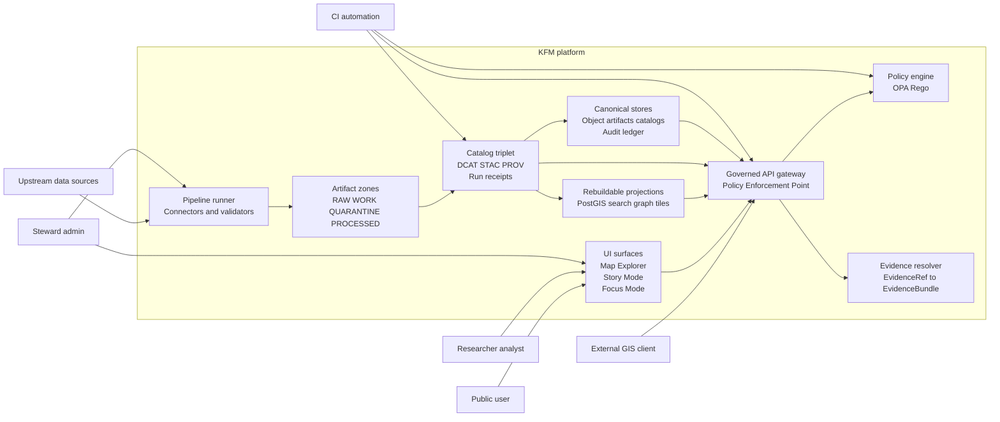
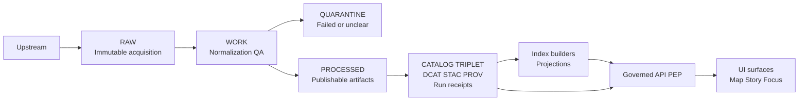

<!-- [KFM_META_BLOCK_V2]
doc_id: kfm://doc/0b2d4c4a-8c7a-4c19-b10b-2c2d78d2cb22
title: KFM system context
type: standard
version: v1
status: draft
owners: KFM Engineering
created: 2026-03-01
updated: 2026-03-01
policy_label: public
related:
  - docs/architecture/overview/system-context.md
tags: [kfm, architecture, c4, system-context, trust-membrane]
notes:
  - vNext conceptual context. Verify concrete module names/endpoints against repo + contracts before treating as implementation truth.
[/KFM_META_BLOCK_V2] -->

# KFM system context
**Purpose:** C4-style Level 1 system context for the Kansas Frontier Matrix (KFM): who/what interacts with KFM, and where the governance boundary (“trust membrane”) sits.

## Quick navigation
- [Scope](#scope)
- [System context diagram](#system-context-diagram)
- [Truth path and trust membrane](#truth-path-and-trust-membrane)
- [Actors](#actors)
- [External systems](#external-systems)
- [KFM internal building blocks](#kfm-internal-building-blocks)
- [Boundary contracts](#boundary-contracts)
- [Non-negotiable invariants](#non-negotiable-invariants)
- [Verification checklist](#verification-checklist)

---

## Scope
This document covers:
- **External actors** (users, stewards, integrators) and their goals.
- **External systems** (upstream sources, clients) and the primary interactions.
- **The KFM boundary**: what is inside KFM vs outside.
- **Governance boundary**: the trust membrane and promotion gates at a conceptual level.

This document intentionally does **not** cover:
- Component-level design (C4 Level 2+), storage schemas, or deployment topology.
- Exact repo paths or exact endpoint implementation details (those must be verified against the live repo + OpenAPI/contracts).

---

## System context diagram

> **Trust membrane:** Clients (UI and external GIS clients) never access storage/DB directly. All data access is mediated by the **Governed API (PEP)** that applies **policy decisions + redactions + evidence resolution + audit logging**.

---

## Truth path and trust membrane

### Truth path lifecycle (conceptual)

**Key idea:** “PUBLISHED” is not just a folder or a marketing label—it’s the **governed runtime surfaces** (API + UI) that are only allowed to serve dataset versions that have passed promotion gates.

### Promotion gates (why the boundary matters)
- Promotion to governed runtime is **blocked** unless minimum artifacts exist and validate (identity/versioning, license, sensitivity label + obligations, catalog triplet validity, run receipts/audit).  
- This makes governance enforceable (CI + steward sign-off), not aspirational.

---

## Actors

| Actor | What they want | Typical interactions with KFM |
|---|---|---|
| Public user | Explore map layers and claims with visible provenance | Uses Map Explorer + Stories; sees evidence drawer; receives policy-safe abstentions |
| Researcher / analyst | Ask time-aware questions; inspect evidence and lineage | Uses Focus Mode for Q&A; drills into evidence bundles + provenance |
| Steward / admin | Approve promotion, manage sensitivity, review story publishing | Uses governance tools; runs/approves promotions; reviews policy labels + obligations |
| External GIS client (optional) | Consume datasets/tiles via standard endpoints | Calls governed API endpoints; receives policy-filtered results |
| CI automation | Prevent unsafe merges/releases | Runs validators, policy tests, link checks, promotion contract tests |

---

## External systems

| External system | Relationship to KFM | Notes |
|---|---|---|
| Upstream data sources | Inputs to ingestion | Can be APIs, portals, files, remote sensing imagery, sensors |
| External GIS tooling | Optional client | Should use governed surfaces, not direct storage credentials |
| (Proposed) Identity provider | AuthN/AuthZ input | Treat as external; policy engine consumes user/role context |
| (Proposed) Observability stack | Ops telemetry | Audit logs are sensitive; enforce retention/redaction |

> **Default-deny posture:** if licensing or sensitivity is unclear at ingest time, the dataset version belongs in **QUARANTINE** until resolved.

---

## KFM internal building blocks
The vNext decomposition (conceptual) separates responsibilities so governance is testable and enforceable:

1. **Pipeline runner + connectors**: fetch/snapshot upstream, normalize, validate, write artifacts.  
2. **Artifact zones**: RAW (append-only) → WORK/QUARANTINE → PROCESSED.  
3. **Catalog triplet**: DCAT + STAC + PROV (+ run receipts) cross-linked so EvidenceRefs resolve.  
4. **Index builders (rebuildable projections)**: PostGIS/search/graph/tiles derived from canonical stores.  
5. **Policy engine**: shared semantics in CI and runtime (fixture-driven tests).  
6. **Evidence resolver**: resolves EvidenceRefs to inspectable EvidenceBundles; applies obligations.  
7. **Governed API gateway (PEP)**: the only access path for clients; policy + evidence enforced.  
8. **UI surfaces**: Map Explorer + Story Mode + Focus Mode with trust surfaces (evidence drawer, policy notices, version badges).

---

## Boundary contracts

### Catalogs as contract surfaces
KFM treats catalogs + provenance as a primary interface:
- **DCAT**: dataset-level metadata (license/rights, publisher, distributions, coverage).  
- **STAC**: asset-level spatiotemporal metadata (collections/items/assets).  
- **PROV**: lineage (entities/activities/agents) + run receipts for reproducibility.

### Governed API (PEP) — minimal surface (illustrative)
The documented v1 target set typically includes:
- `GET /api/v1/datasets` (discovery; policy-filtered)
- `GET /api/v1/stac/collections` and `GET /api/v1/stac/items` (asset browsing/query)
- `POST /api/v1/evidence/resolve` (EvidenceRef → EvidenceBundle; fail closed)
- `GET/POST /api/v1/story` (Story Nodes; publish gate requires resolvable citations + review state)
- `POST /api/v1/focus/ask` (Focus Mode; must cite-or-abstain; emits receipt/audit_ref)

> **Evidence is not “a URL.”** A citation is an **EvidenceRef** that must resolve—via the evidence resolver—into an **EvidenceBundle** that includes metadata, artifacts (policy-allowed), and provenance needed to inspect/reproduce a claim.

---

## Non-negotiable invariants
These are architecture “laws” enforced by CI + runtime checks:

| Invariant | Meaning |
|---|---|
| Truth path lifecycle | Upstream → RAW → WORK/QUARANTINE → PROCESSED → CATALOG/TRIPLET → projections → governed API → UI |
| Trust membrane | Clients never access storage/DB directly; all access goes through governed APIs applying policy, redaction, logging |
| Evidence-first UX | Every layer/claim opens into evidence: dataset version, license/rights, policy label, provenance, checksums |
| Cite-or-abstain Focus Mode | Answers cite resolvable evidence bundles or abstain; citation verification is a hard gate |
| Canonical vs rebuildable stores | Object artifacts + catalogs + audit ledger are canonical; DB/search/graph/tiles are rebuildable projections |
| Deterministic identity/hashing | Stable dataset/version IDs and digests so caching/signing/audit are reliable |

---

## Verification checklist
Before treating this diagram as “implementation truth,” attach evidence from the live repo:

- [ ] Capture commit hash + directory tree (at least `tree -L 3`).
- [ ] Confirm OpenAPI endpoints and DTOs for the governed API.
- [ ] Confirm policy pack structure and CI enforcement (default-deny + fixture tests).
- [ ] Confirm evidence resolver behavior end-to-end (resolve succeeds/fails closed).
- [ ] Run one dataset through the full promotion flow: RAW → PROCESSED → triplet → published surfaces.
- [ ] Verify the UI cannot bypass the PEP (static checks + network policy tests).

---
