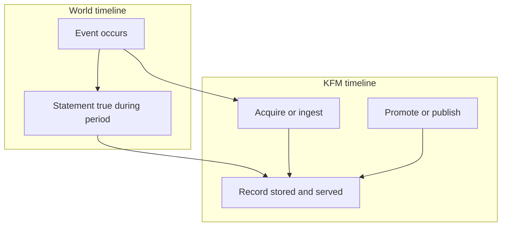

<!-- [KFM_META_BLOCK_V2]
doc_id: kfm://doc/9c1e0a55-0b0f-4c7a-9a9b-8b2b5d9edb0b
title: Time model
type: standard
version: v1
status: draft
owners: TBD (Architecture)
created: 2026-03-01
updated: 2026-03-01
policy_label: public
related:
  - docs/architecture/overview/truth-path.md # TODO confirm path
  - docs/architecture/overview/catalog-triplet.md # TODO confirm path
  - docs/contracts/api/temporal.md # TODO confirm path
tags: [kfm, architecture, time, temporal]
notes:
  - Defines event time, transaction time, and optional valid time as KFM's canonical time axes.
  - Defines how time propagates through the Truth Path and is surfaced via catalogs/APIs/UI.
[/KFM_META_BLOCK_V2] -->

# Time model
**Purpose:** Define how KFM represents, stores, queries, and visualizes time across ingestion → catalogs → governed APIs → Map/Story UI → Focus Mode.

**Owners:** TBD (Architecture)  
**Last updated:** 2026-03-01

---

## Quick navigation
- [1. Scope](#1-scope)
- [2. Canonical time axes](#2-canonical-time-axes)
- [3. Temporal types](#3-temporal-types)
- [4. How time flows through the Truth Path](#4-how-time-flows-through-the-truth-path)
- [5. Catalog mapping](#5-catalog-mapping)
- [6. Storage and query patterns](#6-storage-and-query-patterns)
- [7. API and UI semantics](#7-api-and-ui-semantics)
- [8. Governance requirements](#8-governance-requirements)
- [9. Implementation checklist](#9-implementation-checklist)
- [Appendix A: Examples](#appendix-a-examples)

---

## 1. Scope

### In scope
- The **canonical time axes** KFM uses for time-aware behavior.
- Representation guidelines (instants, intervals, granularity, uncertainty, time zones).
- How time is expressed in:
  - **Raw/Work/Processed artifacts**
  - **Catalog triplet surfaces** (DCAT / STAC / PROV)
  - **Governed APIs** and **UI** filters (time slider, “as of”, etc.)
- Governance implications: what must be present in receipts and metadata to support “cite-or-abstain”.

### Non-goals
- Picking a specific database schema, migration, or table design **unless already standardized** in repo (TBD).
- Re-specifying catalog standards (DCAT/STAC/PROV) beyond the time fields we must populate consistently.
- Defining every dataset’s time semantics (dataset-specific specs live in registry/spec docs).

---

## 2. Canonical time axes

KFM is **time-aware** by design. Practically, time is not “one timestamp”—KFM needs (at least) two and sometimes three independent axes.

### 2.1 Event time (REQUIRED when applicable)
**Definition:** *When something happened* in the observed world.

**Examples**
- Sensor reading timestamp (a precipitation observation at a station).
- Incident occurrence time (a tornado touchdown time).
- Remote sensing acquisition time (satellite scene timestamp).

**Rule of thumb**
- If your record is fundamentally an observation/event, **event time is the primary filter** for user queries.

---

### 2.2 Transaction time (REQUIRED)
**Definition:** *When KFM acquired and/or published the record* (system-of-record timeline).

Transaction time supports:
- “What did we know when?”
- Reproducibility and auditability across pipeline runs, approvals, and promotions.

**Rule of thumb**
- If two versions disagree, transaction time tells you which state was available at a given point in KFM history.

---

### 2.3 Valid time (OPTIONAL but critical for “state” history)
**Definition:** *When a statement is considered true* in the modeled world (often a span).

This is needed when a record expresses a **state** that is effective over a period (not a single event), especially when the record can be corrected retroactively.

**Examples**
- Administrative boundary changes (effective date ranges).
- A policy designation that is in force for a period.
- A classification product with a temporal extent.

---

### 2.4 Relationship between axes
Event time and valid time describe “the world”.  
Transaction time describes “KFM’s knowledge of the world”.

---

## 3. Temporal types

### 3.1 Instants vs intervals
KFM must support both:
- **Instant**: a single moment (e.g., 2026-03-01T12:00:00Z)
- **Interval**: a start and end (e.g., [2026-01-01, 2026-02-01))

**Recommended invariant (PROPOSED):** use **half-open intervals** `[start, end)` everywhere to avoid overlap ambiguity.

### 3.2 Granularity and uncertainty
Not all sources provide “seconds in UTC”.

**Recommended fields (PROPOSED)**
- `time_granularity`: `year | month | day | hour | minute | second`
- `time_uncertainty`: optional quantitative or categorical indicator

**Why:** UI/Focus Mode should not imply precision that does not exist.

### 3.3 Time zones
**Recommended invariant (PROPOSED):**
- Store all instants as **UTC** (`Z`) at rest.
- Preserve original source timezone/offset in metadata when relevant.
- Convert to user locale only at presentation boundaries (UI).

### 3.4 Open intervals
Valid-time often has “until changed”.

**Recommended representation (PROPOSED):**
- Use an open-ended interval end (`NULL` or database infinity) for “ongoing”.

---

## 4. How time flows through the Truth Path

Time must remain coherent across:
- RAW (immutable acquisition)
- WORK (transforms)
- PROCESSED (publishable outputs)
- CATALOG (DCAT/STAC/PROV contract surfaces)
- PUBLISHED (governed runtime)

**Operational invariant (PROPOSED):**
- Every promoted artifact MUST have a **declared temporal extent**, expressed consistently in catalogs and queryable via APIs.

### 4.1 Minimal temporal payload per record type (PROPOSED)
| Record type | Event time | Valid time | Transaction time |
|---|---:|---:|---:|
| Observation (sensor) | ✅ required | ◻ optional (often same as event) | ✅ required |
| Incident/event | ✅ required | ◻ optional | ✅ required |
| State (boundary/admin) | ◻ optional | ✅ required | ✅ required |
| Remote sensing asset/item | ✅ typical (acquisition) | ◻ optional (extent) | ✅ required for KFM publication history |
| Narrative claim (story/evidence) | ◻ optional | ✅ often (claimed period) | ✅ required for system provenance |

---

## 5. Catalog mapping

Catalogs are contract surfaces between pipelines and runtime. Time must be carried through them without guessing.

### 5.1 STAC
**Minimum (PROPOSED, aligned to STAC conventions):**
- For Items:
  - If the item is instantaneous: `datetime`
  - If it spans time: `start_datetime` + `end_datetime`
- For Collections:
  - Temporal extent in the Collection extent.

### 5.2 DCAT
**Minimum (PROPOSED):**
- `dct:temporal` must reflect dataset-level temporal coverage (and be consistent with STAC collection temporal extent where both exist).

### 5.3 PROV
**Minimum (PROPOSED):**
- Activities (runs) must carry run start/end times.
- Entities (artifacts) should link to activities with timestamps sufficient to reproduce “what was produced when”.

---

## 6. Storage and query patterns

> This section provides implementation guidance. Confirm actual storage choices in repo before enforcing.

### 6.1 Recommended column shapes (PROPOSED)
For bitemporal “state” modeling:
- `valid_start`, `valid_end`
- `txn_start`, `txn_end`
- plus payload columns

For pure “event” modeling:
- `event_time`
- `txn_start`, `txn_end`

### 6.2 Query semantics to support (PROPOSED)
KFM should be able to answer:
- **Effective-at** queries (event/valid timeline): “What was true at time T?”
- **As-of** queries (transaction timeline): “What did KFM know as of time T?”
- **Bitemporal** queries: “What was true at valid time Tv, as recorded at transaction time Tt?”

### 6.3 Indexing (PROPOSED)
- Index event time for event-heavy tables (range scan friendly).
- Index valid-time ranges for state tables (overlap queries).
- Index txn-time ranges for “as-of” queries and reproducibility.

---

## 7. API and UI semantics

### 7.1 Canonical filters (PROPOSED)
- `time=` or `event_time=`: filters on event time (or valid time depending on dataset type)
- `effective_at=`: explicit valid-time query instant
- `as_of=`: transaction-time query instant

### 7.2 UI time slider (PROPOSED)
- Default slider drives **event time** (or valid time for state datasets).
- Provide an advanced “As of” control (transaction time) for audits and reproducibility.
- Respect granularity: if a dataset is weekly, don’t render daily ticks as if meaningful.

### 7.3 Policy obligations affecting time (PROPOSED)
Policies may require:
- time generalization (e.g., day-level instead of minute-level)
- time redaction (remove timestamps entirely)
- explanation in UX (“time has been generalized due to policy obligations”)

---

## 8. Governance requirements

### 8.1 Promotion Contract hooks (PROPOSED)
A dataset/version must not be promoted unless:
- Its temporal semantics are declared (event vs valid vs both).
- Its catalogs reflect temporal extents consistently.
- Run receipts include acquisition and publish times to support transaction-time reasoning.

### 8.2 Cite-or-abstain implications (PROPOSED)
Any user-facing time-bound claim must be traceable to:
- a catalog entry (DCAT/STAC temporal metadata),
- a run receipt (PROV activity timestamps),
- and underlying evidence where applicable.

---

## 9. Implementation checklist

### 9.1 Must-haves (PROPOSED)
- [ ] Define a shared `TemporalAxes` type for domain models and contracts.
- [ ] Require per-dataset declaration: is the primary axis event time or valid time?
- [ ] Ensure catalogs contain:
  - [ ] STAC item `datetime` OR `start_datetime` + `end_datetime`
  - [ ] STAC collection temporal extent
  - [ ] DCAT `dct:temporal`
  - [ ] PROV run timestamps
- [ ] Ensure governed APIs can filter by primary time axis.
- [ ] Add regression tests for:
  - [ ] temporal extent consistency across DCAT/STAC
  - [ ] deterministic “as_of” query behavior

---

## Appendix A: Examples

### A.1 Sensor observation (event-centric)
- **Event time:** observation timestamp
- **Transaction time:** ingest/publish timestamp
- **Valid time:** usually not needed (or equals event time)

### A.2 Boundary change (valid-time-centric)
- **Valid time:** effective start/end
- **Transaction time:** when KFM recorded/published the boundary version
- **Event time:** optional (often the enactment moment, if modeled)

### A.3 Bitemporal question
> “What boundary did we believe was effective on 2020-01-01, according to KFM as of 2023-06-01?”

This requires **valid time** (effective date) + **transaction time** (as-of knowledge date).

---

## Appendix B: Notes on status
- **CONFIRMED**: the 3-axis framing is adopted in KFM blueprint materials.
- **PROPOSED**: specific column names, API parameters, and index strategies must be verified against repo conventions before enforcing.

----
_Back to top_: [Time model](#time-model)
